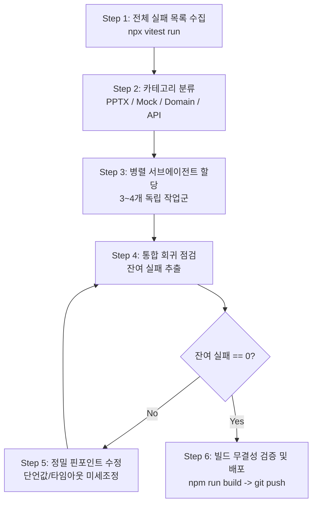

# CRE 대량 테스트 수정 워크플로우 (v2)

## 언제 사용하는가

- 파이프라인 리팩토링, 온톨로지 마이그레이션, 정책 변경 후 대량의 테스트(10건 이상)가 실패할 때
- "어디서부터 손대야 할지 모를 정도로" 실패 건수가 많을 때
- 단위/통합/E2E 테스트의 회귀 베이스라인을 빠르게 0 실패로 복원해야 할 때

## 핵심 원칙

1. **테스트 스위트 분할 정복**: 실패한 테스트들을 파일 의존성이 겹치지 않는 카테고리별로 분할하여 독립적인 서브에이전트에 할당합니다.
2. **Goldilocks 16면 절삭 인식 (Rule 24)**: 슬라이드 수 단언 시 특정 optional 슬라이드(DCF, loan, rentRoll 등) 존재 단언을 피하고, protected 슬라이드나 `toBeGreaterThanOrEqual`을 사용합니다.
3. **Grade D 전면 차단 (Rule 10)**: Grade D는 모든 tier에서 `[G30]` 예외를 발생시키므로 `expect().toThrow('[G30]')`으로 단언합니다.
4. **Mock LLM / 네트워크 격리 인식**: CI/Mock 환경에서 실제 외부 API(JUSO, V-World, Kakao, OpenAI) 호출이 차단되거나 지연되지 않도록 `vi.mock`을 철저히 확인합니다.
5. **산출물 단언 우선 원칙 (Rule 6)**: 문장을 단언하지 않고, 구조·수치·게이트만 단언합니다.

## 표준 복구 6단계 절차



### Step 1: 전체 실패 목록 수집
- PowerShell 환경에서 전체 vitest 실행 후 파일별 실패 내역을 파싱합니다:
  ```powershell
  npx vitest run 2>&1 | Out-File test-run-failures.txt -Encoding utf8
  ```
- 실패 요약(FAILED lines)과 에러 메시지를 확인합니다.

### Step 2: 카테고리별 분류
실패를 파일 경합이 없는 3~4개 독립 카테고리로 묶습니다:
1. **PPTX 슬라이드 수 / Goldilocks / 등급 정책**: `pptx-stress-matrix.test.ts`, `p1-gate-logic.test.ts` 등
2. **Mock 데이터 체인 / PII / 토큰**: Supabase mock 체인(`.from().select().eq().order`), OCR 마스킹 정규식
3. **도메인 / 수치 앵커 / 포스처별 게이트**: `stage1/2/3`, `data-contract`, `archetype` 관련
4. **외부 네트워크 의존 테스트**: `gov-premium-apis`, `market-crawlers` (vi.mock 추가 필요)

### Step 3: 병렬 서브에이전트 배치
- 각 서브에이전트에 **명시적 파일 목록**을 할당하여 파일 수정 충돌을 방지합니다.
- 프롬프트에 구체적인 에러 현상, 원인 분석, 변경 지침을 포함합니다.
- 서브에이전트 작업 완료 후 `manage_subagents`를 통해 결과를 수신합니다.

### Step 4 & 5: 잔여 실패 핀포인트 수정
- 남은 소수(1~3건) 실패는 상호작용 또는 경계 조건 이슈일 가능성이 높으므로 메인 에이전트가 직접 수정합니다:
  * 슬라이드 수 동률(`16 >= 16`) 이슈 → `toBeGreaterThanOrEqual`
  * 무거운 PPTX 렌더 타임아웃 → 30,000ms ~ 60,000ms 명시적 타임아웃 부여 (Rule 25)
  * TypeScript 구문 에러(`as const` 등)

### Step 6: 빌드 및 배포 무결성 검증
- 0 failed 달성 후 즉시 커밋하지 않고, 반드시 빌드를 수행합니다:
  ```powershell
  npm run build
  ```
- 빌드 통과 시 임시 출력 파일을 삭제하고, 일괄 커밋 및 푸시하여 Vercel 배포를 트리거합니다.
