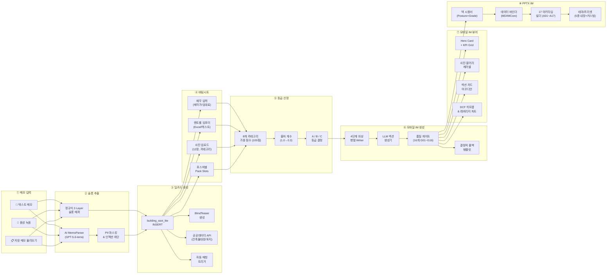
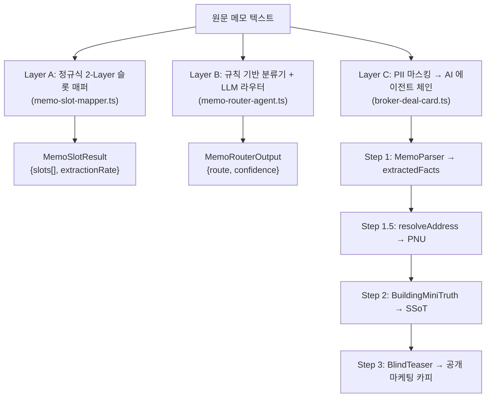
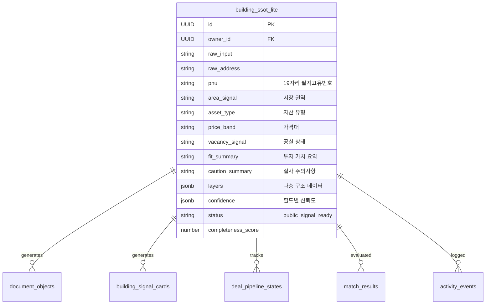
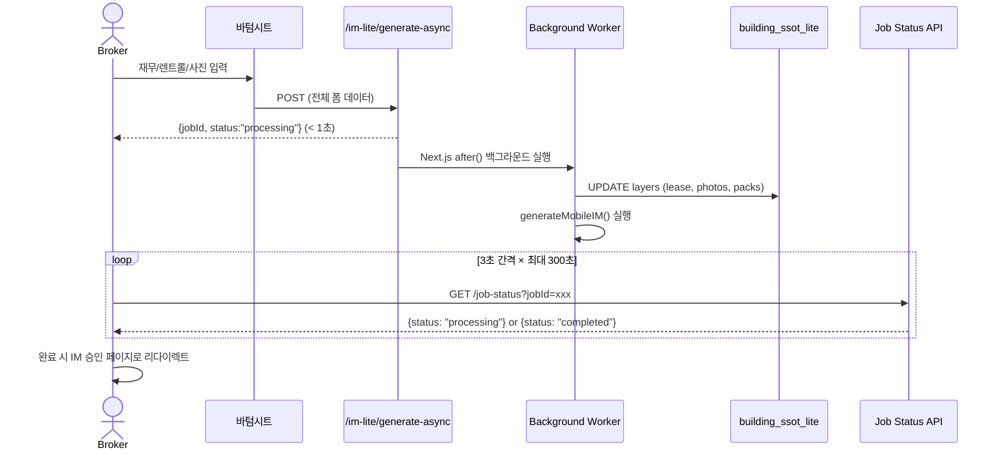

# 📋 CREDEAL 메모→딜카드→바텀시트→모바일IM→PPTX IM 파이프라인 기능 명세서

> **문서 ID**: `DOC-TEST0825-PIPELINE-SPEC`  
> **생성 일시**: 2026-08-25 08:25 (KST)  
> **감사 대상**: 메모 입력 → 슬롯 추출 → 딜카드 생성 → 바텀시트 데이터 입력 → 등급 산정 → 모바일 IM 생성 → PPTX IM 렌더링 전체 파이프라인  
> **감사 범위**: 50+ 소스 파일, API 엔드포인트, Supabase 테이블, AI 에이전트 체인, 품질 게이트

---

## 📑 목차

1. [파이프라인 총괄 아키텍처](#1-파이프라인-총괄-아키텍처)
2. [Stage 1: 메모 입력 & 슬롯 추출](#2-stage-1-메모-입력--슬롯-추출)
3. [Stage 2: 딜카드 생성 & SSoT 데이터 모델](#3-stage-2-딜카드-생성--ssot-데이터-모델)
4. [Stage 3: 바텀시트 IM 데이터 입력](#4-stage-3-바텀시트-im-데이터-입력)
5. [Stage 4: 데이터 품질 등급 시스템](#5-stage-4-데이터-품질-등급-시스템)
6. [Stage 5: 모바일 IM 콘텐츠 생성](#6-stage-5-모바일-im-콘텐츠-생성)
7. [Stage 6: 모바일 IM 웹 뷰어 렌더링](#7-stage-6-모바일-im-웹-뷰어-렌더링)
8. [Stage 7: PPTX IM 렌더링 & 내보내기](#8-stage-7-pptx-im-렌더링--내보내기)
9. [전체 파일 인벤토리](#9-전체-파일-인벤토리)

---

## 1. 파이프라인 총괄 아키텍처



### 1.1 기술 스택 요약

| 계층 | 기술 | 역할 |
|---|---|---|
| 프레임워크 | Next.js 16.2.6 (Vercel Pro, `maxDuration=300`) | 서버리스 API, RSC, 스트리밍 |
| AI / LLM | Vercel AI SDK + OpenAI (`gpt-5.6-terra` / `gpt-4o`) | 메모 파싱, 섹션 생성, 품질 심사 |
| 데이터베이스 | Supabase (PostgreSQL + Storage) | SSoT, 프리셋, 이미지, PPTX 버퍼 |
| 프레젠테이션 | `pptxgenjs` v4.0.1 | PPTX 슬라이드 프로그래밍 생성 |
| 이미지 처리 | `sharp` v0.33.5 | JPEG 최적화, 지도 합성 |
| 음성 인식 | Web Speech API + Whisper(폴백) | 한국어 음성 → 텍스트 |

---

## 2. Stage 1: 메모 입력 & 슬롯 추출

### 2.1 입력 채널 3종

| 채널 | 컴포넌트 | 경로 |
|---|---|---|
| **텍스트 메모** | `<Textarea>` (최대 3,000자) | [`deal-card/new/page.tsx`](file:///c:/Users/User/cre-dealcard/src/app/(broker)/broker/deal-card/new/page.tsx) |
| **음성 녹음** | `VoiceRecorder` (Web Speech API + Whisper 폴백) | [`VoiceRecorder.tsx`](file:///c:/Users/User/cre-dealcard/src/components/memo/VoiceRecorder.tsx) |
| **저장 메모** | `MemoImportModal` (메모 보관함) | [`MemoImportModal.tsx`](file:///c:/Users/User/cre-dealcard/src/components/broker/deal-card/MemoImportModal.tsx) |

### 2.2 하이브리드 3-Tier 슬롯 추출 전략



#### Layer A: 정규식 슬롯 매퍼

| 우선순위 | 패턴 유형 | 신뢰도 | 예시 |
|---|---|---|---|
| 1 (최고) | 총액 요약 블록 | 0.95 | `보증금 총액 15억`, `월 임대수입 총액 3,200만원` |
| 2 | 개별 호실 단위 | 0.70~0.85 | `301호 월세 120만원`, `보증금 5천만원` |
| 3 | 일반 물리/재무 | 0.60~0.80 | `연면적 420평`, `준공 2018년`, `용적률 399%` |

#### Layer C: AI 에이전트 체인 (3단계)

| 단계 | 에이전트 | 모델 | 입력 | 출력 |
|---|---|---|---|---|
| Step 1 | `MemoParser` | `gpt-5.6-terra` | PII 마스킹된 메모 | `MemoParserOutput` (40+ 구조화 슬롯) |
| Step 1.5 | `resolveAddress` | 주소 API | 주소 후보 | PNU, 좌표 |
| Step 2 | `BuildingMiniTruth` | `gpt-5.6-terra` | 파싱 결과 | `BuildingMiniTruthOutput` (SSoT 포맷) |
| Step 3 | `BlindTeaser` | `gpt-5.6-terra` | MiniTruth | 공개 블라인드 카드 (가드레일 적용) |

### 2.3 PII 마스킹 체계 (`memo-sanitizer.ts`)

| 민감정보 유형 | 마스킹 토큰 | 예시 |
|---|---|---|
| 주민등록번호 | `[RRN_A]` | `850101-1234567` → `[RRN_A]` |
| 이메일 | `[EMAIL_A]` | `kim@naver.com` → `[EMAIL_A]` |
| 전화번호 | `[PHONE_A]` | `010-1234-5678` → `[PHONE_A]` |
| 건물 번호·도로명 상세 | `[ADDR_DETAIL_A]` | `123-45번지` → `[ADDR_DETAIL_A]` |
| 소유주 이름 | `[OWNER_A]` | `김OO` → `[OWNER_A]` |
| 임차인 사명 | `[TENANT_A]` | `㈜스타벅스` → `[TENANT_A]` |
| 건물 고유명 | `[BLDG_NAME_A]` | `XX타워` → `[BLDG_NAME_A]` |

### 2.4 추출 슬롯 전체 목록

| 슬롯명 | 타입 | 추출원 | 설명 |
|---|---|---|---|
| `exactAddressCandidate` | `string` | Regex + LLM | 도로명/지번 주소 |
| `region` / `areaSignal` | `string` | Regex + LLM + 온톨로지 | 정규화된 CRE 시장 권역 (e.g. 성수권역) |
| `assetType` | `enum` (17종) | Regex + LLM | 근생빌딩, 사무용빌딩, 물류센터, 호텔 등 |
| `investmentPosture` | `enum` (5종) | LLM | `income` / `owner_occupied` / `development` / `operating` / `trading` |
| `askingPriceKrw` | `number` (원) | Regex + LLM | 매각 희망가 |
| `monthlyRentKrw` | `number` (원) | Regex + LLM | 월 임대수입 총액 |
| `totalDepositKrw` | `number` (원) | Regex + LLM | 보증금 총액 |
| `loanAmountKrw` | `number` (원) | Regex + LLM | 기존 대출 잔액 |
| `totalFloorAreaPyung` | `number` (평) | Regex + LLM | 연면적 |
| `landAreaPyung` | `number` (평) | Regex + LLM | 대지면적 |
| `buildYear` | `number` | Regex | 준공연도 |
| `floorsAboveGround` / `Underground` | `number` | Regex | 층수 (지상/지하) |
| `vacancyRatePct` | `number` (%) | Regex + LLM | 공실률 |
| `capRatePct` | `number` (%) | Regex + 역산 | 연 순수익률 |
| `tenantNames` | `string[]` | LLM | 임차인 상호 (마스킹) |
| `sellerMotivationText` | `string` | LLM | 매도 사유 (자동 마스킹) |
| `hospitalitySignals` | `object` | LLM | 객실수, ADR, OCC, GOP마진, 운영모델 |
| `developmentSignals` | `object` | LLM | 대지면적(평), 용적률, 건폐율, 평당공사비 |
| `tradingSignals` | `object` | LLM | 평당가, 시세, 보유기간 |
| `ownerOccupiedSignals` | `object` | LLM | 자가사용 의향, 현 임차료 |

---

## 3. Stage 2: 딜카드 생성 & SSoT 데이터 모델

### 3.1 딜카드 생성 API 플로우

```
POST /api/broker/deal-card/from-memo
  │
  ├── 1. requireBroker(req)              → 인증 검증
  ├── 2. validateMemoQuality(memo)       → 품질 게이트 (위치·수치·자산유형 필수)
  ├── 3. sanitizeComplianceText(memo)    → 준법 텍스트 소독
  ├── 4. extractSlotsFromMemo(memo)      → 정규식 슬롯 추출
  ├── 5. checkDuplicateBeforeCreation()  → PNU/지번 중복 검사 (409 응답)
  ├── 6. brokerDealCardFromMemo()        → 3단계 AI 에이전트 실행
  │       ├── MemoParser → 구조화
  │       ├── resolveAddress → PNU 확정
  │       ├── BuildingMiniTruth → SSoT 정규화
  │       └── BlindTeaser → 공개 마케팅 카피
  ├── 7. classifyDealArchetype()         → 아키타입 분류
  ├── 8. validateAssetConstraints()      → 자산 제약 검증
  ├── 9. after(() => runAutoMatch())     → 비동기 자동 매칭
  └── 10. after(() => verifyPublicData()) → 비동기 공공데이터 검증
```

### 3.2 SSoT 핵심 데이터 모델 (`building_ssot_lite`)



#### `layers` JSONB 구조

| 레이어 키 | 주요 필드 | 용도 |
|---|---|---|
| `layers.finance` | `asking_price_krw`, `monthly_rent_krw`, `total_deposit_krw`, `loan_amount_krw` | 재무 핵심 지표 |
| `layers.lease_summary` | `total_deposit_krw`, `monthly_rent_krw`, `tenants[]` | 임대차 요약 |
| `layers.location` | `address`, `pnu`, `coordinates: {lat, lng}` | 위치 정보 |
| `layers.photos` | `Array<{url, type, label}>` | 건물 사진 |
| `layers.building_register` | FAR, BCR, 준공일, 주차 | 공공 API 검증 데이터 |
| `layers.pack_slots` | `HospitalitySpec`, `DevelopmentPlan`, `OccupancyPlan` 등 | 포스처별 특화 데이터 |

### 3.3 딜카드 페이지 구조

```
딜카드 관리 페이지 (/broker/deal-card/[id])
├── 헤더: 뒤로가기 + DealCardActionsMenu
├── 타이틀: 권역 + 자산유형 + 블라인드 배지
├── LiveDealCardPreviewCard (OG 미리보기)
├── DealCardEditor (인라인 카피 수정)
├── 4탭 컨테이너 (DealCardTabs):
│   ├── Tab 1: 개요
│   │   ├── DealCardPipelineContainer (파이프라인 단계)
│   │   ├── Photo Gallery Carousel
│   │   ├── BuildingSignalEditor (인라인 수정)
│   │   ├── Caution Points Card
│   │   └── Hidden Fields Card
│   ├── Tab 2: IM
│   │   ├── ImManagementPanel (등급, 점수, 생성/재생성)
│   │   └── Boundary Disclaimer
│   ├── Tab 3: 매수자
│   │   ├── IdealBuyerPersonaSection (AI 타깃 페르소나)
│   │   ├── MatchedBuyersSection (자동 매칭 결과)
│   │   └── GateRequestsInbox (접근 요청 수신함)
│   └── Tab 4: 분석
│       ├── DealPredictionSection (계약 확률)
│       ├── ScheduleSection (일정)
│       └── Owner Report Link
└── 하단 3열 액션바:
    ├── KakaoShareButton
    ├── CreateMobileImButton → 바텀시트 열기
    └── AiMatchCtaButton
```

---

## 4. Stage 3: 바텀시트 IM 데이터 입력

### 4.1 바텀시트 개요

- **컴포넌트**: [`im-data-bottom-sheet.tsx`](file:///c:/Users/User/cre-dealcard/src/app/(broker)/broker/deal-card/%5Bid%5D/im-data-bottom-sheet.tsx)
- **렌더링**: React Portal → `document.body`
- **티어 모드**: `basic` (필수 재무+사진) / `pro` (상세 렌트롤, 비교거래, 부채, Pack Slots)

### 4.2 서브 컴포넌트

| 컴포넌트 | 기능 |
|---|---|
| **주소 검색 & PNU 자동완성** | 도로명·지번 자동 매칭, 19자리 PNU 자동 부착 |
| **렌트롤 임포터** (`RentRollImporter`) | Excel/CSV 파싱 (`xlsx` 라이브러리), 한국어 헤더 자동 감지 (10행 스캔), 열 매핑 (층/업종/보증금/월세/관리비/공실/면적/계약일), 원↔만원 자동 감지 |
| **사진 업로더** (`image-compressor.ts`) | 최대 12장, 클라이언트 Canvas 리사이즈 (1920px, JPEG 0.82), 카테고리 태깅 (8종), 히어로 커버 선택, PPTX 외관 선택 |

### 4.3 전체 입력 필드 목록

| 섹션 | 필드 | 타입 | 프리필 |
|---|---|---|:---:|
| **소재지** | 주소 / PNU | `string` | ✅ |
| **재무** | 월 임대료 총액 | 만원 | ✅ |
| | 보증금 총액 | 만원 | ✅ |
| | 관리비 총액 (Pro) | 만원 | ✅ |
| | 매각 희망가 | 만원 | ✅ |
| | Cap Rate 역산기 | 계산 모달 | - |
| | 대출 상태 (Pro) | enum | ✅ |
| | 대출 금액 (Pro) | 만원 | ✅ |
| | 비임대 부가수입 (Pro) | Array | - |
| | 유사 건물 실거래가 (Pro) | Array | - |
| **임대** | 공실률 | % | ✅ |
| | 호실별 렌트롤 | Array (RentRollImporter) | - |
| **사진** | 건물 사진 & 분류 | Array (12장, 8개 카테고리) | ✅ |
| **물류센터** | 천장고/도크수/바닥하중 | 조건부 | - |
| **운영형** | 객실수/ADR/OCC/GOP | 조건부 | - |
| **개발형** | 목표연면적/예상공사비/명도/인허가 | 조건부 | - |
| **자가사용** | 입주인원/1인당면적/희망층 | 조건부 | - |
| **중개코멘트** | 한줄 코멘트 | `string` | - |

### 4.4 데이터 플로우: 바텀시트 → IM 생성



---

## 5. Stage 4: 데이터 품질 등급 시스템

### 5.1 등급 엔진 (`grade-engine.ts`)

100점 만점, 8개 가중 카테고리로 산출:

| 카테고리 | 가중치 | 평가 항목 |
|---|:---:|---|
| `lease_roll` (임대차) | **25%** | 렌트롤 테이블, 연간 총수입, 임차인 상세 |
| `building_basic` (건물 기본) | **15%** | 연면적, 준공일, 명도 상태, 층수 |
| `land_parcel` (토지) | **15%** | PNU, 지번, 대지면적, 공시지가 |
| `financial_input` (재무) | **15%** | 매각가, 대출/부채 |
| `zoning` (용도지역) | **10%** | 용도지역, 용적률 여유분 |
| `title_encumbrance` (등기) | **10%** | 근저당, 유치권, 소유권 부담 |
| `road_access` (도로 접면) | **5%** | 도로 접면 유형, 주차 용량 |
| `market_comp` (비교사례) | **5%** | 유사 거래 벤치마크 |

### 5.2 출처 품질 계수 (Provenance Coefficient)

| 출처 | 계수 | 설명 |
|---|:---:|---|
| `public_data` (건축물대장/토지이용계획 API) | **1.00** | 공공 검증 데이터 |
| `expert_verified` (전문가/평가사 실사) | **0.95** | 전문가 확인 |
| `seller_declared` (소유주 확인) | **0.65** | 매도인 고지 |
| `broker_input` (중개사 수동 입력) | **0.60** | 중개인 입력 |
| `ai_inferred` (AI 추론/가설) | **0.30** | AI 추정 |

### 5.3 등급 기준 & 임계값

| 등급 | 점수 범위 | 핵심 요건 | 해금 기능 |
|---|:---:|---|---|
| **A** | ≥ 75% | 고수준 슬롯 커버리지 + `income`/`operating` 포스처는 **구조화 렌트롤 필수** (미충족 시 B캡) | 풀 DCF 민감도 분석, IRR, 프리미엄 IM 내보내기 |
| **B** | 40%~74% | 핵심 건물·토지·재무 입력 충족 | 표준 모바일 IM & PPTX 생성 |
| **C** | < 40% | 기본 메모/가설 수준 | 데이터 보강 경고 배너, DCF/총수익 분석 억제 |

---

## 6. Stage 5: 모바일 IM 콘텐츠 생성

### 6.1 비동기 생성 파이프라인

```
POST /api/broker/im-lite/generate-async
  → after() 백그라운드 실행
    → generateMobileIMHandler()
      → buildIMContext()           // SSoT 정규화, RAG 컨텍스트
      → generateMobileIM()         // 4단계 Writer 실행
        → Stage 1 (병렬): 독립 섹션 7~8개
        → Stage 2 (순차): 재무 분석 5개
        → Stage 3 (순차): 리스크 체크
        → Stage 4 (순차): 투자 논거
      → runPublishGates()          // 16개 품질 게이트
      → runCrossValidator()        // 수치 교차 검증
      → persistDocument()          // Supabase document_objects 저장
      → persistLeaseUnits()        // SSoT 역동기화
```

### 6.2 15개 섹션 유형

| 포스처 | 섹션 구성 (7개) | 강조 섹션 (2× 토큰 예산) |
|---|---|---|
| **income** | property_overview, location_access, lease_status, income_analysis, risk_check, investment_thesis, next_steps | `lease_status`, `income_analysis` |
| **owner_occupied** | property_overview, location_access, occupancy_fit, cost_comparison, risk_check, investment_thesis, next_steps | `occupancy_fit`, `cost_comparison` |
| **development** | property_overview, location_access, site_analysis, development_feasibility, risk_check, investment_thesis, next_steps | `site_analysis`, `development_feasibility` |
| **operating** | property_overview, location_access, operation_overview, gop_analysis, risk_check, investment_thesis, next_steps | `operation_overview`, `gop_analysis` |
| **trading** | property_overview, location_access, market_position, comparable_analysis, risk_check, investment_thesis, next_steps | `market_position`, `comparable_analysis` |

### 6.3 섹션 생성 10단계 파이프라인 (per section)

| 단계 | 처리 | 목적 |
|---|---|---|
| 1 | 포스처별 재무 계산 | Cap Rate, NOI, 레버리지 수익률 |
| 2 | Few-Shot 골든 IM 블록 | 품질 기준선 제공 |
| 3 | 시스템 프롬프트 조립 | Core + 포스처 용어집 + 오버레이 |
| 4 | 유저 프롬프트 조립 | 미션, SSoT, 외부 데이터, 앵커 |
| 5 | LLM 호출 | `gpt-5.6-terra`, temp 0.3 |
| 6 | **할루시네이션 탐지** | 가격 20×/면적 10× 이탈 감지 |
| 7 | **LLM-as-Judge** | 5차원 평가 (사실성/재무/규제/투자가치/근거). < 3.0이면 폴백 |
| 8 | **결정적 렌트롤 주입** | LLM 테이블을 정규화된 결정적 테이블로 교체 |
| 9 | **용어/법적 할루시네이션 소독** | 갱신요구권 오류, 무단 브랜드명 제거 |
| 10 | **가드레일 실행** | RiskBoundary → CREQualityGate → DisclosureGuard |

### 6.4 품질 게이트 (G01~G16)

생성 완료 후 16개 발행 게이트를 순차 평가하여 `publishBlocked` 여부를 결정합니다.

---

## 7. Stage 6: 모바일 IM 웹 뷰어 렌더링

### 7.1 뷰어 컴포넌트 트리

```
MobileIMViewer (mobile-im-viewer.tsx)
├── Sticky Top Bar
│   ├── "IM 보관함" 뒤로가기
│   ├── "📄 IM Lite" 타이틀 배지
│   ├── ShareButton (Web Share API)
│   └── Section Progress Dots (IntersectionObserver)
├── Hero Header
│   ├── Badges (자산유형, 권역, 규모)
│   ├── 건물 블라인드 명칭 (h1)
│   ├── 품질 등급 배지 (A/B/C/D)
│   ├── Price Band 표시
│   └── 리드 카피
├── HeroCard (hero-card.tsx)
│   ├── 2×2 Dynamic Metric Grid (포스처 적응)
│   ├── 3 Key Investment Points
│   ├── Key Risk Box
│   └── 10Y NPV Badge + SSoT 준비도 Progress Bar
├── PhotoGallery
│   ├── 수평 스냅 스크롤 캐러셀 (최대 12장 + 지도)
│   ├── KakaoStaticMap / OSM 타일 렌더러
│   └── 전체화면 터치 스와이프 라이트박스
├── Section Cards (아코디언)
│   ├── SectionCard × 7개
│   │   └── MarkdownRenderer → InlineMarkdown / TableFromLines
│   ├── DCFHeatmap (Income A등급 전용)
│   ├── LeverageChart (SVG 도넛 차트)
│   ├── Mid-stream CTA (3번째 섹션 후)
│   └── End-stream CTA (브로커 직접 연결)
├── Broker Profile Section (FlatProfileCard)
├── Disclaimer Box
└── FloatingActionBar (공유, 프리셋, 문의)
```

### 7.2 마크다운 → HTML 변환

경량 커스텀 React 컴포넌트 사용 (외부 마크다운 라이브러리 미사용):

| 컴포넌트 | 역할 |
|---|---|
| `MarkdownRenderer` | 라인 분할, 테이블·헤더·인용·불릿·번호 리스트 파싱 |
| `TableFromLines` | 반응형 HTML `<table>` 생성, 셀 포맷팅 |
| `InlineMarkdown` | 인라인 볼드/이탤릭/이미지/링크 변환 |
| `sanitizeHtml` | `<script>`, `on*`, `javascript:` URL 차단 (화이트리스트 태그만 허용) |

---

## 8. Stage 7: PPTX IM 렌더링 & 내보내기

### 8.1 PPTX 렌더링 파이프라인

```
GET /api/public/im-lite/[buildingId]/pptx
  → MobileImPptxRenderer.render(input)
    → getPptxThemeAsync(presetId)      // 3-Tier 프리셋 로딩
    → withThemeIsolation(theme, ...)   // 스레드 안전 테마 격리
    → resolvePhotos() + planGallerySlides()  // 사진 분석 & 갤러리 기획
    → buildDeckSequence(posture, grade, tier, flags)  // 슬라이드 시퀀스
    → bindSectionData() / bindFromIMCore()   // 데이터 바인딩
    → ARCHETYPE_REGISTRY[A01~A17]     // 아키타입 빌더 실행
    → addFallbackContent()            // 미렌더링 폴백
    → validateTextBudgets()           // 텍스트 예산 검증
    → PptxGenJS.write() → Buffer     // PPTX 바이너리 생성
    → Supabase Storage 업로드         // Signed URL 발급
```

### 8.2 덱 시퀀서 매트릭스

| 등급 | 슬라이드 수 | 시퀀스 |
|---|:---:|---|
| **D** | 3~5 | A01 Cover → [A14 Gallery] → A02 Summary → A09 Process → A10 Closing |
| **B/C** | 7~13 | A01 → [A14] → A02 → A06 Location → 포스처 본문(2~3) → A07 Risk → A15 Thesis → A09 → A10 |
| **A** | 최대 24 | A01 → [A14] → A02 → A06 → A04 Land → A04 Building → 포스처 심층(4~6) → A05 DCF → A05 민감도 → A08 대출 → A08 세금 → A15 → A07 → A09 → A10 |

### 8.3 17개 아키타입 슬라이드 요약

| 코드 | 슬라이드명 | 레이아웃 | 핵심 콘텐츠 |
|---|---|---|---|
| A01 | 표지 | 전면 다크 | 커버 스타일 5종, 40pt 타이틀, 매각가 하이라이트 |
| A02 | 핵심 지표 | 라이트 | 2~4열 KPI 카드 + 3개 투자 포인트 |
| A03 | 대형 테이블 | 라이트 | 렌트롤/비교사례, 스마트 컬럼 너비, 최대 12행 |
| A04 | 비대칭 7:5 | 라이트 | 좌7.5" 제원 행 + 수직 brass선 + 우4.2" 사진/콜아웃 |
| A05 | 비대칭 7:4 | 라이트 | 3열 KPI 그리드 + 가치제안 배너 |
| A06 | 입지 지도 | 라이트 | 좌5.6" 지도 + 우6.1" 입지 속성 |
| A07 | 리스크 3블록 | 라이트/다크 | 법적·임대·물리 3카드 + 고지 바 |
| A08 | 이중 테이블 | 라이트 | 좌7.3" 2개 테이블 + 우4.5" 콜아웃 |
| A09 | 진행 절차 | 라이트 | 3~4단계 프로세스 카드 + 화살표 |
| A10 | 마감 | 다크 | 프로세스 바 + Provenance 레전드 + 면책 |
| A11 | 호실 사양 | 라이트 | 호실 테이블 + 2×2 통계 + 위반 경고 |
| A12 | 소유 구조 | 라이트 | 소유권 테이블 + 콜아웃 |
| A13 | 운영 KPI | 라이트 | KPI 행 + 통계 카드 |
| A14 | 사진 갤러리 | 라이트 | 6종 토폴로지, 최대 4슬라이드 |
| A15 | 투자 논거 | 라이트 | 1×3 / 2×2 필러 + 벤치마크 + Takeaway |
| A16 | 자본 구조 | 라이트/다크 | 취득비용 분해 + LTV 시나리오 |
| A17 | 준공전 마케팅 | 라이트/다크 | 스태킹 플랜 + 규제 완화 카운트다운 |

### 8.4 프리셋 시스템 (5종 내장)

| 프리셋 | 악센트 | 커버 스타일 | 레이아웃 | 타깃 |
|---|---|---|---|---|
| `golden_institutional` | `#B98A2E` Brass | 기하 블록 | classic | 기관투자·패밀리오피스 |
| `credeal_signature` | `#6B8E00` Lime | 좌우 분할 | modern | 표준 세일즈 덱 |
| `executive_gold` | `#B8862D` Gold | 히어로 다크 | executive | 임원·트로피 자산 |
| `corporate_clean` | `#059669` Emerald | 플로팅 카드 | minimal | ESG·테크 캠퍼스 |
| `pro_dark_obsidian` | `#0284A8` Cyan | 글로우 | dramatic | 물류·데이터센터 |

---

## 9. 전체 파일 인벤토리

### 9.1 메모 & 슬롯 추출

| 파일 | 역할 |
|---|---|
| `src/app/(broker)/broker/deal-card/new/page.tsx` | 딜카드 생성 페이지 |
| `src/components/memo/UniversalMemoFAB.tsx` | 범용 메모 FAB |
| `src/components/memo/VoiceRecorder.tsx` | 음성 녹음기 |
| `src/components/memo/MemoResultSheet.tsx` | 결과 시트 |
| `src/domain/building/memo-slot-mapper.ts` | 정규식 슬롯 매퍼 |
| `src/ai/agents/memo-router-agent.ts` | 메모 라우터 에이전트 |
| `src/ai/sanitizer/memo-sanitizer.ts` | PII 마스킹 |
| `src/ai/agents/broker-deal-card.ts` | AI 에이전트 체인 |
| `src/ai/schemas/broker-deal-card.ts` | Zod 스키마 |

### 9.2 딜카드 & SSoT

| 파일 | 역할 |
|---|---|
| `src/app/api/broker/deal-card/from-memo/route.ts` | 딜카드 생성 API |
| `src/domain/building/broker-deal-card.ts` | 오케스트레이터 |
| `src/app/(broker)/broker/deal-card/[id]/page.tsx` | 딜카드 관리 페이지 |
| `src/lib/ssot-adapter.ts` | SSoT 어댑터 |
| `src/domain/asset/grade-engine.ts` | 등급 엔진 |

### 9.3 바텀시트 & IM 생성

| 파일 | 역할 |
|---|---|
| `src/app/(broker)/broker/deal-card/[id]/im-data-bottom-sheet.tsx` | 바텀시트 |
| `src/components/broker/rent-roll-importer.tsx` | 렌트롤 임포터 |
| `src/lib/image-compressor.ts` | 이미지 압축 |
| `src/app/api/broker/im-lite/generate-async/route.ts` | 비동기 생성 API |
| `src/app/api/broker/im-lite/generate/handler.ts` | 생성 핸들러 |
| `src/domain/building/mobile-im/writer.ts` | 4단계 Writer |
| `src/domain/building/mobile-im/im-section-generator.ts` | 섹션 생성기 |
| `src/domain/building/mobile-im/im-context-builder.ts` | 컨텍스트 빌더 |
| `src/domain/building/mobile-im/section-catalog.ts` | 섹션 카탈로그 |
| `src/domain/building/mobile-im/archetype-registry.ts` | 아키타입 레지스트리 |
| `src/domain/building/mobile-im/narrative-prompt.ts` | 시스템 프롬프트 |
| `src/domain/building/mobile-im/posture-prompts.ts` | 포스처 오버레이 |

### 9.4 모바일 IM 웹 뷰어

| 파일 | 역할 |
|---|---|
| `src/app/(public)/im-lite/[buildingId]/page.tsx` | 뷰어 페이지 |
| `src/app/(public)/im-lite/[buildingId]/mobile-im-viewer.tsx` | 뷰어 클라이언트 |
| `src/app/(public)/im-lite/[buildingId]/hero-card.tsx` | 히어로 카드 |
| `src/app/(public)/im-lite/[buildingId]/dcf-heatmap.tsx` | DCF 히트맵 |
| `src/app/(public)/im-lite/[buildingId]/leverage-chart.tsx` | 레버리지 차트 |

### 9.5 PPTX IM 렌더링

| 파일 | 역할 |
|---|---|
| `src/domain/building/mobile-im/pptx/pptx-renderer.ts` | 메인 렌더러 |
| `src/domain/building/mobile-im/pptx/deck-sequencer.ts` | 덱 시퀀서 |
| `src/domain/building/mobile-im/pptx/data-binder.ts` | 데이터 바인더 |
| `src/domain/building/mobile-im/pptx/imlib.ts` | 컴포넌트 라이브러리 |
| `src/domain/building/mobile-im/pptx/pptx-theme.ts` | 테마 & 프리셋 |
| `src/domain/building/mobile-im/pptx/gallery-planner.ts` | 갤러리 플래너 |
| `src/domain/building/mobile-im/pptx/text-budget.ts` | 텍스트 예산 |
| `src/domain/building/mobile-im/pptx/basis-enforcer.ts` | 재무 기준 강제 |
| `src/domain/building/mobile-im/pptx/provenance-mapper.ts` | 출처 매퍼 |
| `src/domain/building/mobile-im/pptx/archetypes/*.ts` | A01~A17 빌더 17개 |

---

*본 문서는 메모 입력부터 PPTX IM 내보내기까지 전체 파이프라인 50+ 소스 파일의 코드베이스 정밀 감사를 통해 작성된 기능 명세서입니다.*
