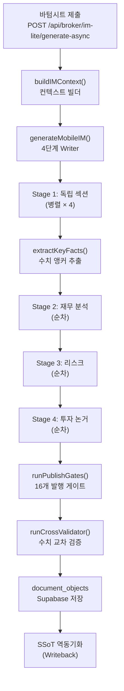
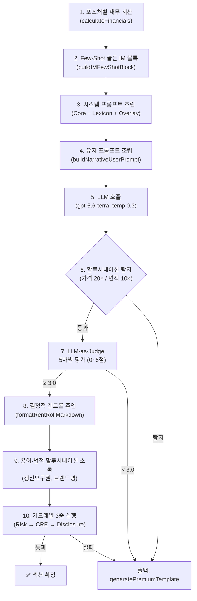

# 📱 CREDEAL 모바일 IM 섹션 콘텐츠 생성 & 렌더링 스펙

> **문서 ID**: `DOC-TEST0825-MOBILE-IM-SPEC`  
> **생성 일시**: 2026-08-25 08:28 (KST)  
> **감사 대상**: `src/domain/building/mobile-im/` 전체 + `src/app/(public)/im-lite/` 웹 뷰어  
> **감사 범위**: Writer 파이프라인, 섹션 생성기, 프롬프트 아키텍처, 품질 게이트, 아키타입 분류, 컨텍스트 빌더, 웹 뷰어 렌더링 컴포넌트

---

## 📑 목차

1. [콘텐츠 생성 파이프라인 개요](#1-콘텐츠-생성-파이프라인-개요)
2. [4단계 위상 병렬 Writer](#2-4단계-위상-병렬-writer)
3. [섹션 카탈로그 & 포스처 시스템](#3-섹션-카탈로그--포스처-시스템)
4. [섹션 생성기 (im-section-generator)](#4-섹션-생성기)
5. [프롬프트 아키텍처](#5-프롬프트-아키텍처)
6. [품질 게이트 & 안전장치](#6-품질-게이트--안전장치)
7. [컨텍스트 빌더](#7-컨텍스트-빌더)
8. [투자 아키타입 시스템](#8-투자-아키타입-시스템)
9. [웹 뷰어 렌더링 상세](#9-웹-뷰어-렌더링-상세)
10. [Writer 출력 포맷](#10-writer-출력-포맷)

---

## 1. 콘텐츠 생성 파이프라인 개요

모바일 IM은 브로커가 수집한 매물 데이터를 AI가 CRE 전문 투자 분석 보고서로 변환하는 콘텐츠 생성 엔진입니다.



---

## 2. 4단계 위상 병렬 Writer

### 2.1 함수 시그니처

```typescript
// src/domain/building/mobile-im/writer.ts
export async function generateMobileIM(
  input: MobileIMWriterInput
): Promise<MobileIMWriterOutput>
```

### 2.2 단계별 실행 구조

| 단계 | 실행 모드 | 섹션 | 의존성 |
|---|---|---|---|
| **Stage 1** | `Promise.allSettled` (동시성 4) | `property_overview`, `location_access`, `lease_status`, `next_steps`, `site_analysis`, `occupancy_fit`, `operation_overview`, `market_position` | 없음 — 스냅샷 컨텍스트 사용 |
| | ↓ `extractKeyFactsFromMarkdown` | 가격, 면적, 퍼센트 등 수치 앵커를 `ctx.sectionCtx.keyFacts`에 전파 | |
| **Stage 2** | 순차 | `income_analysis`, `development_feasibility`, `gop_analysis`, `cost_comparison`, `comparable_analysis` | Stage 1 수치 앵커 필요 |
| **Stage 3** | 순차 | `risk_check` | Stage 1~2 재무 출력 필요 |
| **Stage 4** | 순차 | `investment_thesis` (+ 가치제안 테이블 통합) | 전 단계 완료 필요 |

### 2.3 출력 정렬 (CANONICAL_ORDER)

생성 순서와 무관하게 최종 섹션 배열은 `CANONICAL_ORDER`에 따라 정렬됩니다:

```
property_overview → location_access
→ [lease_status | site_analysis | occupancy_fit | operation_overview | market_position]
→ [income_analysis | development_feasibility | gop_analysis | cost_comparison | comparable_analysis]
→ risk_check → investment_thesis → next_steps
```

---

## 3. 섹션 카탈로그 & 포스처 시스템

### 3.1 5개 투자 포스처별 7개 섹션 매트릭스

| # | 섹션 유형 | `income` | `owner_occupied` | `development` | `operating` | `trading` |
|---|---|:---:|:---:|:---:|:---:|:---:|
| 1 | `property_overview` | ✅ | ✅ | ✅ | ✅ | ✅ |
| 2 | `location_access` | ✅ | ✅ | ✅ | ✅ | ✅ |
| 3a | `lease_status` | ✅ | - | - | - | ✅ |
| 3b | `occupancy_fit` | - | ✅ | - | - | - |
| 3c | `site_analysis` | - | - | ✅ | - | - |
| 3d | `operation_overview` | - | - | - | ✅ | - |
| 3e | `market_position` | - | - | - | - | ✅ |
| 4a | `income_analysis` | ✅ | - | - | - | - |
| 4b | `cost_comparison` | - | ✅ | - | - | - |
| 4c | `development_feasibility` | - | - | ✅ | - | - |
| 4d | `gop_analysis` | - | - | - | ✅ | - |
| 4e | `comparable_analysis` | - | - | - | - | ✅ |
| 5 | `risk_check` | ✅ | ✅ | ✅ | ✅ | ✅ |
| 6 | `investment_thesis` | ✅ | ✅ | ✅ | ✅ | ✅ |
| 7 | `next_steps` | ✅ | ✅ | ✅ | ✅ | ✅ |

### 3.2 강조 섹션 (2× 토큰 예산)

| 포스처 | 강조 섹션 1 | 강조 섹션 2 |
|---|---|---|
| `income` | `lease_status` | `income_analysis` |
| `owner_occupied` | `occupancy_fit` | `cost_comparison` |
| `development` | `site_analysis` | `development_feasibility` |
| `operating` | `operation_overview` | `gop_analysis` |
| `trading` | `market_position` | `comparable_analysis` |

---

## 4. 섹션 생성기

### 4.1 Per-Section 10단계 실행 파이프라인



### 4.2 LLM 설정

| 항목 | 값 |
|---|---|
| **기본 모델** | `gpt-5.6-terra` (`process.env.AI_IM_MODEL \|\| getModel("terra")`) |
| **Temperature** | `0.3` (금융 보고서용 저랜덤성) |
| **Max Tokens** | 섹션별 동적 (강조 섹션 2× 예산) |
| **System Prompt** | `MOBILE_IM_NARRATIVE_CORE` + `POSTURE_LEXICONS` + `POSTURE_OVERLAYS` |

### 4.3 LLM-as-Judge 5차원 평가

| 차원 | 가중치 | 평가 기준 |
|---|:---:|---|
| `factual_accuracy` | 0.25 | SSoT 수치와 일치 여부, 허위 사실 |
| `financial_soundness` | 0.20 | Cap Rate·NOI·LTV 계산 정확성, 역레버리지 경고 |
| `regulatory_compliance` | 0.25 | 한국 부동산 법규 준수 (상임법, 건축법) |
| `investor_value` | 0.15 | 투자 의사결정에 유용한 인사이트 |
| `data_grounding` | 0.15 | 공공 데이터/실측 기반 근거 제시 |

- **< 3.0**: 결정적 템플릿으로 폴백
- **≥ 4.5**: 골든 셋(Few-Shot 학습 데이터) 후보

---

## 5. 프롬프트 아키텍처

### 5.1 시스템 프롬프트 계층 구조

```
┌─────────────────────────────────────────────┐
│  MOBILE_IM_NARRATIVE_CORE                   │
│  • CRE 투자 전략가 페르소나                   │
│  • 2~4 문장 서사 규칙                         │
│  • 결론 선행 (So What?) 원칙                  │
│  • "100% 보장" 등 수익률 보증 표현 금지       │
│  • 페르소나 격리 (연령/성별/계층 언급 금지)    │
├─────────────────────────────────────────────┤
│  POSTURE_LEXICONS (용어 표준화)              │
│  • 연 순수익률(Cap Rate)                      │
│  • 순영업수익(NOI)                            │
│  • 실질 영업이익(GOP)                         │
│  • 인테리어 지원금(TI) / 렌트프리(무상임대)   │
│  • 사옥 단독 명칭 표기(간판 설치권)           │
├─────────────────────────────────────────────┤
│  POSTURE_OVERLAYS (포스처별 강조 지시)        │
│  • income: Net Equity + 월 현금흐름           │
│  • owner_occupied: 10년 임차 vs 매입           │
│  • development: 잔여 용적률 + 평당 건축비      │
│  • operating: GOP 마진 + RevPAR/ADR            │
│  • trading: 비교사례 할인율 + 플립 IRR          │
└─────────────────────────────────────────────┘
```

### 5.2 유저 프롬프트 구성 (`buildNarrativeUserPrompt`)

| 구성 요소 | 내용 |
|---|---|
| 섹션 미션 | 해당 섹션의 생성 목표 정의 |
| SSoT Lite JSON | 건물 물리/재무/위치 정규화 데이터 |
| 공공 등기부 데이터 | 건축물대장, 토지이용계획 API 결과 |
| 사전 계산 재무 테이블 | Cap Rate, NOI, LTV, 현금흐름 마크다운 |
| 수치 앵커 & 전파된 Facts | 이전 섹션에서 추출된 핵심 수치 |
| RAG 법률/시장 컨텍스트 | Supabase 벡터 검색 기반 지역 시세/판례 |
| Few-Shot 골든 IM 예시 | 우수 품질 IM 블록 샘플 |

---

## 6. 품질 게이트 & 안전장치

### 6.1 섹션 레벨 안전장치

| 장치 | 파일 | 기능 |
|---|---|---|
| **할루시네이션 가드** | `im-section-generator.ts` | 생성 가격이 매각가 대비 20× 초과 또는 0.05× 미만 시 차단, 면적 10× 이탈 시 차단 |
| **LLM-as-Judge** | `im-judge.ts` | 5차원 0~5점 평가, < 3.0이면 폴백 |
| **결정적 렌트롤 주입** | `im-section-generator.ts` | LLM 생성 테이블을 `normalizeFloorLeases` + `formatRentRollMarkdown`의 결정적 테이블로 교체 |
| **앵커 임차인 소독** | `im-section-generator.ts` | 미입력 브랜드명(스타벅스, 맥도날드, 올리브영) 무단 삽입 제거 |
| **CRE 품질 게이트** | `cre-quality-gate.ts` | 투자 보증, 법적 단언 의미 평가. 고위험 시 AI 텍스트 차단 → 템플릿 폴백 |

### 6.2 문서 레벨 발행 게이트 (G01~G16)

`quality-gates-v02.ts`의 16개 게이트를 순차 평가:

| 게이트 그룹 | 검사 항목 | 차단 시 |
|---|---|---|
| **데이터 무결성** | 가격 아웃라이어, 면적 비정상, 0원 임대료 | `publishBlocked = true` |
| **PII 누출** | 개인정보(주민번호, 전화번호, 이름) 잔존 | 자동 마스킹 또는 차단 |
| **규제 준수** | 위험 표현(확정수익, 투자보증), 비인가 금융상품 언급 | 텍스트 교체 또는 차단 |
| **수치 교차** | 섹션 간 가격/면적/수익률 불일치 | 경고 또는 차단 |

### 6.3 교차 검증기 (`cross-validator.ts`)

모든 섹션의 수치를 앵커 값(매각가, 연면적, NOI, Cap Rate)과 대조하여 ±15% 이상 괴리 시 경고/교정합니다.

---

## 7. 컨텍스트 빌더

### 7.1 함수 시그니처

```typescript
// src/domain/building/mobile-im/im-context-builder.ts
export async function buildIMContext(
  input: MobileIMWriterInput
): Promise<IMGenerationContext>
```

### 7.2 컨텍스트 구축 플로우

| 단계 | 함수 | 입력 → 출력 |
|---|---|---|
| 1 | `normalizeSsotLite()` | DB 컬럼 → `assetIdentity`, `physicalFact`, `marketLocation`, `buyerFit`, `flat` 정규화 객체 |
| 2 | `buildProvenanceMap()` | 필드별 출처 매핑 (`public_data` / `broker_input` / `ai_inferred` / `expert_verified`) |
| 3 | 값 추출 | `parsePriceBandKrw()`, 총 면적, 건물 연식(`useAprDay`), 공실률 파싱 |
| 4 | `computeValueAddScenarios()` | 가치제고 시나리오 계산 (리모델링, 임대료 조정, 공실 흡수) → 마크다운 테이블 |
| 5 | `numericalAnchors` | 핵심 수치 잠금: `totalAreaSqm`, `vacancyPct`, `monthlyRentKrw`, `capRateBase`, `buildingAge` |
| 6 | `generateRAGContext()` | Supabase 벡터 검색 → 지역 시세/법적 판례 |
| 7 | 프롬프트 선택 | `CrePromptRegistry` → 활성 시스템 프롬프트 버전 + 포스처 오버레이 |

---

## 8. 투자 아키타입 시스템

### 8.1 Income 포스처 4개 아키타입 (R-INC)

| 코드 | 이름 | 톤 | 서사 핵심 | 트리거 조건 |
|---|---|---|---|---|
| `R-INC-01` | **안정형** (Stable) | `predictability` | 예측 가능한 현금흐름 | 확장 여지 없음 ∧ 신축(≤10년) ∧ 임대료 상한 |
| `R-INC-02` | **갭 투자형** (Rent Gap) | `opportunity` | 시세 대비 저임대료 → 인상 여지 | 현재 임대료 ≥ 시세 15% 이하 |
| `R-INC-03` | **공실 해소형** (Turnaround) | `turnaround` | 공실 해소 시 수익률 상승 | 공실률 > 15% |
| `R-INC-04` | **리모델링형** (Renovation) | `renovation` | 노후 건물 리모델링 가치 재창출 | 건물 연식 > 20년 |

### 8.2 비소득 포스처 아키타입

| 코드 | 이름 | 포스처 | 트리거 |
|---|---|---|---|
| `OO-01` | 사옥 이전형 | `owner_occupied` | 자가사용 의향 |
| `DEV-01` | 개발 사업형 | `development` | 잔여 용적률 > 30% |
| `OP-01` | 운영 수익형 | `operating` | 운영 시설 |
| `TR-01` | 시세 차익형 | `trading` | 트레이딩 목적 |

### 8.3 자동 감지 로직 (`suggestArchetype`)

```typescript
export function suggestArchetype(dealFacts: {
  vacancyPct: number;
  buildingAge: number;
  rentGapPct?: number;
  farRemainder?: number;
  posture?: string;
}): ArchetypeSuggestion {
  // 비소득 포스처 우선 판별
  if (posture === 'owner_occupied') return { primary: 'OO-01' };
  if (posture === 'development')    return { primary: 'DEV-01' };
  if (posture === 'operating')      return { primary: 'OP-01' };
  if (posture === 'trading')        return { primary: 'TR-01' };

  // Income 포스처 우선순위 사다리
  if (vacancyPct >= 15)                    return { primary: 'R-INC-03' };  // 공실 해소
  if (buildingAge >= 20)                   return { primary: 'R-INC-04' };  // 리모델링
  if (rentGapPct && rentGapPct >= 15)      return { primary: 'R-INC-02' };  // 임대료 갭
  return { primary: 'R-INC-01' };  // 기본: 안정형
}
```

---

## 9. 웹 뷰어 렌더링 상세

### 9.1 라우트 & 서버 렌더링

| 항목 | 값 |
|---|---|
| **경로** | `/im-lite/[buildingId]` |
| **서버 컴포넌트** | [`page.tsx`](file:///c:/Users/User/cre-dealcard/src/app/(public)/im-lite/%5BbuildingId%5D/page.tsx) |
| **데이터 페칭** | `fetchIMData(buildingId, docId)` — Supabase 직접 접근 (서버리스 자기참조 방지) |
| **클라이언트 컴포넌트** | `<MobileIMViewer document={data} buildingId={buildingId} />` |

### 9.2 컴포넌트 트리 상세

#### ① Sticky Top Bar

| 요소 | 기능 |
|---|---|
| Back Link | "IM 보관함" 뒤로가기 |
| Title Badge | "📄 IM Lite" 문서 유형 표시 |
| ShareButton | Web Share API / Clipboard 복사 |
| Section Progress Dots | `IntersectionObserver` 기반 활성 섹션 하이라이트 |

#### ② Hero Header

| 요소 | 렌더링 |
|---|---|
| Badges | 자산유형, 권역, 규모 — 필 배지 |
| Building Name | 블라인드 명칭 `<h1>` |
| Quality Badge | A/B/C/D 등급 배지 (색상 분화) |
| Price Band | 가격대 표시 (e.g. "80억대") |
| Lead Copy | 리드 서사 카피 |

#### ③ HeroCard (`hero-card.tsx`)

```
┌──────────────────────────────────────┐
│  2×2 Dynamic Metric Grid             │
│  ┌────────┐ ┌────────┐              │
│  │매각가   │ │수익률  │              │ ← 포스처 적응형 지표
│  └────────┘ └────────┘              │
│  ┌────────┐ ┌────────┐              │
│  │자기자본 │ │WALE   │              │
│  └────────┘ └────────┘              │
├──────────────────────────────────────┤
│  3 Key Investment Points             │
│  ① 강남 역세권 프라임 입지            │ ← 번호 카드
│  ② 안정적 임차인 구성                 │
│  ③ 토지가액비율 우수                  │
├──────────────────────────────────────┤
│  ⚠️ Key Risk Box                     │
│  위반건축물 이력 확인 필요            │
├──────────────────────────────────────┤
│  10Y NPV Badge │ SSoT 준비도 ████▓░░│
└──────────────────────────────────────┘
```

#### ④ PhotoGallery

| 기능 | 구현 |
|---|---|
| 수평 스냅 스크롤 | CSS `scroll-snap-type: x mandatory` 캐러셀 |
| 지도 슬라이드 | KakaoStaticMap / OSM 3×3 서브픽셀 타일 합성 |
| 라이트박스 | 전체화면 터치 스와이프 모달 |
| 최대 장수 | 12장 사진 + 1장 지도 |

#### ⑤ Section Cards (아코디언)

| 기능 | 구현 |
|---|---|
| SectionCard | 아코디언 접기/펼치기, Provenance 배지, 확인 배지 |
| MarkdownRenderer | 경량 커스텀 React (외부 MD 라이브러리 미사용) |
| DCFHeatmap | Income A등급 전용 — 할인율/성장률 매트릭스 히트맵 |
| LeverageChart | SVG 도넛 차트 (자기자본/부채/보증금 비율) |
| Mid-stream CTA | 3번째 섹션 후 삽입 — 관심 표명 & 상세 요청 |
| End-stream CTA | 마지막 — Private IM 요청 & 브로커 직접 통화 |

#### ⑥ 하단 고정 영역

| 요소 | 기능 |
|---|---|
| Broker Profile | `FlatProfileCard` — 중개사 프로필·사진·소속 |
| Disclaimer | 표준 CRE 법적 면책 고지 |
| FloatingActionBar | 공유, 프리셋 선택, 문의 |
| IMInquiryBottomSheet | Private IM 요청 모달 |

### 9.3 마크다운 → HTML 변환 체계

| 컴포넌트 | 처리 대상 | 변환 방식 |
|---|---|---|
| `MarkdownRenderer` | `##` 헤더, `>` 인용, `- ` 불릿, `1. ` 번호, `\|` 테이블 | 라인 분할 → 패턴 매칭 → React 요소 |
| `TableFromLines` | 마크다운 테이블 라인 | 반응형 `<table>` + 셀 포맷팅 |
| `InlineMarkdown` | `**bold**`, `*italic*`, ``, `[text](url)` | 인라인 HTML 변환 |
| `sanitizeHtml` | `<script>`, `on*`, `javascript:` | 화이트리스트 태그만 허용 (`a`, `strong`, `em`, `img`, `br`) |

---

## 10. Writer 출력 포맷

### 10.1 `MobileIMWriterOutput` 인터페이스

```typescript
export interface MobileIMWriterOutput {
  sections: MobileIMSection[];          // 7개 섹션 배열
  boundary_note: string;                // 법적 경계 면책 고지
  generated_at: string;                 // ISO 8601 생성 시각
  ai_used: boolean;                     // AI 사용 여부
  heroCard?: HeroCardData;              // 히어로 카드 데이터
  photos?: Array<{
    url: string;
    caption?: string;
    width?: number;
    height?: number;
  }>;
  dcf10Year?: Record<string, unknown>;  // 10년 DCF 시나리오
  financials?: {
    equityRequired: number | null;      // 순자기자본
    totalDepositBil: number | null;     // 보증금 총액 (억)
    loanAmountBil: number | null;       // 대출 총액 (억)
    leveragedYield: number | null;      // 레버리지 수익률
    wacc: number | null;               // 가중평균자본비용
  };
  publishBlocked?: boolean;             // 발행 차단 여부
  publishBlockReasons?: string[];       // 차단 사유 목록
}
```

### 10.2 `MobileIMSection` 구조

```typescript
export interface MobileIMSection {
  section_type: string;                 // e.g. "property_overview"
  title: string;                        // 섹션 한국어 제목
  content: string;                      // 마크다운 본문
  confidence?: string;                  // 데이터 신뢰도 레벨
  provenance?: ProvenanceKind;          // 출처 등급
  tables?: ParsedTable[];               // 구조화 테이블
  metrics?: Record<string, string>;     // 추출된 핵심 지표
  boundaryNote?: string;                // 개별 면책 고지
}
```

---

## 핵심 파일 인벤토리

| 계층 | 파일 | 역할 |
|---|---|---|
| **오케스트레이션** | [`writer.ts`](file:///c:/Users/User/cre-dealcard/src/domain/building/mobile-im/writer.ts) | 4단계 위상 병렬 Writer |
| **생성** | [`im-section-generator.ts`](file:///c:/Users/User/cre-dealcard/src/domain/building/mobile-im/im-section-generator.ts) | 10단계 섹션 생성기 |
| **프롬프트** | [`narrative-prompt.ts`](file:///c:/Users/User/cre-dealcard/src/domain/building/mobile-im/narrative-prompt.ts) | 시스템 프롬프트 코어 |
| | [`posture-prompts.ts`](file:///c:/Users/User/cre-dealcard/src/domain/building/mobile-im/posture-prompts.ts) | 포스처별 오버레이 |
| **컨텍스트** | [`im-context-builder.ts`](file:///c:/Users/User/cre-dealcard/src/domain/building/mobile-im/im-context-builder.ts) | SSoT 정규화 & RAG 컨텍스트 |
| **카탈로그** | [`section-catalog.ts`](file:///c:/Users/User/cre-dealcard/src/domain/building/mobile-im/section-catalog.ts) | 포스처별 섹션 매핑 |
| **아키타입** | [`archetype-registry.ts`](file:///c:/Users/User/cre-dealcard/src/domain/building/mobile-im/archetype-registry.ts) | R-INC-01~04, OO/DEV/OP/TR 아키타입 |
| **품질** | [`quality-gates-v02.ts`](file:///c:/Users/User/cre-dealcard/src/domain/building/mobile-im/quality-gates-v02.ts) | 16개 발행 게이트 |
| | [`cre-quality-gate.ts`](file:///c:/Users/User/cre-dealcard/src/domain/building/mobile-im/cre-quality-gate.ts) | CRE 특화 안전 게이트 |
| | [`im-judge.ts`](file:///c:/Users/User/cre-dealcard/src/domain/building/mobile-im/im-judge.ts) | LLM-as-Judge 5차원 평가 |
| | [`cross-validator.ts`](file:///c:/Users/User/cre-dealcard/src/domain/building/mobile-im/cross-validator.ts) | 수치 교차 검증 |
| **뷰어** | [`page.tsx`](file:///c:/Users/User/cre-dealcard/src/app/(public)/im-lite/%5BbuildingId%5D/page.tsx) | 서버 컴포넌트 |
| | [`mobile-im-viewer.tsx`](file:///c:/Users/User/cre-dealcard/src/app/(public)/im-lite/%5BbuildingId%5D/mobile-im-viewer.tsx) | 클라이언트 뷰어 |
| | [`hero-card.tsx`](file:///c:/Users/User/cre-dealcard/src/app/(public)/im-lite/%5BbuildingId%5D/hero-card.tsx) | 히어로 카드 |

---

*본 문서는 모바일 IM 콘텐츠 생성 파이프라인 및 웹 뷰어 렌더링 체계의 코드베이스 정밀 감사를 통해 작성된 기술 규격서입니다.*
