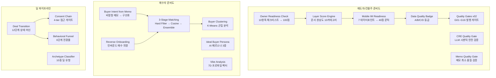

# 매수자/매도자 준비도 시스템 — 기능 명세

> CREDEAL 프로젝트에 구현된 준비도(Readiness) 관련 기능의 체계적 정리  
> 최종 갱신: 2026-08-04

---

## 아키텍처 개요



---

## 1. 매도자/건물주 준비도 (Owner/Seller Readiness)

### 1.1 Owner Readiness Check

> **목적**: 건물주가 매각 준비 상태를 자가 진단하여, 현재 보유한 자료로 어떤 산출물이 가능한지 안내

| 항목 | 설명 |
|---|---|
| **파일** | `src/domain/owner/owner-readiness.ts` |
| **API** | `POST /api/owner-readiness/check` |
| **UI** | `/owner-readiness` (public) |

#### 체크리스트 (10항목, 가중 합계 100점)

| 항목 | 가중치 | 라벨 |
|---|---|---|
| 건축물대장 | 15 | `buildingRegister` |
| 등기부등본 | 10 | `registry` |
| 토지이용계획 | 10 | `landUsePlan` |
| **임대차 현황** | **20** | `rentRoll` |
| 건물 사진 | 10 | `photos` |
| 평면도 | 10 | `floorPlan` |
| 수선 이력 | 5 | `repairHistory` |
| 공실 현황 | 10 | `vacancyStatus` |
| 희망 매각가 | 5 | `askingPrice` |
| 공개 범위 결정 | 5 | `disclosurePolicy` |

#### 준비 상태 → 산출물 매핑

| 점수 | 상태 | 가능 산출물 |
|---|---|---|
| ≥ 20 | `public_report_only` | Deal Curiosity Report |
| ≥ 40 | `teaser_ready` | + Blind Teaser |
| ≥ 60 | `snapshot_draft_ready` | + Building Snapshot Draft |
| ≥ 80 | `im_lite_ready` | + IM Lite |
| = 100 | `full_im_candidate` | + Full IM Candidate |

---

### 1.2 Layer Score Engine (문서 완성도)

> **목적**: 스튜디오에서 브로커가 업로드한 문서별로 완성도를 추적

| 항목 | 설명 |
|---|---|
| **파일** | `src/domain/building/layer-score-engine.ts` |
| **UI** | `/broker/buildings/[id]/studio/briefing` |

Owner Readiness와 동일한 10카테고리 가중치 체계를 공유하며, `computeLayerScore()` → `getEligibleOutputs()` 파이프라인으로 연결.

**보조 모듈**: `src/domain/building/evidence-upload.ts` — 문서 업로드 시 완성도 증분 계산 (`computeCompletenessAfterUpload`)

---

### 1.3 Mobile IM Readiness

> **목적**: 모바일 투자설명서(IM) 생성 가능 여부를 7개 데이터포인트로 판단

| 항목 | 설명 |
|---|---|
| **파일** | `src/domain/building/mobile-im/readiness.ts` |
| **문턱** | `MOBILE_IM_READINESS_THRESHOLD = 40` |

#### 7+1 데이터포인트

| 키 | 점수 | 티어 | 라벨 |
|---|---|---|---|
| `address` | 25 | critical | 정확한 주소 (지번) |
| `monthly_rent` | 20 | critical | 월세 총액 |
| `asset_type` | 10 | basic | 자산 유형 |
| `price_band` | 10 | basic | 가격대 |
| `area_signal` | 10 | basic | 권역 정보 |
| `vacancy_pct` | 10 | enhanced | 공실률 |
| `photos` | 10 | enhanced | 건물 사진 |
| `highlight` | 5 | enhanced | 브로커 코멘트 |
| _(공공데이터 보너스)_ | +10 | — | 건축물대장/토지이용계획 |

- **부분 점수 로직**: 주소 미확정(10점), 금액 미정(10점), 정보량 풍부(5점)
- **IoT 연동**: `floorOccupancy` 신호 존재 시 `vacancyStatus` 자동 충족

---

### 1.4 Data Quality Badge (A/B/C/D)

> **목적**: IM 데이터 품질을 4등급으로 분류, Basic/Pro tier 게이트 역할

| 항목 | 설명 |
|---|---|
| **파일** | `src/domain/building/mobile-im/data-quality-badge.ts` |
| **UI** | `ImDataBottomSheet` 하단 게이지, `TeaserHeroHeader` 배지 |

#### 등급 기준

| 등급 | 조건 | 의미 | Basic IM | Pro IM |
|---|---|---|---|---|
| **A** 🟢 | 주소 + 공공데이터 + 임대료 + 매각가 | 투자 검토 가능 (Cap Rate, IRR) | ✅ | ✅ |
| **B** 🟡 | 주소 + 공공데이터 + 임대료 | 기본 수익률 산출 | ✅ | ✅ |
| **C** 🟠 | 주소 + 공공데이터 | 건물 정보만 | ✅ | ❌ |
| **D** 🔴 | 그 외 | 데이터 보충 필요 | ✅ | ❌ |

**게이트 함수**:
- `minimumTierForGrade(grade)` → Basic은 모든 등급 허용
- `isProEligible(grade)` → A/B만 Pro 허용
- `hasMinimumBasicData({ hasAskingPrice })` → Basic 최소 필수

---

### 1.5 Quality Gates v02 (발행 게이트)

> **목적**: IM 발행 전 16개 검증 게이트 통과 여부 확인

| 항목 | 설명 |
|---|---|
| **파일** | `src/domain/building/mobile-im/quality-gates-v02.ts` |

#### Publish Gates (G01~G16)

| Gate | 라벨 | 심각도 |
|---|---|---|
| G01 | 매각가 존재 | `block` |
| G02 | 면적 존재 | `block` |
| G03 | 주소 존재 | `block` |
| G04 | 등급 D 아님 | `block` |
| G05 | 숫자 교차검증 통과 | `block` |
| G06 | 할루시네이션 없음 | `block` |
| G07 | PII 제거 완료 | `block` |
| G08 | 위험 표현 없음 | `block` |
| G09 | IM Judge 3.0 이상 | `warn` |
| G10 | 3축 분류 확정 | `block` |
| G11 | DCF 등급 게이트 | `warn` |
| G12 | Cap Rate basis 명기 | `warn` |
| G13 | 임대차 법령 확정 | `warn` |
| G14 | 갱신요구권 확인 | `warn` |
| G15 | 혼합 용도 법령 확정 | `warn` |
| G16 | 위반건축물 확인 | `warn` |

- `block` 게이트 하나라도 실패 → 발행 차단
- `warn` 게이트 실패 → 경고만 표시

#### Legacy Gates (G10~G14)

| Gate | 검증 항목 |
|---|---|
| G10 | Cap Rate 기준 표기 |
| G11 | 하방 시나리오 포함 |
| G12 | 제척·용적률 검증 |
| G13 | 상임법 판정 정합 |
| G14 | DCF/IRR 용어 해설 |

---

### 1.6 CRE Semantic Quality Gate

> **목적**: LLM 기반 2차 안전 검증 — regex로 잡지 못하는 패러프레이징 탐지

| 항목 | 설명 |
|---|---|
| **파일** | `src/domain/building/mobile-im/cre-quality-gate.ts` |
| **전략** | Fail-open + disclaimer (LLM 실패 시에도 통과, 면책문 강제) |

#### 5가지 위반 유형

| 유형 | 설명 | 예시 |
|---|---|---|
| `investment_guarantee` | 투자 추천/수익 보장 | "놓치면 후회", "손해 볼 가능성 낮음" |
| `fabricated_data` | 데이터 창작 | 원본에 없는 시세/통계 |
| `legal_assertion` | 법적 효력 확정 | "법적 문제 없음", "권리관계 명확" |
| `misleading_comparison` | 검증 불가 비교 | "주변 시세 대비 저렴" |
| `ungrounded_market_claim` | 무근거 시장 주장 | "이 지역 공실률은 X%" |

---

### 1.7 Memo Quality Gate

> **목적**: 딜카드 생성 전 메모 최소 품질 확인 (경량 regex)

| 항목 | 설명 |
|---|---|
| **파일** | `src/domain/building/memo-quality-gate.ts` |

필수 4필드: `location`, `asset_type`, `numeric`, `deal_type`

---

## 2. 매수자 준비도 (Buyer Readiness)

### 2.1 Buyer Intent from Memo

> **목적**: 비정형 매수자 메모 → 구조화된 Buyer Intent Lite

| 항목 | 설명 |
|---|---|
| **파일** | `src/domain/buyer/buyer-intent.ts` |
| **API** | `POST /api/broker/buyer-intents/from-memo` |
| **UI** | `/broker/buyer-intents/new` |

#### 추출 필드
- `budget_min` / `budget_max` — 예산 범위
- `preferred_regions` — 선호 권역
- `asset_types` — 자산 유형
- `purchase_purpose` — 매수 목적
- `must_have` / `nice_to_have` — 필수/선호 조건
- `risk_tolerance` — 위험 허용도
- `missingQuestions` — 부족 정보 체크리스트
- `privacyNotes` — 개인정보 노트

**자동 후속 처리**: `after()` 훅으로 배경 Auto-Matching 실행

---

### 2.2 Reverse Onboarding (인바운드 매수 의향)

> **목적**: 비로그인 외부 투자자가 블라인드 티저에서 직접 매수 의향서 제출

| 항목 | 설명 |
|---|---|
| **API** | `POST /api/public/reverse-onboarding` |
| **UI** | `src/components/onboarding/ReverseOnboardingForm.tsx` |

#### 플로우
1. 외부 투자자가 이름·연락처·예산·메시지 입력
2. `buyer_intent_lite` 저장 (`is_reverse_onboarded: true`)
3. A등급 매칭 결과 강제 생성 (즉시 브로커 알림)
4. 브로커 활동 감사 로그 기록

---

### 2.3 3-Stage AI Matching Engine

> **목적**: 매물 × 매수자 적합도를 3단계 파이프라인으로 산출

| 항목 | 설명 |
|---|---|
| **API** | `POST /api/broker/match` |
| **UI** | `/broker/matching` |

#### 3단계 파이프라인

| Stage | 방법 | 산출물 |
|---|---|---|
| **Stage 1** | Hard Filter | 권역·예산·자산유형 오버랩 (boolean) |
| **Stage 2** | Semantic Cosine Similarity | 벡터 유사도 (0~100) |
| **Stage 3** | Ensemble Scoring | 가중 종합 점수 → S/A/B/C 등급 |

#### 후속 처리
- `match_results` 저장
- `deal_casepacks` CasePack 추출
- `promotion_score` 업데이트
- Knowledge Graph 엣지 생성
- Buyer Clustering 분류
- S/A 등급 시 Pitch Snippet 생성

---

### 2.4 Ideal Buyer Persona

> **목적**: 매물 SSoT 기반 이상적 매수자 페르소나 3종 AI 생성

| 항목 | 설명 |
|---|---|
| **API** | `POST /api/broker/ideal-buyer-persona` |
| **UI** | `IdealBuyerPersonaSection` (deal-card page) |

---

### 2.5 Buyer Clustering (K-Means)

> **목적**: 전체 매수자 의향서를 군집 분석하여 유형별 세그먼트 도출

| 항목 | 설명 |
|---|---|
| **API** | `POST /api/broker/prediction/cluster-buyers` |
| **도메인** | `src/domain/prediction/buyer-clustering.ts` |

---

### 2.6 Vibe Analysis (7D Profile)

> **목적**: 브로커 프로필 사진에서 7차원 바이브 벡터 추출 → VTI 분류 + 보완 벡터 + 템플릿 매칭

| 항목 | 설명 |
|---|---|
| **API** | `POST /api/broker/vibe-analyze` |
| **모델** | Gemini 2.5 Flash Vision |

#### 7차원 축
`warmth`, `energy`, `polish`, `authentic`, `heritage`, `futuristic`, `playful`

---

## 3. 딜 파이프라인 준비도 (Deal Pipeline Readiness)

### 3.1 Deal Transition State Machine

> **목적**: 딜의 생명주기를 12단계로 관리, 전환 규칙 검증

| 항목 | 설명 |
|---|---|
| **파일** | `src/domain/deal/deal-transition.ts` |
| **API** | `POST /api/broker/pipeline/transition` |
| **UI** | `/broker/pipeline` |

#### 12단계

```
📝 메모 입력 → 🃏 딜카드 생성 → 📊 데이터 보강 → 📄 IM 초안
→ 📨 IM 발행 → 🎯 바이어 매칭 → 🤝 미팅/임장
→ 📋 LOI 제출 → 🔍 실사 → ⚖️ 클로징 → ✅ 성사
                                              ↗
                         ❌ 종료 (dead) ←── 모든 단계에서 전환 가능
```

#### Hold Time Warning
- 각 단계별 정체 임계 일수 설정
- 초과 시 `⚠️ N일` 경고 표시

---

### 3.2 Consent Chain (접근 게이트)

> **목적**: 매물 정보 공개 수준을 4단계로 관리

| 항목 | 설명 |
|---|---|
| **파일** | `src/domain/building/consent-chain.ts` |

#### 4-Tier 접근 체계

| Tier | 라벨 | 필요 조건 | 공개 수준 |
|---|---|---|---|
| `anonymous` | 익명 | 없음 | Blind Teaser |
| `identified` | 식별됨 | 이메일 OTP | Basic IM |
| `nda_signed` | NDA 서명 | NDA 동의 | Pro IM |
| `pro_verified` | 전문 투자자 | 인증 | Full IM |

**워터마크 시드**: `{이름}|{전화번호 뒷4자리}|{타임스탬프}`

---

### 3.3 Behavioral Funnel

> **목적**: 딜 생성 → 공유 → 열람 → 게이트 요청 → 임장 → 계약의 전환율 추적

| 항목 | 설명 |
|---|---|
| **UI** | `/broker/funnel` |

#### 6단계 퍼널
1. 딜카드 생성
2. 공유 (카카오/링크)
3. 열람 (`im_lite_view`)
4. 게이트 요청
5. 임장 예약
6. 미팅/계약

기간 필터: 7일 / 30일 / 90일 / 전체

---

### 3.4 Deal Archetype Classifier

> **목적**: 매물 속성 기반 10종 딜 유형 자동 분류

| 항목 | 설명 |
|---|---|
| **파일** | `src/domain/deal/archetype-classifier.ts` |

#### 10종 아키타입

| 코드 | 한글 | 핵심 조건 |
|---|---|---|
| `STABLE_INCOME` | 안정 수익형 | 공실 ≤5%, 건령 <20년 |
| `VALUE_ADD` | 가치 증대형 | 건령 ≥20년, 유효 용적률 여유 ≥50%p |
| `DEVELOPMENT_SITE` | 개발 부지 | 토지, 용적률 여유 ≥60% |
| `SAFE_EVICTION_DEV` | 명도 확보 개발 | 명도 진행/완료 + FAR 여유 |
| `INSTITUTIONAL_LOGI` | 기관형 물류 | 물류센터, 380억+ |
| `OWNER_OCCUPIED` | 자가 사용 | 사옥/자가 목적 |
| `DISTRESSED` | 부실 자산 | 공실 ≥30% 또는 연체 ≥20% |
| `MIXED_USE` | 복합 용도 | 복합 자산 |
| `RETAIL_STREET` | 리테일 상권 | 상가/리테일 |
| `REPOSITIONING` | 리포지셔닝 | — |

---

## 4. 점수 체계 비교 요약

| 체계 | 만점 | 문턱 | 용도 | 파일 |
|---|---|---|---|---|
| Owner Readiness | 100 | 20/40/60/80/100 | 매각 준비 자가진단 | `owner-readiness.ts` |
| Layer Score | 100 | 20/40/60/80/100 | 문서 완성도 (스튜디오) | `layer-score-engine.ts` |
| Mobile IM Readiness | 100 | **40** | IM 생성 가능 여부 | `readiness.ts` |
| Data Quality Badge | 100 | A(주소+공공+임대+매각) / B / C / D | IM 등급 + Basic/Pro 게이트 | `data-quality-badge.ts` |
| Publish Gates | 16개 | block 전체 통과 | IM 발행 허용 | `quality-gates-v02.ts` |
| Memo Quality | 4필드 | 4개 충족 | 딜카드 생성 허용 | `memo-quality-gate.ts` |
| Match Score | 100 | S/A/B/C | 매물-매수자 적합도 | `matching-engine.ts` |

---

## 5. API 라우트 맵

### 매도자 준비도
| 메서드 | 경로 | 설명 |
|---|---|---|
| POST | `/api/owner-readiness/check` | 건물주 준비도 자가진단 |
| GET | `/api/broker/buildings/[id]/studio` | 스튜디오 체크리스트 + 완성도 |

### 매수자 준비도
| 메서드 | 경로 | 설명 |
|---|---|---|
| POST | `/api/broker/buyer-intents/from-memo` | 매수자 메모 → 구조화 의향서 |
| POST | `/api/public/reverse-onboarding` | 외부 투자자 인바운드 의향 |
| POST | `/api/broker/match` | 3-Stage 매칭 실행 |
| POST | `/api/broker/ideal-buyer-persona` | 이상 매수자 페르소나 생성 |
| POST | `/api/broker/prediction/cluster-buyers` | 매수자 군집 분석 |
| POST | `/api/broker/prediction/price` | 가격 추정 범위 |
| POST | `/api/broker/buyer-memo/generate` | 매수자 맞춤 메모 생성 |
| POST | `/api/broker/vibe-analyze` | 바이브 7D 프로파일 분석 |

### 딜 파이프라인
| 메서드 | 경로 | 설명 |
|---|---|---|
| POST | `/api/broker/pipeline/transition` | 파이프라인 단계 전환 |

### UI 페이지
| 경로 | 설명 |
|---|---|
| `/owner-readiness` | 건물주 준비도 진단 |
| `/broker/pipeline` | 딜 파이프라인 칸반 보드 |
| `/broker/funnel` | 행동 퍼널 전환율 |
| `/broker/matching` | AI 매칭 보드 |
| `/broker/buyer-intents` | 매수자 의향서 관리 |
| `/broker/buyer-intents/new` | 매수자 메모 입력 |
| `/broker/buyer-intents/[id]` | 매수자 상세 + 체크리스트 |
