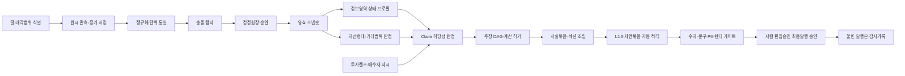

# D54-A D53 비판 반영 추적표 및 확장 참조사양

> **문서 상태** D54 규범 핵심계약의 비규범 판단근거·확장모델·추적·시험등록부  
> **버전** v1.2 · 2026-08-31 · L1.5 이중판정·승인결속·관측유형·시험변종 등록부 반영  
> **대상** CREDEAL 제품 책임자 · 중개 실무 책임자 · 도메인/백엔드/AI/PPTX/QA 개발팀  
> **제품 범위** 대한민국 소형 상업용 부동산, 중개인 단독 작성 가능 범위  
> **기본 산출물** 공부·현장·최소 임대정보·중개인 판단을 결합한 L1.5 중개인 제안형 매각제안서  
> **상위 산출물** 자료가 허용할 때만 생성하는 `Broker Analysis IM`  
> **비범위** 감정평가·법률·세무·건축·기술·회계·금융기관의 확정 의견  
> **선행 문서** D51 현실적 IM 제작 방법론, D49 포스처 5분법 적합성 검토, D53 D52 루브릭 평가, 07 Broker Goldilocks IM 제품 사양, 08 im-core 도메인 명세, 09 Golden IM 데이터 요구사항  
> **문서 역할** 설명서가 아니라 제품·데이터·판정·생성·검수의 공동 구현 계약
> **용어 정본** `D56_KOREAN_SMALL_COMMERCIAL_REAL_ESTATE_TERMINOLOGY_DICTIONARY.md`
> **규범 우선순위** 실행 정책파일 → D54 → D54-A → D55, 표시어는 D56
> **예외** D54가 명시적으로 편입한 §18.2 시험변종 등록부는 D54의 일부로서 규범효력을 갖는다.

---

## 0. 한 페이지 결론

### 0.1 최종 판단

D51은 **제품의 기준점을 투자자문형에서 중개인 도달 가능 수준으로 낮춘 판단**, **출처 확보 가능성과 주장 허가를 분리한 판단**, **자료가 부족해도 현재 가능한 문서를 먼저 발행하고 보완 후 승급시키는 판단**이 정확하다. 이 세 가지는 그대로 채택해야 한다.

다만 D51과 기존 포스처 5분법을 그대로 런타임 정본으로 쓰기에는 다음 다섯 가지 구조적 공백이 있다.

1. `A~F`는 정보를 얻는 **경로**이지 자산정보의 MECE한 **내용 영역**이 아니다.
2. 원본 충돌을 발견한 뒤 무엇을 유효값으로 쓸지 정하는 **정정원장과 유효 스냅숏**이 없다.
3. 중개인 의견을 계산에서 완전히 배제하면 밸류애드 시나리오를 만들 수 없고, 반대로 바로 계산에 넣으면 의견이 사실로 위장된다.
4. 임대차 8개 주장만으로는 다필지, 사옥형, 개발형, 운영형, 가격 포지션의 발행 가능성을 결정할 수 없다.
5. `income/owner_occupied/development/operating/trading`은 자산의 물리형, 자료상태, 매수논리, 거래 내부정보를 한 필드에 섞고 있어 복합 논거와 재현 가능한 섹션 조립을 방해한다.

따라서 채택안은 다음과 같다.

> **A~F는 수집 라우팅에만 사용하고, 자산형태·거래범위·정보영역·품질벡터·투자렌즈·정정원장·주장 DAG·출력 번들을 별도 계층으로 둔다.**  
> **기본 목표는 L1.5 중개인 제안형 매각제안서, 분석자료가 허용할 때의 확장 목표는 L2 표준 검토형이며, 상한은 중개분석형 투자검토서다. 전문가형은 같은 데이터 계보 위에서 후속 협업으로 승격한다.**

### 0.2 목표 런타임



LLM은 추출 후보, 설명 초안, 의견 구조화, 리스크 후보, 문장 압축에 사용한다. 자산 식별, 값 채택, 합계, 수익률, 주장 허가, 발행등급, 공개 마스킹 판정은 결정론적 로직과 사람 승인으로 수행한다.

### 0.3 평가 결과의 표현 원칙

D53의 지적에 따라 근거 없는 100점 환산점수를 제거한다. 이 사양은 각 제안을 다음 네 상태와 근거등급으로 평가한다.

| 판정 | 의미 |
|---|---|
| ADOPT | 현재 증거로 바로 채택 가능 |
| MODIFY | 방향은 타당하나 범위·정의·순서를 고쳐 채택 |
| DEFER | 유효한 가설이나 표본·배선·운영근거가 부족 |
| REJECT | 목적에 맞지 않거나 다른 규칙과 충돌 |

| 근거등급 | 문서 안에서 요구하는 증거 |
|---|---|
| E0 | 아이디어·직관만 있음 |
| E1 | 식별 가능한 실제 표본 또는 레포 상태 1건 이상 |
| E2 | 정상·실패 짝과 결정론적 검사결과가 있음 |
| E3 | 복수 실물에서 재현되고 반례·오탐·미탐이 측정됨 |

규칙은 `판정 + 근거등급 + evidenceIds + owner + reviewCondition`을 가져야 한다. E0·E1 규칙은 `provisional`이며 외부 발행을 더 쉽게 만드는 방향으로 사용할 수 없다.

### 0.4 D53 반영 후 범위 결정

| 범위 | 결정 | 근거 |
|---|---|---|
| 빈칸·관리비·채권최고 표현 방화벽 | ADOPT/E1 | 실물 표본에서 즉시 확인 가능, 독립 불변식 |
| rent 종류 분리·Gross Yield basis | ADOPT/E1 | 실제 렌트롤 충돌과 한국 실무 표현에 직접 대응 |
| Opinion→ApprovedAssumption | MODIFY/E1 | 스키마는 즉시, UI·계산 연결은 승인로그 검증 후 |
| ClaimBundle tier | MODIFY/E1 | 기존 최솟값 오류를 고치되 우선 수익형 최소 묶음만 구현 |
| Correction→EffectiveSnapshot | ADOPT/E1 | 충돌 후 유효값 부재라는 확인된 구조결함 |
| ParcelSet·면적분모 | ADOPT/E1 | 양평동 다필지 표본 존재 |
| AssetForm + 복수 Lens | MODIFY/E1 | shadow mode로 `whole_building/vacant_land`와 `yield/value_add/redevelop`부터 |
| 6차원 전체 evaluator | DEFER/E0 | TransactionScope·BuyerMandate·InternalDealContext의 실물 검증 부족 |
| DomainState 7축 전면 저장 | DEFER/E0 | 63개 상태칸이 아니라 Claim 평가에서 필요한 최소 메타만 유지 |
| 정본 21개 신설 | REJECT | 기존 정본을 확장하고 신규 정본은 최대 2개로 제한 |

### 0.5 v1.1 추가결정

1. L1과 L2 사이에 `L1P`를 구현코드로 사용하는 L1.5 중개인 제안형을 추가한다.
2. L1.5는 L1의 사실묶음에 승인된 중개인 의견묶음을 결합하며, 임대수익률과 비교사례 분석을 필수로 하지 않는다.
3. 실무 기본 골디락스는 L1.5, 임대·가격·시장 분석이 가능한 확장 골디락스는 L2로 정의한다.
4. 사진은 독립 페이지가 아니라 `PhotoAsset` 근거자료로 저장하고 사실·의견·확인사항과 연결한다.
5. 고정 `현장사진` 페이지 대신 사진수·역할·품질에 따른 적응형 조립을 사용한다.

### 0.6 v1.2 추가결정

1. L1.5/L1P는 자동으로 반환하는 선형 숫자등급이 아니라 `L1 사실묶음 + broker_proposal_om 문서판 + 자동 적격 PASS + 사람 편집승인 APPROVED`의 결합상태다.
2. 자동검사는 의견필드·근거연결·공개승인·반영면을 판정하고, 사람은 실제 매수자 의미·한국 중개문장의 자연스러움·다음 행동을 승인한다.
3. 사람승인은 `snapshotId·proposalUnitIds·copyHash·photoSetHash·policyVersions`에 결속하며, 어느 하나가 바뀌면 자동 무효화한다.
4. 관측유형은 D54의 여덟 안정 ID를 사용하고 기존 발행검사 정본 ID가 다르면 별칭으로 연결한다. 실제 정본 inventory 전에는 매핑 완료로 간주하지 않는다.
5. §18.2를 세 문서의 단일 시험변종 등록부로 삼고 안정 ID·활성상태·기능 플래그·기대조치를 관리한다.
6. D54-A는 D54보다 우선하는 새 운영규칙을 만들지 않는다. 장기 개념모델과 Production MVP의 경계를 유지한다.

---

## 1. 평가 범위와 판정 기준

### 1.1 검토한 체계

- D51의 출처 6축, 주장 단위 허가, 중개인 의견, 게이트 기록
- 07의 Broker Goldilocks 제품등급, 포스처별 모듈, 발행 게이트
- 08의 ClaimRegistry, FinancialCalculator, ReleaseTier, ActionCard, 한국 법정 항목
- 09의 Golden IM 데이터 요구사항과 DataAvailability 기반 덱 시퀀싱
- 실제 중상급 표본에서 확인된 당산동·상도동·양평동의 면적·임대료·관리비·만기·다필지 충돌

### 1.2 판정 질문

| 평가축 | 핵심 질문 |
|---|---|
| 적합성 | 한국 중개인이 통제할 수 있는 자료와 업무범위에 맞는가 |
| 적용성 | 입력자·시스템·승인자·예외처리까지 실제 운영 가능한가 |
| 전문성 | 수치 basis, 증거계보, 위험표현, 계산과 의견의 경계가 명확한가 |
| 효과성 | 더 짧은 입력으로 매수자의 문의·답사·자료요청·LOI 판단을 개선하는가 |

### 1.3 비평 원칙

- 높은 등급보다 **허용된 주장**을 우선한다.
- 많은 필드보다 **식별·정합·기준일·커버리지**를 우선한다.
- 중개인에게 전문가 역할을 요구하지 않는다.
- 면책문구로 데이터 오류를 덮지 않는다.
- 오류가 있는 원본을 삭제·덮어쓰지 않고 수정 이력을 보존한다.
- 자료 부족은 실패가 아니라 산출 범위를 정하는 입력이다.

---

## 2. D51에서 그대로 채택할 것

| 항목 | 평가 | 채택 결정 |
|---|---|---|
| 중개인 도달 가능 수준을 정점으로 재설정 | 가장 중요한 제품 판단 | 기본 목표를 L1.5 중개인 제안형, 분석 확장 목표를 L2로 고정 |
| A는 시스템, B·E는 중개인 중심 | 부담 배분이 현실적 | 자동조회와 현장·시장 판단 집중 원칙 유지 |
| D·F 부재를 기본 결손으로 세지 않음 | 정상적인 중개 초기단계를 존중 | `not_expected_at_stage` 상태 도입 |
| 등급이 아닌 주장별 전제 | 조합 폭발과 설명 불가를 해소 | 모든 계산·서술을 ClaimDefinition으로 관리 |
| 결손과 해당없음 분리 | 정확한 품질 표현 | `not_applicable`을 일급 상태로 사용 |
| 빈칸을 0으로 보지 않음 | 재무 왜곡 방지 | 숫자형 필드의 `unknown`, `zero`, `not_applicable` 분리 |
| 관리비 부과액과 순수익 분리 | 한국 소형 빌딩에서 필수 | 청구·수납·지출·순효과를 별도 필드로 분리 |
| 채권최고액과 대출잔액 분리 | 권리·금융 오표현 방지 | 별도 Claim과 라벨 사용 |
| 현재 가능한 문서를 먼저 발행 | 보완 대기 중 생산 중단 방지 | 불변 버전 발행 + 데이터 보완 후 새 버전 승급 |
| 보완 항목별 해제 효과 제시 | 중개인 행동 유도에 효과적 | Claim unlock 기반 HITL 작업목록 구현 |
| 의견의 화자·근거·범위·반증조건 | 의견의 책임성과 검증성 강화 | BrokerOpinion 필수 스키마로 채택 |
| 게이트의 관측값·규칙·입력 기록 | pass와 미실행을 구분 | GateDecision 이벤트로 영속화 |

---

## 3. 수정하지 않으면 실제 오류가 나는 부분

### 3.1 구조적 결함과 조치

| ID | 심각도 | D51 현재 표현 또는 공백 | 실제 위험 | D54 조치 |
|---|:---:|---|---|---|
| D51-01 | P0 | A~F로 정보를 분류 | 같은 임대료가 C·D에 동시에 존재하고 토지·권리 완성도를 설명 못함 | `수집경로`와 `정보영역`을 별도 축으로 분리 |
| D51-02 | P0 | A축은 누구나 100% 자동 확보 | API 미응답, 주소 모호성, 집합건물, 말소·다필지, 등기 유료·권한 문제 은폐 | A 자동화를 목표 SLO로 표현하고 실패·수동확인 상태 유지 |
| D51-03 | P0 | 중개인에게 B·E만 요구 | 매각대상 필지·건물과 매도인 진술의 의미는 시스템이 확정 불가 | 중개인은 `매각범위`, `C 진술`, `발행본`을 반드시 승인 |
| D51-04 | P0 | 충돌 탐지 후 유효값 결정 체계 없음 | 원본을 덮어쓰거나 임의 우선순위로 계산 | 원시 관측 → 정정원장 → 유효 스냅숏 도입 |
| D51-05 | P0 | 다필지 처리 없음 | 대표 필지의 용도지역·공시지가를 전체 필지에 전파 | ParcelSet과 주장별 면적 분모·커버리지 도입 |
| D51-06 | P0 | `rent_sum` 하나 | 매도인 제시액, 계약액, 실제수납액이 같은 숫자로 취급 | reported/contracted/collected rent를 별도 Claim으로 분리 |
| D51-07 | P0 | Gross Yield basis가 하나 | 보증금 차감 여부·VAT·관리비 포함 여부가 숨겨짐 | 분자·분모·제외항목을 이름과 각주에 강제 |
| D51-08 | P0 | D2+F1이면 decision_im | D2 정의에는 12개월 OPEX가 없고 F1 한 분야 의견이 전체 위험을 덮지 못함 | 필요한 Claim과 중대한 위험별 reviewer를 직접 요구 |
| D51-09 | P1 | 의견 수치는 어떤 계산에도 입력 금지 | 중개인 밸류애드 시나리오 자체가 불가능 | Opinion → AssumptionProposal → 사람승인 → Scenario의 단방향 변환 |
| D51-10 | P1 | 점추정 전면 금지 | 계산 가능한 Base 시나리오를 만들 수 없음 | 외부 의견은 범위, 계산은 승인된 Base/Low/High로 분리 |
| D51-11 | P1 | 만료 임대료 10% 단일 규칙 | 묵시갱신·점유·수납이 확인된 경우도 일괄 차단 | 만료상태와 현재 점유·수납 증거를 함께 판정 |
| D51-12 | P1 | A2+C1이면 analysis_im | 기준일·충돌·시장근거가 없어도 분석형으로 오판 | source 조합은 잠재 상한, 실제 tier는 Context별 ClaimBundle로 판정 |
| D51-13 | P1 | 허가의 최솟값이 IM 종류 결정 | 비필수 공실률 하나가 전체 문서를 과도하게 강등 | 각 tier의 필수·선택·금지 Claim 묶음으로 판정 |
| D51-14 | P1 | E2는 비교물건 3건 | 잘못 식별된 3건이 정확한 1건보다 높은 등급 | 식별·출처·시점·유사성·조정가능성을 함께 평가 |
| D51-15 | P1 | D1 주요 계약서 | ‘주요’가 자산별로 달라 커버리지 비교 불가 | 임대료·면적·최대임차인 가중 커버리지 사용 |
| D51-16 | P1 | 주장 8종이 임대에 집중 | 사옥·개발·운영·가격 포지션 발행 판정 불가 | 공통 Claim + 형태·렌즈·거래범위 Claim 카탈로그 도입 |
| D51-17 | P1 | `would_flip_if` 일괄 필수 | 형식·보안·렌더 게이트에는 부자연스럽고 형식 채우기 유발 | 고위험 판정에는 counterfactual, 모든 게이트에는 evaluated predicates 강제 |
| D51-18 | P1 | source grade가 신뢰도처럼 읽힘 | C3의 상세한 오정보가 C1보다 믿을 만한 것으로 오해 | 등급은 확보수준, 신뢰는 필드별 증거·정합 상태로 분리 |
| D51-19 | P2 | 고정 신선도 규칙 | 공부·임대·시장·현장 정보의 적정 수명이 다름 | 도메인별 TTL 정책과 `as_of/retrieved_at` 분리 |
| D51-20 | P2 | 외부 발행·개인정보 통제가 약함 | 임차인명·상호·번호판·연락처·계약서 정보 노출 | 공개정책·마스킹·배포등급·동의 로그 도입 |

### 3.2 기존 07·08·09 사양과의 충돌

| 기존 요소 | 문제 | 통합 결정 |
|---|---|---|
| 07의 BG가 계약 주요조건·시나리오를 사실상 요구 | 일반 중개인의 C1/D0 표준과 맞지 않음 | L1.5 기본 골디락스와 L2 분석 확장형, 상위 Broker Analysis IM을 분리 |
| 08 `resolveTier({grade, dataAvailability})` | boolean 존재 여부가 충돌·기준일·커버리지를 무시 | ClaimBundle 기반 resolver로 교체 |
| 08 `FinancialCalculator`의 NOI·IRR 일괄 산출 | 입력이 존재한다는 이유만으로 금지 계산이 열릴 수 있음 | Claim permission이 calculator 호출 전후를 모두 제어 |
| 08 `trustWeight` | 신뢰도를 평균내어 진실처럼 만들 위험 | 표시 정렬용도도 금지하고 필드별 권위정책 사용 |
| 08 `KoreanLegalFields` boolean | `false`와 `미확인`을 구분 못함 | `yes/no/unknown/not_applicable` + 증거·기준일 |
| 08 ActionCard의 stabilized NOI 필수 | OPEX 없는 표준 OM에서 생성 불가 | 금액효과 nullable, 정성 액션도 허용 |
| 09 `hasX` 플래그 | 일부만 있어도 true가 되어 커버리지·충돌을 숨김 | DomainState와 ClaimEvaluation으로 대체 |
| 09 `llm_calculated` provenance | 계산 책임과 재현성이 불명확 | 계산은 deterministic engine만, LLM은 설명만 |
| 09 Golden IM을 모든 플래그 true로 설계 | 현실 결손·차단·강등 회귀를 검증하지 못함 | 정상본+결손본+충돌본+변종본을 한 세트로 관리 |
| 09 운영형 DCF를 GOP 기반으로 직접 계산 | 부동산 NOI·사업 GOP 경계 훼손 | 사업가치·부동산가치 분리, 전문가 협업 전 외부 확정 금지 |

### 3.3 D49 포스처 분석의 근거기반 평가

| 평가항목 | 판정 | 근거 | 판단 |
|---|---|---|---|
| 현행 5분법 문제진단 | ADOPT | E1 | 한 자산에 복수 매수논리가 성립하는 실제 표본이 있음 |
| 밸류애드 누락 지적 | ADOPT | E1 | 당산동 만기·임대조정 논리가 수익안정성과 다른 질문을 만듦 |
| 형태·자료·논거 3축 대안 | MODIFY | E1 | 방향은 타당하나 형태축과 자료축 정의에 재혼합이 남음 |
| 전면 런타임 적용 | DEFER | E0 | 전체 Context 조합을 검증한 실물·실패짝이 없음 |
| 최소 shadow evaluator | MODIFY | E1 | `whole_building/vacant_land`와 `yield/value_add/redevelop` 범위부터 검증 |

#### 그대로 채택할 포인트

- 포스처는 매물의 고정 속성이 아니며 한 자산에 `yield + own_use + value_add + redevelop`이 동시에 성립할 수 있다.
- `value_add`는 여섯 번째 배타 포스처가 아니라 복수 선택 가능한 투자렌즈여야 한다.
- `operating`은 일반 근생과 같은 분류칸에 놓기보다 특수자산·사업양수도 범위로 분리해야 한다.
- `trading`의 매도사유·보유이력은 외부 IM 포스처가 아니라 공개통제되는 내부 Deal Context에 가깝다.
- 자료상태가 허용 분석과 면수에 큰 영향을 주며, 렌즈는 정확성 게이트를 완화할 수 없다.
- 실물표본 없이 포스처별 게이트를 계속 추가하는 방식은 중단해야 한다.

#### 수정해 채택할 포인트

1. **형태는 완전 자동확정이 아니다.** 건축물대장 주용도는 후보를 만들 수 있지만 복합용도, 다동, 집합건물, 실제사용 충돌이 있으므로 `system_inferred → broker_confirmed`가 필요하다.
2. **`land_or_teardown`은 분리한다.** 나대지는 물리형이지만 철거는 전략이다. `vacant_land`는 AssetForm, 철거·재개발은 `redevelop` Lens로 둔다.
3. **자료축은 단일값이 아니다.** S-A~S-F와 D-ID~D-BJ의 상태벡터로 표현하며, 자료등급이 Claim을 직접 허가하지 않는다.
4. **렌즈의 주관성은 재현성 실패가 아니다.** 선택자·선택시점·근거가 입력으로 저장되면 같은 승인 입력에서 같은 출력이 가능하다. 문제는 숨은 선택이다.
5. **렌즈는 무조건 페이지를 추가하지 않는다.** 필수 사실·위험은 삭제할 수 없지만, 선택 모듈을 활성화하고 우선순위를 바꾸며 페이지 예산 안에서 조립해야 한다.
6. **게이트를 form/source에 직접 재부착하지 않는다.** 게이트는 불변식 또는 Claim에 붙고, Claim의 해당성만 AssetForm·TransactionScope·Lens·BuyerMandate에서 결정한다.
7. **`special_use`는 하위유형이 필요하다.** 숙박·의료·주유소·물류는 지표와 규제가 다르므로 subtype과 사업 포함 여부를 별도로 둔다.
8. **단기보유 분석과 매도인 보유이력을 분리한다.** 전자는 특정 매수자의 `short_hold` Mandate가 될 수 있고, 후자는 내부정보다.

#### D49 대안을 그대로 적용할 때 생기는 두 번째 카테고리 오류

```text
land_or_teardown = 토지의 현재 상태 + 철거 전략
operating        = 자산형태 + 거래범위 + 분석모델
source           = 획득경로 + 데이터품질 + 발행등급
```

따라서 D54는 3축을 그대로 복사하지 않는다. §5.5의 6차원 모델은 **개념모델**로 유지하되, production evaluator는 §5.5.1의 최소 구현범위만 사용한다.

### 3.4 D53 비판의 과학적 판정과 반영

| D53 주장 | 판정 | 근거·한계 | D54 반영 |
|---|---|---|---|
| D52 점수에 채점기준이 없음 | ADOPT | 숫자를 재현할 평가함수가 없었음 | 100점 환산 제거, ADOPT/MODIFY/DEFER/REJECT + E0~E3 |
| 6차원 승인부담이 측정되지 않음 | ADOPT | 이벤트·사용성 측정값 부재 | MVP 화면은 매각범위·형태확인·Lens 최대 2개만 노출, 시간은 기준선부터 측정 |
| 가장 값싼 불변식이 늦게 구현됨 | ADOPT | 기존 Phase 2에 위치 | Phase H0 즉시 안전패치로 이동 |
| 1,470 Context 조합은 검증 불가 | MODIFY | 단순 Cartesian 곱은 제약·독립규칙을 무시하지만, 5개 표본으로 독립성을 입증할 수도 없음 | 전체 evaluator 보류, MVP 조합 축소, pairwise+mutation+실물 검증 |
| DomainState 63필드가 불가독 | ADOPT | 내부 벡터를 외부 설명으로 사용한 오류 | 최소 메타만 저장하고 사람용 상태문장 별도 생성 |
| 상도동 출처가 없음 | MODIFY | 레포에는 없지만 사용자 첨부 실물 PPTX가 실제 존재함 | 외부 첨부 표본으로 Evidence Register 등록, repo fixture 편입 전 E1 이상으로 승격 금지 |
| 문서 내 검사기 출력이 없음 | ADOPT | 사례설명은 실행증거가 아님 | Evidence Register·TestRunManifest·expected/actual 기록 의무화 |
| `would_flip_if` 완화경계 없음 | ADOPT | 위험등급 정의가 없었음 | RC0~RC2 도입, 미분류는 RC2로 fail-closed |
| TTL·coverage·KPI 임계값 근거 없음 | ADOPT | 초기 정책값과 검증값을 혼동 | 모든 수치에 status·rationale·evidence·loss·review 조건 부여 |
| 정본 21개를 추가하면 43개 | MODIFY | 기존 22개와 제안 21개가 실제 모두 독립 정본인지 재고되지 않았지만 증식 위험은 실재 | 기존 정본 확장 우선, 신규 정본 최대 2개, SSOT inventory 선행 |
| `im.axes.yaml` 역할 충돌 | CONDITIONALLY ADOPT | 현재 접근 가능한 레포에서는 파일을 찾지 못했으나 개발팀 정본에 존재한다는 진술은 통합 전 확인 필요 | 기존 역할을 재정의하지 않고, SSOT Inventory가 확인한 owner 계약을 우선 |
| D52 문서번호 중복 | CONDITIONALLY ADOPT | 현재 접근 가능한 레포에는 본 D52만 검색됐으나 팀 문서계보와 충돌 가능 | 후속 사양을 D54로 재번호해 충돌 가능성 제거 |
| 게이트 6종과 관측유형 8종 충돌 | ADOPT | 서로 다른 차원을 같은 enum으로 합치면 손실 | `effect`, `riskClass`, `observationType`을 직교 필드로 분리 |

여기서 `CONDITIONALLY ADOPT`는 개발팀의 레포/문서등록부가 사실상 정본이지만 현재 검사환경에서 재현하지 못한 항목이다. 통합 전 inventory 결과로 확정한다.

---

## 4. 목표 제품 체계

### 4.1 제품의 기준점

표준 사용자는 공인중개사 또는 중개법인 실무자다. 이 사용자는 공부를 직접 해석하는 전문가가 아니라 **대상 자산을 식별하고, 현장을 보고, 매도인 정보를 구조화하고, 시장의 거래 가능성을 설명하는 사람**으로 정의한다.

시스템은 다음을 책임진다.

- 주소·지번·PNU·건물 식별 후보 생성
- 공공자료 자동조회와 원본 보존
- 단위·날짜·금액 정규화
- 합계·면적·임대료·기준일 충돌 탐지
- 허용된 공식의 결정론적 계산
- 근거가 있는 문장만 조립
- 차단된 주장과 보완효과 제시
- PPTX/PDF/모바일 문서의 수치 일치와 렌더 검수

중개인은 다음을 책임진다.

- 실제 매각대상 필지·건물·지분·부속물 승인
- 매도인 진술의 의미와 기준일 확인
- 현장 관찰과 사진 공개범위 승인
- 비교사례 채택·제외 이유 승인
- 의견·가정·협상전략 승인
- 미확인·위험·면책을 포함한 최종 발행 승인

### 4.2 내부 1단계와 외부 산출물 5단계

| 코드 | 외부 명칭 | 목적 | 일반 면수 | 계산 상한 |
|---|---|---|---:|---|
| L0 | Internal Draft | 식별·충돌·자료요청용 | 가변 | 외부 표시 금지 |
| L1 | Broker Fact OM | 공부·가격·현장 사실 전달 | 7~9 | 단순 합계·면적·평당가 |
| **L1.5/L1P** | **Broker Proposal OM** | 사실에 근거한 추천·적합성·활용 제안 | **9~13** | L1 + 근거가 허용한 현재 임대합계 |
| L2 | Broker Review OM | 문의·답사·자료요청·예비가격 검토 | 10~16 | 근거가 허용한 단순 임대수입·명시형 Gross Yield |
| L3 | Broker Analysis IM | 비교·만기·임대갭·실행안·시나리오 검토 | 14~18 | 승인 가정 시나리오, OPEX 충족 시 NOI/Cap |
| L4 | Expert Collaboration IM | 최종투심·법률·건축·세무·기술 검토 | 별도 | 전문가가 검토한 범위 |

`expert_required`는 문서 등급이 아니라 **특정 질문을 L4 협업으로 넘기는 workflow 상태**다.

### 4.3 기존 코드와의 호환 매핑

| D54 | 기존 ReleaseTier 임시 매핑 | 마이그레이션 규칙 |
|---|---|---|
| L0 | `internal_only` | 유지 |
| L1 | `fact_om` | 유지 |
| L1.5/L1P | `fact_om` + `edition=broker_proposal_om` | 초기 호환안; 독립통계가 필요하면 `L1P`로 승격 |
| L2 | `analysis_im` + `edition=broker_review_om` | 기존 `goldilocks_om`은 마이그레이션 별칭으로만 유지 |
| L3 | `analysis_im` + `edition=broker_analysis_im` | `decision_im`으로 올리지 않음 |
| L4 | `decision_im` | reviewer scope 충족 시에만 사용 |
| 전문가 이관 | `expert_required` | tier가 아닌 `workflowStatus`로 이동 |

---

## 5. 분류체계: 수집경로와 정보영역을 분리한다

### 5.1 수집경로 Source Channel

경로코드는 ‘누구에게 무엇을 요청할지’를 정한다. Claim을 직접 허가하지 않는다.

| 코드 | 경로 | 담당 | 현실적 기준 | 주의 |
|---|---|---|---|---|
| S-A | 공부·공공시스템 | 시스템 수집, 중개인 식별승인 | 핵심 공부 자동조회 성공 | 자동조회 실패·다필지 모호성 허용 |
| S-B | 현장 관찰 | 중개인 | 날짜 있는 외관·출입·점유·주차 관찰 | 기술진단·적법성 결론 금지 |
| S-C | 매도인 진술 | 매도인, 중개인 구조화 | 가격·임대·사용현황의 기준일 있는 진술 | 상세도와 신뢰도를 혼동하지 않음 |
| S-D | 원본 문서 | 거래 단계의 매도인 | 계약서·수납·비용자료 일부 또는 전체 | 초기 D0은 정상 |
| S-E | 시장 자료·중개경험 | 중개인·공공시장데이터 | 의견 또는 식별된 비교사례 | 단순 건수로 품질 판단 금지 |
| S-F | 전문가 | 해당 전문가 | 쟁점별 검토 | F1 하나가 전체 문서를 보증하지 않음 |

### 5.2 정보영역 Information Domain

정보영역은 ‘무엇이 얼마나 준비됐는지’를 정한다.

| 코드 | 영역 | 핵심 객체·질문 |
|---|---|---|
| D-ID | 자산식별·매각범위 | 무엇을 파는가: 필지, 건물, 지분, 부속물, 제외대상 |
| D-LD | 토지·도시계획 | 필지별 면적, 지목, 용도지역, 도로, 공시지가, 규제 |
| D-BL | 건물·물리 | 동·층·용도·면적·구조·사용승인·주차·위반·현장상태 |
| D-RT | 권리·제약 | 소유권, 신탁, 근저당, 임차권, 알려진 분쟁·제약 |
| D-RR | 사용·임대차 | 점유, 공실, 임차, 보증금, 임대료, 관리비, 기간, 수납 |
| D-OP | 운영·비용·CAPEX | 공과금, 세금, 보험, 유지보수, 수선, 견적, 운영자료 |
| D-MK | 시장·비교사례 | 매매·임대·경쟁매물, 식별·유사성·시점·조정 |
| D-TX | 거래조건·매도인 의도 | 호가, 보증금 승계, 일정, 명도, 협상, 공개범위 |
| D-BJ | 중개인 판단·전략 | 투자논거, 반론, 매수자군, 액션, 협상·자료보완 전략 |

한 값은 하나의 정보영역에 속하되 여러 수집경로의 증거를 가질 수 있다. 예를 들어 월세는 `D-RR`이고, 매도인 엑셀은 S-C, 계약서는 S-D, 현장 점유는 S-B다.

### 5.3 영역상태는 저장 테이블이 아니라 Claim 평가의 파생뷰다

9개 영역마다 7개 상태칸을 미리 채우지 않는다. 원본에는 Observation·Evidence·Conflict만 저장하고, 실행 중인 Claim이 요구하는 최소 메타만 계산한다.

```text
ClaimInputState = {
  applicability,
  coverage: { value, basis },
  asOf,
  openConflictIds,
  verification
}
```

- `maturity G0~G3`와 `resolution H0~H3`는 수집현황을 요약하는 선택적 진단값이다.
- G/H는 Claim 허가식이나 tier resolver의 직접 입력으로 사용하지 않는다.
- 실제 Claim이 없는 영역에는 상태 객체를 만들지 않는다.
- 신선도는 `asOf`와 정책을 비교해 실행 시 파생한다.
- 충돌은 개수 문자열이 아니라 Conflict ID와 중요도로 연결한다.

내부 로그는 압축코드를 사용할 수 있지만 중개인 화면에는 다음처럼 표시한다.

> **임대현황:** 현재 분석에 사용 가능 · 임대료 기준 91% 확인 · 기준일 2026-08-30 · 월세 합계 충돌 1건은 수익률을 차단 중

표시문도 ClaimEvaluation에서 기계적으로 조립하며, `G2-H2 / cov 0.91` 같은 토큰을 사용자 설명으로 노출하지 않는다.

### 5.4 영역별 신선도 후보정책

아래 수치는 검증된 시장법칙이 아니라 파일럿을 위한 보수적 초기값이다. 전부 `provisional/E0`로 등록하며, 운영에서 자동으로 상위 tier를 허용하는 근거로 단독 사용하지 않는다.

| 영역 | current | aging | stale 기본값 | 비고 |
|---|---:|---:|---:|---|
| 매각조건 D-TX | 30일 이내 | 31~90일 | 90일 초과 | 호가·일정은 변동이 빠름 |
| 임대·점유 D-RR | 90일 이내 | 91~180일 | 180일 초과 | 중대한 만기·공실 이벤트가 있으면 즉시 재확인 |
| 현장 D-BL/S-B | 90일 이내 | 91~180일 | 180일 초과 | 공실·공사 시 더 짧게 적용 |
| 공부 D-ID/D-LD/D-BL | 30일 이내 발급 | 31~90일 | 90일 초과 | 계약 단계에서는 재발급 |
| 시장 D-MK | 180일 이내 | 181~365일 | 365일 초과 | 사례 발생일과 수집일을 모두 저장 |
| 운영비 D-OP | 최근 연속 12개월 | 6~11개월 또는 12개월 초과 노후 | 그 외 | 계절성 자산은 24~36개월 권장 |

TTL은 정책 버전으로 관리하고 자산 이벤트가 있으면 강제로 만료시킨다. 각 값에는 `status`, `rationale`, `evidenceIds`, `falseAllowCost`, `falseBlockCost`, `owner`, `reviewCondition`을 저장한다. §18.5의 검증 전에는 임계값 변경을 ‘최적화’라고 부르지 않는다.

### 5.5 기존 포스처를 대체하는 6차원 모델

문서 구조와 분석범위를 하나의 `posture` 필드가 결정하지 않는다.

| 차원 | 질문 | 성격 | 단·복수 | 결정 주체 |
|---|---|---|---|---|
| `assetForm` | 물리적으로 어떤 자산인가 | 자산 사실 | 주형 1 + 구성요소 복수 | 시스템 후보, 중개인 확인 |
| `transactionScope` | 무엇이 거래되는가 | 거래 사실 | 1개 | 중개인·매도인 승인 |
| `evidenceProfile` | 무엇이 얼마나 확인됐나 | 자료 상태 | 영역별 벡터 | 시스템 계산 |
| `investmentLenses[]` | 어떤 매수논리를 강조할까 | 마케팅·분석 판단 | 0~3개 | 시스템 제안, 중개인 승인 |
| `buyerMandate` | 특정 매수자가 무엇을 원하는가 | 매수자 요구 | 선택 1개 | 매수자·중개인 입력 |
| `internalDealContext` | 공개하지 않을 거래 맥락은 무엇인가 | 내부정보 | 복합 | 권한 있는 중개인 |

이 구분으로 다음이 가능해진다.

```text
같은 당산동 자산
  assetForm        = whole_building
  legalUseTags     = [neighborhood]
  transactionScope = real_estate_only
  lenses           = [yield, value_add, own_use]
  buyerMandate     = null                # 공개용 매물 OM

특정 의원 매수자에게 재생성
  같은 Snapshot·Fact·Claim 유지
  buyerMandate     = medical_owner_user
  lensPriority     = [own_use, value_add]
```

사실은 그대로고 강조·추가분석만 바뀐다. 따라서 데이터 재현성과 매수자 맞춤성을 동시에 확보한다.

#### 5.5.1 Production MVP와 개념모델의 경계

6차원은 장기 데이터모델이지 한 번에 구현할 조합표가 아니다. 첫 production evaluator는 다음으로 제한한다.

| 차원 | MVP 실행값 | 그 밖의 값 |
|---|---|---|
| AssetForm | `whole_building`, `vacant_land`, `requires_review` | 세부 근생·업무·상가주택 태그는 설명용, 분기 금지 |
| TransactionScope | `real_estate_only` | 나머지는 `expert_handoff` 또는 internal only |
| EvidenceProfile | `coverage`, `asOf`, `openConflicts`, `verification` | G/H 등급은 파생 진단, 필수 저장 금지 |
| InvestmentLens | `yield`, `value_add`, `redevelop`, 최대 2개 | `own_use`는 표시 후보만, 계산 evaluator 보류 |
| BuyerMandate | `null` | 스키마 초안만, production 분기 금지 |
| InternalDealContext | 공개금지 flag만 | 상세 스키마·분석 evaluator 보류 |

따라서 초기 유효 Context 상한은 `AssetForm 2 × Lens 조합 7 = 14`이며 `requires_review`는 L0로 차단한다. 14개를 각각 별도 제품으로 만들지 않고, 공통 불변식과 Claim 단위 규칙을 재사용한다.

최대 Lens 2개는 최적값이라는 주장이 아니라 초기 UI·검증 범위를 제한하는 제품 guardrail이다. 사용자가 세 번째 Lens를 요구한 빈도와 누락효과를 기록해 유지·변경한다.

새 값의 승격조건:

1. 명확한 구매자 질문과 예상 Claim을 정의한다.
2. E2 이상 증거, 즉 식별된 정상·실패 짝과 실행결과를 확보한다.
3. 기존 mutation suite에서 critical false-allow가 없다.
4. 기존 값으로 표현할 수 없는 실질 차이가 확인된다.
5. owner, UI 비용, 공개정책, rollback을 지정한다.

조건 전에는 enum에 예약값을 추가하더라도 evaluator·게이트·섹션을 만들지 않는다.

### 5.6 AssetForm

`assetForm`은 공부·물리현황에서 판독하는 문서의 기본 뼈대다. 아래 표는 장기 개념분류이며 MVP evaluator는 §5.5.1의 세 값만 사용한다. 세부 유형은 먼저 `legalUseTags[]`로 저장하고 행동 차이가 실증된 뒤 분기한다.

| primaryForm | 판독 기준 | 기본 모듈 |
|---|---|---|
| `neighborhood_building` | 근린생활시설 중심 일반건축물 | 층별 사용·임대, 가시성, 접근·주차 |
| `office_building` | 업무시설 중심 | 층판·전용성·승강기·사무수요 |
| `mixed_residential_commercial` | 주거와 근생이 함께 중요 | 주거/상가 분리 현황·권리·임대 |
| `vacant_land` | 건축물 없음 또는 거래범위상 토지만 | ParcelSet·도로·규제 |
| `strata_unit` | 집합건물 전유부 거래 | 전유/공용, 대지권, 관리단·관리비 |
| `special_purpose` | 숙박·주유·의료·물류 등 특수용도 | subtype별 규제·설비·운영경계 |
| `multi_asset` | 서로 다른 형태의 필지·건물이 동등하게 포함 | 구성요소별 모듈 + 통합 매각범위 |

추가 필드:

```yaml
assetForm:
  primary: whole_building
  legalUseTags: [neighborhood]
  components:
    - { buildingId: B-01, form: whole_building, weightBasis: gfa }
    - { parcelId: P-03, form: vacant_land, role: parking }
  specialPurposeSubtype: null
  inference:
    status: broker_confirmed
    confidence: 0.86
    rules: [FORM-R01, FORM-R07]
    evidenceRefs: [OBS-BUILDING-USE, OBS-FIELD-USE]
  conflicts: []
```

`confidence`는 발행등급을 올리는 점수가 아니라 확인이 필요한 후보의 불확실성을 표시한다. 주용도 없음, 복합용도, 공부·현장 충돌, 다동 자산이면 중개인 확인 전 확정하지 않는다.

### 5.7 TransactionScope

운영형을 올바르게 분리하려면 물건형태만으로 부족하다. 아래 값은 개념모델이며 MVP는 `real_estate_only`만 외부 발행에 사용한다.

| 값 | 의미 | 외부 문서 영향 |
|---|---|---|
| `real_estate_only` | 토지·건물·임대차 승계 | 표준 OM/IM |
| `real_estate_plus_business` | 부동산과 운영사업·영업권·FF&E 포함 | 별도 운영자료 모듈, 전문가 이관 가능성 큼 |
| `equity_or_trust_interest` | 법인주식·수익권·신탁 관련 거래 | 중개인형 외부 확정 제한 |
| `strata_interest` | 집합건물 전유부·대지권 | 집합건물 전용 ClaimBundle |
| `partial_interest` | 일부 지분·일부 필지·일부 건물 | 매각범위·권리 P0 게이트 강화 |

`special_purpose + real_estate_only`이면 부동산 사실 중심 OM을 만들 수 있다. `special_purpose + real_estate_plus_business`이면 Seller-provided Operating Review를 별도 제품 모듈로 켜고, 부동산가치와 사업가치를 합산하지 않는다.

### 5.8 InvestmentLens

렌즈는 장기적으로 0~3개까지 복수 선택할 수 있다. MVP는 `yield/value_add/redevelop` 중 최대 2개만 사용한다. 시스템은 사실에서 후보를 제안할 수 있지만 중개인이 채택·제외 사유와 함께 승인한다.

| Lens | 핵심 질문 | 활성화 후보조건 | 허용 모듈 |
|---|---|---|---|
| `yield` | 현재 수입이 얼마나 지속되는가 | 임대공간·렌트롤 존재 | 수입 basis, 만기, 공실, 임차안정성 |
| `value_add` | 임대·공실·건물을 무엇으로 개선할 수 있는가 | 시장격차·공실·만기집중·노후·저활용 | Rent Gap, 원인, Action Card, 비용·기간·Downside |
| `own_use` | 실사용 후보에게 맞는가 | 명도 가능 공간·사용성 | 공간·접근·주차, 명도 가능시점 |
| `redevelop` | 신축·대수선 검토 가치가 있는가 | 나대지·저이용·노후·개발문의 | ParcelSet, 이론규모, 명도, 전문가 질문 |
| `preservation` | 현 상태의 안정적 보유가 유리한가 | 장기임차·낮은 변동·낮은 CAPEX | 안정성·유지 리스크 |
| `succession` | 자산이전 검토가 필요한가 | 사용자 요청 | **내부 노트만**, 세무·법률 결론 금지 |

렌즈 규칙:

- 렌즈는 Claim 전제를 완화하지 않는다.
- 자산에 해당하는 핵심 Fact·경제 Claim은 Lens와 무관하게 평가하고, Lens는 표시 우선순위만 바꾼다.
- Lens 전용 Action·Scenario Claim만 해당 Lens 승인 여부를 applicability 조건으로 사용할 수 있다.
- 렌즈는 필수 사실·위험·면책 모듈을 삭제하지 않는다.
- 렌즈는 선택 모듈의 활성화·우선순위·페이지 예산을 결정한다.
- 선택된 렌즈, 선택자, 근거, 반대 대안, `revisit_if`를 저장한다.
- `own_use` 렌즈만으로 Buy/Lease 계산을 열지 않는다. 특정 `buyerMandate`가 필요하다.
- `redevelop` 렌즈가 있어도 실제 건축 가능규모를 확정하지 않는다.

```yaml
lensDecision:
  decisionId: LENS-001
  candidates:
    - { lens: yield, signals: [rentroll_present] }
    - { lens: value_add, signals: [expiry_concentration, market_rent_gap_candidate] }
    - { lens: own_use, signals: [owner_occupied_floor, near_term_expiry] }
  selected: [yield, value_add]
  rejected:
    - { lens: own_use, reason: "불특정 매수자용 OM이며 명도 가능범위 미확인" }
  revisitIf:
    - "특정 실사용 매수자 요구가 접수됨"
    - "건축사 예비검토 요청이 접수됨"
  approvedBy: broker-017
  approvedAt: 2026-08-30T15:30:00+09:00
```

### 5.9 BuyerMandate와 InternalDealContext

`buyerMandate`가 없으면 불특정 매수자용 OM이다. 이때 own-use는 일반 사용가능성만 다룬다.

```yaml
buyerMandate:
  mandateId: BM-001
  purpose: medical_owner_use
  requiredAreaSqm: { min: 450, max: 650 }
  occupancyDate: 2027-03-01
  parkingMinimum: 8
  holdYears: 10
  financingAssumptionsApproved: false
  disclosureScope: buyer_specific
```

Buy/Lease, 단기보유, 특정 업종 적합성 같은 분석은 이 객체가 있을 때만 허가한다.

`internalDealContext`에는 매도사유, 급매성, 보유이력, 내부 협상범위, 관계정보를 둔다. 기본값은 외부발행 금지다.

```yaml
internalDealContext:
  sellerMotivation: confidential
  holdingHistory: []
  urgency: internal_only
  negotiationFloor: restricted
  shortHoldBuyerAnalysis: null
  disclosurePolicy: deny_by_default
```

`trading`은 제거하되 두 부분으로 보존한다.

- 매도인의 보유·매도 맥락 → `internalDealContext`
- 특정 매수자의 단기보유·Exit 분석 → `buyerMandate.strategy=short_hold`, 외부 공개 OM이 아닌 제한 분석

### 5.10 문서 조립의 결정식

문서 구조를 결정하는 것은 어느 한 축이 아니다.

| 결정요소 | 실제 결정권 |
|---|---|
| AssetForm | 필수 사실 스키마와 기본 시각화 |
| TransactionScope | 부동산·사업·지분 중 분석·면책 경계 |
| EvidenceProfile | 허용 Claim과 분석 깊이의 상한 |
| InvestmentLens | 선택 분석의 우선순위와 설득 초점 |
| BuyerMandate | 특정 매수자용 계산·적합성 분석 허가 |
| Claim/Gate | 개별 문장·수치·섹션의 최종 허가·차단 |

```text
Mandatory Core
+ AssetForm Modules
+ TransactionScope Modules
+ Allowed Claim Modules from EvidenceProfile
+ Prioritized Lens Modules
+ Buyer-specific Modules if BuyerMandate exists
- Modules blocked by Claims/Gates
→ Page-budget Optimizer
→ Release Candidate
```

우선순위는 다음과 같다.

1. 매각범위·가격·핵심 사실·위험·DD·면책
2. 해당 자산형태의 필수 모듈
3. 매수판단 영향이 큰 허용 Claim
4. 승인 렌즈의 핵심 모듈
5. 보조 사진·일반 설명

렌즈가 여러 개여서 페이지가 넘치면 렌즈 수가 아니라 모듈의 의사결정 중요도와 증거수준으로 절삭한다. 차단된 Claim을 페이지 수를 맞추려고 되살리지 않는다.

### 5.11 기존 posture 마이그레이션

| 기존 값 | 신규 Context | 자동변환 한계 |
|---|---|---|
| `income` | `investmentLenses += yield` | 저임대·만기집중·공실이면 `value_add`도 후보 제안, 자동승인 금지 |
| `owner_occupied` | `investmentLenses += own_use` | 특정 매수자 분석은 BuyerMandate가 있어야 함 |
| `development` | `investmentLenses += redevelop` | 자산형태는 별도 판독; 기존 건물이 있으면 vacant_land로 바꾸지 않음 |
| `operating` | `assetForm=special_purpose` 후보 + TransactionScope 확인 | 일반 임대형 특수자산과 사업포함 거래를 사람에게 구분 요청 |
| `trading` | InternalDealContext로 이동 | 매수자 단기보유 분석은 별도 BuyerMandate가 있을 때만 생성 |

파괴적 일괄변환을 하지 않는다.

1. 기존 `posture`를 `legacyPosture`로 보존한다.
2. 신규 Context를 shadow mode로 계산한다.
3. 기존·신규 섹션, Claim, gate 차이를 실제 표본에서 비교한다.
4. 중개인이 AssetForm과 Lens 후보를 승인한다.
5. 차이가 승인된 표본에서만 신규 composer를 켠다.
6. 모든 consumer 전환 후 `legacyPosture`를 읽기 전용으로 내린다.

### 5.12 온톨로지 전환 착수조건

D49의 ‘배선과 대조군이 불안정한 상태에서 온톨로지를 먼저 바꾸지 말라’는 지적을 채택한다. 다음 조건 전에는 신규 구조를 production 판정에 사용하지 않는다.

- 현행 파이프라인의 핵심 입력→Claim→PPTX 데이터계보가 문서화됨
- 기존 게이트의 `PASS/FAIL/NOT_RUN`이 구분됨
- 당산·상도·양평 표본의 현재 출력과 알려진 결함이 baseline fixture로 고정됨
- 최소 18개 변종의 기대 판정이 정의됨
- legacy/new dual evaluation 결과를 같은 화면에서 비교 가능

조건 충족 전에는 스키마와 shadow evaluator만 구현하고 외부 발행 결과를 바꾸지 않는다.

---

## 6. 데이터 계보, 충돌, 정정원장

### 6.1 절대 원칙

원본에서 읽은 값은 수정하지 않는다. 다음 객체를 분리한다.

1. `Observation`: 원본·진술·현장에서 관측한 값
2. `Normalization`: 단위·표기·날짜 형식을 기계적으로 통일한 값
3. `Conflict`: 서로 양립할 수 없는 관측의 묶음
4. `CorrectionEvent`: 어느 관측을 왜 바로잡았는지에 대한 승인 이벤트
5. `EffectiveFact`: 특정 기준일에 계산과 문서가 사용할 유효값
6. `Assumption`: 미래 시나리오용 승인 가정

`CorrectionEvent`와 `Assumption`을 섞지 않는다. 정정은 과거 입력오류를 고치고, 업데이트는 현실의 새 상태를 추가하며, 가정은 아직 사실이 아닌 미래값을 만든다.

### 6.2 정정 등급과 승인

| 코드 | 유형 | 예 | 승인 |
|---|---|---|---|
| CR0 | 형식 정규화 | 3,000만원 → 30,000,000원 | 자동, 로그 필수 |
| CR1 | 합계·산술 오류 | 층별 합계와 표지 합계 불일치 | 시스템 제안 + 중개인 승인 |
| CR2 | 경제조건 | 월세·보증금·관리비·계약기간 | 증거 요청 + 중개인 승인, 핵심이면 원본 필요 |
| CR3 | 법률·물리·매각범위 | 필지·면적·위반·지분·포함범위 | 외부 발행 차단, 권위자료와 사람 승인 |

상태는 `detected → proposed → evidence_requested → approved|rejected → applied → superseded`로 관리한다.

### 6.3 필드별 우선 증거

일반적인 ‘출처 신뢰도 점수’는 사용하지 않는다. 필드마다 권위자료가 다르다.

| 필드 | 1순위 | 2순위 | 보조·관찰 |
|---|---|---|---|
| 필지·공부 면적 | 발급 공부·공공 원시응답 | 매도인 문서 | 중개인 입력 |
| 실제 매각범위 | 중개인·매도인 승인 매각범위 | 등기·목록 | 주소 자동추론 |
| 공부상 용도 | 건축물대장 | 발급 사본 | 현장 관찰은 충돌 증거 |
| 실제 사용·점유 | 날짜 있는 현장확인 | 매도인 진술 | 공부상 용도 |
| 계약 경제조건 | 임대차계약·변경합의 | 기준일 있는 렌트롤 | 구두 진술 |
| 실제 수납 | 입금내역·수납원장·세금계산 | 매도인 확인 | 계약액 |
| 운영비 | 12개월 원장·고지·세금자료 | 항목별 매도인 자료 | 비율 가정은 시나리오 전용 |
| 비교사례 | 식별 가능한 실거래·계약사례 | 출처 있는 경쟁매물 | 중개인 범위 의견 |

권위자료가 있다고 자동 채택하지 않는다. 기준일과 대상 식별이 달라 충돌할 수 있기 때문이다.

### 6.4 유효 스냅숏

```text
EffectiveSnapshot(revision, asOf)
  = Raw Observations
  + approved CR0/CR1/CR2/CR3
  + later Updates valid at asOf
  - rejected/superseded observations
```

모든 Claim과 문서는 하나의 `effectiveSnapshotId`만 참조한다. 렌트롤을 보완하면 이전 PPTX를 덮어쓰지 않고 새 스냅숏과 새 발행본을 만든다.

---

## 7. 다필지·다건물 표준

### 7.1 객체 경계

- `Parcel`은 토지사실의 최소 단위다.
- `Building`은 건축물대장 식별 단위다.
- `AssetScope`는 이번 거래에 포함되는 Parcel·Building·지분·부속물의 집합이다.
- 주소 문자열이 아니라 PNU와 건물 식별자를 기준키로 쓴다.

### 7.2 필지별 필수 필드

```yaml
parcel:
  parcelId: P-001
  pnu: "..."
  jibunAddress: "..."
  areaSqm: 0
  ownershipShare: "1/1"
  includedInSale: true
  role: building_site | access | parking | vacant | excluded
  zoning: []
  officialLandPrice: null
  roadAccess: unknown
  linkedBuildingIds: []
  evidenceRefs: []
```

### 7.3 서로 다른 네 개의 면적 분모

| 분모 | 용도 | 금지 |
|---|---|---|
| 매각대상 토지면적 | 토지 평당 매각가 | 제외 필지를 포함하지 않음 |
| 건축물대장상 대지면적 | 현재 BCR/FAR | 매각대상 합계로 자동 대체 금지 |
| 개발 검토 유효면적 | 이론 개발규모 | 건축사 검토 전 실제 가능면적으로 표현 금지 |
| 임대가능·임대기재 면적 | 공실률·임대단가 | 연면적과 자동 동일시 금지 |

### 7.4 다필지 Claim 허가

| Claim | 필수조건 |
|---|---|
| 총 매각토지면적 | 포함여부 확정 + 포함필지 면적 coverage 100% |
| 토지 평당 매각가 | 총 매각토지면적 허가 + 매매가 basis 확정 |
| 가중 공시지가 | 포함필지 공시지가 면적 coverage 100% |
| 통합 용도지역 서술 | 필지별 용도지역 coverage 100%, 차이는 분리표시 |
| 현재 BCR/FAR | 건축물과 공식 대지의 연결 확인 |
| 이론 개발규모 | 개발 관련 필지·도로·규제 coverage 100% + 경고문 |

대표 필지 한 장의 토지이용계획을 전체 필지에 복제하는 행위는 P0 차단이다.

---

## 8. 렌트롤: 표시등급과 주장 허가를 분리한다

### 8.1 외부 표시용 렌트롤 수준

| 표시 | 의미 | 대표 입력 | 주의 |
|---|---|---|---|
| RR-N/A | 임대가 해당 없음 | 나대지, 완전 자가사용 | 결손으로 세지 않음 |
| RR0 | 없음·사용불가 | 임대현황 미제공 | 임대 주장 차단 |
| RR1 | 최소 | 층/호, 사용상태, 보증금, 월세 | 매도인 제시 현황 중심 |
| RR2 | 표준 | RR1 + 관리비, 면적, 계약기간 일부 | 커버리지·충돌에 따라 주장별 허가 |
| RR3 | 완전 | RR2 + 계약, 수납, VAT, 인상·해지, OPEX 연계 | 원본·기준일이 있어야 실질 RR3 |

RR 등급은 UI와 자료요청에만 사용한다. 동일한 RR2라도 충돌과 기준일에 따라 허용 Claim은 다르다.

### 8.2 렌트롤 행 상태

```text
occupancy = leased | vacant | owner_occupied | free_use | unknown
leaseStatus = active | expired_holdover_verified | expired_unverified | terminated | unknown
paymentStatus = collected_verified | seller_reported_current | delinquent | unknown
mgmtFeeStatus = billed | collected | pass_through | net_income_verified | unknown
```

빈칸은 `unknown`이고 0원은 `zeroConfirmed=true`가 있어야 한다.

### 8.3 커버리지 분모

우선순위는 다음과 같다.

1. 확인된 임대가능면적
2. 공부·도면과 대조된 임대대상 면적
3. 렌트롤 전체 행 수

분모가 행 수이면 `coverageBasis=row_count`를 표시하고 면적 기반 공실률·단가를 허용하지 않는다. 자가사용은 임대료 커버리지 분모에서 제외하되, 전체 면적 충돌 검사에서는 제외하지 않는다.

### 8.4 Claim 카탈로그

아래에서 ‘충돌 없음’, ‘기준일 존재’, ‘basis 명시’, ‘최대 임차인 확인’은 구조적 전제다. 80/90/95% 같은 수치는 `provisional/E0` 초기정책이며 §18.5로 검증한다. 검증 전에는 수치를 완화해 Claim을 여는 변경을 금지한다.

| ID | 주장 | 핵심 전제 | 외부 라벨 |
|---|---|---|---|
| RR-C01 | 매도인 제시 월세 합계 | 행 존재, 월세 coverage≥80%, 합계충돌 없음, 기준일 존재 | 매도인 제시 현행 월세 |
| RR-C02 | 계약상 월세 합계 | RR-C01 + 계약증거 coverage≥80%, 통합계약 배분 완료 | 계약확인 월세 |
| RR-C03 | 실제 수납 월세 합계 | 수납증거 coverage≥80%, 기간 명시, 연체 분리 | 최근 수납확인 월세 |
| RR-C04 | 보증금 합계 | 보증금 coverage≥80%, 충돌 없음 | 제시/계약확인 basis 표시 |
| RR-C05 | 공실률 | 사용상태 coverage 100%, 자가사용 분리, 면적분모 확인 | 면적/호실 기준 공실률 |
| RR-C06 | 면적당 임대료 | 월세와 면적 coverage≥90%, 면적대조, 통합계약 배분 | 임대면적 ㎡·평 기준 |
| RR-C07 | 만기 스케줄 | 계약기간 coverage≥95%, 최대 임차인 기간 확인 | 계약확인 만기 일정 |
| RR-C08 | WALE | RR-C07 + 가중 basis 확정 | 임대료/면적 가중 WALE |
| RR-C09 | 관리비 청구합계 | 관리비 coverage≥80%, 청구 basis 확인 | 월 관리비 청구액 |
| RR-C10 | 관리비 순수익 | 청구·수납·관련지출 모두 확인 | 관리비 순효과 |
| RR-C11 | 단순 Gross Yield | 허용 월세 Claim + 매매가 + basis + 신선도·만기 정책 | 분자·분모를 제목에 명시 |
| RR-C12 | EGI | 임대수입 + 실제/승인 공실·연체 + 기타수입 | 유효총수입 |
| RR-C13 | NOI | RR-C12 + 최근 12개월 실제 OPEX + 누락항목 점검 | 순영업소득 |
| RR-C14 | Cap Rate | RR-C13 + 매매가 basis | 현재 NOI 기준 Cap Rate |
| RR-C15 | 안정화 시나리오 | 승인 Assumption + 액션·기간·비용·위험 | 분석가정 시나리오 |

### 8.5 Gross Yield 명칭과 공식

`Gross Yield`라는 단일 라벨을 금지한다. 다음 중 실제 산식을 제목에 표시한다.

```text
호가기준 단순 임대수익률
= 연 계약상 기본임대료(VAT·관리비 제외) / 매도 희망가

보증금차감 호가기준 단순 임대수익률
= 연 계약상 기본임대료(VAT·관리비 제외)
  / (매도 희망가 - 승계 보증금)
```

- 매도인 제시액만 있으면 ‘계약상’ 대신 `매도인 제시 현행 월세 기준`으로 표시한다.
- 보증금 차감 여부, VAT, 관리비, 자가사용, 공실, 연체의 처리방식을 각주에 표시한다.
- 관리비는 순수익이 확인되기 전 분자에 넣지 않는다.
- 분모가 0 이하이거나 보증금 승계범위가 불명확하면 보증금차감 수익률을 차단한다.

### 8.6 만료계약 처리

D51의 ‘만료계약 임대료 10%’는 유용한 경고규칙이지만 단일 진실규칙으로 사용하지 않는다.

| 상태 | 허용 |
|---|---|
| 만료 없음 | 일반 Claim 규칙 적용 |
| 만료 후 점유·현재납부가 확인됨 | 매도인 제시/수납 basis Claim 허용, 계약상 만기·WALE는 제한 |
| 만료 미확인 비중 0% 초과~10% | 단순수익률은 경고부 허용 가능, 해당 금액과 영향을 공개 |
| 만료 미확인 비중 >10% | 현재 수입·수익률 차단, 재확인 우선과제 |
| 최대 임차인이 만료 미확인 | 비중과 무관하게 만기·안정성·시나리오 차단 |

임계값은 정책버전으로 관리하며 실물 표본 검증 후 조정한다.

---

## 9. 중개인 의견과 분석가정의 안전한 연결

### 9.1 세 객체를 분리한다

| 객체 | 의미 | 계산 사용 |
|---|---|:---:|
| BrokerOpinion | 중개인의 시장 판단 | 금지 |
| AssumptionProposal | 의견·사례에서 도출한 가정 후보 | 금지 |
| ApprovedAssumption | 사람에게 승인된 시나리오 입력 | 시나리오에서만 허용 |

의견이 사실 계산으로 직접 흘러가는 길은 없다. 다만 중개인이 의도적으로 승인한 가정은 사실 KPI와 물리적으로 분리된 시나리오 계산에 사용할 수 있다.

### 9.2 BrokerOpinion 필수항목

- 화자와 소속
- 작성일·유효범위·대상범위
- 관찰 또는 판단
- 셀 수 있거나 식별 가능한 근거
- 값이 있으면 범위
- 반증조건 또는 철회조건
- 업역상 전문가 확인 필요 여부
- 공개 가능 여부

### 9.3 가정 승인 규칙

```text
BrokerOpinion
  → AssumptionProposal(low, base, high, evidenceRefs, reason)
  → H-B05 중개인 승인
  → ApprovedAssumption(version, approver, approvedAt)
  → Scenario Calculator
  → Scenario Claim(label="분석가정", factKpi=false)
```

외부 의견 문장은 범위를 기본으로 쓴다. Base 값이 필요한 계산은 Low/Base/High와 민감도를 함께 표시하고, 단일 값만 전면에 내세우지 않는다.

### 9.4 Action Card 최소구조

| 항목 | 필수조건 |
|---|---|
| 대상 | 필지·층·호·설비 등 구체 객체 |
| 현재상태 | 허용 Fact 또는 명시된 Opinion |
| 행위 | 누가 무엇을 하는가 |
| 선행조건 | 계약, 공실, 동의, 전문가 검토 |
| 기간 | 범위와 시작조건 |
| 비용 | 견적·승인가정·미확인 구분 |
| 효과 | 정성 또는 승인 시나리오 값 |
| 위험·철회조건 | 무엇이 틀리면 중단하는가 |
| 책임자·다음행동 | 자료요청, 실사, 협상 |

OPEX가 없으면 `stabilizedNOI`를 필수로 요구하지 않는다. 정성적 임대정비·마케팅 액션도 유효하다.

---

## 10. Claim 엔진과 발행등급 판정

### 10.1 Claim 상태

```text
not_applicable      자산형태·거래범위·렌즈상 해당 없음
allowed             전제 충족
allowed_with_warning 전제는 충족하나 공개할 한계 존재
blocked             필수 전제 미충족 또는 중대한 충돌
not_evaluated       엔진 미실행·정의 누락
```

`blocked=[]`와 `not_evaluated`는 절대 같은 결과가 아니다.

### 10.2 ClaimDefinition

각 Claim은 다음을 정본으로 가진다.

```yaml
id: RR-C11-ASKING-GROSS-YIELD
version: 1.0.0
appliesWhen:
  transactionScopes: [real_estate_only, real_estate_plus_business]
  assetPredicate: "asset.hasLeasableSpace && !asset.fullyOwnerOccupied"
modulePriorityWhen:
  lensesAny: [yield, value_add]
requires:
  all: [RR-C02, TX-C01-ASKING-PRICE]
  predicates:
    - rentroll.freshness in [current, aging]
    - conflicts.material == 0
formula: annualContractRentExVat / askingPrice
label: 호가기준 단순 임대수익률
warningRules:
  - expiredUnverifiedRentShare > 0
blockRules:
  - expiredUnverifiedRentShare > 0.10
outputFields: [value, numerator, denominator, basis, asOf, evidenceRefs]
```

### 10.3 발행은 ‘전체 Claim의 최솟값’이 아니라 필수 묶음으로 판정한다

| 등급 | 공통 필수 ClaimBundle | 형태·범위·렌즈 추가조건 |
|---|---|---|
| L1 Fact OM | 매각범위, 가격, 핵심 공부, 현장/사진 상태, 기준일, 출처, 위험·미확인 | 분석 Claim 불필요 |
| L1.5 Broker Proposal OM | L1 + 공개 승인 BrokerOpinion 1건 이상 + fact/evidence 연결 + targetBuyerType + buyerMeaning + condition + 반영면 승인 + 사람 편집승인 | 수익률·비교사례·시나리오 불필요; 자동 적격 또는 사람승인이 없으면 L1.5 불가, 안전한 L1 가능 여부 별도 판정 |
| L2 Broker Review OM | L1 사실묶음 + 현재 사용/임대상태 또는 N/A + 가격 basis + 시장근거/의견 + 결정요약 + DD | 사실묶음은 L1P 사람승인과 독립 평가; 외부 L2는 추천·매수자 의미 모듈과 최종 사람승인 포함, `yield`면 RR-C01 또는 임대 N/A, `redevelop`이면 이론검토 경고 |
| L3 Broker Analysis IM | L2 + 활성 렌즈 핵심분석 2개 이상 + 비교사례 품질 + Action Card + 승인 시나리오 또는 명시적 불가사유 | NOI는 필수 아님; 허용될 때만 포함, Buyer 전용 분석은 BuyerMandate 필요 |
| L4 Expert Collaboration | L3 + 거래결정에 중대한 전문 Claim별 reviewer approval | 전문가 한 명의 포괄승인 금지 |

표에서 L1·L2·L3는 사실·분석묶음 수준이고 L1.5/L1P는 제안문서판의 적격조건이다. 외부 제품경험에서는 단계처럼 보이지만 resolver는 두 축을 분리한다.

### 10.4 렌즈·거래범위별 현실적 상한

| 렌즈·범위 | L2 표준 내용 | L3 추가 내용 | 전문가 이관 조건 |
|---|---|---|---|
| `yield` | 현 임대현황, 명시형 단순수익, 시장 포지션 | 만기, 임대단가, 안정성, 비교그리드 | 임대차 분쟁, 세후·정밀가치 |
| `value_add` | 공실·저활용·시장격차와 개선가설 | 원인분석, 액션·비용·기간·Downside | 구조변경, 대규모 CAPEX, 용도변경 |
| `own_use` | 일반 공간·접근·주차·명도 가능성 | BuyerMandate 기반 적합성·Buy/Lease | 설비용량·적법성·세무가 핵심 |
| `redevelop` | 필지·규제·도로·이론상한, 상품 가설 | 토지/Exit 사례, 단순 스트레스 | 실제 건축가능규모·인허가·공사비 확정 |
| `real_estate_plus_business` | 매도인 제공 운영현황과 부동산/사업 경계 | 기간자료·KPI·정상화 가정·손익분기 | 회계정상화·영업권·인허가 승계가 핵심 |
| `short_hold BuyerMandate` | 외부 공개 OM에는 미적용 | 권리·총원가·보유기간·Exit 검증 시 제한 | 분쟁·명도·세후수익·금융확약 |

### 10.5 발행등급 resolver 의사코드

```text
if identityCriticalUnknown or piiFailure or releaseApprovalMissing:
    return L0

effective = materializeApprovedSnapshot()
context = resolveContext(
    assetForm,
    transactionScope,
    evidenceProfile,
    approvedInvestmentLenses,
    buyerMandate
)
claims = evaluateApplicableClaimGraph(effective, context)

factBundleLevel = L0
for tier in [L4, L3, L2, L1]:
    bundle = composeRequiredBundle(tier, context)
    if bundle.requiredClaims all allowed-or-warning
       and bundle.prohibitedClaims absent
       and bundle.gates pass:
        factBundleLevel = tier
        break

proposalEligibility = evaluateBrokerProposalBundle(
    opinions,
    evidenceLinks,
    targetBuyerType,
    buyerMeaning,
    condition,
    targetPage,
    publicApproval
)

if factBundleLevel >= L1
   and proposalEligibility == PASS
   and humanEditorialApproval.status == APPROVED
   and humanEditorialApproval is boundTo(
       effective.snapshotId,
       proposalUnitIds,
       copyHash,
       photoSetHash,
       policyVersions
   ):
    edition = broker_proposal_om
else:
    edition = resolveNonProposalEdition(factBundleLevel, claims)

return materializePublicationLabel(factBundleLevel, edition)
```

Source Profile, AssetForm, Lens는 resolver의 해당성과 묶음 구성을 돕지만 어느 것도 단독으로 tier를 반환하지 않는다.

L1P의 의견묶음은 일반 ClaimBundle과 분리 평가한다. `publicApproved=true`만으로 통과시키지 않고 `evidenceRefs 또는 observationRefs`, `targetBuyerType`, `buyerMeaning`, `condition`, `targetPage`가 모두 있어야 자동 적격이다. 사람 편집승인이 `NOT_RUN·REVISE·REJECTED`이면 L1P를 물질화하지 않는다.

L2 이상의 사실묶음이 가능하더라도 제안문구가 자동으로 좋은 L1.5가 되는 것은 아니다. 사실묶음 수준과 문서판을 분리해 저장하고 외부 발행명을 파생한다.

---

## 11. 실무 워크플로와 HITL

### 11.1 12단계 표준 흐름

| 단계 | 시스템 | 중개인 | 산출 |
|---:|---|---|---|
| 1 | 주소·파일 수집 | 딜 생성 | Raw Intake |
| 2 | PNU·필지·건물·AssetForm 후보 | 매각범위·형태 승인 | AssetScope + AssetForm |
| 3 | 공부·공공자료 조회 | 조회실패·대상 확인 | S-A Observations |
| 4 | 렌트롤·표·PPT 추출 | 매도인 진술 구분 | S-C/S-D Observations |
| 5 | 단위·합계 정규화 | — | Normalization |
| 6 | 면적·가격·임대·기준일 충돌 | 정정·추가자료 승인 | Correction Ledger |
| 7 | 현장 질문·사진역할 후보 | 관찰·대표사진·공개범위 승인 | S-B Evidence + PhotoAsset |
| 8 | 비교후보·Lens·추천문구 후보 | 사례·Lens·의견·매수자 의미 승인 | S-E + LensDecision + OpinionBundle |
| 9 | 유효 스냅숏·Context·Claim 평가 | 가정·BuyerMandate 승인 | Claims + Assumptions |
| 10 | 현재 tier·보완효과 계산 | 발행/보완 선택 | ReleaseDecision |
| 11 | 섹션 조립·렌더·QA | 문구·마스킹 확인 | Release Candidate |
| 12 | 불변 버전 저장 | 최종승인 | Published OM/IM |

### 11.2 중개인에게 요구할 최소 행동

D51의 ‘B·E만 요구’는 다음처럼 수정한다.

1. 매각대상 필지·건물 확인
2. 현장사진·대표사진·실제 사용·공실·사진 공개범위 확인
3. 매도인 렌트롤·가격·일정의 기준일 확인
4. 추천 포인트·매수자 의미와 필요한 경우 시장의견·비교사례 승인
5. 위험·미확인·공개범위를 포함한 발행 승인

공부 필드를 다시 타이핑하게 하지는 않는다. 자동조회 결과가 어느 물건에 해당하는지는 확인하게 한다.

MVP Context UI는 별도 6개 승인화면을 만들지 않는다.

- 매각범위 화면에서 `whole_building/vacant_land/requires_review` 후보를 함께 확인한다.
- 전략 화면에서 `yield/value_add/redevelop` 후보 중 최대 2개를 채택한다.
- TransactionScope는 `부동산 외 사업·지분도 거래에 포함됩니까?`라는 예외 질문 하나로 확인하고, yes이면 자동 L1P/L2/L3를 중단하고 공개 가능한 L1 범위와 전문가 이관을 별도 결정한다.
- BuyerMandate와 상세 InternalDealContext 화면은 MVP에서 만들지 않는다.

각 확인에 걸린 active time, 수정횟수, 도움말 열람, 이탈을 event로 측정한다. 측정 전에는 60분 같은 완료시간을 설계근거로 사용하지 않는다.

### 11.3 보완 우선순위

긴 결손목록 대신 다음 순서로 최대 3개만 전면 제시한다.

1. P0 위험 또는 중대한 오표현을 해소하는 항목
2. 현재 목표 tier의 필수 Claim을 가장 많이 여는 항목
3. 매수자의 핵심 질문에 가장 큰 영향을 주는 항목

정렬용 점수는 진실 판정에 사용하지 않는다.

```text
unlockValue
= Σ(unlockedClaim buyerImportance × sectionImpact)
  / effortCost
```

화면에는 `현재 가능한 산출`, `한 항목의 직접효과`, `목표 tier 최소조합`, `담당자`, `예상 노력`을 같이 표시한다.

### 11.4 자료요청 패킷

시스템은 결손코드를 사람말로 바꾸어 담당자별 요청서를 만든다.

- 매도인: 기준일 있는 최신 렌트롤, 계약 변경내역, 공실·연체, 관리비 처리
- 중개인: 매각범위 확인, 층별 실제사용, 사진, 시장사례, 의견
- 거래단계: 계약서·수납·OPEX·권리문서
- 전문가: 특정 쟁점과 필요한 답의 범위

‘전체 계약서 주세요’보다 ‘현재 월세 2,964만원과 요약 3,049만원 중 어느 값이 기준일 현재 유효한지 확인해 주세요’처럼 충돌 단위로 요청한다.

### 11.5 L1.5 사람 편집승인과 무효화

자동 적격검사는 구조를 확인하고 사람 편집승인은 의미와 표현을 확인한다.

| 판정주체 | 판정내용 | 자동화 가능 여부 |
|---|---|---:|
| 결정론적 검사기 | 의견 수, 화자, 근거연결, 대상 매수자, 매수자 의미, 성립조건, 반영면, 공개승인 | 가능 |
| LLM 보조 | 일반론·과장·번역투·반복 후보, 수정문 제안 | 보조만 가능 |
| 중개인 작성자 | 매각의도 보존, 화자·근거·공개범위, 최종문구 | 필수 사람승인 |
| 별도 중개인·편집검수자 | 설명력·자연스러움·신뢰성·문의유도력 | 파일럿 첫 30건 전수, 이후 승인된 표본정책 |

사람승인은 `EffectiveSnapshot`, 제안단위, 최종문구, 사진집합, 적용 정책버전의 해시에 결속한다. 다음 변경사건은 기존 승인을 `NOT_RUN`으로 되돌린다.

- 핵심 면적·가격·임대·권리·기준일 정정
- 제목·본문·추천 매수자·활용 제안 수정
- 의견 근거사진 교체·크롭·가림처리 변경
- Claim·Gate·공개·용어정책 버전 변경

재승인이 필요한 변경과 단순 파일메타 변경은 구분한다. 파일명·다운로드시각처럼 내용에 영향을 주지 않는 값은 승인을 무효화하지 않는다.

---

## 12. 구현용 핵심 스키마

### 12.1 Observation

```yaml
observationId: OBS-20260830-0001
dealId: DEAL-001
domain: D-RR
subjectPath: rentRoll.rows[3].monthlyBaseRent
value: 3200000
unit: KRW_PER_MONTH
basis: EXCL_VAT_EXCL_MGMT
sourceChannel: S-C
evidenceRef:
  artifactId: ART-003
  locator: "sheet=임대현황,row=7,col=월세"
asOf: 2026-08-30
retrievedAt: 2026-08-30T10:20:00+09:00
observedBy: broker-017
rawValue: "320만원"
status: active
```

### 12.2 Conflict와 CorrectionEvent

```yaml
conflictId: CON-RR-001
subjectPath: rentRoll.summary.monthlyRent
observationIds: [OBS-SUMMARY-01, OBS-ROWSUM-01]
values: [30490000, 29640000]
severity: material
status: open
dependentClaimIds: [RR-C01, RR-C11]

correctionId: COR-RR-001
type: CR2
conflictId: CON-RR-001
decision: adopt
adoptedObservationId: OBS-ROWSUM-02
reason: "매도인 2026-08-30 재확인 및 수정 렌트롤 수령"
evidenceRefs: [ART-009]
approvedBy: broker-017
approvedAt: 2026-08-30T15:00:00+09:00
```

### 12.3 ClaimEvaluation

```yaml
claimId: RR-C11-ASKING-GROSS-YIELD
definitionVersion: 1.0.0
snapshotId: SNAP-001-R3
applicability: applicable
status: allowed_with_warning
value: 0.0358
displayValue: "3.58%"
label: "매도인 제시 현행 월세·호가기준 단순수익률"
formulaId: FY-GROSS-ASKING-01
inputs:
  annualRent: { value: 355680000, claimId: RR-C01 }
  askingPrice: { value: 9930000000, claimId: TX-C01 }
warnings: ["만료 미확인 임대료 6.2% 포함"]
evidenceRefs: [OBS-ROWSUM-02, OBS-ASK-01]
evaluatedAt: 2026-08-30T15:01:00+09:00
```

### 12.4 Opinion과 Assumption

```yaml
opinionId: OPN-001
speaker: { brokerId: broker-017, office: "..." }
scope: "1층 신규 임대, 대상 반경 500m, 향후 12개월"
statement: "현 임대료보다 높은 범위에서 신규 협상이 가능할 것으로 봄"
range: { low: 92000, high: 105000, unit: KRW_PER_SQM_MONTH }
evidenceRefs: [COMP-01, COMP-02, COMP-03]
falsifier: "마케팅 6개월 후 유효문의가 없거나 동일권역 체결단가가 하단 미만"
asOf: 2026-08-30
publicApproved: true

assumptionId: ASM-001
originOpinionId: OPN-001
scenarioOnly: true
low: 92000
base: 98000
high: 105000
approvedBy: broker-017
approvedAt: 2026-08-30T16:00:00+09:00
```

### 12.5 PublicationManifest

```yaml
publicationId: PUB-001-R1
dealId: DEAL-001
snapshotId: SNAP-001-R3
releaseTier: L1P
factBundleLevel: L1
edition: broker_proposal_om
context:
  assetForm: whole_building
  legalUseTags: [neighborhood]
  transactionScope: real_estate_only
  investmentLenses: [yield, value_add]
  buyerMandateId: null
claimDefinitionSet: claims-1.0.0
policySet: korea-small-cre-1.0.0
sectionBlueprint: neighborhood-yield-valueadd-1.0.0
gateReportId: GATE-001
proposalEligibility: PASS
humanEditorialApprovalId: HEA-001
approvalBindingHash: "sha256:..."
approvedBy: broker-017
approvedAt: 2026-08-30T17:00:00+09:00
artifactHashes:
  pptx: "sha256:..."
  pdf: "sha256:..."
```

### 12.6 PhotoAsset

사진은 파일첨부가 아니라 사실·의견과 연결되는 근거자료다. 기존 Artifact/Evidence 정본을 확장해 다음 최소 필드를 저장한다.

```yaml
photoId: PHOTO-001
artifactId: ART-PHOTO-001
subjectType: exterior
floorOrSpace: building_front
takenAt: 2026-08-30
providedBy: broker-017
direction: south_to_north
privacyStatus: cleared
releaseApproved: true
qualityScore: 0.88
isRepresentative: true
evidenceRefs: [OBS-BUILDING-EXTERIOR]
opinionRefs: [OPN-MAINTENANCE-001]
preferredPages: [cover, asset_overview]
cropVariants: [cover_vertical, overview_landscape]
reuseCount: 2
caption: "건물 전면 및 주출입구｜담당 중개인 촬영｜2026.08"
```

`subjectType`의 1차 허용값은 `exterior, entrance, road, tenant, interior, common, parking, equipment, issue`다. 대표사진은 중개인이 최종 지정하며 시스템 추천은 후보 제시에 그친다.

### 12.7 BrokerProposalUnit과 HumanEditorialApproval

```yaml
proposalUnitId: BPU-01
originOpinionId: OPN-001
brokerOriginalText: "병원·약국 장기임차로 공실위험이 낮음"
evidenceRefs: [RENT-ROLL-01, SITE-PHOTO-02]
targetBuyerType: "현재 임대수입과 일부 직접사용을 함께 검토하는 매수자"
buyerMeaning: "기존 영업을 유지하면서 자가사용 공간을 직접 쓰거나 임대로 전환할 선택지가 있음"
condition: "계약 갱신상태와 자가사용 공간 인도시점 확인"
recommendedAction: "갱신합의서·최근 수납내역·인도조건 요청"
externalCopy: "병원·약국이 장기간 영업 중이며, 자가사용 공간은 직접 사용 또는 임대 전환을 검토할 수 있습니다."
targetPages: [broker_recommendation, use_proposal]
publicApproved: true
disposition: softened

humanEditorialApprovalId: HEA-001
status: APPROVED
reviewerRole: broker_author
reviewerId: broker-017
snapshotId: SNAP-001-R3
proposalUnitIds: [BPU-01]
copyHash: "sha256:..."
photoSetHash: "sha256:..."
policyVersions:
  claims: claims-1.0.0
  gates: gates-1.0.0
  terminology: terms-1.0.0
checks:
  buyerMeaningConcrete: true
  naturalKoreanBrokerCopy: true
  speakerAndBasisClear: true
  nextActionClear: true
approvedAt: 2026-08-31T10:00:00+09:00
```

`copyHash`는 표지·제목·본문·추천 매수자·활용 제안의 정규화된 외부문구를 포함한다. `photoSetHash`는 사용 사진, 크롭, 가림처리, 캡션을 포함한다. 결속값이 달라지면 승인상태를 `NOT_RUN`으로 되돌린다.

---

## 13. 게이트와 감사기록

### 13.1 게이트 효과

| 효과 | 의미 | 예 |
|---|---|---|
| BLOCK_RELEASE | 외부 발행 전체 차단 | 매각대상 불명, PII 노출, 최종승인 없음 |
| DOWNGRADE | 상위 tier만 차단 | 렌트롤 충돌로 L2/L3 불가, 의견묶음에 따라 L1P 또는 L1 가능 |
| BLOCK_CLAIM | 특정 계산·서술 차단 | OPEX 없어 NOI 차단 |
| WARN | 주장 허용하되 한계 공개 | 소액 만료 미확인 포함 |
| PASS | 실행 및 전제 충족 | 관측·규칙·입력기록 존재 |
| NOT_RUN | 게이트 미실행 | PASS로 간주 금지 |

### 13.2 GateDecision 필수기록

```yaml
gateId: G-RR-EXPIRY-01
ruleVersion: 1.1.0
effect: BLOCK_CLAIM
riskClass: RC1
observationType: OBS-TEMPORAL
scope: { type: claim, id: RR-C11 }
status: BLOCK_CLAIM
observed:
  expiredUnverifiedRentShare: 0.37
evaluatedPredicates:
  - expression: "expiredUnverifiedRentShare > 0.10"
    result: true
counterfactual:
  wouldAllowIf: "expiredUnverifiedRentShare <= 0.10 or currentPaymentCoverage >= 0.80"
inputs:
  snapshotId: SNAP-001-R2
  claimIds: [RR-C01]
  observationIds: [OBS-...]
fallbackUsed: false
override: null
evaluatedAt: 2026-08-30T15:10:00+09:00
```

게이트의 세 분류는 직교한다.

| 필드 | 답하는 질문 | 값 |
|---|---|---|
| `effect` | 실패하면 무엇을 하는가 | BLOCK_RELEASE/DOWNGRADE/BLOCK_CLAIM/WARN/PASS/NOT_RUN |
| `riskClass` | 반증·승인기록을 얼마나 엄격히 요구하는가 | RC0/RC1/RC2 |
| `observationType` | 무엇을 관측하는가 | D54 안정 ID 8종, 기존 정본 ID는 확인된 별칭으로 연결 |

관측유형의 D54 안정 ID와 매핑계약은 다음과 같다. `legacyCanonicalId`는 실제 저장소 inventory로 확정하며, 확인되지 않은 값을 임의로 채우지 않는다.

| 안정 ID | 표시어 | 대표 보호대상 | `legacyCanonicalId` 상태 |
|---|---|---|---|
| `OBS-SURFACE` | 지면·출력물 | 넘침·빈 페이지·사진반복·파일 정상성 | inventory 필요 |
| `OBS-VALUE-CONSISTENCY` | 값정합 | 숫자·단위·합계·공식·동일 핵심지표 | inventory 필요 |
| `OBS-CONFLICT` | 불일치 | 출처 간 값 차이·열린 충돌 | inventory 필요 |
| `OBS-TEMPORAL` | 기준일·현재성 | 만료계약·자료 노후·점유·수납 | inventory 필요 |
| `OBS-NARRATIVE` | 서술·화자 | 사실·진술·의견·가정·성립조건 | inventory 필요 |
| `OBS-LEXICON` | 어휘·의미 | 경제·권리·수익률 용어 오표현 | inventory 필요 |
| `OBS-PRIVACY` | 개인정보·공개 | 개인정보·사진·계약정보 공개 | inventory 필요 |
| `OBS-REGULATORY` | 규제·전문경계 | 이론값·법정사실·전문가 판단 구분 | inventory 필요 |

구현 전 다음 매핑표를 정본 목록에 물질화한다.

```yaml
observationTypeAlias:
  stableId: OBS-TEMPORAL
  legacyCanonicalId: null
  canonicalPath: null
  owner: null
  mappingStatus: unmapped    # confirmed | unmapped | conflict
  verifiedAt: 2026-08-31
```

`unmapped` 또는 `conflict`는 `NOT_RUN + RC2`이며 운영환경 배포를 차단한다. 문서 예제에 실제 ID 대신 임시 문자열을 남기지 않는다. 한 게이트가 여러 유형에 걸치면 보정행동이 다른 규칙을 원자적으로 분리하고, 분리할 실증근거가 없으면 주유형 하나와 설명을 기록한다.

| RiskClass | 적용 | counterfactual |
|---|---|---|
| RC0 | 형식·렌더·schema의 결정론적 검사 | `expected`와 `actual` 필수, 별도 자연어 counterfactual 선택 |
| RC1 | Claim 경고·차단·tier 강등 | `wouldAllowIf` 또는 기계식 실패 predicate 필수 |
| RC2 | 외부발행·PII·법적경계·핵심 숫자 | counterfactual + owner + override 금지/승인정책 필수 |

미분류 게이트는 RC2로 fail-closed한다. 게이트 구현자가 스스로 RC0으로 낮추려면 gatespec owner 승인과 negative fixture가 필요하다. 모든 게이트는 `ruleVersion`, `effect`, `riskClass`, `observationType`, `status`, `inputs`, `observed`, `evaluatedPredicates`, `fallbackUsed`를 가진다.

### 13.3 P0 외부 발행 차단

- 대상 필지·건물·가격 단위가 불명
- 대표 필지 자료를 전체 필지 사실로 전파
- 핵심 금액·면적의 중대한 충돌이 열린 상태에서 해당 값을 사용
- Gross Yield를 NOI Cap Rate로 표기
- 관리비 청구액을 순수익으로 합산
- 채권최고액을 대출잔액으로 표기
- 개발 이론상한을 실제 건축 가능규모로 표기
- 매도인 진술을 계약서 확인으로 표기
- LLM이 만든 숫자를 계산 근거로 사용
- 임차인 PII·계약서·연락처·번호판 등의 공개정책 위반
- 문서 내 동일 KPI의 값·단위·기준일 불일치
- 중개인 최종승인 또는 게이트 실행기록 없음

### 13.4 단계 간 무결성

각 단계는 입력·출력 digest를 저장한다. 다음 단계가 받은 digest를 재계산하여 다르면 발행을 차단한다. 타임아웃, 빈 응답, fallback, 수동 override, 일부 skip은 정상 로그와 별도 필드로 기록한다.

### 13.5 기존 포스처 게이트 26개의 재분류

D49의 ‘게이트를 버리지 않고 새 축에 재부착’은 다음 방식으로 수정한다. 게이트는 축에 직접 붙이지 않고 **보호하려는 불변식·Claim·공개정책**에 붙인다.

| 재분류 | 적용대상 | 예 |
|---|---|---|
| Global Invariant | 모든 자산·문서 | 단위, 기준일, 주소, PII, 동일 KPI |
| Domain Gate | 정보영역 | 렌트롤 합계, Parcel coverage, 권리표현 |
| Claim Gate | 특정 계산·서술 | NOI, WALE, 이론 개발규모 |
| Form Applicability | Claim 해당성 결정 | 집합건물 대지권, 나대지 렌트롤 N/A |
| Scope/Disclosure Gate | 거래·공개범위 | 사업손익, 매도사유, 지분거래 |
| Lens Module Gate | 선택 모듈 진입 | value_add Action Card, own_use Buy/Lease |

마이그레이션 절차:

1. 26개 게이트마다 보호 대상 Claim 또는 불변식을 적는다.
2. 보호대상이 없고 posture 문자열만 검사하면 근거 없는 게이트 후보로 표시한다.
3. 적용대상이 자산형태에 따라 달라질 때만 Form Applicability를 둔다.
4. Lens는 게이트를 완화하지 않고 모듈의 해당성만 만든다.
5. legacy와 신규 게이트 결과를 shadow 비교하고 차이의 이유를 승인한다.

---

## 14. 섹션 조립과 페이지 블루프린트

### 14.1 페이지 계약

모든 페이지는 다음 다섯 요소를 가진다.

1. 매수자가 답을 얻을 질문 한 개
2. 한 문장의 핵심 결론 또는 ‘현재 판단 불가’
3. 결론을 지지하는 표·지도·사진·계산 한 개
4. 출처·기준일·basis
5. 다음 확인 또는 의사결정 행동

자료가 없으면 빈 페이지를 만들지 않는다. 차단사유는 Evidence Status와 DD/확인사항에 합친다.

### 14.2 공통 모듈

| 모듈 | L1 | L2 | L3 | 생성조건 |
|---|:---:|:---:|:---:|---|
| Cover | ● | ● | ● | 매각범위·주소 허가 |
| Decision Snapshot | 축약 | ● | ● | 허용 Claim만 사용 |
| Evidence Status | ● | ● | ● | 항상 |
| Asset Scope·공부 | ● | ● | ● | D-ID 허가 |
| Parcel·Building Detail | 선택 | ● | ● | H2 또는 다필지 |
| Location·Access | ● | ● | ● | 지도·거리 basis 표시 |
| Use/Rent Status | 선택 | ● | ● | 해당성에 따라 |
| Income/Price Basis | — | 조건부 | ● | Claim 허가 시 |
| Market Position | — | 의견 또는 사례 | 조정 비교그리드 | D-MK 상태에 따라 |
| Broker Opinion | — | 1~2건 | 구조화 다수 | 공개승인 의견만 |
| Action Card·Scenario | — | 선택 | ● | 승인 가정 또는 정성 액션 |
| Risk·Unknown·DD | ● | ● | ● | 차단 Claim 자동 연결 |
| Contact·Disclosure | ● | ● | ● | 항상 |

위 표에 L1.5를 추가해 운영한다.

| 모듈 | L1.5 | 생성조건 |
|---|:---:|---|
| Cover | ● | 대표 외관이 있으면 우선 사용 |
| Broker Recommendation | ● | 공개 승인 의견 1건 이상, 권장 3~5건 |
| Asset Overview | ● | 대표 외관 + 핵심제원 결합 |
| Location·Access | ● | 지도 basis와 현장 접근사진 선택 |
| Use/Rent Status | 조건부 | 현재 사용 또는 임대정보가 있을 때 |
| Buyer Fit·Use Proposal | ● | 의견의 buyerMeaning 승인 |
| Market Position | 선택 | 사례 또는 근거 있는 가격의견이 있을 때 |
| Risk·Unknown·DD | ● | 의견 성립조건과 연결 |
| Additional Photo Appendix | 선택 | 본문 미사용 확인용 사진이 있을 때 |
| Contact·Disclosure | ● | 항상 |

위 모듈별 생성조건은 자동 조립조건이다. L1.5 파일 전체의 외부발행에는 §11.5 사람 편집승인과 승인결속 검사가 추가로 필요하다.

### 14.3 `yield/value_add` 중심 근생빌딩 권장 시퀀스

**L1 Fact OM 7~9면**

1. 표지
2. 핵심 제원·매각조건
3. 매각범위·공부
4. 입지·접근
5. 현재 사용·임대현황 사실
6. 관련 사실 옆 현장사진 또는 사진 미제공 표시
7. 위험·확인사항·출처
8. 연락처·면책

**L1.5 Broker Proposal OM 9~13면**

1. 대표 외관 중심 표지
2. 매물 추천 포인트
3. 대표 외관을 포함한 물건 개요
4. 매각범위·토지·건물
5. 입지·접근
6. 층별 사용·임대현황
7. 중개인 제안·활용 포인트
8. 허용된 가격 참고정보
9. 매수자 유형별 적합성
10. 매수 전 확인사항
11. 문의·자료 유의사항
12. 필요한 경우에만 추가 사진 부록

**L2 Broker Review OM 10~16면**

1. 표지
2. 매수검토 스냅숏
3. 증거·기준일·확인상태
4. 매각범위·필지·건물
5. 입지·시장 맥락
6. 층별 사용·임대현황
7. 허용된 임대수입·단순수익률
8. 가격 포지션
9. 중개인 의견·매수자 소구점
10. 핵심 위험·반론
11. 추가자료·현장·LOI 확인조건
12. 연락처·면책과 필요한 경우 추가 사진 부록

**L3 Broker Analysis IM 14~18면**은 L2에 만기, 임대단가 비교, 조정된 비교사례, Action Card, 승인 시나리오, Downside를 추가한다. OPEX가 없으면 NOI·Cap Rate 페이지를 넣지 않는다.

### 14.3.1 적응형 사진 조립

사진은 `PhotoAsset.subjectType`, `evidenceRefs`, `opinionRefs`, `qualityScore`, `releaseApproved`로 배치한다.

| 사용가능 사진 | 조립결정 |
|---:|---|
| 0 | 지도·공부·도식 중심, 생성사진 금지 |
| 1~2 | 대표 외관을 표지·개요에 목적별 크롭으로 사용 |
| 3~5 | 개요·입지·사용현황·확인사항에 분산 |
| 6~10 | 주장과 근거사진을 인접 배치 |
| 10 초과 | 의사결정 중요도가 높은 사진만 본문, 나머지는 부록 |

대표 외관이 사용가능하면 물건 개요의 기본 레이아웃은 `사진 35~45% + 핵심제원 55~65%`다. 정확한 비율은 사진 종횡비와 핵심정보량에 따라 조정하며, 숫자 가독성을 해치는 확대사진을 금지한다. 동일 사진의 동일 크롭은 본문 한 번을 원칙으로 한다.

### 14.4 형태·렌즈·거래범위별 모듈 조립

| 조건 | L2 핵심 모듈 | L3 핵심 모듈 |
|---|---|---|
| `assetForm=strata_unit` | 전유·공용·대지권·관리현황 | 집합건물 비용·권리·비교사례 |
| `assetForm=vacant_land` | ParcelSet, 도로·규제, 현장 | 토지·Exit 비교, 승인된 개발 스크리닝 |
| `lens=own_use` | 공간·접근·주차·현 사용성 | BuyerMandate 기반 Buy/Lease 승인 가정 비교 |
| `lens=value_add` | 현 임대·공실·저활용과 시장격차 | Action Card, 비용·기간·시나리오·Downside |
| `lens=redevelop` | ParcelSet, 도로·규제, 이론상한, 기존 점유 | 토지·Exit 비교, 상품가설, 비용·기간 스트레스 |
| `transactionScope=real_estate_plus_business` | 자료범위, 부동산/사업 경계, 매도인 제공 KPI | 월별 추이, 정상화 가정, 손익분기, 운영의존 위험 |
| `buyerMandate.strategy=short_hold` | 공개 OM에는 추가하지 않음 | 권리·총원가·Carry·Exit가 모두 허가될 때 제한 분석 |

---

## 15. 작성 방법론

### 15.1 문장 생성 순서

```text
허용된 Fact/Claim
→ 공개 승인된 BrokerOpinion 또는 추천
→ 그 사실과 의견이 매수자에게 갖는 의미
→ 성립조건·짧은 확인사항
→ 다음 확인 또는 행동
```

예시:

> 매도인 제시 기준 월 임대료는 2,964만원이며 호실별 합계와 일치합니다. 다만 기준일 이후 만료된 계약의 임대료 비중이 37%여서 현재 수입으로 단정하지 않았습니다. 갱신·묵시갱신·최근 수납을 확인하면 단순수익률 분석을 다시 열 수 있습니다.

위 예시는 내부 검토문에 적합하다. L1P 외부문구는 매물의 장점과 중개인 추천을 먼저 제시하고 확인사항을 짧게 붙인다. 내부의 `Claim·Conflict·Gate·tier` 표현을 외부 제목과 본문에 그대로 노출하지 않는다.

### 15.2 숫자 표기 규칙

- 모든 핵심 숫자는 값, 단위, basis, 기준일, 출처를 가진다.
- 원/만원/억원과 ㎡/평 변환은 중앙 계산 Registry에서 한 번만 한다.
- 평당가는 토지·연면적·임대면적 중 분모를 제목에 쓴다.
- 매매가, 보증금, 월세, 관리비, VAT는 서로 다른 필드다.
- 현재·계약·수납·정상화 숫자를 색이나 위치만으로 구분하지 않고 텍스트 라벨을 붙인다.
- 범위의 중간값을 쓸 때는 `Base 가정`이라고 표시한다.

### 15.3 가격 포지션

가격을 한 점의 적정가로 확정하지 않는다. 다음을 병렬로 제시한다.

- 매도 희망가와 협상조건
- 토지 또는 연면적 평당가 basis
- 식별된 매매 비교사례 범위
- 허용된 수익기준 지표
- 중개인 의견 범위와 반증조건
- 범위가 성립하지 않는 경우

비교사례의 최소 품질 필드는 `대상 식별`, `거래/호가 구분`, `기준시점`, `면적 basis`, `입지·용도·연식`, `채택/제외 이유`, `조정 여부`다.

### 15.4 위험과 DD

위험은 일반론이 아니라 Claim·Conflict·Action과 연결한다.

```text
위험 사실/미확인
→ 가격·수입·일정에 미치는 영향
→ 확인할 자료 또는 현장점검
→ LOI/계약 조건에 반영할 방법
→ 담당자와 기한
```

### 15.5 중개인 의견과 사진의 결합

중개인 의견이 현장 상태를 근거로 할 때는 `opinionId → evidenceRef/photoId → externalCopy → targetPage`를 연결한다. 사진이 의견을 직접 증명하지 못하면 장식사진으로 강등하고, 의견에는 다른 사실근거 또는 확인조건을 요구한다.

- `관리상태가 양호함`은 외관·공용부·승강기 사진과 연결한다.
- `접근성이 좋음`은 지도만으로 끝내지 않고 가능하면 도로 전면·역 접근로 사진을 연결한다.
- `임차구성이 안정적임`은 간판·출입구 사진만으로 확정하지 않고 임대차 자료와 함께 본다.
- `활용 가능`은 대상 공간 사진과 현재 사용상태를 함께 제시한다.
- 하자·주차·설비 사진은 매수 전 확인사항과 연결하고 공개범위를 승인받는다.

---

## 16. 실제 표본에 적용한 판정 예

이 절의 수치는 사용자 제공 실물에서 수동 관측한 충돌을 설명하기 위한 테스트 케이스이며 최신 실매물 사실을 확정하는 내용이 아니다. 수동 관측은 E1이고 검사기 실행결과가 아니다.

### 16.0 Evidence Register

2026-08-31 재점검에서도 세 원본이 다른 프로세스에 잠겨 SHA-256을 산출하지 못했다. 따라서 `hash_pending`은 통과상태가 아니라 관리책임자와 처리기한이 필요한 보완상태다. 파일 잠금 해제 후 해시·마스킹 표준시험사례·추출기 실행결과가 연결되기 전까지 E1을 넘지 않는다.

| evidenceId | 표본 | 파일 | 크기 | 수정시각 | 상태 |
|---|---|---|---:|---|---|
| EV-SAMPLE-DS-01 | 당산동 | `2505월 당산동5가 11-47 근생빌딩 매각(임대료조정포함) (1).pptx` | 51,641,628 bytes | 2026-06-30 10:23 | external user attachment · manual findings · hash_pending |
| EV-SAMPLE-SD-01 | 상도동 | `112-동작 상도동 477-18 미사랑.pptx` | 2,666,088 bytes | 2026-06-16 08:58 | external user attachment · manual findings · hash_pending |
| EV-SAMPLE-YP-01 | 양평동 | `양평동4가117(더레드빌딩).pptx` | 3,611,052 bytes | 2026-06-30 10:21 | external user attachment · manual findings · hash_pending |

따라서 D53의 ‘레포 검색에 없으므로 상도동 출처가 없다’는 결론은 수정한다. 정확한 결론은 **레포 fixture로 편입되지 않은 외부 실물 표본**이다. 이 표본을 설계근거로 계속 쓰려면 다음을 수행한다.

1. 개인정보·배포권한을 확인하고 마스킹 fixture 또는 추출 JSON을 만든다.
2. 파일 해시와 parser version을 저장한다.
3. 수동 기대값을 reviewer가 승인한다.
4. 검사기 actual 결과와 차이를 TestRunManifest로 저장한다.
5. `hash_pending/not_run`의 관리책임자·처리기한·재시도일을 기록한다.

```yaml
testRunManifest:
  runId: TR-20260830-001
  evidenceId: EV-SAMPLE-SD-01
  artifactHash: hash_pending
  parserVersion: null
  policyVersions: {}
  expected:
    conflicts: []
    claimEffects: []
  actual: null
  status: not_run
  reviewedBy: null
  owner: qa-evidence
  dueAt: 2026-09-07
```

`actual=null` 또는 `status=not_run`인 표본은 E2·통과증거로 계산하지 않는다.

### 16.1 당산동

MVP Context 후보는 `AssetForm=whole_building`, `legalUseTags=[neighborhood]`, `Lenses=[yield, value_add]`다. 자가사용층과 만기집중 때문에 `own_use`는 향후 후보로 기록하되 production evaluator에는 넣지 않는다. 불특정 매수자용 OM에서는 BuyerMandate가 없으므로 Buy/Lease 계산을 만들지 않는다.

| 관측 | 판정 | 시스템 조치 |
|---|---|---|
| 층별 연면적 합계와 요약 면적 차이 약 300㎡ | D-BL material conflict | 해당 면적·평당가·임대단가 차단, CR1/CR3 확인 |
| 과거 기준일과 다수 만료계약 | D-RR stale/expired | 현재수입·Gross Yield 차단 또는 과거기준 라벨 |
| OPEX 없음 | 정상 D0 | NOI·Cap만 차단, 문서 전체 결손으로 보지 않음 |
| 시장정보 E0 | 중개인 부가가치 누락 | 비교후보 또는 구조화 의견 1건을 최우선 요청 |

면적 충돌을 해소하고 중개인 의견의 근거·대상 매수자·매수자 의미·성립조건·공개승인을 갖춰 자동 적격을 통과한 뒤 사람 편집승인을 받아야 L1.5 Broker Proposal OM으로 발행할 수 있다. 최신 임대차 현황표 기준일·현재 점유·가격 및 시장근거까지 확인되면 L2 Broker Review OM으로 승급한다. `value_add` 렌즈는 현 수익률을 미화하지 않고 만기·공실·시장임대료 격차를 확인할 질문과 Action Card를 우선시한다. 12개월 OPEX가 없으면 L3에서도 NOI를 만들지 않는다.

### 16.2 상도동

| 관측 | 판정 | 시스템 조치 |
|---|---|---|
| 요약 월세 3,049만원 vs 행합계 2,964만원 | CR2 material | RR-C01과 모든 종속 수익률 차단 |
| 관리비 잉여 45만원 vs 공란/0 | blank≠zero, 경제조건 충돌 | 청구·수납·지출 분리 후 RR-C09/10 재평가 |
| 만료 계약 다수 | expired_unverified | 현재 점유·수납 확인 요청 |
| 위반건축물 해당 | 중대 위험 Fact | 스냅숏·위험·DD에 국소 표시, 적법성 결론 금지 |
| 78억 채권최고 | 권리 Fact | ‘대출잔액’ 표현 금지, 등기상 채권최고액으로만 표시 |

월세 충돌이 해소되기 전에는 L1이 상한이다. 위반건축물은 문서 전체를 자동 폐기하는 것이 아니라 매수판단에 영향·확인자료·전문가 이관조건을 명확히 만드는 요인이다.

### 16.3 양평동 다필지

권장 Context 후보는 실제 공부상 용도를 확인한 `AssetForm`과 `Lenses=[yield, value_add]`다. 다필지라는 사실은 Lens가 아니라 AssetScope·ParcelSet의 핵심 구조다.

| 관측 | 판정 | 시스템 조치 |
|---|---|---|
| 3필지 총 518.7㎡ 제시, 대표필지 자료만 확인 | Parcel coverage 부족 | 대표필지 용도지역·공시지가의 전체 전파 금지 |
| 건축물대장 대지면적이 총면적과 유사 | 건물-필지 연결 후보 | 관련지번 공식 연결 확인 전 현재 FAR 분모 확정 금지 |
| 표지 행정구 오기 | D-ID critical presentation conflict | 표지·본문 주소 중앙 바인딩, 발행 차단 |
| 월세·보증금·관리비·면적 충돌 | D-RR material | 임대수입 Claim 차단, 정정원장 요청 |

3개 PNU와 매각포함 여부, 필지별 면적·용도지역·도로·공시지가, 건축물 관련지번을 먼저 확정한다. 이 작업 전에는 ‘총 토지 평당가’ 외에도 통합 규제·가중 공시지가·개발여력 표현을 제한한다.

---

## 17. AI 에이전트와 결정론적 엔진의 역할

### 17.1 허용

| 구성요소 | 역할 | 출력상태 |
|---|---|---|
| Intake Agent | 파일 분류·표/문장 추출 후보 | draft observation |
| Identity Resolver | 주소·PNU·건물 후보와 모호성 | candidate, 사람 승인 전 미확정 |
| Public Data Worker | API 조회·원시응답 저장 | observation |
| Rent Roll Normalizer | 행 구조화·단위·날짜 후보 | draft normalization |
| Conflict Detector | 합계·단위·기준일·범위 모순 | conflict |
| Deterministic Calculator | 합계·단가·수익률·민감도 | calculation claim |
| Market Assistant | 비교후보·유사성 항목 수집 | draft comp |
| Strategy Assistant | 의견·액션·반론 후보 | draft opinion/action |
| Writer | 허용 Claim을 페이지 계약에 맞게 서술 | narrative draft |
| Artifact QA | 수치앵커·PII·오버플로·왜곡 검사 | gate events |

### 17.2 금지

- LLM이 빈 월세·OPEX·공사비·금리·공실률을 일반값으로 채우기
- 문장에서 숫자를 다시 파싱해 정본으로 삼기
- 합계가 다를 때 조용히 한 값을 선택하기
- 의견 범위를 Fact 테이블에 삽입하기
- 근거 없는 ‘우량’, ‘안전’, ‘확실’, ‘개발 가능’ 표현 만들기
- `hasRentRoll=true`만 보고 수익률 페이지 생성하기
- 면책문구가 있으므로 차단된 Claim을 포함하기

### 17.3 권한

AI는 CR0 제안과 비중대한 서식수정을 자동화할 수 있다. CR1~CR3, 매각범위, 비교사례 채택, 가정, 최종발행은 사람이 승인한다. 전문가 Claim은 자격·업무범위가 기록된 reviewer만 승인한다.

---

## 18. 테스트 전략과 품질 기준

### 18.1 테스트 피라미드

| 층 | 대상 | 필수 예 |
|---|---|---|
| T1 단위 | 변환·합계·공식·상태 | 빈칸/0, 원/만원, ㎡/평, VAT, 보증금 차감 |
| T2 규칙 | Claim·게이트 | OPEX 없음, 만료 9%/11%, 최대임차인 만료 |
| T3 도메인 | 다필지·정정·유효스냅숏 | 대표필지 전파 차단, superseded correction |
| T4 파이프라인 | 입력→발행 | L1/L1P/L2/L3 승급·강등, digest 불일치 |
| T5 산출물 | PPTX/PDF/모바일 | 동일 KPI, 출처각주, PII, 사진역할, overflow, DPI |
| T6 사람검수 | 중개인·매수자 | 입력가능성, 이해도, 다음행동 도출 |

### 18.2 필수 변종 세트

이 표가 D54·D54-A·D55의 **단일 시험변종 등록부**다. 번호 대신 안정 ID를 사용한다.

| 시험변종 ID | 변종 | 상태·활성조건 | 1차 기대조치 |
|---|---|---|---|
| `MUT-RR-001` | 요약 월 기본임대료와 행합계 불일치 | active · always | BLOCK_CLAIM |
| `MUT-RR-002` | 관리비 공란을 확인된 0으로 변경 | active · always | BLOCK_CLAIM |
| `MUT-FIN-001` | 관리비 청구액을 순영업소득에 합산 | active · always | BLOCK_CLAIM |
| `MUT-RIGHT-001` | 채권최고액을 대출잔액으로 표시 | active · always | BLOCK_RELEASE |
| `MUT-TIME-001` | 계약만기일을 과거로 이동 | active · 임대차 존재 | BLOCK_CLAIM |
| `MUT-TIME-002` | 임대차 기준일 제거 | active · 임대차 존재 | BLOCK_CLAIM |
| `MUT-RR-003` | 자가사용 면적을 공실 분모에 삽입 | active · 자가사용 존재 | BLOCK_CLAIM |
| `MUT-RR-004` | 주차·기계실을 임대가능면적에 삽입 | active · 부속공간 존재 | BLOCK_CLAIM |
| `MUT-RR-005` | 통합계약을 호실별로 이중계상 | active · 통합계약 존재 | BLOCK_CLAIM |
| `MUT-PARCEL-001` | 대표필지 용도지역을 전체 필지에 복제 | active · 다필지 | BLOCK_CLAIM |
| `MUT-PARCEL-002` | 매각제외 필지를 토지면적에 포함 | active · 다필지/제외필지 | BLOCK_RELEASE |
| `MUT-ID-001` | 표지 주소와 본문 주소 불일치 | active · always | BLOCK_RELEASE |
| `MUT-FIN-002` | 보증금 차감 여부 등 수익률 산정기준을 라벨에서 제거 | active · 수익률 표시 | BLOCK_CLAIM |
| `MUT-AI-001` | LLM 생성 숫자를 계산 입력에 삽입 | active · always | BLOCK_RELEASE |
| `MUT-GATE-001` | 검사를 실행하지 않고 빈 `failed=[]` 반환 | active · always | BLOCK_RELEASE |
| `MUT-PII-001` | 개인정보 가림·공개승인 제거 | active · 공개정보 존재 | BLOCK_RELEASE |
| `MUT-SNAPSHOT-001` | 유효기준본 생성 후 연결 원자료를 변경 | active · always | BLOCK_RELEASE |
| `MUT-OPINION-001` | 의견값을 승인 없이 기준 시나리오에 삽입 | active · 의견 존재 | DOWNGRADE |
| `MUT-LENS-001` | `yield + value_add` 중 한 검토관점을 덮어쓰기 | active · 복수 검토관점 | BLOCK_RELEASE |
| `MUT-ASSET-001` | 기존건물을 `vacant_land`로 오분류 | active · 개발검토 | BLOCK_RELEASE |
| `MUT-BUYER-001` | BuyerMandate 없이 매입·임차 또는 단기보유 결론 생성 | dormant · BuyerMandate evaluator 승격 시 active | BLOCK_CLAIM |
| `MUT-INTERNAL-001` | 매도사유·협상하한 등 내부 거래정보를 외부노출 | active · 해당 필드가 있으면 항상 | BLOCK_RELEASE |
| `VAR-PHOTO-001` | 사진 0·1·3·8·10장 초과 적응형 조립 | active · 사진기능 | PASS, 빈 사진면·반복 0건 |
| `MUT-PHOTO-002` | 사용 가능한 대표 외관을 물건 개요에서 누락 | active · 대표외관 존재 | BLOCK_RELEASE |
| `MUT-PHOTO-003` | 동일 사진·동일 크롭을 불필요하게 반복 | active · 사진기능 | BLOCK_RELEASE |
| `MUT-PHOTO-004` | 타 건물·출처불명·가상 생성사진 혼입 | active · 사진기능 | BLOCK_RELEASE |
| `MUT-PHOTO-005` | 의견 연결사진이 실제 의견대상을 보여주지 않음 | active · 의견-사진 연결 | BLOCK_RELEASE |
| `MUT-PHOTO-006` | 얼굴·번호판·전화번호가 있는 사진의 공개승인 누락 | active · 사진기능 | BLOCK_RELEASE |

`BLOCK_CLAIM` 대상 산출항목이 외부 파일에 이미 포함됐으면 최종 조치는 `BLOCK_RELEASE`로 승격한다. `DOWNGRADE`는 안전한 하위 발행본을 재조립할 수 있을 때만 허용한다.

각 등록부 행은 실제 구현에서 다음 필드를 가진다.

```yaml
testVariantId: MUT-FIN-001
name: 관리비 청구액을 순영업소득에 합산
status: active                 # active | dormant | retired
activationWhen: always
targetRuleIds: [H0-02, RR-C09, RR-C10]
fixtureIds: [FX-DS-BASE, FX-SD-CONFLICT]
expectedEffect: BLOCK_CLAIM
escalateToBlockReleaseWhen: artifact_contains_affected_claim
owner: qa-domain
evidenceLevel: E1
lastRunId: null
```

보류 기능을 켜는 변경묶음은 연결된 `dormant` 시험을 동시에 `active`로 바꿔야 한다. 활성 기능인데 필수 시험이 `dormant·not_run`이면 배포를 차단한다. D54와 D55는 위 표를 다시 번호목록으로 복제하지 않고 시험 ID 또는 실패유형만 참조한다.

### 18.3 외부 발행 합격 기준

- 근거 없는 핵심 숫자 0건
- 열린 critical conflict를 사용한 페이지 0건
- 핵심 숫자의 snapshot·Claim·evidence 계보 100%
- 수익률의 분자·분모·basis·기준일 표시 100%
- PII 정책 위반 0건
- 동일 KPI 값·단위 불일치 0건
- 렌더 overflow·중대한 겹침·종횡비 왜곡 0건
- 필수 게이트 `NOT_RUN` 0건
- 중개인 발행승인 100%
- L1P 외부 의견의 근거·매수자 의미·성립조건·반영면 추적 100%
- 대표 외관 사용가능 건의 물건 개요 배치 100%
- 가상 생성사진·타 건물·출처불명 사진 0건

`Golden`은 모든 데이터가 있는 문서만 뜻하지 않는다. **결손을 정확히 차단하고 정직하게 낮은 tier를 내는 문서도 Golden fixture**다.

### 18.4 제품 효과 KPI와 기준선

기존 60분·35분·85%·80%는 측정근거가 없는 목표였으므로 합격기준에서 제거한다. 먼저 현행방식과 신규방식의 기준선을 같은 정의로 측정한다.

| KPI | 정의 | 초기 처리 |
|---|---|---|
| L2 입력시간 | 딜 생성부터 발행후보 생성까지의 active user time, 매도인 대기 제외 | 기준선 측정 후 중앙값·IQR 보고 |
| 공부 자동수집 성공률 | 필수 공부필드 중 사람 재입력 없이 유효값이 된 비율 | 자산형태별 보고, 단일 평균 금지 |
| critical false-allow | 차단해야 할 Claim이 외부 발행된 건수 | 운영 허용치 0, 표본수와 함께 보고 |
| material conflict 미처리 발행 | 열린 material Conflict를 사용한 발행본 | 운영 허용치 0 |
| 매수자 핵심질문 이해 | 5문항 중 근거와 함께 맞춘 비율 | 문항별·사용자별 분포 보고 |
| Claim unlock 전환 | 보완요청 후 실제로 허가된 목표 Claim 비율 | 요청유형·담당자별 기준선 측정 |
| 수동 재입력 | 자동수집값을 사람이 다시 입력한 필드 수 | 기존 workflow 대비 paired 비교 |

핵심 5문항은 `무엇을 사는가`, `얼마인가`, `현재 무엇이 확인됐나`, `무엇이 틀릴 수 있나`, `다음에 무엇을 확인하나`다. 시간·이해도 목표는 파일럿 기준선과 허용 가능한 업무비용을 제품책임자가 승인한 뒤 버전 정책으로 추가한다.

### 18.5 임계값 검증 프로토콜

coverage 80/90/95%, 만료 10%, TTL 등 경험적 임계값은 다음 절차를 거친다.

1. `false-allow`와 `false-block`을 먼저 정의한다.
2. 제품책임자가 두 오류의 상대 손실을 선언한다. 외부 허위수치가 단순 분석누락보다 높은 손실을 갖는다.
3. 임계값 후보별 confusion matrix와 차단사유를 표본에서 계산한다.
4. 표본수, 자산형태, 기준일 분포, 결측을 함께 보고한다.
5. 비율에는 Wilson 신뢰구간을 제시한다. 0건 실패만으로 안전을 단정하지 않는다.
6. 기대손실이 최소이고 critical false-allow 허용조건을 충족하는 후보만 `validated`로 승격한다.
7. 데이터가 부족하면 수치를 낮추거나 높이지 않고 `provisional`을 유지하며 fail-closed로 동작한다.

예를 들어 실패 0건일 때 95% 상한은 대략 `3/n`이다. false-allow 상한을 10% 미만이라고 주장하려면 약 30건, 5% 미만이면 약 60건의 해당 평가사례가 필요하다. 이는 고정 출시표본 수가 아니라 **주장 가능한 정밀도의 한계**를 보여 주는 기준이다.

```yaml
threshold:
  id: RR-RENT-COVERAGE-MIN
  value: 0.80
  status: provisional
  rationale: "초기 보수정책; 실증 전"
  evidenceIds: []
  loss:
    falseAllow: critical
    falseBlock: material
  owner: product-owner
  reviewCondition: "eligible labeled cases accumulated"
```

### 18.6 조합공간 검증

Cartesian 조합 수를 실물 표본 수로 단순 나누지 않는다. 대신 어떤 상호작용을 검증했는지 명시한다.

| 지표 | 의미 |
|---|---|
| Rule coverage | production 규칙이 적어도 한 번 실행됐는가 |
| Predicate outcome coverage | 각 predicate의 true/false가 모두 실행됐는가 |
| Mutation kill rate | 의도적으로 삽입한 오류를 기대 effect로 잡았는가 |
| Context pair coverage | AssetForm×Lens, Lens×EvidenceState의 유효 pair를 실행했는가 |
| Real-evidence grade | 해당 행동이 E0~E3 중 어디까지 실물로 뒷받침되는가 |

MVP의 14개 유효 Context는 합성·변종에서 모두 실행할 수 있다. 그러나 합성 통과는 실물 타당성을 대신하지 않는다. Critical Claim은 positive·negative predicate outcome과 관련 mutation을 모두 통과해야 production에 들어가며, 표본이 부족하면 E2/E3로 승격하지 않는다.

향후 차원이 늘어나면 제약식으로 불가능 조합을 제거하고 pairwise covering array를 기본으로 한다. 한 상호작용이 금액·권리·PII·발행등급에 영향을 주면 해당 부분만 3-wise 또는 전수검사로 올린다. 테스트전략 자체도 policy version과 근거를 가진다.

---

## 19. 구현 순서

### Phase H0. 즉시 안전패치와 shadow 규칙

**목표** 구조개편과 무관하게 이미 확인된 오표현을 먼저 막는다. 신규 정본을 만들지 않고 기존 Claim·Opinion·Gate 정본을 확장한다.

**H0-A production 차단규칙**

1. 빈칸·누락을 0으로 변환하지 않는다.
2. 관리비 청구액을 관리비 순수익 또는 NOI에 더하지 않는다.
3. 채권최고액을 대출잔액으로 표시하지 않는다.
4. Gross Yield 제목과 각주에 분자·분모·보증금·VAT·관리비 basis를 표시한다.

**H0-B shadow 평가**

1. `reportedRent`, `contractedRent`, `collectedRent`를 분리하고 기존 `rent_sum`과 병렬 비교한다.
2. 만료비중 규칙에 현재 점유·수납증거·최대임차인 상태를 결합한다.
3. 최솟값 tier와 ClaimBundle tier를 병렬 계산하되 발행결과는 아직 바꾸지 않는다.
4. Opinion→AssumptionProposal→ApprovedAssumption 이벤트를 저장하되 시나리오 계산 연결은 승인로그 테스트 뒤에 켠다.

**종료조건** 당산·상도·양평 표본과 대응 mutation에서 기대한 BLOCK/WARN이 재현되고, 기존 정상본의 핵심값이 변하지 않는다. H0 결과는 TestRunManifest로 저장한다.

### Phase -1. 현행 배선·대조군 고정

**목표** 온톨로지 변경 전에 현재 시스템이 무엇을 실행하고 무엇을 놓치는지 재현한다.

- 입력→정규화→Claim→섹션→PPTX의 실제 호출경로 확인
- 현행 게이트의 `PASS/FAIL/NOT_RUN` 분리
- 당산·상도·양평 baseline fixture와 알려진 오답 고정
- 핵심 18개 변종의 기대 차단효과 정의
- 신규 Context evaluator를 production과 분리된 shadow mode로 준비

**종료조건** 같은 입력의 현행 결과를 반복 재현할 수 있고, 신규 구조가 바꾼 차이만 별도로 관찰할 수 있다.

### Phase 0. 용어·정본 동결

**목표** 서로 다른 문서의 grade, tier, provenance, source 용어 충돌 제거.

- 기존 SSOT의 파일명·owner·consumer·중복을 inventory하고 새 파일 생성 필요성을 먼저 입증
- S-A~S-F, D-ID~D-BJ, L0~L4 용어 승인
- production은 §5.5.1 MVP Context만 승인하고 6차원 전체는 개념모델로 표시
- 기존 `posture`는 보존하고 AssetForm·Lens shadow 결과만 병렬 저장
- `land_or_teardown`을 `vacant_land` 형태와 `redevelop` 렌즈로 분리
- `operating`·`trading`의 신규 evaluator는 만들지 않고 현행 공개제한을 유지
- `expert_required`를 workflow status로 분리
- Gross Yield 2개 공식과 관리비·채권최고 표기정책 승인
- 기존 필드·코드 마이그레이션 맵 작성

**종료조건** 같은 용어가 UI·YAML·TypeScript·PPTX에서 하나의 뜻만 가진다.

### Phase 1. Identity·Observation·Correction 기반

- AssetScope, ParcelSet, BuildingSet
- Observation/EvidenceRef 원본 저장
- Normalization, Conflict, CorrectionEvent
- EffectiveSnapshot materializer
- 기준일·단위·blank/zero 공통 타입

**종료조건** 양평동 다필지와 당산동 면적충돌을 원본 훼손 없이 재현·차단한다.

### Phase 2. 임대·수익 Claim Engine

- Rent Roll V3 행상태·커버리지
- MVP Claim: 제시월세, 보증금, 점유/공실, 관리비 청구, 명시형 Gross Yield
- 계약·수납 Claim은 원본이 있는 표본에서 shadow 평가
- WALE·EGI·NOI·Cap·시나리오는 선행 Claim과 증거가 열릴 때만 단계 추가
- 명시형 Gross Yield·NOI/Cap gate
- 만료·자가사용·관리비·수납 규칙
- Claim DAG와 block reason

**종료조건** 당산동·상도동 변종 테스트의 기대 판정이 100% 일치한다.

### Phase 3. 중개인 제안형 기본 골디락스 생성

- L1/L1P/L2 ClaimBundle·OpinionBundle resolver
- Evidence Status, Decision Snapshot, Risk/DD 자동조립
- BrokerOpinion·Assumption 승인 흐름
- PhotoAsset 등록·대표사진 승인·적응형 배치
- HITL unlock 상위 3개
- PPTX·PDF·모바일 공통 PublicationManifest

**종료조건** 주소·최소 임대정보·현장사진·승인된 중개인 의견으로 자동 적격과 사람 편집승인을 통과한 9~13면 L1P를 생성하고, 모든 외부 의견·핵심 숫자·승인결속을 역추적한다. 임대·가격·시장 묶음이 충족되면 L2로 승급한다.

### Phase 4. Broker Analysis IM과 형태·렌즈 확장

- L3 비교그리드·Action Card·Scenario
- MVP AssetForm 판독기와 broker confirmation
- `value_add` 렌즈 우선 구현
- `redevelop` + Parcel/Screening
- 쟁점별 Expert Handoff

다음은 별도 표본이 E2가 된 뒤 독립 제안으로 착수한다.

- `own_use` + BuyerMandate
- `real_estate_plus_business` + Seller-provided Review
- strata·special-purpose 전용 evaluator

**종료조건** 전문가 결론 없이 허용범위 안에서 L3를 생성하고, 이관 질문을 구체화한다.

### Phase 5. 파일럿·운영

- raw 건수 목표 대신 Rule×Evidence×Outcome coverage matrix를 관리
- 각 production 규칙은 최소 E2, commercial 승격 주장은 E3를 요구
- `whole_building/vacant_land`와 `yield/value_add/redevelop`의 positive·negative·not-applicable을 pairwise로 포함
- 정상·결손·충돌·변종 세트 동시 검수
- 중개인 입력시간과 매수자 이해도 측정
- 임계값은 §18.5 프로토콜로 평가하고 데이터가 부족하면 provisional 유지

**종료조건** §18.3 안전기준을 충족하고, 각 공개 Claim의 Evidence Register와 TestRunManifest가 E2 이상이며, 기준선 대비 효과가 보고된다. E3가 아니면 ‘과학적으로 검증됨’ 또는 ‘최적화됨’이라고 표현하지 않는다.

---

## 20. 정본 최소화와 소유권

### 20.1 먼저 inventory한다

새 파일명은 이 문서가 확정하지 않는다. 레포에서 다음을 수집해 한 표로 승인한다.

| 필드 | 의미 |
|---|---|
| path | 현재 정본 경로 |
| owner | 변경 승인자 |
| namespace | 관리하는 ID·정책 범위 |
| consumers | 코드·UI·렌더러·검사기 |
| versioning | schema/policy 버전 방식 |
| overlaps | 같은 값을 가진 다른 정본 |
| disposition | keep/merge/deprecate |

D53이 기존 정본으로 언급한 `im.axes.yaml`과 `im.gatespec.yaml`은 inventory 전까지 각각 ‘축 이름 사전’과 ‘관측유형 정본’이라는 역할 가설만 보존한다. 실제 파일을 재현하지 못한 상태에서 같은 이름의 새 파일을 만들거나 역할을 임의로 재정의하지 않는다.

2026-08-31 읽기전용 inventory에서는 다음 상태를 확인했다.

- `credeal/ssot/im.gating.yaml`은 존재하며 `credeal/input_spec.py·credeal/presets.py`가 생성원천이라고 명시한다.
- 검색한 저장소에서는 `im.gatespec.yaml`을 찾지 못했고 D55만 해당 이름을 참조한다.
- `docs/dharness`에서 D55는 확인되지만 D54·D54-A·D56의 같은 문서군 소재는 확인되지 않았다.

이 결과는 기존 정본을 폐기하거나 `im.gating`을 곧바로 `im.gatespec`으로 간주할 근거가 아니다. 제품책임자는 두 이름의 소유 namespace·생성원천·관측유형 8종의 실제 ID를 확인해 `keep/alias/merge/deprecate` 중 하나를 승인해야 한다. 그전에는 관측유형 매핑을 `unmapped`로 두고 운영환경 발행을 열지 않는다.

문서목록에는 다음 네 문서를 최소 등록한다.

| 문서 | 역할 | 규범성 | 충돌 시 처리 |
|---|---|---:|---|
| D54 | 사람이 읽는 규범 핵심계약 | 규범 | 실행 정본과 충돌하면 발행중단 후 정본 관리책임자 해결 |
| D54-A | 판단근거·추적·시험변종 등록부 | 비규범 참조 | D54를 변경하지 않고 변경제안으로 올림 |
| D55 | 중개인·개발팀 실행백서 | 설명·예시 | 새 운영규칙을 독립 생성하지 않음 |
| D56 | 외부·화면 표시어 | 표시어 정본 | 의미변경이면 D54 영향검토 |

각 행은 실제 저장소 상대경로, 관리책임자, 버전, SHA-256 또는 릴리스 태그, 사용모듈을 가져야 한다. 깨진 참조는 문서 품질경고가 아니라 규범 채택 차단조건이다.

### 20.2 신규 정본 상한

기존 정본으로 표현할 수 없는 경우에만 최대 두 개를 제안한다.

| 후보 | 필요성 | 생성조건 |
|---|---|---|
| `im.corrections.yaml` | CorrectionEvent·EffectiveSnapshot 정책 | 기존 Claim 정본이 이벤트 생명주기를 소유하지 않을 때 |
| `im.context.yaml` | MVP AssetForm·Lens와 legacy 매핑 | 기존 axes 정본이 이름사전만 소유하고 실행 Context를 수용할 수 없을 때 |

나머지는 독립 파일이 아니라 기존 정본 안의 namespace로 둔다.

| 논리 namespace | 우선 확장할 기존 정본 |
|---|---|
| rent·parcel·lens Claim | `im.claims.yaml` |
| Opinion·AssumptionProposal·ApprovedAssumption | `im.opinion.yaml` |
| gate effect·riskClass·observationType | inventory로 확인된 발행검사 정본; 논리명 `im.gatespec.yaml` |
| source·field authority·freshness metadata | 기존 source/profile 정본 |
| release bundle·section trigger | 기존 tier/section 정본 |
| disclosure·PII | 기존 공개정책 정본 |

### 20.3 정본 생성 게이트

새 정본은 다음을 모두 만족해야 한다.

1. 기존 정본으로 표현할 수 없는 이유가 있다.
2. 단일 owner와 consumer 목록이 있다.
3. 중복 ID 검사가 있다.
4. schema migration과 rollback이 있다.
5. positive·negative fixture가 있다.
6. 기존 정본 수를 함께 보고하고 가능하면 하나를 merge/deprecate한다.

YAML은 정책 정본, TypeScript/Python은 실행기, MD는 판단 근거다. 세 계층의 ID와 버전이 일치해야 하며 MD 문구를 런타임에서 파싱하지 않는다.

---

## 21. RACI

| 작업 | 시스템 | 중개인 | 매도인 | 전문가 | 제품/QA |
|---|:---:|:---:|:---:|:---:|:---:|
| 주소·PNU 후보 | R | A | I | — | C |
| 매각범위 확정 | C | A/R | C | — | I |
| AssetForm 확정 | R(후보) | A | I | 쟁점별 C | C |
| InvestmentLens 선택 | R(후보) | A/R | I | — | C |
| BuyerMandate 입력 | C | A/R | — | — | I |
| InternalDealContext 공개통제 | C | A/R | I | — | C |
| 공부 수집 | R | A(대상확인) | I | — | C |
| 임대 진술 | C | A(구조화) | R | — | I |
| 원본 계약·수납 | C | A(연결) | R | — | I |
| 현장 관찰 | C | A/R | I | — | I |
| 비교사례 채택 | C | A/R | I | — | C |
| 정정 CR1~CR3 | C | A | C/R | 쟁점별 C | I |
| BrokerOpinion | C | A/R | I | — | I |
| L1.5 자동 적격판정 | A/R | C | I | — | I |
| L1.5 사람 편집승인 | C | A/R | I | — | I |
| 파일럿 별도 중개인·편집검수 | C | A | I | — | R |
| 전문 Claim | C | I | I | A/R | C |
| 발행 승인 | C | A/R | I | 범위별 C | I |
| 정책·게이트 | R | C | I | C | A |

`A`는 최종 책임, `R`은 수행, `C`는 협의, `I`는 통보 대상이다.

---

## 22. MVP Definition of Done

### 22.1 방법론

- 수집경로와 정보영역이 코드·UI·문서에서 분리됐다.
- production은 `whole_building/vacant_land/requires_review`와 `yield/value_add/redevelop`만 평가한다.
- 하나의 자산에 최대 2개의 MVP Lens를 적용하고 선택·근거·승인을 기록한다.
- TransactionScope 예외는 handoff하며 BuyerMandate·운영형·단기매매형 신규 evaluator를 만들지 않는다.
- 등급이 Claim을 직접 허가하지 않는다.
- 해당없음, 미확인, 0, 미실행이 서로 다른 상태다.
- 전문가 필요는 tier가 아니라 쟁점별 workflow 상태다.
- L1P는 `L1 사실묶음 + broker_proposal_om + 자동 적격 PASS + 사람 편집승인 APPROVED`로 판정한다.
- 안전검사·자동 적격검사·사람 편집검사·독자효과 검사의 목적과 실패조치가 분리됐다.

### 22.2 데이터

- 모든 핵심값이 Observation과 EvidenceRef로 역추적된다.
- 원본은 불변이고 정정·업데이트·가정 이력이 분리된다.
- 하나의 발행본은 하나의 EffectiveSnapshot만 사용한다.
- 다필지 자산은 PNU별 커버리지와 면적분모가 검증된다.
- 9×7 DomainState 행렬을 저장하지 않고 실행 Claim에 필요한 최소 메타만 파생한다.

### 22.3 계산·분석

- LLM은 수치 계산과 Claim 허가를 수행하지 않는다.
- Gross Yield·NOI·Cap Rate의 basis와 전제가 재현된다.
- Opinion·AssumptionProposal·ApprovedAssumption이 분리된다.
- 승인로그의 positive·negative 실행증거가 E2가 되기 전에는 Assumption을 외부 시나리오 계산에 연결하지 않는다.
- 막힌 Claim은 원인·담당자·해제조건·열리는 섹션을 반환한다.

### 22.4 산출물

- L1/L1P/L2가 고정 앞 N면이 아니라 Claim·Opinion·PhotoAsset 기반 모듈로 조립된다. L3는 선행 Claim이 E2가 된 모듈만 연다.
- MVP AssetForm은 기본 뼈대, Lens는 선택 모듈 우선순위만 결정한다.
- Lens는 필수 사실·위험을 삭제하거나 Claim 게이트를 완화하지 않는다.
- BuyerMandate가 없는 공개 OM은 특정 매수자의 Buy/Lease·단기보유 결론을 만들지 않는다.
- 빈 페이지와 그럴듯한 fallback이 없다.
- 위험·확인사항이 실제 충돌·차단 Claim과 연결된다.
- PPTX·PDF·모바일의 핵심 숫자·기준일·출처가 동일하다.
- 불변 발행본과 승인·정책·게이트 버전이 보존된다.
- 대표 외관은 물건 개요의 핵심제원과 결합되고, 사진은 관련 사실·의견·확인사항 가까이에 배치된다.
- 사진 부족을 가상 생성사진이나 타 건물 사진으로 보완하지 않는다.
- 사람 편집승인 `NOT_RUN`인 L1P 외부발행이 없다.
- 승인에 결속된 유효기준본·문구·사진·정책이 바뀌면 이전 승인이 자동 무효화된다.
- 근거 없는 핵심장점·화자혼동·다음 행동 부재·내부어 노출이 각각 0건이다.

### 22.5 운영

- 중개인은 공부를 재입력하지 않고 대상만 승인한다.
- 발행 전에 최대 3개의 고효율 보완과제를 이해할 수 있다.
- 실제 표본과 변종 테스트가 함께 회귀 실행된다.
- 중개인 작성시간과 매수자 이해도가 측정된다.
- 모든 검사결과가 Evidence Register와 TestRunManifest에 연결된다.
- 신규 정본은 최대 2개이며 inventory와 생성 게이트를 통과한다.
- 모든 활성 게이트가 확인된 관측유형 ID 또는 승인된 별칭을 사용하며 `unmapped`가 0건이다.
- 시험변종은 안정 ID·활성상태·활성조건·기대조치·표준시험사례·실행결과를 가진다.
- 활성 기능의 연결 시험이 `dormant/not_run`인 사례가 없다.
- D54·D54-A·D55·D56의 저장소 경로·관리책임자·버전·해시 또는 릴리스 태그가 등록됐다.

### 22.6 보류 기능의 승격조건

BuyerMandate, real_estate_plus_business, strata, special-purpose, own_use 계산, succession은 §5.5.1의 E2 승격조건을 각각 통과하기 전까지 Definition of Done의 범위가 아니다. 기능승격 변경묶음은 연결된 `dormant` 시험변종, 공개정책, 사람승인 변경점, 되돌리기 조건을 함께 활성화한다. 기능만 켜고 시험변종을 보류한 채 남기면 배포를 차단한다.

---

## 23. 최종 채택 지침

### 즉시 채택

- 중개인 도달 가능 수준을 제품 기준점으로 삼기
- 주장별 허가와 현재 가능한 문서 우선 발행
- Phase H0의 빈칸≠0, 관리비≠순수익, 채권최고≠대출잔액, Gross Yield basis
- reported/contracted/collected rent의 shadow 분리
- 의견의 화자·근거·범위·반증조건
- L1.5 자동 적격과 사람 편집승인의 분리, 승인 대상 해시 결속
- 게이트의 관측·규칙·입력·실행상태 기록
- 관측유형 안정 ID와 기존 정본 별칭의 확인 전 차단
- Evidence Register와 TestRunManifest
- 안정 ID·활성상태·기능 플래그를 가진 단일 시험변종 등록부

### 수정 후 채택

- A~F: 정보분류가 아니라 수집경로로 한정
- A 자동화: 100% 보장이 아니라 목표 SLO와 수동경로
- 의견 계산 방화벽: 승인 가정으로만 시나리오 연결
- 만료 10%: 점유·수납·최대임차인 조건을 포함한 정책으로 개선
- tier: source 조합이나 전체 최솟값이 아니라 Context별 ClaimBundle로 결정
- AssetForm·Lens: MVP 범위에서 shadow 검증 후 production 전환

### 실증 전 보류

- 6차원 Context 전체 evaluator
- BuyerMandate·상세 InternalDealContext
- `real_estate_plus_business`, strata, special-purpose 전용 분석
- 근거등급 E2 미만의 임계값 최적화 주장
- 기존 정본으로 표현 가능한 정책을 위한 신규 YAML 분리

### 폐기

- `hasX=true`만으로 섹션·수익률을 여는 방식
- source grade 또는 trustWeight 평균으로 진실을 판정하는 방식
- D2+F1 같은 단순 조합으로 decision_im을 여는 방식
- LLM 계산값과 문장 파싱값을 정본으로 쓰는 방식
- 대표 필지·대표 임차인·대표 사례를 전체 자산에 무표시 전파하는 방식

---

## 24. 한 문장 원칙

> **좋은 중개인형 OM/IM은 없는 자료를 전문가처럼 채운 문서가 아니라, 무엇을 사고 무엇이 확인됐으며 무엇이 아직 틀릴 수 있는지를 가장 짧고 재현 가능하게 보여 주는 문서다.**
