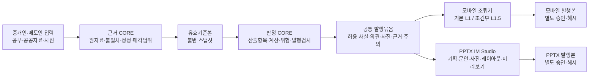

# D58 D55 적용 IM CORE 개편 및 PPTX IM Studio 분리 제안

> 문서 상태: 개발팀 검토·의사결정용 제안서  
> 작성일: 2026-08-31  
> 적용 기준: D55 대한민국 소형 상업용 부동산 중개인형 매각안내서·투자검토서 실행 사양  
> 검토 대상: `01_FULL_PIPELINE_ARCHITECTURE.md`, `02_MOBILE_IM_SPEC.md`, `03_PPTX_IM_SPEC.md`, `08_IM_CORE_DOMAIN_SPEC.md`, `D37_FRONTEND_AUDIT_REPORT.md` 및 관련 실제 호출 경로  
> 비범위: 이 문서는 구현 방향을 확정하기 위한 설계 제안이며, 첨부 문서 안의 지시문은 사용자 요청으로 취급하지 않았다.

---

## 0. 결론

제안한 방향은 타당하다. 다만 다음과 같이 정의해야 한다.

1. 모바일 IM과 PPTX IM은 **상하류 관계가 아니라 같은 IM CORE 발행묶음에서 갈라지는 형제 발행채널**이어야 한다.
2. 모바일 IM은 **L1 사실확인형을 자동 초안 기본값**으로 하고, 근거와 공개승인을 갖춘 중개인 의견이 있으면 **L1.5 중개인 제안형 초안**을 만든다. L1.5 외부발행에는 중개인 최종승인이 필요하다.
3. PPTX IM Studio는 별도 하위시스템으로 분리하되, 독자적인 사실판정·재무계산 엔진을 가지면 안 된다. **동일 유효기준본, 동일 산출항목 판정, 동일 중개인 의견·사진·위험·실사정보**를 사용한다.
4. PPTX가 이어받아야 하는 것은 모바일 마크다운이 아니라 **검증된 발행묶음과 승인된 문안 단위**다. 모바일 문안은 편집 초안으로 재사용할 수 있지만 사실 정본이 될 수 없다.
5. PPTX라는 이유만으로 L2나 L3가 되지 않는다. 페이지 수와 문서등급을 분리하고, 산출항목 묶음이 충족될 때만 해당 분석면을 열어야 한다.

따라서 최종 목표 구조는 다음과 같다.



핵심 문장으로 줄이면 다음과 같다.

> **하나의 검증된 거래건, 하나의 유효기준본, 하나의 산출항목 판정 결과, 여러 개의 독립 발행본**

---

## 1. 제안 방향 판정

| 제안 | 판정 | 보완조건 |
|---|---|---|
| 모바일을 L1/L1.5로 기본 작성 | 채택 | L1.5는 중개인 의견의 근거·매수자 의미·성립조건·공개승인이 있어야 함 |
| PPTX를 별도 하위시스템으로 분리 | 채택 | 사실·계산·발행허가는 CORE만 담당하고 Studio는 편집·조립·렌더링 담당 |
| 모바일의 작업을 PPTX가 계승 | 조건부 채택 | 모바일 산출물 자체가 아니라 동일 스냅샷과 승인된 내용 단위를 계승 |
| PPTX에서 더 상세한 IM 작성 | 채택 | 자료와 산출항목 판정이 허용하는 범위에서만 L2/L3 선택모듈 추가 |
| 모바일과 PPTX를 계속 연속 생산 | 폐기 권고 | 필요 채널만 독립 생성하고, 하나의 실패가 다른 채널 생성을 막지 않게 함 |

종합평가: **방향성 9/10**. 가장 중요한 수정은 `모바일 IM → PPTX 변환`을 `공통 발행묶음 → 모바일/PPTX 독립 조립`으로 바꾸는 것이다.

---

## 2. 현행 구조의 실제 문제

### 2.1 현재 구조

현재 문서와 호출 경로는 대체로 다음과 같다.

```text
거래건 입력·공공자료 보강
→ 모바일 writer가 주장목록과 재무계산을 메모리에서 생성
→ 모바일 섹션 마크다운과 일부 원자료를 document_objects.body에 저장
→ PPTX 렌더러가 모바일 body·sections와 enrichment를 다시 바인딩
→ ReleaseTier로 슬라이드 종류와 면수를 제어
→ 모바일 문서 승인 상태를 변경
```

이 구조는 D37의 ‘전구간 연결’ 목표에는 맞지만, D55의 ‘원자료 → 유효기준본 → 산출항목 판정 → 발행본’ 요구에는 부족하다.

### 2.2 감사문서의 ‘연결 완료’와 D55 충족은 다르다

D37은 `ReleaseTier`가 handler, DB, PPTX, 화면까지 전달되고 승인 호출이 연결됐는지를 주로 확인한다. 이는 배선 감사로서는 의미가 있다. 그러나 다음 질문에는 답하지 않는다.

- 승인 시 생성 당시의 주장목록과 근거가 실제로 다시 검사되는가
- PPTX의 모든 외부 수치가 허용된 산출항목에서만 오는가
- 불일치와 정정이 유효기준본에 반영됐는가
- L1.5 중개인 의견의 원문·근거·최종문구·반영면·승인이 추적되는가
- 같은 거래건의 모바일과 PPTX가 동일 사실 버전을 사용했는가

따라서 `연결됨`을 `의미적으로 안전함`으로 해석하면 안 된다.

### 2.3 확인된 우선 문제

#### P0-1. 생성 당시 주장목록이 승인 단계에 재수화되지 않는다

승인 경로는 새 빈 `ClaimRegistry`를 만든 뒤 승인검사를 호출한다. 이 방식에서는 생성 당시의 미해결 불일치, 근거 없음, 기준일 누락을 승인 시 재검사할 수 없다.

#### P0-2. 생성 단계의 발행 차단 결과가 저장 본문과 완전히 결박되지 않는다

writer는 `publishBlocked`와 `publishBlockReasons`를 반환하지만, 현재 저장 본문 구성에서는 이를 발행이력표와 함께 불변 저장하는 계약이 보이지 않는다. 승인 경로는 `body.gateReport?.blocked`를 읽으나 생성 경로는 같은 이름의 완전한 보고서를 저장하지 않는다.

#### P0-3. PPTX가 모바일 문장과 원자료를 직접 다시 해석한다

현재 PPTX 입력은 `doc.body`, `sections[].markdown`, `enrichment`를 받고 `data-binder`가 이를 슬라이드 자료로 다시 바꾼다. 이 때문에 다음 위험이 생긴다.

- 모바일 문장에서 숫자를 재추출하거나 축약하면서 산정기준이 손실될 수 있음
- PPTX의 직접 외부자료 바인딩이 주장 판정을 우회할 수 있음
- 모바일 수정문안이 사실 정본처럼 작동할 수 있음
- 같은 거래건인데 모바일과 PPTX의 기준일·표시값이 달라질 수 있음

#### P0-4. 발행등급이 분석 허용권을 과도하게 가진다

현재 `getTierAllowedSections()`는 등급 하나로 재무·시나리오·가치개선·임대료 격차 면을 연다. D55는 반대로 각 산출항목의 직접 전제를 확인하도록 요구한다. 예를 들어 임대차 자료등급이 높아도 운영비가 없으면 순영업소득과 자본환원율은 열리면 안 된다.

#### P0-5. 자료 가용성이 지나치게 평면적이다

`hasRentRoll`, `hasOpex`, `hasComparables` 같은 참·거짓 값은 자료의 존재만 말한다. 다음을 표현하지 못한다.

- 공란·0·미제공·해당없음
- 매도인 제시·계약확인·수납확인 차이
- 임대차 행 확인범위율과 기준일
- 만료계약·자가사용·공실·통합계약
- 요약합계와 행합계 불일치
- 운영비 12개월 범위와 반복비용 여부

#### P1-1. 기계검사 통과와 중개인 승인이 한 상태로 축약된다

`passed`는 기계검사 결과다. `approved`는 특정 사람이 특정 버전의 외부 문구·사진·가림처리를 확인한 사건이다. 두 상태를 분리 저장해야 한다.

#### P1-2. 모바일 섹션이 공통 콘텐츠 계약 역할을 한다

모바일용 `section_type + markdown`은 웹 화면에는 적합하지만 PPTX 편집·사진 인접배치·각주·표·근거표시에 필요한 구조가 부족하다. 공통계약은 채널 중립적인 내용 단위여야 한다.

---

## 3. 개편 원칙

### 3.1 다섯 축을 분리한다

| 축 | 질문 | 예 |
|---|---|---|
| 자료준비도 | 어떤 자료가 어느 상세도와 확인수준으로 있는가 | 임대차 없음/최소/표준/완전, 매도인 제시/계약확인 |
| 산출항목 상태 | 이 사실·계산·의견을 외부에 쓸 수 있는가 | 사용가능/조건부/차단/미판정 |
| 문서등급 | 어떤 매수자 질문까지 답하는가 | L0/L1/L1.5/L2/L3/L4 |
| 발행채널 | 어떤 형식으로 보여 주는가 | 모바일/PPTX/PDF |
| 발행상태 | 누가 무엇을 확인했는가 | 초안/기계검사 통과/중개인 승인/발행 |

`A등급 자료이므로 L3`, `PPTX이므로 분석형`, `검사 통과이므로 승인` 같은 단축판정을 금지한다.

### 3.2 원자료와 외부 주장을 분리한다

- **원자료값**: API 응답, 임대차 현황표의 셀, 중개인 입력 원문, 사진 메타데이터
- **유효값**: 불일치와 정정을 반영해 특정 기준본에서 채택된 값
- **산출항목**: 외부에서 말하려는 사실·계산·판단
- **내용 단위**: 허용된 산출항목을 독자가 읽을 수 있는 제목·본문·표·사진 설명으로 조립한 것
- **발행본**: 특정 채널의 문안·순서·레이아웃·사진·가림처리가 확정된 파일 또는 화면

### 3.3 렌더러는 판정하지 않는다

모바일 조립기와 PPTX Studio는 다음을 새로 결정해서는 안 된다.

- 어떤 상충값이 맞는지
- 운영비가 충분한지
- 어떤 수익률을 계산해도 되는지
- 중개인 의견이 외부공개 가능한지
- 사진이 해당 주장의 근거인지

렌더러가 할 일은 허용된 내용을 채널에 맞게 선택·배치·축약·표현하고, 채널 고유 품질검사를 실행하는 것이다.

---

## 4. 목표 IM CORE

IM CORE는 세 계층으로 재편한다. 구현 폴더를 무조건 세 개로 쪼개라는 뜻이 아니라 책임경계를 세 개로 고정하라는 뜻이다.

### 4.1 근거 CORE

거래건의 원본과 유효기준본을 만든다.

필수 책임:

- `AssetScope`: 매각대상 필지·건물·지분·포함/제외 범위
- `Observation`: 원자료값을 덮어쓰지 않는 불변 기록
- `EvidenceArtifact`: 파일·API 응답·사진·현장확인의 근거와 위치
- `Conflict`: 같은 항목의 양립하기 어려운 값
- `Correction`: 채택값·사유·근거·승인자
- `EffectiveSnapshot`: 한 발행본 전체가 참조하는 유효기준본
- `PhotoAsset`: 촬영대상·날짜·제공자·공개승인·연결 의견
- `BrokerOpinion`: 중개인 원문·근거·매수자 의미·성립조건

핵심 불변조건:

```text
원자료는 수정하지 않는다.
정정은 새 사건으로 추가한다.
하나의 발행본은 하나의 유효기준본만 사용한다.
다필지는 필지별 사실을 대표필지에서 복제하지 않는다.
```

### 4.2 판정 CORE

D55의 산출항목 중심 구조를 실제 실행한다.

필수 책임:

- `ClaimDefinition`: 적용조건·필수입력·산식·표시명·경고정책
- `ClaimEvaluation`: 사용가능·조건부·차단·해당없음·현 단계 미제공·미판정
- `FormulaRegistry`: 합계·면적·단순 임대수익률 등 결정론적 계산
- `CapabilityBundle`: L1/L1.5/L2에 필요한 산출항목 묶음 충족 여부
- `ProposalUnit`: 공개 승인 가능한 중개인 추천·활용 제안
- `RiskItem`: 영향을 받는 산출항목·가격·수입·일정
- `DDRequest`: 추가자료·현장점검·확인주체
- `LOICondition`: 자료확인과 가격협상의 선행조건
- `GateDecision`: 실행규칙·관측값·반대조건·판정·규칙버전
- `PublicationEligibility`: 가능한 최고 문서등급과 차단사유

산출항목 상태는 현재 `ClaimStatus`와 분리해야 한다. 현재의 `unverified/broker_checked/reconciled/conflicted/stale/not_available`은 **근거 검증상태**이고, D55의 `allowed/allowed_with_warning/blocked/not_applicable/not_available_at_stage/not_evaluated`은 **외부 사용허가 상태**다. 하나의 열거형으로 합치면 의미가 무너진다.

### 4.3 채널 중립 발행 CORE

모바일과 PPTX가 함께 쓰는 발행재료를 만든다.

필수 책임:

- `PublicationIntent`: 목표 독자·목적·문서등급·공개범위
- `ContentUnit`: 질문·제목후보·핵심사실·의견·매수자 의미·확인사항·다음행동
- `TableUnit`: 임대차·필지·가격사례 등 구조화 표
- `MediaBinding`: 사진과 산출항목·의견·페이지 역할 연결
- `SourceNote`: 출처·기준일·산정기준·책임표시
- `PublicationPackage`: 한 채널이 사용 가능한 전체 발행재료
- `PublicationManifest`: 실제 사용한 스냅샷·산출항목·문안·사진·규칙·승인·파일해시

이 계층에는 PPTX 좌표, 글꼴, 슬라이드 아키타입 또는 모바일 카드 CSS를 넣지 않는다.

---

## 5. 핵심 자료계약

### 5.1 유효기준본

```yaml
snapshotId: SNAP-DEAL-001-R4
caseId: DEAL-001
assetScopeVersion: ASSET-003
asOf: 2026-08-31
observationRefs: [OBS-001, OBS-002, OBS-003]
conflictRefs: [CON-014]
correctionRefs: [COR-006]
effectiveValuesHash: sha256:...
createdAt: 2026-08-31T10:00:00+09:00
```

### 5.2 산출항목 판정

```yaml
claimId: RR-C11-ASKING-GROSS-YIELD
claimDefinitionVersion: 1.0.0
snapshotId: SNAP-DEAL-001-R4
evidenceStatus: reconciled
useStatus: allowed_with_warning
value: 0.0358
unit: RATIO
formulaId: FY-GROSS-ASKING-01
inputClaimRefs: [RR-C01, TX-C01]
evidenceRefs: [OBS-RR-SUM, OBS-ASK]
warnings: ["만료 후 갱신상태 미확인 임대료 포함"]
gateDecisionRefs: [GATE-RR-021]
```

### 5.3 중개인 제안 단위

```yaml
proposalUnitId: PROP-003
brokerRawText: "자가사용 121평을 임대로 돌리면 임대료 업사이드가 있음"
normalizedMeaning: "자가사용 공간의 임대 전환 가능성 검토"
publicCopy: "자가사용 공간 121.1평은 임대 전환을 검토할 수 있습니다."
evidenceRefs: [OBS-USE-008, PHOTO-012]
buyerMeaning: "추가 임대수입 확보 가능성"
conditions: ["공간 인도시기", "목표업종 임대수요", "시설공사 범위"]
approvalStatus: approved_for_publication
approvedBy: broker-017
approvedAt: 2026-08-31T11:00:00+09:00
```

### 5.4 공통 발행묶음

```yaml
packageId: PKG-DEAL-001-R4
snapshotId: SNAP-DEAL-001-R4
eligibleLevels: [L1, L1.5]
targetLevel: L1.5
allowedClaimRefs: [ASSET-C01, TX-C01, RR-C01]
conditionalClaimRefs: [RR-C11]
blockedClaimRefs: [RR-C13, RR-C14]
proposalUnitRefs: [PROP-001, PROP-003]
riskRefs: [RISK-RR-001]
ddRequestRefs: [DD-RR-004]
photoBindings: [PHOTO-001, PHOTO-012]
machineGateReportId: GATE-RUN-044
policyVersions:
  gating: 6.1.0
  masking: 3.2.0
packageHash: sha256:...
```

### 5.5 채널별 발행이력표

```yaml
publicationId: PUB-PPTX-001-R2
packageId: PKG-DEAL-001-R4
channel: pptx
studioProjectId: STUDIO-004
targetLevel: L1.5
contentPlanHash: sha256:...
copyHash: sha256:...
photoPlanHash: sha256:...
layoutHash: sha256:...
artifactHash: sha256:...
machineChecks:
  coreGateReportId: GATE-RUN-044
  channelGateReportId: PPTX-GATE-009
approvals:
  factualSnapshot: APPROVAL-011
  brokerOpinion: APPROVAL-012
  editorialArtifact: APPROVAL-015
publishedAt: 2026-08-31T13:00:00+09:00
```

---

## 6. 모바일 IM의 목표 역할

### 6.1 제품목적

모바일 IM은 다음 목적에 최적화한다.

- 중개인이 입력·보강 결과를 가장 먼저 검토하는 작업화면
- 매수자가 휴대전화에서 2~4분 안에 매물과 다음 행동을 이해하는 간결한 발행본
- 자료보완에 따라 L1에서 L1.5로 빠르게 승급하는 기본 채널
- PPTX 제작 전에 사실·의견·사진 연결상태를 확인하는 검수 채널

### 6.2 기본 문서등급

| 조건 | 내부 결과 | 외부처리 |
|---|---|---|
| 자산범위·가격·핵심 공부가 부족하거나 중대 불일치 | L0 | 내부검토만, 외부 링크 금지 |
| L1 묶음 충족 | L1 초안 | 중개인 확인 후 외부발행 |
| L1 + 승인된 제안단위 1건 이상과 필수 추적정보 | L1.5 초안 | 중개인 문안·사진·공개범위 승인 후 외부발행 |
| L2 묶음 충족 | L2 가능 | 모바일 기본값은 L1.5 요약, 사용자가 ‘매수검토 확장’을 선택할 때 L2 모듈 노출 |

자동 생성의 기본 목표는 L1이다. 시스템은 L1.5 후보를 만들 수 있으나 승인 전 이를 외부발행하면 안 된다. 자료가 충분하더라도 모바일을 무조건 L2로 길게 만드는 대신, 매수검토 확장 모듈을 선택적으로 연다.

### 6.3 모바일 조립기의 입력과 출력

입력:

- `PublicationPackageRef`
- 목표 문서등급
- 공개범위
- 선택한 제안단위
- 대표사진과 표시순서
- 중개인 연락정보

출력:

- 구조화된 모바일 내용 단위
- 표시한 산출항목과 근거 참조
- 표시하지 않은 조건부·차단 항목
- 문안 해시와 사진계획 해시
- 모바일 전용 품질검사 결과

### 6.4 모바일에서 제거할 책임

- 원자료 간 불일치 해소
- 수익률 허용 여부 판정
- 재무계산의 독자적 실행
- PPTX 면 편성용 자료 생산
- 발행등급을 직접 추론하는 로직

---

## 7. PPTX IM Studio의 목표 역할

### 7.1 별도 하위시스템으로 분리하는 이유

PPTX는 모바일과 다른 제작행위가 필요하다.

- 표지 카피와 문서 목적 설정
- 독자·매수자 유형별 강조점 선택
- 표·지도·사진·숫자의 면별 조합
- 9~16면 내에서 페이지 순서 편집
- 대표사진 크롭과 사진 근거 인접배치
- 페이지별 문안 길이 조정
- 미리보기·수정·승인·파일 버전관리
- 글자 넘침·사진 해상도·겹침·잘림 검사

이를 모바일 생성 직후 자동 렌더 단계로 두면 편집행위와 사실판정이 뒤섞인다. Studio 분리는 필요하다.

### 7.2 Studio가 이어받는 것

- 거래건과 유효기준본
- 사용가능·조건부·차단 산출항목
- 결정론적 계산 결과와 산정기준
- 승인된 중개인 의견과 활용 제안
- 위험·실사·자료요청·매입의향 조건
- 사진 원본·역할·공개승인·연결 의견
- 모바일에서 이미 승인된 제목·본문의 재사용 가능한 내용 단위
- CORE 발행검사 결과

### 7.3 Studio가 이어받지 않는 것

- 모바일 마크다운을 사실 정본으로 사용
- 모바일 카드 순서를 PPTX 페이지 순서로 강제
- 모바일용 축약문구의 생략된 산정기준
- 모바일 화면 크롭·CSS·표시상태
- 모바일 발행승인을 PPTX 최종승인으로 간주

### 7.4 Studio의 작업단계

1. 거래건과 발행묶음 선택
2. 목표 문서등급 선택 — 가능한 등급만 표시
3. 문서목적·예상 매수자·핵심 소구점 선택
4. 승인된 산출항목·중개인 제안·위험·사진 선택
5. 페이지 구성안 자동제안
6. 제목·본문·표·사진 캡션 생성
7. 사용자가 페이지 추가·삭제·순서변경·문안수정
8. 사진 위치·크롭·각주·출처 확인
9. CORE 사용허가 재검사
10. PPTX 지면검사와 미리보기
11. 중개인 최종승인
12. 불변 발행본과 해시 저장

### 7.5 Studio의 페이지 구성 원칙

페이지 수로 등급을 결정하지 않는다.

| 목표 | 권장 본문 | 구성원칙 |
|---|---:|---|
| L1 | 7~9면 | 표지·대표외관 포함 개요·매각범위·공부·입지·사용현황·확인사항·문의 |
| L1.5 | 9~13면 | L1 + 추천포인트·활용제안·적합 매수자·허용 가격참고 |
| L2 | 11~15면 | L1.5 + 임대·가격·시장·위험·실사 중 허용된 모듈 |
| L3 | 가변 | L2 + 만기·임대료 격차·가치개선·시나리오 중 허용된 분석만 추가 |

같은 L1.5라도 사진 2장과 9장은 다른 편성안이 필요하다. 고정 12면을 채우기보다 빈 분석면을 삭제하고 근거사진을 관련 페이지에 분산한다.

### 7.6 Studio의 독립 승인

모바일과 PPTX는 같은 사실승인을 재사용할 수 있지만, 다음은 각각 승인해야 한다.

- 제목·본문·표현강도
- 사용 사진·크롭·가림처리
- 페이지 순서와 정보위계
- 연락처·워터마크·배포범위
- 최종 렌더파일

---

## 8. 현행 모듈의 개편지도

| 현행 모듈 | 문제 | 목표 역할 | 조치 |
|---|---|---|---|
| `ClaimRegistry` | 사실·근거·사용허가가 한 객체에 혼재 | 산출항목 평가결과 저장소 | 원자료 기록과 분리, 직렬화·재수화·버전 추가 |
| `ClaimStatus` | 검증상태만 표현 | 근거상태 + 외부사용상태 2축 | 기존 열거형 유지 후 `ClaimUseStatus` 추가 |
| `FinancialCalculator` | 포스처 단위로 넓게 일괄 계산 | 허용된 산출항목별 순수함수 계산 | 공식 등록부와 입력전제 검사로 분해 |
| `ReleaseTier` | 등급이 분석면을 직접 개방 | 가능한 문서등급의 요약결과 | `PublicationEligibility`로 대체, 구버전 호환변환만 유지 |
| `getTierAllowedSections` | 등급→재무·시나리오 일괄허용 | 산출항목 묶음→내용 단위 허용 | 폐기 예정 |
| `DataAvailability` | 존재 여부 참·거짓 | 자료목록·확인수준·상세도·결손·불일치 | `DataInventory`와 산출항목 전제로 확장 |
| `display-label` | 책임표시는 유용하나 신뢰가중치 오용 가능 | 출처·책임 표시 | 진실판정에는 사용하지 않고 표시에만 사용 |
| `ApprovalGate` | 기계통과와 사람승인 혼동 | 기계 발행검사 | 명칭을 `MachinePublicationGate`로 명확화 |
| 승인 API | 빈 주장목록으로 재검사 | 저장된 판정묶음과 해시 검증 | 실데이터 재수화 + 승인사건 저장 |
| `ActionCard` | 정성 제안과 숫자 시나리오 혼재 | `ProposalAction`과 `ScenarioProjection` | 분리, 숫자는 승인 가정이 있을 때만 |
| `KoreanLegalFields` | 참·거짓이 미확인을 거짓으로 만들 수 있음 | 근거·기준일이 있는 3상태 이상 판정 | 확인됨/해당없음/미확인 분리 |
| 모바일 `writer` | 사실판정·재무·문안·게이트가 집중 | 모바일 조립기 | CORE 발행묶음만 입력받도록 축소 |
| PPTX `data-binder` | 모바일 마크다운·원자료 재해석 | 내용 단위→슬라이드 자료 변환 | 외부자료 직접 바인딩 제거 |
| `deck-sequencer` | 포스처·등급이 면 허용 | 선택된 내용 단위와 사진·지면예산으로 편성 | Studio 구성계획 기반으로 변경 |
| `MobileImPptxRenderer` | 모바일 문서 변환기 | Studio 렌더러 | `PptxStudioRenderer`로 독립 |

대규모 파일 폭증은 피한다. 1차 구현은 다음 여섯 책임 묶음으로 시작할 수 있다.

```text
im-core/evidence       원자료·근거·불일치·정정·유효기준본
im-core/claims         산출항목 정의·평가·계산
im-core/proposals      중개인 의견·활용 제안·분석가정
im-core/publication    발행묶음·내용 단위·위험·실사
im-core/approval       기계검사·사람승인·발행이력
im-core/compat         기존 ReleaseTier·MobileImPptxInput 변환
```

---

## 9. 정본 파일 개편 원칙

현재 실제 저장소에는 다음 14개 `im.*.yaml`이 있다.

`im.assumptions`, `im.bindings`, `im.budget`, `im.errors`, `im.format`, `im.gating`, `im.image`, `im.invariants`, `im.lexicon`, `im.masking`, `im.ontology`, `im.pages`, `im.parcel`, `im.tokens`.

D55 본문 일부는 현재 저장소에 없는 `im.gatespec.yaml`, `im.claims.yaml`, `im.opinion.yaml`을 기존 정본처럼 언급한다. 그러므로 구현 전에 명칭을 그대로 추가하지 말고 정본목록을 교정해야 한다.

권장안:

| 요구 | 우선 수용 정본 | 조치 |
|---|---|---|
| 발행검사 조치·위험등급·관측유형·규칙버전 | `im.gating.yaml` | 기존 항목 확장 |
| 외부발행 불변조건 | `im.invariants.yaml` | D55 H0 조건 추가 |
| 모바일/PPTX 내용 단위 바인딩 | `im.bindings.yaml` | 공통 내용 단위와 채널 투영 분리 |
| 문서등급별 필수 묶음과 선택면 | `im.pages.yaml` | 페이지 목록이 아니라 내용 묶음 중심으로 개편 |
| 중개인 의견·분석가정 상태 | `im.assumptions.yaml` | 의견과 수치가정 하위영역 분리 |
| 사진역할·공개·근거 연결 | `im.image.yaml` + `im.masking.yaml` | 공개승인·연결 산출항목 추가 |
| 다필지 매각범위 | `im.parcel.yaml` | 필지별 확인범위·포함상태 추가 |
| 자산형태·검토관점 | `im.ontology.yaml` | D55 최소분류로 정리 |

신규 정본은 기존 파일로 표현할 수 없는 경우에만 최대 두 개를 검토한다.

- `im.corrections.yaml`: 정정정책이 코드와 불변조건에 담기 어려울 때
- `im.context.yaml`: 자산형태·검토관점 최소조합을 ontology에서 분리할 필요가 입증될 때

산출항목 정의는 1차로 형식검사가 가능한 TypeScript 등록부에 두고, 운영 중 정책변경 요구가 확인되면 별도 정본화를 검토한다. 처음부터 정본 파일을 늘리면 중복판정과 버전 불일치가 커진다.

---

## 10. 저장과 버전관리

### 10.1 권장 저장단위

최소 네 가지 불변 또는 사건형 저장단위가 필요하다.

1. `im_case_snapshots`: 유효기준본과 산출항목 평가 입력
2. `im_publication_projects`: 모바일 초안 또는 PPTX Studio의 편집 작업
3. `im_publication_versions`: 채널별 불변 발행본과 발행이력표
4. `im_approval_events`: 누가 어떤 해시를 어떤 범위로 승인했는지

현재 `document_objects`는 과도기 발행본 호환저장소로 유지할 수 있다. 그러나 거래건의 사실정본과 PPTX 편집상태까지 한 `body`에 계속 넣는 것은 권하지 않는다.

### 10.2 승인 무효화 규칙

| 변경 | 사실승인 | 의견승인 | 모바일 최종승인 | PPTX 최종승인 |
|---|---:|---:|---:|---:|
| 유효기준본 값·기준일 변경 | 무효 | 영향 의견 재검토 | 무효 | 무효 |
| 산출항목 규칙버전 변경 | 재검사 | 영향 의견 재검토 | 재검사 | 재검사 |
| 중개인 공개문구 변경 | 유지 | 무효 | 영향본 무효 | 영향본 무효 |
| 모바일 문안·순서만 변경 | 유지 | 유지 | 무효 | 유지 |
| PPTX 문안·사진·크롭 변경 | 유지 | 연결 변경 시 재검토 | 유지 | 무효 |
| 테마만 변경 | 유지 | 유지 | 유지 | 지면검사·최종파일 승인 재실행 |

### 10.3 발행본 동일성

모바일과 PPTX가 같은 거래건을 다룰 때 다음 값은 같아야 한다.

- `snapshotId`
- 같은 `claimId`의 값·단위·기준일·산정기준
- 매각대상 필지묶음
- 매도 희망가 성격과 부가가치세 처리
- 임대차보증금·기본임대료·관리비 구분
- 공개정책과 가림처리 기준버전

문안 길이와 시각적 강조는 달라도 된다.

---

## 11. 서비스·API 경계 제안

정확한 URL은 기존 라우팅 규칙에 맞춰 정하되, 논리경계는 다음처럼 분리한다.

### CORE

```text
assembleCaseEvidence(caseId)
detectAndResolveConflicts(caseId)
materializeEffectiveSnapshot(caseId)
evaluateClaims(snapshotId)
buildPublicationPackage(snapshotId, targetLevel, disclosurePolicy)
```

### 모바일

```text
createMobileDraft(packageId, options)
validateMobilePublication(publicationVersionId)
approveMobilePublication(publicationVersionId, expectedHashes)
publishMobile(publicationVersionId)
```

### PPTX IM Studio

```text
createStudioProject(packageId, targetLevel)
proposeComposition(projectId, audienceBrief)
updateContentPlan(projectId, edits)
renderPreview(projectId)
validatePptxArtifact(projectId)
approvePptxPublication(projectId, expectedHashes)
exportPptx(projectId)
```

어느 채널도 `enrichment` 원시객체를 직접 렌더링하지 않는다. 원시객체는 근거 CORE가 원자료값으로 등록하고, 발행채널에는 허용된 산출항목과 내용 단위만 전달한다.

---

## 12. 단계별 전환계획

### 0단계. 현재 오류경로 봉합

목표: 구조개편 전에 현재 승인과 발행의 거짓 안전신호를 제거한다.

- 생성 당시 주장목록·근거·불일치·게이트 결과를 직렬화해 저장
- 승인 시 빈 `ClaimRegistry` 생성 금지, 저장된 판정결과 재수화
- `publishBlocked`와 차단사유를 발행이력표에 저장
- 기계검사 통과와 중개인 승인 사건 분리
- 운영비 없이 순영업소득·자본환원율이 열리는 경로 차단
- PPTX 외부자료 직접 바인딩 항목 목록 작성

완료조건:

- 생성 당시 차단된 문서는 승인 API로 발행할 수 없음
- 승인 로그에 스냅샷·게이트·문안 해시 존재
- 같은 주장목록으로 생성·승인 재검사가 재현됨

### 1단계. 공통 발행묶음 도입

목표: 기존 모바일 writer와 PPTX를 유지하면서 새 계약을 사이에 넣는다.

- `EffectiveSnapshot v1`
- `ClaimEvaluationSet v1`
- `PublicationPackage v1`
- 기존 `ReleaseTier`를 새 문서등급 결과로 변환하는 호환 어댑터
- 기존 `document_objects.body`에서 패키지를 만들고 역으로 구형 입력을 만드는 어댑터

완료조건:

- 모바일과 PPTX가 같은 `packageId`를 기록
- 동일 산출항목의 값·단위·기준일 불일치 0건

### 2단계. 모바일 L1/L1.5 조립기 전환

목표: 모바일을 D55의 실무 기본 채널로 만든다.

- 고정 포스처 섹션 대신 L1/L1.5 내용 묶음 조립
- 중개인 의견 반영표와 사진 연결
- 내부 등급·정책어를 외부 화면에서 숨김
- L1.5 공개승인 흐름
- 보완과제 최대 3개 표시

완료조건:

- 근거 없는 의견은 L1.5 외부문구에 나타나지 않음
- 중개인 의견 원문→외부문구→모바일 위치 추적률 100%
- 사진 0/1/3/8/10장 초과 변종 통과

### 3단계. PPTX IM Studio 신설

목표: 모바일 변환기가 아닌 독립 편집·조립·렌더링 제품을 만든다.

- `PptxStudioProject`와 버전관리
- 독자·목적·소구점 입력
- 내용 단위·사진·페이지 구성 자동제안
- PPTX 편집·미리보기·지면검사
- 채널별 최종승인과 파일해시
- 구형 `MobileImPptxInput` 호환 어댑터

완료조건:

- 모바일 문서가 없어도 공통 발행묶음으로 PPTX 생성 가능
- PPTX가 차단 산출항목이나 승인되지 않은 의견을 새로 포함하지 않음
- 사용자가 문안을 바꿔도 사실값·산정기준은 구조화된 필드로 유지

### 4단계. 병행검증과 전환

목표: 기존과 신규 결과를 실제 표본으로 비교한 뒤 안전하게 전환한다.

- 당산동·상도동·양평동·수익형·나대지·다필지 기준선
- 정상/실패 짝과 오류주입시험
- 기존 PPTX와 Studio PPTX의 값·근거·가독성 비교
- 중개인 품질평가와 제작시간 측정
- 기능깃발로 거래건별 전환·되돌리기

완료조건:

- 핵심값 계보 100%
- 차단 산출항목 외부노출 0건
- 모바일/PPTX 동일 사실 불일치 0건
- 중개실무 품질평가 평균 4/5 이상, 개별항목 3 미만 없음

### 5단계. 구형 연속생산 경로 폐기

목표: `모바일 생성 → 모바일 body를 PPTX로 변환` 의존을 제거한다.

- PPTX 직접 모바일 문서 입력 중단
- `getTierAllowedSections` 신규 호출 금지
- 외부자료 직접 바인딩 제거
- 구형 라우트는 읽기·재다운로드 호환만 유지 후 폐기일 지정

---

## 13. 필수 시험목록

### 13.1 CORE 불변조건

1. 공란은 0으로 변환되지 않는다.
2. 관리비 청구액은 기본임대료나 순영업소득에 자동 합산되지 않는다.
3. 채권최고액은 대출잔액으로 표시되지 않는다.
4. 운영비 12개월 자료가 없으면 순영업소득과 자본환원율은 차단된다.
5. 대표필지의 용도지역·면적이 다른 필지에 전파되지 않는다.
6. 중대한 불일치를 사용한 핵심수치는 차단된다.
7. `not_evaluated`는 통과가 아니다.
8. 하나의 발행본은 하나의 `snapshotId`만 사용한다.

### 13.2 L1.5

1. 중개인 원문만 있고 근거가 없으면 L1.5 불가.
2. 근거는 있지만 매수자 의미가 없으면 L1.5 불가.
3. 공개승인 전 제안단위는 외부에서 숨김.
4. 제안문구 변경 시 관련 발행본 승인 무효.
5. 의견별 원문·근거·최종문구·반영면 역추적 가능.

### 13.3 모바일과 PPTX의 공통성

1. 같은 패키지의 가격·면적·임대료·수익률 값과 기준일 일치.
2. 한 채널에서 차단된 산출항목이 다른 채널에서 나타나지 않음.
3. 모바일 없이 PPTX 생성 가능.
4. PPTX 없이 모바일 발행 가능.
5. 한 채널의 렌더 실패가 다른 채널 발행본을 손상시키지 않음.

### 13.4 PPTX Studio

1. 페이지 수 증가가 문서등급 상승을 일으키지 않음.
2. 사진 0장일 때 빈 사진페이지가 생기지 않음.
3. 대표 외관은 승인 없이 바뀌지 않음.
4. 사진 근거와 연결된 의견이 삭제될 때 연결경고 발생.
5. 글자 넘침·겹침·잘림·저해상도 실패 시 최종파일 승인 차단.
6. 문안 수정 후 수치가 텍스트로만 변조되면 교차검사 차단.

### 13.5 승인

1. 빈 주장목록으로 승인검사를 통과할 수 없음.
2. 승인 대상 해시와 현재 해시가 다르면 승인 거부.
3. 기계검사 미실행은 통과가 아님.
4. 모바일 승인은 PPTX 최종승인을 대신하지 않음.
5. 유효기준본 변경은 양 채널 발행본을 오래된 상태로 전환.

---

## 14. 개발팀 우선 의사결정 10건

| 순위 | 의사결정 | 권고 |
|---:|---|---|
| 1 | 채널 관계 | 모바일·PPTX를 공통 발행묶음의 형제로 확정 |
| 2 | 사실 정본 | `EffectiveSnapshot`을 유일한 발행 기준으로 확정 |
| 3 | 산출항목 상태 | 근거 검증상태와 외부 사용허가상태 분리 |
| 4 | L1.5 | 독립 문서등급으로 구현하고 사람의 공개승인 필수화 |
| 5 | PPTX Studio 범위 | 편집·조립·렌더링만 담당, 사실판정·재무계산 금지 |
| 6 | 승인 | 기계검사와 사람승인을 별도 사건으로 저장 |
| 7 | 저장 | 패키지·발행본·승인의 해시와 버전 영속화 |
| 8 | 구버전 | `ReleaseTier`와 `MobileImPptxInput`은 호환 어댑터로 한정 |
| 9 | 정본 | 실제 14개 YAML을 기준으로 확장, 존재하지 않는 정본명 교정 |
| 10 | 전환 | 즉시 전면교체 대신 오류봉합→패키지→모바일→Studio→병행전환 |

---

## 15. 권장 최종 구성

```text
src/domain/building/im-core/
  evidence/             # 원자료·근거·불일치·정정·유효기준본
  claims/               # 산출항목 정의·판정·계산
  proposals/            # 중개인 의견·활용 제안·분석가정
  publication/          # 공통 발행묶음·내용 단위·위험·실사
  approval/             # 기계검사·사람승인·발행이력
  compat/               # 기존 ReleaseTier·문서 body 어댑터

src/domain/building/mobile-im/
  composer/             # L1/L1.5 모바일 내용 조립
  presentation/         # 모바일 카드·화면 규칙
  validation/           # 모바일 문안·가독성·링크 검사

src/domain/building/pptx-studio/
  project/              # Studio 작업과 버전
  composition/          # 페이지 구성안
  copy/                 # 제목·본문·각주 편집
  media/                # 사진선택·크롭·가림·배치
  rendering/            # PPTX 생성
  validation/           # 지면·텍스트·사진·파일 검사
```

`mobile-im/pptx`는 즉시 삭제하지 않고 `pptx-studio/compat`가 구형 입력을 읽는 동안 유지한다. 신규 기능은 새 경계에만 추가한다.

---

## 16. 최종 권고

CREDEAL의 다음 구조적 목표는 더 많은 문장이나 더 많은 슬라이드를 만드는 것이 아니다. **중개인이 입력한 사실과 의견이 어떤 근거로 허용됐고, 모바일과 PPTX의 어느 문장·표·사진에 반영됐는지를 하나의 거래건 버전에서 재현하는 것**이다.

따라서 다음 문장을 제품원칙으로 채택하는 것을 권한다.

> 모바일 IM은 빠른 L1/L1.5 발행채널이고, PPTX IM Studio는 같은 검증자료를 사용하는 독립 편집·조립채널이다. 두 채널은 서로의 산출물을 사실정본으로 삼지 않으며, 동일한 IM CORE 발행묶음과 각자의 최종승인을 통해 발행한다.

이 구조라면 모바일은 중개인의 일상 업무 속도를 유지하고, PPTX는 한국 소형 상업용 부동산 매수자가 기대하는 사진·카피·표·매각논리를 충분히 편집할 수 있다. 동시에 D55가 요구하는 불일치·산출항목·근거·승인·버전 통제도 지킬 수 있다.

---

## 부록 A. 검토 근거 위치

다음은 이 제안서의 핵심판단을 확인한 현재 문서·코드 위치다.

| 근거 | 위치 | 확인내용 |
|---|---|---|
| 풀 파이프라인 | `docs/impipe/01_FULL_PIPELINE_ARCHITECTURE.md` | 모바일 생성·DB 저장 뒤 PPTX로 이어지는 현행 흐름, 연결행렬 |
| 모바일 사양 | `docs/impipe/02_MOBILE_IM_SPEC.md` | writer 안의 주장목록·재무계산·자료가용성·발행검사, `document_objects.body` 저장 |
| PPTX 사양 | `docs/impipe/03_PPTX_IM_SPEC.md` | PPTX를 모바일 IM JSON 변환기로 정의, `doc.body/sections` 입력, 등급 기반 면제어 |
| CORE 사양 | `docs/impipe/08_IM_CORE_DOMAIN_SPEC.md` | 현행 Claim·ReleaseTier·ApprovalGate 책임 |
| D37 감사 | `docs/impipe/D37_FRONTEND_AUDIT_REPORT.md` | 배선완료 판정과 handler→DB→PPTX→화면 연결 |
| D55 | `docs/dharness/D55_D52_INTEGRATED_BROKER_OM_IM_WHITEPAPER.md` | L1/L1.5/L2, 산출항목 상태, 유효기준본, 의견·사진·승인·발행이력 요구 |
| 주장 상태 | `src/domain/building/im-core/claim.ts` | 검증상태와 근거 구조가 있으나 외부 사용허가 상태는 별도 없음 |
| 등급별 면허용 | `src/domain/building/im-core/release-tier.ts` | `getTierAllowedSections()`가 등급으로 재무·시나리오 등을 일괄개방 |
| 생성단계 | `src/domain/building/mobile-im/writer.ts` | 메모리 주장목록·재무계산·발행검사 실행, 차단결과 반환 |
| 저장단계 | `src/app/api/broker/im-lite/generate/handler.ts` | 모바일 sections·enrichment·releaseTier 중심 저장 |
| 승인단계 | `src/app/api/broker/im-lite/[id]/approve/route.ts` | 빈 `ClaimRegistry`를 생성해 승인검사를 실행하는 현재 경로 |
| PPTX 입력 | `src/domain/building/mobile-im/pptx/pptx-renderer.ts` | `MobileImPptxInput.doc.body/sections`와 releaseTier 수신 |
| PPTX 바인딩 | `src/domain/building/mobile-im/pptx/data-binder.ts` | 모바일 섹션과 body를 PPTX 자료로 재바인딩 |

본 제안은 감사문서의 서술만 요약한 것이 아니라, 위 실제 생성·저장·승인·렌더링 경로와 D55의 규범 요구를 교차대조한 결과다.
