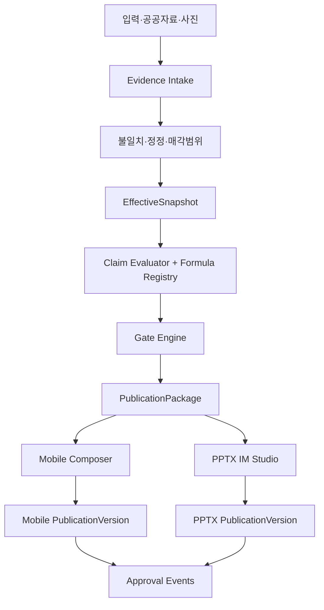

# CREDEAL IM CORE v1 소프트웨어 설계서

> 설계 ID: `IC-SDD-001`  
> 버전: 1.0.0  
> 상태: 승인후보  
> 아키텍처 형식: 모듈형 단일 애플리케이션 내부의 명시적 경계 + 불변 발행버전

---

# 0. 설계목표

## 0.1 사용자 목표

중개인은 주소·최소 임대차 정보·현장사진·중개인 의견을 입력해 다음을 수행할 수 있어야 한다.

1. 확인된 자료 범위에서 L1 사실확인형 모바일 IM을 빠르게 만든다.
2. 근거 있는 중개인 의견을 더해 L1.5 매각제안서를 만든다.
3. 같은 거래건의 검증자료를 재입력하지 않고 PPTX IM Studio를 시작한다.
4. PPTX에서 매수자·매각논리·사진·페이지 구성을 편집한다.
5. 자료가 보완되면 이전본을 덮어쓰지 않고 새 유효기준본과 발행본을 만든다.

## 0.2 품질목표

- 정확성: 차단된 산출항목의 외부노출 0건
- 일관성: 동일 패키지의 모바일·PPTX 핵심값 불일치 0건
- 추적성: 외부 핵심값·중개인 의견의 근거와 승인 추적률 100%
- 재현성: 발행본 해시로 사용 스냅샷·규칙·문안·사진·레이아웃 재구성
- 실무성: 모바일 L1/L1.5 초안과 PPTX Studio 편집흐름이 중개인 업무에 맞음
- 점진성: 기존 URL·기존 문서 재다운로드·기존 생성경로를 단계적으로 유지

## 0.3 잠정 성능목표

실물 기준선 측정 전까지 다음은 잠정 SLO다.

| 구간 | 목표 | 절대상한 |
|---|---:|---:|
| 저장된 원자료에서 유효기준본 생성 | p95 2초 | 5초 |
| 산출항목·발행검사 평가 | p95 1초 | 3초 |
| 모바일 문안 포함 초안 생성 | p95 60초 | 현행 120초 유지 |
| 16면 PPTX 미리보기 렌더 | p95 30초 | 60초 |
| 승인·발행 상태전이 | p95 1초 | 3초 |

외부 API 조회시간은 첫 두 항목에서 제외한다. P4에서 실측 후 개정한다.

---

# 1. 현행과 목표 구조

## 1.1 현행

```text
입력·공공보강
→ 모바일 writer 안에서 주장목록·재무·LLM 섹션·게이트
→ document_objects.body에 모바일 중심 결과 저장
→ MobileImPptxRenderer가 body/sections/enrichment 재바인딩
→ ReleaseTier로 면 허용
→ 모바일 문서 승인상태 변경
```

## 1.2 목표



## 1.3 핵심 경계

| 경계 | 소유 | 하지 않는 일 |
|---|---|---|
| 근거 CORE | 원자료·불일치·정정·유효기준본 | 문안·페이지·레이아웃 |
| 판정 CORE | 산출항목·계산·위험·발행검사·가능등급 | LLM 자유수치·채널 표현 |
| 발행 CORE | 채널 중립 내용 단위·발행묶음·발행이력 | PPTX 좌표·모바일 CSS |
| 모바일 조립기 | L1/L1.5 웹 내용계획·문안·가독성 | 사실판정·독립 계산 |
| PPTX IM Studio | 문서기획·페이지·문안·사진·렌더링 | 원자료 채택·사용허가 변경 |
| 승인서비스 | 기계검사·사람승인·해시·무효화 | 문안 생성 |

---

# 2. 주요 요구사항

## 2.1 기능요구

| ID | 요구 |
|---|---|
| ICR-FR-001 | 원자료값과 원문을 덮어쓰지 않고 저장한다. |
| ICR-FR-002 | 불일치와 정정을 별도 기록하고 유효기준본을 생성한다. |
| ICR-FR-003 | 유효기준본은 불변이며 해시와 규칙버전을 가진다. |
| ICR-FR-004 | 근거 검증상태와 외부 사용허가상태를 분리한다. |
| ICR-FR-005 | 산출항목마다 적용조건·필수입력·산식·경고·차단사유를 평가한다. |
| ICR-FR-006 | L1/L1.5/L2 가능여부는 산출항목·의견 묶음으로 판정한다. |
| ICR-FR-007 | 중개인 의견 원문·근거·매수자 의미·성립조건·외부문구·승인을 추적한다. |
| ICR-FR-008 | 사진 대상·제공자·기준일·공개승인·연결 의견을 저장한다. |
| ICR-FR-009 | 하나의 공통 발행묶음에서 모바일·PPTX를 독립 생성한다. |
| ICR-FR-010 | 모바일은 L1 기본, 조건부 L1.5 초안을 만든다. |
| ICR-FR-011 | PPTX Studio는 허용된 내용 단위만 선택·편집·배치한다. |
| ICR-FR-012 | 모바일과 PPTX는 각각 기계검사와 사람승인을 받는다. |
| ICR-FR-013 | 승인대상 해시가 변경되면 승인을 무효화한다. |
| ICR-FR-014 | 기존 모바일·PPTX 경로를 호환하며 병행검증한다. |
| ICR-FR-015 | 발행본은 사용 스냅샷·산출항목·문안·사진·규칙·승인·파일해시를 기록한다. |

## 2.2 비기능요구

| ID | 요구 |
|---|---|
| ICR-NFR-001 | 데이터베이스 변경은 추가형이며 구자료를 파괴하지 않는다. |
| ICR-NFR-002 | 외부발행 API는 멱등키와 예상해시를 사용한다. |
| ICR-NFR-003 | RLS는 중개인 소유 거래건과 조직범위를 지킨다. |
| ICR-NFR-004 | 규칙·스키마·코드 enum 차이를 CI에서 차단한다. |
| ICR-NFR-005 | 기능깃발로 채널별 신·구 경로를 독립 전환한다. |
| ICR-NFR-006 | 모든 상태전이는 명시적 함수와 사건로그를 사용한다. |
| ICR-NFR-007 | 생성 실패가 기존 발행본을 변경하지 않는다. |
| ICR-NFR-008 | 채널 렌더러는 네트워크 원자료 조회 없이 패키지만으로 재현 가능해야 한다. |

---

# 3. 도메인 구성

## 3.1 근거 CORE

### Evidence Intake

입력채널을 공통 `Observation`으로 정규화한다.

- 공부·공공 API
- 중개인 수기입력
- 매도인 제공 임대차 현황표
- 계약서·입금자료
- 현장관찰
- 사진
- 기존 `building_ssot_lite`, `assets.attrs`, `layers`, `supplemental`

정규화는 값을 바꾸는 것이 아니라 단위·필드경로·출처·기준일·원문을 함께 기록하는 것이다.

### Conflict and Correction

같은 `subjectPath`에 의미상 다른 값이 있으면 불일치를 만든다. 자동 우선순위로 조용히 덮어쓰지 않는다. 정정은 채택값·근거·사유·승인자를 가진 사건이다.

### EffectiveSnapshot

승인된 정정과 현재 유효한 관측을 결합해 불변 유효기준본을 만든다. 모든 후속 계산과 발행은 `snapshotId`를 요구한다.

## 3.2 판정 CORE

### Claim Evaluator

각 산출항목은 `ClaimDefinition`에 따라 평가한다.

```text
적용여부
→ 필수입력 존재
→ 기준일·확인범위·불일치
→ 산식 실행
→ 경고·차단 판정
→ 근거와 반대조건 기록
```

### Formula Registry

공식은 순수함수다. 입력값·단위·산정기준을 명시하고 LLM 호출을 포함하지 않는다. 같은 공식 ID와 입력해시는 같은 결과를 내야 한다.

### Capability Bundles

문서등급은 산출항목을 개방하지 않는다. 반대로 사용가능한 산출항목과 승인된 의견 묶음을 보고 가능한 문서등급을 요약한다.

```text
L1 = 자산범위 + 가격 + 핵심공부 + 사용현황 + 기준일 + 위험 + 공개승인
L1.5 = L1 + 승인된 중개인 제안단위
L2 = L1.5 + 현재 임대/사용 + 가격기준 + 시장근거 + 실사·조건
```

### Gate Engine

발행검사는 `effect`, `riskClass`, `observationType`, `scope`, `ruleVersion`, `status`를 저장한다. `NOT_RUN`은 실패와 구별되지만 통과가 아니다.

## 3.3 발행 CORE

### ContentUnit

채널 중립 내용 단위는 다음 요소를 가진다.

- 독자 질문
- 외부 제목 후보
- 핵심사실 참조
- 중개인 제안 참조
- 매수자 의미
- 짧은 확인사항
- 다음 행동
- 표·사진·지도 연결
- 출처·기준일·산정기준

### PublicationPackage

한 패키지는 허용·조건부·차단 산출항목, 승인된 제안, 위험, 실사, 사진, 정책버전, 기계검사 결과를 포함한다. 채널은 패키지 바깥 원자료를 읽지 않는다.

### PublicationVersion

채널별 문안·순서·사진계획·레이아웃·파일을 불변 저장한다. 발행 후 수정은 새 버전을 만든다.

---

# 4. 자료 흐름

## 4.1 신규 생성

```text
1. 입력과 공공자료를 Observation 후보로 수집
2. 매각범위와 식별정보 확인
3. 불일치 탐지
4. 중개인이 정정 또는 미확인을 승인
5. EffectiveSnapshot 생성
6. ClaimDefinition 전체 평가
7. Gate Engine 실행
8. 가능한 문서등급 계산
9. PublicationPackage 생성
10a. Mobile Composer 초안 생성
10b. PPTX Studio 프로젝트 생성
11. 채널별 편집·검사
12. expectedHash와 함께 사람승인
13. 불변 발행본 저장·배포
```

## 4.2 자료보완

```text
새 관측 추가
→ 기존 스냅샷 수정 금지
→ 새 불일치·정정
→ 새 스냅샷
→ 산출항목 재평가
→ 새 패키지
→ 영향 발행본 invalidated 또는 stale
→ 선택적 재조립
```

## 4.3 채널 간 재사용

재사용 가능:

- 유효기준본
- 산출항목 평가결과
- 승인된 중개인 제안
- 위험·실사·매입의향 조건
- 사진 메타와 공개승인
- 채널 중립 제목·본문 후보

재사용 불가:

- 모바일 마크다운을 사실값으로 사용
- 모바일 승인으로 PPTX 승인 대체
- PPTX 레이아웃을 모바일 순서로 강제
- 한 채널의 축약문에서 수치를 역추출

---

# 5. 모듈 구조

```text
src/domain/building/im-core/
  evidence/
    observation.ts
    conflict.ts
    correction.ts
    asset-scope.ts
    effective-snapshot.ts
  claims/
    claim-definition.ts
    claim-evaluation.ts
    formula-registry.ts
    capability-bundle.ts
  proposals/
    broker-opinion.ts
    proposal-unit.ts
    assumption.ts
  publication/
    content-unit.ts
    publication-package.ts
    publication-manifest.ts
    eligibility.ts
  approval/
    gate-engine.ts
    approval-event.ts
    invalidation.ts
  compat/
    legacy-claim-registry-adapter.ts
    release-tier-adapter.ts
    document-object-adapter.ts

src/domain/building/mobile-im/
  composer/
    mobile-content-plan.ts
    mobile-copy-composer.ts
    mobile-photo-plan.ts
  validation/
    mobile-publication-validator.ts

src/domain/building/pptx-studio/
  project/
  composition/
  copy/
  media/
  rendering/
  validation/
  compat/
```

기존 `mobile-im`과 `mobile-im/pptx`는 P5까지 유지한다. 신규 기능은 새 경계에만 추가한다.

---

# 6. 현행 모듈 개편

| 현행 | 1차 조치 | 최종상태 |
|---|---|---|
| `ClaimRegistry` | 직렬화·재수화·해시 추가 | ClaimEvaluation 저장소 또는 호환 어댑터 |
| `ClaimStatus` | `ClaimUseStatus` 별도 추가 | 근거상태와 사용허가 2축 |
| `FinancialCalculator` | 공식별 입력전제 확인 | Formula Registry의 어댑터 |
| `ReleaseTier` | 새 Eligibility 결과와 매핑 | 구문서 호환 전용 |
| `getTierAllowedSections` | 신규 코드 호출 금지 | P5 폐기 |
| `DataAvailability` | 상세 `DataInventory` 생성 | 호환 요약값 |
| `ApprovalGate` | 기계검사로 명칭·책임 명확화 | 사람승인과 분리 |
| `ActionCard` | 정성 제안과 수치 시나리오 분리 | ProposalAction/ScenarioProjection |
| `writer.ts` | 패키지 주입 지점 추가 | 모바일 조립기 오케스트레이션 |
| `data-binder.ts` | 패키지 내용 단위 바인더 추가 | 원자료 직접바인딩 제거 |
| `deck-sequencer.ts` | Studio CompositionPlan 입력 | 등급 직접개방 제거 |
| `MobileImPptxRenderer` | 구입력 어댑터 | `PptxStudioRenderer` |

---

# 7. LLM 경계

## 허용

- 근거가 연결된 제목·본문 후보
- 중개인 원문의 자연스러운 한국어 정리
- 매수자 의미와 확인사항의 표현 후보
- 페이지 구성 후보와 사진 캡션 후보
- 정해진 구조 안의 요약·축약

## 금지

- 누락 숫자 추정
- 불일치값 자동채택
- 산출항목 사용허가 판정
- 발행등급 최종결정
- 수익률·NOI·자본환원율 자유계산
- 중개인 의견을 확인사실로 바꿈
- 사진대상을 추정해 근거로 확정
- 승인사건 생성

LLM 문안은 `CopyCandidate`다. 사용된 산출항목·제안·근거 참조를 구조화해 함께 반환하고, 숫자는 마스크 토큰으로만 주입한다.

---

# 8. 오류처리

공통 오류형식:

```json
{
  "code": "IM_CORE_CONFLICT_OPEN",
  "message": "매각대상 연면적에 미해결 불일치가 있습니다.",
  "scope": {"type": "claim", "id": "BLD-C01"},
  "retryable": false,
  "details": {"conflictIds": ["CON-014"]},
  "correlationId": "..."
}
```

오류군:

- `IM_CORE_*`: 스냅샷·산출항목·불일치
- `IM_PACKAGE_*`: 문서등급·발행묶음
- `IM_APPROVAL_*`: 해시·승인·무효화
- `IM_MOBILE_*`: 모바일 조립·가독성
- `IM_PPTX_*`: Studio·렌더링·지면검사
- `IM_COMPAT_*`: 구형 어댑터

실패가 발생해도 기존 published 발행본은 변경하지 않는다.

---

# 9. 보안과 공개

- 모든 신규 표는 RLS를 활성화한다.
- owner 또는 조직권한이 없는 사용자는 거래건·스냅샷·프로젝트를 읽지 못한다.
- 외부 공개 API는 `PublicationVersion`의 공개 투영만 반환한다.
- 원자료·계약서·임차인 개인정보·정정사유는 공개 투영에 포함하지 않는다.
- 사진은 공개승인과 가림처리 결과가 모두 있어야 외부발행 가능하다.
- 승인·발행 요청은 CSRF·인증·소유권·expectedHash·상태전이를 모두 검사한다.
- 서비스 역할 작업도 행위자·상관 ID·작업 ID를 사건로그에 남긴다.

---

# 10. 관측성

필수 지표:

- 스냅샷 생성 성공률·시간
- 산출항목 상태별 수와 차단 상위사유
- 가능한 최고 문서등급 분포
- L1→L1.5 승급률과 필요한 보완과제
- 모바일/PPTX 생성시간·실패율
- 동일 패키지 교차채널 값 불일치
- 승인 해시불일치 거부건
- 무효화 후 오래된 발행본 열람건
- 구형 어댑터 사용률
- Studio 페이지별 수동편집량과 재렌더 횟수

로그에는 `caseRef`, `snapshotId`, `packageId`, `publicationId`, `correlationId`, `ruleVersion`을 넣되 개인정보와 원문은 넣지 않는다.

---

# 11. 호환과 폐기

- 기존 `/im-lite/{id}`와 PPTX 다운로드 URL은 유지한다.
- 기존 `document_objects`는 구문서 읽기와 재다운로드를 지원한다.
- 신경로 발행본은 `document_objects`에 호환 참조를 쓰되 사실정본은 새 표에 둔다.
- 구형 `releaseTier`는 새 문서등급과 양방향 완전변환을 보장하지 않는다. 손실가능한 표시용 매핑만 제공한다.
- P4에서 거래건별 병행검증 후 신경로를 기본으로 전환한다.
- P5에서 신규 모바일 body→PPTX 변환을 금지하고 과거 문서 재다운로드만 허용한다.

---

# 12. 설계 완료조건

- 15개 기능요구와 8개 비기능요구가 작업·시험과 연결됨
- 5개 핵심 JSON Schema가 예시와 검증됨
- 동일 패키지로 모바일·PPTX를 독립 생성 가능
- 승인 API가 빈 주장목록 또는 오래된 해시를 통과시키지 않음
- L1.5 의견의 원문·근거·의미·조건·승인·반영위치 추적 가능
- 운영비 없는 NOI/자본환원율, 관리비 자동합산, 채권최고액 오표현 차단
- 기능깃발 off에서 기존 공개 URL 회귀 통과
- P4 실물표본과 오류주입시험 통과 후에만 P5 착수

