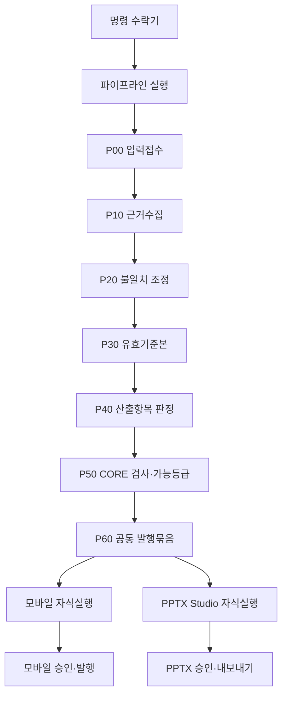

# 현행·목표 구조와 책임경계

## 1. 현행 확인결과

| 항목 | 현행 | 위험 |
|---|---|---|
| 비동기 생성 | `after()` 안에서 전체 생성, 최대 300초 | 실행중단·재배포·함수종료 시 재개점 부족 |
| 작업상태 | `processing/completed/failed` | 어느 단계가 실패했고 무엇을 재사용할지 알 수 없음 |
| 작업 ID | 건물 ID와 시각 문자열 | 요청중복·재시도·사용자 중복클릭 통제가 약함 |
| 생성단계 | writer 내부의 섹션 위상계획과 타이머 | 업무단계·산출물단계와 문안생성이 혼재 |
| 시간제한 | 90/105/120초 전역 타이머 | 선택면 생략은 가능하나 장기복구·외부 API 지연 분리가 어려움 |
| 저장 | `document_objects.body` 중심 | 스냅샷·판정·문안·사진·게이트가 한 덩어리 |
| 승인 | 문서상태를 `published/draft`로 갱신 | 기계검사·사람승인·배포사건 구분 부족 |
| 승인검사 | 빈 주장등록부 재생성 가능 | 생성 당시 차단·근거·불일치 재현 불가 |
| PPTX | 모바일 `body/sections` 재바인딩 | 모바일 문안이 사실정본처럼 작동 |
| PPTX 생성 | 공개 GET 요청 중 렌더·저장·응답 | 중복생성, 긴 응답, 승인 전 파일변경 위험 |
| 관측 | 섹션·공공API 지표 일부 존재 | 파이프라인 전체 계보와 단계 SLO 연결 부족 |

## 2. 목표 실행경계

## 3. 구성요소 책임

| 구성요소 | 한다 | 하지 않는다 |
|---|---|---|
| 명령 수락기 | 인증·권한·멱등키·요청스키마·실행생성 | 긴 생성작업 수행 |
| 조정기 | 단계 예약·의존성·재시도·취소·재개 | 도메인 사실판정 |
| 단계 실행자 | 한 단계의 순수한 업무계약 수행 | 상위 산출물 덮어쓰기 |
| 산출물 등록부 | 불변 본문·해시·스키마·상위참조 저장 | 최신본을 임의 추정 |
| 이벤트 보관함 | DB 변경과 사건발행 결박 | 사용자 문안 저장 |
| 근거 CORE | 원자료·자료출처·불일치·정정·매각범위 | 외부 문안 작성 |
| 판정 CORE | 계산·산출항목 사용허가·기계검사 | 사람승인 |
| 발행 CORE | 채널중립 내용·표·사진·주의·출처 묶음 | PPTX 좌표·모바일 CSS |
| 모바일 조립기 | 카드·표·사진·문안 구성 | 원시자료 재해석 |
| PPTX Studio | 페이지·문안·사진·레이아웃·렌더 | 새 재무계산·사실판정 |
| 승인서비스 | 대상해시와 승인범위의 사람 사건 저장 | 기계검사를 대신함 |
| 발행서비스 | 승인된 불변 버전 공개·철회 | 초안을 즉석 수정 |

## 4. 두 종류의 상태 머신

### 파이프라인 실행상태

`queued → running → succeeded | partially_succeeded | blocked | failed | cancelled | superseded`

이는 전체 진행을 보여주는 조회용 상태다. 직접 설정하지 않고 단계와 채널 결과에서 계산한다.

### 단계 실행상태

`queued → leased → running → succeeded`

실패갈래:

- `failed_retryable`: 일시 오류, 정책 범위 안에서 다시 시도
- `blocked_user`: 사용자 자료·선택 필요
- `blocked_policy`: 안전·발행규칙 차단
- `failed_fatal`: 스키마·불변조건·코드 오류
- `cancelled`: 사용자가 취소하거나 상위 실행이 폐기
- `superseded`: 더 새 입력버전으로 대체

## 5. 업무단계와 문안단계 분리

현행 `property_overview`, `location_analysis`, `income_analysis`는 독자가 보는 섹션 제작순서다. 목표 `P10~P60`은 자료와 의사결정의 생성순서다. 두 가지를 한 상태머신에 섞지 않는다.

- 업무단계는 사실·계산·허가를 만든다.
- 채널 조립단계는 허용된 내용을 독자 순서로 구성한다.
- PPTX Studio 페이지 순서가 바뀌어도 업무단계는 다시 실행하지 않는다.

## 6. 소유권 경계

| 자료 | 유일한 작성자 | 읽는 주체 |
|---|---|---|
| Observation | 근거수집 단계 | 조정·스냅샷·감사 |
| EffectiveSnapshot | 스냅샷 단계 | 판정·발행·채널 |
| ClaimEvaluationSet | 판정 단계 | 검사·발행·채널 |
| PublicationPackage | 발행 CORE | 모바일·PPTX |
| MobilePublicationVersion | 모바일 채널 | 승인·공개화면 |
| PptxStudioProjectVersion | PPTX Studio | 미리보기·승인·렌더 |
| ApprovalEvent | 승인서비스 | 발행·감사 |
| RenderedArtifact | 렌더러 | 파일검사·발행 |

한 구성요소가 다른 소유자의 본문을 갱신하지 않는다. 수정이 필요하면 새 명령과 새 버전을 만든다.

## 7. 호환경계

전환기간에는 다음만 허용한다.

- 구형 요청을 새 `CreatePipelineRun` 명령으로 변환
- 새 모바일 발행본을 구형 공개화면이 읽도록 `document_objects`에 투영
- 구형 PPTX 다운로드 요청을 이미 승인된 Studio 발행본으로 안내
- 아직 Studio가 적용되지 않은 거래건만 구형 렌더러 사용

다음은 금지한다.

- 새 CORE 필드를 `document_objects.body` 안에만 저장
- 구형 모바일 마크다운에서 새 `ClaimEvaluation` 생성
- 새 Studio 프로젝트가 원시 `enrichment`를 직접 읽음
- 구형 `ReleaseTier`를 신규 분석면 허용판정에 사용

