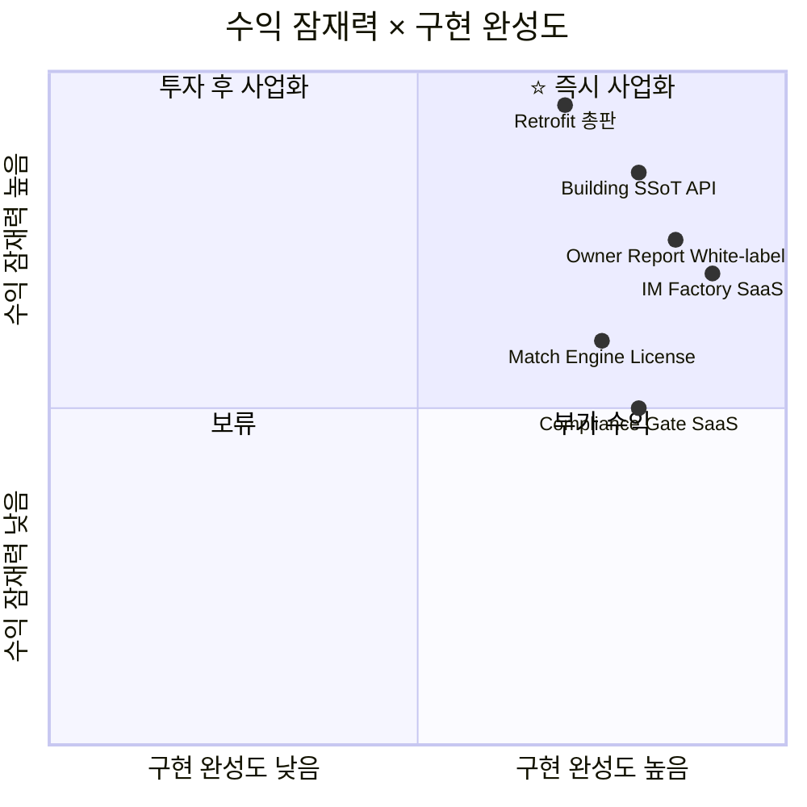

# Deal OS 사업 정체성 및 비즈니스 모델 포트폴리오

> **분석 근거:** 실제 구현 완료된 코드베이스 (cre-dealcard 25 API + cre-fullim 21 API + cre-aipage 16 API + IoT/Retrofit 확장)

---

## Part 1: 사업 정체성 — "우리는 무엇인가?"

### 1-A. 정체성 진단: 기술 스택이 말해주는 본질

구현된 코드를 기능 계층별로 분해하면, 이 시스템의 정체성이 드러납니다.

| 계층 | 구현된 핵심 모듈 | 본질 |
|------|----------------|------|
| **데이터 수집** | `deal-card/from-memo`, `buyer-intents/from-memo`, `iot/ingest` | 비정형 → 정형 변환 엔진 |
| **데이터 구조화** | `building_ssot_lite`, 18섹션 IM, `space_ssot` | 단일 진실 공급원(SSoT) 표준 |
| **지능 추론** | 3-Stage Matching, K-Means Clustering, Logistic Regression, 11개 AI Agent | 의사결정 자동화 |
| **품질 통제** | 8중 Gate, Disclosure Guard, Safe Language, FORBIDDEN_PHRASES | 규제·법률 방어벽 |
| **가치 전달** | Owner Report, Mobile IM, Leasing Page, Campaign Copy | 자동 마케팅 자산 생성 |
| **물리 연결** | IoT Ingest, Living Data, Retrofit CTA | 디지털↔물리 브릿지 |

> **결론:** 이 시스템은 "부동산 중개 소프트웨어"가 아닙니다.
> **"상업용 부동산의 비정형 지식을 구조화하고, AI로 의사결정을 자동화하며, 물리적 건물과 디지털 데이터를 연결하는 Cognitive Infrastructure(인지 인프라)"**입니다.

### 1-B. 최적 사업 정체성: 3가지 후보

| # | 정체성 | 한 줄 정의 | 비유 |
|---|--------|-----------|------|
| ❶ | **CRE Intelligence Platform** | 상업용 부동산 인지 플랫폼 | "상업용 부동산의 Bloomberg Terminal" |
| ❷ | **Building OS Provider** | 건물 운영체제 공급자 | "건물의 iOS를 만드는 회사" |
| ❸ | **PropTech Data Hub** | 부동산 데이터 허브 & API 관문 | "부동산의 Stripe (데이터 인프라)" |

#### ✅ 추천 정체성: **"Building Intelligence OS"**

세 가지를 결합한 복합 정체성입니다. 이유:
- ❶만 취하면 소프트웨어 구독 사업에 갇힘 (SaaS 천장)
- ❷만 취하면 하드웨어 종속 (삼성SDS形)
- ❸만 취하면 데이터 축적 전까지 수익 없음 (닭이 먼저냐 달걀이 먼저냐)

**"Building Intelligence OS"는 소프트웨어(무료 배포) → 하드웨어(캐시카우) → 데이터(독점 해자)로 순차 확장하는 3단 로켓의 모든 단계를 포괄합니다.**

---

## Part 2: JS부동산중개에 필요한 솔루션 (고객 관점)

JS부동산중개는 **300명의 꼬마빌딩 중개인을 보유한 법인**입니다. 이 법인의 페인포인트와 해당 솔루션을 매핑합니다.

### 2-A. 솔루션 패키지 구성

```
┌─────────────────────────────────────────────────────────┐
│            JS부동산중개 전용 "Deal OS Suite"              │
│                                                         │
│  ┌──────────────┐ ┌──────────────┐ ┌──────────────────┐ │
│  │  DealCard    │ │  Full IM     │ │  Space AiPage    │ │
│  │  ─────────── │ │  ──────────  │ │  ──────────────  │ │
│  │  메모→SSoT   │→│  18섹션 IM   │→│  공실 마케팅     │ │
│  │  AI 매칭     │ │  8중 Gate    │ │  건물주 리포트   │ │
│  │  전환율 예측  │ │  전문가 패치  │ │  임차인 분석    │ │
│  │  파이프라인   │ │  Mobile IM   │ │  Retrofit CTA   │ │
│  └──────────────┘ └──────────────┘ └──────────────────┘ │
│                                                         │
│  ┌──────────────────────────────────────────────────┐   │
│  │  대표 전용 대시보드 (Admin Analytics)              │   │
│  │  · 300명 파이프라인 실시간 현황                     │   │
│  │  · 딜 정체 경고 (Hold Warning 1~30일)              │   │
│  │  · 법적 리스크 0건 보증 (P0 Gate)                  │   │
│  │  · Cross-System Analytics (3개 시스템 통합 퍼널)   │   │
│  └──────────────────────────────────────────────────┘   │
└─────────────────────────────────────────────────────────┘
```

### 2-B. JS부동산중개 전용 솔루션 5종 (단독 사용)

| # | 솔루션명 | 해결하는 페인 | 구현 근거 (실제 코드) | 과금 모델 |
|---|---------|-------------|---------------------|----------|
| ① | **Deal SSoT Hub** | 이직 시 딜 데이터 증발 | `broker-deal-card.ts`, `buyer-intent.ts`, `building_ssot_lite` | 무료 (Lock-in 목적) |
| ② | **AI Match Engine** | 300명 간 크로스셀링 불가 | `matching-engine.ts` 3-Stage, `buyer-clustering.ts` K-Means | 무료 (SSoT 축적 목적) |
| ③ | **Compliance Shield** | 소속 중개인 법적 사고 리스크 | `gate-review-service.ts` 8중 Gate, `disclosure-guard-agent.ts` | 무료 (차별화 도구) |
| ④ | **IM Factory** | 문서 품질 편차 | `readiness-service.ts`, `section-planner.ts`, `mobile-im-writer.ts` | 무료 (고도화 유도) |
| ⑤ | **Owner Magnet** | 전속 매물 확보 실패 | `owner-report-agent.ts`, `tenant-fit-agent.ts`, `retrofit-roi-agent.ts` | 무료 (레트로핏 연결) |

> **전략:** JS부동산중개에는 **전체 무료 제공**합니다. 소프트웨어 자체가 아니라, 소프트웨어가 만들어내는 **건물주 접점과 데이터 독점**이 진짜 수익원입니다.

---

## Part 3: 자체 사업화 유망 솔루션 (수익 관점)

구현된 기능 중 **독립 상품으로 분리 판매할 수 있는 솔루션**을 식별합니다.

### 3-A. 수익 모델 포트폴리오 매트릭스



### 3-B. 7개 수익 라인 상세 분석

---

#### 수익 라인 ①: 스마트 레트로핏 총판 (캐시카우)

| 항목 | 내용 |
|------|------|
| **상품** | AI CCTV (월 15만), 스마트 공조 (월 20만) |
| **구현 근거** | `retrofit-roi-agent.ts`, `/api/retrofit/inquire`, `retrofit_products` 테이블 |
| **영업 채널** | Owner Report CTA 자동 삽입 (`computeRetrofitDiagnostic`) |
| **1차 TAM** | JS부동산 300명 × 평균 5 건물주 = 1,500 건물주 파이프라인 |
| **설치 전환율 5%** | 75건 × 설치비 평균 100만 = **7,500만원 (일시금)** |
| **월 구독** | 75건 × 평균 월 17.5만 = **월 1,312만원 (Recurring)** |
| **연 예상** | **약 2.3억원** |
| **해자** | 건물주 신뢰 관계 (Owner Report 3회 이상) 기반 — 콜드콜 대비 전환율 5배 이상 |

---

#### 수익 라인 ②: Building SSoT API Gateway (스케일업 핵심)

| 항목 | 내용 |
|------|------|
| **상품** | 구조화된 건물 데이터 API (정적 SSoT + Living Data) |
| **구현 근거** | `/api/v1/buildings/[id]/ssot/route.ts`, `api_clients`, `api_usage_events` 테이블 |
| **고객** | 조각투자사, AMC, 상권분석 기업, 보험사, AI 검색 엔진 |
| **과금** | 호출당 2,000~5,000원 (요금제별) |
| **SSoT 1,000건 기준** | 월 10만 쿼리 × 평균 3,000원 = **월 3억원** |
| **해자** | Living Data (IoT 실측) 결합은 하드웨어 설치 필요 → 복제 불가 |

---

#### 수익 라인 ③: IM Factory SaaS (B2B 구독)

| 항목 | 내용 |
|------|------|
| **상품** | 18섹션 투자설명서 자동 생성 + 8중 법적 Gate 검증 |
| **구현 근거** | `cre-fullim` 전체 (21개 API, 13개 도메인 서비스) |
| **타깃** | JS부동산 외 타 중개법인, 감정평가법인, AMC |
| **과금** | 법인당 월 50~100만원 구독 |
| **TAM** | 전국 상업용 부동산 법인 약 500개사 |
| **연 예상 (50개사)** | 50 × 월 75만 × 12 = **약 4.5억원** |
| **해자** | 8중 Gate + FORBIDDEN_PHRASES 등 한국 부동산 규제에 특화된 컴플라이언스 엔진은 글로벌 SaaS에 없음 |

---

#### 수익 라인 ④: Owner Report White-label (B2B2C)

| 항목 | 내용 |
|------|------|
| **상품** | 건물주 대상 자동 마케팅 리포트 (화이트 라벨) |
| **구현 근거** | `owner-report-agent.ts`, `tenant-fit-agent.ts`, `owner_report_history` |
| **타깃** | PM(프로퍼티 매니지먼트) 회사, 빌딩관리 법인 |
| **과금** | 건물당 월 3~5만원 |
| **가치** | PM사가 자사 브랜드로 건물주에게 AI 리포트 발송 → 관리 계약 리텐션 ↑ |
| **연 예상 (1,000건물)** | 1,000 × 월 4만 × 12 = **약 4.8억원** |

---

#### 수익 라인 ⑤: Match Engine License (기술 라이선스)

| 항목 | 내용 |
|------|------|
| **상품** | 3-Stage 매칭 엔진 + 매수자 클러스터링 기술 라이선스 |
| **구현 근거** | `matching-engine.ts`, `buyer-clustering.ts`, `deal-conversion-predictor.ts` |
| **타깃** | 토지 중개 플랫폼, 물류센터 중개, 호텔 M&A 자문사 |
| **과금** | 연간 라이선스 1,000~3,000만원 |
| **가치** | 목적별 가중치(사옥/투자/증여) 프레임워크를 수직별로 커스터마이징 |

---

#### 수익 라인 ⑥: Compliance Gate SaaS (규제 특화)

| 항목 | 내용 |
|------|------|
| **상품** | 부동산 문서 법적 검증 API (P0 공시, 금지 표현, 이해상충) |
| **구현 근거** | `gate-review-service.ts` 8개 Gate, `disclosure-guard-agent.ts`, `safe-language-agent.ts` |
| **타깃** | 금융감독원 규제 대응이 필요한 리츠(REITs), 증권사 부동산 부서 |
| **과금** | API 호출당 또는 문서당 과금 |
| **가치** | "AI가 만든 문서의 법적 안전성"에 대한 수요 급증 |

---

#### 수익 라인 ⑦: 공실 마케팅 자동화 (Freemium → Premium)

| 항목 | 내용 |
|------|------|
| **상품** | 사진 10장 → AI 분류 → 마케팅 페이지 → 문의 접수 → 리포트 (풀 파이프라인) |
| **구현 근거** | `cre-aipage` 전체 (16개 API, 11개 AI Agent) |
| **타깃** | 개인 중개사, 소규모 PM사 |
| **과금** | 무료 3건 / Premium 월 9,900원 (무제한) |
| **가치** | 네이버 부동산 광고 대체 — 자체 마케팅 채널 확보 |

---

## Part 4: 포트폴리오 통합 — 시간축 전개

### Phase 1: 고객 획득기 (0~6개월)

```
투입: ₩0 (JS부동산에 전체 무료 제공)
목적: SSoT 1,000건 축적 + 건물주 1,500명 접점 확보
수익: ₩0

핵심 KPI:
 · DealCard SSoT 등록 건수
 · Owner Report 발송 건수
 · 매칭 엔진 S등급 생성 건수
```

### Phase 2: 캐시카우 점화 (6~12개월)

```
투입: 레트로핏 하드웨어 파트너 계약
수익원: ① 레트로핏 총판 (연 2.3억)
       ② Owner Report White-label 시범 (연 1억)

핵심 KPI:
 · 레트로핏 CTA 클릭률
 · 설치 전환율
 · Living Data 수집 건물 수
```

### Phase 3: SaaS 확장 (12~24개월)

```
수익원: ③ IM Factory SaaS (연 4.5억)
       ④ Owner Report 확대 (연 4.8억)
       ⑤ Match Engine License (연 1억)
       ⑥ Compliance Gate (연 0.5억)

핵심 KPI:
 · 외부 법인 고객 수
 · MRR (Monthly Recurring Revenue)
```

### Phase 4: 데이터 독점 (24개월~)

```
수익원: ② Building SSoT API (연 36억 @1,000건)
       → SSoT 10,000건 시 연 360억 잠재

핵심 KPI:
 · SSoT 총 누적 건수
 · API 호출량
 · 외부 플랫폼 연동 수
```

---

## 최종 요약: 수익 포트폴리오 밸런스

| 시기 | 주 수익원 | 성격 | 연 매출 예상 |
|------|----------|------|------------|
| **0~6m** | 없음 (투자기) | — | ₩0 |
| **6~12m** | 레트로핏 총판 | **하드웨어 캐시카우** | 2~3억 |
| **12~24m** | IM Factory + Owner Report | **SaaS 반복 수익** | 10~15억 |
| **24m~** | Building SSoT API | **데이터 독점 플랫폼** | 30억~ |

> **사업 정체성 한 줄 요약:**
> *"소프트웨어를 무료로 뿌려 300명의 중개인을 IoT 영업사원으로 만들고, 하드웨어로 캐시플로를 확보하며, 축적된 Living Building SSoT로 프롭테크 생태계의 데이터 관문을 독점하는 3단 로켓 비즈니스."*
