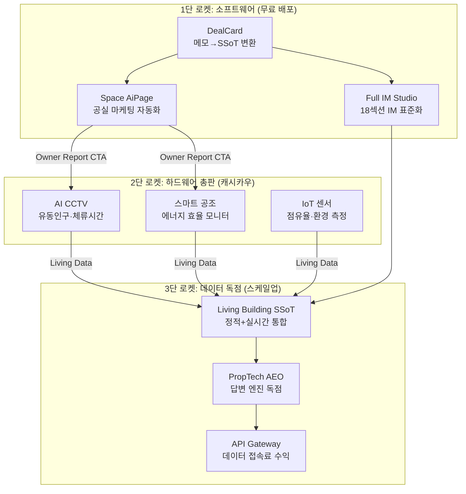

# 스마트 레트로핏 × Deal OS 통합 전략 보고서

## Part 0: 개요 — 소프트웨어에서 하드웨어 캐시카우로

---

### 수익 모델 스펙트럼: Deal OS 진화의 3단 로켓



### 통합 아키텍처: 기존 코드베이스 정합 지점

| 기존 시스템 | 변경 없이 활용 | 확장 필요 | 신규 모듈 |
|------------|-------------|----------|----------|
| **DealCard** | `building_ssot_lite` 스키마, `knowledge-graph.ts`, `vacancy-signal-enricher.ts` | `promotion-ranker.ts`에 IoT 피처 추가 | `retrofit-diagnostic.ts` |
| **Full IM** | `readiness-service.ts`의 18섹션 | — | 8번 섹션(건물상태)에 IoT 데이터 자동 주입 |
| **AiPage** | `owner-report-agent.ts`, `tenant-fit-agent.ts` | Owner Report에 레트로핏 CTA 섹션 추가 | `retrofit-roi-agent.ts` |

---

## Part 1: 중개인 플랫폼 = 하드웨어 "무료 영업망"

---

### 1-A. Owner Report에 레트로핏 CTA 자동 삽입

#### 현재 구현된 Owner Report 구조 (`owner-report-agent.ts`)

```typescript
// 현재 출력 스키마
interface OwnerReportOutput {
  hero_summary: string
  marketing_activity: { page_views, share_count, inquiry_count }
  tenant_interest_summary: string
  top_questions: string[]
  top_objections: string[]
  missing_actionable_data: string[]
  recommended_actions: string[]    // ← 여기에 레트로핏 CTA 삽입
}
```

#### 확장 설계: `retrofit_diagnostic` 섹션 추가

```typescript
// 확장된 출력 스키마
interface OwnerReportOutput {
  // ... 기존 필드 유지 ...
  
  retrofit_diagnostic?: {
    noi_improvement_estimate: string     // "AI CCTV 도입 시 NOI 약 8-12% 개선 여지"
    energy_saving_estimate: string       // "스마트 공조로 에너지 비용 15-20% 절감 추정"
    applicable_solutions: Array<{
      product: string                    // "AI CCTV 유동인구 분석"
      reason: string                     // "1층 공실의 임차인 유치에 실측 데이터 활용"
      estimated_monthly_cost: string     // "월 15만원"
      roi_payback_months: number         // 8
    }>
    boundary_note: string                // "실제 효과는 설치 환경에 따라 다릅니다"
    cta_url: string                      // 설치 문의 랜딩페이지
  }
}
```

#### 삽입 조건 로직 (코드 레벨)

```
조건 1: 공실이 1개 이상 존재 (vacancy_signal ≠ null)
조건 2: Owner Report 발송 3회 이상 (신뢰 관계 형성 후)
조건 3: 건물 준공 10년 이상 (레트로핏 수요 높음)
→ 3개 조건 모두 충족 시 retrofit_diagnostic 섹션 자동 생성
```

> **무기화 포인트:** 건물주가 이미 3주간 무료 Owner Report를 받으며 JS부동산을 신뢰하는 상태에서, 4주차에 "사장님 건물 NOI를 8% 올릴 수 있는 방법이 있습니다"라는 데이터 기반 제안이 들어옵니다. 콜드콜 대비 전환율이 압도적으로 높을 수밖에 없습니다.

---

### 1-B. 300인 중개인 인센티브 구조

#### 기존 시스템 활용 지점: `activity_events` 테이블

```
이벤트 추적 가능 항목 (이미 구현됨):
- owner_readiness_checked → 건물주 접점 발생
- owner_report_sent → 리포트 발송 기록
- 신규 이벤트: retrofit_inquiry_created → 레트로핏 문의 전환
- 신규 이벤트: retrofit_installed → 설치 완료
```

#### 인센티브 체계

| 단계 | 이벤트 | 중개인 인센티브 |
|------|--------|---------------|
| Lead 생성 | 건물주가 CTA 클릭 | 건당 5만원 |
| 설치 계약 | 레트로핏 설치 확정 | 설치비의 10% |
| 월간 구독 | IoT 월과금 유지 | 월과금의 5% (Recurring) |

> **구조적 이점:** 중개인은 이미 건물주와의 관계 유지를 위해 Owner Report를 보내고 있습니다. 레트로핏 영업은 추가 노력 없이 리포트 하단의 CTA 클릭 하나로 시작됩니다. 300명 × 관리 건물주 평균 5명 = **1,500명의 건물주 파이프라인**이 자동 가동됩니다.

---

## Part 2: Living Data = Building SSoT의 "실시간 심장박동"

---

### 2-A. IoT 데이터 → 기존 SSoT 스키마 확장

#### 현재 `building_ssot_lite` 스키마 (이미 구현)

```
id, area_signal, asset_type, price_band, size_signal,
vacancy_signal, fit_summary, caution_summary,
vacancy_inquiry_count, vacancy_avg_fit_score,
vacancy_demand_verified, promotion_score, ...
```

#### Living Data 확장 필드

```sql
ALTER TABLE building_ssot_lite ADD COLUMN
  -- AI CCTV Living Data
  iot_daily_footfall        INTEGER,        -- 일일 유동인구 실측
  iot_avg_dwell_minutes     NUMERIC(5,1),   -- 평균 체류시간
  iot_peak_hour             TEXT,           -- 피크 시간대 ("12:00-14:00")
  iot_footfall_trend        TEXT,           -- "increasing" | "stable" | "declining"
  
  -- 스마트 공조 Living Data
  iot_monthly_energy_kwh    NUMERIC(10,2),  -- 월간 에너지 사용량
  iot_energy_efficiency     NUMERIC(4,2),   -- 에너지 효율 등급 (0-1)
  iot_hvac_uptime_pct       NUMERIC(5,2),   -- 공조 가동률
  
  -- IoT 점유 센서
  iot_floor_occupancy       JSONB,          -- {"1F": 0.8, "2F": 0.3, "3F": 0.0}
  iot_last_synced_at        TIMESTAMPTZ;    -- 마지막 동기화 시각
```

### 2-B. Living Data가 기존 엔진을 강화하는 3가지 경로

#### 경로 ① → Vacancy Signal Enricher 강화

```
현재: vacancy_demand_verified = (inquiryCount >= 2 AND avgFitScore >= 65)
확장: vacancy_demand_verified = (
        inquiryCount >= 2 AND avgFitScore >= 65
     ) OR (
        iot_daily_footfall >= 200 AND iot_avg_dwell_minutes >= 5
     )
```

> 임차인 문의가 없어도, AI CCTV가 "이 위치에 하루 200명이 5분 이상 머문다"고 증명하면, 수요가 검증된 것으로 판정합니다. 매칭 엔진의 정확도가 비약적으로 향상됩니다.

#### 경로 ② → FullIM Readiness Score 자동 상승

```
현재 owner-readiness.ts:
  vacancyStatus: 10점 (수동 체크)

확장:
  vacancyStatus: iot_floor_occupancy가 존재하면 자동 true → +10점
  repairHistory: iot_hvac_uptime_pct + iot_energy_efficiency → 건물 상태 자동 추론 → +5점
```

> 건물주가 직접 공실 현황을 알려주지 않아도, IoT 센서가 "3층은 점유율 0%, 2층은 30%"라고 자동 보고합니다. Readiness Score가 수동 입력 없이 올라갑니다.

#### 경로 ③ → Promotion Ranker에 IoT 피처 추가

```typescript
// 현재 promotion-ranker.ts의 6개 팩터
const WEIGHTS = {
  curiosity: 0.25, demand: 0.20, inquiry: 0.15,
  recency: 0.10,   vacancy: 0.10, market: 0.20,
};

// 확장: IoT 데이터가 있는 매물은 promotion_score 자동 부스트
// market 팩터를 IoT 실측 데이터로 대체
const WEIGHTS_WITH_IOT = {
  curiosity: 0.20, demand: 0.15, inquiry: 0.10,
  recency: 0.05,   vacancy: 0.10, market: 0.10,
  iot_footfall: 0.15,   // 신규: 실측 유동인구
  iot_efficiency: 0.15, // 신규: 에너지 효율
};
```

> IoT가 설치된 건물은 Promotion Score가 자연스럽게 높아져, 매수자 매칭 시 상위에 노출됩니다. 건물주에게 "레트로핏 설치하면 매수자 노출도가 올라갑니다"라는 설득 로직이 완성됩니다.

---

### 2-C. 데이터 독점의 해자(Moat) 형성

```
정적 데이터 (누구나 수집 가능):
  건축물대장, 등기부등본, 호가, 공시지가 → 경쟁사도 보유

Living Data (오직 Deal OS만):
  실시간 유동인구, 체류시간, 에너지 효율, 층별 점유율
  → 하드웨어가 설치된 건물에서만 수집 가능
  → 경쟁사가 복제하려면 동일 건물에 하드웨어를 설치해야 함
  → 이미 JS부동산 전속 건물 → 진입 불가
```

---

## Part 3: Building SSoT 독점 = PropTech AEO 장악

---

### 3-A. Knowledge Graph의 AEO(Answer Engine Optimization) 진화

#### 현재 구현된 지식 그래프 (`knowledge-graph.ts`)

```
Edge Types (이미 구현):
  building ←matched_with→ buyer      (매칭 결과)
  building ←comparable_to→ building  (비교 매물)
  building ←handoff→ im_project     (IM 연결)
  building ←handoff→ space          (AiPage 연결)
```

#### AEO 확장: 생성형 AI가 질문할 때의 응답 구조

```
미래의 AI 질문: "성수동에서 카페 창업하기 좋은 50평대 1층 공간은?"

Knowledge Graph 응답:
  1. SSoT 정적 데이터: 면적 52평, 1층, 코너, 전면 8m
  2. Tenant Fit 분석: 카페 적합도 high_potential (83점)
  3. Living Data: 일 유동인구 423명, 피크 12-14시, 체류 8.2분
  4. Visual Album: 외관 사진 3장, 내부 사진 5장, 주변 상권 2장
  5. 비교 사례: 인근 유사 공간 3건의 임대 조건

→ 이 수준의 구조화된 응답을 제공할 수 있는 데이터 소스는
   전 세계에서 우리 Building SSoT뿐입니다.
```

### 3-B. API Gateway 수익 모델

#### 데이터 소비자별 과금 체계

| 소비자 | API 엔드포인트 | 과금 모델 | 월 예상 |
|--------|-------------|----------|--------|
| **조각투자 플랫폼** | `/api/v1/buildings/{id}/ssot` | 건당 5,000원 | 500만원 (1,000건) |
| **AMC/자산운용사** | `/api/v1/buildings/{id}/living-data` | 건당 10,000원 | 1,000만원 (1,000건) |
| **상권분석 기업** | `/api/v1/areas/{signal}/footfall-trends` | 월정액 300만원 | 300만원 |
| **AI 검색 엔진** | `/api/v1/search/structured-answer` | 쿼리당 100원 | 1,000만원 (10만 쿼리) |
| **보험사/금융기관** | `/api/v1/buildings/{id}/risk-profile` | 건당 20,000원 | 2,000만원 |

#### 누적 효과: SSoT 1,000 → 10,000개 규모별 수익 전망

| SSoT 수 | IoT 설치율 | Living Data 보유 | API 월 수익 | 하드웨어 월과금 |
|---------|-----------|----------------|-----------|--------------|
| 1,000 | 10% | 100건 | 500만원 | 1,500만원 |
| 5,000 | 15% | 750건 | 3,000만원 | 1.1억원 |
| 10,000 | 20% | 2,000건 | 1억원 | 3억원 |

---

### 3-C. 최종 플라이휠: 소프트웨어→하드웨어→데이터→독점

```
[무료 SW 배포] 300명 중개인이 건물주와 관계 형성
     ↓
[Owner Report] 매주 AI 분석 리포트로 신뢰 축적
     ↓
[레트로핏 CTA] "NOI 8% 개선 가능" → 하드웨어 설치 제안
     ↓
[하드웨어 수익] AI CCTV + 스마트 공조 설치비 + 월과금 (캐시카우)
     ↓
[Living Data] 실시간 물리적 데이터가 SSoT로 역류
     ↓
[SSoT 강화] 매칭 정확도↑, IM 품질↑, Promotion↑
     ↓
[데이터 독점] 경쟁사 복제 불가한 Living SSoT 10,000건 축적
     ↓
[API Gateway] 프롭테크 생태계 전체가 우리 데이터에 과금 (스케일업)
     ↓
[AEO 장악] 생성형 AI 시대의 "부동산 답변 엔진" 원본 데이터 독점
```

> **결론:** Deal OS는 단순한 중개 지원 소프트웨어가 아닙니다. 소프트웨어(무료)로 영업망을 구축하고, 하드웨어(유료)로 캐시카우를 만들며, 데이터(독점)로 프롭테크 생태계의 관문(Gateway)을 장악하는 **3단 로켓 비즈니스 모델**입니다.
