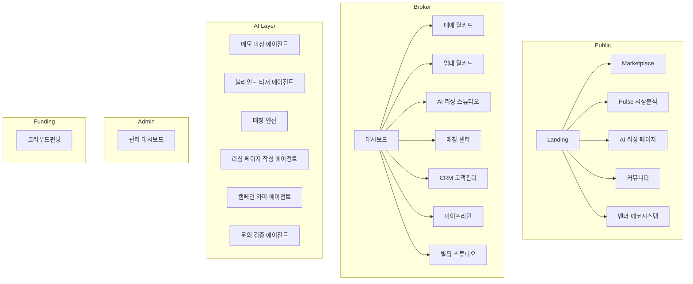

# CRE DealCard Hub — 기능명세서 (Feature Specification)

> **감사 기준일**: 2026-05-30  
> **소스 규모**: 406 파일 · 69 페이지 라우트 · 73 API 엔드포인트 · 15 AI 에이전트 · 32 DB 마이그레이션  
> **기술 스택**: Next.js 16 (App Router) · Supabase (PostgreSQL + RLS + Auth) · Zod v4 · Vercel Edge

---

## 목차

1. [시스템 아키텍처 개요](#1-시스템-아키텍처-개요)
2. [A. 브로커 플랫폼 (Broker)](#a-브로커-플랫폼)
3. [B. 공개 플랫폼 (Public)](#b-공개-플랫폼)
4. [C. AI 에이전트 파이프라인](#c-ai-에이전트-파이프라인)
5. [D. 관리자 (Admin)](#d-관리자)
6. [E. 크라우드펀딩 (Funding)](#e-크라우드펀딩)
7. [F. 인프라 & 미들웨어](#f-인프라--미들웨어)
8. [G. 데이터베이스 스키마](#g-데이터베이스-스키마)

---

## 1. 시스템 아키텍처 개요

---

## A. 브로커 플랫폼

### A1. 대시보드 (`/broker`)

| 항목 | 상세 |
|------|------|
| **라우트** | [page.tsx](file:///c:/Users/User/cre-dealcard/src/app/(broker)/broker/page.tsx) (487줄) |
| **KPI 카드** | 총 매물 수, 매칭 결과 수(등급별), 진행 딜 수, 관리 고객 수 |
| **시장 분석 위젯** | 실시간 권역 트렌드, 딜 체류일수, S등급 매칭 전환율 |
| **Quick Actions** | 매매 딜카드 생성, 임대 딜카드 생성, 매수 의향서, 임차 의향서, AI 리싱 스튜디오 |
| **최근 활동** | 최근 임대 딜카드, 최근 매매 딜카드, 매칭 결과 목록 |

### A2. 매매 딜카드 (`/broker/deal-card`)

| 기능 | 상세 |
|------|------|
| **신규 생성** | [new/page.tsx](file:///c:/Users/User/cre-dealcard/src/app/(broker)/broker/deal-card/new/page.tsx) — 카톡 메모 → AI 파싱 → `building_ssot_lite` + 블라인드 티저 |
| **API** | `POST /api/broker/deal-card/from-memo` → [broker-deal-card.ts](file:///c:/Users/User/cre-dealcard/src/ai/agents/broker-deal-card.ts) 에이전트 |
| **상세 보기** | [deal-card/[id]/page.tsx](file:///c:/Users/User/cre-dealcard/src/app/(broker)/broker/deal-card/%5Bid%5D/page.tsx) — SSoT 요약, 블라인드 티저, 매칭 목록 |
| **AI 파이프라인** | MemoParser → BuildingSSoTLite → BlindTeaser (3단계 체인) |
| **DB** | `building_ssot_lite`, `document_objects`, `match_results`, `ai_runs`, `activity_events` |

### A3. 임대 딜카드 (`/broker/lease-card`)

| 기능 | 상세 |
|------|------|
| **목록** | [page.tsx](file:///c:/Users/User/cre-dealcard/src/app/(broker)/broker/lease-card/page.tsx) — 전체 임대 카드 리스트 |
| **신규 생성** | [new/page.tsx](file:///c:/Users/User/cre-dealcard/src/app/(broker)/broker/lease-card/new/page.tsx) — 카톡 메모 → 임대 SSoT + 블라인드 티저 |
| **API** | `POST /api/broker/lease-card/from-memo` → [lease-deal-card.ts](file:///c:/Users/User/cre-dealcard/src/ai/agents/lease-deal-card.ts) |
| **상세** | [lease-card/[id]/page.tsx](file:///c:/Users/User/cre-dealcard/src/app/(broker)/broker/lease-card/%5Bid%5D/page.tsx) — 마켓플레이스 공개 토글, 카톡 문구 복사, 자동 매칭, **AI 리싱 부스트** 버튼 |
| **AI 리싱 부스트** | `POST /api/broker/lease-card/[id]/boost` → `lease_spaces` → `spaces` 변환 + 양방향 FK |
| **DB** | `lease_spaces`, `document_objects`, `lease_match_results` |

### A4. AI 리싱 스튜디오 (`/broker/leasing`)

| 기능 | 상세 |
|------|------|
| **공간 목록** | [page.tsx](file:///c:/Users/User/cre-dealcard/src/app/(broker)/broker/leasing/page.tsx) — `spaces` 목록 + 위저드 진입 |
| **Space Wizard** | [SpaceWizard.tsx](file:///c:/Users/User/cre-dealcard/src/app/(broker)/broker/leasing/%5BspaceId%5D/SpaceWizard.tsx) — 5단계 위저드 |
| **Step 1** | 📷 사진 분류 → `POST /api/spaces/[id]/classify-photos` |
| **Step 2** | 🎯 적합성 분석 → `POST /api/spaces/[id]/evaluate-fit` → `tenant_fit_results` + `vibe_fit_results` DB 저장 |
| **Step 3** | 📄 리싱 페이지 생성 → `POST /api/spaces/[id]/generate-leasing-page` → `leasing_pages` + `leasing_page_sections` |
| **Step 4** | 📢 캠페인 카피 → `POST /api/spaces/[id]/generate-campaign-copy` → `campaign_copies` |
| **Step 5** | 🌐 공개 완료 → `/leasing/[slug]` URL 복사 |
| **상세 페이지** | [leasing/[spaceId]/page.tsx](file:///c:/Users/User/cre-dealcard/src/app/(broker)/broker/leasing/%5BspaceId%5D/page.tsx) — TenantFit + VibeFit 결과, 문의, 카피 표시 |

### A5. 매칭 센터 (`/broker/matching`)

| 기능 | 상세 |
|------|------|
| **매칭 보드** | [page.tsx](file:///c:/Users/User/cre-dealcard/src/app/(broker)/broker/matching/page.tsx) — S/A/B/C 등급 필터, 3단계 매칭 정밀 보고서 |
| **매칭 로직** | [MatchStageBreakdown](file:///c:/Users/User/cre-dealcard/src/components/matching/MatchStageBreakdown.tsx) — Stage1(하드필터) → Stage2(유사도) → Stage3(가중치) |
| **API** | `GET /api/broker/match` (매매), `GET /api/broker/lease-match` (임대) |
| **DB** | `match_results` (매매), `lease_match_results` (임대) |

### A6. CRM 고객관리 (`/broker/clients`)

| 기능 | 상세 |
|------|------|
| **목록** | [page.tsx](file:///c:/Users/User/cre-dealcard/src/app/(broker)/broker/clients/page.tsx) — 전체 고객 리스트, 티어별 분류 |
| **신규 등록** | [new/page.tsx](file:///c:/Users/User/cre-dealcard/src/app/(broker)/broker/clients/new/page.tsx) |
| **상세** | [clients/[id]/page.tsx](file:///c:/Users/User/cre-dealcard/src/app/(broker)/broker/clients/%5Bid%5D/page.tsx) — 고객 정보, 연락 이력, 연결된 의향서 |
| **API** | `GET/POST /api/broker/clients`, `GET/PUT/DELETE /api/broker/clients/[id]`, `POST /api/broker/clients/[id]/contacts` |
| **DB** | `broker_clients`, `client_contacts` |

### A7. 빌딩 스튜디오 (`/broker/buildings`)

| 기능 | 상세 |
|------|------|
| **목록** | [page.tsx](file:///c:/Users/User/cre-dealcard/src/app/(broker)/broker/buildings/page.tsx) |
| **스튜디오** | [studio/page.tsx](file:///c:/Users/User/cre-dealcard/src/app/(broker)/broker/buildings/%5Bid%5D/studio/page.tsx) — 종합 관리 |
| **브리핑** | `studio/briefing/page.tsx` — AI 브리핑 생성 |
| **공시** | `studio/disclosure/page.tsx` — 중개대상물 공시 |
| **파일** | `studio/files/page.tsx` — 증빙 파일 관리 |
| **임대** | `studio/lease/page.tsx` — 빌딩 내 임대 공간 |
| **스냅샷** | [snapshot/page.tsx](file:///c:/Users/User/cre-dealcard/src/app/(broker)/broker/buildings/%5Bid%5D/snapshot/page.tsx) — AI 빌딩 스냅샷 |
| **오너 리포트** | `owner-report/page.tsx` — 건물주 보고서 |
| **IM Lite** | `im-lite/page.tsx` — 투자설명서 라이트 |
| **API** | 11개 API 엔드포인트 (briefing, disclosure, evidence, lease, pipeline, snapshot, conversion, enrich 등) |

### A8. 매수 의향서 (`/broker/buyer-intents`)

| 기능 | 상세 |
|------|------|
| **목록/신규/상세** | CRUD 완비 (list, new, [id] detail) |
| **AI 파싱** | `POST /api/broker/buyer-intents/from-memo` → [buyer-intent-normalizer.ts](file:///c:/Users/User/cre-dealcard/src/ai/agents/buyer-intent-normalizer.ts) |
| **DB** | `buyer_intent_lite` |

### A9. 임차 의향서 (`/broker/tenant-intents`)

| 기능 | 상세 |
|------|------|
| **목록/신규/상세** | CRUD 완비 |
| **AI 파싱** | `POST /api/broker/tenant-intents/from-memo` → [tenant-intent-normalizer.ts](file:///c:/Users/User/cre-dealcard/src/ai/agents/tenant-intent-normalizer.ts) |
| **DB** | `tenant_intent` |

### A10. 파이프라인 분석 (`/broker/pipeline`)

| 기능 | 상세 |
|------|------|
| **페이지** | [page.tsx](file:///c:/Users/User/cre-dealcard/src/app/(broker)/broker/pipeline/page.tsx) — 딜 파이프라인 시각화 |
| **API** | `GET /api/broker/buildings/[id]/pipeline` |
| **DB** | `pipeline_stages`, `pipeline_transitions` |

### A11. 브로커 프로필 & 카드

| 기능 | 상세 |
|------|------|
| **프로필** | [profile/page.tsx](file:///c:/Users/User/cre-dealcard/src/app/(broker)/broker/profile/page.tsx) — 설정 |
| **마이 카드** | [my-card/new/page.tsx](file:///c:/Users/User/cre-dealcard/src/app/(broker)/broker/my-card/new/page.tsx) — AI 생성 브로커 명함 |
| **API** | `POST /api/broker/my-card/generate`, `GET/PUT /api/broker/profile`, `GET /api/broker/profile/stats` |

### A12. 예측 분석

| 기능 | 상세 |
|------|------|
| **가격 예측** | `POST /api/broker/prediction/price` |
| **매수자 클러스터링** | `POST /api/broker/prediction/cluster-buyers` |
| **DB** | `prediction_nodes`, `prediction_edges` |

---

## B. 공개 플랫폼

### B1. 랜딩 & 네비게이션

| 기능 | 라우트 |
|------|--------|
| 메인 랜딩 | [page.tsx](file:///c:/Users/User/cre-dealcard/src/app/page.tsx) |
| 공개 레이아웃 | [(public)/layout.tsx](file:///c:/Users/User/cre-dealcard/src/app/(public)/layout.tsx) |

### B2. 마켓플레이스 (`/marketplace`)

| 기능 | 상세 |
|------|------|
| **검색·필터** | [page.tsx](file:///c:/Users/User/cre-dealcard/src/app/(public)/marketplace/page.tsx) — 블라인드 매물 탐색 |
| **API** | `GET /api/marketplace/search` — 권역, 면적, 가격대 필터 |
| **게이트 시스템** | G1(열람) → G2(상세 요청) → G3(중개인 연결) |

### B3. AI 리싱 랜딩 페이지 (`/leasing/[slug]`)

| 기능 | 상세 |
|------|------|
| **공개 페이지** | [page.tsx](file:///c:/Users/User/cre-dealcard/src/app/(public)/leasing/%5Bslug%5D/page.tsx) — AI 생성 리싱 페이지 렌더링 |
| **문의 폼** | [InquiryForm.tsx](file:///c:/Users/User/cre-dealcard/src/app/(public)/leasing/%5Bslug%5D/InquiryForm.tsx) — 인라인 문의 |
| **자동 파이프라인** | 문의 접수 → AI 검증 → broker_clients 자동 등록 → tenant_intent 생성 → lease_auto_matcher 트리거 |

### B4. Pulse 시장 분석 (`/pulse`)

| 기능 | 상세 |
|------|------|
| **대시보드** | [page.tsx](file:///c:/Users/User/cre-dealcard/src/app/(public)/pulse/page.tsx) — 전체 시장 개요 |
| **권역별 상세** | [pulse/[region]/[period]/page.tsx](file:///c:/Users/User/cre-dealcard/src/app/(public)/pulse/%5Bregion%5D/%5Bperiod%5D/page.tsx) |
| **API** | `POST /api/pulse/generate` — AI 시장 분석 리포트 생성 |

### B5. Market 권역 분석 (`/market/[region]`)

| 기능 | 상세 |
|------|------|
| **권역 리포트** | [page.tsx](file:///c:/Users/User/cre-dealcard/src/app/(public)/market/%5Bregion%5D/page.tsx) |
| **API** | `GET /api/public/market-report/[region]` |

### B6. 커뮤니티 아고라 (`/agora`)

| 기능 | 상세 |
|------|------|
| **카테고리 목록** | [page.tsx](file:///c:/Users/User/cre-dealcard/src/app/(public)/agora/page.tsx) |
| **카테고리별 스레드** | [agora/[category]/page.tsx](file:///c:/Users/User/cre-dealcard/src/app/(public)/agora/%5Bcategory%5D/page.tsx) |
| **스레드 상세** | [agora/[category]/[threadId]/page.tsx](file:///c:/Users/User/cre-dealcard/src/app/(public)/agora/%5Bcategory%5D/%5BthreadId%5D/page.tsx) |
| **API** | `GET/POST /api/agora/threads`, `POST /api/agora/seed` |
| **DB** | `agora_threads`, `agora_replies` |

### B7. 벤더 에코시스템 (`/services`)

| 기능 | 상세 |
|------|------|
| **서비스 목록** | [page.tsx](file:///c:/Users/User/cre-dealcard/src/app/(public)/services/page.tsx) — 인테리어, 법률, 세무 등 |
| **카테고리별** | [services/[category]/page.tsx](file:///c:/Users/User/cre-dealcard/src/app/(public)/services/%5Bcategory%5D/page.tsx) |
| **상세** | [services/[category]/[id]/page.tsx](file:///c:/Users/User/cre-dealcard/src/app/(public)/services/%5Bcategory%5D/%5Bid%5D/page.tsx) |
| **API** | `POST /api/vendor/profile`, `POST /api/vendor/service-cards` |
| **DB** | `vendors`, `vendor_service_cards`, `vendor_portfolio_items` |

### B8. 추가 공개 기능

| 기능 | 라우트 | 설명 |
|------|--------|------|
| **딜 탐색** | `/deal/[region]`, `/deal/[region]/[id]` | 권역별 매물 상세 |
| **Space 탐색** | `/space/[region]` | 권역별 공간 브라우징 |
| **빌딩 레이더** | `/building-radar` | AI 빌딩 분석 도구 |
| **브로커 프로필** | `/broker-profile/[slug]` | 브로커 공개 프로필 |
| **오너 레디니스** | `/owner-readiness` | 건물주 매각 준비도 진단 |
| **인사이트** | `/insight`, `/insight/[slug]` | 시장 인사이트 콘텐츠 |
| **탐색** | `/explore` | 전체 탐색 |
| **가이드** | `/guide` | 이용 가이드 |
| **허브** | `/hub` | 정보 허브 |
| **전문가 노트** | `/expert-note/request` | 전문가 의견 요청 |

---

## C. AI 에이전트 파이프라인

### 15개 AI 에이전트

| # | 에이전트 | 파일 | 입력 | 출력 |
|---|---------|------|------|------|
| 1 | **매매 딜카드 체인** | [broker-deal-card.ts](file:///c:/Users/User/cre-dealcard/src/ai/agents/broker-deal-card.ts) | 카톡 메모 | BuildingSSoTLite + BlindTeaser |
| 2 | **임대 딜카드 체인** | [lease-deal-card.ts](file:///c:/Users/User/cre-dealcard/src/ai/agents/lease-deal-card.ts) | 카톡 메모 | LeaseMiniTruth + BlindTeaser |
| 3 | **빌딩 스냅샷** | [BuildingSnapshotAgent.ts](file:///c:/Users/User/cre-dealcard/src/ai/agents/BuildingSnapshotAgent.ts) | SSoT 데이터 | 빌딩 스냅샷 |
| 4 | **매수자 의향 파싱** | [buyer-intent-normalizer.ts](file:///c:/Users/User/cre-dealcard/src/ai/agents/buyer-intent-normalizer.ts) | 비정형 메모 | 구조화 의향서 |
| 5 | **매수자 메모 작성** | [buyer-memo-writer.ts](file:///c:/Users/User/cre-dealcard/src/ai/agents/buyer-memo-writer.ts) | 의향서 | 마케팅 메모 |
| 6 | **임차자 의향 파싱** | [tenant-intent-normalizer.ts](file:///c:/Users/User/cre-dealcard/src/ai/agents/tenant-intent-normalizer.ts) | 비정형 메모 | 구조화 임차 의향 |
| 7 | **투자자 프로필** | [investor-profile-normalizer.ts](file:///c:/Users/User/cre-dealcard/src/ai/agents/investor-profile-normalizer.ts) | 프로필 데이터 | 정규화 프로필 |
| 8 | **딜 큐리오시티** | [deal-curiosity-writer.ts](file:///c:/Users/User/cre-dealcard/src/ai/agents/deal-curiosity-writer.ts) | 딜 데이터 | 흥미 유발 카피 |
| 9 | **펀딩 프로젝트 카드** | [funding-project-card.ts](file:///c:/Users/User/cre-dealcard/src/ai/agents/funding-project-card.ts) | 프로젝트 메모 | 투자 카드 |
| 10 | **Visual 분류** | [visual-classification-agent.ts](file:///c:/Users/User/cre-dealcard/src/ai/agents/visual-classification-agent.ts) | 사진 | 공간 분류 태그 |
| 11 | **TenantFit 분석** | [tenant-fit-agent.ts](file:///c:/Users/User/cre-dealcard/src/ai/agents/tenant-fit-agent.ts) | SSoT + 업종 | 적합성 점수·근거 |
| 12 | **VibeFit 분석** | [vibe-fit-agent.ts](file:///c:/Users/User/cre-dealcard/src/ai/agents/vibe-fit-agent.ts) | SSoT + 사진 태그 | 분위기 적합성 |
| 13 | **리싱 페이지 작성** | [leasing-page-writer-agent.ts](file:///c:/Users/User/cre-dealcard/src/ai/agents/leasing-page-writer-agent.ts) | SSoT + FitResults | 랜딩 페이지 섹션 |
| 14 | **캠페인 카피** | [campaign-copy-agent.ts](file:///c:/Users/User/cre-dealcard/src/ai/agents/campaign-copy-agent.ts) | SSoT + 채널 | 카카오/네이버/SMS/인스타 카피 |
| 15 | **문의 검증** | [inquiry-qualifier-agent.ts](file:///c:/Users/User/cre-dealcard/src/ai/agents/inquiry-qualifier-agent.ts) | 문의 + SSoT | 적합성 판정 + 카톡 답변 초안 |

### 가드레일 시스템

| 모듈 | 파일 | 역할 |
|------|------|------|
| **안전 언어 필터** | [safe-language.ts](file:///c:/Users/User/cre-dealcard/src/domain/guardrails/safe-language.ts) | 민감 표현 재작성 (`rewriteUnsafeText()`) |
| **공시 가드** | [disclosure-guard.ts](file:///c:/Users/User/cre-dealcard/src/domain/guardrails/disclosure-guard.ts) | 미공시 정보 차단 |
| **AgentOutputEnvelope** | [envelope.ts](file:///c:/Users/User/cre-dealcard/src/ai/envelope.ts) | 모든 LLM 출력 래핑 + boundary_note |

### Zod 계약 (Contracts)

| 파일 | 스키마 |
|------|--------|
| [enums.ts](file:///c:/Users/User/cre-dealcard/src/contracts/enums.ts) | SpaceType, TenantType, CopyType, FitLevel 등 |
| [space.ts](file:///c:/Users/User/cre-dealcard/src/contracts/space.ts) | SpaceSSOT 입출력 |
| [visual.ts](file:///c:/Users/User/cre-dealcard/src/contracts/visual.ts) | 비주얼 분류 결과 |
| [tenant-fit.ts](file:///c:/Users/User/cre-dealcard/src/contracts/tenant-fit.ts) | TenantFit + VibeFit 결과 |
| [leasing-page.ts](file:///c:/Users/User/cre-dealcard/src/contracts/leasing-page.ts) | 리싱 페이지 섹션 |
| [inquiry.ts](file:///c:/Users/User/cre-dealcard/src/contracts/inquiry.ts) | 문의 입력 + 검증 결과 |
| [handoff.ts](file:///c:/Users/User/cre-dealcard/src/contracts/handoff.ts) | 시스템 간 핸드오프 |
| [events.ts](file:///c:/Users/User/cre-dealcard/src/contracts/events.ts) | 활동 이벤트 |

---

## D. 관리자

| 기능 | 라우트 | API |
|------|--------|-----|
| **관리 대시보드** | `/admin` | — |
| **분석** | `/admin/analytics` | `GET /api/admin/cross-system-analytics` |
| **파이프라인** | `/admin/pipeline` | `GET /api/admin/pipeline-analytics` |
| **시장 지표** | `/admin/market` | `GET /api/admin/market-indicators` |
| **게이트 요청** | `/admin/gate-requests` | `GET/POST /api/gate-requests` |
| **전문가 노트** | `/admin/expert-notes` | — |
| **매칭 실패** | — | `GET /api/admin/match-failures` |
| **MOLIT ETL** | — | `POST /api/admin/etl/molit` |
| **Cross-System** | `/admin/cross-system` | `GET /api/admin/cross-system-analytics` |

---

## E. 크라우드펀딩

| 기능 | 라우트 | API |
|------|--------|-----|
| **투자 마켓플레이스** | `/funding/marketplace` | `GET /api/funding/project/list-fallback` |
| **프로젝트 생성** | `/funding/projects/new` | `POST /api/funding/project/from-memo` |
| **프로젝트 상세** | `/funding/projects/[id]` | `GET /api/funding/project/[id]` |
| **투자자 대시보드** | `/funding/investor` | `GET/PUT /api/funding/investor/profile` |
| **투자자 매칭** | — | `POST /api/funding/match` |
| **게이트 검증** | — | `POST /api/funding/gate/verify` |
| **분석** | — | `GET /api/funding/analytics` |
| **DB** | `crowdfunding_projects`, `crowdfunding_investments`, `investor_profiles` |

---

## F. 인프라 & 미들웨어

| 모듈 | 파일 | 역할 |
|------|------|------|
| **미들웨어** | `src/middleware.ts` | 라우트 보호, 인증 리다이렉트 |
| **Auth Guard** | `src/lib/auth-guard.ts` | `requireBroker()`, `requireAdmin()` |
| **Supabase Client** | `src/lib/supabase/` | service client, browser client |
| **API Error** | `src/lib/api-error.ts` | 표준 에러 응답 |
| **SEO** | [sitemap.ts](file:///c:/Users/User/cre-dealcard/src/app/sitemap.ts), [robots.ts](file:///c:/Users/User/cre-dealcard/src/app/robots.ts) | 동적 사이트맵 + robots.txt |
| **OG 이미지** | `/api/og` | 동적 Open Graph 이미지 |
| **IoT** | `/api/iot/ingest` | 빌딩 센서 데이터 수집 |

---

## G. 데이터베이스 스키마 (32 마이그레이션)

### 핵심 테이블 그룹

| 그룹 | 테이블 | 마이그레이션 |
|------|--------|-------------|
| **빌딩** | `building_ssot_lite`, `buildings`, `building_snapshots` | 00001, 00007 |
| **매매** | `buyer_intent_lite`, `match_results` | 00001, 00008 |
| **임대** | `lease_spaces`, `tenant_intent`, `lease_match_results` | 00021 |
| **AI Leasing** | `spaces`, `leasing_pages`, `leasing_page_sections`, `tenant_fit_results`, `vibe_fit_results`, `campaign_copies`, `leasing_inquiries`, `inquiry_qualifications` | 00007, 00032 |
| **CRM** | `broker_clients`, `client_contacts` | 00020 |
| **문서** | `document_objects` | 00001 |
| **프로필** | `profiles`, `broker_cards` | 00001, 00014 |
| **활동** | `activity_events`, `ai_runs` | 00001 |
| **파이프라인** | `pipeline_stages`, `pipeline_transitions` | 00022 |
| **펀딩** | `crowdfunding_projects`, `crowdfunding_investments`, `investor_profiles` | 00023 |
| **게이트** | `gate_requests`, `gate_audit_logs` | 00001, 00024 |
| **예측** | `prediction_nodes`, `prediction_edges` | 00009 |
| **IoT** | `iot_sensor_readings`, `iot_devices` | 00011 |
| **커뮤니티** | `agora_threads`, `agora_replies` | 00029 |
| **벤더** | `vendors`, `vendor_service_cards`, `vendor_portfolio_items` | 00030 |
| **구독** | `subscriptions` | 00028 |
| **핸드오프** | `handoffs` | 00003, 00004 |
| **Pulse** | `pulse_reports`, `oiticles` | 00031 |

### Bridge

| 연결 | 컬럼 | 마이그레이션 |
|------|------|-------------|
| `lease_spaces` ↔ `spaces` | `lease_spaces.aipage_space_id` → `spaces.id` | 00032 |
| `spaces` ↔ `building_ssot_lite` | `spaces.building_ssot_lite_id` → `building_ssot_lite.id` | 00007 |
| `lease_spaces` ↔ `building_ssot_lite` | `lease_spaces.building_id` → `building_ssot_lite.id` | 00021 |
| `leasing_inquiries` ↔ CRM | `broker_client_id`, `tenant_intent_id` | 00032 |
