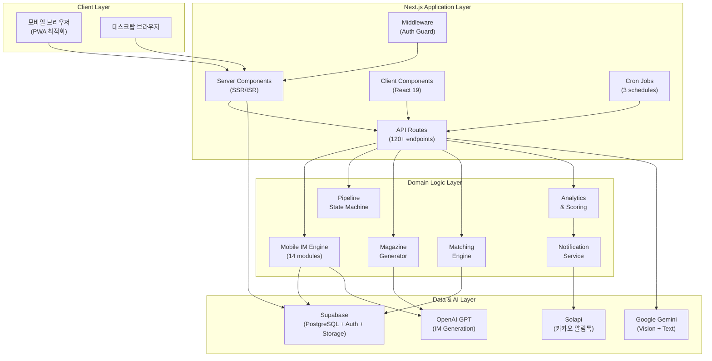
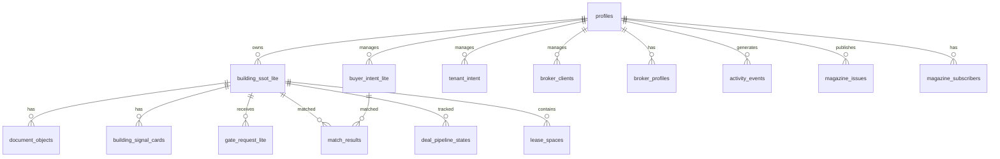
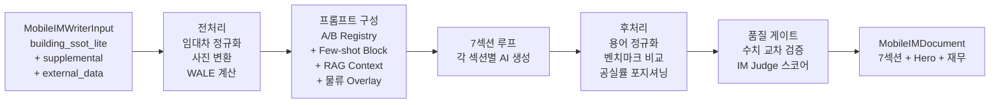
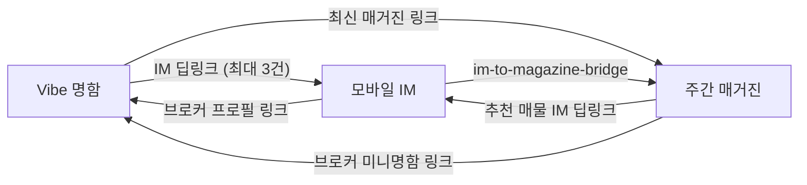
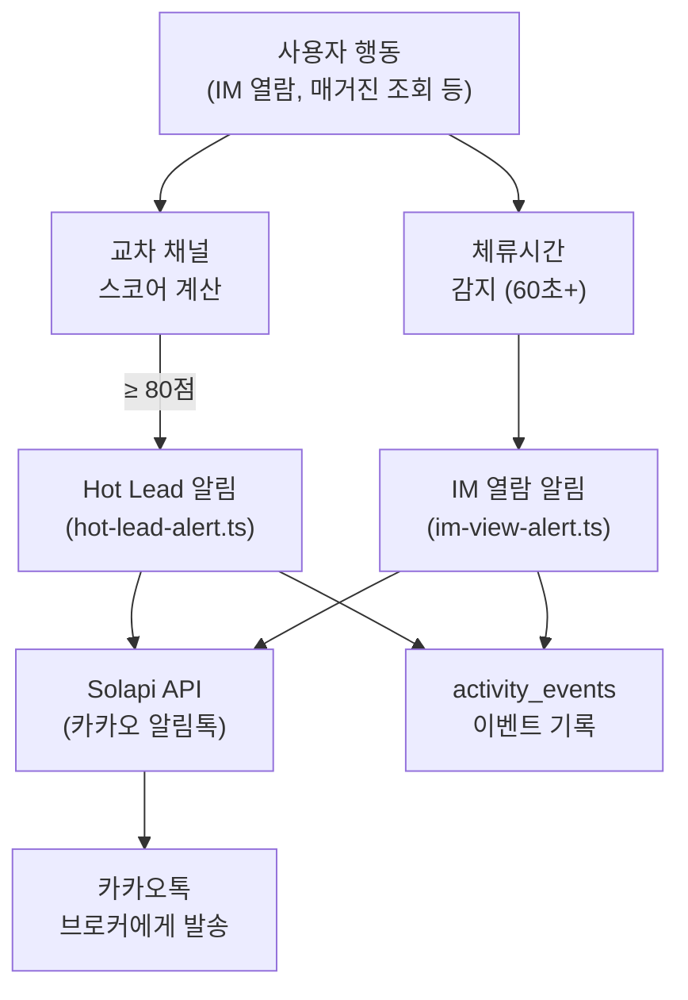

# CRE DealCard — 시스템 아키텍처 및 기능 명세서

> **버전**: 2026.07.11 | **프로젝트**: JS 1분 딜카드 (credeal.net)
> **기술 스택**: Next.js 15 + React 19 + TypeScript 5 + Supabase + Vercel
> **목적**: 상업용 부동산(CRE) 중개사를 위한 올인원 영업 플랫폼

---

## 목차

1. [시스템 개요](#1-시스템-개요)
2. [기술 스택 및 인프라](#2-기술-스택-및-인프라)
3. [데이터베이스 아키텍처](#3-데이터베이스-아키텍처)
4. [전체 페이지 인벤토리 (88+ 페이지)](#4-전체-페이지-인벤토리)
5. [API 라우트 명세 (120+ 엔드포인트)](#5-api-라우트-명세)
6. [도메인 로직 아키텍처](#6-도메인-로직-아키텍처)
7. [AI/ML 파이프라인](#7-aiml-파이프라인)
8. [교차 채널 분석 & 알림 시스템](#8-교차-채널-분석--알림-시스템)
9. [컴포넌트 라이브러리](#9-컴포넌트-라이브러리)
10. [인증 및 권한 체계](#10-인증-및-권한-체계)
11. [외부 연동 서비스](#11-외부-연동-서비스)
12. [배포 및 운영](#12-배포-및-운영)

---

## 1. 시스템 개요

### 1.1 아키텍처 다이어그램



### 1.2 규모 요약

| 항목 | 수량 |
|------|------|
| 전체 페이지 | 88+ |
| API 엔드포인트 | 120+ |
| DB 마이그레이션 | 67개 |
| 핵심 테이블 | 30+ |
| 컴포넌트 파일 | 120+ |
| 도메인 모듈 | 6개 (31파일) |
| 이벤트 타입 | 46종 |
| Cron 스케줄 | 3개 |

---

## 2. 기술 스택 및 인프라

### 2.1 Core Framework

| 기술 | 버전 | 용도 |
|------|------|------|
| Next.js | 15.1.0-canary.7 | 풀스택 프레임워크 (App Router) |
| React | 19.0.0 | UI 라이브러리 (Server Components) |
| TypeScript | 5.x | 타입 안전성 |

### 2.2 Backend & Data

| 기술 | 용도 |
|------|------|
| Supabase (PostgreSQL) | 데이터베이스 + 인증 + 파일 스토리지 + RLS |
| Supabase SSR | 서버/클라이언트 Supabase 클라이언트 |
| Zod | API 입력 유효성 검증 |

### 2.3 AI/ML

| 기술 | 용도 |
|------|------|
| Google Gemini (2.5 Flash) | 비전 분석 (사진→Vibe 성격 분석), 텍스트 생성 |
| OpenAI GPT | IM 7섹션 생성, 매거진 AI 브리핑, 캠페인 카피 |

### 2.4 UI/UX

| 기술 | 용도 |
|------|------|
| Tailwind CSS | 유틸리티 기반 스타일링 |
| Radix UI | 접근성 보장 UI 프리미티브 (Dialog, Sheet, Tabs 등) |
| Lucide React | 아이콘 시스템 |
| Motion (Framer Motion) | 애니메이션 & 트랜지션 |
| Recharts | 차트 & 데이터 시각화 |

### 2.5 외부 서비스

| 서비스 | 용도 |
|--------|------|
| Solapi | 카카오 알림톡 + SMS 발송 |
| Vercel | 호스팅 + CI/CD + Cron |
| Kakao SDK | 소셜 공유 + 지도 |

### 2.6 Supabase 클라이언트 3중 구조

| 클라이언트 | 파일 | 용도 | 권한 |
|-----------|------|------|------|
| Server SSR | `lib/supabase/server.ts` | SSR 페이지 (쿠키 인증) | 사용자 수준 (RLS 적용) |
| Service Role | `lib/supabase/service.ts` | API 라우트 (관리자) | 관리자 수준 (RLS 무시) |
| Browser | `lib/supabase/client.ts` | 클라이언트 컴포넌트 | 사용자 수준 (RLS 적용) |

---

## 3. 데이터베이스 아키텍처

### 3.1 핵심 테이블 ERD



### 3.2 핵심 테이블 명세

| 테이블 | 용도 | 핵심 컬럼 |
|--------|------|----------|
| `profiles` | 사용자 (Supabase Auth 확장) | id, display_name, company, role, phone, photo_url |
| `broker_profiles` | 브로커 확장 프로필 | slug, bio, vibe_template, specialties, social links, professional_info |
| `building_ssot_lite` | **매물 SSoT (Single Source of Truth)** | address, asset_type, asking_price_100m, noi_cap_rate, vacancy_rate, logistics_spec (JSONB) |
| `buyer_intent_lite` | 매수 고객 의향서 | budget_min/max, preferred_regions[], asset_types[], purchase_purpose |
| `tenant_intent` | 임차 고객 의향서 | area_range, budget, preferred_location, special_requirements |
| `broker_clients` | CRM 고객 | type(seller/buyer/both), tier(vip/normal/potential/dormant), tags |
| `contact_history` | 고객 연락 이력 | broker_id, client_id, type, notes |
| `match_results` | AI 매칭 결과 | building_id, buyer_id, grade(S/A/B/C), score, reasoning |
| `lease_match_results` | 임대 매칭 결과 | space_id, tenant_id, grade, score |
| `deal_pipeline_states` | 딜 파이프라인 상태 | building_id, stage(8단계), entered_at, metadata |
| `pipeline_stage_transitions` | 파이프라인 전환 이력 | from_stage, to_stage, transitioned_at |
| `document_objects` | 문서 저장소 (IM, 블라인드 등) | doc_type, body(JSONB), status, version |
| `building_signal_cards` | 빌딩 시그널 카드 | curiosity_score, fit_summary, caution_summary |
| `gate_request_lite` | Gate 주소 열람 요청 | requester_id, status, decision, nda_signed_at |
| `activity_events` | **중앙 이벤트 로그** | event_type(46종), entity_type, metadata(JSONB) |
| `magazine_issues` | 매거진 이슈 | broker_id, content(JSONB), issue_date |
| `magazine_editions` | 주간 매거진 에디션 | status(6단계), content, target_segment |
| `magazine_analytics_events` | 매거진 열람 분석 | edition_id, event_type, dwell_seconds, scroll_pct |
| `magazine_subscribers` | 매거진 구독자 | broker_id, phone, channel, source, status |
| `lease_spaces` | 임대 스페이스 | building_id, floor, area, status |
| `bookings` | 임장 예약 | slot_id, requester_id, status |
| `availability_slots` | 가용 일정 슬롯 | building_id, slot_date, slot_start, slot_end |
| `external_news` | 외부 뉴스 | title, url, topic, importance_score |
| `market_leading_indicators` | 시장 선행 지표 | region, trend_direction, demand/supply_score |
| `owner_readiness_checks` | 매각준비도 평가 | building_id, score, missing_items |
| `ai_prompt_registry` | AI 프롬프트 A/B 테스트 | prompt_key, version, system_prompt, is_active |
| `cre_terminology` | CRE 용어 사전 | term, normalized, category |

### 3.3 마이그레이션 히스토리 (67개)

| 범위 | 마이그레이션 | 내용 |
|------|------------|------|
| 00001~00007 | MVP 기반 | profiles, building_ssot_lite, buyer_intent, events, signals, gates, RLS |
| 00008~00015 | 매칭·파이프라인 | match_results, deal_pipeline, prediction_graph, IoT, photos, evidence |
| 00016~00024 | 확장 기능 | public access, owner_readiness, broker_clients, lease_spaces, gate_signature |
| 00025~00034 | 외부 데이터 | external_data, news, molit_transactions, market_indicators, pulse, bookings, onboarding |
| 00035~00044 | 브로커·AI | broker_profiles, terminology, avatars_bucket, prompt_registry, mobile_im, fewshot, golden_ims |
| 00045~00058 | 플랫폼 확장 | funding, leasing, vibe_profiles, agora, insight, vendor, retrofit, NDA, building_radar, deal_room |
| 00059~00066 | 매거진·통합 | magazine_issues/editions/covers/subscribers, mobile_im_v2, logistics_fields |

---

## 4. 전체 페이지 인벤토리

### 4.1 브로커 내부 페이지 (~35 페이지)

| 경로 | 기능 | 파일 크기 |
|------|------|----------|
| `/broker` | **대시보드 코크핏** — KPI, 알림, ROI, 모닝 인텔리전스 | 18.9KB |
| `/broker/buildings` | 매물 포트폴리오 관리 (4탭: 전체/활성/IM/임대) | — |
| `/broker/buildings/[id]/studio` | 빌딩별 심층 관리 스튜디오 | — |
| `/broker/buildings/[id]/studio/briefing` | AI 시장 브리핑 | — |
| `/broker/buildings/[id]/studio/disclosure` | 공시 문서 관리 | — |
| `/broker/buildings/[id]/studio/files` | 증빙 파일 관리 | — |
| `/broker/buildings/[id]/studio/lease` | 임대차 관리 (Rent Roll) | — |
| `/broker/buildings/[id]/im-lite` | 모바일 IM 생성/관리 | — |
| `/broker/buildings/[id]/owner-report` | 소유주 리포트 | — |
| `/broker/buildings/[id]/snapshot` | 빌딩 스냅샷 | — |
| `/broker/deal-card/new` | 신규 딜카드 생성 | 13.5KB |
| `/broker/deal-card/[id]` | 딜카드 상세 (16개 서브 컴포넌트) | 14.7KB |
| `/broker/pipeline` | 8단계 딜 파이프라인 칸반 | — |
| `/broker/matching` | AI 매수자-매물 매칭 결과 | — |
| `/broker/buyer-intents` | 매수 고객 의향서 관리 | — |
| `/broker/buyer-intents/new` | 신규 매수 의향서 | — |
| `/broker/buyer-intents/[id]` | 의향서 상세 | — |
| `/broker/tenant-intents` | 임차 고객 의향서 관리 | — |
| `/broker/tenant-intents/new` | 신규 임차 의향서 | — |
| `/broker/tenant-intents/[id]` | 의향서 상세 | — |
| `/broker/clients` | CRM 고객 관리 | — |
| `/broker/clients/new` | 신규 고객 등록 | — |
| `/broker/clients/[id]` | 고객 상세 | — |
| `/broker/memos` | 메모함 (AI 자동 라우팅) | — |
| `/broker/schedule` | 임장 일정 관리 | — |
| `/broker/profile` | 프로필 편집 (11개 섹션) | 35.1KB |
| `/broker/my-card/new` | Vibe AI 명함 생성 위저드 | — |
| `/broker/magazine-editor` | 5탭 주간 매거진 에디터 | 40.8KB |
| `/broker/studio` | 콘텐츠 스튜디오 허브 | — |
| `/broker/funnel` | 행동 퍼널 분석 | — |
| `/broker/campaign` | AI 캠페인 카피 생성 | — |
| `/broker/golden-admin` | 골든 IM 관리 (관리자) | — |
| `/broker/im-approval/[id]` | IM 승인 워크플로우 | — |
| `/broker/leasing` | AI 리싱 스튜디오 | — |
| `/broker/lease-card/[id]` | 임대 카드 상세 | — |
| `/broker/morning-detail` | 모닝 인텔리전스 상세 | — |

### 4.2 공개 페이지 (~40 페이지)

| 경로 | 기능 |
|------|------|
| `/` | 랜딩 페이지 (인증 시 `/broker` 리다이렉트) |
| `/vibe-card/[slug]` | **Vibe AI 명함** — 브로커 브랜딩 + IM 포트폴리오 + 매거진 |
| `/im-lite/[buildingId]` | **모바일 투자설명서(IM)** — 7섹션 + 체류시간 분석 + TTS |
| `/magazine/[brokerId]/[date]` | **주간 매거진** — 6+5 섹션 + 타겟 렌더링 + 구독 |
| `/explore` | CRE 시장 탐색 (지도 + 검색) |
| `/search` | 글로벌 검색 |
| `/pulse` | CRE 펄스 — 실시간 시장 심리 대시보드 |
| `/pulse/[region]/[period]` | 권역별 펄스 상세 |
| `/insight` | CRE 인사이트 기사 목록 |
| `/insight/[slug]` | 인사이트 기사 상세 |
| `/insight/tools` | 세금·DD 분석 도구 |
| `/hub` | CRE 허브 — 통합 콘텐츠 (ISR 30분) |
| `/agora` | CRE 커뮤니티 포럼 (ISR 1시간) |
| `/agora/[category]` | 포럼 카테고리 |
| `/agora/[category]/[threadId]` | 포럼 스레드 상세 |
| `/marketplace` | CRE 마켓플레이스 |
| `/services` | 협력 벤더 서비스 디렉토리 (ISR 1시간) |
| `/services/[category]` | 서비스 카테고리 |
| `/services/[category]/[id]` | 서비스 상세 |
| `/deal/[region]` | 권역별 딜 리스팅 |
| `/deal/[region]/[id]` | 딜 상세 |
| `/dc/[id]` | 딜카드 숏 URL |
| `/broker-profile/[slug]` | 공개 브로커 프로필 |
| `/building-radar` | 빌딩 레이더 탐색 |
| `/building-radar/result/[id]` | 레이더 결과 |
| `/buildings/[id]/schedule` | 임장 예약 (공개) |
| `/market/[region]` | 권역 시장 분석 |
| `/leasing/[slug]` | 공개 임대 페이지 |
| `/nda/[id]` | NDA 서명 페이지 |
| `/owner-readiness` | 매각준비도 진단 |
| `/space/[region]` | 권역별 임대 공간 |
| `/onboarding` | 신규 사용자 온보딩 |
| `/guide` | 이용 가이드 |
| `/login` | 로그인 |
| `/signup` | 회원가입 |

### 4.3 관리자 페이지 (7 페이지)

| 경로 | 기능 |
|------|------|
| `/admin` | 관리자 대시보드 |
| `/admin/analytics` | 시스템 분석 |
| `/admin/cross-system` | 교차 시스템 분석 |
| `/admin/expert-notes` | 전문가 노트 관리 |
| `/admin/gate-requests` | Gate 요청 승인 |
| `/admin/market` | 시장 데이터 관리 |
| `/admin/pipeline` | 파이프라인 총괄 |

### 4.4 펀딩 페이지 (4 페이지)

| 경로 | 기능 |
|------|------|
| `/funding/investor` | 투자자 프로필 |
| `/funding/marketplace` | 펀딩 마켓플레이스 |
| `/funding/projects/new` | 신규 펀딩 프로젝트 |
| `/funding/projects/[id]` | 프로젝트 상세 |

---

## 5. API 라우트 명세

### 5.1 브로커 API (~60 엔드포인트)

#### 매물 관리

| 라우트 | 메서드 | 기능 |
|--------|--------|------|
| `/api/broker/buildings/[id]/briefing` | GET/POST | AI 시장 브리핑 |
| `/api/broker/buildings/[id]/disclosure` | GET/PUT | 공시 관리 |
| `/api/broker/buildings/[id]/evidence` | GET/POST | 증빙 파일 |
| `/api/broker/buildings/[id]/lease` | GET/POST/PUT | 임대차 관리 |
| `/api/broker/buildings/[id]/pipeline` | GET/POST | 파이프라인 상태 |
| `/api/broker/buildings/[id]/snapshot/generate` | POST | 스냅샷 생성 |
| `/api/broker/buildings/[id]/studio` | GET | 스튜디오 데이터 |
| `/api/broker/buildings/[id]/enrich-from-leasing` | POST | 임대 데이터 보강 |
| `/api/broker/buildings/[id]/enrich-vacancy` | POST | 공실 데이터 보강 |
| `/api/broker/buildings/rank` | GET | 프로모션 점수 순위 |

#### 딜카드 & 임대카드

| 라우트 | 메서드 | 기능 |
|--------|--------|------|
| `/api/broker/deal-card/[id]` | GET/PUT | 딜카드 CRUD |
| `/api/broker/deal-card/[id]/delete` | DELETE | 딜카드 삭제 |
| `/api/broker/deal-card/from-memo` | POST | 메모→딜카드 변환 |
| `/api/broker/lease-card` | GET/POST | 임대카드 CRUD |
| `/api/broker/lease-card/[id]` | GET/PUT | 임대카드 상세 |
| `/api/broker/lease-card/[id]/boost` | POST | 임대카드 부스트 |
| `/api/broker/lease-card/from-memo` | POST | 메모→임대카드 변환 |

#### IM (투자설명서)

| 라우트 | 메서드 | 기능 |
|--------|--------|------|
| `/api/broker/im-lite/generate` | POST | **7섹션 IM 생성** |
| `/api/broker/im-lite/[id]/approve` | POST | IM 승인 |
| `/api/broker/im-lite/[id]/save-sections` | POST | IM 섹션 수정 저장 |
| `/api/broker/im-lite/[id]/views` | GET | IM 조회 분석 |
| `/api/broker/im-lite/parse-memo` | POST | 메모→IM 입력 파싱 |

#### 고객 관리

| 라우트 | 메서드 | 기능 |
|--------|--------|------|
| `/api/broker/match` | POST | 매매 매칭 실행 |
| `/api/broker/lease-match` | POST | 임대 매칭 실행 |
| `/api/broker/buyer-intents/from-memo` | POST | 메모→매수의향서 변환 |
| `/api/broker/buyer-memo/generate` | POST | 매수자 커뮤니케이션 메모 |
| `/api/broker/ideal-buyer-persona` | POST | AI 이상적 매수자 페르소나 |
| `/api/broker/clients` | GET/POST | CRM 고객 CRUD |
| `/api/broker/clients/[id]` | GET/PUT/DELETE | 고객 상세 |
| `/api/broker/clients/[id]/contacts` | GET/POST | 컨택 이력 |
| `/api/broker/clients/[id]/curation` | POST | AI 매물 큐레이션 |
| `/api/broker/tenant-intents` | GET/POST | 임차의향서 CRUD |
| `/api/broker/tenant-intents/from-memo` | POST | 메모→임차의향서 변환 |

#### 메모 & 일정

| 라우트 | 메서드 | 기능 |
|--------|--------|------|
| `/api/broker/memo` | GET/POST | 메모 CRUD |
| `/api/broker/memo/save` | GET/POST | 저장 메모 관리 |
| `/api/broker/memo/voice` | POST | **음성→텍스트 전사** |
| `/api/broker/memo/[id]` | DELETE | 메모 삭제 |
| `/api/broker/schedule/export` | GET | ICS 캘린더 내보내기 |

#### 프로필 & Vibe 명함

| 라우트 | 메서드 | 기능 |
|--------|--------|------|
| `/api/broker/profile` | GET/PUT | 프로필 CRUD |
| `/api/broker/profile/avatar` | POST | 사진 업로드 + Vibe 재분석 |
| `/api/broker/profile/generate-bio` | POST | AI 자기소개 생성 |
| `/api/broker/profile/stats` | GET | 브로커 통계 |
| `/api/broker/my-card/generate` | POST | Vibe 명함 생성 |
| `/api/broker/vibe-analyze` | POST | Vibe 성격 분석 |

#### 인텔리전스 & 캠페인

| 라우트 | 메서드 | 기능 |
|--------|--------|------|
| `/api/broker/morning-intelligence` | GET | 모닝 인텔리전스 |
| `/api/broker/morning-intelligence/custom` | POST | 커스텀 인텔리전스 질의 |
| `/api/broker/morning-intelligence/combine` | POST | 복합 인텔리전스 |
| `/api/broker/campaign` | POST | AI 캠페인 카피 생성 |
| `/api/broker/weekly-report` | GET | 주간 리포트 |
| `/api/broker/monthly-report` | GET | 월간 리포트 |
| `/api/broker/studio/ai-comment` | POST | AI 코멘트 확장 |
| `/api/broker/pipeline/transition` | POST | 파이프라인 전환 |
| `/api/broker/prediction/price` | POST | AI 가격 예측 |
| `/api/broker/prediction/cluster-buyers` | POST | 매수자 클러스터링 |

### 5.2 공개 API (~25 엔드포인트)

| 라우트 | 기능 |
|--------|------|
| `/api/public/im-lite/[buildingId]` | IM 데이터 조회 |
| `/api/public/im-lite/[buildingId]/view` | **IM 조회 이벤트 + 체류시간 + Hot Lead 트리거** |
| `/api/public/im-lite/[buildingId]/export` | IM PDF 내보내기 |
| `/api/public/im-lite/[buildingId]/translate` | IM 영문 번역 |
| `/api/public/im-lite/[buildingId]/tts` | IM TTS 음성 브리핑 |
| `/api/public/magazine/analytics` | **매거진 분석 + 교차 채널 스코어링 + Hot Lead** |
| `/api/public/magazine/subscribe` | 매거진 구독 신청 |
| `/api/public/address` | 주소 검색/지오코딩 |
| `/api/public/building-register` | 건축물대장 조회 |
| `/api/public/explore/search` | 시장 탐색 검색 |
| `/api/public/gov-data` | 공공 데이터 연동 |
| `/api/public/market-intelligence` | 시장 인텔리전스 |
| `/api/public/market-report/[region]` | 권역 시장 리포트 |
| `/api/public/search` | 글로벌 검색 |
| `/api/public/sentiment-poll` | 시장 심리 투표 |
| `/api/public/transactions` | 거래 데이터 |

### 5.3 관리자 API (~15 엔드포인트)

| 라우트 | 기능 |
|--------|------|
| `/api/admin/golden-sets` | 골든 IM 세트 CRUD (GET/POST) |
| `/api/admin/golden-sets/[id]` | 개별 골든 세트 |
| `/api/admin/golden-sets/export` | 내보내기 |
| `/api/admin/golden-sets/upload` | 업로드 |
| `/api/admin/golden-sets/stats` | 통계 |
| `/api/admin/etl/molit` | 국토부 실거래가 ETL |
| `/api/admin/hitmap` | 시장 히트맵 |
| `/api/admin/market-indicators` | 시장 지표 관리 |
| `/api/admin/match-failures` | 매칭 실패 분석 |
| `/api/admin/pipeline-analytics` | 파이프라인 분석 |
| `/api/admin/terminology` | CRE 용어 사전 관리 |
| `/api/admin/cross-system-analytics` | 교차 시스템 분석 |

### 5.4 Cron API (3개)

| 라우트 | 스케줄 | 기능 |
|--------|--------|------|
| `/api/cron/morning-briefing` | 매일 | 모닝 브리핑 자동 생성 |
| `/api/cron/weekly-magazine` | 매주 일 22:00 UTC (월 07:00 KST) | 주간 매거진 자동 생성 |
| `/api/cron/sync-vibe` | 주기적 | Vibe 프로필 동기화 |

### 5.5 기타 API

| 라우트 | 기능 |
|--------|------|
| `/api/og/vibe-card/[slug]` | Vibe 명함 OG 이미지 생성 |
| `/api/og/magazine` | 매거진 OG 이미지 |
| `/api/og/deal/[id]` | 딜 OG 이미지 |
| `/api/og/broker/[slug]` | 브로커 OG 이미지 |
| `/api/gate-requests` | Gate 요청 관리 |
| `/api/gate-requests/[id]/review` | Gate 심사 |
| `/api/gate-requests/[id]/sign` | NDA 서명 |
| `/api/funding/*` | 펀딩 API (6개 라우트) |
| `/api/agora/threads` | 포럼 스레드 CRUD |
| `/api/iot/ingest` | IoT 데이터 수집 |
| `/api/oiticle/generate` | Oiticle 콘텐츠 생성 |
| `/api/v1/buildings/[id]/ssot` | 외부 연동 SSoT API |

---

## 6. 도메인 로직 아키텍처

### 6.1 도메인 모듈 총괄

```
src/domain/
├── building/                 # 매물 관리 도메인
│   ├── address-resolver.ts       # 주소 → 좌표 변환
│   ├── building-curiosity.ts     # AI 딜 관심도 스코어
│   ├── building-signal.ts        # 빌딩 시그널 카드 생성
│   ├── building-snapshot.ts      # 빌딩 스냅샷 리포트
│   ├── owner-readiness.ts        # 매각준비도 평가
│   ├── ssot-enrichment.ts        # SSoT 데이터 보강
│   ├── blind-teaser.ts           # 블라인드 티저 생성
│   └── mobile-im/               # 모바일 IM 서브 도메인 (14파일)
│       ├── writer.ts                 # AI IM 생성 엔진 (970줄)
│       ├── types.ts                  # 7섹션 타입 정의
│       ├── logistics-im-prompt.ts    # 물류센터 특화 프롬프트
│       ├── golden-im-manager.ts      # 골든 IM Few-shot 관리
│       ├── fewshot-tracker.ts        # Few-shot 품질 추적
│       ├── comparable-benchmark.ts   # 유사 매물 벤치마크
│       ├── lease-adapter.ts          # 임대차 데이터 어댑터
│       ├── wale-calculator.ts        # WALE 계산기
│       ├── vacancy-positioning.ts    # 공실률 포지셔닝
│       ├── terminology-normalizer.ts # 용어 정규화
│       ├── photo-url-transformer.ts  # 사진 URL 최적화
│       ├── im-to-magazine-bridge.ts  # IM→매거진 자동 변환
│       └── mobile-im-demo-data.ts    # 데모 데이터
├── analytics/                # 분석 도메인
│   ├── record-event.ts           # 중앙 이벤트 기록 (46종)
│   ├── cross-channel-score.ts    # 교차 채널 리드 스코어링
│   └── roi-calculator.ts         # ROI 계산기
├── magazine/                 # 매거진 도메인
│   ├── types.ts                  # 6+5 섹션 타입 정의
│   ├── weekly-generator.ts       # AI 주간 매거진 생성 (555줄)
│   ├── quality-gate.ts           # 수치 RAG 교차 검증
│   ├── distribute-magazine.ts    # 구독자 배포
│   └── oiticle-generator.ts      # Oiticle 콘텐츠 생성
├── notification/             # 알림 도메인
│   ├── im-view-alert.ts          # IM 60초+ 열람 알림
│   └── hot-lead-alert.ts         # Hot Lead 80점+ 알림
└── pipeline/                 # 파이프라인 도메인
    ├── bridge-state-machine.ts   # 8단계 상태 머신
    └── pipeline-analytics.ts     # 파이프라인 분석
```

### 6.2 모바일 IM 생성 파이프라인



**7개 IM 섹션 상세**:

| # | 키 | 한글명 | 아이콘 | Full IM 매핑 |
|---|-----|--------|--------|-------------|
| 1 | `property_overview` | 물건 개요 | 🏢 | property_fact_sheet |
| 2 | `location_access` | 입지 접근성 | 📍 | location_access |
| 3 | `lease_status` | 임대 현황 | 👥 | rent_roll_lease_quality |
| 4 | `income_analysis` | 수익 분석 | 💰 | income_noi_yield_analysis |
| 5 | `risk_check` | 리스크 체크 | ⚠️ | risk_factors_dd_checklist |
| 6 | `investment_thesis` | 투자 포인트 | 🎯 | investment_thesis_buyer_fit |
| 7 | `next_steps` | 다음 단계 | 🚀 | deal_process_next_steps |

### 6.3 딜 파이프라인 상태 머신

```
📝 memo_input ──→ 📋 deal_card_created ──→ 🔒 gate_requested
                          │                      │
                          └──→ 📄 im_created ←───┘
                                    │
                              🤝 buyer_meeting
                                    │
                              ✍️ loi
                                    │
                              📜 contract
                                    │
                              ✅ closed
```

| 단계 | 체류 경고 (일) | 허용 전환 |
|------|-------------|----------|
| memo_input | 1 | → deal_card_created |
| deal_card_created | 7 | → gate_requested, im_created |
| gate_requested | 7 | → im_created, buyer_meeting |
| im_created | 14 | → buyer_meeting, gate_requested |
| buyer_meeting | 14 | → loi, im_created |
| loi | 21 | → contract, buyer_meeting |
| contract | 30 | → closed, loi |
| closed | — | (최종) |

---

## 7. AI/ML 파이프라인

### 7.1 AI 기능 목록

| 기능 | AI 모델 | 도메인 |
|------|---------|--------|
| **7섹션 IM 생성** | GPT (환경변수 AI_IM_MODEL) | Mobile IM |
| **물류센터 특화 분석** | GPT + 프롬프트 오버레이 | Mobile IM |
| **주간 매거진 생성** | GPT | Magazine |
| **매거진 품질 게이트** | 규칙 기반 + RAG 교차 검증 | Magazine |
| **Vibe 성격 분석** | Gemini 2.5 Flash (Vision) | Profile |
| **사진 인상 분석** | Gemini 2.5 Flash (Vision) | Onboarding |
| **음성 메모 전사** | (TTS/STT 엔진) | Memo |
| **매수자-매물 매칭** | 3단계 스코어링 (Boolean→Semantic→Weighted) | Matching |
| **모닝 인텔리전스** | GPT | Intelligence |
| **캠페인 카피** | GPT | Campaign |
| **AI 코멘트 확장** | GPT | Studio |
| **AI Bio 자동 생성** | GPT | Profile |
| **이상적 매수자 페르소나** | GPT | Matching |
| **가격 예측** | GPT + 데이터 분석 | Prediction |
| **매수자 클러스터링** | 유사도 기반 | Prediction |
| **딜 관심도 스코어** | 규칙 + AI | Building |
| **매각준비도 평가** | 규칙 기반 | Building |
| **CRE 용어 정규화** | DB 사전 + 규칙 | Terminology |

### 7.2 프롬프트 A/B 테스트 시스템

- `ai_prompt_registry` 테이블에 프롬프트 버전 관리
- `CrePromptRegistry` 싱글턴으로 활성 프롬프트 선택
- IM 생성 시 `promptVariantId` 기록으로 성과 추적 가능

---

## 8. 교차 채널 분석 & 알림 시스템

### 8.1 교차 채널 콘텐츠 순환



### 8.2 리드 스코어링 엔진

| 행동 이벤트 | 가중치 | 비고 |
|------------|--------|------|
| `vibe_card_view` | +5 | 기본 관심 |
| `vibe_to_im_click` | +15 | 매물 관심 확인 |
| `vibe_to_magazine_click` | +10 | 시장 관심 |
| `magazine_view` | +10 | 콘텐츠 소비 |
| `magazine_subscribe` | +20 | 높은 관심 표명 |
| `magazine_to_im_click` | +25 | 구매 의향 신호 |
| `im_lite_view` | +25 | 투자 검토 중 |
| `im_to_vibe_click` | +10 | 브로커 신뢰 확인 |
| **멀티채널 보너스** | **+30** | 3채널 모두 접촉 시 |

- **Hot Lead 임계값**: 80점 이상
- **추적 윈도우**: 14일
- **중복 방지**: 동일 방문자 24시간 내 재알림 차단
- **방문자 식별**: UA + IP SHA-256 해시 (개인정보 미저장)

### 8.3 알림 파이프라인



**Solapi 인증 방식**: HMAC-SHA256
```
signature = HMAC-SHA256(apiSecret, dateTime + salt)
Header: HMAC-SHA256 apiKey={key}, date={date}, salt={salt}, signature={sig}
```

**알림 템플릿**:
| 템플릿 ID | 용도 |
|----------|------|
| `TPL_IM_VIEW_ALERT` | IM 60초+ 열람 시 브로커 알림 |
| `TPL_HOT_LEAD` | Hot Lead 80점+ 감지 시 브로커 알림 |
| `TPL_MAGAZINE_NEW_ISSUE` | 매거진 신규 발행 시 구독자 배포 |

---

## 9. 컴포넌트 라이브러리

### 9.1 컴포넌트 디렉토리 구조 (120+ 파일)

| 디렉토리 | 파일 수 | 핵심 컴포넌트 |
|----------|---------|-------------|
| `ui/` | 15+ | Button, Card, Badge, Dialog, Sheet, Select, Input, Tabs, Accordion, Avatar, Toast, Skeleton |
| `dashboard/` | 12+ | GreetingHeader, RoiCard, AntifragileMode, MorningIntelligence, BrokerDashboardTabs, WeeklyReportCard |
| `deal-card/` | 16 | DealCardEditor, MatchedBuyersSection, GateRequestsInbox, KakaoShareButton, CreateMobileImButton |
| `layout/` | 6 | BrokerBottomNav, BrokerCreateFAB, BrokerMoreMenu, AdminSidebar |
| `building/` | 8+ | BuildingCard, BuildingListClient, PhotoGallery |
| `memo/` | 4 | UniversalMemoFAB, VoiceMemoRecorder, MemoTransferButton |
| `magazine/` | 3 | SubscribeCard, MagazinePreview |
| `matching/` | 3 | MatchCard, MatchStageBreakdown, MatchGroupAccordion |
| `pipeline/` | 4 | PipelineBoard, StageCard, DealCardPipelineContainer |
| `market/` | 5 | MarketChart, PulseSignalRadar, SentimentGauge, TransactionTable |
| `vibe-card/` | 3 | VibeCardJsonLd, VibeShareSheet, BrokerCardTemplate |
| `onboarding/` | 5 | BeforeAfterReveal, StageReveal, PhotoUploader |
| `schedule/` | 3 | BrokerScheduleClient, SlotPicker, BookingCard |
| `pulse/` | 4 | PulseHeader, SentimentVoteCard, TrendChart |
| `agora/` | 4 | ThreadCard, ThreadList, NewThreadForm |
| `funding/` | 5 | ProjectCard, InvestorProfile |
| `insight/` | 3 | InsightCard, ToolCard |

### 9.2 커스텀 훅

| 훅 | 기능 |
|----|------|
| `use-magazine-analytics` | 매거진 IntersectionObserver 기반 열람 분석 |
| `use-haptic` | 모바일 햅틱 피드백 |
| `use-mobile-detect` | 모바일 기기 감지 |
| `use-toast` | 토스트 알림 관리 |
| `use-debounce` | 입력 디바운싱 |

---

## 10. 인증 및 권한 체계

### 10.1 미들웨어 인증 가드

| 경로 패턴 | 인증 필요 | 역할 제한 |
|----------|----------|----------|
| `/broker/*` | ✅ | broker |
| `/admin/*` | ✅ | admin |
| `/funding/*` | ✅ | investor |
| `/api/broker/*` | ✅ | broker |
| `/api/admin/*` | ✅ | admin |
| `/api/public/*` | ❌ | — |
| `/(public)/*` | ❌ | — |

### 10.2 RLS (Row-Level Security)

- `profiles`: 본인만 수정 가능
- `building_ssot_lite`: owner_id = auth.uid()
- `buyer_intent_lite`: broker_id = auth.uid()
- `broker_clients`: broker_id = auth.uid()
- `lease_spaces`: broker_id = auth.uid()
- `deal_pipeline_states`: broker_id = auth.uid()
- 공개 페이지용 데이터: Service Role 클라이언트로 RLS 우회

### 10.3 역할 체계

| 역할 | 코드 | 접근 범위 |
|------|------|----------|
| admin | `admin` | 전체 시스템 |
| broker | `broker` | 본인 데이터 + 공개 기능 |
| investor | `investor` | 펀딩 플랫폼 |
| viewer | `viewer` | 공개 페이지만 |

---

## 11. 외부 연동 서비스

| 서비스 | 환경변수 | 용도 |
|--------|---------|------|
| Supabase | `NEXT_PUBLIC_SUPABASE_URL`, `SUPABASE_SERVICE_ROLE_KEY` | DB/Auth/Storage |
| Google Gemini | `GOOGLE_GENERATIVE_AI_KEY` | Vision 분석 |
| OpenAI | `OPENAI_API_KEY`, `AI_IM_MODEL` | 텍스트 생성 |
| Solapi | `SOLAPI_API_KEY`, `SOLAPI_API_SECRET`, `SOLAPI_SENDER_PHONE`, `SOLAPI_PFID` | 카카오 알림톡 |
| Kakao SDK | `NEXT_PUBLIC_KAKAO_JS_KEY` | 소셜 공유/지도 |

---

## 12. 배포 및 운영

### 12.1 배포 파이프라인

```
git push origin main → Vercel 자동 빌드 → 프로덕션 배포
```

- **사전 검증**: `npm run build` 로컬 빌드 성공 확인 필수
- **ISR 활용**: `/hub` (30분), `/agora` (1시간), `/services` (1시간)
- **Cron 스케줄**: `vercel.json`에 정의 (3개)

### 12.2 디자인 시스템

- **기본 테마**: 다크 모드 (딥 네이비 배경)
- **색상 체계**: HSL 기반 CSS Custom Properties
- **Primary**: 바이올렛/퍼플 (`263.4 70% 50.4%`)
- **폰트**: Inter (Google Fonts)
- **애니메이션**: fadeIn, slideUp, shimmer (CSS keyframes)

### 12.3 SEO 최적화

- `robots.ts`: 동적 robots.txt 생성
- `sitemap.ts`: 동적 사이트맵 (11KB)
- OG 이미지: 4개 동적 생성 라우트 (`/api/og/*`)
- JSON-LD: Vibe Card에 Person + Organization 구조화 데이터
- `revalidate` ISR: 페이지별 최적 갱신 주기 설정
