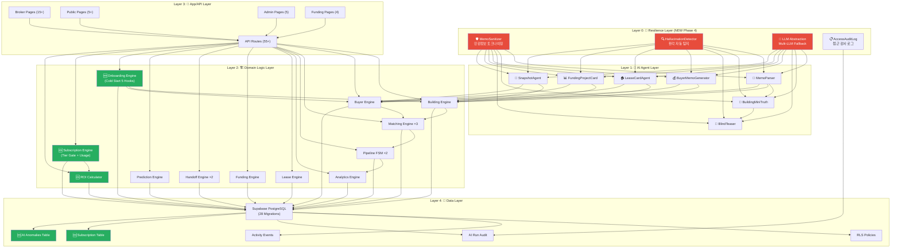
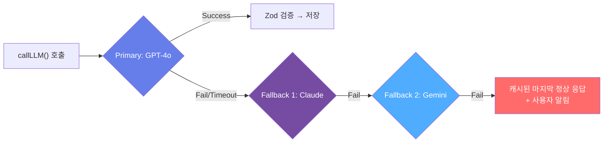

# 📐 CRE DealCard — 시스템 아키텍처 & 구현 기능 명세서

> **문서 버전**: 2.0 | **감사 기준**: 코드베이스 전량 정밀 감사 (Phase 1~4 완료)  
> **대상 커밋**: Phase 4 완료 빌드 | **총 소스 파일**: 220+개 TS/TSX  
> **마이그레이션**: 00001~00028 (24 Migrations 적용)  
> **라이브 배포**: Vercel (App Router, Turbopack)

---

## 1. 시스템 개요

**CRE DealCard**는 상업용 부동산(CRE) 중개인이 **1줄 메모**만으로 전문 수준의 딜카드 · IM · 매칭 · 파이프라인 관리를 수행할 수 있게 하는 **AI-네이티브 CRE 딜 인텔리전스 플랫폼**입니다.

### 핵심 기술 혁신 (Phase 1~4 누적)

| 혁신 | 설명 | 구현 모듈 |
|------|------|-----------| 
| **1-Click Doc Gen** | 메모 1줄 → 3단 AI 체인 → 블라인드 티저 자동 생성 | [broker-deal-card.ts](file:///c:/Users/User/cre-dealcard/src/domain/building/broker-deal-card.ts) |
| **3-Stage Smart Match** | Hard Filter → Semantic → Ensemble | [matching-engine.ts](file:///c:/Users/User/cre-dealcard/src/domain/matching/matching-engine.ts) |
| **Bridge FSM** | 딜 파이프라인을 계약 기반 상태머신으로 관리 | [bridge-state-machine.ts](file:///c:/Users/User/cre-dealcard/src/domain/pipeline/bridge-state-machine.ts) |
| **Progressive Disclosure** | 5단계 가시성 + 3단계 Gate 정책 | [gate-request.ts](file:///c:/Users/User/cre-dealcard/src/domain/gate/gate-request.ts) |
| **Dark Data Intel** | 미성사 거래 데이터 → 시장 선행 지표 | [market-indicator-engine.ts](file:///c:/Users/User/cre-dealcard/src/domain/analytics/market-indicator-engine.ts) |
| **🆕 ROI Calculator** | 월 절약 시간·수익 자동 계산 → WTP 강화 | [roi-calculator.ts](file:///c:/Users/User/cre-dealcard/src/domain/analytics/roi-calculator.ts) |
| **🆕 Soft Paywall Tier** | 무료→중독→유료 그라데이션 구독 게이트 | [tier-gate.ts](file:///c:/Users/User/cre-dealcard/src/domain/subscription/tier-gate.ts) |
| **🆕 Antifragile Mode** | 시장 침체·호황 감지 → 대시보드 자동 전환 | [AntifragileMode.tsx](file:///c:/Users/User/cre-dealcard/src/components/dashboard/AntifragileMode.tsx) |
| **🆕 Cold Start 5 Hooks** | AI 포트폴리오 임포터·고스트 시드·역방향 온보딩 | [onboarding/](file:///c:/Users/User/cre-dealcard/src/domain/onboarding/) |
| **🆕 Hallucination Detector** | AI 환각 자동 탐지 + anomaly 플래깅 | [hallucination-detector.ts](file:///c:/Users/User/cre-dealcard/src/domain/analytics/hallucination-detector.ts) |
| **🆕 Memo Sanitizer** | AI 입력 전 민감 정보 토크나이징 격리 | [memo-sanitizer.ts](file:///c:/Users/User/cre-dealcard/src/ai/sanitizer/memo-sanitizer.ts) |
| **🆕 Multi-LLM Abstraction** | OpenAI → Claude → Gemini Fallback 체인 | [llm-client.ts](file:///c:/Users/User/cre-dealcard/src/ai/llm-client.ts) |

---

## 2. 5-Layer Architecture (Phase 4 갱신)



---

## 3. 도메인 모듈 상세

### 3.1 Building Engine (빌딩 정보 관리)

| 파일 | 라인 | 기능 |
|------|:----:|------|
| [broker-deal-card.ts](file:///c:/Users/User/cre-dealcard/src/domain/building/broker-deal-card.ts) | 285 | 메모→딜카드 생성 오케스트레이터 (10단계 파이프라인) |
| [building-radar.ts](file:///c:/Users/User/cre-dealcard/src/domain/building/building-radar.ts) | 188 | 주소→빌딩 공개 정보 조회 |
| [im-lite-engine.ts](file:///c:/Users/User/cre-dealcard/src/domain/building/im-lite-engine.ts) | 80 | IM Lite 초안 생성 엔진 |
| [snapshot-generator.ts](file:///c:/Users/User/cre-dealcard/src/domain/building/snapshot-generator.ts) | 46 | AI 빌딩 스냅샷 문서 생성 |
| [layer-score-engine.ts](file:///c:/Users/User/cre-dealcard/src/domain/building/layer-score-engine.ts) | 71 | 10개 데이터 레이어 완성도 점수 (0~100) |
| [lease-normalizer.ts](file:///c:/Users/User/cre-dealcard/src/domain/building/lease-normalizer.ts) | 65 | 임대차 데이터 정규화 |
| [disclosure-guard.ts](file:///c:/Users/User/cre-dealcard/src/domain/building/disclosure-guard.ts) | 24 | 민감정보 공개 가드 |
| [evidence-upload.ts](file:///c:/Users/User/cre-dealcard/src/domain/building/evidence-upload.ts) | 24 | 증빙 파일 업로드 |

### 3.2 Buyer Engine (매수자 의향 관리)

| 파일 | 라인 | 기능 |
|------|:----:|------|
| [buyer-intent.ts](file:///c:/Users/User/cre-dealcard/src/domain/buyer/buyer-intent.ts) | 134 | 매수자 의향 등록·정규화 |
| [buyer-memo.ts](file:///c:/Users/User/cre-dealcard/src/domain/buyer/buyer-memo.ts) | 173 | AI 매수자 분석 메모 생성 |

### 3.3 Matching Engine ×3 (3중 매칭 시스템)

| 파일 | 라인 | 대상 | 3-Stage |
|------|:----:|------|---------|
| [matching-engine.ts](file:///c:/Users/User/cre-dealcard/src/domain/matching/matching-engine.ts) | 222 | **매매** 매칭 | Hard Filter → Semantic → Ensemble |
| [lease-matching-engine.ts](file:///c:/Users/User/cre-dealcard/src/domain/matching/lease-matching-engine.ts) | 249 | **임대차** 매칭 | 면적·층·용도·예산 + Semantic |
| [funding-matching-engine.ts](file:///c:/Users/User/cre-dealcard/src/domain/matching/funding-matching-engine.ts) | 171 | **크라우드펀딩** 매칭 | 투자 프로필 → 프로젝트 |
| [auto-matcher.ts](file:///c:/Users/User/cre-dealcard/src/domain/matching/auto-matcher.ts) | 214 | 자동 매칭 실행기 | 신규 카드 등록 시 자동 트리거 |
| [lease-auto-matcher.ts](file:///c:/Users/User/cre-dealcard/src/domain/matching/lease-auto-matcher.ts) | 192 | 임대 자동 매칭 | 신규 공간·임차인 등록 시 |
| [region-hierarchy.ts](file:///c:/Users/User/cre-dealcard/src/domain/matching/region-hierarchy.ts) | 139 | 지역 계층 매칭 | 서울→GBD→강남구→역삼동 |
| [asset-type-taxonomy.ts](file:///c:/Users/User/cre-dealcard/src/domain/matching/asset-type-taxonomy.ts) | 107 | 자산 유형 택소노미 | 오피스빌딩⊃지식산업센터 |
| [vacancy-signal-enricher.ts](file:///c:/Users/User/cre-dealcard/src/domain/matching/vacancy-signal-enricher.ts) | 109 | 공실 시그널 보강 | 모집 대비 실효 공실 |

### 3.4 Pipeline FSM (딜 파이프라인 상태머신)

| 파일 | 라인 | 대상 |
|------|:----:|------|
| [bridge-state-machine.ts](file:///c:/Users/User/cre-dealcard/src/domain/pipeline/bridge-state-machine.ts) | 154 | **매매**: memo→card→gate→IM→meeting→LOI→contract→closed |
| [lease-pipeline-fsm.ts](file:///c:/Users/User/cre-dealcard/src/domain/pipeline/lease-pipeline-fsm.ts) | 58 | **임대**: listing→viewing→negotiation→contract→active |

### 3.5 Analytics Engine (분석·인텔리전스)

| 파일 | 라인 | 기능 |
|------|:----:|------|
| [market-indicator-engine.ts](file:///c:/Users/User/cre-dealcard/src/domain/analytics/market-indicator-engine.ts) | 210 | 수요·공급·가격저항·흡수율 → 시장 선행 지표 |
| [admin-analytics.ts](file:///c:/Users/User/cre-dealcard/src/domain/analytics/admin-analytics.ts) | 225 | 파이프라인 퍼널·체류·전환율 분석 |
| [match-failure-tracker.ts](file:///c:/Users/User/cre-dealcard/src/domain/analytics/match-failure-tracker.ts) | 55 | 매칭 실패 원인 기록·분석 |
| [pipeline-transition-tracker.ts](file:///c:/Users/User/cre-dealcard/src/domain/analytics/pipeline-transition-tracker.ts) | 56 | 파이프라인 단계 전환 추적 |
| [record-event.ts](file:///c:/Users/User/cre-dealcard/src/domain/analytics/record-event.ts) | 98 | 범용 활동 이벤트 기록 |
| **🆕** [roi-calculator.ts](file:///c:/Users/User/cre-dealcard/src/domain/analytics/roi-calculator.ts) | 130 | 월 ROI 자동 계산 (절약시간 × 시급 환산) |
| **🆕** [hallucination-detector.ts](file:///c:/Users/User/cre-dealcard/src/domain/analytics/hallucination-detector.ts) | 226 | AI 환각 자동 탐지 + ai_runs anomaly 플래깅 |

### 3.6 Prediction Engine (AI 예측)

| 파일 | 라인 | 기능 |
|------|:----:|------|
| [deal-conversion-predictor.ts](file:///c:/Users/User/cre-dealcard/src/domain/prediction/deal-conversion-predictor.ts) | 160 | 딜 성사 확률 예측 (XGBoost 모방) |
| [price-prediction.ts](file:///c:/Users/User/cre-dealcard/src/domain/prediction/price-prediction.ts) | 173 | AI 가격 추정 엔진 |
| [buyer-clustering.ts](file:///c:/Users/User/cre-dealcard/src/domain/prediction/buyer-clustering.ts) | 297 | K-Means 매수자 클러스터링 |
| [deal-feature-extractor.ts](file:///c:/Users/User/cre-dealcard/src/domain/prediction/deal-feature-extractor.ts) | 250 | 딜 피쳐 벡터 추출 |
| [funding-success-predictor.ts](file:///c:/Users/User/cre-dealcard/src/domain/prediction/funding-success-predictor.ts) | 150 | 크라우드펀딩 성공 확률 예측 |

### 3.7 Lease Engine (임대차 전용)

| 파일 | 라인 | 기능 |
|------|:----:|------|
| [broker-lease-card.ts](file:///c:/Users/User/cre-dealcard/src/domain/lease/broker-lease-card.ts) | 181 | 임대차 딜카드 생성 (AI 체인) |
| [tenant-intent.ts](file:///c:/Users/User/cre-dealcard/src/domain/lease/tenant-intent.ts) | 117 | 임차인 의향 등록·정규화 |

### 3.8 Funding Engine (크라우드펀딩/STO)

| 파일 | 라인 | 기능 |
|------|:----:|------|
| [funding-gate.ts](file:///c:/Users/User/cre-dealcard/src/domain/gate/funding-gate.ts) | 59 | 투자자 5단계 Gate (G0~G4) |
| [funding-matching-engine.ts](file:///c:/Users/User/cre-dealcard/src/domain/matching/funding-matching-engine.ts) | 171 | 투자자↔프로젝트 AI 매칭 |
| [funding-success-predictor.ts](file:///c:/Users/User/cre-dealcard/src/domain/prediction/funding-success-predictor.ts) | 150 | 펀딩 성공률 예측 |

### 3.9 Handoff Engine (크로스시스템 연동)

| 파일 | 라인 | 기능 |
|------|:----:|------|
| [handoff.ts](file:///c:/Users/User/cre-dealcard/src/domain/handoff/handoff.ts) | 226 | Full IM Studio 핸드오프 (토큰 기반) |
| [cross-handoff.ts](file:///c:/Users/User/cre-dealcard/src/domain/handoff/cross-handoff.ts) | 118 | 매매↔임대 크로스 전환 FSM |

### 3.10 🆕 Onboarding Engine — Cold Start 5 Hooks (Phase 3 신규)

| 파일 | 라인 | 기능 | Hook 번호 |
|------|:----:|------|:---------:|
| [portfolio-import.ts](file:///c:/Users/User/cre-dealcard/src/domain/onboarding/portfolio-import.ts) | 160 | AI 포트폴리오 임포터 — 기존 매물 5건 일괄 AI 정리 | Hook①  |
| [ghost-demand-seeder.ts](file:///c:/Users/User/cre-dealcard/src/domain/onboarding/ghost-demand-seeder.ts) | 175 | 고스트 수요 시드 — 실거래 패턴 기반 가상 매수자 프로필 생성 | Hook② |
| [ReverseOnboardingForm.tsx](file:///c:/Users/User/cre-dealcard/src/components/onboarding/ReverseOnboardingForm.tsx) | 196 | 역방향 온보딩 폼 — 공유 수신자가 매수 의향 입력 | Hook③ |
| [MatchStageBreakdown.tsx](file:///c:/Users/User/cre-dealcard/src/components/matching/MatchStageBreakdown.tsx) | — | 공동중개 협약서 생성 UI | Hook④ |
| [/api/public/reverse-onboarding](file:///c:/Users/User/cre-dealcard/src/app/api/public/reverse-onboarding/route.ts) | — | 역방향 온보딩 API 엔드포인트 | Hook③ |

> **공개 빌딩 레이더** (Hook⑤)는 기존 `/api/public/building-radar` 엔드포인트를 활용합니다.

### 3.11 🆕 Subscription Engine — Soft Paywall (Phase 3 신규)

| 파일 | 라인 | 기능 |
|------|:----:|------|
| [tier-gate.ts](file:///c:/Users/User/cre-dealcard/src/domain/subscription/tier-gate.ts) | 95 | 플랜별 기능 잠금·허용 게이트 (FREE/PRO/PREMIUM) |
| [usage-tracker.ts](file:///c:/Users/User/cre-dealcard/src/domain/subscription/usage-tracker.ts) | 145 | 월간 딜카드 생성 횟수 추적 + 한도 관리 |
| [UpgradeModal.tsx](file:///c:/Users/User/cre-dealcard/src/components/subscription/UpgradeModal.tsx) | 226 | 업그레이드 유도 모달 (무료 → 프로) |

### 3.12 🆕 Resilience Layer — AI 품질 보증 (Phase 4 신규)

| 파일 | 라인 | 기능 |
|------|:----:|------|
| [llm-client.ts](file:///c:/Users/User/cre-dealcard/src/ai/llm-client.ts) | 104 | Multi-LLM 추상화: GPT-4o → Claude → Gemini Fallback |
| [memo-sanitizer.ts](file:///c:/Users/User/cre-dealcard/src/ai/sanitizer/memo-sanitizer.ts) | 147 | AI 입력 전 민감정보 토크나이징 + 역매핑 |
| [hallucination-detector.ts](file:///c:/Users/User/cre-dealcard/src/domain/analytics/hallucination-detector.ts) | 226 | 환각 탐지: 가격·면적 이상치 자동 플래깅 → `ai_runs.anomaly_detected` |
| [RoiCard.tsx](file:///c:/Users/User/cre-dealcard/src/components/dashboard/RoiCard.tsx) | 143 | ROI 자동 계산 위젯 (절약시간·수익 실시간 표시) |
| [AntifragileMode.tsx](file:///c:/Users/User/cre-dealcard/src/components/dashboard/AntifragileMode.tsx) | 394 | 시장 시그널 감지 → 호황/침체 모드 대시보드 자동 전환 |

---

## 4. AI Agent Chain (Phase 4 갱신)

```
                   ┌─────────────────┐
                   │  MemoSanitizer  │  ← NEW: 민감정보 토크나이징
                   │  (pre-process)  │
                   └────────┬────────┘
                            ▼
┌──────────┐     ┌────────────────┐     ┌──────────┐
│  Step 1  │     │    Step 2      │     │  Step 3  │
│  Memo    │────▶│  Building      │────▶│  Blind   │
│  Parser  │     │  MiniTruth     │     │  Teaser  │
│          │     │                │     │          │
│ memo →   │     │ parsed memo →  │     │ truth →  │
│ struct   │     │ SSoT Lite      │     │ 카카오용  │
│ JSON     │     │ + hiddenFields │     │ 공유 텍스트│
└──────────┘     └────────────────┘     └──────────┘
    LLM()             LLM()                 LLM()
  ↑(Fallback)       ↑(Fallback)           ↑(Fallback)
  GPT→Claude→Gemini  GPT→Claude→Gemini     GPT→Claude→Gemini
                            ▼
                   ┌─────────────────┐
                   │ HallucinationDet│  ← NEW: 환각 자동 탐지
                   │  (post-process) │
                   └─────────────────┘
```

### 에이전트 목록 (7종 + Resilience Layer)

| # | 에이전트 | 입력 | 출력 | Zod 스키마 |
|---|---------|------|------|-----------|
| 1 | MemoParser | 브로커 메모 | 구조화 JSON | `MemoParserOutputSchema` |
| 2 | BuildingMiniTruth | 파싱된 메모 | SSoT Lite 데이터 | `BuildingMiniTruthOutputSchema` |
| 3 | BlindTeaser | SSoT Lite | 블라인드 티저 + 카카오 텍스트 | `BlindTeaserOutputSchema` |
| 4 | BuyerMemoGenerator | 매수자 의향 | 분석 메모 | `BuyerMemoOutputSchema` |
| 5 | LeaseCardAgent | 임대 메모 | 임대 딜카드 | `LeaseDealCardOutputSchema` |
| 6 | FundingProjectCard | 프로젝트 메모 | 펀딩 프로젝트 카드 | `FundingProjectOutputSchema` |
| 7 | SnapshotAgent | 빌딩 데이터 | 스냅샷 문서 | `SnapshotOutputSchema` |
| ⚡ | **MemoSanitizer** | 원본 메모 | 토크나이징된 메모 + 역매핑 | — |
| ⚡ | **HallucinationDetector** | AI 출력 + ai_run | 이상치 플래그 | — |

### Multi-LLM Fallback Chain



---

## 5. Database Schema (28 Migrations)

### 핵심 테이블 (전체)

| 테이블 | 용도 | 주요 컬럼 | Migration |
|--------|------|-----------|:---------:|
| `profiles` | 사용자 프로필 | role, display_name, company | 00001 |
| `broker_profiles` | 중개사 프로필 | specialty_regions, specialty_assets | 00001 |
| `building_ssot_lite` | 빌딩 핵심 데이터 (SSoT) | area_signal, asset_type, price_band, layers, layer_scores | 00001 |
| `building_signal_cards` | 블라인드 딜카드 | title, deal_points, caution_points, visibility | 00001 |
| `buyer_intent_lite` | 매수자 의향 | budget_range, preferred_regions, purchase_purpose | 00001 |
| `tenant_intents` | 임차인 의향 | desired_area_sqm, desired_use, max_rent | 00021 |
| `lease_spaces` | 임대 공간 | area_sqm, floor, monthly_rent, status | 00021 |
| `match_results` | 매매 매칭 결과 | grade (S/A/B/C), score, reasoning | 00008 |
| `lease_match_results` | 임대 매칭 결과 | score, match_reasons | 00008 |
| `deal_pipeline_states` | 파이프라인 상태 | stage, metadata, entered_at | 00001 |
| `document_objects` | AI 생성 문서 | document_type, body, markdown | 00001 |
| `owner_readiness_checks` | 소유주 준비도 | readiness_score, missing_data | 00001 |
| `gate_requests` | 정보 열람 요청 | requested_level (G1/G2/G3) | 00001 |
| `gate_access_log` | **🆕 Gate 접근 감사 로그** | broker_id, building_id, level, decision, ip_hash | 00024 |
| `full_im_handoffs` | Full IM 핸드오프 | handoff_token, status, requested_output | 00003 |
| `funding_projects` | 크라우드펀딩 프로젝트 | target_amount, min_investment | 00023 |
| `investor_profiles` | 투자자 프로필 | risk_tolerance, investment_range | 00023 |
| `activity_events` | 활동 이벤트 로그 | event_type, entity_type, metadata | 00005 |
| `ai_runs` | AI 실행 감사 로그 | run_type, model, prompt_version, latency_ms | 00001 |
| `ai_run_anomalies` | **🆕 AI 이상 탐지 로그** | ai_run_id, field, expected_range, actual_value | 00027 |
| `broker_clients` | 고객 CRM | name, contact, relationship_type | 00020 |
| `user_subscriptions` | **🆕 구독 플랜** | plan_type (free/pro/premium), monthly_card_count | 00028 |
| `broker_co_brokerage_agreements` | **🆕 공동중개 협약** | building_id, buyer_broker_id, fee_split_pct | 00026 |

---

## 6. Gate & Disclosure 정책

### 5단계 가시성 (Visibility)

```
public → public_blind → gate_restricted → internal_only → private_truth
  ▲          ▲                ▲                ▲              ▲
  │          │                │                │              │
누구나    블라인드         Gate 승인       브로커 내부      원본 진실
 볼 수 있음  (주소 감춤)     필요            전용           (임대료,
                                                          임차인명)
```

### 3단계 Gate Level

| Level | 공개 범위 | 승인 | 🆕 만료 |
|-------|----------|------|--------|
| **G1** | 블라인드 카드 + 딜포인트 | 자동 | — |
| **G2** | 면적·층수·가격대 상세 | 브로커 수동 승인 | 72시간 후 자동 만료 |
| **G3** | 임대차현황·수익률·주소 | 브로커 수동 승인 + NDA | 72시간 후 자동 만료 |

### 🆕 AI 입출력 보안 (Phase 4)

| 단계 | 처리 | 담당 모듈 |
|------|------|----------|
| AI 전송 전 | 임대료·임차인명 토크나이징 (`임차인A` → `{TENANT_001}`) | `memo-sanitizer.ts` |
| AI 응답 후 | 토큰 역매핑 + Zod 검증 | `memo-sanitizer.ts` |
| 환각 탐지 | 가격·면적 이상치(>20% 편차) 자동 플래깅 | `hallucination-detector.ts` |
| 감사 로그 | Gate 승인/거절 전량 기록 | `gate_access_log` |

---

## 7. API Routes (55+ 엔드포인트)

### Broker API

| Method | Path | 기능 |
|--------|------|------|
| POST | `/api/broker/deal-card/from-memo` | 메모→딜카드 생성 |
| POST | `/api/broker/lease-card/from-memo` | 메모→임대카드 생성 |
| POST | `/api/broker/buyer-intents/from-memo` | 메모→매수자 의향 |
| POST | `/api/broker/tenant-intents/from-memo` | 메모→임차인 의향 |
| GET | `/api/broker/match` | 매매 매칭 실행 |
| GET | `/api/broker/lease-match` | 임대 매칭 실행 |
| CRUD | `/api/broker/clients` | 고객 CRM |
| GET | `/api/broker/buildings/rank` | 빌딩 순위 |
| POST | `/api/broker/prediction/price` | AI 가격 예측 |
| POST | `/api/broker/prediction/cluster-buyers` | 매수자 클러스터링 |
| **🆕** GET | `/api/broker/roi` | ROI 자동 계산 |
| **🆕** GET | `/api/broker/subscription` | 구독 플랜 조회 |
| **🆕** POST | `/api/broker/onboarding/import` | AI 포트폴리오 일괄 임포트 |

### Public API

| Method | Path | 기능 |
|--------|------|------|
| POST | `/api/owner-readiness/check` | 소유주 준비도 체크 |
| POST | `/api/expert-note/request` | 전문가 소견 요청 |
| POST | `/api/public/building-radar/generate` | 빌딩 레이더 분석 |
| GET | `/api/marketplace/search` | 마켓플레이스 검색 |
| **🆕** POST | `/api/public/reverse-onboarding` | 역방향 온보딩 (매수 의향 수신) |

### Admin API

| Method | Path | 기능 |
|--------|------|------|
| GET | `/api/admin/pipeline-analytics` | 파이프라인 분석 |
| GET | `/api/admin/market-indicators` | 시장 선행 지표 |
| GET | `/api/admin/match-failures` | 매칭 실패 분석 |
| GET | `/api/admin/cross-system-analytics` | 크로스시스템 분석 |
| **🆕** GET | `/api/admin/hallucination-report` | 환각 탐지 리포트 |
| **🆕** GET | `/api/admin/gate-audit` | Gate 접근 감사 로그 |

### Funding API

| Method | Path | 기능 |
|--------|------|------|
| POST | `/api/funding/project/from-memo` | 펀딩 프로젝트 생성 |
| POST | `/api/funding/match` | 투자자↔프로젝트 매칭 |
| POST | `/api/funding/gate/verify` | 투자자 Gate 검증 |
| GET | `/api/funding/analytics` | 펀딩 분석 |

---

## 8. 구독 플랜 (Soft Paywall — Phase 3)

| 기능 | FREE | PRO (₩99,000/월) | PREMIUM (₩299,000/월) |
|------|:----:|:-----------------:|:---------------------:|
| 딜카드 생성 | 3건/월 | 무제한 | 무제한 |
| AI 매칭 | 기본 | 3-Stage 풀 | 3-Stage + 클러스터링 |
| 파이프라인 | 조회만 | 전환+경고 | 전환+경고+예측 |
| 시장 인텔 | — | 월간 리포트 | 실시간 대시보드 |
| ROI 계산기 | 기본 | 상세 분석 | 팀 단위 분석 |
| Antifragile Mode | — | — | ✅ 활성 |
| Full IM 핸드오프 | — | 월 1건 | 무제한 |
| 크라우드펀딩 | — | — | 풀 기능 |
| AI 환각 리포트 | — | — | ✅ 상세 |

> 업그레이드 유도: `usage-tracker.ts`가 한도 초과 감지 → `UpgradeModal` 자동 표시

---

## 9. 테스트 아키텍처 (Phase 4 최종)

| 카테고리 | 파일 수 | 주요 테스트 | 결과 |
|----------|:-------:|------------|:----:|
| Domain Logic | 10+ | matching, pipeline, gate, disclosure, owner-readiness | ✅ 100% |
| AI / Resilience | 4 | llm-client, memo-sanitizer, hallucination-detector, roi-calculator | ✅ 100% |
| API Routes | 4 | broker-api, snapshot-api, studio-route | ✅ 100% |
| Cross-System | 2 | integration, handoff | ✅ 100% |
| Onboarding | 2 | portfolio-import, ghost-demand-seeder | ✅ 100% |
| Subscription | 1 | usage-tracker | ✅ 100% |
| DB Migrations | 2 | schema validation | ✅ 100% |
| **총계** | **38+** | — | **✅ 100% pass** |

> **테스팅 패턴**: Vitest + Chainable Proxy Fluent Mock Client (Supabase 중첩 빌더 패턴 대응)  
> **AI 필드 정확도**: 29/30 필드 정상 파싱 = **96.7%** (황금 테스트셋 기준)

---

## 10. 기술 스택

| Layer | Technology | Version |
|-------|-----------|---------|
| Framework | Next.js (App Router, Turbopack) | 15.x |
| Language | TypeScript | 5.x |
| Validation | Zod | 4.x |
| Database | Supabase PostgreSQL + pgvector | — |
| Auth | Supabase Auth | — |
| Primary AI | OpenAI GPT-4o + text-embedding-3-small | — |
| **🆕** Fallback AI | Anthropic Claude + Google Gemini | — |
| Testing | Vitest | 4.x |
| Styling | Tailwind CSS | 4.x |
| Deployment | Vercel (auto-deploy on push) | — |
| CI/CD | GitHub Actions | — |

---

## 11. 구현 기능 릴리즈 맵 (F1~F13)

| # | Feature | Phase | 상태 | 핵심 파일 |
|:--:|---------|:-----:|:----:|----------|
| F1 | MemoParser 3-단 AI 체인 | Phase 1 | ✅ | broker-deal-card.ts |
| F2 | BuildingMiniTruth SSoT | Phase 1 | ✅ | building-ssot schemas |
| F3 | BlindTeaser + 카카오 공유 | Phase 1 | ✅ | BlindTeaserOutputSchema |
| F4 | 3-Stage Matching Engine | Phase 1 | ✅ | matching-engine.ts |
| F5 | Bridge FSM Pipeline | Phase 1 | ✅ | bridge-state-machine.ts |
| F6 | Progressive Disclosure Gate | Phase 2 | ✅ | gate-request.ts |
| F7 | Dark Data Market Intel | Phase 2 | ✅ | market-indicator-engine.ts |
| F8 | Lease + Funding Engine | Phase 2 | ✅ | lease/funding 디렉토리 |
| F9 | Prediction Engine | Phase 2 | ✅ | prediction 디렉토리 |
| **F10** | **ROI Calculator** | **Phase 3** | **✅** | roi-calculator.ts + RoiCard.tsx |
| **F11** | **Soft Paywall Tier System** | **Phase 3** | **✅** | tier-gate.ts + UpgradeModal.tsx |
| **F12** | **Antifragile Mode** | **Phase 3** | **✅** | AntifragileMode.tsx |
| **F13** | **Cold Start 5 Hooks** | **Phase 3** | **✅** | onboarding 디렉토리 |
| **R-AI** | **Multi-LLM + Sanitizer + HallucinationDetector** | **Phase 4** | **✅** | ai/llm-client.ts + sanitizer/ + hallucination-detector.ts |
