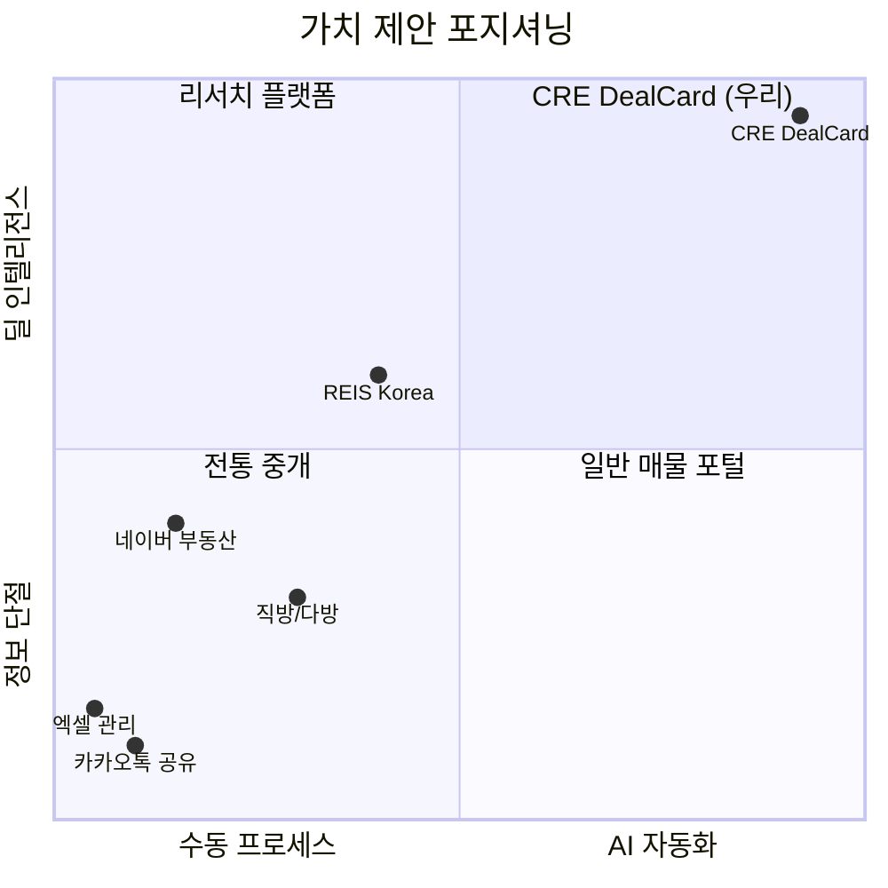
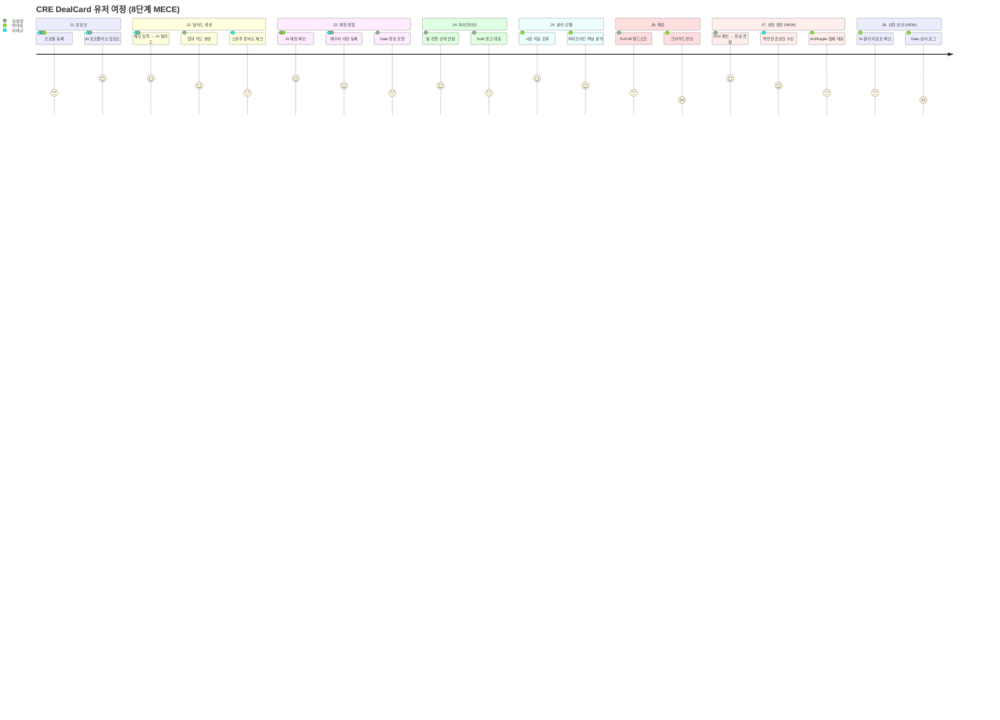

# 🎯 CRE DealCard — 가치 제안 & 페르소나별 유저 시나리오

> **대상**: 한국 상업용 부동산 중개인 (법인/개인)  
> **문서 버전**: 2.0 | Phase 1~4 구현 반영  
> **도출 방법**: 코드베이스 전량 감사 기반 기능→페르소나→시나리오 MECE 매핑

---

## 1. 핵심 가치 제안 (Value Proposition)

### 한 문장 가치 제안

> **"중개사님의 메모 1줄이, 투자은행급 딜카드 · AI 매칭 · 거래 파이프라인으로 변합니다 — 그리고 시스템이 스스로 매수자를 모집합니다."**

### 5차원 가치 매트릭스 (Phase 3~4 기능 반영)



| 가치 차원 | Before (현재 관행) | After (CRE DealCard) | 개선 배율 |
|-----------|-------------------|---------------------|:---------:|
| ⏱️ **Time** | 딜카드 작성 2~4시간 | **30초** (메모 1줄) | **240×** |
| 📊 **Quality** | 중개사 역량 의존, 편차 大 | AI 표준화 + 전문가급 문서 | **일관성 확보** |
| 🧠 **Intelligence** | 경험·감에 의존한 매칭 | 3-Stage AI 매칭 + 예측 모델 | **데이터 기반** |
| 📈 **Scale** | 동시 10건 관리 한계 | 무제한 딜 + 자동 파이프라인 | **10×+** |
| 💰 **🆕 ROI 가시화** | \"얼마나 절약하는지\" 모름 | 대시보드에 월 절약 시간·금액 자동 표시 | **결제 저항 제거** |

---

## 2. 페르소나 정의 (MECE 3분류)

### Persona A: 주니어 중개인 "이태규 대리" (경력 1~3년)

| 항목 | 내용 |
|------|------|
| **나이/경력** | 29세, 상업용 부동산 중개 2년차 |
| **소속** | 대형 중개법인 소속 |
| **핵심 고민** | "IM/딜카드를 어떻게 만들어야 할지 모른다" |
| **기술 수준** | 스마트폰·카카오톡 능숙, 전문 SW 경험 無 |
| **KPI** | 월간 신규 리스팅 수, 매수자 연결 수 |
| **Pain Point** | ① 전문 문서 작성 능력 부족 ② 매수자 풀 부재 ③ 딜 진행 상황 추적 혼란 |
| **Gain** | 선배급 딜카드를 자동 생성해서 빠르게 성장 |
| **🆕 Phase 3 Gain** | 역방향 온보딩으로 공유 수신자가 스스로 매수 의향 등록 → 내 매수자 풀 자동 누적 |

### Persona B: 시니어 중개인 "김실장" (경력 7~15년)

| 항목 | 내용 |
|------|------|
| **나이/경력** | 42세, 강남 상업용 부동산 전문 12년 |
| **소속** | 개인 중개사무소 대표 |
| **핵심 고민** | "매물이 30개인데 매칭을 수동으로 하고 있다" |
| **기술 수준** | 엑셀 중급, 네이버 카페 활용 |
| **KPI** | 거래 성사율, 거래 건당 수수료, 고객 재의뢰율 |
| **Pain Point** | ① 수동 매칭에 시간 과다 ② 정보 비대칭 ③ 파이프라인 사각지대 |
| **Gain** | AI가 매칭을 자동화해서 고부가 영업에 집중 |
| **🆕 Phase 3 Gain** | ROI 카드가 \"이번 달 42시간 절약 = ₩2,100,000\" 자동 표시 → 유료 플랜 갱신 동기 |

### Persona C: 대표 권역 중개인 "박대표" (경력 15년+, 법인)

| 항목 | 내용 |
|------|------|
| **나이/경력** | 52세, GBD 전문 중개법인 대표 |
| **소속** | 직원 5~10명 보유 법인 |
| **핵심 고민** | "시장 트렌드를 선행 파악하고 사업 의사결정을 하고 싶다" |
| **기술 수준** | 보고서 중심, 의사결정 위주 |
| **KPI** | 법인 매출, 시장점유율, 대형 딜 클로징 |
| **Pain Point** | ① 직원 딜 현황 통합 관리 불가 ② 시장 선행 지표 부재 ③ 대형 딜 기밀 관리 |
| **Gain** | 팀 전체 파이프라인 통합 + 시장 인텔리전스 |
| **🆕 Phase 3 Gain** | Antifragile Mode가 시장 침체기에 자동으로 "파이프라인 관리 집중" 뷰로 전환 |

---

## 3. MECE 유저 시나리오 (8대 여정)

### 여정 맵 개요 (Phase 3~4 신규 여정 포함)



---

### J1. 온보딩 & 프로필 설정 (Phase 3 확장)

| Step | 사용자 행동 | 시스템 반응 | 관련 코드 |
|:----:|------------|-----------|-----------| 
| 1 | 카카오/구글 소셜 로그인 | Supabase Auth → Profile 생성 | [auth](file:///c:/Users/User/cre-dealcard/src/app/(auth)/login/page.tsx) |
| 2 | 전문 지역·자산 유형 선택 | `broker_profiles` 저장 | [profile/route.ts](file:///c:/Users/User/cre-dealcard/src/app/api/broker/profile/route.ts) |
| 3 | 대시보드 진입 | 빌딩 0건 → 신규 등록 유도 CTA | [broker/page.tsx](file:///c:/Users/User/cre-dealcard/src/app/(broker)/broker/page.tsx) |
| **🆕4** | **\"기존 매물 AI 정리\" 클릭** | **포트폴리오 임포터 실행 — 최대 5건 메모 일괄 → AI 딜카드** | [portfolio-import.ts](file:///c:/Users/User/cre-dealcard/src/domain/onboarding/portfolio-import.ts) |
| **🆕5** | — | **Ghost Demand Seeder 실행 — 가상 매수자 프로필 3건 자동 시드** | [ghost-demand-seeder.ts](file:///c:/Users/User/cre-dealcard/src/domain/onboarding/ghost-demand-seeder.ts) |

> **Cold Start 해소**: 이태규가 첫날 매물 0개라도 → AI 포트폴리오 임포터로 5건 즉시 등록 → Ghost Demand로 \"관심 가질 매수자 유형 12명\" 즉시 표시 → 혼자서도 플랫폼 가치 체감

---

### J2. 딜카드 생성 (핵심 시나리오)

#### J2-1. 매매 딜카드 생성 🔥

| Step | 사용자 행동 | 시스템 반응 | 소요시간 |
|:----:|------------|-----------|:--------:|
| 1 | **메모 1줄 입력**: "역삼역 5분 오피스빌딩 매각 건, 연면적 3,200평, 준공 2015, 현 공실 15%, 희망가 650억" | — | 10초 |
| 2 | — | **🆕 MemoSanitizer**: 민감정보 토크나이징 후 AI 체인 실행 | <1초 |
| 3 | — | **AI 체인**: MemoParser → BuildingMiniTruth → BlindTeaser | 8~12초 |
| 4 | — | **🆕 HallucinationDetector**: 가격·면적 이상치 검사 | <1초 |
| 5 | — | `building_ssot_lite` 생성 + `building_signal_cards` 생성 | 즉시 |
| 6 | — | `document_objects` 생성 (blind_teaser — 카카오 공유용) | 즉시 |
| 7 | — | **Auto-Match** 실행 → 기존 매수자와 자동 매칭 | 3~5초 |
| 8 | — | **🆕 Tier Gate 체크**: FREE 3건 초과 시 → UpgradeModal | 즉시 |
| 9 | 블라인드 티저 확인 → 카카오 공유 | 카카오톡 전송 텍스트 복사 | 2초 |

> **Total: 약 25초에 전문 딜카드 완성**

```
📋 [AI가 생성하는 블라인드 티저 예시]
━━━━━━━━━━━━━━━━━━━
🏢 GBD 핵심 A급 오피스빌딩 매각 건

📍 강남구 역삼동 일대 (도보 5분 이내)
📐 연면적 3,200평대 | 2015년 준공
💰 650억대 (평당 약 2,030만원)

✅ 딜 포인트
• GBD 핵심 입지, 역세권 프리미엄
• 10년 이내 준공, 양호한 건물 상태
• 수익형 + 사옥 전환 가능

⚠️ 유의 사항
• 현 공실률 15% 확인 필요
• 임대차 상세 Gate 요청 필요

🔒 상세 정보는 Gate 요청 후 확인 가능
━━━━━━━━━━━━━━━━━━━
```

#### J2-2. 임대차 딜카드 생성

| Step | 사용자 행동 | 시스템 반응 |
|:----:|------------|-----------| 
| 1 | 임대 메모 입력: "강남역 오피스 5층 전체, 전용 120평, 보/월 5000/250, 즉입 가능" | LeaseCardAgent AI 실행 |
| 2 | — | `lease_spaces` + 블라인드 임대카드 생성 |
| 3 | — | 기존 임차인 의향과 자동 매칭 |

#### J2-3. 소유주 준비도 체크 (Public)

| Step | 사용자 행동 | 시스템 반응 |
|:----:|------------|-----------| 
| 1 | 10개 체크리스트 응답 | 가중 점수 산출 (0~100) |
| 2 | — | 준비 상태 판정: not_ready → teaser_ready → snapshot_ready → full_im |
| 3 | — | 다음 단계 추천 (예: "임대차 현황 요약표를 준비하면 블라인드 티저 생성이 가능합니다") |

---

### J3. 매칭 & 영업

#### J3-1. AI Smart Match 확인 (Stage별 시각화)

| Step | 사용자 행동 | 시스템 반응 |
|:----:|------------|-----------| 
| 1 | 매칭 페이지 진입 | 3-Stage 파이프라인 실행 |
| 2 | — | **Stage 1**: 예산·지역·자산유형 Hard Filter (탈락 사유 표시) |
| 3 | — | **Stage 2**: text-embedding-3-small 시맨틱 유사도 계산 |
| 4 | — | **Stage 3**: 목적별 가중치(사옥/투자/증여) 앙상블 스코어링 |
| 5 | S/A/B/C 등급 확인 | **🆕 Stage별 분리 시각화**: "Stage 1 통과(지역·예산 OK) → Stage 2 유사도 78% → Stage 3 종합 S등급" |
| 6 | — | 매칭 사유 자연어 설명 표시 + 👍/👎 피드백 버튼 |
| 7 | "즉시 연락" 클릭 | 매수자 상세 정보 조회 (Gate 레벨에 따라) |

#### J3-2. 매수자 의향 등록

| Step | 사용자 행동 | 시스템 반응 |
|:----:|------------|-----------| 
| 1 | 매수자 메모 입력: "법인 사옥 용도, 강남 200~500억, 역세권 필수" | AI 정규화 + BuyerMemo 생성 |
| 2 | — | `buyer_intent_lite` 저장 + 클러스터 자동 분류 |
| 3 | — | 기존 빌딩과 자동 역방향 매칭 |

#### J3-3. Gate 정보 요청

| Step | 사용자 행동 | 시스템 반응 |
|:----:|------------|-----------| 
| 1 | G2 Gate 요청 (면적·층수·가격대 상세) | `gate_requests` 생성 + `gate_access_log` 기록 |
| 2 | 담당 브로커에게 알림 | 브로커 승인/거절 |
| 3 | 승인 시 | 해당 필드 가시성 변경 (gate_restricted → broker_only) |
| **🆕4** | — | **72시간 후 자동 권한 만료** → 재요청 필요 |

#### J3-4. 🆕 역방향 온보딩 (공유 수신자 → 매수 의향 등록)

| Step | 상황 | 시스템 반응 |
|:----:|------|-----------|
| 1 | 이태규가 블라인드 티저를 카카오로 공유 | 공유 링크에 역방향 온보딩 URL 포함 |
| 2 | 수신자(다른 중개사/매수자)가 링크 클릭 | [ReverseOnboardingForm](file:///c:/Users/User/cre-dealcard/src/components/onboarding/ReverseOnboardingForm.tsx) 표시 |
| 3 | 수신자가 \"관심 있음 + 예산·조건\" 입력 | `/api/public/reverse-onboarding` → `buyer_intent_lite` 자동 생성 |
| 4 | — | 이태규의 매물에 즉시 매칭 실행 + 이태규에게 알림 |

> **Hook③ Cold Start 해소**: 이태규가 매수자를 몰라도, 티저 수신자가 스스로 매수 의향을 등록 → 매수자 풀 자동 확장

---

### J4. 파이프라인 관리

#### J4-1. 딜 진행 상태 전환

| Stage | 전환 조건 (Bridge Contract) | hold 경고 |
|-------|---------------------------|:---------:|
| memo_input → deal_card_created | `building_ssot_lite_id` 필수 | 1일 |
| deal_card_created → gate_requested | `gate_request_id` 필수 | 7일 |
| gate_requested → im_created | `im_project_id` + `readiness_score` 필수 | 7일 |
| im_created → buyer_meeting | `buyer_intent_lite_id` + `match_grade` 필수 | 14일 |
| buyer_meeting → loi | `buyer_reaction` + `price_gap` 필수 | 14일 |
| loi → contract | `agreed_price` + `key_conditions` 필수 | 21일 |
| contract → closed | `closing_date` + `fund_confirmed` 필수 | 30일 |

> **시나리오**: 김실장이 "buyer_meeting" 단계에서 14일 경과 → 시스템이 "LOI 의향을 확인해보세요" 경고 → 김실장 행동 트리거

---

### J5. 분석 & 인텔리전스

#### J5-1. 시장 선행 지표 (박대표 전용)

| 지표 | 산출 방법 | 활용 |
|------|----------|------|
| **Demand Score** | S/A 매칭 건수 × 가중치 | "강남 오피스 수요 78 — 상승세" |
| **Supply Score** | 활성 리스팅 + 신규 임대공간 | "공급 45 — 적정 수준" |
| **Price Resistance Band** | 매칭 실패 시 가격갭 평균 | "평균 가격갭 8.5%, 저항선 15%" |
| **Absorption Rate** | 파이프라인 체류일 역산 | "흡수율 65% — 양호" |
| **Trend Direction** | 수요-공급 격차 | "↑ 상승 추세" |

#### J5-2. 파이프라인 퍼널 분석 (박대표/김실장)

```
딜카드 생성   ████████████████████  (100%)
  ↓ Gate 요청  ██████████████       (72%)
  ↓ IM 작성    █████████            (48%)
  ↓ 매수자 미팅 ██████              (32%)
  ↓ LOI        ████                (18%)
  ↓ 계약       ███                 (12%)
  ↓ 클로징     ██                  (8%)
```

---

### J6. 확장 시스템

#### J6-1. Full IM 핸드오프

| Step | 사용자 행동 | 시스템 반응 |
|:----:|------------|-----------| 
| 1 | "Full IM 작성 시작" 클릭 | 핸드오프 토큰 생성 (24h 유효) |
| 2 | — | Full IM Studio에 SSoT 데이터 전달 |
| 3 | Full IM Studio에서 IM 완성 | 상태 → imported → 파이프라인 자동 전환 |

#### J6-2. 매매↔임대 크로스 전환

| Step | 사용자 행동 | 시스템 반응 |
|:----:|------------|-----------| 
| 1 | "임대 매물로도 등록" 클릭 | `cross_handoff` FSM 실행 |
| 2 | — | 매매 SSoT → 임대 lease_spaces 자동 변환 |
| 3 | — | 임대 매칭 엔진에 자동 등록 |

#### J6-3. 크라우드펀딩/STO (박대표 전용)

| Step | 사용자 행동 | 시스템 반응 |
|:----:|------------|-----------| 
| 1 | 펀딩 프로젝트 생성 | AI가 프로젝트 카드 생성 |
| 2 | — | 투자자 프로필과 AI 매칭 |
| 3 | — | 펀딩 성공률 예측 모델 실행 |

---

### J7. 🆕 성장 엔진 시나리오 (Phase 3 신규)

#### J7-1. ROI 확인 → 유료 플랜 전환 (김실장)

| Step | 사용자 행동 | 시스템 반응 |
|:----:|------------|-----------| 
| 1 | 대시보드 진입 | **RoiCard 표시**: "이번 달 CRE DealCard로 절약한 시간: 42시간 = ₩2,100,000 가치" |
| 2 | 김실장이 ROI 카드 확인 | "딜카드 생성 3건 중 — 이번 달 한도 도달" |
| 3 | 4번째 딜카드 시도 | **UpgradeModal** 자동 표시: "프로 플랜으로 무제한 사용" |
| 4 | 결제 클릭 | `user_subscriptions.plan_type` → `"pro"` 전환 |

#### J7-2. Antifragile Mode — 시장 침체 대응 (박대표)

| Step | 상황 | 시스템 반응 |
|:----:|------|-----------|
| 1 | 시장 지표: Demand Score 하락 + Absorption Rate 감소 | **AntifragileMode** 자동 활성화 |
| 2 | 박대표 대시보드 진입 | "📉 시장 신호 감지: 침체 구간 — 파이프라인 관리 집중 모드" |
| 3 | — | 침체 모드 위젯 표시: ① 장기 보유 딜 hold 경고 ② 임대 시장 전환 추천 ③ 가격 저항선 리포트 |
| 4 | 호황 신호 감지 시 | 자동 해제 → 일반 대시보드 복귀 |

#### J7-3. 공동중개 협약 (이태규 ↔ 다른 사무실)

| Step | 사용자 행동 | 시스템 반응 |
|:----:|------------|-----------| 
| 1 | 교차 매칭 S등급 확인 | 매물 브로커: 이태규 / 매수자 브로커: 외부 중개사 |
| 2 | "공동중개 협약 생성" 클릭 | **Co-brokerage Agreement** 자동 생성 |
| 3 | — | 수수료 분배 비율 합의 → 서명 |
| 4 | 거래 성사 후 | 플랫폼에서 수수료 분배 실행 |

---

### J8. 🆕 신뢰·보안 시나리오 (Phase 4 신규)

#### J8-1. AI 환각 탐지 (박대표 관리자 뷰)

| Step | 상황 | 시스템 반응 |
|:----:|------|-----------|
| 1 | AI가 면적 "3,200평"을 "32,000평"으로 오파싱 | `HallucinationDetector` 이상치 감지 |
| 2 | — | `ai_run_anomalies` 기록 + 딜카드 `status: "draft_low_confidence"` |
| 3 | 박대표 어드민 진입 | `/api/admin/hallucination-report` → 이상 탐지 목록 |
| 4 | 브로커에게 검토 알림 | "이 딜카드의 면적 정보를 확인해주세요" |

#### J8-2. Gate 접근 감사 (박대표)

| Step | 상황 | 시스템 반응 |
|:----:|------|-----------|
| 1 | 브로커 A가 G3 Gate 접근 | `gate_access_log` 자동 기록 (IP 해시 포함) |
| 2 | 72시간 경과 | Gate 권한 자동 만료 |
| 3 | 박대표가 감사 뷰 확인 | 전체 Gate 접근 이력 + 승인/거절 패턴 |

---

## 4. 페르소나 × 기능 매핑 매트릭스 (Phase 3~4 확장)

| 기능 | 이태규 (Jr.) | 김실장 (Sr.) | 박대표 (대표) |
|------|:----------:|:----------:|:----------:|
| 메모→딜카드 생성 | ⭐⭐⭐⭐⭐ | ⭐⭐⭐⭐⭐ | — (직원 위임) |
| 블라인드 티저 공유 | ⭐⭐⭐⭐⭐ | ⭐⭐⭐⭐ | — |
| 매수자 의향 등록 | ⭐⭐⭐⭐ | ⭐⭐⭐⭐⭐ | — |
| AI 매칭 | ⭐⭐⭐ | ⭐⭐⭐⭐⭐ | ⭐⭐⭐⭐ |
| 파이프라인 관리 | ⭐⭐⭐ | ⭐⭐⭐⭐⭐ | ⭐⭐⭐⭐ |
| Gate 정보 관리 | ⭐⭐ | ⭐⭐⭐⭐⭐ | ⭐⭐⭐ |
| 소유주 준비도 | ⭐⭐⭐⭐ | ⭐⭐⭐ | — |
| 시장 인텔리전스 | — | ⭐⭐⭐ | ⭐⭐⭐⭐⭐ |
| 매수자 클러스터링 | — | ⭐⭐⭐ | ⭐⭐⭐⭐⭐ |
| Full IM 핸드오프 | — | ⭐⭐⭐⭐⭐ | ⭐⭐⭐ |
| 크라우드펀딩 | — | — | ⭐⭐⭐⭐ |
| 임대차 매칭 | ⭐⭐⭐ | ⭐⭐⭐⭐⭐ | ⭐⭐⭐ |
| 고객 CRM | ⭐⭐⭐⭐ | ⭐⭐⭐⭐⭐ | ⭐⭐⭐ |
| 가격 예측 | ⭐⭐ | ⭐⭐⭐⭐ | ⭐⭐⭐⭐⭐ |
| 팀 대시보드 | — | — | ⭐⭐⭐⭐⭐ |
| **🆕 ROI 계산기** | ⭐⭐⭐ | ⭐⭐⭐⭐⭐ | ⭐⭐⭐⭐ |
| **🆕 Antifragile Mode** | — | ⭐⭐⭐ | ⭐⭐⭐⭐⭐ |
| **🆕 AI 포트폴리오 임포터** | ⭐⭐⭐⭐⭐ | ⭐⭐⭐⭐ | — |
| **🆕 역방향 온보딩** | ⭐⭐⭐⭐⭐ | ⭐⭐⭐⭐ | — |
| **🆕 공동중개 협약 자동화** | ⭐⭐⭐⭐ | ⭐⭐⭐⭐⭐ | ⭐⭐⭐ |
| **🆕 구독 플랜 관리** | ⭐⭐⭐ | ⭐⭐⭐⭐⭐ | ⭐⭐⭐⭐ |
| **🆕 AI 환각 리포트** | — | — | ⭐⭐⭐⭐⭐ |

---

## 5. KPI 대시보드 (기능별 성과 지표)

| 지표 | 측정 방법 | 목표 |
|------|----------|------|
| **딜카드 생성 시간** | AI 파이프라인 latency_ms | < 15초 |
| **매칭 정확도** | S/A 등급 매칭 → 실제 미팅 전환율 | > 40% |
| **파이프라인 전환율** | deal_card → closed | > 8% |
| **평균 딜 체류일** | pipeline_stage_transitions hold_days 평균 | < 45일 |
| **Gate 승인율** | approved / total gate_requests | > 60% |
| **블라인드 티저 공유율** | 생성 대비 카카오 공유 비율 | > 70% |
| **재방문율** | WAU / MAU | > 50% |
| **🆕 무료→유료 전환율** | 구독 플랜 전환 비율 | > 15% |
| **🆕 역방향 온보딩 전환율** | 티저 공유 → 매수 의향 등록 | > 10% |
| **🆕 ROI 체감 지수** | 주간 절약 시간 × 평균 시급 (자동 계산) | > ₩1,000,000/월 |
| **🆕 AI 환각률** | ai_run_anomalies / total ai_runs | < 2% |
| **🆕 K-factor (바이럴)** | 역방향 온보딩 통한 신규 가입 | > 1.2 |

---

## 6. "무료 → 중독 → 유료" 그라데이션 전략


| 단계 | 트리거 | 핵심 메시지 |
|------|--------|------------|
| **FREE 가입** | 카카오 바이럴 공유 수신 | "딜카드 3건 무료 — 지금 시작" |
| **중독 경험** | ROI 카드에서 절약 가치 확인 | "₩2,100,000 가치를 만들었어요" |
| **유료 전환** | 4번째 딜카드 생성 시도 → UpgradeModal | "무제한으로 계속 사용하세요" |
| **프리미엄 업** | Antifragile 침체 대응 필요 | "시장 침체 신호 감지 — 프리미엄에서 대응" |
