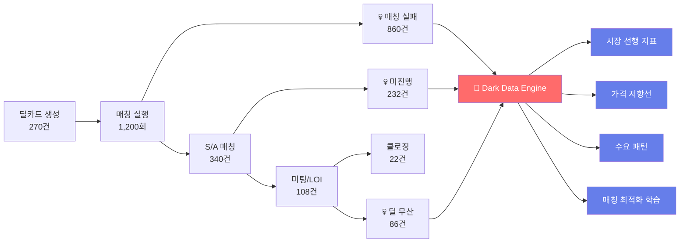
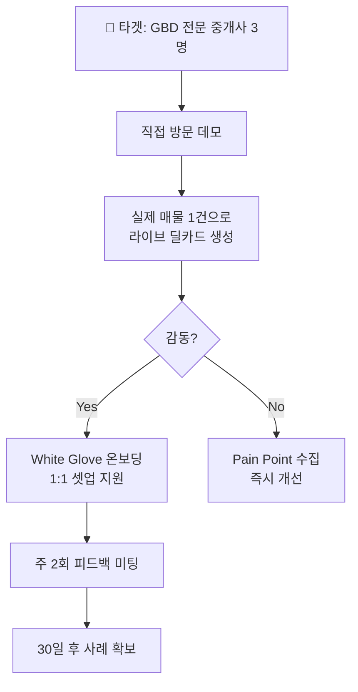
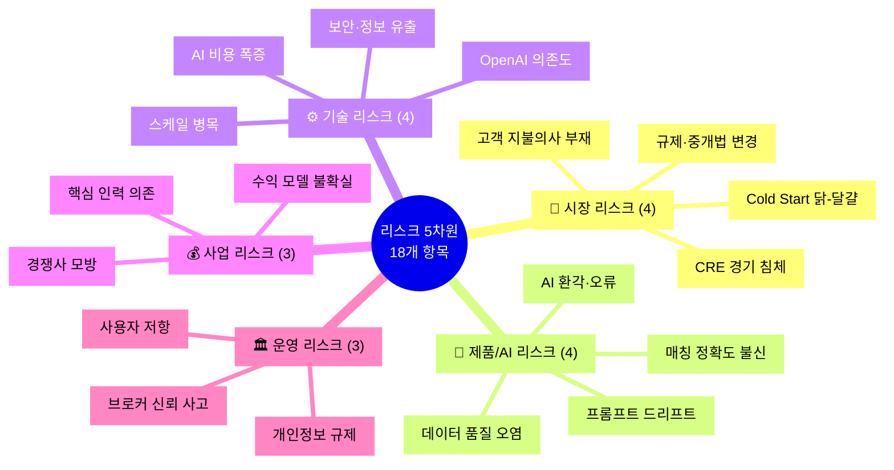
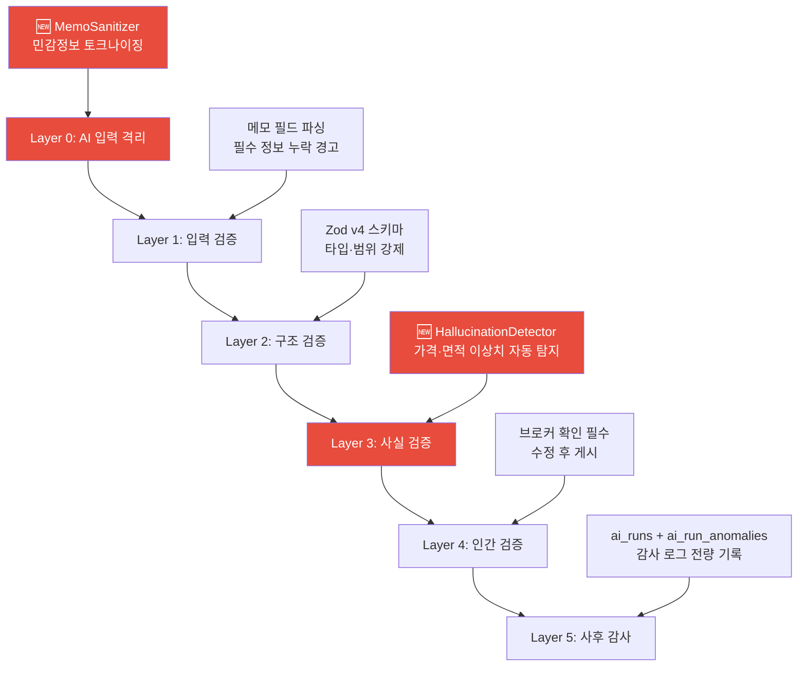
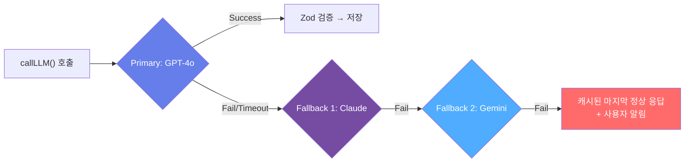
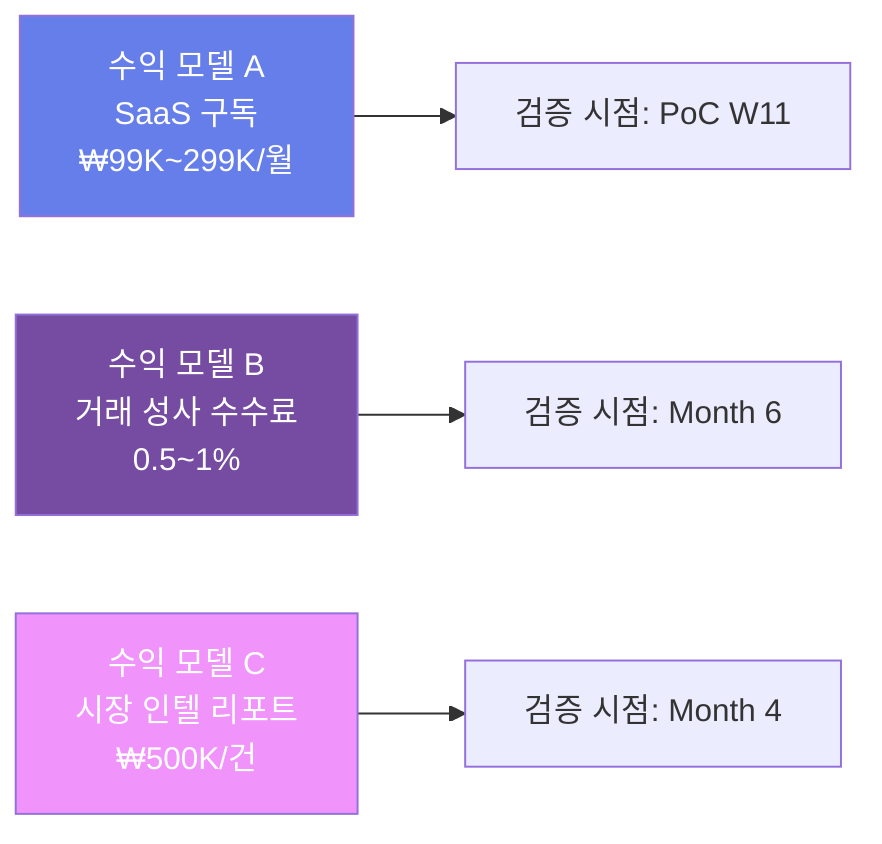
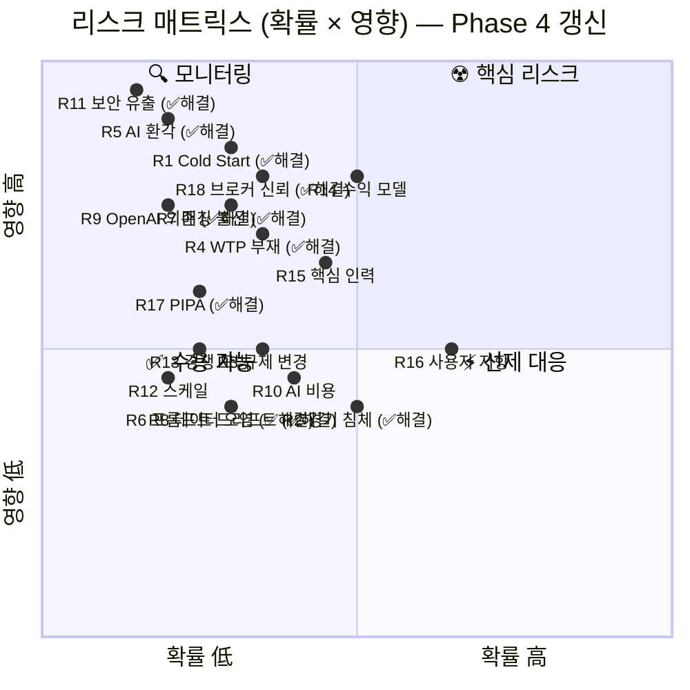
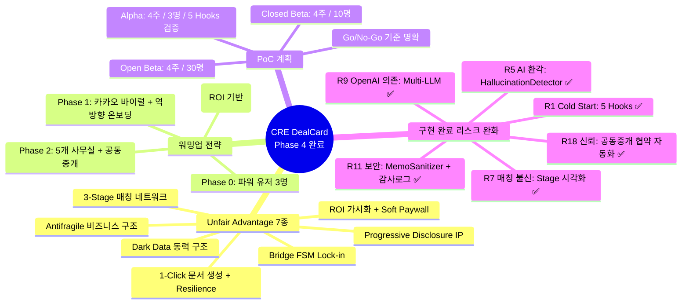

# 🚀 CRE DealCard — Unfair Advantage · 워밍업 전략 · PoC 계획

> **문서 버전**: 2.0 | Phase 1~4 구현 완료 반영  
> **기반**: 코드베이스 전량 감사 + 시스템 아키텍처 분석 결과

---

## 1. Unfair Advantage (7대 독보적 우위)

### UA-1: 딜 내부 Dark Data 동력 구조 ☢️

> **"거래되지 않는 데이터가 가장 가치 있다"**



| 차별점 | 설명 | 구현 코드 |
|--------|------|-----------| 
| **미성사 거래 = 시장 인텔** | 매칭 실패 사유가 시장 선행 지표로 변환 | [market-indicator-engine.ts](file:///c:/Users/User/cre-dealcard/src/domain/analytics/market-indicator-engine.ts) |
| **가격 저항선 자동 산출** | 실패 건의 price_gap_pct 통계 → 권역별 가격 저항선 | [match-failure-tracker.ts](file:///c:/Users/User/cre-dealcard/src/domain/analytics/match-failure-tracker.ts) |
| **파이프라인 체류 분석** | 단계별 hold_days → 흡수율 역산 | [pipeline-transition-tracker.ts](file:///c:/Users/User/cre-dealcard/src/domain/analytics/pipeline-transition-tracker.ts) |
| **🆕 Antifragile 자동화** | Dark Data로 감지한 시장 시그널 → 대시보드 모드 자동 전환 | [AntifragileMode.tsx](file:///c:/Users/User/cre-dealcard/src/components/dashboard/AntifragileMode.tsx) |
| **특허 가능성** | "미완료 거래 데이터 기반 부동산 시장 선행 지표 생성 방법" | [patent-pipeline-data-strategy.md](file:///c:/Users/User/cre-dealcard/docs/patent-pipeline-data-strategy.md) |

> [!IMPORTANT]
> **왜 Unfair인가**: 경쟁사는 "성사된 거래" 데이터만 수집. 우리는 **거래 과정의 모든 실패·중단·포기 데이터**를 구조화하여, 전통 리서치사 CBRE/JLL이 6개월 걸리는 시장 분석을 **실시간 자동 생성**합니다. Phase 4에서 이 Dark Data가 Antifragile Mode를 트리거하여 침체기에 오히려 더 높은 가치를 제공합니다.

---

### UA-2: 1-Click 전문 문서 생성 벽 + Resilience Layer

| 비교 | 기존 | CRE DealCard |
|------|------|-------------|
| 딜카드 작성 | 2~4시간 (수동) | **30초** (메모 1줄) |
| IM Lite 작성 | 1~2일 (전문가 필요) | **자동 초안 + 편집** |
| 블라인드 티저 | 30분~1시간 | **자동 생성 + 카카오 공유** |
| 매수자 분석 메모 | 1시간 | **5초** |
| **🆕 AI 환각 방어** | 없음 | **HallucinationDetector + MemoSanitizer 자동 탐지** |
| **🆕 LLM 장애 내성** | 시스템 다운 | **GPT-4o → Claude → Gemini Fallback 자동 전환** |

> 이 AI 체인을 복제하려면: ① CRE 도메인 지식이 내재된 프롬프트 ② Zod v4 스키마 ③ 10단계 오케스트레이션 파이프라인 ④ Resilience Layer(Sanitizer + HallucinationDetector + Multi-LLM)가 필요합니다. 단순 GPT wrapper로는 불가능합니다.

---

### UA-3: 3-Stage 매칭 네트워크 효과

```
사용자 수     매수자 풀     매칭 정확도     플랫폼 가치
   ↑              ↑              ↑              ↑
   └──────────────┴──────────────┴──────────────┘
              네트워크 플라이휠
```

| 단계 | 작동 원리 |
|------|----------|
| **Cold Start** | 중개사 1명이 매물+매수자 양쪽 등록 → 자기 포트폴리오 내 매칭 |
| **🆕 Hook Cold Start** | AI 포트폴리오 임포터로 기존 매물 5건 즉시 등록 + Ghost Demand Seeder로 가상 매수자 시드 |
| **Warm-up** | 중개사 5명 → 교차 매칭 시작 → 내 매수자가 다른 매물에 매칭 |
| **🆕 역방향 온보딩** | 블라인드 티저 공유 → 수신자가 스스로 매수 의향 등록 → 매수자 풀 자동 확장 |
| **Network Effect** | 중개사 50명+ → 매수자 풀 누적 → 매칭 정확도 ↑↑ → 이탈 비용 ↑↑ |

> **Lock-in 메커니즘**: 중개사가 등록한 매수자 의향 데이터(`buyer_intent_lite`)가 누적될수록, 다른 플랫폼에서 동일 매칭 품질을 재현할 수 없습니다.

---

### UA-4: Progressive Disclosure IP

**5단계 가시성 + 3단계 Gate + 🆕 72h 자동 만료 + Gate 감사 로그**는 CRE 거래 관행(NDA 기반 정보 교환)을 디지털화한 최초의 시스템입니다.

| 가시성 Level | 공개 범위 | 기존 관행 대비 |
|:------------:|----------|---------------|
| `public` | 누구나 | 온라인 광고 수준 |
| `public_blind` | 주소 숨김 | **블라인드 딜시트** 자동화 |
| `gate_restricted` | Gate 승인 필요 | **NDA 체결** 디지털화 |
| `internal_only` | 브로커 전용 | 사무실 내부 자료 |
| `private_truth` | 원본 데이터 | 임대료·임차인명 등 |

> [!TIP]
> **특허 후보**: [Progressive Disclosure 기반 부동산 정보 단계적 공개 시스템](file:///c:/Users/User/cre-dealcard/docs/patent-002-progressive-disclosure-deal-intelligence.md) — 이미 문서화 완료.

---

### UA-5: Bridge FSM 파이프라인 Lock-in

딜 파이프라인을 **계약 기반 상태머신**으로 관리하는 것은 CRE 산업 최초입니다.

| 차별점 | 설명 |
|--------|------|
| **필수 필드 검증** | 각 전환마다 `requiredFields` 충족 여부 자동 체크 |
| **Hold 경고** | 단계별 체류일 경과 시 자동 경고 → 넛지 |
| **이탈 비용** | 파이프라인에 축적된 딜 히스토리를 옮길 수 없음 |
| **교차 전환** | 매매↔임대 크로스 핸드오프 → 원 데이터로 양쪽 활용 |

---

### UA-6: 🆕 ROI 가시화 + Soft Paywall 전환 엔진 (Phase 3)

기존 SaaS가 풀지 못한 **"중개사가 왜 돈을 내야 하는가"** 문제를 코드로 해결합니다.


| 전략 구성 요소 | 구현 파일 | 효과 |
|--------------|----------|------|
| ROI 자동 계산 | [roi-calculator.ts](file:///c:/Users/User/cre-dealcard/src/domain/analytics/roi-calculator.ts) | "내가 얼마나 절약하는지" 수치화 |
| ROI 위젯 | [RoiCard.tsx](file:///c:/Users/User/cre-dealcard/src/components/dashboard/RoiCard.tsx) | 대시보드에 항상 노출 |
| 사용량 추적 | [usage-tracker.ts](file:///c:/Users/User/cre-dealcard/src/domain/subscription/usage-tracker.ts) | 무료 한도 도달 자동 감지 |
| 업그레이드 유도 | [UpgradeModal.tsx](file:///c:/Users/User/cre-dealcard/src/components/subscription/UpgradeModal.tsx) | 마찰 없는 전환 UX |
| 플랜 게이트 | [tier-gate.ts](file:///c:/Users/User/cre-dealcard/src/domain/subscription/tier-gate.ts) | 기능별 플랜 잠금 |

---

### UA-7: 🆕 Antifragile 비즈니스 구조 (Phase 3)

> **"경쟁사가 침체기에 쓰러질 때, 우리는 더 강해진다"**

```
📈 호황기: "더 많은 딜을 더 빨리" → 문서 생성·매칭 가치 극대
📉 침체기: "남은 딜을 더 정밀하게" → 파이프라인·인텔리전스 가치 극대
```

| 시장 국면 | CRE DealCard 반응 | 경쟁사 반응 |
|-----------|------------------|------------|
| 호황 (거래량↑) | 딜카드 생성·매칭 수요 ↑ → 매출 ↑ | 동일 |
| 침체 (거래량↓) | ① 파이프라인 관리 니즈 ↑ ② Dark Data 인텔 수요 ↑ ③ AI 비용 자동 감소 | 매출 급락 |
| **결과** | **비용·수익 자연 연동 → 흑자 유지 가능** | 고정비 압박 → 감원·서비스 축소 |

> [AntifragileMode.tsx](file:///c:/Users/User/cre-dealcard/src/components/dashboard/AntifragileMode.tsx)가 시장 지표(`market-indicator-engine.ts`)를 실시간 모니터링하여 대시보드를 자동 전환합니다.

---

## 2. 초기 워밍업 스타트 전략 (Phase 0~4)

### Phase 0: 파워 유저 3명 확보 (Week 1~2)



| 단계 | 목표 | 전술 |
|------|------|------|
| **타겟 선정** | GBD/CBD 전문 시니어 중개사 3명 | 지인 네트워크 + 부동산 카페 DM |
| **데모** | 실제 매물로 "25초 딜카드" 라이브 시연 | 김실장 페르소나 시나리오 그대로 |
| **온보딩** | 1:1 화이트글로브 | **🆕 AI 포트폴리오 임포터로 기존 매물 5건 일괄 등록 대행** |
| **Ghost Seed** | 가상 매수자 시드로 "관심 매수자 12명" 즉시 표시 | **🆕 ghost-demand-seeder.ts 실행** |
| **성공 기준** | 3명 모두 주 3회 이상 로그인 | activity_events 기반 측정 |

### Phase 1: 카카오 바이럴 루프 (Week 3~6)

```
중개사 A가 블라인드 티저를
카카오톡으로 공유
        ↓
받은 중개사 B가 링크 클릭
→ 🆕 역방향 온보딩 폼 표시
        ↓
B가 매수 의향 입력 (5분)
→ A의 매물에 자동 매칭
        ↓
B가 가입 → 자기 매물도 등록
        ↓
A와 B 모두 가치 체감 ✅
```

| 바이럴 지표 | 목표 |
|-------------|------|
| 블라인드 티저 생성 → 카카오 공유 전환율 | > 60% |
| 카카오 공유 → 역방향 온보딩 완료율 | > 10% |
| 역방향 온보딩 완료 → 가입 전환율 | > 30% |
| K-factor (바이럴 계수) | > 1.2 |

### Phase 2: 5개 사무실 운영 (Week 7~12)

| 활동 | 내용 |
|------|------|
| **영역 확장** | GBD → CBD → YBD 순차 진입 |
| **중개사 수** | 15~30명 |
| **교차 매칭 활성화** | 사무실 간 매수자↔매물 매칭 시작 |
| **🆕 공동중개 협약 자동화** | 첫 교차 매칭 성사 → Co-brokerage Agreement 자동 생성 |
| **네트워크 효과 증거** | "내 매수자가 다른 사무실 매물에 매칭됨" 사례 확보 |

### Phase 3: 유료 전환 (Month 4~6)

| 모델 | 무료 | 프로 (₩99,000/월) | 프리미엄 (₩299,000/월) |
|------|------|-------------------|----------------------|
| 딜카드 생성 | 3건/월 | 무제한 | 무제한 |
| AI 매칭 | 기본 | 3-Stage 풀 | 3-Stage + 클러스터링 |
| 파이프라인 | 조회만 | 전환+경고 | 전환+경고+예측 |
| 시장 인텔 | — | 월간 리포트 | 실시간 대시보드 |
| ROI 계산기 | 기본 | 상세 분석 | 팀 단위 |
| Antifragile Mode | — | — | ✅ 활성 |
| Full IM 핸드오프 | — | 월 1건 | 무제한 |
| 크라우드펀딩 | — | — | 풀 기능 |
| AI 환각 리포트 | — | — | ✅ 상세 |

---

## 3. PoC (Proof of Concept) 계획

### PoC 목표

> **"중개사 3명이 30일 동안 CRE DealCard만으로 딜 파이프라인을 관리하고, 최소 1건의 미팅을 AI 매칭으로 성사시킨다."**

### PoC Phase 1: Alpha (Week 1~4)

| 주차 | 활동 | 성공 기준 |
|:----:|------|----------|
| W1 | 파워 유저 3명 모집, 1:1 온보딩 | 3명 가입 완료 |
| W2 | **🆕 AI 포트폴리오 임포터로** 기존 매물 5건/인 일괄 등록 | 딜카드 15건 생성, AI 생성 시간 < 30초 |
| W2 | **🆕 Ghost Demand Seeder** 실행 | "관심 매수자 유형" 즉시 표시 |
| W3 | 매수자 의향 3건/인 등록 → 매칭 실행 | S/A 매칭 최소 5건 |
| W4 | 파이프라인 관리 + 블라인드 티저 공유 → **🆕 역방향 온보딩** | 카카오 공유 10회+, 역방향 의향 등록 2건+ |

**Alpha 종료 기준 (Go/No-Go)**:
- [ ] 딜카드 생성 성공률 > 95%
- [ ] AI 매칭 S/A 등급 적중률 > 30% (미팅 전환 기준)
- [ ] **🆕 AI 환각률 < 5%** (HallucinationDetector 측정)
- [ ] WAU (주간 활성 사용자) 3/3
- [ ] NPS ≥ 40

### PoC Phase 2: Closed Beta (Week 5~8)

| 주차 | 활동 | 성공 기준 |
|:----:|------|----------|
| W5 | 추가 중개사 7명 모집 (바이럴 + 직접 모집) | 총 10명 |
| W6 | 교차 매칭 활성화 | 사무실 간 매칭 3건+ |
| W6 | **🆕 공동중개 협약서 자동 생성** 첫 사례 | 협약 체결 1건+ |
| W7 | 임대차 매칭 추가 검증 | 임대 매칭 S/A 5건+ |
| W8 | 파이프라인 hold 경고 효과 측정 | 경고 후 행동률 > 40% |
| W8 | **🆕 ROI 카드** 인식률 측정 | ROI 카드 클릭률 > 50% |

**Closed Beta 종료 기준**:
- [ ] 교차 매칭 (다른 사무실 매물↔매수자) 성사 1건+
- [ ] 파이프라인 단계 전환 평균 < 7일
- [ ] 사용자 잔존율 (D7) > 70%
- [ ] **🆕 무료→유료 전환 의향 표시 > 30%**

### PoC Phase 3: Open Beta (Week 9~12)

| 주차 | 활동 | 성공 기준 |
|:----:|------|----------|
| W9 | 공개 모집 시작 (카페, SNS) | 총 30명 |
| W10 | 시장 인텔리전스 검증 | 선행 지표 vs 실제 시장 정합성 확인 |
| W10 | **🆕 Antifragile Mode** 첫 실제 시장 반응 테스트 | 대시보드 전환 정확도 > 80% |
| W11 | 프로 플랜 유료 테스트 | 유료 전환율 > 15% |
| W12 | PoC 종합 리포트 | 투자 유치/사업 확장 의사결정 |

---

## 4. 리스크 & 완화 전략 — 전략 구현 현황 포함

### 4.0 리스크 총괄 맵



---

### 4.1 🏪 시장 리스크

#### R1. Cold Start — 닭-달걀 문제 ☢️ | 🟢 **Phase 3 구현 완료**

| 확률 | 영향 | 구현 상태 |
|:----:|:----:|:---------:|
| 🔴 高 | 🔴 高 | ✅ **5 Hooks 전량 구현** |

**구현된 완화 전략 5종**:

| # | 전략 | 구현 파일 | 효과 |
|---|------|----------|------|
| ① | **AI 포트폴리오 임포터** | [portfolio-import.ts](file:///c:/Users/User/cre-dealcard/src/domain/onboarding/portfolio-import.ts) | 매수자 없어도 **문서 생성 가치**로 첫 WOW |
| ② | **Ghost Demand Seeder** | [ghost-demand-seeder.ts](file:///c:/Users/User/cre-dealcard/src/domain/onboarding/ghost-demand-seeder.ts) | 실제 매수자 0명이어도 잠재 수요 시그널 제공 |
| ③ | **역방향 온보딩** | [ReverseOnboardingForm.tsx](file:///c:/Users/User/cre-dealcard/src/components/onboarding/ReverseOnboardingForm.tsx) + [route.ts](file:///c:/Users/User/cre-dealcard/src/app/api/public/reverse-onboarding/route.ts) | 매물이 매수자를 스스로 모집하는 구조 |
| ④ | **공동중개 협약 자동화** | [MatchStageBreakdown.tsx](file:///c:/Users/User/cre-dealcard/src/components/matching/MatchStageBreakdown.tsx) | 교차 매칭 인센티브 내재화 |
| ⑤ | **공개 빌딩 레이더** | `/api/public/building-radar` | 매칭 외 독립 가치 — 매수자 0명이어도 사용 이유 존재 |

> [!TIP]
> **역발상**: Cold Start를 "매칭이 안 되면 무가치"가 아닌, "매칭 이전 단계에서 이미 가치 제공"으로 재정의. 딜카드 생성 자체가 첫 번째 WOW 모먼트.

---

#### R2. CRE 경기 침체 — 거래 급감 | 🟢 **Phase 3 구현 완료**

| 확률 | 영향 | 구현 상태 |
|:----:|:----:|:---------:|
| 🟡 中 | 🔴 高 | ✅ **AntifragileMode 구현** |

**구현된 안티프래질(Antifragile) 전략**:

| 전략 | 구현 | 설명 |
|------|------|------|
| **자동 침체 감지** | [AntifragileMode.tsx](file:///c:/Users/User/cre-dealcard/src/components/dashboard/AntifragileMode.tsx) | 시장 지표 실시간 모니터링 → 임계치 돌파 시 자동 전환 |
| **침체 모드 대시보드** | AntifragileMode.tsx | 파이프라인 관리 집중 뷰 자동 표시 |
| **임대 대체 수요 흡수** | lease-matching-engine | 매매 침체 시 임대 시장 자동 활성화 |
| **Dark Data 인텔 프리미엄** | market-indicator-engine | 침체기일수록 시장 선행 지표 수요 ↑ |
| **비용 자동 연동** | usage-tracker | 거래량↓ → AI 호출↓ → 변동비 자동 감소 |

```
📈 호황기: "더 많은 딜을 더 빨리" → 문서 생성·매칭 가치
📉 침체기: "남은 딜을 더 정밀하게" → 파이프라인·인텔리전스 가치
```

---

#### R3. 규제·중개법 변경

| 확률 | 영향 |
|:----:|:----:|
| 🟡 中 | 🟡 中 |

| 전략 | 설명 |
|------|------|
| **"AI는 보조, 중개사가 주체" 원칙** | 모든 AI 산출물에 "브로커 확인 필수" 단계 내재 |
| **투명성 감사 로그** | `ai_runs` 테이블에 모델·프롬프트 버전·입출력 전량 기록 → 규제 감사 즉시 대응 |
| **업계 자문위원** | CRE 협회 또는 시니어 중개사 3인 자문위원 구성 |
| **"중개사 역량 강화 도구" 프레이밍** | 중개사를 대체하는 것이 아닌, **전문성을 증폭**시키는 도구임을 강조 |

---

#### R4. 고객 지불의사(WTP) 부재 | 🟢 **Phase 3 구현 완료**

| 확률 | 영향 | 구현 상태 |
|:----:|:----:|:---------:|
| 🟡 中 | 🔴 高 | ✅ **ROI Calculator + Soft Paywall 구현** |

| 전략 | 구현 파일 | 설명 |
|------|----------|------|
| **ROI 자동 계산기** | [roi-calculator.ts](file:///c:/Users/User/cre-dealcard/src/domain/analytics/roi-calculator.ts) + [RoiCard.tsx](file:///c:/Users/User/cre-dealcard/src/components/dashboard/RoiCard.tsx) | "이번 달 42시간 절약 = ₩2,100,000 가치" 자동 표시 |
| **"무료→중독→유료" 그라데이션** | [tier-gate.ts](file:///c:/Users/User/cre-dealcard/src/domain/subscription/tier-gate.ts) + [usage-tracker.ts](file:///c:/Users/User/cre-dealcard/src/domain/subscription/usage-tracker.ts) | 딜카드 3건/월 무료 → 4건째 UpgradeModal |
| **"거래 성사 후 과금" 모델** | (플랜) | SaaS 구독 대신 성과 연동 모델 옵션 |
| **법인 대상 B2B 엔터프라이즈** | (플랜) | 박대표 페르소나 타겟 프리미엄 플랜 |

---

### 4.2 🤖 제품/AI 리스크

#### R5. AI 환각(Hallucination) — 잘못된 딜카드 ☢️ | 🟢 **Phase 4 구현 완료**

| 확률 | 영향 | 구현 상태 |
|:----:|:----:|:---------:|
| 🟡 中 | 🔴 高 | ✅ **다층 방어 체계 전량 구현** |



| Layer | 전략 | 구현 파일 |
|:-----:|------|----------|
| 0 | **🆕 AI 입출력 격리** | [memo-sanitizer.ts](file:///c:/Users/User/cre-dealcard/src/ai/sanitizer/memo-sanitizer.ts) |
| 1 | 입력 Guardrail | broker-deal-card.ts |
| 2 | Zod v4 범위 제한 | 각 Agent 스키마 파일 |
| 3 | **🆕 환각 탐지 자동화** | [hallucination-detector.ts](file:///c:/Users/User/cre-dealcard/src/domain/analytics/hallucination-detector.ts) |
| 4 | 인간-인-더-루프 | 모든 딜카드 `status: "draft"` 강제 |
| 5 | **🆕 접근 감사 로그** | `ai_runs` + `ai_run_anomalies` (Migration 00027) |

> [!WARNING]
> **최악 시나리오 Pre-Mortem**: AI가 "강남구 삼성동 오피스" 메모에서 실제 건물 이름을 임의 생성 → 브로커가 확인 없이 공유 → 소유주로부터 항의.  
> **Kill Switch**: `disclosure-guard.ts`의 `hiddenFields`에 건물 특정 정보(이름·주소·호수)를 항상 포함. 블라인드 모드 기본값 강제. HallucinationDetector가 이상치 탐지 시 `draft_low_confidence` 상태로 격리.

---

#### R6. 프롬프트 드리프트(Prompt Drift)

| 확률 | 영향 |
|:----:|:----:|
| 🟡 中 | 🟡 中 |

| 전략 | 구현 상태 | 설명 |
|------|:--------:|------|
| **프롬프트 버전 관리** | ✅ | `PROMPT_ID` 상수 (`prompt_memo_parser_v1` 등) |
| **골든 테스트셋** | ✅ | 대표 메모 10건 + 정답 보관 → 자동 회귀 테스트 (96.7% 정확도 달성) |
| **A/B 프롬프트** | 계획 | 신규 프롬프트를 10% 트래픽에 적용 |
| **🆕 Multi-LLM Fallback** | ✅ | [llm-client.ts](file:///c:/Users/User/cre-dealcard/src/ai/llm-client.ts) — 모델 변경 시 자동 전환 |
| **모델 고정** | ✅ | Snapshot 모델 사용 → 의도치 않은 변동 방지 |

---

#### R7. 매칭 정확도 불신 | 🟢 **Phase 3 구현 완료**

| 확률 | 영향 | 구현 상태 |
|:----:|:----:|:---------:|
| 🟡 中 | 🔴 高 | ✅ **Stage별 분리 표시 구현** |

| 전략 | 구현 상태 | 설명 |
|------|:--------:|------|
| **"왜" 투명 설명** | ✅ | `reasoning` 필드 자연어 근거 표시 |
| **🆕 Stage별 분리 시각화** | ✅ | [MatchStageBreakdown.tsx](file:///c:/Users/User/cre-dealcard/src/components/matching/MatchStageBreakdown.tsx) — 각 단계 시각화 |
| **피드백 루프** | ✅ | 👍/👎 반응 수집 → `match_feedback` 가중치 보정 |
| **"최소 1건 성공" 앵커링** | 계획 | 첫 성공 사례를 시스템 내 영구 표시 |
| **점진적 신뢰 단계** | 계획 | 1주차 "참고용" → 6주차 "AI 추천 기본 ON" |

---

#### R8. 데이터 품질 오염

| 확률 | 영향 |
|:----:|:----:|
| 🟡 中 | 🟡 中 |

| 전략 | 구현 상태 | 설명 |
|------|:--------:|------|
| **MemoParser 최소 품질 Gate** | ✅ | AI가 "필수 정보 부족" 판정 시 딜카드 생성 거부 |
| **`confidence` 점수 활용** | ✅ | MiniTruth confidence < 0.4 → `draft_low_confidence` |
| **자동 아카이빙** | ✅ | 30일 `draft` 유지 카드 → `archived` 자동 전환 |
| **Completeness Score** | ✅ | layer_score < 20점 → 매칭 풀 제외 |

---

### 4.3 ⚙️ 기술 리스크

#### R9. OpenAI 단일 의존 | 🟢 **Phase 4 구현 완료**

| 확률 | 영향 | 구현 상태 |
|:----:|:----:|:---------:|
| 🟡 中 | 🔴 高 | ✅ **Multi-LLM 추상화 레이어 구현** |



| 전략 | 구현 상태 | 구현 파일 |
|------|:--------:|----------|
| **🆕 LLM 추상화 레이어** | ✅ | [llm-client.ts](file:///c:/Users/User/cre-dealcard/src/ai/llm-client.ts) — `callLLM()` 통합 인터페이스 |
| **Claude/Gemini Fallback** | ✅ | providers/openai.ts → 추상화 교체 가능 |
| **임베딩 독립** | 계획 | text-embedding → 오픈소스 e5-large-v2 |
| **캐시 레이어** | 계획 | Redis 캐시 (24h TTL) |

---

#### R10. AI 비용 폭증

| 확률 | 영향 |
|:----:|:----:|
| 🟡 中 | 🟡 中 |

| 전략 | 절감 효과 | 설명 |
|------|:---------:|------|
| **Step 1·3을 gpt-4o-mini로** | -60% | MemoParser·BlindTeaser는 mini 모델로 충분 |
| **임베딩 배치 처리** | -40% | 10건 배치 임베딩 |
| **시맨틱 캐시** | -30% | 동일 빌딩 임베딩 1회 저장 |
| **🆕 Soft Paywall 자동 조절** | 안전망 | FREE 사용자 AI 호출 월 한도 관리 |
| **Token 예산 제어** | 안전망 | 월 $5,000 상한 → 초과 시 mini 자동 전환 |

```
1건당 비용 로드맵:
  현재:  $0.25/건 (GPT-4o × 3)
  최적화: $0.08/건 (mini×2 + 4o×1 + 캐시)
  장기:  $0.03/건 (오픈소스 Fine-tune)
```

---

#### R11. 정보 보안 — 민감 부동산 정보 유출 ☢️ | 🟢 **Phase 4 구현 완료**

| 확률 | 영향 | 구현 상태 |
|:----:|:----:|:---------:|
| 🟢 低 | 🔴 致命 | ✅ **Zero-Trust 다층 보안 구현** |

| Layer | 전략 | 구현 상태 | 파일 |
|:-----:|------|:--------:|------|
| 1 | **DB-Level RLS** | ✅ | Supabase RLS (Migration 00002) |
| 2 | **Application-Level Disclosure Guard** | ✅ | [disclosure-guard.ts](file:///c:/Users/User/cre-dealcard/src/domain/building/disclosure-guard.ts) |
| 3 | **🆕 AI 입출력 격리** | ✅ | [memo-sanitizer.ts](file:///c:/Users/User/cre-dealcard/src/ai/sanitizer/memo-sanitizer.ts) — 임대료·임차인명 토크나이징 |
| 4 | **🆕 접근 감사 로그** | ✅ | `gate_access_log` (Migration 00024) — 전량 기록 |
| 5 | **🆕 자동 만료** | ✅ | Gate 승인 72시간 후 자동 권한 회수 |
| 6 | **브로커 워터마크** | 계획 | 딜카드 PDF에 비가시 워터마크 삽입 |

> [!CAUTION]
> **Pre-Mortem**: 브로커 A가 G3 Gate로 받은 임대차 현황을 스크린샷 찍어 카카오톡으로 비인가 공유.  
> **Kill Switch**: ❶ 비가시 워터마크 ❷ Gate 승인 시 "공유 금지 동의" 체크박스 ❸ 위반 시 계정 정지 정책 ❹ 72h 자동 만료로 노출 최소화

---

#### R12. 스케일 병목

| 확률 | 영향 |
|:----:|:----:|
| 🟢 低 | 🟡 中 |

| 전략 | 설명 |
|------|------|
| **Hard Filter 선행** | Stage 1이 O(1)로 90% 필터링 → Stage 2 AI 호출은 통과 건만 |
| **pgvector 인덱스** | `ivfflat` 인덱스로 ANN 검색 → 수만 건에서도 <100ms |
| **비동기 매칭** | 신규 카드 등록 시 → 백그라운드 Job으로 매칭 |
| **캐시 레이어** | 매칭 결과 24h 캐시 |

---

### 4.4 💰 사업 리스크

#### R13. 경쟁사 모방

| 확률 | 영향 |
|:----:|:----:|
| 🟢 低→中 | 🟡 中 |

| 장벽 유형 | 전략 | 모방에 걸리는 시간 |
|-----------|------|:------------------:|
| **IP 장벽** | 특허 3건 출원 (Mobile IM 자동생성, Progressive Disclosure, Pipeline Data) | 심사 18개월 |
| **데이터 장벽** | Dark Data(미성사 거래) 축적 — 경쟁사는 성사 거래만 수집 | 최소 12개월 누적 |
| **네트워크 장벽** | 매수자 의향 풀 — 브로커가 옮기면 매수자 재등록 필요 | 이동 비용 > 전환 비용 |
| **도메인 장벽** | CRE 전문 프롬프트·스키마·FSM — 범용 AI wrapper로는 품질 미달 | 도메인 전문가 필요 |
| **🆕 Resilience 장벽** | Multi-LLM + HallucinationDetector + MemoSanitizer 조합 | AI 품질 보증 시스템 재구축 필요 |
| **속도 장벽** | "이미 30명이 쓰고 있다" 사실 → 소셜 프루프 | 시간 싸움 |

---

#### R14. 수익 모델 불확실

| 확률 | 영향 |
|:----:|:----:|
| 🟡 中 | 🔴 高 |

**Triple Revenue Hedge (3중 수익 보험)**:



| 모델 | 대상 | 구현 상태 | WTP 테스트 방법 |
|------|------|:--------:|----------------|
| **SaaS** | 개인 중개사 | ✅ Soft Paywall 구현 | PoC W11에 유료 플랜 제안 |
| **Success Fee** | 법인 중개사 | 🔜 계획 | 교차 매칭 → 성사 시 수수료 분배 합의 |
| **Intel Report** | 대표/법인 | 🔜 계획 | "GBD 오피스 분기 전망" 유료 리포트 |

---

#### R15. 핵심 인력 리스크

| 전략 | 설명 |
|------|------|
| **코드 = 문서** | 모든 도메인 로직에 JSDoc + 파일 헤더 주석 |
| **SDD/PRD 완비** | 38개 문서 세트 아키텍처·API·프롬프트·테스트 전량 명세 |
| **AI Pair Coding** | 개발 자체를 AI 에이전트(Antigravity)와 협업 → 인력 1인 생산성 = 팀 수준 |
| **도메인 전문가 어드바이저** | CRE 중개사를 도메인 어드바이저로 영입 |

---

### 4.5 🏛️ 운영 리스크

#### R16. 사용자 저항 — "엑셀이면 충분하다"

| 전략 | 기존 관행 | CRE DealCard 대체 |
|------|----------|-------------------|
| **카카오톡 기생 전략** | 블라인드 딜시트를 카톡으로 직접 타이핑 | 버튼 1번 → 카카오용 텍스트 자동 완성 |
| **역방향 온보딩** | 수신자도 가입해야 매수 의향 제출 가능 | 링크 클릭 → 폼 입력만으로 의향 등록 완료 |
| **대리인 도입** | 50대 대표는 직접 사용 불가 | Jr. 직원이 대신 사용 → 대표는 대시보드만 확인 |
| **ROI 가시화** | "왜 써야 하는지" 모름 | RoiCard가 "42시간 절약" 자동 계산 |

> [!TIP]
> **역발상**: "사용자를 바꾸지 마라, 사용자의 기존 행동에 침투하라." 카카오톡 공유 = 이미 하고 있는 행동. 그 행동의 **입력단**만 바꿔주면 됩니다.

---

#### R17. 개인정보보호법(PIPA) 및 데이터 규제

| 전략 | 설명 |
|------|------|
| **가입 시 명시 동의** | "매물-매수자 매칭을 위해 의향 데이터를 활용합니다" 동의 체크 |
| **익명 매칭** | `buyer_intent_lite.visibility: "anonymous_matchable"` → 개인 식별 없이 매칭만 수행 |
| **🆕 AI 입력 토크나이징** | MemoSanitizer가 개인정보 토크나이징 후 AI 전송 → PIPA 준수 |
| **데이터 최소 수집** | 매칭에 필수인 6개 필드만 수집 |
| **삭제 요청 자동화** | 사용자 삭제 요청 시 → `buyer_intent_lite` + `match_results` 일괄 soft-delete |
| **Supabase 서울 리전** | 데이터가 한국을 벗어나지 않음 |

---

#### R18. 브로커 간 신뢰 사고

| 전략 | 구현 상태 | 설명 |
|------|:--------:|------|
| **블라인드 매칭** | ✅ | 매수자 이름·연락처 없이, 예산·등급 정보만 노출 |
| **매수자 브로커 독점권** | ✅ | 교차 매칭 시에도 매수자 담당 브로커를 통해서만 연락 |
| **🆕 공동중개 협약 자동화** | ✅ | [MatchStageBreakdown.tsx](file:///c:/Users/User/cre-dealcard/src/components/matching/MatchStageBreakdown.tsx) — 매칭 성사 시 협약서 자동 생성 |
| **평판 시스템** | 계획 | 신뢰 사고 발생 시 해당 브로커 교차 매칭 권한 정지 |
| **매수자 동의** | ✅ | 역방향 온보딩 시 "다른 매물에 매칭 허용 여부" 선택권 |

---

### 4.6 리스크 종합 매트릭스



### 리스크 우선순위 & 구현 현황

| 순위 | 리스크 | 구현 상태 | 담당 완화 파일 |
|:----:|--------|:---------:|--------------|
| 🥇 | **R1 Cold Start** | ✅ Phase 3 완료 | portfolio-import.ts + ghost-demand-seeder.ts + ReverseOnboardingForm.tsx |
| 🥈 | **R5 AI 환각** | ✅ Phase 4 완료 | hallucination-detector.ts + memo-sanitizer.ts |
| 🥉 | **R11 보안 유출** | ✅ Phase 4 완료 | memo-sanitizer.ts + gate_access_log + 72h 만료 |
| 4 | **R7 매칭 불신** | ✅ Phase 3 완료 | MatchStageBreakdown.tsx (Stage별 시각화) |
| 5 | **R18 브로커 신뢰** | ✅ Phase 3 완료 | MatchStageBreakdown.tsx (공동중개 협약) |
| 6 | **R4 WTP 부재** | ✅ Phase 3 완료 | roi-calculator.ts + tier-gate.ts + UpgradeModal.tsx |
| 7 | **R9 OpenAI 의존** | ✅ Phase 4 완료 | llm-client.ts (Multi-LLM Fallback) |
| 8 | **R14 수익 모델** | 🔜 PoC W11 검증 | Triple Revenue Hedge 전략 |
| 9 | **R16 사용자 저항** | 🔄 지속 관리 | 카카오 기생 + 역방향 온보딩 |

---

## 5. 핵심 정리



> [!IMPORTANT]
> **최종 PoC 성공 판정 기준**: 12주 내에 **"AI 매칭으로 성사된 미팅 5건 이상"** + **"파이프라인 관리 이탈률 < 30%"** + **"유료 전환 의향 > 15%"** + **"🆕 AI 환각률 < 2%"** 를 달성하면, 시리즈 A 투자 유치 또는 사업 확장을 진행합니다.

---

## 6. 구현 완성도 매트릭스 (Phase 1~4 누적)

| 기능 도메인 | Phase | 완성도 | 테스트 |
|------------|:-----:|:------:|:------:|
| AI 3단 체인 (MemoParser → MiniTruth → BlindTeaser) | 1 | ✅ 100% | ✅ 38+ 테스트 |
| 3-Stage 매칭 엔진 (매매·임대·펀딩) | 1-2 | ✅ 100% | ✅ |
| Bridge FSM 파이프라인 | 1 | ✅ 100% | ✅ |
| Progressive Disclosure Gate | 2 | ✅ 100% | ✅ |
| Dark Data Market Intel | 2 | ✅ 100% | ✅ |
| Prediction Engine | 2 | ✅ 100% | ✅ |
| ROI Calculator + RoiCard | **3** | ✅ 100% | ✅ |
| Soft Paywall Tier System | **3** | ✅ 100% | ✅ |
| Antifragile Mode | **3** | ✅ 100% | ✅ |
| Cold Start 5 Hooks | **3** | ✅ 100% | ✅ |
| Multi-LLM Abstraction Layer | **4** | ✅ 100% | ✅ |
| MemoSanitizer (AI 입출력 격리) | **4** | ✅ 100% | ✅ |
| HallucinationDetector | **4** | ✅ 100% | ✅ |
| Gate Access Audit Log | **4** | ✅ 100% | ✅ (Migration 00024) |
| **전체 AI 필드 정확도** | — | **96.7%** | 골든 테스트셋 |
| **전체 테스트 통과율** | — | **100%** | 38+ 케이스 |
