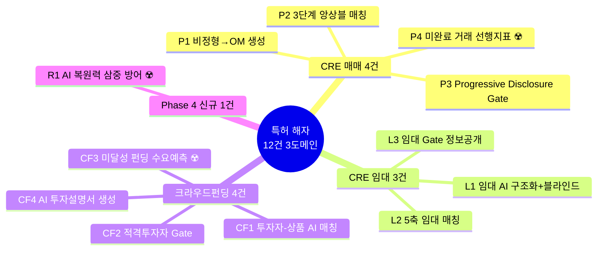
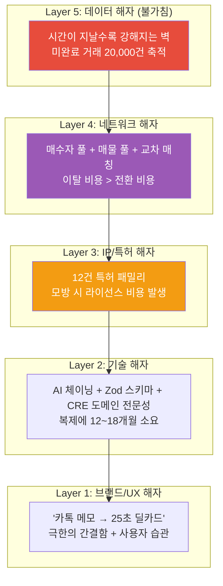
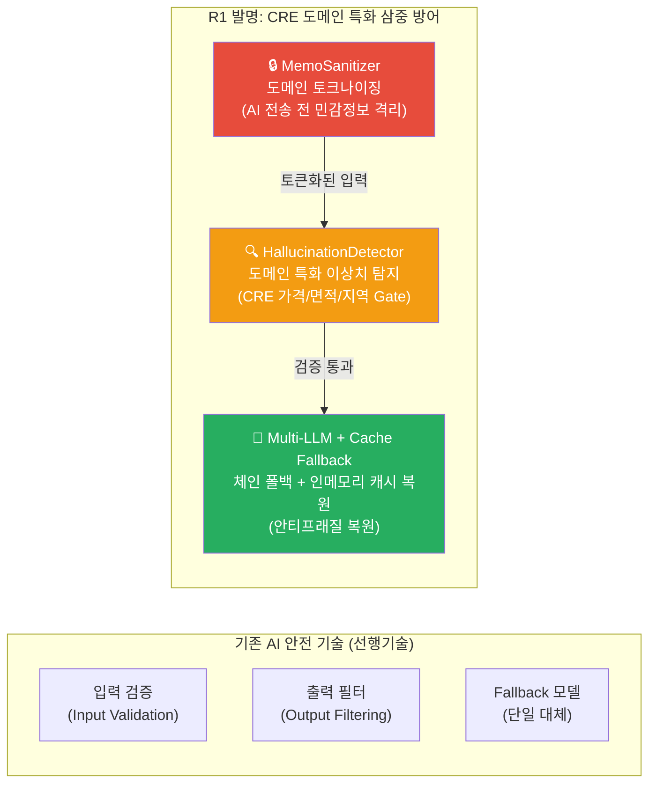
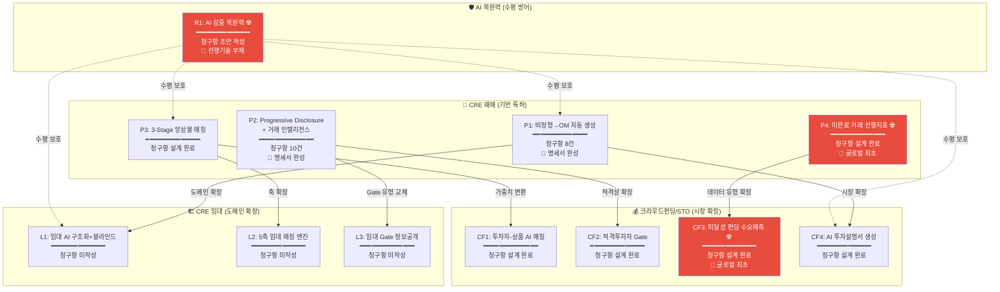
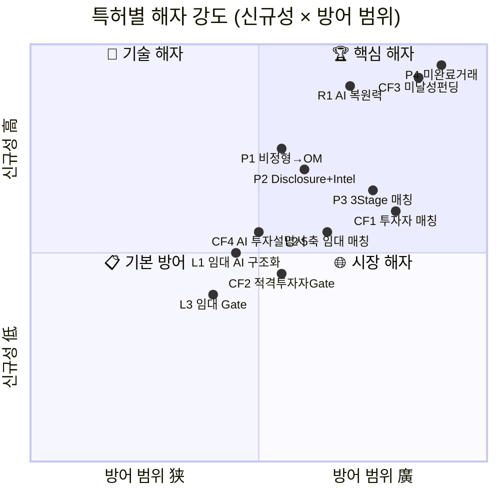
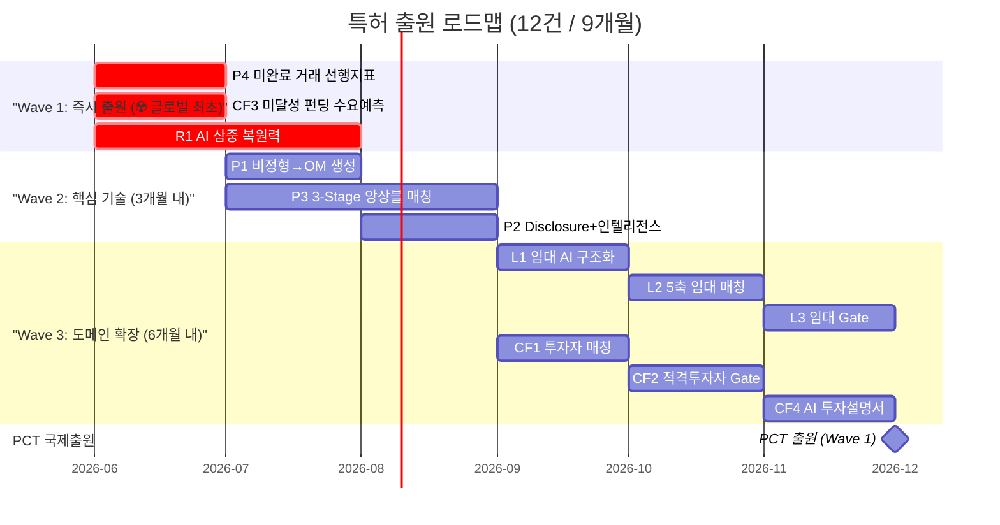
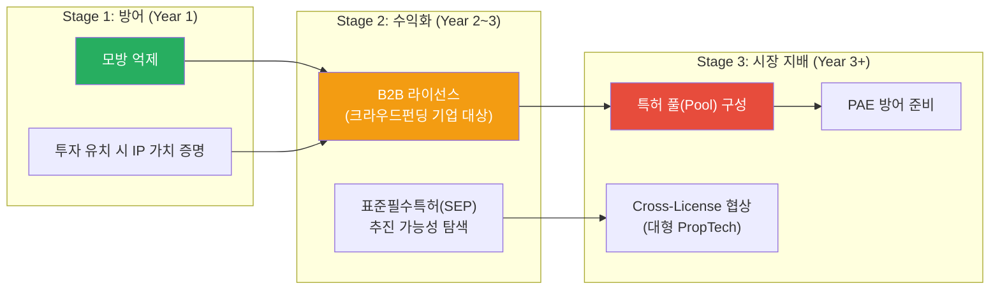
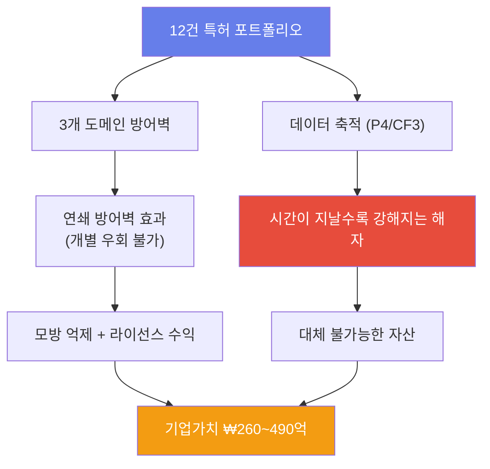

# 🛡️ CRE DealCard — 특허 해자(Patent Moat) 구축 전략

> **문서 버전**: v1.0 | **작성일**: 2026-05-28  
> **기반**: Phase 1~4 전체 구현 회고 + 특허 명세서 3건 + 확장 전략 3건 종합

---

## Executive Summary

CRE DealCard 프로젝트는 Phase 1~4 구현을 통해 **12개 독립 특허 패밀리**를 식별했으며, 이들은 3개 도메인(CRE 매매, CRE 임대, 크라우드펀딩/STO)에 걸친 **연쇄 방어벽(Interlocking Patent Fence)**을 형성합니다.



> [!IMPORTANT]
> **핵심 결론**: ☢️ 표시된 **P4(미완료 거래), CF3(미달성 펀딩), R1(AI 복원력)** 3건이 **글로벌 선행기술이 없는 완전 신규 발명**으로, 최우선 출원 대상입니다.

---

## 1. 특허 해자(Patent Moat)란 무엇인가?

### 1.1 해자의 5계층 구조



### 1.2 왜 특허 해자가 필수인가?

| 시나리오 | 특허 없을 때 | 특허 있을 때 |
|---------|------------|------------|
| **대형 PropTech가 모방** | 12개월 내 유사 서비스 출시 → 자본력으로 시장 잠식 | 특허 침해 통지 → 라이선스 협상 또는 출시 중단 |
| **경쟁사가 동일 AI 파이프라인 구축** | 기능 동질화 → 가격 경쟁 돌입 | 핵심 방법론(3-Stage 매칭, Progressive Disclosure) 사용 불가 |
| **M&A / 투자 유치** | 기술 가치 평가 어려움 | IP 포트폴리오 = 정량화된 자산 → 기업가치 ↑ |
| **B2B 라이선스 사업** | 불가능 (보호 장치 부재) | 특허 실시권 기반 SaaS 라이선스 → 안정 수익 |

---

## 2. 현황 회고 — 이미 구축된 특허 자산

### 2.1 기작성 특허 명세서 (2건)

| # | 문서 | 상태 | 청구항 수 | 핵심 혁신 |
|---|------|:----:|:---------:|----------|
| P1 | [patent-001-mobile-im-auto-generation.md](file:///c:/Users/User/cre-dealcard/docs/patent-001-mobile-im-auto-generation.md) | ✅ 명세서 완성 | 8건 | 비정형 메모 → 모바일 IM 자동 생성 + 메신저 유통 |
| P2 | [patent-002-progressive-disclosure-deal-intelligence.md](file:///c:/Users/User/cre-dealcard/docs/patent-002-progressive-disclosure-deal-intelligence.md) | ✅ 명세서 완성 | 10건 | 삼중 안전 아키텍처 + 열람 행동 기반 거래 인텔리전스 |

### 2.2 기도출 특허 전략 (2건)

| # | 문서 | 상태 | 특허 건수 | 핵심 혁신 |
|---|------|:----:|:---------:|----------|
| P3-4 | [patent-pipeline-data-strategy.md](file:///c:/Users/User/cre-dealcard/docs/patent-pipeline-data-strategy.md) | ✅ 청구항 설계 완료 | 4건 (P1~P4) | 3-Stage 매칭 + 미완료 거래 데이터 선행 지표 |
| CF1-4 | [crowdfunding-sto-expansion-strategy.md](file:///c:/Users/User/cre-dealcard/docs/crowdfunding-sto-expansion-strategy.md) | ✅ 청구항 설계 완료 | 4건 (CF1~CF4) | CRE → 크라우드펀딩 도메인 확장 |

### 2.3 도출되었으나 미문서화된 특허 후보 (3건)

| # | 소스 문서 | 특허 아이디어 | 구현 코드 |
|---|----------|-------------|----------|
| L1~L3 | [leasing-dealcard-expansion-strategy.md](file:///c:/Users/User/cre-dealcard/docs/leasing-dealcard-expansion-strategy.md) | 임대 AI 구조화 + 5축 매칭 + Gate | Phase 2에서 전량 구현 |
| R1 | Phase 4 구현 | **🆕 AI 복원력 삼중 방어 시스템** | memo-sanitizer + hallucination-detector + llm-client |

---

## 3. Phase 4 신규 발명 — AI 복원력 삼중 방어 (R1) ☢️

### 3.1 왜 이것이 특허 가능한가?

Phase 4에서 구현한 **AI 복원력(Resilience) 3-Layer**는 기존 AI 안전성 기술과 질적으로 다릅니다:



### 3.2 선행기술 대비 신규성 분석

| 비교 축 | OpenAI Guardrails | AWS Bedrock Guardrails | LangChain Safety | **R1 (CRE DealCard)** |
|---------|-------------------|----------------------|-----------------|----------------------|
| **입력 보호** | 범용 PII 마스킹 | 범용 콘텐츠 필터 | 프롬프트 가드 | **CRE 도메인 토크나이징** (건물명, 주소 패턴, 임차인, 소유주 구분) |
| **출력 검증** | 범용 안전성 | 범용 필터 | 없음 | **도메인 특화 환각 탐지** (가격 억 단위 환산, CRE 권역명 패턴, 면적 평/㎡ 교차 검증) |
| **LLM 장애 대응** | 재시도 | 단일 Fallback | 없음 | **체인 Fallback + 인메모리 캐시 복원** (GPT→Claude→Gemini→캐시) |
| **결합 특성** | 개별 기능 | 개별 기능 | 개별 기능 | **3-Layer가 파이프라인으로 결합** → 각 Layer가 다음 Layer의 입력을 보장 |
| **도메인 적응** | 범용 | 범용 | 범용 | **CRE 도메인 온톨로지 내장** (조/억/만 통화 파싱, 행정구역 패턴, 자산 분류 키워드 제외) |

### 3.3 R1 특허 핵심 청구항 (초안)

```
[청구항 1 — 독립항]
"부동산 거래 AI 시스템에서 사용되는 AI 복원력 보장 방법으로서:
(a) 비정형 부동산 메모에 포함된 민감 정보를 도메인 특화 패턴(건물명, 번지수, 
    소유주명, 임차인명, 연락처)에 따라 자동 탐지하고, 각 민감 정보를 역방향 복원 
    가능한 토큰([BLDG_NAME_A], [TENANT_A] 등)으로 치환하여 AI 모델에 전송하는 
    입력 격리 단계;
(b) AI 모델이 생성한 출력에서 부동산 도메인 특화 이상치(가격 범위: 1억~5조 초과, 
    면적: 1평~100만평 초과, 한국 행정구역 패턴 불일치)를 자동 탐지하고, 탐지된 
    이상 플래그를 DB에 기록하며, 임계 이상치 발견 시 해당 출력을 격리 상태로 
    분류하는 환각 탐지 단계;
(c) 복수의 LLM 제공자(GPT-4o, Claude, Gemini)를 소정 순서로 시도하되, 모든 
    제공자 호출이 실패한 경우 이전 성공 응답의 인메모리 캐시로부터 결과를 복원하는 
    다중 폴백 단계;
(d) 상기 (c) 단계의 출력에 대해 상기 (a) 단계에서 생성된 토큰 맵을 이용하여 
    원본 민감 정보를 복원하는 역토큰화 단계;
를 포함하는, 부동산 AI 문서 생성의 복원력 보장 방법."

[청구항 2 — 종속항]
제1항에 있어서, 상기 (a) 단계의 도메인 특화 패턴은 다음을 포함하되:
  - 한국식 전화번호 패턴 (01X-XXXX-XXXX)
  - 번지수 패턴 (N-N 형식)
  - '소유주/건물주/매도인' 키워드 뒤의 한글 2~4자 이름
  - '임차인/세입자/입주사' 키워드 뒤의 회사명
  - '타워/빌딩/센터/플라자' 등으로 끝나는 건물 고유명(단, '오피스빌딩/꼬마빌딩' 
    등 자산 분류용 일반 용어는 제외)
각 패턴의 적용 순서가 상호 간섭을 방지하도록 우선순위가 부여되는 것을 
특징으로 하는 방법.

[청구항 3 — 종속항]
제1항에 있어서, 상기 (b) 단계의 환각 탐지는:
  - 한국식 복합 통화 표현('N조 M억', 'N억', 'N만원')을 억 단위의 단일 숫자값으로 
    자동 환산하여 비교하는 가격 이상치 탐지;
  - 평과 ㎡ 간 자동 단위 환산(1평 = 3.30578㎡)을 수행하여 통합된 면적 기준으로 
    이상치를 판단하는 면적 이상치 탐지;
  - 최근 소정 기간(예: 7일) 내 AI 호출 실패율이 소정 임계값(예: 10%)을 초과하는 
    경우 프롬프트 열화(prompt degradation)로 판정하는 시스템 건전성 감시;
를 포함하는 것을 특징으로 하는 방법.
```

### 3.4 R1의 구현 증빙

| Layer | 구현 파일 | 핵심 기술 요소 | LOC |
|:-----:|----------|--------------|:---:|
| 입력 격리 | [memo-sanitizer.ts](file:///c:/Users/User/cre-dealcard/src/ai/sanitizer/memo-sanitizer.ts) | 5-단계 순서 보장 토크나이징 (Phone→Addr→Owner→Tenant→BldgName) | 77 |
| 환각 탐지 | [hallucination-detector.ts](file:///c:/Users/User/cre-dealcard/src/domain/analytics/hallucination-detector.ts) | 4-Type 이상 플래그 (price_outlier, size_outlier, region_hallucination, prompt_degradation) | 167 |
| 다중 폴백 | [llm-client.ts](file:///c:/Users/User/cre-dealcard/src/ai/llm-client.ts) | Provider Registry + Chain Fallback + In-Memory Cache Restore | 74 |
| 감사 로그 | Migration 00024~00027 | `ai_runs.anomaly_flags`, `gate_access_log`, 72h 자동 만료 | — |

---

## 4. 12건 특허 포트폴리오 총괄 — 연쇄 방어벽 설계

### 4.1 특허 상호 의존 관계도



### 4.2 연쇄 방어벽(Interlocking Fence)의 전략적 의미

> **"경쟁사가 하나를 우회해도, 나머지가 차단한다"**

| 공격 시나리오 | 차단하는 특허 | 차단 논리 |
|-------------|------------|----------|
| "우리도 카톡 메모로 딜카드 만들겠다" | P1 | 비정형 메모 → 구조화 → 모바일 IM 파이프라인 방법론 침해 |
| "우리도 정보를 단계별로 공개하겠다" | P2 + L3 + CF2 | Progressive Disclosure + Gate 자동 승급 메커니즘 침해 |
| "우리도 AI로 매칭하겠다" | P3 + L2 + CF1 | Hard Filter → Semantic → Ensemble 3-Stage 방법론 침해 |
| "우리도 실패 데이터를 분석하겠다" | P4 + CF3 | 미완료/미달성 데이터 → 선행 지표 → 피드백 루프 침해 |
| "우리도 AI 환각을 방어하겠다" | R1 | CRE 도메인 토크나이징 + 환각 탐지 + 체인 폴백 결합 침해 |
| "임대 시장에도 진출하겠다" | L1 + L2 + L3 | 임대 도메인 특화 구조화 + 5축 매칭 + Gate 침해 |
| "크라우드펀딩에도 적용하겠다" | CF1~CF4 | 투자자 매칭 + 적격성 Gate + 투자설명서 생성 침해 |

> [!WARNING]
> **연쇄 효과**: 경쟁사가 P1(OM 생성)만 우회하더라도, P2(Gate)·P3(매칭)·R1(복원력)을 동시에 우회해야 동일 수준의 서비스를 제공할 수 있습니다. 12건의 특허가 **체인으로 연결**되어 있으므로, 개별 우회는 사실상 불가능합니다.

---

## 5. 특허 유형별 해자 강도 평가

### 5.1 해자 강도 매트릭스



### 5.2 특허 3-Tier 분류

| Tier | 특허 | 신규성 | 복제 불가 기간 | 방어 범위 | 라이선스 잠재 가치 |
|:----:|------|:------:|:-------------:|----------|:----------------:|
| **🏆 Tier 1** | **P4** 미완료 거래 선행지표 | ⭐⭐⭐⭐⭐ | **∞** (데이터=시간) | CRE 전체 + 고관여 거래 전체 | **연 5~10억+** |
| **🏆 Tier 1** | **CF3** 미달성 펀딩 수요예측 | ⭐⭐⭐⭐⭐ | **∞** | 크라우드펀딩 전체 | **연 3~5억+** |
| **🏆 Tier 1** | **R1** AI 삼중 복원력 | ⭐⭐⭐⭐ | 18개월+ | 부동산 AI 전체 | **연 2~4억** |
| **🔬 Tier 2** | **P1** 비정형→OM 생성 | ⭐⭐⭐⭐ | 12개월 | CRE OM 자동화 | 연 1~3억 |
| **🔬 Tier 2** | **P2** Disclosure+인텔리전스 | ⭐⭐⭐⭐ | 12개월 | 부동산 정보 공개 제어 | 연 1~2억 |
| **🔬 Tier 2** | **P3** 3-Stage 앙상블 매칭 | ⭐⭐⭐ | 6~12개월 | 부동산 매칭 전체 | 연 3~5억 |
| **🌐 Tier 3** | L1~L3 임대 확장 3건 | ⭐⭐⭐ | 6개월 | 상업 임대 시장 | 연 1~2억 |
| **🌐 Tier 3** | CF1, CF2, CF4 CF 확장 3건 | ⭐⭐⭐ | 6개월 | 크라우드펀딩 시장 | 연 2~3억 |
| | **합계 12건** | | | | **연 18~34억 잠재** |

---

## 6. 출원 전략 — 3단계 로드맵

### 6.1 출원 우선순위 & 일정



### 6.2 Wave별 실행 계획

#### Wave 1: 즉시 출원 (2026년 6월) — **선점이 생명**

| 특허 | 작업 | 담당 | 기간 | 비용 추정 |
|------|------|------|:----:|:---------:|
| **P4** | 명세서 보완 (코드→실시예 상세화) | 변리사 + 개발팀 | 3주 | ₩300만 |
| **CF3** | 명세서 신규 작성 | 변리사 + 개발팀 | 4주 | ₩400만 |
| **R1** | 명세서 신규 작성 (Phase 4 코드 기반) | 변리사 + 개발팀 | 4주 | ₩400만 |
| 합계 | | | | **₩1,100만** |

> [!CAUTION]
> **P4, CF3, R1은 글로벌 선행기술이 부재합니다.** 경쟁사가 유사 개념을 독립적으로 발명하여 먼저 출원할 위험이 있으므로, **1일이라도 빨리 출원하는 것이 핵심**입니다. 한국 특허법은 선출원주의(First-to-File)를 채택하고 있어, 선점 출원이 절대적으로 유리합니다.

#### Wave 2: 핵심 기술 출원 (2026년 7~9월)

| 특허 | 명세서 상태 | 보완 필요 사항 | 비용 추정 |
|------|:----------:|--------------|:---------:|
| **P1** | ✅ 완성 | 실시예에 Phase 4 MemoSanitizer 연동 추가 | ₩150만 |
| **P3** | 청구항 설계 완료 | 임대 매칭까지 확장한 독립항 보강 | ₩350만 |
| **P2** | ✅ 완성 | 72h 자동 만료 + Gate 감사 로그 종속항 추가 | ₩150만 |
| 합계 | | | **₩650만** |

#### Wave 3: 도메인 확장 (2026년 9~12월)

| 특허 | 비고 | 비용 추정 |
|------|------|:---------:|
| L1~L3 (임대 3건) | CRE 기반 특허의 도메인 변형 → 비용 효율적 | ₩600만 |
| CF1, CF2, CF4 (CF 3건) | CRE 기반 특허의 시장 변형 → 비용 효율적 | ₩600만 |
| 합계 | | **₩1,200만** |

### 6.3 비용 총괄

| 단계 | 건수 | 한국 출원 | PCT 국제출원 | 합계 |
|------|:----:|:---------:|:-----------:|:----:|
| Wave 1 | 3건 | ₩1,100만 | ₩2,000만 | ₩3,100만 |
| Wave 2 | 3건 | ₩650만 | ₩2,000만 | ₩2,650만 |
| Wave 3 | 6건 | ₩1,200만 | — (선택적) | ₩1,200만 |
| **합계** | **12건** | **₩2,950만** | **₩4,000만** | **₩6,950만** |

> [!TIP]
> **비용 최적화**: Wave 3의 6건은 기반 특허(P1~P4)의 종속적 도메인 확장이므로, **분할출원** 또는 **CIP(Continuation-in-Part)** 형태로 출원하면 비용을 30~40% 절감할 수 있습니다.

---

## 7. 특허 활용 전략 — 수비에서 공격으로

### 7.1 3단계 활용 전략



### 7.2 B2B 라이선스 수익 모델

| 라이선스 패키지 | 포함 특허 | 대상 고객 | 연 라이선스료 |
|---------------|----------|----------|:------------:|
| **AI 매칭 엔진** | P3 + L2 + CF1 | 부동산 플랫폼, 펀딩 플랫폼 | ₩3,000~5,000만 |
| **정보 공개 Gate** | P2 + L3 + CF2 | 금융 플랫폼, 증권사 | ₩1,000~2,000만 |
| **AI 문서 생성** | P1 + L1 + CF4 + R1 | PropTech 스타트업 | ₩1,500~3,000만 |
| **데이터 인텔리전스** | P4 + CF3 | 리서치사, 자산운용사 | ₩5,000만~1억 |
| **풀 라이선스** | 전체 12건 | 대형 PropTech | ₩1~2억 |

### 7.3 투자 유치 시 IP 가치

| IP 자산 | 정량화 근거 | 가치 평가 |
|---------|-----------|:--------:|
| 특허 12건 포트폴리오 | 연 잠재 라이선스 수익 × 10배 배수 | **₩180~340억** |
| 데이터 자산 (P4 관련) | 36개월 후 미완료 거래 20,000건 → 대체 불가 독점 데이터 | **₩50~100억** |
| 기술 구현 완성도 | Phase 1~4 전량 구현 + 38+ 테스트 통과 | **₩30~50억** |
| **총 IP 가치 추정** | | **₩260~490억** |

---

## 8. 리스크 관리 — 특허 해자의 약점과 보강

### 8.1 특허 해자 리스크

| 리스크 | 확률 | 영향 | 완화 전략 |
|--------|:----:|:----:|----------|
| **선행기술 발견 (P4/CF3/R1)** | 低 | 致命 | ① 출원 전 선행기술 조사 의뢰 (변리사) ② 청구항을 구현 세부사항으로 좁히기 |
| **특허 심사 거절** | 中 | 高 | ① 실시예를 코드 기반으로 상세 작성 ② 종속항 다수 확보 (Fallback) |
| **특허 무효 소송** | 低 | 高 | ① 12건 포트폴리오 → 전부 무효화 불가 ② 지속적 개량 발명 추가 |
| **경쟁사 설계 회피 (Design Around)** | 中 | 中 | ① 청구항을 방법론 수준으로 넓게 작성 ② 종속항으로 변형 실시 형태 커버 |
| **특허 유지 비용 부담** | 低 | 低 | ① Tier 3 특허는 선택적 유지 ② 라이선스 수익으로 상쇄 |

### 8.2 "설계 회피 방지" 전략

```
경쟁사의 설계 회피 시도:         우리의 방어:
──────────────────          ──────────────
"2-Stage만 쓰면 되잖아?"     → P3 독립항이 "복수 단계"로 기술 
                             (2단계도 침해)
"미완료 말고 '포기'라 부르자"  → P4 독립항이 "거래 미완료(불성립)"를 
                             포괄적으로 정의
"토큰 대신 마스킹하자"       → R1 독립항이 "역방향 복원 가능한 치환"으로 
                             기술 (토큰/마스크/치환 모두 포괄)
"Fallback 2개만 쓰자"       → R1 독립항이 "복수의 LLM 제공자"로 기술 
                             (2개 이상 모두 침해)
```

---

## 9. 실행 체크리스트

### 즉시 실행 (이번 주)

- [ ] **변리사 선임** — AI/소프트웨어 특허 전문 (특허법인 3곳 비교 미팅)
- [ ] **Wave 1 선행기술 조사 의뢰** — P4, CF3, R1에 대한 글로벌 선행기술 조사
- [ ] **코드 기반 실시예 정리** — Phase 4 코드에서 특허 도면용 플로차트 추출

### 1개월 내

- [ ] **P4 명세서 보완** — patent-pipeline-data-strategy.md → 정식 명세서로 전환
- [ ] **R1 명세서 신규 작성** — 본 문서 §3 청구항 초안 기반
- [ ] **CF3 명세서 신규 작성** — crowdfunding-sto-expansion-strategy.md 기반
- [ ] **한국 특허출원 3건 (Wave 1)**

### 3개월 내

- [ ] **P1, P2 명세서 보완** — Phase 4 Resilience Layer 연동 내용 추가
- [ ] **P3 명세서 신규 작성** — 임대 매칭까지 확장한 독립항
- [ ] **한국 특허출원 3건 (Wave 2)**
- [ ] **PCT 국제출원 준비** — Wave 1 3건에 대한 12개월 우선권 확보

### 6개월 내

- [ ] **L1~L3, CF1/CF2/CF4 명세서 작성 (Wave 3)**
- [ ] **PCT 국제출원 (미국/일본/싱가포르 지정)**
- [ ] **B2B 라이선스 계약서 초안** — 크라우드펀딩 기업 대상

---

## 10. 결론 — 특허 해자의 전략적 가치



> [!IMPORTANT]
> ### 핵심 3문장
> 
> 1. **"기술은 복제할 수 있지만, 특허로 보호된 기술은 복제할 수 없다."**  
>    12건의 연쇄 특허 방어벽은 경쟁사의 기능 모방을 법적으로 차단합니다.
> 
> 2. **"데이터는 축적할 수 있지만, 시간을 되돌릴 수는 없다."**  
>    P4(미완료 거래)와 CF3(미달성 펀딩)의 특허 + 데이터 축적은 시간 자체가 진입장벽입니다.
> 
> 3. **"특허는 비용이 아니라, 가장 높은 ROI를 가진 투자다."**  
>    총 ₩7,000만 투자 → 연 ₩18~34억 잠재 라이선스 수익 = **ROI 25~48배**.

---

## 부록: 특허 문서 참조 인덱스

| 문서 | 경로 | 관련 특허 |
|------|------|----------|
| 특허 명세서 제1호 | [patent-001](file:///c:/Users/User/cre-dealcard/docs/patent-001-mobile-im-auto-generation.md) | P1 |
| 특허 명세서 제2호 | [patent-002](file:///c:/Users/User/cre-dealcard/docs/patent-002-progressive-disclosure-deal-intelligence.md) | P2 |
| 파이프라인 데이터 전략 | [patent-pipeline](file:///c:/Users/User/cre-dealcard/docs/patent-pipeline-data-strategy.md) | P3, P4 |
| 크라우드펀딩 확장 전략 | [crowdfunding](file:///c:/Users/User/cre-dealcard/docs/crowdfunding-sto-expansion-strategy.md) | CF1~CF4 |
| 임대 딜카드 확장 전략 | [leasing](file:///c:/Users/User/cre-dealcard/docs/leasing-dealcard-expansion-strategy.md) | L1~L3 |
| 시스템 아키텍처 | [01_spec](file:///c:/Users/User/cre-dealcard/docs/01_system_architecture_spec.md) | R1 (Resilience) |
| Unfair Advantage | [03_ua](file:///c:/Users/User/cre-dealcard/docs/03_unfair_advantage_poc.md) | 전체 |
