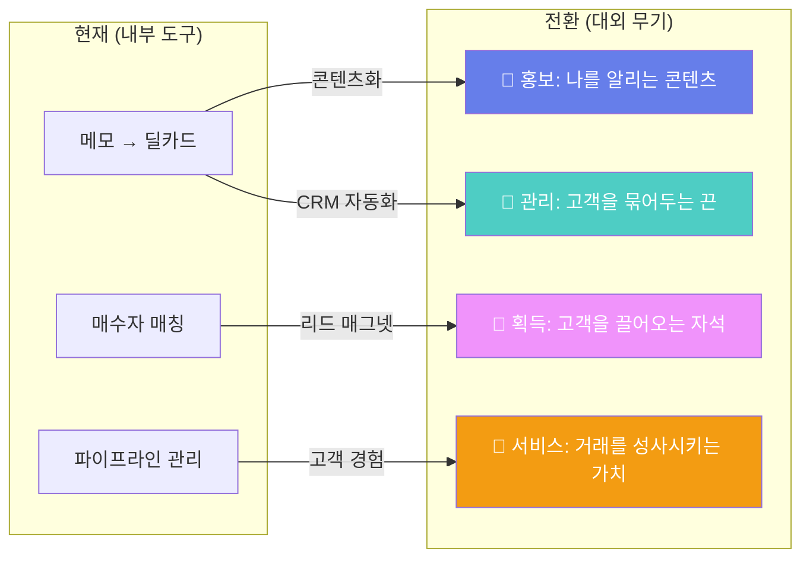
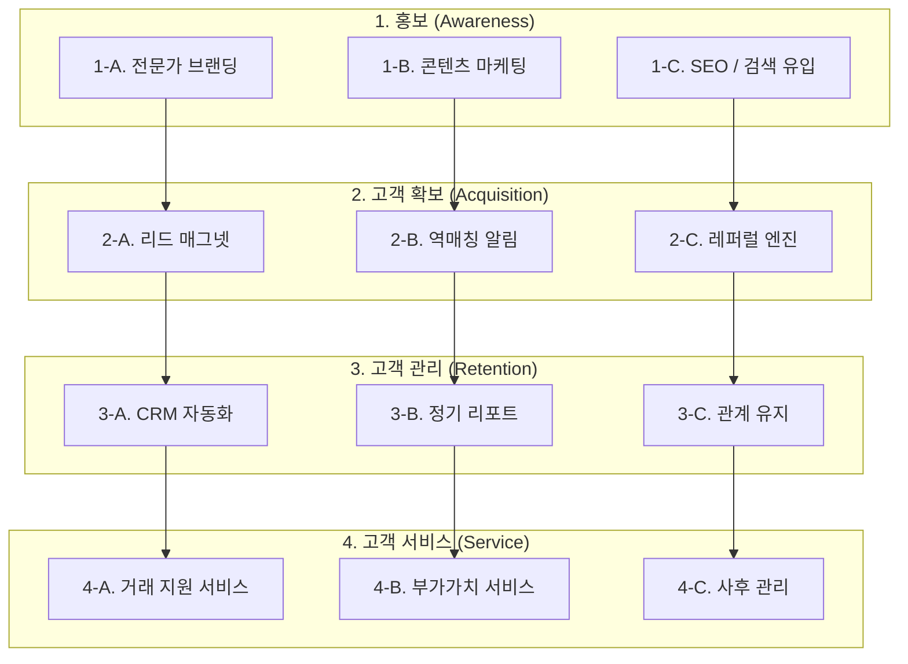
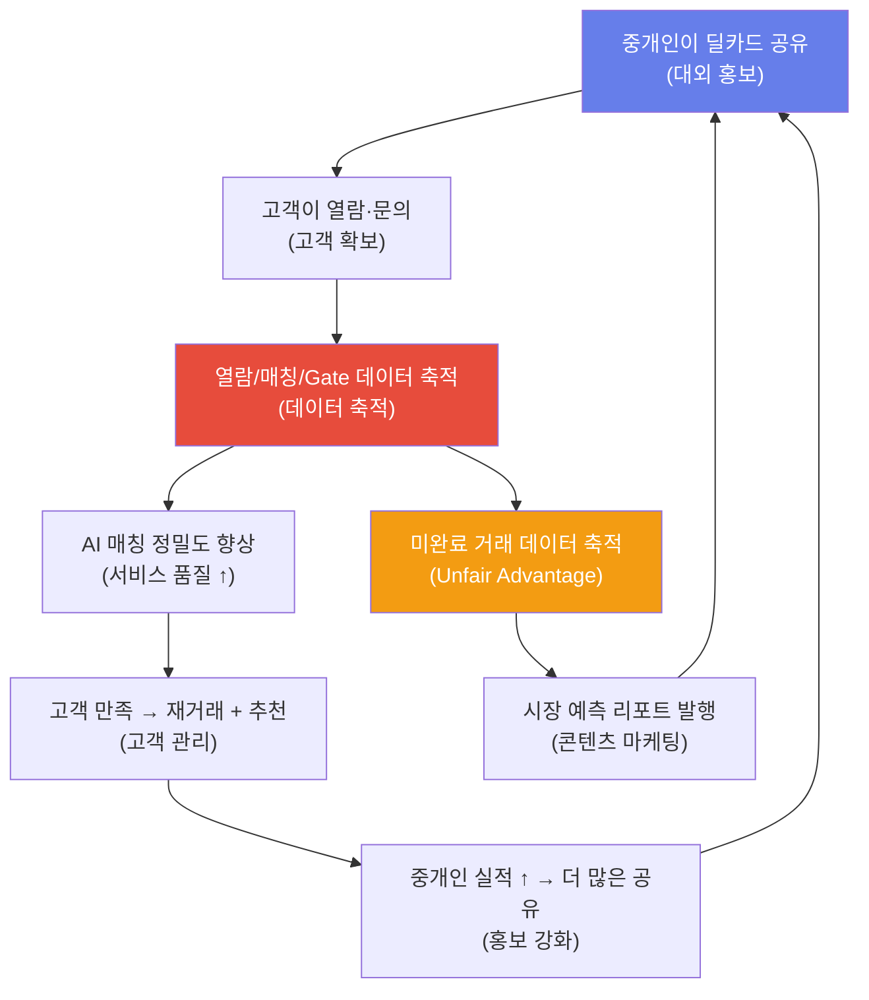
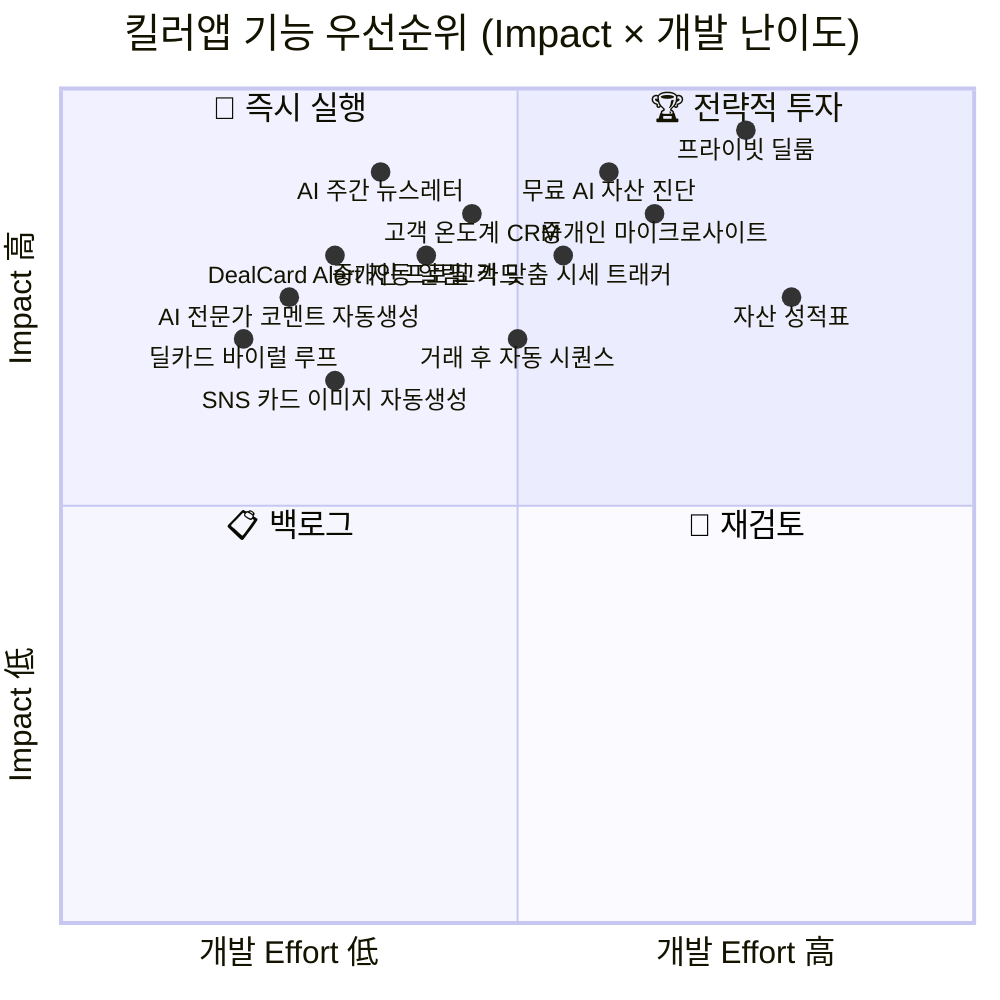

# 🎯 CRE DealCard — 상업용 부동산 중개인의 대외 활용 전략 & 킬러앱 진화

> **문서 버전**: v1.0 | **작성일**: 2026-05-30  
> **MECE 프레임워크**: 고객 라이프사이클 × 활용 수단 매트릭스

---

## Executive Summary

CRE DealCard의 현재 기능은 **중개인의 내부 업무 효율화**에 최적화되어 있으나, 이를 **대외 무기(Outbound Weapon)**로 전환하면 중개인 개인이 하나의 **부동산 미디어 브랜드**로 진화할 수 있습니다.



> [!IMPORTANT]
> **핵심 인사이트**: 중개인의 경쟁력은 "얼마나 많은 매물을 아는가"가 아니라 **"얼마나 전문적으로 보이는가"**에 달려있습니다. DealCard가 중개인을 **CRE 전문가 브랜드**로 포장해주는 순간, 이 도구는 **절대 놓을 수 없는 킬러앱**이 됩니다.

---

## 1. MECE 분석 프레임워크

### 고객 라이프사이클(Funnel Stage) × 활용 수단 매트릭스

중개인의 대외 활동을 **고객 라이프사이클 4단계**로 MECE 분류하고, 각 단계에서 DealCard가 제공할 수 있는 **활용 수단**을 매핑합니다.



---

## 2. 단계별 상세 분석 — 현재 vs 킬러앱 진화

---

### 🔷 단계 1: 홍보 (Awareness) — "나를 알리다"

**목표**: 중개인이 **특정 권역/자산유형의 전문가**로 인식되게 만드는 것

#### 1-A. 전문가 브랜딩

| 구분 | 현재 상태 | 킬러앱 진화 |
|------|:--------:|-----------|
| **딜카드 공유** | ✅ 카카오 문구 복사 | 중개인 프로필 카드 + 전문 분야 자동 태깅 |
| **실적 증명** | ❌ 없음 | AI 자동 포트폴리오 (처리 건수/권역/등급 기반) |
| **전문성 시그널** | ❌ 없음 | "이 중개인의 GBD 오피스 딜 S등급 매칭률 87%" 배지 |

**💡 킬러앱 아이디어**:

> **"AI 중개인 프로필 카드"** — 개인 명함 대체
> ```
> ┌─────────────────────────────────────┐
> │  👤 김재석 | CRE DealCard PRO      │
> │  ─────────────────────────────────  │
> │  🏢 전문 권역: GBD, 판교, 성수      │
> │  📊 누적 딜카드: 127건              │
> │  🎯 S등급 매칭률: 87%              │
> │  ⭐ 거래 성사 매수자 리뷰: 4.8/5.0  │
> │  📈 이번 달 신규 매물: 5건          │
> │                                     │
> │  [🔗 내 딜 포트폴리오 보기]          │
> │  [📱 카카오톡 연결]                  │
> │  [📧 매물 알림 신청]                 │
> └─────────────────────────────────────┘
> ```
> - 이 카드는 **카카오/문자/이메일 시그니처**에 링크로 삽입 가능
> - 클릭하면 해당 중개인의 **블라인드 딜카드 갤러리**로 연결
> - 매칭 실적/전문 권역이 **시스템 데이터 기반으로 자동 계산** → 조작 불가 = 신뢰

---

#### 1-B. 콘텐츠 마케팅

| 구분 | 현재 상태 | 킬러앱 진화 |
|------|:--------:|-----------|
| **블라인드 티저** | ✅ 카카오 문구 | AI 자동 생성 시장 코멘터리 뉴스레터 |
| **시장 분석** | ❌ 없음 | 주간/월간 AI 시세 리포트 (중개인 이름으로 발행) |
| **매물 소개** | ✅ 기본 카드 | SNS 최적화 카드 이미지 (인스타/링크드인/블로그) |

**💡 킬러앱 아이디어**:

> **"AI 주간 시장 뉴스레터"** — 중개인 이름으로 발행되는 시장 분석
> ```
> 📰 김재석의 GBD 오피스 주간 시장 브리핑
> ─────────────────────────────────────
> 이번 주 GBD 권역 동향:
> • 신규 매물 3건 등록 (오피스빌딩 2, 근생 1)
> • 평균 매칭 등급: A (전주 대비 ↑)
> • 매수자 관심 집중: 성수 밸류애드형 200억대
> • 주의 매물: 역삼 대로변 오피스 (Cap 4.2%)
> 
> 📊 이번 주 하이라이트 딜카드 2건
> [블라인드 딜카드 1] [블라인드 딜카드 2]
> 
> 💬 전문가 한 줄: "GBD AI 사옥 수요 유입 증가 추세,
>     중소형 밸류애드 물건의 가격 협상 여력 확대 중"
> ```
> - 블라인드 딜카드 + 매칭 데이터 + Pipeline 데이터를 **자동 집계**
> - 중개인이 "**전문 분석가**"로 포지셔닝되는 콘텐츠 자동 발행
> - 이메일 구독자 = **자동 리드**로 전환

---

#### 1-C. SEO / 검색 유입

| 구분 | 현재 상태 | 킬러앱 진화 |
|------|:--------:|-----------|
| **마켓플레이스** | ✅ 기본 검색 | 각 딜카드의 SEO 최적화 개별 랜딩 페이지 |
| **검색 유입** | ❌ 없음 | "강남 오피스빌딩 매각" 검색 시 딜카드 노출 |
| **중개인 페이지** | ❌ 없음 | 중개인 전용 마이크로사이트 (자동 생성) |

**💡 킬러앱 아이디어**:

> **"중개인 전용 마이크로사이트"** — `dealcard.kr/김재석`
> - 중개인별 자동 생성 퍼블릭 페이지
> - SEO에 최적화된 딜카드 갤러리 + 프로필 + 연락처
> - 구글/네이버 검색에서 **"[중개인명] 상업용 부동산"** 검색 시 1페이지 노출
> - 명함/카카오 프로필에 이 URL을 기재 → **디지털 쇼룸**

---

### 🔷 단계 2: 고객 확보 (Acquisition) — "고객을 끌어오다"

**목표**: 잠재 매수자/매도자/임차인이 **스스로 찾아오는 구조**를 만드는 것

#### 2-A. 리드 매그넷 (Lead Magnet)

| 구분 | 현재 상태 | 킬러앱 진화 |
|------|:--------:|-----------|
| **Building Radar** | ✅ "이 건물, 딜 될까?" 무료 리포트 | 리포트 끝에 "이 권역 전문 중개인에게 상담받기" CTA |
| **Owner Readiness** | ✅ 매각 준비도 점검 | 결과 페이지에서 "전문가 상담 연결" → 중개인 리드 |
| **Expert Note** | ✅ 전문가 3줄 코멘트 | 코멘트 자체가 **초기 신뢰 구축** → 상담 전환 |

**💡 킬러앱 아이디어**:

> **"무료 AI 자산 진단"** — 건물주를 유인하는 리드 매그넷
> ```
> 사용자 경험:
> 1. 건물주가 "내 건물 가치 알아보기" 클릭
> 2. 주소 + 기본 정보 3개 입력 (30초)
> 3. AI가 즉시 생성:
>    - 예상 시세 범위 (블라인드 처리)
>    - 유사 거래 사례 요약
>    - "이 건물의 강점 3가지"
>    - "매각 시 주의할 점 2가지"
> 4. 마지막 화면: 
>    "더 정밀한 분석이 필요하시면?"
>    [🏆 이 권역 전문 중개인 상담 신청]
>    → 해당 권역 전문 중개인에게 리드 알림
> ```
> - 건물주는 **무료로 가치 있는 정보**를 얻음
> - 중개인은 **자격 검증된(Qualified) 리드**를 받음
> - 시스템은 **미완료 거래 데이터**를 축적

> **"임차인 수요 매칭 알림"** — 매물이 없어도 고객이 쌓이는 구조
> ```
> 1. 임차인이 조건 등록 (업종, 면적, 예산, 지역)
> 2. AI가 현재 등록된 매물 중 매칭 탐색
> 3. 매칭 매물 없으면:
>    "현재 조건에 맞는 매물이 없습니다.
>     새로운 매물이 등록되면 즉시 알려드릴까요?"
>    [📧 알림 신청] → 중개인에게 잠재 임차인 풀 축적
> 4. 향후 매물 등록 시 자동 매칭 → 자동 알림
> ```

---

#### 2-B. 역매칭 알림 (Reverse Matching Alert)

| 구분 | 현재 상태 | 킬러앱 진화 |
|------|:--------:|-----------|
| **매물→매수자 매칭** | ✅ 중개인이 수동 실행 | 매물 등록 즉시 S/A등급 매수자에게 **자동 알림** |
| **매수자→매물 매칭** | ❌ 없음 | 매수자 조건 등록 시 기존 매물과 **자동 역매칭** |
| **교차 중개인 매칭** | ❌ 없음 | 중개인 A의 매물 × 중개인 B의 매수자 → **협업 매칭** |

**💡 킬러앱 아이디어**:

> **"DealCard Alert"** — 매수자/매도자에게 자동 푸시
> ```
> 📱 [카카오 알림톡]
> ──────────────
> 안녕하세요, 김재석 중개사입니다.
> 
> 등록하신 조건에 맞는 새로운 매물이 나왔습니다:
> 
> 🏢 GBD 대로변 오피스빌딩
> 💰 200억대 | 📊 매칭등급 S
> 📐 연면적 1,500평+ | Cap 4.2%
> 
> [📄 블라인드 딜카드 보기]
> [📱 전문가 상담 신청]
> ──────────────
> 이 알림은 DealCard에 등록하신 
> 매수 조건에 기반합니다.
> ```

---

#### 2-C. 레퍼럴 엔진 (Referral Engine)

| 구분 | 현재 상태 | 킬러앱 진화 |
|------|:--------:|-----------|
| **공유 트래킹** | ✅ 카카오 복사 이벤트 기록 | 공유된 딜카드의 **열람 → 문의 전환율** 추적 |
| **레퍼럴 인센티브** | ❌ 없음 | "이 딜카드를 공유한 고객이 거래 성사 시 중개인에게 알림" |
| **바이럴 루프** | ❌ 없음 | 딜카드 열람자가 "나도 매수 조건 등록" → 신규 리드 |

**💡 킬러앱 아이디어**:

> **"딜카드 바이럴 루프"** — 공유가 고객을 낳는 선순환
> ```mermaid
> graph LR
>     A["중개인이 딜카드 공유"] --> B["고객 A가 열람"]
>     B --> C{"관심 있나?"}
>     C -->|"Yes"| D["Gate 요청 → 리드 전환"]
>     C -->|"No, 하지만..."| E["'내 주변에 관심 있는 사람 있을 수도'"]
>     E --> F["딜카드 재공유"]
>     F --> G["고객 B가 열람"]
>     G --> D
>     B --> H["'나도 매각/매수 조건 등록하고 싶다'"]
>     H --> I["신규 리드 등록"]
>     I --> A
> ```

---

### 🔷 단계 3: 고객 관리 (Retention) — "고객을 묶어두다"

**목표**: 한 번 만난 고객이 **이 중개인을 잊지 않게** 만드는 것

#### 3-A. CRM 자동화

| 구분 | 현재 상태 | 킬러앱 진화 |
|------|:--------:|-----------|
| **고객 관리** | ✅ broker_clients 테이블 | 고객 이력 + 관심 매물 + 열람 행동 통합 뷰 |
| **팔로업 알림** | ❌ 없음 | "고객 A가 30일간 미접촉" → 자동 리마인더 |
| **관계 스코어** | ❌ 없음 | 열람 빈도 + 문의 횟수 + 최근 접촉일 기반 관계 온도 |

**💡 킬러앱 아이디어**:

> **"고객 온도계"** — AI 기반 관계 상태 자동 모니터링
> ```
> ┌─────────────────────────────────────────┐
> │  🌡️ 고객 관계 온도 대시보드              │
> │                                         │
> │  🔥 HOT (즉시 연락 필요)                │
> │  • 박매수 대표 — Gate G2 요청 2건       │
> │  • 이투자 이사 — 딜카드 3건 열람 (오늘)  │
> │                                         │
> │  ☀️ WARM (이번 주 팔로업)                │
> │  • 김법인 부장 — 마지막 연락 7일 전     │
> │  • 최자산 대표 — 신규 매물 매칭 대기     │
> │                                         │
> │  ❄️ COLD (재활성화 필요)                 │
> │  • 정건물 사장 — 마지막 연락 45일 전    │
> │    💡 추천: "최근 GBD 시세 리포트 전송"  │
> │                                         │
> │  [📊 전체 고객 온도 분포 보기]            │
> └─────────────────────────────────────────┘
> ```

---

#### 3-B. 정기 리포트 & 터치포인트

| 구분 | 현재 상태 | 킬러앱 진화 |
|------|:--------:|-----------|
| **ROI 리포트** | ✅ 중개인 자신용 | 고객에게 보내는 **맞춤형 시장 리포트** |
| **생일/기념일** | ❌ 없음 | 고객 기념일 자동 감지 → AI 축하 메시지 |
| **시장 변동 알림** | ❌ 없음 | 고객 관심 권역 시세 변동 시 자동 알림 |

**💡 킬러앱 아이디어**:

> **"고객 맞춤 시세 트래커"** — 관계를 유지하는 가치 있는 터치포인트
> ```
> 📊 [고객 맞춤 월간 시세 리포트]
> ──────────────────────────
> 안녕하세요 박매수 대표님,
> 김재석 중개사의 5월 GBD 시세 리포트입니다.
> 
> 📍 관심 권역: 강남 GBD 오피스
> 📈 이번 달 평균 거래가: 평당 6,100만원 (+2.3%)
> 🏢 신규 등록 매물: 4건 (200억대 2건, 300억대 2건)
> 🎯 대표님 조건 매칭 매물: 2건 (S등급 1, A등급 1)
> 
> [📄 매칭 딜카드 보기]
> [📞 상담 요청]
> ──────────────────────────
> * 이 리포트는 DealCard AI가 자동 생성했습니다.
> ```

---

#### 3-C. 관계 유지 프로그램

| 구분 | 현재 상태 | 킬러앱 진화 |
|------|:--------:|-----------|
| **거래 완료 후** | ❌ 없음 | 거래 후 자동 만족도 조사 + 리뷰 요청 |
| **장기 미거래 고객** | ❌ 없음 | 6개월 이상 미거래 고객 재활성화 시나리오 |
| **VIP 관리** | ❌ 없음 | 반복 거래 고객 자동 VIP 등급 → 우선 매칭 |

**💡 킬러앱 아이디어**:

> **"거래 후 관계 자동 엔진"** — 1회성 거래를 반복 고객으로
> ```
> 거래 성사 후 자동 시퀀스:
> 
> D+0: 🎉 "거래 성사 축하합니다" 카카오톡 발송
> D+7: 📋 "입주/인수 후 체크리스트" 전달
> D+30: ⭐ "거래 만족도 조사" (1~5점 + 한줄 리뷰)
> D+90: 📊 "매입 후 시세 변동 리포트" 발송
>         "매입 시 대비 +3.2% 상승 중입니다"
> D+180: 🎯 "보유 중인 자산과 유사한 신규 거래 사례"
> D+365: 🏢 "보유 1주년! 시세 변동 및 출구 전략 리포트"
>          "현재 매각 시 예상 수익: +12%"
> ```

---

### 🔷 단계 4: 고객 서비스 (Service) — "가치를 전달하다"

**목표**: 거래 과정에서 **압도적 전문성**을 체감하게 하는 것

#### 4-A. 거래 지원 서비스

| 구분 | 현재 상태 | 킬러앱 진화 |
|------|:--------:|-----------|
| **블라인드 딜카드** | ✅ | 고객(매수자) 전용 **프라이빗 딜 포털** |
| **모바일 IM** | ✅ | 고객에게 **실시간 업데이트 IM** (가격 변동/조건 변경 반영) |
| **Gate 정보 공개** | ✅ | 게이트 승인 즉시 **고객 전용 VDR(Virtual Data Room)** 제공 |
| **매칭 결과** | ✅ | 매수자에게 "왜 이 매물이 맞는지" **AI 분석 리포트** 전달 |

**💡 킬러앱 아이디어**:

> **"프라이빗 딜룸"** — 고객별 전용 거래 공간
> ```
> ┌─────────────────────────────────────────┐
> │  🔒 프라이빗 딜룸 — 박매수 대표님 전용   │
> │  담당: 김재석 중개사                     │
> │  ─────────────────────────────────────  │
> │                                         │
> │  📋 검토 중인 매물 (3건)                 │
> │  ├─ 🏢 GBD 역삼 오피스 200억 [S등급]    │
> │  │   └─ Gate: G2 승인 완료 ✅            │
> │  ├─ 🏢 판교 IT빌딩 150억 [A등급]        │
> │  │   └─ Gate: G1 (NDA 대기 중)          │
> │  └─ 🏢 성수 복합 180억 [A등급]          │
> │      └─ 신규 추천 🆕                    │
> │                                         │
> │  📊 비교 분석표                          │
> │  │ 항목      │ 역삼  │ 판교  │ 성수  │   │
> │  │ Cap Rate  │ 4.2% │ 3.8% │ 4.5% │   │
> │  │ 매칭등급  │ S    │ A    │ A    │    │
> │  │ 상태      │ 협의  │ 검토  │ 추천  │   │
> │                                         │
> │  💬 최근 활동                            │
> │  • 5/28: 역삼 매물 현장 방문 완료        │
> │  • 5/25: 판교 매물 NDA 서명 요청         │
> │                                         │
> │  [💬 중개사에게 메시지] [📞 통화 요청]    │
> └─────────────────────────────────────────┘
> ```
> - 매수자가 여러 매물을 **한 화면에서 비교**
> - 중개인과의 소통 이력이 **시간순으로 기록**
> - Gate 상태가 실시간 반영 → **투명한 거래 프로세스**

---

#### 4-B. 부가가치 서비스

| 구분 | 현재 상태 | 킬러앱 진화 |
|------|:--------:|-----------|
| **Building Radar** | ✅ | 고객에게 "이 건물 어때요?" 답변 대신 리포트 링크 전달 |
| **Owner Readiness** | ✅ | 매도자에게 "서류 준비 안내" 대신 대화형 체크리스트 |
| **Expert Note** | ✅ | 3줄 코멘트를 **AI 사전 생성** + 중개인 최종 검수 |
| **AI 임대 페이지** | ✅ Space AI 연동 | 임대 매물의 **1분 랜딩 페이지** 생성 → 임차인 유입 |

**💡 킬러앱 아이디어**:

> **"AI 전문가 코멘트 자동 생성"** — 중개인의 전문성을 확대 재생산
> ```
> [기존] 고객: "이 건물 어때요?"
>        중개인: (30분 조사 후) "괜찮을 것 같은데요..."
> 
> [킬러앱] 고객: "이 건물 어때요?"
>          중개인: (10초 후 AI 생성 코멘트)
>          "성수 근생빌딩 78억 — AI 분석 결과:
>           ✅ 강점: Cap 4.5%로 권역 평균 대비 우수,
>              리모델링 후 임대료 15% 인상 여력
>           ⚠️ 주의: 2층 임차인 만기 6개월 후,
>              1층 업종 제한(F&B 불가)
>           💡 제안: 현 매각가 대비 5% 협상 여력 있음,
>              밸류애드 전략 매수자에게 적합"
> ```
> - AI가 사전 분석을 수행하고, 중개인은 **검수만 하면 전문가 코멘트 완성**
> - 응답 속도 30분 → 10초 = **고객 감동**

---

#### 4-C. 사후 관리 서비스

| 구분 | 현재 상태 | 킬러앱 진화 |
|------|:--------:|-----------|
| **거래 완료 후** | ❌ 없음 | 보유 자산 시세 트래킹 + 출구 전략 어드바이저 |
| **임대 관리 연계** | ❌ 없음 | 매입한 건물의 임대차 딜카드 자동 연동 |
| **재거래 시점 알림** | ❌ 없음 | "보유 3년 차, 시세 +25%. 출구 전략 검토 시점" |

**💡 킬러앱 아이디어**:

> **"자산 성적표"** — 거래 후에도 관계를 유지하는 장기 서비스
> ```
> 📊 [자산 성적표 — 2026년 5월]
> ──────────────────────────────
> 🏢 GBD 역삼 오피스빌딩 (2024년 6월 매입)
> 
> 💰 매입가: 200억원
> 📈 현재 추정 시세: 228억원 (+14%)
> 📊 NOI: 연 8.4억원 (Cap 4.2%)
> 🏢 임대율: 92% (공실 1개 층)
> 
> 📌 이번 달 이벤트:
> • 3층 임차인 계약 갱신 (월차임 5% 인상)
> • 인근 유사 매물 거래: 평당 6,300만원
> 
> 💡 AI 출구 전략 제안:
> "현재 시세 기준 매각 시 세후 순수익 약 24억원.
>  2년 후 인근 재개발 완료 시 추가 10% 상승 예상.
>  보유 지속을 권장합니다."
> 
> [📞 중개사와 상담] [📊 상세 분석 보기]
> ```

---

## 3. 킬러앱 진화의 핵심 — 데이터 플라이휠

### 3.1 중개인 대외 활용 → 데이터 플라이휠 가속



### 3.2 중개인이 대외 활용할수록 시스템이 강해지는 이유

| 중개인의 대외 활동 | 시스템에 쌓이는 데이터 | 시스템이 강해지는 방식 |
|----------------|------------------|-------------------|
| 딜카드 카카오 공유 | 열람 이벤트, 리드 유입 | 콘텐츠 효과 측정 → 더 나은 티저 생성 |
| 매수자 조건 등록 | 매수 의향 데이터 | 매칭 정밀도 향상 → S등급 비율 ↑ |
| 고객에게 시세 리포트 발송 | 고객 관심 권역 데이터 | 지역별 수요 예측 → 시장 분석 정확도 ↑ |
| Gate 요청 승인/거절 | 정보 공개 패턴 | Progressive Disclosure 최적화 |
| 거래 성사/실패 | 미완료 거래 사유 데이터 | 전환율 예측 모델 정밀도 ↑ |
| 고객 피드백/리뷰 | NPS, 만족도 데이터 | 서비스 품질 지표 → 중개인 랭킹 |

---

## 4. 킬러앱 진화 로드맵 — 우선순위 매트릭스

### 4.1 Impact × Effort 매트릭스



### 4.2 실행 순서 (3-Phase)

#### Phase A: Quick Wins (4주) — 기존 기능을 대외용으로 전환

| # | 기능 | 기반 | 개발량 | 임팩트 |
|:-:|------|------|:------:|:------:|
| A1 | **AI 전문가 코멘트 자동 생성** | Building Radar + HallucinationDetector | 🟢 Small | ⭐⭐⭐⭐ |
| A2 | **DealCard Alert (카카오 알림)** | 매칭 엔진 + 카카오 공유 | 🟢 Small | ⭐⭐⭐⭐ |
| A3 | **딜카드 바이럴 트래킹** | activity_events 확장 | 🟢 Small | ⭐⭐⭐ |
| A4 | **중개인 AI 프로필 카드** | match_results 집계 | 🟡 Medium | ⭐⭐⭐⭐ |
| A5 | **AI 주간 뉴스레터 자동 생성** | Pipeline + 매칭 데이터 집계 | 🟡 Medium | ⭐⭐⭐⭐⭐ |

> [!TIP]
> **A5(주간 뉴스레터)가 가장 높은 ROI를 가집니다.** 중개인이 매주 1회 전문 콘텐츠를 발행하면 3개월 내 **"이 분야 전문가"** 인식이 형성됩니다. 이 콘텐츠가 시스템 데이터로 자동 생성되므로 중개인의 추가 노력은 0입니다.

#### Phase B: Core Features (8주) — 고객 관리/확보 엔진 구축

| # | 기능 | 설명 | 개발량 | 임팩트 |
|:-:|------|------|:------:|:------:|
| B1 | **고객 온도계 CRM** | 관계 스코어링 + 리마인더 | 🟡 Medium | ⭐⭐⭐⭐⭐ |
| B2 | **고객 맞춤 시세 트래커** | 월간 자동 리포트 | 🟡 Medium | ⭐⭐⭐⭐ |
| B3 | **무료 AI 자산 진단** | 건물주 리드 매그넷 | 🟡 Medium | ⭐⭐⭐⭐⭐ |
| B4 | **거래 후 자동 시퀀스** | D+0~D+365 자동 터치포인트 | 🟡 Medium | ⭐⭐⭐⭐ |
| B5 | **SNS 카드 이미지 자동 생성** | 인스타/링크드인용 딜카드 이미지 | 🟢 Small | ⭐⭐⭐ |

#### Phase C: Platform Features (12주) — 플랫폼 전환

| # | 기능 | 설명 | 개발량 | 임팩트 |
|:-:|------|------|:------:|:------:|
| C1 | **프라이빗 딜룸** | 고객별 전용 거래 포털 | 🔴 Large | ⭐⭐⭐⭐⭐ |
| C2 | **중개인 마이크로사이트** | 자동 생성 퍼블릭 페이지 + SEO | 🔴 Large | ⭐⭐⭐⭐ |
| C3 | **자산 성적표** | 거래 후 장기 자산 트래킹 | 🟠 High | ⭐⭐⭐⭐ |
| C4 | **교차 중개인 매칭** | 중개인 간 협업 매칭 네트워크 | 🔴 Large | ⭐⭐⭐⭐⭐ |

---

## 5. 킬러앱 포지셔닝 — 경쟁 비교

### 5.1 기존 도구 대비 차별화

| 차원 | 엑셀/PPT (현행) | 네이버부동산 | 알스퀘어 | **DealCard 킬러앱** |
|------|:-------------:|:---------:|:------:|:------------------:|
| **딜카드 생성** | 3~4시간 수동 | 불가 | 구조화 폼 | **25초 AI 자동** |
| **고객에게 공유** | PDF/이메일 | 링크 | 제한적 | **카카오 + 전용 딜룸** |
| **전문가 브랜딩** | 없음 | 없음 | 없음 | **AI 프로필 + 뉴스레터** |
| **고객 CRM** | 엑셀 수동 | 없음 | 기본 | **AI 온도계 + 자동 팔로업** |
| **시장 분석** | 수동 조사 | 시세 조회 | 기본 데이터 | **AI 자동 리포트 발행** |
| **거래 후 관리** | 없음 | 없음 | 없음 | **자산 성적표 + 출구 전략** |
| **리드 확보** | 인맥 의존 | 없음 | 없음 | **리드 매그넷 + 역매칭** |

### 5.2 킬러앱의 최종 비전

```
현재:  "중개인이 업무를 효율화하는 도구"
       → 대체 가능 (더 좋은 도구 나오면 전환)

킬러앱: "중개인의 개인 브랜드와 고객 자산이 축적된 플랫폼"
       → 대체 불가능 (옮기면 고객 이력 + 실적 + 관계 모두 소멸)
```

> [!IMPORTANT]
> **킬러앱의 핵심은 "이탈 비용(Switching Cost)"입니다.**
> 
> 중개인이 DealCard에 축적하는 것:
> 1. **고객 관계 데이터** (온도, 선호, 이력)
> 2. **전문가 실적 증명** (딜카드 건수, 매칭률, 거래 성사율)
> 3. **콘텐츠 자산** (뉴스레터 아카이브, 시장 분석 이력)
> 4. **바이럴 네트워크** (공유된 딜카드 → 유입된 리드)
> 
> 이 4가지가 시간이 지날수록 축적되면, 다른 도구로 전환하는 것은 **"지난 3년간의 전문가 이력을 버리는 것"**과 같아집니다.

---

## 6. 요약 — MECE 전체 맵

| 단계 | 현재 기능 | 킬러앱 진화 | 핵심 신규 기능 |
|------|:--------:|:---------:|-------------|
| **1. 홍보** | 카카오 공유 | 전문가 브랜드 플랫폼 | AI 프로필, 뉴스레터, 마이크로사이트 |
| **2. 고객 확보** | Building Radar, Expert Note | 자동 리드 확보 엔진 | AI 자산 진단, 역매칭 알림, 바이럴 루프 |
| **3. 고객 관리** | broker_clients 기본 CRM | AI 관계 관리 플랫폼 | 고객 온도계, 시세 트래커, 거래 후 시퀀스 |
| **4. 고객 서비스** | 딜카드/IM/Gate | 프리미엄 거래 경험 | 프라이빗 딜룸, AI 코멘트, 자산 성적표 |

> **최종 목표**: DealCard는 "딜카드 만드는 도구"가 아니라, **"상업용 부동산 중개인의 비즈니스 전체를 운영하는 OS(Operating System)"**가 되는 것입니다.
