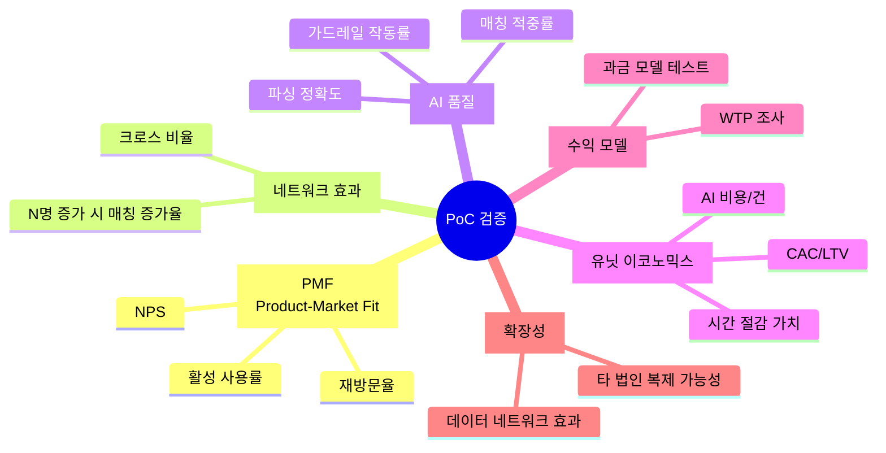
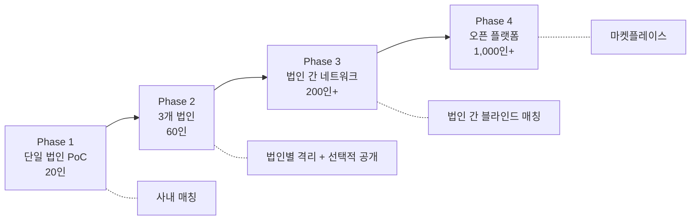

# PoC 검증 프레임워크 — 스타트업 확장을 위한 가설 검증

> **PoC 기간**: 8주 (2 Sprint × 4주)  
> **참여자**: 제이에스부동산중개(주) 중개인 20인  
> **목표**: 스타트업 아이템으로의 확장 가능성 데이터 기반 판단

---

## 검증 영역 개요



---

## V1. Product-Market Fit (제품-시장 적합성)

### 가설

> "서울 꼬마빌딩 중개인은 카톡 메모 기반 AI 딜카드 생성과 사내 자동 매칭을 주 3회 이상 사용할 것이다"

### 측정 지표

| 지표 | 측정 방법 | 성공 기준 | 실패 기준 |
|------|----------|----------|----------|
| **WAU (주간 활성 사용자)** | 주 1회+ 딜카드 생성 or 매칭 조회 | 20명 중 14명+ (70%) | 10명 미만 (50%) |
| **딜카드 생성 빈도** | 중개인당 주간 딜카드 생성 수 | 주 3건+ | 주 1건 미만 |
| **재방문율 (Day 7/Day 30)** | 가입 후 7일/30일 재방문 비율 | D7 ≥ 60%, D30 ≥ 40% | D7 < 40% |
| **NPS** | 4주차, 8주차 설문 | ≥ 40 | < 20 |
| **Sean Ellis Test** | "이 서비스가 없어지면?" 설문 | "매우 실망" ≥ 40% | < 25% |

### 데이터 수집

| 소스 | 테이블 | 지표 |
|------|--------|------|
| 딜카드 생성 로그 | `ai_runs` | 생성 건수, 소요 시간, 에이전트별 |
| 활동 이벤트 | `activity_events` | 모든 사용자 행동 |
| 매칭 조회 | `match_results` | 조회 빈도, 클릭 건수 |
| NPS 설문 | 외부 설문 도구 | 4주/8주차 |

---

## V2. 네트워크 효과 검증

### 가설

> "참여 중개인 수(N)가 증가하면, 매칭 품질과 건수가 N² 비례로 증가한다"

### 측정 지표

| 지표 | 측정 방법 | 성공 기준 |
|------|----------|----------|
| **매칭 밀도** | S+A등급 매칭 수 / (매물 수 × 의향서 수) | 주차별 상승 추세 |
| **크로스 매칭 비율** | 타 중개인 매물-매수 매칭 / 전체 매칭 | ≥ 60% |
| **매칭 → 미팅 전환** | S등급 매칭 중 실제 미팅 성사 | ≥ 25% |
| **Cold Start 탈출** | 유의미한 매칭 최소 매물 수 | N ≤ 50건 |

### 검증 설계

```
Week 1-2: 5명 선행 그룹 → 매물 25건 + 의향서 15건
Week 3-4: 10명 추가 → 매물 75건 + 의향서 45건
Week 5-8: 전원 20명 → 매물 150건+ + 의향서 100건+

각 단계별 매칭 건수·품질 변화 측정 → 네트워크 효과 곡선 도출
```

| 소스 | 테이블 | 분석 |
|------|--------|------|
| 매매 매칭 | `match_results` | broker_id별 크로스 분석 |
| 임대 매칭 | `lease_match_results` | 등급별 분포 변화 |
| 매물 풀 | `building_ssot_lite`, `lease_spaces` | 주차별 누적 |
| 의향서 풀 | `buyer_intent_lite`, `tenant_intent` | 주차별 누적 |

---

## V3. AI 품질 검증

### 가설

> "AI 메모 파싱 정확도 90%+, 매칭 적중률(S등급 → 실제 관심) 70%+ 달성 가능하다"

### 측정 지표

| 지표 | 측정 방법 | 성공 기준 | 실패 기준 |
|------|----------|----------|----------|
| **메모 파싱 정확도** | 생성된 SSoT를 중개인이 수정한 비율 | 수정률 ≤ 10% | 수정률 > 30% |
| **블라인드 처리 정확도** | 민감 정보 유출 건수 | 0건 | 1건 이상 |
| **매칭 적중률** | S등급 매칭 중 "유효" 평가 비율 | ≥ 70% | < 50% |
| **가드레일 작동률** | boundary_note 포함률 | 100% | < 95% |
| **TenantFit 정확도** | AI 적합성 판정 vs 중개인 전문가 판단 일치율 | ≥ 75% | < 60% |

### 데이터 수집

| 항목 | 방법 |
|------|------|
| 파싱 품질 | `ai_runs` 로그 + 중개인 수정 이력(PUT 호출) 비교 |
| 매칭 피드백 | 매칭 카드에 👍/👎 버튼 추가 (간단한 UI 수정) |
| 가드레일 | `ai_runs.output` 내 boundary_note 존재 여부 집계 |
| 블라인드 | `document_objects.hidden_fields` 검수 |

---

## V4. 유닛 이코노믹스 검증

### 가설

> "딜카드 1건당 AI 비용 < ₩500, 중개인 1인당 월 시간 절감 가치 > ₩200만"

### 측정 지표

| 지표 | 측정 방법 | 성공 기준 |
|------|----------|----------|
| **AI 비용/딜카드** | LLM API 비용 / 딜카드 수 | < ₩500/건 |
| **AI 비용/매칭** | LLM API 비용 / 매칭 수 | < ₩100/건 |
| **시간 절감** | (기존 소요 시간 - 시스템 소요 시간) × 시급 | 월 ₩200만+/인 |
| **딜 체류일수 단축** | 파이프라인 평균 체류일 | 기존 대비 -30% |

### 시간 절감 산정 모델

```
[Before]
 딜카드 작성: 45분/건 × 10건/주 = 450분/주
 매칭 수작업: 30분/건 × 5건/주 = 150분/주
 고객 정리:  20분/건 × 5건/주 = 100분/주
 합계: 700분/주 = 11.7시간/주

[After]
 딜카드 작성: 2분/건 × 10건/주 = 20분/주
 매칭: 0분 (자동)
 고객 정리: 0분 (자동)
 합계: 20분/주

[절감]: 11.3시간/주 × 4주 = 45.2시간/월
[가치]: 45.2시간 × ₩50,000/시간 = ₩2,260,000/월/인
```

---

## V5. 수익 모델 검증

### 가설

> "중개인은 월 ₩5~10만 수준의 구독료를 지불할 의향이 있다"

### 테스트할 과금 모델

| 모델 | 구조 | 검증 방법 |
|------|------|----------|
| **A. SaaS 구독** | 월 ₩5만/인 (Basic), ₩10만/인 (Pro) | 4주차 WTP 설문 |
| **B. 성과 기반** | 매칭 → 미팅 전환 시 건당 ₩5만 | 8주차 실제 미팅 건수 추적 |
| **C. 법인 라이선스** | 월 ₩50만/법인 (20인 포함) | 대표 의사결정자 인터뷰 |
| **D. 프리미엄** | 기본 무료 + AI 리싱 페이지당 ₩3만 | 리싱 페이지 생성 건수 추적 |

### WTP 설문 설계 (4주차)

```
Q1. 이 시스템이 유료(월 구독)가 된다면 계속 사용하시겠습니까?
    ① 반드시 사용 ② 아마 사용 ③ 모르겠다 ④ 아마 안 사용 ⑤ 절대 안 사용

Q2. 적정 월 구독료는? (1인 기준)
    ① 3만원 이하 ② 5만원 ③ 10만원 ④ 15만원 이상

Q3. 어떤 기능에 가장 가치를 느끼셨나요? (복수 선택)
    ① 60초 딜카드 ② AI 매칭 ③ 블라인드 공유 ④ CRM ⑤ 리싱 페이지 ⑥ 시장 분석
```

---

## V6. 확장성 검증

### 가설

> "이 시스템은 제이에스 이외의 중개 법인에도 동일한 가치를 제공할 수 있다"

### 측정 항목

| 항목 | 방법 | 성공 기준 |
|------|------|----------|
| **복제 가능성** | 세팅 시간 (법인 추가에 필요한 공수) | < 1일 |
| **도메인 범용성** | 꼬마빌딩 외 자산(오피스, 상가, 물류)에도 동작하는가 | 파싱 정확도 ≥ 80% |
| **지역 확장** | 서울 외 경기/인천으로 확장 가능한가 | 시장 데이터 커버리지 |
| **법인 간 매칭** | 법인 A 매물 ↔ 법인 B 매수자 매칭 수요 | 중개인 인터뷰 10건 |

### 확장 시나리오



---

## 8주 PoC 타임라인

| 주차 | 마일스톤 | 핵심 검증 항목 |
|------|---------|-------------|
| **W1** | 온보딩 (선행 5인) + 교육 | 시스템 접근성, 온보딩 시간 |
| **W2** | 선행 그룹 매물 25건 + 의향서 15건 등록 | AI 파싱 정확도, Cold Start 매칭 |
| **W3** | 전원 20인 온보딩 | 확대 시 매칭 품질 변화 |
| **W4** | 매물 100건 + 의향서 60건 달성 | **NPS 1차 측정**, WTP 설문, 네트워크 효과 곡선 |
| **W5** | CRM + 리싱 페이지 활성화 | CRM 자동 등록률, 리드 유입 |
| **W6** | 파이프라인 + Pulse 활용 | 딜 체류일수, 시장 데이터 활용도 |
| **W7** | 전체 기능 자유 활용 | 기능별 사용 빈도 히트맵 |
| **W8** | **최종 평가** | NPS 2차, Sean Ellis, WTP, Go/No-Go |

---

## Go / No-Go 판단 기준

### 🟢 Go (스타트업 확장 진행)

| 조건 | 기준 |
|------|------|
| WAU | ≥ 70% (14/20명) |
| NPS | ≥ 40 |
| Sean Ellis | "매우 실망" ≥ 40% |
| 크로스 매칭 비율 | ≥ 60% |
| S등급 적중률 | ≥ 70% |
| WTP | 월 ₩5만+ 지불 의향 ≥ 60% |

### 🟡 Pivot (방향 전환 검토)

| 조건 | 해석 |
|------|------|
| WAU 50~70% but 특정 기능에 집중 | 해당 기능 중심으로 피벗 |
| NPS 20~40 | 핵심 불만 개선 후 재PoC |
| 크로스 매칭 < 60% but 개인 활용도 높음 | B2C 개인 중개인 타깃으로 전환 |

### 🔴 No-Go (중단 또는 근본 재설계)

| 조건 | 기준 |
|------|------|
| WAU | < 50% |
| NPS | < 20 |
| AI 파싱 수정률 | > 30% |
| 민감 정보 유출 | 1건 이상 |

---

## 투자자 어필 스토리 구성

PoC 성공 시 아래 데이터로 스토리 구성:

```
[Problem] 상업용 부동산 중개인 45,000명 × 주 11시간 비효율 = 연 2,574만 시간 낭비
[Solution] 카톡 메모 → 60초 AI 딜카드 + 사내 자동 매칭
[Traction] 20인 PoC에서 WAU 70%, NPS 45, 크로스 매칭 65%, 딜 체류일수 -35%
[Market] 한국 CRE 중개 시장 ₩2.1조 (수수료 기준)
[Model] B2B SaaS 월 ₩50만/법인 + 성과 기반 커미션
[Ask] 시리즈 Seed ₩10억 → 50개 법인 확장 (1년 내 1,000인)
```
