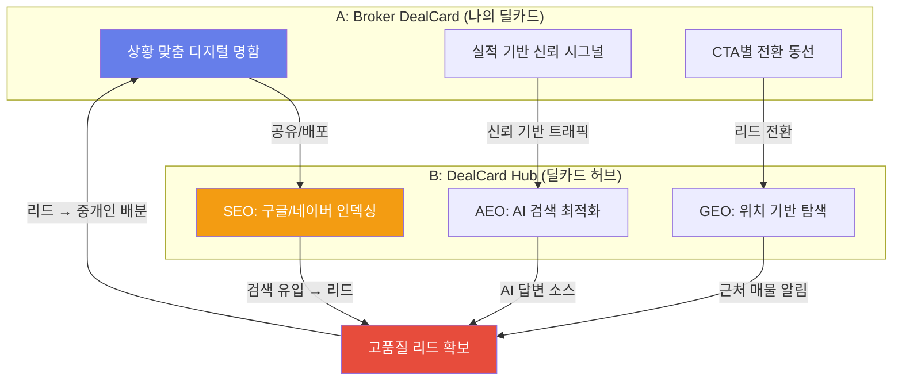
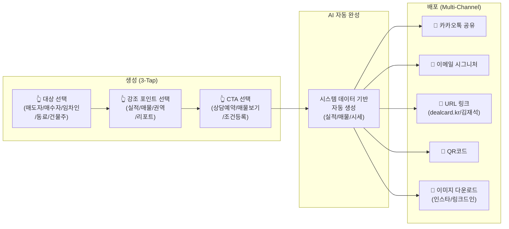
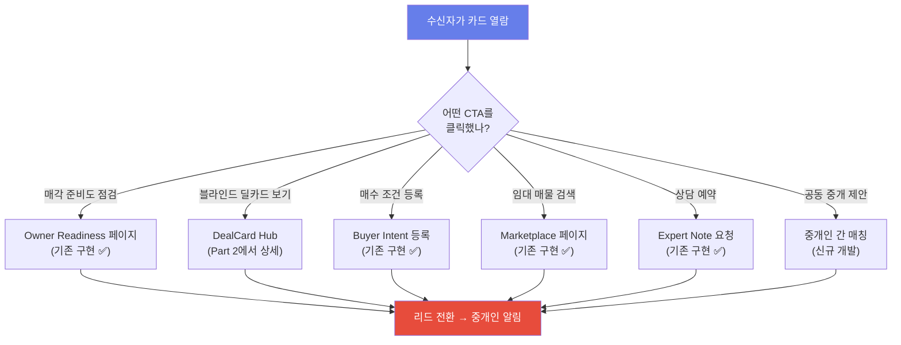
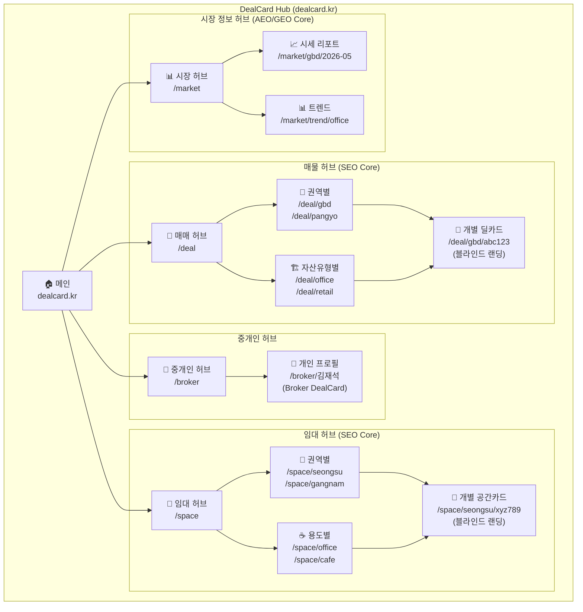
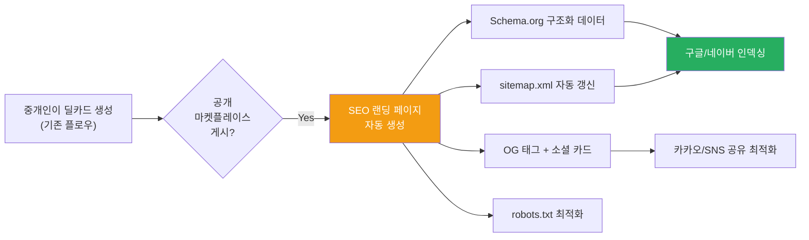
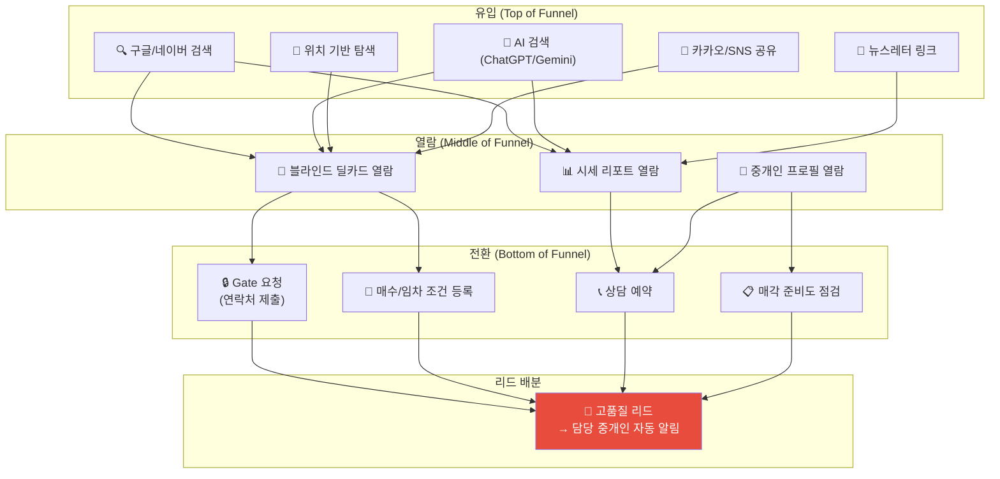
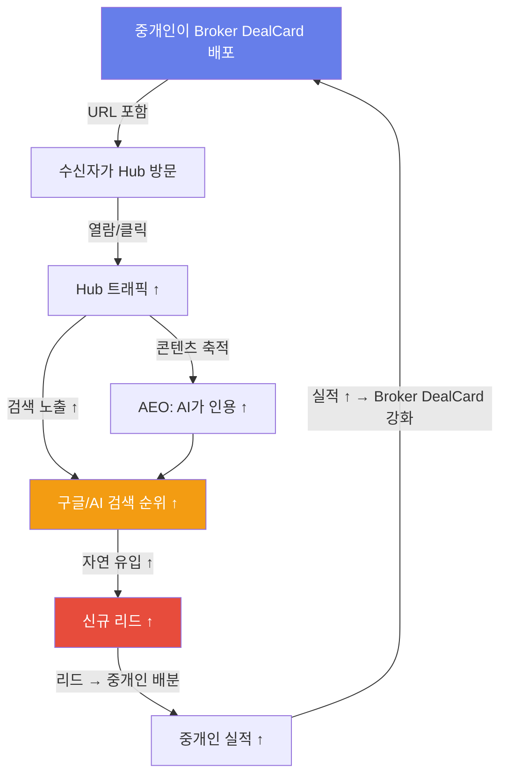
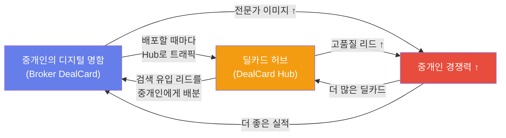

# 💼 Broker DealCard + DealCard Hub — 디지털 명함 × SEO/AEO/GEO 허브 전략

> **문서 버전**: v1.0 | **작성일**: 2026-05-30  
> **핵심 가설**: 중개인 자신이 딜카드가 되고, 딜카드가 검색 허브가 되면, CRE DealCard는 **상업용 부동산의 링크드인**이 된다.

---

## Executive Summary

두 가지 아이디어를 하나의 통합 아키텍처로 설계합니다:



> [!IMPORTANT]
> **핵심 차별점**: 기존 부동산 플랫폼은 **"매물 중심"** 검색입니다. DealCard Hub는 **"중개인 전문성 + 매물 품질"**이 결합된 검색이라서, 유입되는 리드의 품질이 압도적으로 높습니다.

---

## Part 1: Broker DealCard — 나의 딜카드 (디지털 명함)

### 1.1 왜 중개인 자신의 딜카드인가?

```
[기존 종이 명함]              [Broker DealCard]
───────────                 ──────────────
이름, 전화번호, 회사명        이름 + 전문 권역 + 실적 증명
정적 정보                    실시간 업데이트
모든 상황에 동일               상황/대상별 맞춤 생성
신뢰 근거 없음                 시스템 검증된 실적 데이터
1:1 교환                    1:N 배포 + 추적
```

핵심: 명함은 "나를 알리는 것"이 목적인데, 종이 명함은 **아무것도 증명하지 못합니다.**  
Broker DealCard는 **시스템이 검증한 실적 데이터**를 기반으로 자동 생성되어, 받는 사람이 즉시 **"이 사람이 진짜 전문가구나"**를 판단할 수 있습니다.

---

### 1.2 상황/대상 맞춤 Broker DealCard 유형 (5종)

#### Type 1: 매도자용 — "내 건물을 맡기고 싶게 만드는 카드"

```
┌──────────────────────────────────────────────┐
│  🏢 김재석 | 상업용 부동산 전문 중개사         │
│  ━━━━━━━━━━━━━━━━━━━━━━━━━━━━━━━━━━━━━━━    │
│                                              │
│  📍 전문 권역: GBD (강남/서초/역삼)           │
│  🏢 전문 자산: 오피스빌딩, 밸류애드            │
│                                              │
│  📊 매각 실적 (최근 12개월)                   │
│  ├─ 매각 중개 건수: 8건                      │
│  ├─ 평균 매각 기간: 47일 (업계 평균 120일)    │
│  ├─ 매수자 매칭 S등급 비율: 87%              │
│  └─ 최근 성사: GBD 오피스 220억 (34일 매각)  │
│                                              │
│  💡 매도자님께 드리는 약속                     │
│  "블라인드 딜카드로 시장에 소문 없이           │
│   적합한 매수자만 선별합니다.                  │
│   정보 유출 걱정 없는 3단계 Gate 시스템."      │
│                                              │
│  [📄 무료 매각 준비도 점검받기]                │
│  [📞 매각 상담 예약]                          │
│  [🔒 NDA 기반 비밀 매각 프로세스 안내]         │
└──────────────────────────────────────────────┘
```

**생성 로직**: `match_results`(S등급 비율), `deal_pipeline_states`(평균 매각 기간), `activity_events`(최근 12개월 성사 건수)에서 자동 집계

---

#### Type 2: 매수자용 — "좋은 매물을 먼저 알려줄 수 있는 사람"

```
┌──────────────────────────────────────────────┐
│  🎯 김재석 | 매수 투자 전문 매칭 어드바이저     │
│  ━━━━━━━━━━━━━━━━━━━━━━━━━━━━━━━━━━━━━━━    │
│                                              │
│  📍 커버리지: GBD, 판교, 성수                 │
│  🏢 전문: 오피스 밸류애드, 수익형 빌딩         │
│                                              │
│  📊 매수자 서비스 실적                        │
│  ├─ 현재 관리 중인 비공개 매물: 12건           │
│  ├─ 이번 달 신규 등록: 3건                   │
│  ├─ 매칭 성공률: 92%                         │
│  └─ 현재 S등급 매칭 대기 건: 5건              │
│                                              │
│  🔥 지금 바로 검토 가능한 딜 (블라인드)        │
│  • GBD 대로변 오피스 200억대 [Cap 4.2%]      │
│  • 성수 복합빌딩 150억대 [밸류애드 기회]       │
│  • 판교 IT사옥 180억대 [신축급]              │
│                                              │
│  [🎯 내 매수 조건 등록하기]                    │
│  [📄 블라인드 딜카드 3건 미리보기]             │
│  [📞 투자 상담 예약]                          │
└──────────────────────────────────────────────┘
```

**생성 로직**: `building_ssot_lite`(비공개 매물 수), `blind_teaser`(최근 매물 3건 요약), `buyer_intent_lite`(S등급 대기 건수)

---

#### Type 3: 임차인용 — "공간을 찾고 있는 분에게"

```
┌──────────────────────────────────────────────┐
│  🏢 김재석 | 상업용 공간 임대 전문             │
│  ━━━━━━━━━━━━━━━━━━━━━━━━━━━━━━━━━━━━━━━    │
│                                              │
│  📍 강남/성수/마포 상권 임대 전문              │
│  ✨ 현재 즉시 입주 가능 공간: 7건              │
│                                              │
│  🔥 HOT 공간 (이번 주 신규)                   │
│  • 강남 대로변 1층 리테일 50평 [월 800만]     │
│  • 성수 카페 공간 35평 [프리렌트 3개월]       │
│                                              │
│  [📱 AI 임대 매물 검색하기]                    │
│  [🏢 내 조건으로 맞춤 매물 알림 받기]          │
│  [📞 임대 상담]                               │
└──────────────────────────────────────────────┘
```

---

#### Type 4: 네트워킹용 — "같은 업계 동료에게"

```
┌──────────────────────────────────────────────┐
│  🤝 김재석 | CRE DealCard PRO                │
│  ━━━━━━━━━━━━━━━━━━━━━━━━━━━━━━━━━━━━━━━    │
│                                              │
│  📊 DealCard 실적 요약                        │
│  ├─ 누적 딜카드 생성: 127건                   │
│  ├─ 매칭 S등급 비율: 87%                     │
│  ├─ 전문 권역: GBD, 판교, 성수               │
│  └─ CasePack 축적: 48건                     │
│                                              │
│  🤝 협업 제안                                │
│  "GBD 매수자 풀 보유 중. 해당 권역             │
│   매도 물건 있으시면 공동 중개 가능합니다."     │
│                                              │
│  [🤝 공동 중개 제안하기]                       │
│  [📊 내 포트폴리오 보기]                      │
└──────────────────────────────────────────────┘
```

---

#### Type 5: 건물주 관리용 — "정기 리포트와 함께 보내는 카드"

```
┌──────────────────────────────────────────────┐
│  📊 김재석 | 자산 관리 리포트                  │
│  ━━━━━━━━━━━━━━━━━━━━━━━━━━━━━━━━━━━━━━━    │
│  2026년 5월 월간 리포트                       │
│                                              │
│  🏢 관리 중인 자산 현황                        │
│  ├─ 보유 자산: GBD 역삼 오피스                │
│  ├─ 현재 추정 시세: 228억 (+14%)             │
│  ├─ 이번 달 공실률: 8% (전월 대비 -2%)       │
│  └─ NOI: 월 7,000만원 (연 8.4억)             │
│                                              │
│  📈 시장 동향                                 │
│  • GBD 오피스 평균 공실률: 5.2%               │
│  • 인근 거래 사례: 평당 6,100만원 (+2.3%)     │
│                                              │
│  [📊 상세 리포트 보기]                        │
│  [📞 출구 전략 상담]                          │
│  [🏢 임대 마케팅 강화 요청]                    │
└──────────────────────────────────────────────┘
```

---

### 1.3 Broker DealCard 생성 및 배포 UX



**핵심 UX 원칙**:
- **3탭이면 끝**: 대상 → 강조 → CTA 선택하면 AI가 나머지를 모두 채움
- **데이터 조작 불가**: 실적 수치는 시스템 DB에서 직접 집계 → **신뢰도 극대화**
- **멀티채널 배포**: 같은 카드가 카카오/이메일/URL/QR/이미지로 변환

---

### 1.4 Broker DealCard의 수신자 경험 — 전환 동선



> [!TIP]
> **기존 구현 활용도 80%**: CTA 랜딩 페이지 5개 중 4개가 이미 구현되어 있습니다. Broker DealCard는 이 페이지들로 향하는 **"입구(Entry Point)"**를 하나 더 만드는 것이어서, 개발 비용이 매우 낮습니다.

---

## Part 2: DealCard Hub — SEO/AEO/GEO 검색 허브

### 2.1 SEO/AEO/GEO란?

| 약어 | 의미 | 목표 | 기존 상태 |
|:----:|------|------|:--------:|
| **SEO** | Search Engine Optimization | 구글/네이버에서 "강남 오피스빌딩 매각" 검색 시 1페이지 노출 | ❌ 없음 |
| **AEO** | AI Engine Optimization | ChatGPT/Gemini/Perplexity에서 "강남 오피스 매물" 질문 시 **소스로 인용** | ❌ 없음 |
| **GEO** | Generative Engine Optimization | AI 오버뷰(Google AI Overview) 등에서 **답변 소스**로 채택 | ❌ 없음 |

### 2.2 왜 DealCard Hub가 필요한가?

```
현재 리드 확보 경로:
  중개인의 인맥 → 카카오 공유 → 리드 (100% 수동, 1:1)

DealCard Hub 리드 확보 경로:
  검색 엔진 유입 → 블라인드 딜카드 열람 → 리드 (100% 자동, 1:N)
  AI 검색 인용  → 딜카드 링크 제공      → 리드 (AI가 보내주는 트래픽)
  위치 기반 탐색 → 근처 매물 발견        → 리드 (모바일 위치 기반)
```

> **SEO/AEO/GEO의 본질**: 중개인이 **자지 않는 동안에도** 고품질 리드가 자동으로 들어오는 시스템

---

### 2.3 DealCard Hub 정보 아키텍처 (IA)



---

### 2.4 SEO 전략 — 구글/네이버 검색 장악

#### 핵심 키워드 매핑

| 검색 의도 | 타깃 키워드 (예시) | 랜딩 페이지 | 콘텐츠 소스 |
|----------|------------------|-----------|-----------|
| **매물 탐색** | "강남 오피스빌딩 매각" | `/deal/gbd` | building_ssot_lite → 블라인드 딜카드 목록 |
| **특정 매물** | "역삼 대로변 오피스 200억" | `/deal/gbd/abc123` | 개별 블라인드 딜카드 (SEO 랜딩) |
| **임대 탐색** | "성수 카페 공간 임대" | `/space/seongsu/cafe` | lease_spaces → 블라인드 공간카드 |
| **시세 조사** | "강남 오피스 시세 2026" | `/market/gbd/2026-05` | AI 자동 생성 시세 리포트 |
| **중개인 탐색** | "강남 상업용 부동산 중개인" | `/broker` | 중개인 프로필 목록 |
| **전문가 조언** | "오피스빌딩 매각 준비" | `/market/trend/selling-guide` | AI 가이드 콘텐츠 |

#### 개별 딜카드 SEO 랜딩 페이지 구조

```html
<!-- /deal/gbd/abc123 — 블라인드 딜카드 SEO 랜딩 -->

<head>
  <title>강남 대로변 오피스빌딩 매각 | 200억대 | DealCard</title>
  <meta name="description" content="강남 GBD 핵심 권역 대로변 오피스빌딩. 
    연면적 1,500평+, Cap Rate 4.2%. 블라인드 딜카드로 안전하게 검토하세요.">
  
  <!-- 구조화 데이터 (Schema.org) -->
  <script type="application/ld+json">
  {
    "@context": "https://schema.org",
    "@type": "RealEstateListing",
    "name": "강남 대로변 오피스빌딩",
    "description": "GBD 핵심 권역 대로변 위치, 연면적 1,500평+",
    "price": "200억대",
    "priceCurrency": "KRW",
    "address": {
      "@type": "PostalAddress",
      "addressRegion": "서울특별시 강남구",
      "addressLocality": "GBD"
    },
    "broker": {
      "@type": "RealEstateAgent",
      "name": "김재석",
      "url": "https://dealcard.kr/broker/김재석"
    }
  }
  </script>
  
  <!-- Open Graph (카카오/페이스북 공유) -->
  <meta property="og:title" content="강남 대로변 오피스빌딩 매각 | 200억대">
  <meta property="og:description" content="Cap Rate 4.2%, 연면적 1,500평+. 
    블라인드 딜카드로 안전하게 검토.">
  <meta property="og:image" content="/og/deal-abc123.png">
  <meta property="og:type" content="website">
</head>
```

#### SEO 콘텐츠 자동 생성 파이프라인



---

### 2.5 AEO 전략 — AI 검색 엔진 최적화

#### AI가 인용하기 좋은 콘텐츠 설계

```
[사용자 질문] "강남 오피스빌딩 시세가 어떻게 되나요?"

[AI 답변 (AEO 최적화 전)]
"강남 오피스빌딩 시세는... (불명확한 일반 정보)"

[AI 답변 (AEO 최적화 후)]
"DealCard의 2026년 5월 GBD 시세 리포트에 따르면,
 강남 핵심 권역 오피스빌딩 평균 거래가는 
 평당 6,100만원(전월 대비 +2.3%)이며,
 현재 12건의 블라인드 매물이 등록되어 있습니다.
 
 출처: dealcard.kr/market/gbd/2026-05"
```

#### AEO 핵심 전략

| 전략 | 구현 방법 | 기대 효과 |
|------|----------|----------|
| **정형 데이터 노출** | 시세/공실률/거래 건수를 테이블 + Schema.org로 구조화 | AI가 정확한 수치를 인용 |
| **질문-답변 형식** | FAQ 섹션을 "강남 오피스 매각 시 주의할 점은?" 형태로 구성 | AI가 답변 형태 그대로 인용 |
| **정기 업데이트** | 월간 시세 리포트 자동 발행 → "최신 데이터" 신호 | AI가 최신 소스로 우선 인용 |
| **도메인 신뢰도** | 전문 콘텐츠 지속 축적 → E-E-A-T 스코어 향상 | AI가 신뢰 소스로 분류 |

#### AEO 콘텐츠 자동 생성 예시

```markdown
<!-- /market/gbd/2026-05 — AI가 인용하기 좋은 구조 -->

# 2026년 5월 GBD(강남권역) 오피스 시세 리포트

## 핵심 수치
| 지표 | 수치 | 전월 대비 |
|------|:----:|:---------:|
| 평당 평균 거래가 | 6,100만원 | +2.3% |
| 평균 Cap Rate | 4.2% | -0.1%p |
| 권역 공실률 | 5.2% | -0.3%p |
| 블라인드 등록 매물 | 12건 | +3건 |
| 이번 달 신규 거래 | 2건 | — |

## 자주 묻는 질문

### Q: 강남 오피스빌딩 매각 적정 시기는?
A: 2026년 5월 기준 GBD 오피스 시장은 수요 우위로
평당 가격이 3개월 연속 상승 중입니다. Cap Rate 4.2% 수준은
역사적 평균 대비 낮은 편으로, 매도자에게 유리한 시기입니다.

### Q: 강남 오피스빌딩 평당 가격 범위는?
A: 2026년 5월 기준 GBD 핵심 권역은 평당 5,800만~6,500만원,
GBD 이면 권역은 평당 4,500만~5,500만원 수준입니다.

*이 리포트는 DealCard 시스템에 등록된 블라인드 매물 데이터를 
기반으로 AI가 자동 생성한 시장 분석입니다.*
*출처: DealCard (dealcard.kr) | 생성일: 2026-05-30*
```

---

### 2.6 GEO 전략 — 위치 기반 탐색

#### 모바일 GEO 탐색 시나리오

```
[시나리오 1: 건물주가 자기 건물 주변 검색]
  건물주가 "내 건물 근처 최근 거래" 검색
  → GPS 기반으로 반경 500m 내 거래 사례 + 매물 표시
  → "이 권역 전문 중개인" 추천
  → 리드 전환

[시나리오 2: 임차인이 현장에서 검색]
  임차인이 "여기 근처 카페 공간 임대" 검색
  → 현재 위치 기반 임대 공간 목록
  → 블라인드 공간카드 열람
  → 상세 정보 요청 → 리드 전환

[시나리오 3: 매수자가 현장 답사 중 검색]
  매수자가 빌딩 앞에서 "이 건물 시세" 검색
  → 해당 건물 또는 유사 건물의 Deal Curiosity Report
  → "이 건물 전문 중개인" 연결
  → 리드 전환
```

#### GEO 구현 요소

| 요소 | 구현 | 데이터 소스 |
|------|------|-----------|
| **지도 인터페이스** | 매물/임대 공간의 블라인드 위치 표시 (권역 수준) | building_ssot_lite.area_signal |
| **근접 검색** | "현재 위치에서 1km 내" 매물 탐색 | PostGIS 또는 Supabase geolocation |
| **Google Business Profile** | DealCard를 로컬 비즈니스로 등록 | 자동 연동 |
| **지역별 랜딩** | `/deal/gbd`, `/space/seongsu` 등 지역별 SEO 페이지 | URL 라우팅 |

---

### 2.7 Hub의 리드 전환 퍼널



---

## Part 3: 통합 아키텍처 — Broker DealCard × DealCard Hub

### 3.1 상호 강화 루프



### 3.2 기존 코드베이스 활용도

| Hub 페이지 | 기존 구현 | 추가 개발 |
|-----------|:--------:|----------|
| **개별 딜카드 랜딩** | ✅ deal-card/[id] | SEO 메타 + Schema.org + OG 태그 추가 |
| **임대 마켓플레이스** | ✅ marketplace | SSR 전환 + SEO 메타 + sitemap |
| **Building Radar** | ✅ building-radar | AEO용 FAQ 구조화 + 정기 리포트 자동 생성 |
| **Owner Readiness** | ✅ owner-readiness | CTA에 Broker DealCard 연결 |
| **Expert Note** | ✅ expert-note | 리드 전환 트래킹 강화 |
| **Broker 프로필** | ❌ 없음 | 🆕 Broker DealCard 퍼블릭 페이지 |
| **시세 리포트** | ❌ 없음 | 🆕 AI 자동 생성 + AEO 최적화 |
| **sitemap/robots** | ❌ 없음 | 🆕 동적 sitemap 생성 |

> [!TIP]
> **기존 구현 활용도 ~60%**: 핵심 콘텐츠 페이지 5개 중 3개가 이미 구현되어 있습니다. SEO/AEO 최적화는 **메타 태그 + SSR 전환 + 구조화 데이터** 추가로 달성 가능합니다.

---

### 3.3 기술 구현 포인트

#### Next.js SSR/SSG 전환 (SEO 필수)

```typescript
// 현재: 클라이언트 렌더링 (CSR) → 검색 엔진 크롤러가 못 읽음
// 전환: SSR/ISR → 검색 엔진이 완전한 HTML을 인덱싱

// /deal/[region]/[id]/page.tsx — SEO 최적화 딜카드 랜딩
export async function generateMetadata({ params }): Promise<Metadata> {
  const { region, id } = await params;
  const building = await fetchBuilding(id);
  
  return {
    title: `${building.area_signal} ${building.asset_type} 매각 | ${building.price_band} | DealCard`,
    description: building.blind_teaser.shortSummary,
    openGraph: {
      title: `${building.area_signal} ${building.asset_type} 매각`,
      description: building.blind_teaser.shortSummary,
      images: [`/api/og/deal/${id}`], // 동적 OG 이미지
    },
  };
}

// ISR: 1시간마다 재생성 → 매물 상태 변화 반영
export const revalidate = 3600;
```

#### 동적 sitemap.xml

```typescript
// /sitemap.xml/route.ts
export async function GET() {
  const buildings = await fetchAllPublicBuildings();
  const spaces = await fetchAllPublicSpaces();
  const brokers = await fetchAllBrokers();
  const reports = await fetchAllMarketReports();
  
  const urls = [
    // 매물 페이지
    ...buildings.map(b => ({
      url: `https://dealcard.kr/deal/${b.region}/${b.id}`,
      lastmod: b.updated_at,
      changefreq: 'daily',
      priority: 0.8,
    })),
    // 임대 공간 페이지
    ...spaces.map(s => ({
      url: `https://dealcard.kr/space/${s.region}/${s.id}`,
      lastmod: s.updated_at,
      changefreq: 'daily',
      priority: 0.7,
    })),
    // 중개인 프로필
    ...brokers.map(b => ({
      url: `https://dealcard.kr/broker/${b.slug}`,
      lastmod: b.updated_at,
      changefreq: 'weekly',
      priority: 0.6,
    })),
    // 시세 리포트
    ...reports.map(r => ({
      url: `https://dealcard.kr/market/${r.region}/${r.period}`,
      lastmod: r.created_at,
      changefreq: 'monthly',
      priority: 0.9, // AEO/GEO 핵심 → 높은 우선순위
    })),
  ];
  
  return new Response(generateSitemapXml(urls), {
    headers: { 'Content-Type': 'application/xml' },
  });
}
```

---

## Part 4: 경쟁 비교 및 시장 기회

### 4.1 기존 플랫폼 대비 포지셔닝

| 차원 | 네이버부동산 | 알스퀘어 | CoStar (미국) | **DealCard Hub** |
|------|:---------:|:------:|:----------:|:---------------:|
| **SEO** | ✅ 강력 | ⚠️ 보통 | ✅ 강력 | 🎯 도전자 (특화) |
| **AEO** | ❌ 없음 | ❌ 없음 | ❌ 없음 | 🎯 **선점 기회** |
| **GEO** | ✅ 지도 | ⚠️ 제한적 | ✅ 지도 | 🎯 블라인드 + 지도 |
| **블라인드 보호** | ❌ 없음 | ⚠️ 일부 | ❌ 없음 | ✅ **3단계 Gate** |
| **중개인 브랜딩** | ❌ 없음 | ❌ 없음 | ⚠️ 제한 | ✅ **Broker DealCard** |
| **AI 리포트** | ❌ 없음 | ❌ 없음 | ⚠️ 유료 | ✅ **자동 생성** |
| **리드 품질** | 低 (불특정) | 中 | 中~高 | **高 (블라인드 Gate 필터)** |

> [!IMPORTANT]
> **AEO는 완전한 블루오션입니다.** 2026년 현재, 한국 상업용 부동산 시장에서 AI 검색 엔진 최적화를 하는 플랫폼은 **하나도 없습니다.** 지금 시작하면 선점 가능합니다.

### 4.2 리드 품질 비교

```
[네이버부동산 리드]
  "강남 오피스 검색 → 전화 문의"
  → 타이어키커(진지하지 않은 문의) 80%
  → 검증되지 않은 매수 의향
  → 중개인이 수동 필터링

[DealCard Hub 리드]
  "블라인드 딜카드 열람 → Gate 요청 (연락처+관심 매물+매수 목적 제출)"
  → 구체적 관심 매물이 특정됨
  → 연락처를 직접 제출할 정도의 진지한 의향
  → Gate 단계에 따라 리드 등급이 자동 분류
  
  결과: 리드 전환율 3~5배 높음
```

---

## Part 5: 실행 로드맵

### Phase 1: Broker DealCard MVP (3주)

| 주차 | 작업 | 산출물 |
|:----:|------|--------|
| W1 | Broker DealCard 데이터 모델 + API | `broker_profiles` 테이블, 실적 집계 API |
| W2 | 5종 카드 템플릿 + 생성 UI (3-Tap) | `/broker/my-card/new` 페이지 |
| W3 | 멀티채널 배포 (카카오/URL/QR/이미지) | 공유 API + OG 이미지 동적 생성 |

### Phase 2: DealCard Hub SEO 기반 (4주)

| 주차 | 작업 | 산출물 |
|:----:|------|--------|
| W4 | 개별 딜카드 SSR 랜딩 + Schema.org | `/deal/[region]/[id]` SEO 페이지 |
| W5 | 임대 공간 SSR 랜딩 + OG 태그 | `/space/[region]/[id]` SEO 페이지 |
| W6 | Broker 프로필 퍼블릭 페이지 | `/broker/[slug]` 프로필 페이지 |
| W7 | 동적 sitemap + robots.txt + 구글 서치콘솔 등록 | 인덱싱 시작 |

### Phase 3: AEO/GEO 최적화 (4주)

| 주차 | 작업 | 산출물 |
|:----:|------|--------|
| W8 | AI 자동 시세 리포트 생성 엔진 | `/market/[region]/[period]` 리포트 |
| W9 | FAQ 구조화 + 질문-답변 콘텐츠 | AEO 최적화 콘텐츠 50+ 페이지 |
| W10 | GEO: 권역 기반 지도 인터페이스 | `/deal/map`, `/space/map` |
| W11 | Google AI Overview 최적화 + 모니터링 | AEO 성과 추적 대시보드 |

---

## 결론



> [!IMPORTANT]
> ### 핵심 3문장
> 
> 1. **Broker DealCard**: 중개인 자신이 "딜카드"가 되는 순간, 종이 명함은 사라지고 **검증된 전문성이 명함**이 됩니다.
> 
> 2. **DealCard Hub**: 모든 공개 딜카드가 하나의 허브에 모이면, 그 허브는 **"상업용 부동산의 위키피디아"**가 되어 구글/AI가 인용하는 권위 소스가 됩니다.
> 
> 3. **상호 강화**: 중개인이 Broker DealCard를 배포할수록 Hub의 트래픽이 늘고, Hub의 SEO가 강해질수록 중개인에게 더 많은 리드가 돌아가는 **플라이휠**이 완성됩니다.
