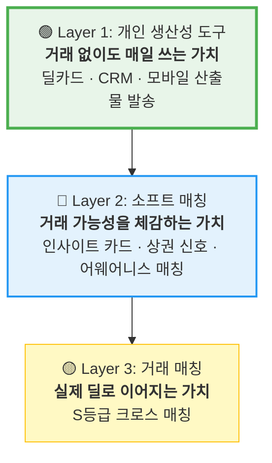

# PoC 활성화 모델 재설계 — "거래 이전의 가치"

> **핵심 전환**: "20인에서 거래 매칭이 일어나길 기대"  
> → "거래 없이도 매일 쓰는 개인 생산성 도구 + 소프트 매칭으로 거래 가능성 체감"

---

## 1. 20인 풀의 통계적 현실

### 매칭 확률 시뮬레이션

```
매물 풀: 20인 × 5건 = 100건
의향서 풀: 20인 × 3건 = 60건
전수 대조: 100 × 60 = 6,000쌍

서울 꼬마빌딩 거래 조건 필터:
 - 권역 일치: 8개 권역 중 동일 확률 ~20%     → 1,200쌍
 - 가격대 일치: ±20% 범위 중첩 확률 ~30%       → 360쌍
 - 자산 유형 일치: 5개 중 동일 확률 ~40%        → 144쌍
 - 세부 조건 적합: 면적/층수/용도 ~25%          → 36쌍

예상 S등급 (90점+): 2~5건
예상 A등급 (75점+): 5~12건
```

> ⚠️ **S등급 2~5건으로는 "거래 활성화" 체감 불가능.** 8주 내 실제 계약까지 가는 건은 0~1건이 현실적.

### 결론

**"거래 매칭"을 PoC 성공 기준으로 삼으면 실패한다.**  
대신 3개 레이어로 가치를 쌓아야 한다:



---

## 2. Layer 1: 개인 생산성 도구 (거래 불필요)

> **목표**: "이 앱 없으면 불편하다"를 만드는 **개인 유틸리티**

### 2-1. 카톡 메모 → 전문가 산출물 즉시 생성

| 산출물 | 현재 기능 | 고객 발송 시나리오 |
|--------|----------|-----------------|
| **블라인드 딜카드** | ✅ 60초 생성, 카톡 복사 | 매수 고객에게 "새 매물 나왔습니다" 카톡 발송 |
| **임대 블라인드 카드** | ✅ 60초 생성, 카톡 복사 | 임차 고객에게 "조건 맞는 공간 나왔어요" 발송 |
| **AI 리싱 페이지 URL** | ✅ 공개 URL 생성 | 임차 고객에게 링크 전달 → 문의 자동 수집 |
| **브로커 명함 카드** | ✅ 5가지 타입 생성 | 신규 고객에게 디지털 명함 발송 |
| **시장 Pulse 리포트** | ✅ 권역별 주간 분석 | 고객에게 "이번 주 성수 시장 동향" 공유 |

**핵심 소구**: "카톡으로 받은 매물 정보를 1분 만에 **고객에게 보낼 수 있는 전문 자료**로 변환"

### 2-2. 모바일 CRM — "고객 카드 한 장으로 관리"

| 기능 | 활용 | 시스템 기능 |
|------|------|-----------|
| **고객 등록** | 카톡 대화 → 이름/전화/관심 조건 입력 | `/broker/clients/new` |
| **의향서 연결** | 고객별 매수/임차 희망 조건 구조화 | `/broker/buyer-intents/new` |
| **이력 추적** | 어떤 매물을 보여줬고 반응은 어땠는지 | `client_contacts` |
| **티어 분류** | VIP/일반/잠재/휴면 자동·수동 분류 | `broker_clients.tier` |

**핵심 소구**: "수첩/메모장 대신, 고객별로 뭘 찾는지·뭘 보여줬는지 한눈에"

### 2-3. 개인 대시보드 — "내 성과 한눈에"

| 지표 | 표시 | 시스템 |
|------|------|--------|
| 이번 달 딜카드 생성 수 | 12건 | `building_ssot_lite` count |
| 관리 고객 수 | 35명 | `broker_clients` count |
| 매칭 대기 건 | 8건 | `match_results` count |
| 파이프라인 진행 딜 | 3건 | `deal_pipeline_states` |

### Layer 1 성공 KPI

| 지표 | 목표 | 측정 |
|------|------|------|
| 주간 딜카드 생성 | 인당 3건+ | `ai_runs` |
| 카톡 복사 횟수 | 인당 주 5회+ | 복사 버튼 클릭 이벤트 |
| CRM 고객 등록 | 인당 10명+ (4주 내) | `broker_clients` |
| 모바일 접속 빈도 | 주 4일+ | `activity_events` |

---

## 3. Layer 2: 소프트 매칭 (거래 가능성 체감)

> **목표**: S등급 거래 매칭이 아니라, **"이런 수요가 있구나"를 체감**하는 인사이트

### 3-1. 큐레이션 인사이트 카드

**거래 매칭과 다른 점**: "이 매수자와 거래하세요"가 아니라 "당신의 매물 근처에 이런 움직임이 있습니다"

| 인사이트 유형 | 예시 | 데이터 소스 |
|-------------|------|-----------|
| **수요 신호** | "성수동 30~50억대 매수 의향 3건 등록됨" | `buyer_intent_lite` 집계 |
| **공급 동향** | "이번 주 GBD 신규 매물 5건 (가격대: 20~40억)" | `building_ssot_lite` 주간 신규 |
| **가격 기준점** | "성수동 꼬마빌딩 최근 등록 평균가 38.5억" | `building_ssot_lite` 평균 |
| **경쟁 매물** | "당신의 매물과 유사한 조건 매물 2건 존재" | SSoT 유사도 비교 |
| **수요-공급 갭** | "강남 50억 이상 매수 수요 8건 vs 매물 2건 (공급 부족)" | 크로스 집계 |

**핵심 소구**: "거래는 아직이지만, **내 매물이 시장에서 어떤 위치인지** 알 수 있다"

### 3-2. B/C등급 어웨어니스 매칭

기존 매칭은 S/A 등급만 강조했지만, **20인 풀에서는 B/C등급이 더 많은 가치를 제공**:

| 등급 | 기존 해석 | 소프트 매칭 재해석 |
|------|----------|-----------------|
| **S등급** (90+) | 즉시 거래 후보 | (희소) 즉시 알림 |
| **A등급** (75+) | 높은 적합도 | "조건 조율하면 가능한 후보" |
| **B등급** (50+) | 참고 가능 | ⭐ **"이런 수요가 근처에 있음" — 상권 감각 제공** |
| **C등급** (30+) | 매칭 미흡 | ⭐ **"관심 권역은 같음" — 네트워크 인지** |

**B/C등급 활용 시나리오**:

```
[기존] B등급 매칭 카드 → "매칭 미흡" → 무시
[소프트] B등급 매칭 카드 → 
  "박OO 중개인의 고객이 성수동 40억대 오피스를 찾고 있습니다.
   당신의 매물(성수동 55억 근생)과 가격대는 다르지만, 
   같은 권역에 매수 수요가 있음을 참고하세요."
  → 가격 조율 가능성 / 다른 매물 제안 가능성 인지
```

### 3-3. 주간 개인 매칭 리포트 (Push)

매주 월요일 각 중개인에게 개인화된 요약 발송:

```
━━━━━━━━━━━━━━━━━━━
📊 김동현님의 이번 주 DealCard 리포트
━━━━━━━━━━━━━━━━━━━

📋 내 매물 현황
 · 등록 매물: 8건 (신규 2건)
 · 마켓플레이스 공개: 3건

🎯 매칭 시그널
 · S/A등급 매칭: 1건 ← 확인 필요!
 · B등급 (관심 권역 수요): 4건
 · 내 매물 권역 총 매수 수요: 12건

👥 고객 현황
 · 관리 고객: 28명
 · 이번 주 신규 의향서: 2건
 · 14일+ 미연락 고객: 3명 ⚠️

📈 시장 동향
 · 성수 Pulse: 78/100 (수요 강세)
 · GBD 신규 매물: 5건 (전주 대비 +2)
━━━━━━━━━━━━━━━━━━━
```

### 3-4. "내 고객에게 보낼 매물" 큐레이션

중개인의 매수 고객 의향서를 기반으로, **사내 다른 중개인의 매물 중 관련 있는 것을 큐레이션**:

```
[기존] 매칭 보드에서 내가 직접 찾아야 함
[소프트] "김사장님(매수, GBD 30~50억)에게 보여줄 만한 매물 3건이 있습니다"
  → 원클릭으로 블라인드 카드를 김사장님에게 카톡 발송
```

| 흐름 | 동작 |
|------|------|
| ① AI 큐레이션 | 내 고객 의향서 ↔ 사내 전체 매물 소프트 매칭 |
| ② 카드 생성 | 관련 매물의 블라인드 카드 자동 생성 |
| ③ 발송 | 카톡 복사 → 고객에게 전달 |
| ④ 반응 추적 | 고객 반응 기록 (관심/무관심/조건 변경) |

**핵심 소구**: "내 고객에게 보여줄 만한 매물을 AI가 매주 골라줍니다"

### Layer 2 성공 KPI

| 지표 | 목표 | 의미 |
|------|------|------|
| 인사이트 카드 열람율 | 70%+ | "시장 감각 도구"로 인식 |
| B/C등급 매칭 열람 | 주 2회+ | 소프트 매칭 가치 체감 |
| 큐레이션 → 고객 발송 | 주 1회+ | 고객 관리에 실제 활용 |
| 주간 리포트 오픈율 | 80%+ | 정보 의존도 형성 |

---

## 4. Layer 3: 거래 매칭 (보너스)

> **목표**: "일어나면 대박, 안 일어나도 Layer 1+2로 충분한 가치"

### 거래 매칭 발생 시 극대화 전략

S등급 매칭이 발생하면 **최대한 드라마틱하게 체감**시킴:

```
🔔 긴급 매칭 알림!
━━━━━━━━━━━━━━━━━
⭐ S등급 매칭 (92점)

📋 매물: 성수동 12층 근생 (김동현 중개인)
🎯 매수자: 임대수익 목적, 예산 35억 (박서영 중개인의 고객)

✅ 권역 일치: 성수
✅ 가격대 일치: 매물 38억 vs 예산 35억 (갭 8.6%)
✅ 자산유형 일치: 근생
✅ 투자목적 부합: 임대수익

👉 김동현 ↔ 박서영 미팅을 잡으세요!
━━━━━━━━━━━━━━━━━
```

**하지만 Layer 3는 PoC 성공의 필수 조건이 아님.**

---

## 5. 재설계된 PoC 성공 기준

### Before (기존)

| 기준 | 문제 |
|------|------|
| S등급 매칭 → 미팅 전환 25% | ❌ S등급 자체가 2~5건뿐 |
| 크로스 매칭 비율 60% | ❌ 전체 매칭 건수가 적어 의미 없음 |
| 딜 체류일수 단축 | ❌ 실제 거래 진행이 있어야 측정 가능 |

### After (재설계)

| 레이어 | 지표 | 성공 기준 | 측정 |
|--------|------|----------|------|
| **L1 생산성** | 주간 딜카드 생성 | 인당 3건+ | `ai_runs` count |
| **L1 생산성** | 카톡 산출물 발송 | 인당 주 5회+ | 복사 버튼 클릭 |
| **L1 CRM** | CRM 고객 등록 | 인당 10명+ (누적) | `broker_clients` |
| **L1 습관** | 주 4일+ 접속 | 70% (14/20) | DAU |
| **L2 인사이트** | 인사이트 카드 열람 | 70%+ 열람율 | 클릭 이벤트 |
| **L2 큐레이션** | 큐레이션 → 고객 발송 | 주 1회+/인 | 발송 이벤트 |
| **L2 매칭** | B등급+ 매칭 열람 | 50%+ 열람율 | 클릭 이벤트 |
| **L3 거래** | S/A등급 매칭 발생 | 5건+ (8주) | `match_results` |
| **종합** | NPS | ≥ 40 | 4주/8주 설문 |
| **종합** | Sean Ellis | "매우 실망" ≥ 40% | 8주 설문 |

---

## 6. 수정된 8주 타임라인

| 주차 | 초점 레이어 | 핵심 행동 | 검증 |
|------|-----------|----------|------|
| **W1** | L1 생산성 | 전원 온보딩 + 실제 카톡 메모로 딜카드 5건 생성 | 파싱 정확도, 첫 체험 만족도 |
| **W2** | L1 CRM | 기존 고객 10명씩 CRM 등록 + 의향서 연결 | CRM 입력 부담, 데이터 품질 |
| **W3** | L1 산출물 | 블라인드 카드/리싱 페이지를 실제 고객에게 카톡 발송 | 발송 건수, 고객 반응 |
| **W4** | L2 인사이트 | 첫 주간 리포트 발송 + 인사이트 카드 + **NPS 1차** | 열람율, 인사이트 유용성 |
| **W5** | L2 소프트매칭 | B/C등급 어웨어니스 매칭 활성화 + 큐레이션 시작 | 매칭 열람율, 큐레이션 발송 |
| **W6** | L2 고객발송 | "내 고객에게 보낼 매물" 큐레이션 → 실제 발송 | 발송 → 고객 반응 추적 |
| **W7** | L3 거래 | S/A등급 매칭 집중 검토 + 미팅 주선 | 미팅 성사 여부 |
| **W8** | 종합 | **NPS 2차 + Sean Ellis + WTP** | Go/No-Go 판단 |

---

## 7. 기존 시스템 기능과의 매핑

### 이미 구현된 기능 (즉시 활용)

| Layer | 활용 모델 | 기존 기능 | 상태 |
|-------|----------|----------|------|
| L1 | 딜카드 생성 | `/broker/deal-card/new`, `/broker/lease-card/new` | ✅ 완료 |
| L1 | 카톡 복사 발송 | 딜카드 상세 → 카톡 문구 복사 | ✅ 완료 |
| L1 | CRM 고객관리 | `/broker/clients` CRUD | ✅ 완료 |
| L1 | 브로커 명함 | `/broker/my-card/new` | ✅ 완료 |
| L1 | 리싱 페이지 URL | `/leasing/[slug]` | ✅ 완료 |
| L1 | 파이프라인 | `/broker/pipeline` | ✅ 완료 |
| L2 | Pulse 시장 동향 | `/pulse` | ✅ 완료 |
| L3 | S/A/B/C 매칭 | `/broker/matching` | ✅ 완료 |

### 소프트 매칭을 위해 추가 개발 필요

| Layer | 기능 | 구현 방향 | 공수 |
|-------|------|----------|------|
| L2 | 수요 신호 인사이트 카드 | 대시보드에 권역별 수요/공급 집계 위젯 추가 | 2~3일 |
| L2 | B/C등급 어웨어니스 UI | 매칭 보드에 B/C등급 "인사이트 뷰" 탭 추가 | 2일 |
| L2 | 주간 개인 리포트 | cron API + 이메일/카톡 발송 | 3~4일 |
| L2 | "내 고객에게 보낼 매물" 큐레이션 | 고객 상세 → 관련 매물 추천 섹션 | 3~4일 |
| L2 | 큐레이션 → 카톡 발송 | 추천 매물 블라인드 카드 → 카톡 복사 | 1~2일 |

> **총 추가 개발**: 약 **2주** (Layer 2 소프트 매칭 기능)

---

## 8. 핵심 전략 요약

```
┌─────────────────────────────────────────────────────┐
│  20인 PoC의 진짜 검증 대상은 "거래"가 아니라         │
│  "이 도구 없이는 불편한 일상"을 만들 수 있느냐       │
│                                                     │
│  Layer 1: 매일 쓰는 개인 도구 (거래 불필요)          │
│    → "카톡 복붙 → 전문 산출물 → 고객 발송"           │
│    → "고객 정보가 한곳에 쌓이니 편하다"              │
│                                                     │
│  Layer 2: 시장 감각 + 소프트 매칭 (거래 불필요)      │
│    → "내 매물 근처에 이런 수요가 있구나"              │
│    → "내 고객에게 보여줄 매물을 AI가 골라주네"        │
│                                                     │
│  Layer 3: 실제 거래 매칭 (보너스)                    │
│    → 일어나면 대박. 안 일어나도 L1+L2로 충분.        │
└─────────────────────────────────────────────────────┘
```
