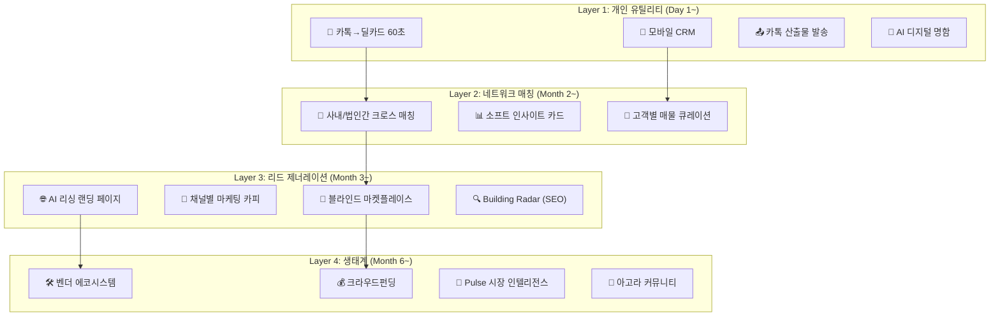

# CRE DealCard Hub — 플랫폼 전략 & GTM

> **초기 자원**: JS부동산 200인 + 서울 일반 중개인 200인 = **400인 시드 풀**  
> **도메인**: 서울 상업용 부동산 (꼬마빌딩 → 중소형 빌딩 → 전 자산유형)

---

## 1. 플랫폼 정체성 — "중개인의 AI 운영 시스템"

### 포지셔닝 맵

```
                    개인 생산성 ←─────────────→ 네트워크/마켓플레이스
                         │                              │
               ┌─────────┼──────────┐                   │
               │ 직방프로  │ 네이버부동산│                   │
               │(리스팅 도구)│(포털 광고) │                   │
               └─────────┼──────────┘                   │
                         │                              │
                    ┌────┴─────────────────────────┐    │
                    │  ⭐ DealCard Hub              │    │
                    │  "AI 중개인 OS"               │    │
                    │  개인 도구 + 네트워크 매칭     │    │
                    │  + 고객 획득 엔진              │    │
                    └────┬─────────────────────────┘    │
                         │                              │
               ┌─────────┼──────────┐          ┌───────┼────────┐
               │ 한방     │ 부동산써브│          │ 상업용 부동산   │
               │(거래 DB) │(시세 정보)│          │ 마켓플레이스   │
               └─────────┼──────────┘          └───────┼────────┘
                         │                              │
                    AI 미약 ←─────────────→ AI 네이티브
```

### 한 문장 정의

> **"카톡 메모 하나로 시작해서, 매물 관리 · 고객 확보 · 딜 매칭 · 마케팅까지 — 중개인의 모든 업무를 AI가 운영하는 모바일 플랫폼"**

### 네이밍 프레임

| 레벨 | 메시지 | 용도 |
|------|--------|------|
| **태그라인** | "카톡 한 번, AI가 일합니다" | 광고/첫 화면 |
| **엘리베이터 피치** | "중개인이 카톡으로 받은 매물 정보를 60초 만에 AI 딜카드로 변환하고, 400명 동료의 고객과 자동 매칭하고, 공개 리싱 페이지로 신규 리드를 확보하는 플랫폼" | 투자자/파트너 |
| **경쟁 프레임** | "직방프로가 리스팅 도구라면, DealCard Hub는 **AI 기반 딜 운영 시스템**" | 비교 설명 |

---

## 2. 4개 사업 레이어와 구현 순서



### Layer별 비즈니스 가치

| Layer | 사용자 가치 | 비즈니스 가치 | 데이터 가치 |
|-------|-----------|-------------|-----------|
| **L1** 개인 도구 | 시간 절감, 전문성 표현 | DAU/습관 형성 → 전환 기반 | 매물 SSoT 축적, 고객 DB |
| **L2** 네트워크 | 매칭 기회 확대, 시장 감각 | 네트워크 효과 → 진입 장벽 | 매칭 그래프, 수요 패턴 |
| **L3** 리드젠 | 신규 고객 유입, 마케팅 자동화 | 리드당 과금 가능 | 수요 의도 데이터 |
| **L4** 생태계 | 거래 후 서비스 연결 | 거래 수수료, 구독 | 전체 거래 가치 사슬 |

---

## 3. GTM 3단계 — 400인 시드 활용

### Phase 1: Seed (Month 1~3) — "도구로 들어와서 네트워크에 묶인다"

```
목표: 400인 DAU 60%+ (240인 주 4일+ 접속)
전략: Layer 1 무료 배포 → Layer 2 자연 전환
```

| 액션 | JS부동산 200인 | 일반 중개인 200인 |
|------|--------------|----------------|
| **진입점** | 법인 단위 배포, 대표 승인 | 개인 가입, 지인 추천 |
| **온보딩** | 현장 교육 (2시간) | 셀프 온보딩 + 영상 가이드 |
| **초기 행동** | 매물 5건 + 고객 10명 등록 | 딜카드 3건 생성 |
| **활성화 훅** | "동료 매칭 알림" | "카톡 산출물이 전문적" |
| **가격** | 무료 (전 기능) | 무료 (L1+L2), L3 일부 제한 |

#### 바이럴 메커니즘

```
중개인 A가 블라인드 카드를 카톡으로 고객에게 발송
  → 고객이 "이거 어떤 시스템으로 만들었어요?" 질문
  → 중개인 A의 동료/지인 중개인이 관심
  → 가입 → 자기 매물 등록 → 네트워크 확대

중개인 B가 리싱 페이지 URL을 인스타에 게시
  → 잠재 임차인이 페이지 방문 → 문의
  → 중개인 B: "문의가 알아서 CRM에 들어오네!"
  → 사례 공유 → 바이럴
```

### Phase 2: Growth (Month 4~9) — "네트워크가 가치를 만든다"

```
목표: 1,000인+ 등록, MAU 60%, 법인 10개+
전략: 법인간 블라인드 매칭 네트워크 개방
```

| 액션 | 내용 |
|------|------|
| **법인 확장** | JS 이외 서울 CRE 법인 10개 영업 (각 20~50인) |
| **법인간 매칭** | 법인 A 매물 ↔ 법인 B 매수자 블라인드 매칭 |
| **과금 시작** | L3(리싱 페이지, 마켓플레이스 프리미엄) 유료 전환 |
| **리드젠 증명** | "월 30건+ 문의 유입" 사례 → 영업 무기 |
| **SEO 자산** | 리싱 페이지 + Pulse + 인사이트 → 검색 트래픽 |

#### 네트워크 효과 곡선

```
참여자 수 vs 매칭 가치:

  400인 (Seed)   → 매물 1,000건 × 의향 600건 = 느슨한 매칭
  1,000인         → 매물 3,000건 × 의향 2,000건 = 의미 있는 매칭
  3,000인         → 매물 10,000건 × 의향 7,000건 = 강력한 매칭 (임계점)
  ─────────────────────────────────────────────────────────
  임계점 이후: "여기에 없으면 기회를 놓친다" → 자발적 유입
```

### Phase 3: Scale (Month 10~18) — "데이터가 해자를 만든다"

```
목표: 3,000인+, 경기/인천 확장, 연매출 ₩30억+
전략: 데이터 네트워크 효과 + 생태계 수익
```

| 수익원 | 모델 | 예상 단가 |
|--------|------|----------|
| **SaaS 구독** | 법인 월정액 / 개인 월정액 | ₩50만/법인 or ₩5만/인 |
| **리드젠 수수료** | 리싱 페이지 문의 → 중개인 연결 | ₩3~5만/건 |
| **마켓플레이스 프리미엄** | 마켓 상위 노출, 추가 게이트 해제 | ₩10만/월 |
| **벤더 광고** | 서비스 카드 상위 노출 | ₩30만/월 |
| **크라우드펀딩** | 프로젝트 매칭 수수료 | 모집액의 1~2% |
| **데이터 리포트** | Pulse 프리미엄 구독 | ₩10만/월 |

---

## 4. 수익 모델 3단계 진화

### Stage 1: 무료 → 습관 형성 (Month 1~6)

```
전 기능 무료 → DAU 확보 → 데이터 축적
수익: ₩0 (투자금 소진)
목표: MAU 400인+, 딜카드 5,000건+
```

### Stage 2: 프리미엄 전환 (Month 7~12)

| 무료 (Basic) | 유료 Pro (₩5만/월) | 유료 Team (₩50만/월) |
|-------------|-------------------|---------------------|
| 딜카드 월 10건 | 딜카드 무제한 | 법인 전원 무제한 |
| 매칭 B/C등급 | 매칭 S/A등급 우선 | 법인간 크로스 매칭 |
| CRM 50명 | CRM 무제한 | CRM + 팀 공유 |
| — | 리싱 페이지 5개 | 리싱 페이지 무제한 |
| — | 캠페인 카피 | 관리자 대시보드 |

### Stage 3: 거래 연동 수익 (Month 13~)

```
리드젠 수수료 + 벤더 마켓플레이스 + 데이터 상품
→ 거래 가치 사슬의 각 단계에서 수수료 수취
→ TAM: 서울 CRE 중개 수수료 시장 ₩2.1조의 1~3% = ₩200~630억
```

---

## 5. 경쟁 분석 & 해자(Moat)

### 직접 경쟁

| 경쟁사 | 강점 | 약점 | DealCard 차별화 |
|--------|------|------|----------------|
| **직방프로** | 리스팅 DB, 브랜드 | 주거 중심, AI 미약 | 상업용 특화 + AI 네이티브 |
| **네이버부동산** | 트래픽, 검색 | 중개인 도구 아님, CRE 미약 | 중개인 업무 도구 + CRM |
| **부동산써브** | 시세 DB, B2B | UI 노후, 매칭 없음 | 모바일 퍼스트 + AI 매칭 |
| **한방** | CRE 거래 DB | 정보 조회만, 도구 아님 | 입력→분석→매칭→마케팅 풀스택 |

### 구축할 해자

| 해자 유형 | 구체적 자산 | 축적 기간 |
|----------|-----------|----------|
| **데이터 네트워크** | 매물 SSoT + 매수 의향 + 매칭 그래프 | 6개월+ |
| **전환 비용** | CRM 고객 데이터 + 파이프라인 이력 | 3개월+ |
| **AI 품질** | 도메인 특화 파싱/매칭 모델 (피드백 루프) | 12개월+ |
| **브랜드** | "CRE 중개인의 AI 파트너" 인식 | 12개월+ |
| **생태계** | 벤더 네트워크 + 투자자 풀 | 18개월+ |

---

## 6. 400인 시드 풀 전략적 활용

### JS부동산 200인 (캡티브 유저)

| 역할 | 활용 |
|------|------|
| **Product-Market Fit 검증** | 가장 밀착된 피드백 루프. 주간 VOC 수집. |
| **데이터 Cold Start 해소** | 200인 × 5매물 = 1,000건 매물 풀 즉시 확보 |
| **사례 생성** | "JS법인 매칭 성공 사례" → 외부 법인 영업 무기 |
| **기능 우선순위** | 실사용 데이터 기반 기능 개발 |

### 일반 중개인 200인 (오가닉 유저)

| 역할 | 활용 |
|------|------|
| **바이럴 채널** | 각자의 중개인 네트워크로 확산 |
| **비캡티브 리텐션 검증** | 강제 아닌 자발적 사용 유지율 → 진짜 PMF |
| **법인간 매칭 테스트** | JS ↔ 일반 중개인 간 크로스 매칭 |
| **WTP 검증** | 유료 전환 의향 → 가격 민감도 측정 |

### 크로스 매칭 네트워크 효과

```
JS 200인 (매물 중심)  ←──────→  일반 200인 (매수자 중심)

JS 중개인: 매도인 위탁 매물이 많음 (공급)
일반 중개인: 매수 고객이 많음 (수요)

→ 양측이 서로의 부족한 쪽을 보완
→ 블라인드 크로스 매칭으로 연결
→ "이 플랫폼에 있어야 기회가 온다"
```

---

## 7. 핵심 지표 대시보드

### 스타트업 핵심 지표 (투자자 관점)

| 지표 | Month 3 | Month 6 | Month 12 |
|------|---------|---------|----------|
| **등록 중개인** | 400 | 1,000 | 3,000 |
| **MAU** | 240 (60%) | 600 (60%) | 1,800 (60%) |
| **딜카드 누적** | 3,000 | 15,000 | 60,000 |
| **매칭 누적** | 500 | 5,000 | 50,000 |
| **리싱 페이지** | 50 | 500 | 3,000 |
| **월 리드 유입** | 30 | 300 | 2,000 |
| **MRR** | ₩0 | ₩500만 | ₩5,000만 |
| **ARR** | — | ₩6,000만 | **₩6억** |
