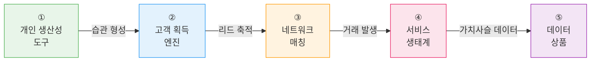
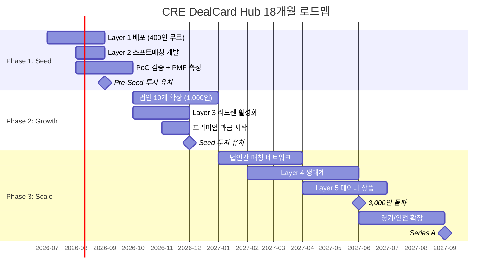

# CRE DealCard Hub — 성장 전략 & 가치 극대화

> **전제**: 초기 400인(JS 200 + 일반 200) 무료/저가 배포 → 18개월 내 시리즈A

---

## 1. 5대 사업 포텐셜 구현 로드맵

### 전체 진화 경로



---

### ① 개인 생산성 도구 (Month 1~3)

> "중개인 1인이 혼자서도 쓸모 있는 가치"

| 기능 | 기존 구현 | 추가 필요 | 소구 |
|------|----------|----------|------|
| 카톡→딜카드 60초 | ✅ 완료 | — | "30분 → 1분" |
| 블라인드 카드 카톡 발송 | ✅ 완료 | — | "전문가 느낌" |
| CRM 고객관리 | ✅ 완료 | 고객별 활동 타임라인 | "수첩 졸업" |
| 의향서 구조화 | ✅ 완료 | — | "고객 조건 잊지 않기" |
| 디지털 명함 | ✅ 완료 | — | "첫인상 차별화" |
| 파이프라인 추적 | ✅ 완료 | — | "내 딜 현황 한눈에" |
| **개인 주간 리포트** | ❌ 미구현 | Push 알림/이메일 리포트 | "매주 내 성과 확인" |

**핵심 KPI**: DAU 60%+, 주간 딜카드 3건+/인

---

### ② 고객 획득 엔진 (Month 2~6)

> "중개인에게 신규 고객을 만들어주는 가치"

| 기능 | 기존 구현 | 추가 필요 | 소구 |
|------|----------|----------|------|
| AI 리싱 페이지 | ✅ 완료 (5단계 위저드) | — | "내 매물 랜딩 페이지" |
| 문의→CRM 자동 등록 | ✅ 완료 | — | "리드가 알아서 쌓임" |
| 4채널 마케팅 카피 | ✅ 완료 | — | "카카오/네이버/인스타 한 번에" |
| 마켓플레이스 공개 | ✅ 완료 (is_marketplace_listed) | SEO 최적화 | "외부 노출" |
| Building Radar | ✅ 완료 | — | "검색 유입" |
| **고객별 매물 큐레이션** | ❌ 미구현 | 의향서 ↔ 매물 추천 위젯 | "고객에게 보낼 매물 AI 추천" |
| **리드 스코어링** | ❌ 미구현 | 문의 이력 기반 점수화 | "뜨거운 리드 우선 연락" |

**핵심 KPI**: 월 리드 유입 건수, 리싱 페이지 → 문의 전환율

---

### ③ 네트워크 매칭 (Month 3~9)

> "혼자가 아니라 400인 네트워크와 연결되는 가치"

| 기능 | 기존 구현 | 추가 필요 | 소구 |
|------|----------|----------|------|
| AI 3단계 매칭 (S/A/B/C) | ✅ 완료 | — | "자동 대조" |
| 매칭 보드 | ✅ 완료 | — | "한눈에 매칭 결과" |
| **소프트 인사이트 카드** | ❌ 미구현 | 권역별 수요/공급 집계 위젯 | "시장 감각" |
| **B/C등급 어웨어니스** | ❌ 미구현 | 매칭 보드 인사이트 뷰 | "느슨한 수요 인지" |
| **법인간 블라인드 매칭** | ❌ 미구현 | 법인 격리 + 선택적 공개 | "타 법인과 안전하게 연결" |
| **매칭 피드백 루프** | ❌ 미구현 | 매칭 카드 👍/👎 | "AI 정확도 개선" |

**핵심 KPI**: 크로스 매칭 비율, 매칭→미팅 전환율

---

### ④ 서비스 생태계 (Month 6~12)

> "거래 전후 필요한 서비스가 연결되는 가치"

| 기능 | 기존 구현 | 추가 필요 | 소구 |
|------|----------|----------|------|
| 벤더 프로필 | ✅ 완료 | 벤더 온보딩 프로세스 | "믿을 수 있는 서비스 업체" |
| 서비스 카드 | ✅ 완료 | — | "인테리어/법무/세무 연결" |
| 서비스 매칭 | ✅ 완료 | — | "딜 단계에 맞는 추천" |
| 벤더 구독 | ✅ 완료 | 결제 연동 | "B2B 수익" |
| 크라우드펀딩 | ✅ 완료 | 규제 검토 | "소액 투자 연결" |
| **거래 완료 후 자동 벤더 추천** | ❌ 미구현 | 파이프라인 closed → 벤더 제안 | "한 플랫폼 내 원스톱" |

**핵심 KPI**: 벤더 등록 수, 서비스 매칭 건수, 벤더 구독 MRR

---

### ⑤ 데이터 상품 (Month 12~)

> "축적된 데이터 자체가 가치가 되는 단계"

| 상품 | 데이터 소스 | 타깃 고객 |
|------|-----------|----------|
| **Pulse 프리미엄** | `cre_pulses` + 매칭 그래프 | 기관 투자자, 자산운용사 |
| **수요 트렌드 리포트** | 의향서 집계, 검색 패턴 | 디벨로퍼, 건물주 |
| **가격 예측** | `building_price_predictions` | 감정평가사, 금융기관 |
| **권역별 공실률** | 리싱 페이지 + 마켓플레이스 | 리서치 기관 |

---

## 2. 추가 개발 우선순위 매트릭스

| 기능 | 사업 임팩트 | 개발 공수 | 우선순위 |
|------|-----------|----------|---------|
| 개인 주간 리포트 (Push) | ★★★★★ | 3~4일 | **P0** |
| 고객별 매물 큐레이션 | ★★★★★ | 3~4일 | **P0** |
| 소프트 인사이트 카드 | ★★★★☆ | 2~3일 | **P1** |
| B/C등급 어웨어니스 뷰 | ★★★★☆ | 2일 | **P1** |
| 매칭 피드백 (👍/👎) | ★★★★☆ | 1~2일 | **P1** |
| 리드 스코어링 | ★★★☆☆ | 3~4일 | **P2** |
| 법인간 블라인드 매칭 | ★★★★★ | 1~2주 | **P2** |
| 거래 완료→벤더 자동 추천 | ★★★☆☆ | 2~3일 | **P3** |

> **P0 (2주 내)** → P1 (1개월 내) → P2 (3개월 내) → P3 (6개월 내)

---

## 3. 투자 유치 스토리라인

### Pre-Seed (Now ~ Month 3)

```
[상태] 제품 완성 + 400인 PoC 진행 중
[Ask]  ₩3~5억
[용도] 팀 빌딩(엔지니어 2명) + 서버 비용 + PoC 운영
[증명] DAU 60%, NPS 40+, 딜카드 3,000건+
```

### Seed (Month 4~9)

```
[상태] PMF 검증 완료, 1,000인 확보, MRR 시작
[Ask]  ₩10~15억
[용도] 영업팀 + 마케팅 + 법인 확장 + AI 고도화
[증명] MAU 600+, MRR ₩500만+, 법인 10개+, 리드젠 실증
```

### Series A (Month 10~18)

```
[상태] 3,000인+, ARR ₩6억+, 네트워크 효과 입증
[Ask]  ₩50~100억
[용도] 전국 확장 + 데이터 상품 + 생태계 + 해외(동남아)
[증명] MAU 1,800+, ARR ₩6억+, 법인 30개+, 거래 연동 실증
```

### 투자자 핵심 어필 포인트

| # | 포인트 | 근거 |
|---|--------|------|
| 1 | **PropTech는 주거 중심, 상업용은 블루오션** | 직방/다방 = 주거, CRE 전문 도구 부재 |
| 2 | **양면 네트워크 효과** | 매물↔매수 크로스 매칭 = 규모↑ 가치↑ |
| 3 | **AI 네이티브 = 해자** | 15개 AI 에이전트, 도메인 파인튜닝 가능 |
| 4 | **캡티브 시드 유저 400인** | Day 1부터 유의미한 데이터 축적 |
| 5 | **다중 수익원** | SaaS + 리드젠 + 생태계 + 데이터 |
| 6 | **TAM ₩2.1조** | 한국 CRE 중개 수수료 시장 |

---

## 4. 리스크 & 대응

| 리스크 | 확률 | 영향 | 대응 |
|--------|------|------|------|
| **중개인 정보 공유 저항** | 높음 | 높음 | 블라인드 시스템 + Layer 1 개인 가치로 우회 진입 |
| **AI 파싱 오류 → 신뢰 상실** | 중간 | 높음 | 가드레일 + 수동 확인 단계 + 피드백 루프 |
| **직방/네이버 CRE 진출** | 중간 | 높음 | 선점 효과 + 도메인 깊이 + 전환 비용 |
| **거래 매칭 기대 vs 현실 괴리** | 높음 | 중간 | 소프트 매칭으로 기대치 관리, Layer 1 가치로 보완 |
| **법인 의사결정자 설득** | 중간 | 중간 | JS 성공 사례 → 레퍼런스 세일즈 |
| **AI 비용 급증** | 낮음 | 중간 | 캐싱 + 경량 모델 혼합 + 비용 모니터링 |

---

## 5. 18개월 실행 타임라인



---

## 6. 핵심 전략 요약

```
┌─────────────────────────────────────────────────────┐
│                                                     │
│  정체성: "카톡 한 번, AI가 일합니다"                 │
│  = 중개인의 AI 운영 시스템 (Broker AI OS)            │
│                                                     │
│  GTM: 도구로 들어와서 → 네트워크에 묶이고 →         │
│        리드를 얻고 → 생태계에서 수익                 │
│                                                     │
│  해자: 400인 시드 → 데이터 네트워크 효과 →           │
│        전환 비용 → AI 도메인 깊이                    │
│                                                     │
│  수익: 무료(습관) → 프리미엄(SaaS) →                │
│        거래 연동(수수료) → 데이터(상품)              │
│                                                     │
│  가치: 18개월 내 ARR ₩6억+ → Series A ₩50~100억    │
│                                                     │
└─────────────────────────────────────────────────────┘
```
