# DealCard Hub — SOTA 품질 TDD 프롬프트 세트

> **목적**: SEO/AEO/GEO + UI/UX 관점에서 DealCard Hub를 글로벌 탑티어 수준으로 끌어올리기 위한 **Test-Driven Development 프롬프트 세트**  
> **원칙**: MECE (Mutually Exclusive, Collectively Exhaustive) — 누락 없이, 중복 없이  
> **기준**: 2026 SOTA (Core Web Vitals · E-E-A-T · AI Overviews · GEO Citation · Liquid Glass UI)

---

## MECE 프레임워크

```mermaid
graph TD
  ROOT["DealCard Hub SOTA<br/>TDD 프롬프트 세트"]
  
  ROOT --> A["Pillar A<br/>Technical SEO<br/>(크롤러가 볼 수 있는가?)"]
  ROOT --> B["Pillar B<br/>Structured Data<br/>(LLM이 이해할 수 있는가?)"]
  ROOT --> C["Pillar C<br/>AEO<br/>(답변으로 선택되는가?)"]
  ROOT --> D["Pillar D<br/>GEO<br/>(AI가 인용하는가?)"]
  ROOT --> E["Pillar E<br/>UI/UX 품질<br/>(사용자가 감탄하는가?)"]
  ROOT --> F["Pillar F<br/>Performance<br/>(빠르게 로드되는가?)"]
  ROOT --> G["Pillar G<br/>Accessibility<br/>(누구나 사용하는가?)"]
  
  A --> A1["A1. 크롤/인덱싱"]
  A --> A2["A2. URL 구조"]
  A --> A3["A3. 메타데이터"]
  A --> A4["A4. 내부 링크"]
  
  B --> B1["B1. 엔티티 그래프"]
  B --> B2["B2. 리치 리절트"]
  B --> B3["B3. 신뢰 시그널"]
  
  C --> C1["C1. 질문 매칭"]
  C --> C2["C2. BLUF 콘텐츠"]
  C --> C3["C3. FAQ 허브"]
  
  D --> D1["D1. llms.txt"]
  D --> D2["D2. 인용 가치"]
  D --> D3["D3. 토피컬 오소리티"]
  
  E --> E1["E1. 비주얼 시스템"]
  E --> E2["E2. 인터랙션"]
  E --> E3["E3. 정보 계층"]
  E --> E4["E4. 전환 최적화"]
  
  F --> F1["F1. CWV"]
  F --> F2["F2. 스트리밍/서스펜스"]
  F --> F3["F3. 이미지 최적화"]
  
  G --> G1["G1. WCAG AA"]
  G --> G2["G2. 키보드/스크린리더"]
  G --> G3["G3. 국제화"]
```



---

## 감사 결과 요약 (현재 상태)

| 영역 | 현재 상태 | Gap |
|:---|:---|:---|
| robots.ts | ✅ 존재, /broker/ /api/ /admin/ 차단 | — |
| sitemap.ts | ✅ 8개 콘텐츠 유형 포함 | 변동 빈도 최적화 필요 |
| Schema.org | ✅ 8개 타입 (RealEstateListing, LocalBusiness 등) | FAQPage, HowTo, BreadcrumbList 누락 |
| 메타데이터 | ✅ 모든 주요 페이지에 title/description | canonical, hreflang, OG image 일부 누락 |
| llms.txt | ❌ 없음 | 신규 생성 필요 |
| FAQ Schema | ❌ 없음 | 아고라 데이터로 자동 생성 가능 |
| HowTo Schema | ❌ 없음 | 가이드 페이지에 추가 필요 |
| loading.tsx | ❌ 없음 (공개 경로) | Suspense 경계 필요 |
| error.tsx | ❌ 없음 (공개 경로) | 에러 바운더리 필요 |
| BreadcrumbList | ❌ 없음 | 전 페이지 추가 필요 |
| Design System | ✅ CSS 변수 + 다크모드 | 마이크로 애니메이션 부족 |
| 글래스모피즘 | ⚠️ 부분적 | Liquid Glass 진화 필요 |

---

## Pillar A: Technical SEO (크롤러가 볼 수 있는가?)

### A1. 크롤링 & 인덱싱 인프라

```
TDD-A1-01 │ robots.ts에 AI 크롤러 전용 규칙 추가
─────────────────────────────────────────────────────
현재: userAgent: "*" 하나로 모든 봇 통합 처리
테스트:
  ✅ GPTBot, Google-Extended, anthropic-ai 에이전트에 대해
     /pulse/, /insight/, /agora/ 경로가 Allow 되는가
  ✅ /api/, /admin/, /broker/ 경로는 모든 봇에서 Disallow인가
  ✅ ClaudeBot, PerplexityBot에 대한 명시적 규칙이 있는가
수정 대상: src/app/robots.ts
```

```
TDD-A1-02 │ sitemap.xml 분할 (사이트맵 인덱스)
─────────────────────────────────────────────────────
현재: 단일 sitemap.ts, URL 증가 시 50,000 제한 초과 위험
테스트:
  ✅ URL 수가 50,000개 초과 시 사이트맵이 자동 분할되는가
  ✅ /sitemap/deals.xml, /sitemap/pulse.xml 등
     카테고리별 분리가 가능한가
  ✅ sitemap index가 /sitemap.xml에서 참조되는가
수정 대상: src/app/sitemap.ts → sitemap index 패턴
```

```
TDD-A1-03 │ 캐노니컬 URL 일관성
─────────────────────────────────────────────────────
현재: 일부 페이지만 alternates.canonical 설정
테스트:
  ✅ 모든 공개 페이지에 <link rel="canonical"> 존재하는가
  ✅ 후행 슬래시 유무가 sitemap과 일치하는가
  ✅ searchParams 있는 페이지 (/insight?type=MA)의
     canonical이 파라미터 없는 URL인가
수정 대상: 모든 (public) page.tsx의 metadata.alternates
```

### A2. URL 구조 & 아키텍처

```
TDD-A2-01 │ 3-클릭 이내 전체 콘텐츠 도달
─────────────────────────────────────────────────────
현재: Hub → 카테고리 → 상세 = 3클릭. 일부 4단계 존재
테스트:
  ✅ Hub에서 임의의 딜카드 상세까지 최대 3클릭 이내인가
  ✅ Hub에서 아고라 스레드 상세까지 최대 3클릭 이내인가
  ✅ Hub에서 오이티클 상세까지 최대 3클릭 이내인가
  ✅ Hub에서 서비스카드 상세까지 최대 3클릭 이내인가
검증 방법: 네비게이션 depth 분석 스크립트
```

```
TDD-A2-02 │ BreadcrumbList 구조화 데이터
─────────────────────────────────────────────────────
현재: ❌ BreadcrumbList Schema.org 없음
테스트:
  ✅ /deal/gbd/[id] 페이지에 BreadcrumbList JSON-LD가 있는가
     → Hub > 매매 딜카드 > GBD > [딜카드 제목]
  ✅ /agora/investment/[threadId] 페이지에 존재하는가
     → Hub > 아고라 > 투자 > [질문 제목]
  ✅ /insight/[slug] 페이지에 존재하는가
     → Hub > 인사이트 > [유형] > [제목]
  ✅ /pulse/[region]/[period] 페이지에 존재하는가
     → Hub > 펄스 > [권역] > [주차]
수정 대상: schema-org.ts에 breadcrumb() 헬퍼 추가, 각 페이지 적용
```

### A3. 페이지별 메타데이터 완성도

```
TDD-A3-01 │ OG 이미지 자동 생성
─────────────────────────────────────────────────────
현재: OG 이미지 없음 (텍스트만 og:title, og:description)
테스트:
  ✅ /deal/[region]/[id] → 딜카드 전용 OG 이미지가 생성되는가
     (가격대, 권역, 자산유형 포함 이미지)
  ✅ /insight/[slug] → 오이티클 전용 OG 이미지가 생성되는가
     (제목 + 유형 뱃지)
  ✅ /pulse/[region]/[period] → 펄스 전용 OG 이미지가 있는가
     (펄스 점수 + 트렌드 방향)
수정 대상: next/og (ImageResponse) 기반 동적 OG 이미지 생성
```

```
TDD-A3-02 │ 한국어 + 영어 hreflang 설정
─────────────────────────────────────────────────────
현재: 단일 한국어 버전만 존재
테스트:
  ✅ 모든 공개 페이지 <head>에 hreflang="ko" 기본값 존재하는가
  ✅ x-default가 설정되어 있는가
  ✅ 향후 영문 확장 시 hreflang="en" 추가 준비가 되어 있는가
수정 대상: (public)/layout.tsx metadata
```

### A4. 내부 링크 네트워크 밀도

```
TDD-A4-01 │ 콘텐츠 간 양방향 내부 링크
─────────────────────────────────────────────────────
현재: pulse↔insight 크로스 링크만 존재
테스트:
  ✅ 딜카드 상세 → 관련 아고라 스레드 링크가 있는가
  ✅ 아고라 스레드 → 관련 딜카드 링크가 있는가
  ✅ 오이티클 → 관련 딜카드 + 서비스카드 링크가 있는가
  ✅ 서비스카드 → 관련 아고라 답변 링크가 있는가
  ✅ 펄스 → 관련 오이티클 링크가 있는가
  ✅ 브로커 프로필 → 해당 브로커의 딜카드 목록이 있는가
수정 대상: 각 상세 페이지에 "관련 콘텐츠" 섹션 추가
```

---

## Pillar B: Structured Data (LLM이 이해할 수 있는가?)

### B1. 엔티티 그래프 완성

```
TDD-B1-01 │ Organization 스키마 (사이트 전역)
─────────────────────────────────────────────────────
현재: publisher: { "@type": "Organization", name: "DealCard" } 만 사용
테스트:
  ✅ 루트 레이아웃에 전역 Organization JSON-LD가 있는가
     (name, url, logo, sameAs, contactPoint 포함)
  ✅ sameAs에 공식 SNS 링크가 포함되는가
  ✅ Google Knowledge Panel에 사용 가능한 수준인가
수정 대상: src/app/layout.tsx 또는 (public)/layout.tsx
```

```
TDD-B1-02 │ WebSite + SearchAction 스키마
─────────────────────────────────────────────────────
현재: ❌ 없음
테스트:
  ✅ 루트 페이지에 WebSite + potentialAction: SearchAction이 있는가
  ✅ target URL이 /explore?q={search_term_string} 형태인가
  ✅ Google 사이트링크 검색 박스가 유도되는가
수정 대상: schema-org.ts에 website() 헬퍼 추가
```

### B2. 리치 리절트 확장

```
TDD-B2-01 │ FAQPage 스키마 (아고라 기반)
─────────────────────────────────────────────────────
현재: ❌ 아고라에 FAQPage 스키마 없음
테스트:
  ✅ /agora/[category] 페이지에 FAQPage JSON-LD가 있는가
     (상위 5개 인기 Q&A를 FAQ로 변환)
  ✅ 각 FAQ의 acceptedAnswer가 AI 큐레이션 답변을 포함하는가
  ✅ Google Rich Results Test에서 유효한가
수정 대상: schema-org.ts에 faqFromThreads() 헬퍼, 아고라 페이지 적용
```

```
TDD-B2-02 │ HowTo 스키마 (가이드 페이지)
─────────────────────────────────────────────────────
현재: ❌ HowTo 없음. /guide 페이지 존재
테스트:
  ✅ /guide 페이지에 HowTo JSON-LD가 있는가
     ("블라인드 딜카드로 안전하게 매물 탐색하는 방법")
  ✅ step[].text가 명확한 단계별 설명을 포함하는가
  ✅ Google Rich Results Test에서 유효한가
수정 대상: schema-org.ts에 howTo() 헬퍼, guide 페이지 적용
```

```
TDD-B2-03 │ Speakable 스키마 (음성 검색 대응)
─────────────────────────────────────────────────────
현재: ❌ 없음
테스트:
  ✅ 오이티클 상세 페이지에 speakable 속성이 있는가
     (제목 + excerpt를 음성으로 읽을 수 있는 CSS 셀렉터 지정)
  ✅ 펄스 상세 페이지의 summary_ko가 speakable인가
수정 대상: insight/[slug], pulse/[region]/[period] 페이지
```

### B3. 신뢰 시그널

```
TDD-B3-01 │ AggregateRating 스키마 확장
─────────────────────────────────────────────────────
현재: ✅ 서비스카드에만 AggregateRating 존재
테스트:
  ✅ 중개인 프로필에 AggregateRating이 있는가 (거래 성사 건수 기반)
  ✅ 서비스카드의 ratingValue가 실제 데이터와 일치하는가
  ✅ reviewCount가 0인 경우 스키마가 생략되는가
수정 대상: schema-org.ts brokerProfile() 함수
```

---

## Pillar C: AEO (답변으로 선택되는가?)

### C1. 질문 매칭 & 답변 구조

```
TDD-C1-01 │ BLUF(Bottom Line Up Front) 콘텐츠 패턴
─────────────────────────────────────────────────────
현재: 오이티클 본문이 자유 형식 마크다운
테스트:
  ✅ AI 생성 오이티클의 첫 문단이 핵심 결론을 담고 있는가
     (300자 이내, 질문에 대한 직접 답변)
  ✅ 펄스 summary_ko가 "이번 주 [권역] 시장은 [결론]" 패턴인가
  ✅ 아고라 AI 답변이 BLUF 패턴을 따르는가
수정 대상: oiticle-types.ts 프롬프트 템플릿 개선, 
           qis-seed-generator.ts 답변 프롬프트 개선
```

```
TDD-C1-02 │ 롱테일 질문 키워드 타겟팅
─────────────────────────────────────────────────────
현재: 아고라 시드 질문이 자연어 패턴이지만 SEO 최적화 미흡
테스트:
  ✅ 시드 질문 제목이 "상업용 부동산 [지역] [주제] [방법/비교/추천]" 
     형태의 롱테일 키워드를 포함하는가
  ✅ 오이티클 SEO 제목이 검색량 높은 질문형 키워드를 포함하는가
  ✅ 펄스 SEO 제목이 "[권역] 상업용 부동산 시세" 키워드를 포함하는가
수정 대상: qis-seed-generator.ts, oiticle-types.ts 프롬프트
```

### C2. AI Overview 최적화

```
TDD-C2-01 │ 정의+목록+표 콘텐츠 구조
─────────────────────────────────────────────────────
현재: 마크다운 본문이 자유 형식
테스트:
  ✅ 오이티클 MA(시세 분석)에 표(table) 형태 데이터가 포함되는가
  ✅ 오이티클 LG(법률 가이드)에 체크리스트(ul/ol)가 포함되는가
  ✅ 펄스 상세에 5축 시그널이 정의형(dl) 목록으로 표시되는가
  ✅ "한 줄 정의 → 목록 → 상세 설명" 순서를 따르는가
수정 대상: LLM 프롬프트 템플릿에 구조 지시 추가
```

### C3. FAQ 허브

```
TDD-C3-01 │ 카테고리별 FAQ 자동 집약 페이지
─────────────────────────────────────────────────────
현재: ❌ 전용 FAQ 페이지 없음
테스트:
  ✅ /faq 또는 /agora/faq 경로에 FAQ 집약 페이지가 있는가
  ✅ 8개 카테고리별 상위 5개 질문이 자동 수집되는가
  ✅ FAQPage 스키마가 포함되는가
  ✅ 각 FAQ 항목에서 아고라 원본 스레드로 링크되는가
수정 대상: 신규 페이지 (public)/agora/faq/page.tsx
```

---

## Pillar D: GEO (AI가 인용하는가?)

### D1. AI 크롤러 전용 파일

```
TDD-D1-01 │ llms.txt 생성
─────────────────────────────────────────────────────
현재: ❌ 없음
테스트:
  ✅ /llms.txt 경로에서 200 OK 응답하는가
  ✅ 사이트 목적, 주요 데이터셋, API 엔드포인트가 설명되는가
  ✅ "상업용 부동산 블라인드 딜카드 플랫폼"으로 자기 정의하는가
  ✅ 주요 URL 패턴과 콘텐츠 유형이 나열되는가
수정 대상: src/app/llms.txt/route.ts (또는 public/llms.txt)
```

```
TDD-D1-02 │ llms-full.txt 확장 버전
─────────────────────────────────────────────────────
현재: ❌ 없음
테스트:
  ✅ /llms-full.txt에서 상세 데이터 구조가 설명되는가
  ✅ 딜카드 필드(area_signal, price_band 등)의 의미가 명시되는가
  ✅ 오이티클 8유형의 정의가 포함되는가
  ✅ API 응답 형식 예시가 포함되는가
수정 대상: src/app/llms-full.txt/route.ts
```

### D2. 인용 가치 (Citation-Worthiness)

```
TDD-D2-01 │ 고유 데이터 자산 노출
─────────────────────────────────────────────────────
현재: 펄스 점수, 시그널 데이터가 존재하나 메타 태그 부족
테스트:
  ✅ 펄스 페이지에 "DealCard Pulse Score™" 등 고유 지표명이
     명시적으로 정의되어 있는가
  ✅ 오이티클에 "출처: DealCard 파이프라인 데이터 기반"
     인용 가이드가 포함되는가
  ✅ 중개인 프로필에 "DealCard 인증 전문 중개인" 뱃지가 있는가
수정 대상: 각 상세 페이지 본문에 출처 표기 추가
```

```
TDD-D2-02 │ E-E-A-T 시그널 강화
─────────────────────────────────────────────────────
현재: 작성자 정보 최소한
테스트:
  ✅ 오이티클 상세에 작성자 전문성 정보가 표시되는가
     (중개인: 경력/거래 실적, 벤더: 인증/실적, AI: 방법론 설명)
  ✅ "마지막 업데이트: YYYY-MM-DD"가 모든 콘텐츠에 표시되는가
  ✅ 면책 조항이 시세분석/투자분석/법률가이드에 포함되는가
  ✅ about 페이지에 회사/팀 정보가 있는가
수정 대상: 오이티클 상세 페이지, 프롬프트 템플릿
```

### D3. 토피컬 오소리티

```
TDD-D3-01 │ 토픽 클러스터 내부 링크 밀도
─────────────────────────────────────────────────────
현재: 토픽 클러스터 개념 미적용
테스트:
  ✅ "GBD 오피스" 토픽 클러스터:
     /deal/gbd → /pulse/gbd/[w] → /insight/ma-gbd-[date]
     → /agora/investment?region=gbd 연결이 양방향인가
  ✅ 각 토픽 클러스터 내부에 최소 5개 양방향 링크가 있는가
  ✅ 토픽 허브 페이지 (/market/gbd)가 클러스터 진입점인가
수정 대상: 각 페이지에 토픽 기반 관련 콘텐츠 섹션
```

---

## Pillar E: UI/UX 품질 (사용자가 감탄하는가?)

### E1. 비주얼 디자인 시스템

```
TDD-E1-01 │ Liquid Glass 진화
─────────────────────────────────────────────────────
현재: 기본 bg-[#131b2e] 솔리드 카드, backdrop-blur 미사용
테스트:
  ✅ 네비게이션 바에 backdrop-blur(16px) + bg-opacity-80이 적용되는가
  ✅ 모달/시트에 glassmorphism(blur + alpha gradient)이 적용되는가
  ✅ 주요 콘텐츠(가격, CTA)는 솔리드 고대비 컨테이너를 유지하는가
  ✅ 글래스 효과가 텍스트 가독성을 해치지 않는가 (WCAG AA 대비율)
수정 대상: globals.css에 .glass-surface 유틸 클래스, 레이아웃 적용
```

```
TDD-E1-02 │ 색상 팔레트 정교화
─────────────────────────────────────────────────────
현재: bg-[#0b0f19] 다크 테마, 인디고/퍼플/에메랄드 사용
테스트:
  ✅ 5개 콘텐츠 유형에 고유 시그니처 컬러가 일관 적용되는가
     딜카드=블루, 아고라=오렌지, 서비스=에메랄드, 
     펄스=인디고, 인사이트=퍼플
  ✅ 각 색상의 10, 20, 30, 40, 50% opacity 변형이
     CSS 변수로 정의되는가
  ✅ 라이트 모드에서도 동일한 시그니처 컬러가 유지되는가
수정 대상: globals.css :root / [data-theme=dark] 변수
```

```
TDD-E1-03 │ 타이포그래피 스케일
─────────────────────────────────────────────────────
현재: text-[9px] ~ text-xl 인라인 크기 사용, 체계화 미흡
테스트:
  ✅ 타이포 스케일이 CSS 변수로 체계화되어 있는가
     (--text-xs: 10px, --text-sm: 12px, --text-base: 14px,
      --text-lg: 16px, --text-xl: 20px, --text-2xl: 24px)
  ✅ text-[9px] 같은 임의 크기 사용이 0건인가
  ✅ 줄 높이(line-height)가 각 스케일에 맞게 정의되는가
수정 대상: globals.css, 전체 컴포넌트 리팩터링
```

### E2. 마이크로 인터랙션 & 모션

```
TDD-E2-01 │ 스크롤 트리거 애니메이션
─────────────────────────────────────────────────────
현재: hover:scale, transition-all 기본만 존재
테스트:
  ✅ 카드 목록이 스크롤 시 stagger(시차) 페이드인 되는가
  ✅ 펄스 점수 바가 뷰포트 진입 시 0%→N% 애니메이션 되는가
  ✅ 숫자 카운터(딜카드 수, 중개인 수)가 count-up 애니메이션인가
  ✅ 애니메이션이 prefers-reduced-motion을 존중하는가
수정 대상: 훅 useScrollReveal.tsx 확장, IntersectionObserver 기반
```

```
TDD-E2-02 │ 페이지 전환 모션
─────────────────────────────────────────────────────
현재: 즉시 전환 (하드 네비게이션)
테스트:
  ✅ 페이지 간 이동 시 fade-in 전환이 있는가 (200ms)
  ✅ 로딩 상태에서 skeleton/shimmer UI가 표시되는가
  ✅ 뒤로 가기 시 스크롤 위치가 복원되는가
수정 대상: (public)/layout.tsx에 ViewTransition 또는 framer-motion
```

```
TDD-E2-03 │ 피드백 마이크로 인터랙션
─────────────────────────────────────────────────────
현재: ❌ 없음
테스트:
  ✅ "좋아요" 버튼 클릭 시 pulse 효과가 있는가
  ✅ 딜카드 저장 시 체크마크 모핑 애니메이션이 있는가
  ✅ Gate 요청 전송 시 성공 토스트가 슬라이드-인 되는가
  ✅ 에러 발생 시 shake 효과가 있는가
수정 대상: UI 유틸리티 컴포넌트 + CSS keyframes
```

### E3. 정보 계층 구조

```
TDD-E3-01 │ 모바일 우선 Thumb-Zone 설계
─────────────────────────────────────────────────────
현재: 상단 네비게이션만 존재
테스트:
  ✅ 하단 네비게이션 바가 모바일에서 표시되는가
     (Hub/딜카드/아고라/서비스/내정보)
  ✅ 주요 CTA(Gate 요청, 견적 문의)가 하단 1/3 영역에 있는가
  ✅ 스크롤 시 하단 바가 숨겨졌다 나타나는가 (auto-hide)
수정 대상: (public)/layout.tsx에 BottomNav 컴포넌트 추가
```

```
TDD-E3-02 │ Hub 페이지 정보 밀도 최적화
─────────────────────────────────────────────────────
현재: Hero + 카테고리 그리드 + CTA (단순)
테스트:
  ✅ Hub에 "최근 펄스 요약" 실시간 위젯이 있는가
  ✅ Hub에 "인기 아고라 질문 Top 3" 프리뷰가 있는가
  ✅ Hub에 "신규 딜카드 / 서비스카드" 롤링 피드가 있는가
  ✅ 정보 과부하 없이 스캔 가능한 밀도인가 (카드 최대 8개/뷰)
수정 대상: hub/page.tsx 리디자인
```

### E4. 전환 최적화 (CRO)

```
TDD-E4-01 │ CTA 명확성 & 일관성
─────────────────────────────────────────────────────
현재: 각 페이지마다 CTA 스타일/위치 불일치
테스트:
  ✅ 1차 CTA(주 전환)가 모든 페이지에서 동일한 스타일인가
     (bg-white text-slate-900, 또는 bg-blue-500 text-white)
  ✅ 2차 CTA(보조 행동)가 ghost 스타일로 통일되는가
  ✅ CTA 텍스트가 행동 중심인가 ("딜카드 탐색하기" ≠ "더보기")
  ✅ CTA 아이콘이 목적과 일치하는가
수정 대상: 공통 CTA 컴포넌트 작성, 전체 페이지 적용
```

---

## Pillar F: Performance (빠르게 로드되는가?)

### F1. Core Web Vitals

```
TDD-F1-01 │ LCP ≤ 2.5s
─────────────────────────────────────────────────────
현재: 측정 미실시
테스트:
  ✅ /hub 페이지 LCP가 2.5초 이내인가 (모바일 4G)
  ✅ /deal/gbd 페이지 LCP가 2.5초 이내인가
  ✅ /pulse 페이지 LCP가 2.5초 이내인가
  ✅ LCP 엘리먼트가 Hero 텍스트 또는 첫 카드인가
검증 방법: Lighthouse CI, Web Vitals 측정
```

```
TDD-F1-02 │ INP ≤ 200ms
─────────────────────────────────────────────────────
현재: 측정 미실시
테스트:
  ✅ 카테고리 필터 클릭 시 INP가 200ms 이내인가
  ✅ 딜카드 리스트 스크롤 시 INP가 200ms 이내인가
  ✅ 아고라 카테고리 전환 시 INP가 200ms 이내인가
검증 방법: Chrome DevTools Performance, web-vitals 라이브러리
```

```
TDD-F1-03 │ CLS ≤ 0.1
─────────────────────────────────────────────────────
현재: ❌ 로딩 상태 없어 레이아웃 시프트 가능성
테스트:
  ✅ 카드 목록 로딩 시 Skeleton이 실제 크기와 동일한가
  ✅ 이미지 로딩 시 aspect-ratio가 지정되어 있는가
  ✅ 폰트 로딩 시 font-display: swap + size-adjust가 있는가
수정 대상: globals.css, Image 컴포넌트 aspect-ratio
```

### F2. 스트리밍 & 서스펜스

```
TDD-F2-01 │ 공개 경로 loading.tsx 추가
─────────────────────────────────────────────────────
현재: ❌ (public) 경로에 loading.tsx 없음
테스트:
  ✅ /pulse, /insight, /agora, /services, /deal, /hub에
     loading.tsx가 존재하는가
  ✅ loading.tsx가 Skeleton UI를 렌더링하는가 (빈 화면 아님)
  ✅ loading.tsx의 Skeleton 크기가 실제 콘텐츠 크기와 유사한가
수정 대상: 각 경로에 loading.tsx 파일 생성
```

```
TDD-F2-02 │ 공개 경로 error.tsx 추가
─────────────────────────────────────────────────────
현재: ❌ (public) 경로에 error.tsx 없음
테스트:
  ✅ 서버 에러 발생 시 사용자 친화적 에러 화면이 표시되는가
  ✅ "다시 시도" 버튼이 있는가
  ✅ 에러 정보가 Sentry에 전송되는가
수정 대상: (public)/error.tsx, (public)/not-found.tsx
```

### F3. 이미지 & 폰트 최적화

```
TDD-F3-01 │ next/image 최적화
─────────────────────────────────────────────────────
현재: 이미지 사용 최소한
테스트:
  ✅ OG 이미지, 커버 이미지 사용 시 next/image를 경유하는가
  ✅ 이미지에 width/height 또는 fill + sizes가 지정되어 있는가
  ✅ WebP/AVIF 포맷으로 자동 변환되는가
수정 대상: next.config.ts images 설정
```

```
TDD-F3-02 │ 폰트 로딩 최적화
─────────────────────────────────────────────────────
현재: 외부 CDN(pretendard, JetBrains Mono) @import 사용
테스트:
  ✅ next/font로 self-hosting 전환이 되어 있는가 (FOUT 제거)
  ✅ preconnect 힌트가 남아있지 않은가 (self-hosting 시 불필요)
  ✅ font-display: swap이 적용되어 있는가
수정 대상: globals.css @import → next/font/google 전환
```

---

## Pillar G: Accessibility (누구나 사용하는가?)

### G1. WCAG 2.1 AA 준수

```
TDD-G1-01 │ 색상 대비율 4.5:1
─────────────────────────────────────────────────────
현재: text-slate-600 on bg-[#131b2e] — 대비율 미달 가능
테스트:
  ✅ 모든 본문 텍스트가 배경 대비 4.5:1 이상인가
  ✅ 모든 대형 텍스트(18px+)가 3:1 이상인가
  ✅ 글래스 서피스 위 텍스트가 4.5:1을 유지하는가
  ✅ text-[9px] 크기가 WCAG 최소 기준(12px)을 충족하는가
검증 방법: axe-core, Chrome DevTools Accessibility
```

```
TDD-G1-02 │ 터치 타겟 48×48px
─────────────────────────────────────────────────────
현재: 일부 작은 태그/필터 버튼 (px-2 py-0.5)
테스트:
  ✅ 모든 터치 가능 요소가 최소 48×48px 터치 영역인가
  ✅ 시각적으로 작은 버튼도 padding으로 48px 확보하는가
  ✅ 인접 터치 타겟 간 최소 8px 간격이 있는가
수정 대상: 필터 칩, 태그, 작은 링크의 패딩 조정
```

### G2. 키보드 & 스크린리더

```
TDD-G2-01 │ 키보드 네비게이션
─────────────────────────────────────────────────────
현재: 기본 Link 포커스만 존재
테스트:
  ✅ Tab 키로 모든 인터랙티브 요소에 도달 가능한가
  ✅ focus-visible 스타일이 명확히 보이는가
  ✅ 모달/시트가 열렸을 때 포커스 트랩이 동작하는가
  ✅ Esc 키로 모달/시트가 닫히는가
수정 대상: globals.css focus-visible 스타일, 모달 컴포넌트
```

```
TDD-G2-02 │ ARIA 레이블 & 시맨틱 HTML
─────────────────────────────────────────────────────
현재: div 위주 마크업, 시맨틱 태그 부분적
테스트:
  ✅ <main>, <nav>, <article>, <aside>, <footer> 태그가
     올바르게 사용되는가
  ✅ 아이콘 전용 버튼에 aria-label이 있는가
  ✅ 동적 콘텐츠 변경 시 aria-live가 적용되는가
  ✅ 이미지에 alt 텍스트가 있는가
수정 대상: 레이아웃, 카드 컴포넌트, 버튼 컴포넌트
```

### G3. 국제화 준비

```
TDD-G3-01 │ lang 속성 & 방향
─────────────────────────────────────────────────────
현재: 확인 필요
테스트:
  ✅ <html lang="ko">가 설정되어 있는가
  ✅ 영문 콘텐츠 블록에 lang="en" 속성이 있는가
     (Schema.org 영문 타입명, 영문 브랜드명 등)
  ✅ 향후 i18n 확장 시 구조 변경 없이 locale 추가 가능한가
수정 대상: src/app/layout.tsx
```

---

## 실행 우선순위 매트릭스

| 순위 | 프롬프트 ID | 영향도 | 난이도 | 권장 시기 |
|:---:|:---|:---:|:---:|:---|
| 1 | TDD-D1-01 (llms.txt) | ★★★★★ | ★☆☆☆☆ | 즉시 |
| 2 | TDD-B2-01 (FAQPage) | ★★★★★ | ★★☆☆☆ | 즉시 |
| 3 | TDD-A2-02 (Breadcrumb) | ★★★★☆ | ★★☆☆☆ | 즉시 |
| 4 | TDD-B1-01 (Organization) | ★★★★☆ | ★☆☆☆☆ | 즉시 |
| 5 | TDD-B1-02 (SearchAction) | ★★★★☆ | ★☆☆☆☆ | 즉시 |
| 6 | TDD-F2-01 (loading.tsx) | ★★★★☆ | ★★☆☆☆ | 1주내 |
| 7 | TDD-F2-02 (error.tsx) | ★★★☆☆ | ★☆☆☆☆ | 1주내 |
| 8 | TDD-A3-01 (OG Image) | ★★★★★ | ★★★☆☆ | 1주내 |
| 9 | TDD-C1-01 (BLUF 패턴) | ★★★★☆ | ★★☆☆☆ | 1주내 |
| 10 | TDD-E3-01 (Thumb-Zone) | ★★★★★ | ★★★☆☆ | 2주내 |
| 11 | TDD-E1-01 (Liquid Glass) | ★★★☆☆ | ★★★☆☆ | 2주내 |
| 12 | TDD-E2-01 (스크롤 모션) | ★★★☆☆ | ★★★☆☆ | 2주내 |
| 13 | TDD-A4-01 (내부 링크) | ★★★★★ | ★★★★☆ | 2주내 |
| 14 | TDD-D3-01 (토픽 클러스터) | ★★★★★ | ★★★★☆ | 3주내 |
| 15 | TDD-E1-03 (타이포 스케일) | ★★★☆☆ | ★★★★☆ | 3주내 |
| 16 | TDD-F3-02 (폰트 최적화) | ★★★☆☆ | ★★☆☆☆ | 3주내 |
| 17 | TDD-G1-01 (색상 대비) | ★★★★☆ | ★★★☆☆ | 3주내 |
| 18 | TDD-C3-01 (FAQ 허브) | ★★★★☆ | ★★★☆☆ | 4주내 |
| 19 | TDD-A1-02 (사이트맵 분할) | ★★☆☆☆ | ★★☆☆☆ | 4주내 |
| 20 | TDD-D2-02 (E-E-A-T) | ★★★★☆ | ★★★☆☆ | 4주내 |

---

## 검증 도구 체크리스트

| 검증 영역 | 도구 | 목표 |
|:---|:---|:---|
| Technical SEO | Google Search Console | 색인 커버리지 100% |
| Schema.org | [Rich Results Test](https://search.google.com/test/rich-results) | 모든 페이지 Valid |
| Core Web Vitals | Lighthouse CI / PageSpeed Insights | LCP≤2.5, INP≤200, CLS≤0.1 |
| 접근성 | axe-core / Lighthouse | WCAG AA 위반 0건 |
| 링크 무결성 | broken-link-checker | 깨진 링크 0건 |
| GEO 대응 | Perplexity/ChatGPT에 직접 질문 | DealCard 인용 발생 |
