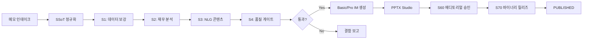
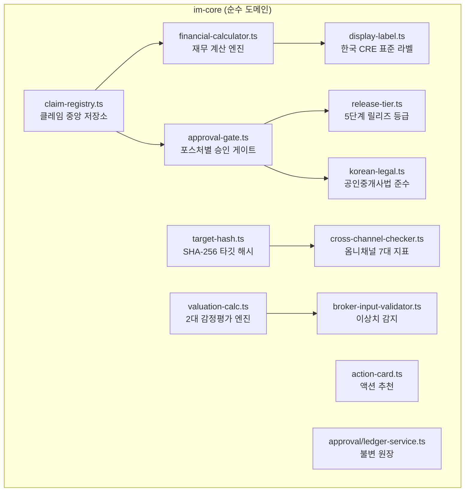
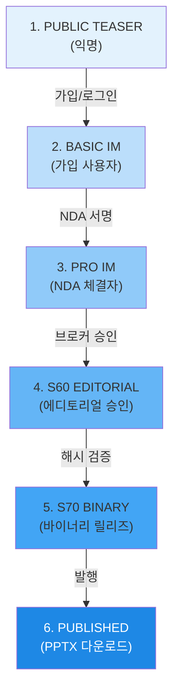
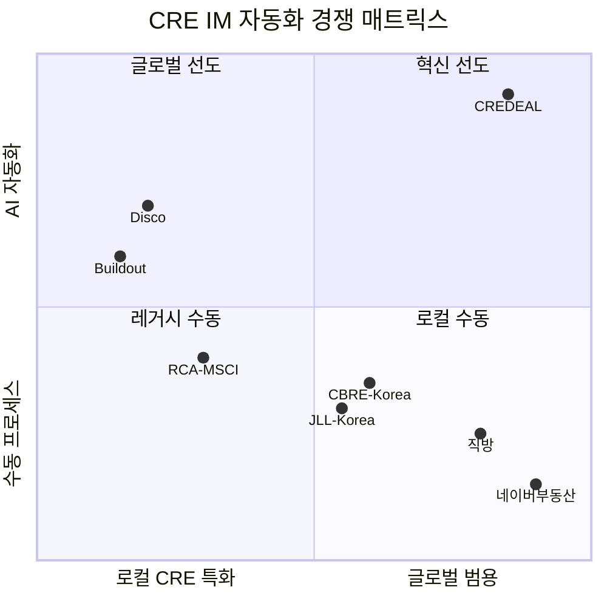

# CREDEAL v3 — 아키텍처·기능 명세서·경쟁력 분석

> **문서 버전**: 1.0 · **감사 기준일**: 2026-09-17 · **코드베이스 커밋**: `main` HEAD  
> **시스템명**: CREDEAL v3 (CRE 딜카드 코파일럿)  
> **제품명**: "이 건물, 딜 될까?" / "JS 1분 딜카드"

---

## 목차

1. [시스템 개요](#1-시스템-개요)
2. [4-Layer 아키텍처](#2-4-layer-아키텍처)
3. [기술 스택](#3-기술-스택)
4. [도메인 계층 상세](#4-도메인-계층-상세)
5. [IM-Core 순수 도메인 아키텍처](#5-im-core-순수-도메인-아키텍처)
6. [PPTX 렌더링 파이프라인](#6-pptx-렌더링-파이프라인)
7. [품질 보증 하네스](#7-품질-보증-하네스)
8. [프론트엔드·API 계층](#8-프론트엔드api-계층)
9. [외부 연동 시스템](#9-외부-연동-시스템)
10. [데이터베이스 설계](#10-데이터베이스-설계)
11. [보안·인증·권한](#11-보안인증권한)
12. [테스트 아키텍처](#12-테스트-아키텍처)
13. [CI/CD 및 배포](#13-cicd-및-배포)
14. [핵심 설계 원칙 8대 원칙](#14-핵심-설계-원칙-8대-원칙)
15. [기능 명세 총괄](#15-기능-명세-총괄)
16. [경쟁력 분석](#16-경쟁력-분석)
17. [특허·지적재산 전략](#17-특허지적재산-전략)
18. [로드맵](#18-로드맵)

---

## 1. 시스템 개요

CREDEAL v3는 **대한민국 소형 빌딩(50억~300억) 상업용 부동산(CRE) 중개인**을 위한 **모바일 퍼스트 AI 딜카드 코파일럿**이다.

### 핵심 가치 제안

| 지표 | Before (수작업) | After (CREDEAL) |
|---|---|---|
| IM 작성 시간 | 3~5시간 | **< 1분** |
| 재무 계산 오류율 | 15~30% | **0%** (결정론적 엔진) |
| 품질 게이트 | 수동 검토 | **9대 자동 게이트** |
| 크로스채널 불일치 | 빈번 | **0건** (SHA-256 해시 바인딩) |
| 법적 리스크 | 미검증 | **공인중개사법 자동 가드레일** |

### 5대 포스처(Posture) 체계

시스템은 모든 상업용 부동산 거래를 5종 투자 포스처로 분류하여 포스처별 최적화된 파이프라인을 제공한다:

| 포스처 | 한국어 | 핵심 지표 | 템플릿 |
|---|---|---|---|
| `income` | 수익형 | Cap Rate, NOI, WALE, Gross Yield | Institutional Dark/Gold |
| `owner_occupied` | 사옥형 | 총취득원가, vs Lease 비교 | Corporate Clean White |
| `development` | 개발형 | 대지면적, PF, 시공비, 조례 완화 | Development Technical Blueprint |
| `trading` | 매매형 | 거래가격, 사례비교법 | Institutional Slate |
| `operating` | 운영형 | GOP, RevPAR, 가동률 | Commercial Visual Grid |

---

## 2. 4-Layer 아키텍처

```
┌───────────────────────────────────────────────────────────────┐
│  L4  Surfaces (프레젠테이션)                                    │
│  모바일 IM 뷰어 · PPTX Studio · Dealcard · 매거진 · 티저 뷰어    │
│  Admin Console · 소유자 리포트 · Building Radar               │
├───────────────────────────────────────────────────────────────┤
│  L3  Services (서비스)                                        │
│  NLG 마스크 엔진 · IM 렌더러 · PPTX 렌더링 · 피치 생성          │
│  바이어/테넌트 매칭 · 광역 교통 벡터 엔진 · 메모 파싱            │
├───────────────────────────────────────────────────────────────┤
│  L2  Tacit Knowledge (암묵지)                                 │
│  1-탭 태깅 · 편집 Diff 수집 · OCR 확인 · 프롬프트 학습 루프      │
├───────────────────────────────────────────────────────────────┤
│  L1  Data Foundation (데이터 기반)                              │
│  온톨로지 SSoT · 4-Tier 프로비넌스 · 재무 중앙화 · 등급 엔진     │
│  제약 검증 (SHACL C01~C12) · 타깃 해시 (SHA-256)              │
└───────────────────────────────────────────────────────────────┘
```

### 의존성 방향 (클린 아키텍처)

```
UI Components ──→ Services ──→ Domain (im-core) ──→ Types/Constants
       ↓              ↓              ↑ 역의존 금지
   Next.js App    Supabase      순수 TypeScript
```

> [!IMPORTANT]
> **Rule #12**: `im-core` 도메인 계층은 React, Next.js, Supabase에 대한 역의존이 **완전 배제**되어야 한다. CI 검사 `check-ui-financials`가 이를 자동 검증한다.

---

## 3. 기술 스택

| 계층 | 기술 | 버전 | 용도 |
|---|---|---|---|
| **프레임워크** | Next.js (App Router) | 16.2.6 | 서버/클라이언트 하이브리드 렌더링 |
| **언어** | TypeScript | 5.x | 전체 코드베이스 타입 안전성 |
| **스타일링** | Tailwind CSS | 4.x | 유틸리티 퍼스트 반응형 디자인 |
| **데이터베이스** | Supabase (PostgreSQL + RLS) | - | 멀티테넌트 데이터 격리 |
| **AI/LLM** | OpenAI (GPT-4o/4o-mini) | via `@ai-sdk/openai` | 구조화된 출력 (Zod 스키마) |
| **문서 생성** | pptxgenjs | 4.0.1 | PPTX 슬라이드 생성 |
| **이미지 처리** | Sharp | 0.33.5 | SVG 벡터 렌더링, DPI 최적화 |
| **스키마 검증** | Zod | 4.4.3 | 런타임 타입 검증 |
| **온톨로지** | YAML (credeal-ontology-v0.1) | - | CRE 도메인 온톨로지 SSoT |
| **테스팅** | Vitest + Playwright | 4.1.5 / 1.62.1 | 유닛/E2E/브라우저 테스트 |
| **로깅** | Pino + Pino Pretty | 10.3.1 | 구조화 로깅 |
| **캐싱** | LRU Cache | 10.4.3 | 인메모리 캐시 |
| **차트** | Recharts | 3.8.1 | 데이터 시각화 |
| **UI 컴포넌트** | Lucide React + Motion | - | 아이콘 + 애니메이션 |
| **이메일** | Resend | 6.24.0 | 게이트 요청 알림 |
| **배포** | Vercel (Seoul `icn1`) | Pro | 서버리스 함수 (60s 타임아웃) |

---

## 4. 도메인 계층 상세

### 4.1 핵심 도메인 모듈 (`src/domain/building/`)

| 모듈 | 파일 | 역할 | Stage |
|---|---|---|---|
| **재무 중앙화** | [`financials.ts`](file:///c:/Users/User/cre-dealcard/src/domain/building/financials.ts) | NOI·Cap Rate·실투자금 중앙 계산 엔진 | S0 |
| **법적 가드레일** | [`guardrails.ts`](file:///c:/Users/User/cre-dealcard/src/domain/building/guardrails.ts) | 공인중개사법 준수 필터 | S0 |
| **등급 엔진** | [`grade-engine.ts`](file:///c:/Users/User/cre-dealcard/src/domain/building/grade-engine.ts) | 자산 데이터 등급 A~D 평가 (S 금지) | S1 |
| **제약 검증** | [`constraint-validator.ts`](file:///c:/Users/User/cre-dealcard/src/domain/building/constraint-validator.ts) | SHACL C01~C12 12대 제약 규칙 | S0 |
| **아키타입 분류** | [`archetype-classifier.ts`](file:///c:/Users/User/cre-dealcard/src/domain/building/archetype-classifier.ts) | 10종 딜 아키타입 (CORE_PLUS, VALUE_ADD 등) | S1 |
| **OCR 파서** | [`ocr-parser.ts`](file:///c:/Users/User/cre-dealcard/src/domain/building/ocr-parser.ts) | 등기부/건축물대장 파싱 (Rule #11 확인 필수) | S2 |
| **암묵지 태깅** | [`tacit-label-service.ts`](file:///c:/Users/User/cre-dealcard/src/domain/building/tacit-label-service.ts) | 1-탭 중개인 암묵지 캡처 | S2 |
| **편집 Diff** | [`edit-diff-collector.ts`](file:///c:/Users/User/cre-dealcard/src/domain/building/edit-diff-collector.ts) | AI→인간 편집 변경 수집 (프롬프트 교정용) | S2 |
| **NLG 마스크** | [`nlg-mask-engine.ts`](file:///c:/Users/User/cre-dealcard/src/domain/building/nlg-mask-engine.ts) | LLM 환각 방지 마스크 (`{{claim.xxx}}`) | S3 |
| **정보 공개 정책** | [`im-render-policy.ts`](file:///c:/Users/User/cre-dealcard/src/domain/building/im-render-policy.ts) | Basic/Pro IM 노출 통제 | S3 |
| **좌표 퍼지** | [`map-tier.ts`](file:///c:/Users/User/cre-dealcard/src/domain/building/map-tier.ts) | K-익명성 기반 ~150m 위치 오프셋 | S3 |
| **사진 분류** | [`photo-classifier.ts`](file:///c:/Users/User/cre-dealcard/src/domain/building/photo-classifier.ts) | 사진 자동 분류 + 프라이버시 가드 | S3 |
| **완비 점수** | [`layer-score-engine.ts`](file:///c:/Users/User/cre-dealcard/src/domain/building/layer-score-engine.ts) | 문서 완비도 점수 산출 | S1 |

### 4.2 IM 생성 파이프라인 (`src/domain/building/mobile-im/`)



**핵심 모듈:**

| 모듈 | 역할 |
|---|---|
| [`writer.ts`](file:///c:/Users/User/cre-dealcard/src/domain/building/mobile-im/writer.ts) | 4단계 IM 생성 오케스트레이터. `stageTimer`로 시간 예산 배분 |
| [`quality-gates-v02.ts`](file:///c:/Users/User/cre-dealcard/src/domain/building/mobile-im/quality-gates-v02.ts) | 공개 정책, 페르소나 격리, CRE 어휘, 수치 앵커 무결성 |
| [`cre-quality-gate.ts`](file:///c:/Users/User/cre-dealcard/src/domain/building/mobile-im/cre-quality-gate.ts) | 포스처별 전문 용어 화이트리스트 |
| [`disclosure-checker.ts`](file:///c:/Users/User/cre-dealcard/src/domain/building/mobile-im/disclosure-checker.ts) | Basic/Pro IM 정보 공개 정책 준수 검증 |

---

## 5. IM-Core 순수 도메인 아키텍처

`src/domain/building/im-core/`는 **UI/프레임워크 제로 의존** 순수 도메인 계층이다.

### 5.1 모듈 구성



### 5.2 핵심 모듈 상세

#### Claim Registry (`claim-registry.ts`)
- 모든 재무/운영 클레임의 **중앙 저장소**
- **4-Tier 프로비넌스** 추적: `user_input` | `official_doc` | `calculated` | `llm_generated`
- 클레임 충돌 해결 정책 내장

#### Financial Calculator (`financial-calculator.ts`)
- NOI, Cap Rate, Cash-on-Cash, Gross Yield, LTV, Debt Service 계산
- **포스처별 필수 필드** 차등 적용 (income → Cap Rate 필수, development → PF 필수)
- UI 컴포넌트에서의 직접 재무 계산 **금지** (CI 차단)

#### Release Tier (`release-tier.ts`)
5단계 릴리즈 분류 체계:

```
internal_only → fact_om → analysis_im → decision_im → expert_required
     (내부)      (팩트OM)   (분석IM)     (의사결정IM)   (전문가필요)
```

#### Approval Gate (`approval-gate.ts`)
- 포스처별 필수 클레임 검증 (income → `gross_yield` 필수, 사옥형은 불필요)
- 빈 ClaimRegistry의 허위 통과 원천 차단

#### 2대 감정평가 엔진 (`valuation-calc.ts`)

| 방법 | 산출 방식 | 적용 |
|---|---|---|
| 사례비교법 (Sales Comparison) | 인근 3~5건 실거래 대지/연면적 평당가 밴드 | 1차 가격 근거 |
| 수익환원법 (Income Capitalization) | 정규화 NOI ÷ 시장 Cap Rate (2.5%~3.5%) | 수익형 가치 환원 |
| ~~원가법~~ (Cost Method) | **명시적 배제** — "노후도 감가 및 도심 역세권..." | 배제 사유 기록 |

#### 옴니채널 7대 지표 (`cross-channel-checker.ts`)

| 지표 | 허용 오차 |
|---|---|
| `title` | 트림 매치 또는 상호 포함 |
| `asking_price` | ≤ 0.1% |
| `total_area` | ≤ 0.05 ㎡ |
| `land_area` | ≤ 0.05 ㎡ |
| `cap_rate` | ≤ 0.05%p |
| `total_deposit` | ≤ 1 KRW |
| `monthly_rent` | ≤ 1 KRW |

---

## 6. PPTX 렌더링 파이프라인

### 6.1 모듈 구성 (`src/domain/building/mobile-im/pptx/`)

| 모듈 | 역할 |
|---|---|
| [`data-binder.ts`](file:///c:/Users/User/cre-dealcard/src/domain/building/mobile-im/pptx/data-binder.ts) | SSoT → 슬라이드 데이터맵 바인딩. 3-Tier Key Facts 계층 강제. 하드코딩 지역명 금지 |
| [`deck-sequencer.ts`](file:///c:/Users/User/cre-dealcard/src/domain/building/mobile-im/pptx/deck-sequencer.ts) | **Rule 10**: 본문 16면 하드 리밋 (`PAGE_HARD_LIMIT=16`), 부록 분리 |
| [`pptx-theme.ts`](file:///c:/Users/User/cre-dealcard/src/domain/building/mobile-im/pptx/pptx-theme.ts) | 5대 테마 프리셋 토큰 스키마 |
| [`gallery-planner.ts`](file:///c:/Users/User/cre-dealcard/src/domain/building/mobile-im/pptx/gallery-planner.ts) | 사진 갤러리 배치. `map` 카테고리 제외. 고해상도(>2MB) 다운샘플링 |
| [`macro-transit-engine.ts`](file:///c:/Users/User/cre-dealcard/src/services/macro-transit-engine.ts) | Sharp SVG 벡터 생성. 1600×1200 px, 266.7 DPI. GBD 서브지구 라우팅 |

### 6.2 테마 프리셋 5종

| 테마 ID | 이름 | 대상 포스처 | 주요 특성 |
|---|---|---|---|
| `institutional_slate` | 딥 슬레이트 인스티튜셔널 | 수익형/매매형 | 차콜(`#2B2F3E`) + 샴페인 골드(`#E8DEC8`) |
| `institutional_dark_gold` | 인스티튜셔널 다크 골드 | 수익형 | 심층 재무 중심, 고급감 |
| `corporate_clean_white` | 코퍼릿 클린 화이트 | 사옥형 | 깔끔한 브랜딩 중심 |
| `commercial_visual_grid` | 커머셜 비주얼 그리드 | 운영형/메디컬 | 층별 MD, 유동인구 시각화 |
| `development_technical_blueprint` | 개발 테크니컬 블루프린트 | 개발형 | 다필지, 3단 투입비, 조례 완화 |

### 6.3 GBD 서브지구 라우팅

```
신사|도산대로|압구정|논현  →  GBD_SINSA  (도산대로, 위례신사선)
서초|양재|남부순환        →  GBD_SEOCHO (양재역, GTX-C)
역삼|테헤란로            →  GBD_TEHERAN
```

### 6.4 슬라이드 물리 사양

| 항목 | 사양 |
|---|---|
| 캔버스 | 16:9 와이드스크린 (13.333" × 7.5") |
| 본문 상한 | 16면 (Rule 10), 부록 별도 |
| 이미지 DPI | 최소 150 DPI (권장 165+ DPI, 벡터맵 266.7 DPI) |
| 렌트롤 표 | 다단 최적화, 합계 행(Slate Tint `#F1F5F9`), 공실 행(Amber `#D97706`) |

---

## 7. 품질 보증 하네스

### 7.1 PPTX 바이너리 인스펙터 (`src/assurance/im-harness/`)

#### 9대 물리 게이트 (`inspectPptxBinary`)

| # | 게이트 | 기준 | 검증 |
|---|---|---|---|
| G1 | Bleed | 0건 | 텍스트/도형 지면 이탈 |
| G2 | Placeholder Residue | 0건 | 미치환 `{{...}}` 토큰 |
| G3 | Broken Images | 0건 | ZIP/XML 깨진 이미지 |
| G4 | **Rule 1** Persona Isolation | 0건 | 연령/계층/성별 명칭 배제 |
| G5 | **Rule 2** CRE Lexicon | 0건 | 한국 CRE 실무 표준 용어 |
| G6 | **P0** Legal Safety | 0건 | 공인중개사법 금지어 |
| G7 | **G54** Defect Excuse | 0건 | '산출불가', '미확보', '비워둠' |
| G8 | **G55** AI Lecture | 0건 | '표면 수익률만으로 판단하지 마십시오' |
| G9 | **G56** System Rules | 0건 | 'Rule 10', '내부 시스템 규칙' 노출 |
| G10 | Effective DPI | ≥ 150 | 이미지 실효 해상도 |

### 7.2 CI 검사 스위트 (13개)

```bash
npx tsx scripts/ci/run-all-checks.ts    # 13개 CI 검사 일괄 실행
```

| # | 검사 | 목적 |
|---|---|---|
| 1 | `check-ui-financials` | UI 내 직접 재무 계산 차단 |
| 2 | `provenance-guard` | attrs 기록 시 4-Tier 프로비넌스 필수 |
| 3 | `rag-hygiene` | RAG 인덱싱 위생 |
| 4 | `cold-mode-guard` | Cold 모드 가격 의견 차단 |
| 5 | `nlg-mask-check` | NLG 마스크 우회 차단 |
| 6 | `disclosure-escape` | 정보 공개 정책 위반 탐지 |
| 7 | `ocr-confirm-check` | OCR 자동저장 차단 (Rule #11) |
| 8+ | K-익명성, 좌표 퍼지, 워터마크 등 | 프라이버시 및 보안 |

---

## 8. 프론트엔드·API 계층

### 8.1 라우트 맵

#### 공개 라우트 (`src/app/(public)/`)

| 라우트 | 설명 |
|---|---|
| `/building-radar` | "이 건물, 딜 될까?" — 소유자/일반인용 건물 평가 |
| `/building-radar/[id]/result` | 평가 결과 상세 |
| `/im/[id]/viewer` | 모바일 IM 뷰어 (공개 정책 적용) |
| `/teaser/[id]` | 블라인드 딜카드 티저 뷰어 |

#### 브로커 라우트 (`src/app/(broker)/`)

| 라우트 | 설명 |
|---|---|
| `/broker/deal-card/new` | 신규 딜카드 생성 (카톡 메모 붙여넣기) |
| `/broker/deal-card/[id]` | 딜카드 상세 |
| `/broker/deal-card/[id]/pptx-editor` | PPTX Studio 인라인 에디터 |
| `/broker/deal-card/[id]/pptx-studio` | PPTX Studio 전체 에디터 (SVG 프리뷰) |
| `/broker/deal-card/[id]/im-management` | IM 관리 패널 |
| `/broker/deal-card/[id]/share` | 공유 링크 관리 |
| `/broker/deal-card/[id]/gate-request` | 게이트 요청 양식 |
| `/broker/buyer-intents/new` | 바이어 의향 등록 |
| `/broker/templates` | 커스텀 템플릿 빌더 |
| `/broker/dashboard` | 브로커 대시보드 |

#### 관리자 라우트 (`src/app/admin/`)

| 라우트 | 설명 |
|---|---|
| `/admin/analytics` | 분석 대시보드 |
| `/admin/gate-requests` | 게이트 요청 관리 |
| `/admin/expert-notes` | 전문가 노트 관리 |
| `/admin/discrepancy` | 불일치 대시보드 (7대 지표) |

### 8.2 핵심 API 엔드포인트

#### IM 생성 파이프라인 API (`/api/broker/im-lite/`)

| 엔드포인트 | 메서드 | 요청 | 응답 |
|---|---|---|---|
| `/generate` | POST | `buildingId`, `posture`, `photos_v2` | `jobId`, `status` |
| `/status/[id]` | GET | - | `status`, `progress`, `stageTimers` |
| `/approve` | POST | `expectedHash`, `stage` (S60/S70) | `approvalEvent`, `releaseRecord` |
| `/result/[id]` | GET | - | 생성된 IM 콘텐츠 |

#### PPTX API

| 엔드포인트 | 메서드 | 설명 |
|---|---|---|
| `/api/broker/pptx/generate` | POST | PPTX 파일 생성 |
| `/api/broker/pptx/download/[id]` | GET | PPTX 파일 다운로드 |

### 8.3 CTA 래더 (전환 단계)



### 8.4 정보 공개 정책 (Disclosure Policy)

| 필드 | Public | Basic IM | Pro IM (NDA) |
|---|---|---|---|
| area_signal (권역) | ✅ | ✅ | ✅ |
| price_band (가격대) | ✅ (밴드) | ✅ | ✅ (정확) |
| exact_address | ❌ | ❌ | ✅ |
| tenant_name | ❌ | ❌ | ✅ |
| unit_rent | ❌ | ❌ | ✅ |
| seller_motivation | ❌ | ❌ | ❌ (internal) |
| map_coordinates | ❌ | ⚡ (~150m 퍼지) | ✅ (정확) |

### 8.5 반응형 디자인

| 뷰포트 | 해상도 | 대상 기기 |
|---|---|---|
| 모바일 | 393px | iPhone 14 Pro |
| 모바일 소형 | 360px | Galaxy S23 |
| 태블릿 | 768px | iPad |
| 데스크톱 | 1920px | 모니터 |

---

## 9. 외부 연동 시스템

### 9.1 데이터 소스

| 시스템 | 모듈 | 데이터 |
|---|---|---|
| **V-World** | `vworld-wms-cadastral.ts` | 지적도, PNU 조회, 공간 데이터 |
| **Kakao Geocoder** | `kakao-geocoder.ts` | 주소 → 좌표 / 좌표 → 주소 |
| **Juso API** | `juso-api.ts` | 도로명/지번 주소 표준화 |
| **공공데이터 포털** | `enrich-by-pnu.ts` | PNU 기반 건물 제원 보강 |

### 9.2 AI 연동

| 용도 | 모델 | 방식 |
|---|---|---|
| 메모 파싱 | GPT-4o-mini | 구조화 출력 (Zod 스키마) |
| NLG 콘텐츠 생성 | GPT-4o | NLG 마스크 경유 (`{{claim.xxx}}`) |
| 건물 분석 | GPT-4o | 아키타입 분류 보조 |
| 바이어 의향 추출 | GPT-4o-mini | 자연어 → 구조화 의향 |
| 매칭 점수 | GPT-4o | 매물-바이어 적합도 |

> [!WARNING]
> LLM은 **절대로** 재무 수치를 직접 생성하지 않는다. 모든 수치는 결정론적 마스크 (`{{claim.xxx}}`)를 통해서만 슬라이드에 삽입된다 (NLG 마스크 원칙).

### 9.3 장애 방어

- 외부 API 1건 실패 → 전체 파이프라인 블로킹 금지 (fallback 격리)
- API 키 만료/네트워크 타임아웃 시 graceful degradation
- 복수 필지(multi-PNU) 입력 정상 처리

---

## 10. 데이터베이스 설계

### 10.1 마이그레이션 순서

```sql
-- Stage 0: MVP 기본
supabase/migrations/00001_mvp_schema.sql

-- Stage 0: 재무 가정
supabase/migrations/0100_assumptions.sql

-- Stage 1: 온톨로지 스키마
supabase/migrations/0110_ontology_schema.sql

-- Stage 2: 암묵지 레이블
supabase/migrations/0120_tacit_labels.sql

-- Stage 2: 편집 Diff
supabase/migrations/0121_edit_diffs.sql

-- Stage 3: IM 티어링
supabase/migrations/0130_im_tiering.sql
```

### 10.2 핵심 테이블

| 테이블 | 역할 | RLS |
|---|---|---|
| `buildings` | 건물 코어 데이터 (PNU, 좌표, 제원) | ✅ |
| `deal_cards` | 딜카드 인스턴스 (포스처, 클레임, 점수) | ✅ |
| `im_results` | 생성된 IM 콘텐츠 (Basic/Pro 티어) | ✅ |
| `approval_events` | **불변** 승인 원장 (S60/S70) | ✅ |
| `release_records` | 발행 릴리즈 기록 (SHA-256 해시) | ✅ |
| `buyer_intents` | 바이어 의향 프로필 | ✅ |
| `share_links` | 토큰 기반 공유 링크 (NDA 상태) | ✅ |
| `gate_requests` | 발행 게이트 요청 | ✅ |
| `tacit_labels` | 브로커 암묵지 태그 | ✅ |

---

## 11. 보안·인증·권한

| 계층 | 메커니즘 |
|---|---|
| 인증 | Supabase Auth (이메일/비밀번호) |
| 역할 | Broker / Admin / Owner |
| 데이터 격리 | PostgreSQL RLS (Row Level Security) |
| API 보안 | Service Role Key (서버 사이드) |
| 공유 링크 | 토큰 기반 접근 (NDA 게이트) |
| 좌표 보호 | K-익명성 퍼지 (강남/서초 K=30, 기타 K=20) |
| 해시 바인딩 | SHA-256 타깃 해시 (SSoT ↔ 산출물 결속) |
| 승인 원장 | 불변 이벤트 로그 (변조 불가) |

---

## 12. 테스트 아키텍처

### 12.1 4-Layer 테스트 피라미드

```
            ┌──────────────────┐
            │  Playwright E2E  │  5 브라우저 여정 (Layer 4)
            │  (브라우저 테스트)  │
            ├──────────────────┤
            │  Acceptance       │  FA-01~FA-16 최종 수락 (Layer 3)
            │  (수락 테스트)     │
        ┌───┴──────────────────┴───┐
        │  Integration / E2E       │  실매물 파이프라인 (Layer 2)
        │  (통합 테스트)            │  크로스채널, 승인 플로우
    ┌───┴──────────────────────────┴───┐
    │  Unit Tests                      │  341+ 단언 (Layer 1)
    │  (유닛 테스트)                     │  도메인 로직 전수
    └──────────────────────────────────┘
```

### 12.2 테스트 현황

| 구분 | 파일 수 | 단언 수 | 범위 |
|---|---|---|---|
| 유닛 테스트 | 47 | 341+ | 재무, 프로비넌스, 등급, 제약, 아키타입 |
| 통합/E2E | 12+ | - | 실매물 파이프라인, 크로스채널, 승인 |
| Playwright | 5 | - | 5대 브라우저 여정 |
| 수락 테스트 | 1 | 16 | FA-01~FA-16 최종 수락 |
| Preflight | 3 | - | 배포 전 검증 |

### 12.3 골든 테스트 케이스

실매물 2건 기반 E2E 검증:

| 물건 | 가격 | 권역 | 포스처 | 특이사항 |
|---|---|---|---|---|
| 신사동 590 ICL빌딩 | 760억 | GBD Sinsa | income | 5건 사례비교 |
| 서초동 1364-28 FM빌딩 | 230억 | GBD Seocho | income | 다층 공실 Pro-forma |

---

## 13. CI/CD 및 배포

### 13.1 릴리즈 게이트

```
preflight → tsc → build → push
```

1. **Preflight**: `npm run preflight` (파이프라인 감사 + 복사본 교차 비교 + 스태킹 플랜)
2. **TypeScript**: `npm run typecheck` (0 에러)
3. **Build**: `npm run build` (프로덕션 빌드 성공)
4. **Push**: `git push origin main` → Vercel 자동 배포

### 13.2 배포 환경

| 항목 | 값 |
|---|---|
| 플랫폼 | Vercel Pro |
| 리전 | `icn1` (서울) |
| 함수 타임아웃 | 60초 |
| 빌드 명령 | `npm run build` |
| 긴급 배포 | `npx vercel --prod` |

---

## 14. 핵심 설계 원칙 8대 원칙

| # | 원칙 | 설명 | 위반 시 |
|---|---|---|---|
| 1 | **재무 중앙화** | 모든 재무 계산은 `financials.ts` 경유 | CI 차단 |
| 2 | **프로비넌스 4-Tier** | 모든 데이터에 출처(user_input/official_doc/calculated/llm_generated) 추적 | 데이터 무결성 위반 |
| 3 | **NLG 마스크** | LLM은 결정론적 마스크 통해서만 수치 출력 | 환각 방지 |
| 4 | **K-익명성** | 강남/서초/성동 K=30, 기타 K=20 | 재식별 차단 |
| 5 | **OCR 확인 필수** (Rule #11) | OCR 결과는 반드시 사용자 확인 거침 | 자동저장 금지 |
| 6 | **페르소나 격리** (Rule 1) | 연령/계층/성별 명칭 외부 노출 0건 | 품질 게이트 차단 |
| 7 | **CRE 표준 용어** (Rule 2) | Cap Rate, GOP, TI 등 표준 용어만 사용 | 품질 게이트 차단 |
| 8 | **타깃 해시 바인딩** | SHA-256로 SSoT ↔ 모든 산출물 결속 | 크로스채널 무효화 |

---

## 15. 기능 명세 총괄

### 15.1 핵심 기능 매트릭스

| # | 기능 | 설명 | 상태 |
|---|---|---|---|
| F1 | 1분 딜카드 | 카톡 메모 → 구조화된 딜카드 자동 생성 | ✅ 완료 |
| F2 | Basic IM 자동 생성 | SSoT 기반 모바일 IM 원클릭 생성 | ✅ 완료 |
| F3 | Pro IM (NDA) | NDA 체결 후 전체 정보 공개 | ✅ 완료 |
| F4 | PPTX Studio | 인라인 편집 + 실시간 SVG 프리뷰 | ✅ 완료 |
| F5 | 5대 테마 프리셋 | 포스처별 최적화 테마 | ✅ 완료 |
| F6 | 커스텀 템플릿 빌더 | 로고/컬러/폰트 커스터마이징 | ✅ 완료 |
| F7 | 2단계 승인 원장 | S60 에디토리얼 → S70 바이너리 | ✅ 완료 |
| F8 | 2대 감정평가 | 사례비교법 + 수익환원법 | ✅ 완료 |
| F9 | A22 스태킹 플랜 | 건축 입면 셋백 반영 단면도 | ✅ 완료 |
| F10 | 광역 교통 벡터맵 | GBD 서브지구 SVG 다이어그램 | 🔄 진행 중 |
| F11 | 바이어/테넌트 매칭 | AI 기반 매물-매수자 매칭 | ✅ 완료 |
| F12 | 소유자 리포트 | 열람/공유 활동 기반 정기 보고 | ✅ 완료 |
| F13 | Building Radar | "이 건물, 딜 될까?" 공개 서비스 | ✅ 완료 |
| F14 | 9대 물리 게이트 | PPTX 바이너리 자동 품질 검증 | ✅ 완료 |
| F15 | OCR 파싱 | 등기부/건축물대장 자동 인식 | ✅ 완료 |
| F16 | 암묵지 태깅 | 1-탭 브로커 인사이트 캡처 | ✅ 완료 |
| F17 | G54-G56 거버넌스 | 결손변명/훈계조/시스템룰 차단 | 🔜 계획 |
| F18 | 옴니채널 7대 지표 동기화 | Web/PPTX/Dealcard 정합성 | 🔜 계획 |

### 15.2 마일스톤 진행 현황

| MS | 이름 | 상태 |
|---|---|---|
| M1 | SSoT 픽스처 & 4대 건축 제원 | ✅ DONE |
| M2 | GBD 2대 감정평가 통합 | ✅ DONE |
| M3 | GBD 광역 교통 벡터 & 배후수요 격리 | 🔄 IN_PROGRESS |
| M4 | G54~G56 거버넌스 & 9대 물리 게이트 | 🔜 PLANNED |
| M5 | 스튜디오 승인 원장 & 옴니채널 검증 | 🔜 PLANNED |

---

## 16. 경쟁력 분석

### 16.1 경쟁 환경 매핑



### 16.2 경쟁사 비교표

| 경쟁사 | 카테고리 | 강점 | CREDEAL 대비 약점 |
|---|---|---|---|
| **Disco** (미국) | 기관급 IM 플랫폼 | PDF 보고서, 기관투자자 대상 | 한국 CRE 미지원, 모바일 미대응, NLG 마스크 없음 |
| **Buildout** (미국) | CRE 마케팅 플랫폼 | 리스팅 신디케이션 | 영어 전용, 한국 법규 미준수, 1분 생성 불가 |
| **RCA/MSCI** | 거래 데이터 분석 | 글로벌 거래 DB | 데이터만 제공, IM 생성 기능 없음 |
| **직방** | 한국 주거 플랫폼 | 국내 최대 주거 DB | 주거 중심, 기관 CRE 미지원, IM 미생성 |
| **네이버 부동산** | 한국 최대 부동산 포털 | 최대 트래픽 | 매물 리스팅만, 딜 파이프라인/재무 분석 없음 |
| **CBRE Korea** | 글로벌 브로커리지 | 글로벌 네트워크, 기관 신뢰 | 수작업, 고비용, 소형 중개인 미대응 |
| **JLL Korea** | 글로벌 리서치 | 기관 보고서 | 수작업, 셀프서비스 불가 |
| **삼성SDS** | 기업 CRE 관리 | 대기업 내부 솔루션 | 내부용, 중개인 마켓플레이스 없음 |

### 16.3 CREDEAL 경쟁 해자 (Competitive Moats) — 8대 해자

| # | 해자 | 설명 | 방어력 |
|---|---|---|---|
| 🛡️ 1 | **NLG 마스크 엔진** | LLM 환각 방지하는 유일한 CRE IM 시스템. 재무 수치는 결정론적 마스크만 통과 | 🟢 높음 (특허 가능) |
| 🛡️ 2 | **한국 공인중개사법 가드레일** | 자동 법규 준수 필터. 경쟁사 중 이 기능을 가진 곳 없음 | 🟢 높음 |
| 🛡️ 3 | **1분 딜카드** | 카카오톡 메모 → IM 생성 60초 이내. 기존 3~5시간 대비 300x 속도 향상 | 🟢 높음 |
| 🛡️ 4 | **5-포스처 전용 파이프라인** | 모든 CRE 거래 유형에 전문 템플릿·검증 로직 제공. 유일한 플랫폼 | 🟡 중간 |
| 🛡️ 5 | **SSoT + 타깃 해시** | SHA-256 암호학적 무결성. 옴니채널 일관성 보장 | 🟢 높음 (특허 가능) |
| 🛡️ 6 | **암묵지 캡처 (Tacit Knowledge)** | 1-탭 브로커 인사이트 수집. 업계 최초 | 🟡 중간 |
| 🛡️ 7 | **옴니채널 정합성 검증** | Web/PPTX/Dealcard 간 7대 지표 ≤ 0.1% 오차 자동 검증 | 🟢 높음 |
| 🛡️ 8 | **9대 물리 바이너리 게이트** | PPTX 자동 품질 보증. 이 수준의 자동 QA를 가진 경쟁사 없음 | 🟢 높음 |

### 16.4 시장 기회

| 항목 | 수치 |
|---|---|
| **1차 타깃** | 대한민국 소형 빌딩(50억~300억) CRE 중개인 |
| **Addressable Market** | ~15,000 인가 CRE 중개인 |
| **Pain Point** | IM 작성 3~5시간, 재무 계산 오류 15~30%, 법규 준수 미검증 |
| **Value Proposition** | 300x 속도 향상, 0% 계산 오류, 자동 법규 준수 |
| **확장 시장** | 기관투자자, UHNW 개인투자자, 자산운용사 |

### 16.5 비즈니스 모델 잠재력

| 수익원 | 모델 | 잠재력 |
|---|---|---|
| **SaaS 구독** | 월정액 브로커 라이선스 | 🟢 메인 수익 |
| **거래 수수료** | 딜 매칭 성사 시 수수료 | 🟢 높은 마진 |
| **프리미엄 템플릿** | 커스텀 기관급 테마 판매 | 🟡 부가 수익 |
| **데이터 인텔리전스** | 거래 트렌드 리포트 | 🟡 장기 수익 |
| **API 라이선스** | 제3자 플랫폼 연동 | 🔵 미래 수익 |

---

## 17. 특허·지적재산 전략

프로젝트에는 다수의 특허 가능 기술이 포함되어 있다:

| # | 특허 후보 | 핵심 혁신 |
|---|---|---|
| P001 | [모바일 IM 자동 생성](file:///c:/Users/User/cre-dealcard/docs/patent-001-mobile-im-auto-generation.md) | AI 기반 CRE IM 원클릭 자동 생성 방법 |
| P002 | [프로그레시브 디스클로저](file:///c:/Users/User/cre-dealcard/docs/patent-002-progressive-disclosure-deal-intelligence.md) | 단계별 정보 공개 기반 딜 인텔리전스 |
| P004 | [미완결 거래 선행 지표](file:///c:/Users/User/cre-dealcard/docs/patent-P4-incomplete-transaction-leading-indicator.md) | 불완전 거래의 조기 경고 시스템 |
| R001 | [AI 레질리언스 3중 방어](file:///c:/Users/User/cre-dealcard/docs/patent-R1-ai-resilience-triple-defense.md) | NLG 마스크 + 프로비넌스 + 해시 바인딩 |
| V001 | [상보적 감성 벡터 프로필](file:///c:/Users/User/cre-dealcard/docs/patent-V1-complementary-affect-vector-profile.md) | 바이어-매물 감성 매칭 알고리즘 |

---

## 18. 로드맵

### Stage 기반 진행 현황

| Stage | 이름 | 핵심 기능 | 상태 |
|---|---|---|---|
| **S0** | Data Foundation | 재무 중앙화, 프로비넌스, 법적 가드레일 | ✅ |
| **S1** | Ontology & Grading | 온톨로지, 등급 엔진, 제약 검증, 아키타입 | ✅ |
| **S2** | Tacit Knowledge | OCR, 암묵지 태깅, 편집 Diff | ✅ |
| **S3** | IM Rendering | NLG 마스크, IM 티어링, PPTX Studio | ✅ |
| **S4** | Advanced Features | 사진 분류, Give-to-Get, P2P 공동중개 | 🔄 |
| **S5** | Production Hardening | G54~G56 거버넌스, 옴니채널 완결 | 🔜 |

### 향후 확장 방향

1. **크라우드펀딩/STO 연동** — 토큰화 부동산 IM 자동 생성
2. **리싱(Leasing) 딜카드 확장** — 임대 전용 딜카드
3. **모닝 인텔리전스 허브** — 매일 시장 브리핑
4. **예측 그래프** — 거래 완결 확률 예측
5. **범용 딜 OS** — 다자산 플랫폼 확장

---

> **문서 작성**: CREDEAL v3 코드베이스 전수 감사 기반  
> **최종 갱신**: 2026-09-17
