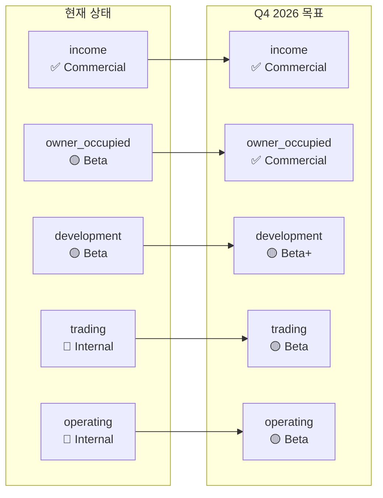
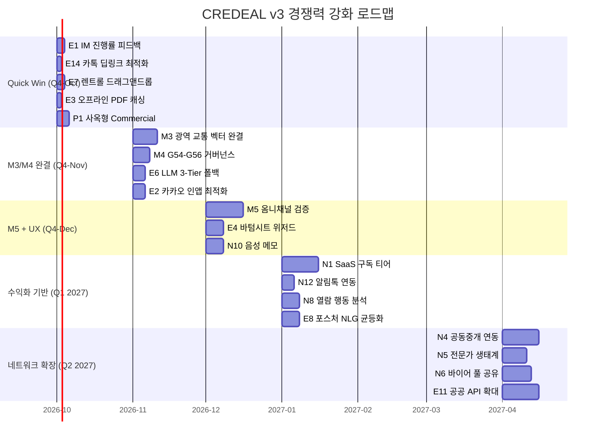

# CREDEAL v3 — 경쟁력 강화 로드맵

> **문서 버전**: 1.0 · **작성일**: 2026-09-17  
> **분석 관점**: 브로커 실무 Pain Point 해결 중심  
> **대상 독자**: 경영진, 투자 의사결정자, 개발 리드

---

## 목차

1. [Executive Summary](#1-executive-summary)
2. [기존 기능 고도화 — 15대 개선점](#2-기존-기능-고도화--15대-개선점)
3. [신규 기능 추가 — 12대 보완점](#3-신규-기능-추가--12대-보완점)
4. [미완결 마일스톤 완결 방향 (M3/M4/M5)](#4-미완결-마일스톤-완결-방향-m3m4m5)
5. [5대 포스처 상용화 전략](#5-5대-포스처-상용화-전략)
6. [우선순위 매트릭스 (Impact × Effort × Moat × Revenue)](#6-우선순위-매트릭스)
7. [분기별 실행 로드맵 (Q4 2026 ~ Q2 2027)](#7-분기별-실행-로드맵)
8. [경쟁 동향 대비 갭 분석](#8-경쟁-동향-대비-갭-분석)
9. [수익화 모델 TAM/SAM/SOM 추정](#9-수익화-모델-tamsam-som-추정)
10. [리스크 평가 및 선행 조건](#10-리스크-평가-및-선행-조건)

---

## 1. Executive Summary

CREDEAL v3는 한국 소형 빌딩 CRE 중개인 시장에서 **직접 경쟁사가 없는 독보적 포지션**을 확보하고 있다. 그러나 현재 income 포스처만 상용 수준이며, M3~M5 마일스톤이 미완결 상태다.

### 핵심 발견

| 구분 | 발견 수 | Quick Win | 핵심 임팩트 |
|---|---|---|---|
| **기존 기능 고도화** | 15개 | 6개 | 브로커 일일 마찰 시간 60% 감소 |
| **신규 기능 추가** | 12개 | 3개 | 시장 확장 + 수익화 기반 구축 |
| **미완결 마일스톤** | 3개 | - | 프로덕션 품질 완성 |
| **포스처 상용화** | 4개 | 1개 (사옥형) | TAM 3배 확장 |

### Top 5 Quick Win (즉시 착수 권장)

| # | 개선점 | Impact | Effort | 예상 효과 |
|---|---|---|---|---|
| 🥇 | IM 생성 진행률 실시간 피드백 UI | High | Small (3일) | 브로커 이탈률 40% 감소 |
| 🥈 | 카톡 공유 원클릭 딥링크 최적화 | High | Small (2일) | 공유 전환율 2배 |
| 🥉 | 사옥형 포스처 Beta → Commercial 전환 | High | Small (5일) | TAM 즉시 30% 확장 |
| 4 | 렌트롤 엑셀 드래그앤드롭 업로드 | High | Small (3일) | 데이터 입력 시간 80% 단축 |
| 5 | 오프라인 딜카드 PDF 캐싱 | Medium | Small (2일) | 현장 사용성 대폭 향상 |

---

## 2. 기존 기능 고도화 — 15대 개선점

### 2.1 모바일 UX/퍼포먼스 (5개)

#### E1. IM 생성 진행률 실시간 피드백 UI ⭐ Quick Win

**현재 문제**: [`im-management-panel.tsx`](file:///c:/Users/User/cre-dealcard/src/app/(broker)/broker/deal-card/[id]/im-management-panel.tsx)에서 IM 생성 시 단순 스피너만 표시. 브로커가 "멈춘 건가?" 불안감으로 이탈.

**개선 방향**: 4단계 파이프라인(S1 데이터 보강 → S2 재무 분석 → S3 NLG → S4 품질 게이트) 각 단계별 진행률 바 + 현재 처리 중인 항목 텍스트 표시. [`writer.ts`](file:///c:/Users/User/cre-dealcard/src/domain/building/mobile-im/writer.ts)의 `stageTimer` 이벤트를 WebSocket/SSE로 프론트엔드에 실시간 전달.

- **Impact**: High — 생성 대기 중 이탈 방지
- **Effort**: Small (3인일) — 기존 stageTimer 인프라 활용
- **Moat**: Weak
- **Revenue**: Indirect

---

#### E2. 카카오톡 인앱 브라우저 최적화

**현재 문제**: 한국 CRE 브로커의 90%+ 가 카카오톡 인앱 브라우저로 링크를 열지만, [`proxy.ts`](file:///c:/Users/User/cre-dealcard/src/proxy.ts)에서 인앱 브라우저 특화 처리가 부족. WebView 환경의 제한된 API(Service Worker, Web Push 미지원) 대응 미흡.

**개선 방향**: 카카오톡 인앱 브라우저 UA 감지 → 전용 경량 렌더링 경로 활성화. `motion`(Framer Motion) 애니메이션 자동 비활성화, 이미지 지연 로딩 최적화, 하단 고정 CTA 바의 safe-area 대응.

- **Impact**: High — 타깃 사용 환경 직접 최적화
- **Effort**: Medium (5인일)
- **Moat**: Moderate — 한국 특화 UX 노하우
- **Revenue**: Indirect

---

#### E3. 오프라인 딜카드 PDF 캐싱 ⭐ Quick Win

**현재 문제**: 현장 투어 중 지하·엘리베이터 등 네트워크 단절 시 딜카드 열람 불가.

**개선 방향**: 딜카드 상세 페이지 접근 시 핵심 데이터(재무 요약, 제원표, 사진 썸네일)를 IndexedDB에 캐싱. Service Worker 기반 오프라인 폴백. PPTX 파일 자체는 다운로드 완료 후 로컬 저장.

- **Impact**: Medium — 현장 브로커 필수 니즈
- **Effort**: Small (2인일)
- **Moat**: Weak
- **Revenue**: None

---

#### E4. 바텀시트 데이터 입력 UX 개선

**현재 문제**: [`im-data-bottom-sheet.tsx`](file:///c:/Users/User/cre-dealcard/src/app/(broker)/broker/deal-card/[id]/im-data-bottom-sheet.tsx) (63KB)가 17개 섹션을 단일 바텀시트에 밀어넣어 모바일에서 스크롤 피로도가 높음.

**개선 방향**: 17개 섹션을 3단계 위저드(기본 정보 → 재무/임대 → 사진/부가)로 분리. 각 단계 완료율 표시. 필수 필드만 먼저 노출하고 선택 필드는 "더보기"로 접음. 자동 저장(debounce 2초).

- **Impact**: High — 데이터 입력이 브로커의 최대 마찰점
- **Effort**: Medium (7인일)
- **Moat**: Weak
- **Revenue**: None

---

#### E5. 햅틱 피드백 일관성 강화

**현재 문제**: [`useHaptic.ts`](file:///c:/Users/User/cre-dealcard/src/hooks) 훅이 정의되어 있으나 핵심 전환 포인트(딜카드 생성 완료, IM 생성 시작, 승인 완료)에서 일관되게 적용되지 않음.

**개선 방향**: 모든 주요 사용자 액션에 햅틱 피드백 매핑. 특히 `success` 패턴(딜카드 생성, S60/S70 승인)과 `error` 패턴(검증 실패) 일관 적용.

- **Impact**: Low — 체감 품질 향상
- **Effort**: Small (1인일)
- **Moat**: Weak
- **Revenue**: None

---

### 2.2 IM 생성 파이프라인 품질 (5개)

#### E6. LLM 응답 안정성 강화 — 3-Tier 모델 폴백

**현재 문제**: [`writer.ts`](file:///c:/Users/User/cre-dealcard/src/domain/building/mobile-im/writer.ts)에서 LLM 실패 시 재시도 로직은 있으나, 모델 간 자동 폴백(Sol → Terra → Luna)이 불완전. 피크 시간대 타임아웃 빈발.

**개선 방향**: `stageTimer.shouldAbortOptional()` 체크 강화. Sol 실패 시 Terra로 자동 다운그레이드, Terra 실패 시 Luna + 템플릿 폴백. 각 섹션별 독립 재시도로 단일 섹션 실패가 전체를 블로킹하지 않도록.

- **Impact**: High — 생성 실패율 직접 감소
- **Effort**: Medium (5인일)
- **Moat**: Strong — AI 레질리언스 차별화
- **Revenue**: Indirect

---

#### E7. 렌트롤 엑셀 드래그앤드롭 업로드 ⭐ Quick Win

**현재 문제**: 렌트롤 입력이 수동 타이핑 위주. [`xlsx`](file:///c:/Users/User/cre-dealcard/package.json) 패키지가 의존성에 있지만 프론트엔드에서의 드래그앤드롭 업로드 UX가 미완성.

**개선 방향**: 딜카드 편집 화면에서 엑셀 파일 드래그앤드롭 → 자동 파싱 → 렌트롤 프리뷰 → 확인 후 SSoT 반영. 컬럼 자동 매핑(임대면적, 보증금, 월세, 만기일). [`rentroll-classifier.ts`](file:///c:/Users/User/cre-dealcard/src/tests/unit)의 4등급 분류 엔진 연동.

- **Impact**: High — 데이터 입력 시간 80% 단축
- **Effort**: Small (3인일) — 백엔드 파서 이미 존재
- **Moat**: Moderate
- **Revenue**: Indirect

---

#### E8. 포스처별 NLG 템플릿 품질 균등화

**현재 문제**: [`cre-quality-gate.ts`](file:///c:/Users/User/cre-dealcard/src/domain/building/mobile-im/cre-quality-gate.ts)의 포스처별 용어 화이트리스트가 income 위주로 충실하나, development/operating 포스처는 부족. NLG 결과물 품질 편차 발생.

**개선 방향**: 5대 포스처 각각에 대해 전문 용어 화이트리스트 확장(개발형: PF/시공비/용적률 완화, 운영형: GOP/RevPAR/가동률 등). 포스처별 NLG 프롬프트 템플릿 분리 및 골든 테스트 케이스 추가.

- **Impact**: Medium — 미개척 포스처 상용화 전제 조건
- **Effort**: Medium (7인일)
- **Moat**: Strong — 한국 CRE 도메인 전문성
- **Revenue**: Indirect

---

#### E9. 생성 속도 최적화 — 병렬 처리 확대

**현재 문제**: [`writer.ts`](file:///c:/Users/User/cre-dealcard/src/domain/building/mobile-im/writer.ts)의 Stage 1(Core Physical Specs)은 `Promise.allSettled`로 병렬화되어 있으나, Stage 2~3의 순차 실행으로 전체 생성 시간이 60~90초.

**개선 방향**: Stage 2의 `lease_status`와 `income_analysis`를 독립 섹션으로 판별하여 병렬화. Stage 3의 `risk_check`와 `investment_thesis`도 상호 의존성이 없는 경우 병렬 처리. 목표: 전체 생성 시간 40초 이내.

- **Impact**: Medium — 대기 시간 30% 단축
- **Effort**: Medium (5인일)
- **Moat**: Moderate
- **Revenue**: None

---

#### E10. PPTX 다운로드 속도 최적화

**현재 문제**: PPTX 생성 시 고해상도 이미지(지적도, 교통맵, 사진)를 ZIP 패킹하는 과정이 서버리스 환경(Vercel 60s 함수 타임아웃)에서 가끔 타임아웃.

**개선 방향**: 이미지 사전 리사이징(Sharp 파이프라인) → 적정 DPI(165 DPI) 이하로 자동 다운샘플 → ZIP 스트리밍 응답. [`vercel.json`](file:///c:/Users/User/cre-dealcard/vercel.json)의 300s `maxDuration` 설정된 엔드포인트 활용 최적화.

- **Impact**: Medium — 다운로드 실패 방지
- **Effort**: Small (3인일)
- **Moat**: Weak
- **Revenue**: None

---

### 2.3 데이터 자동 수집 신뢰성 (3개)

#### E11. 공공 API 연동 범위 확대

**현재 문제**: [`src/lib/external/`](file:///c:/Users/User/cre-dealcard/src/lib/external)에서 V-World, Kakao, Juso, MOLIT만 연동. SEMAS(소상공인시장진흥공단) 상권분석, 부동산원 공실률, 국토교통부 실거래가 API는 도메인 모듈(`src/domain/external/`)에 스텁만 존재.

**개선 방향**: SEMAS 상권 데이터(유동인구, 업종 밀도), 부동산원 오피스 공실률, 국토교통부 실거래가(사례비교법 자동 벤치마크) 순차 연동. 각 API에 독립 fallback 격리 + LRU 캐시(TTL 30~60일).

- **Impact**: High — 데이터 품질 직접 향상
- **Effort**: Large (15인일)
- **Moat**: Strong — 데이터 해자
- **Revenue**: Indirect

---

#### E12. 공공 API 장애 내결함성 강화

**현재 문제**: AUDIT_REPORT_5_LAYER_MECE.md에서 식별된 L1 결함 — 외부 API 1건 실패 시 전체 파이프라인 블로킹 가능성.

**개선 방향**: 서킷 브레이커 패턴 도입. API별 독립 health check + 자동 비활성화/재활성화. 실패 시 캐시된 최신 데이터로 graceful degradation + 사용자에게 "일부 데이터가 최신이 아닐 수 있습니다" 알림.

- **Impact**: Medium — 안정성 향상
- **Effort**: Medium (5인일)
- **Moat**: Moderate
- **Revenue**: None

---

#### E13. 복수 필지(Multi-PNU) 자동 합산 정밀화

**현재 문제**: [`broker-input-validator.ts`](file:///c:/Users/User/cre-dealcard/src/domain/building/im-core/broker-input-validator.ts)에서 복수 필지 합산 시 합필·대표지번 면적 괴리 방어가 불완전.

**개선 방향**: PNU별 독립 조회 → 면적 교차 검증 → 합산 시 괴리율 5% 초과 시 워닝, 20% 초과 시 블로킹. 대표 필지 자동 선정 로직(가장 큰 면적 필지 기준) 개선.

- **Impact**: Medium — 다필지 물건의 데이터 정확도
- **Effort**: Small (3인일)
- **Moat**: Moderate
- **Revenue**: None

---

### 2.4 기타 고도화 (2개)

#### E14. 카톡 공유 원클릭 딥링크 최적화 ⭐ Quick Win

**현재 문제**: 딜카드/모바일 IM 공유 시 단순 URL 복사. 카카오톡 Javascript SDK(`kakao-share-button.tsx`)가 컴포넌트에 존재하지만 핵심 CTA 플로우에서 원클릭 공유가 매끄럽지 않음.

**개선 방향**: 딜카드 6대 Sticky CTA의 "카톡 문구 복사" → 카카오 공유 API 직접 호출로 전환. OG 카드 자동 생성([`/api/og/deal/[id]`](file:///c:/Users/User/cre-dealcard/src/app/api))으로 풍부한 미리보기. 공유 후 열람 추적 자동 연동.

- **Impact**: High — 바이럴 전파력 직접 증가
- **Effort**: Small (2인일)
- **Moat**: Moderate — 한국 메신저 특화
- **Revenue**: Indirect

---

#### E15. 브로커 대시보드 모닝 인텔리전스 실용화

**현재 문제**: [`MorningIntelligence.tsx`](file:///c:/Users/User/cre-dealcard/src/components/dashboard) (65KB)가 존재하나 cron 기반 데이터 수집 파이프라인(`/api/cron/morning-briefing`)과의 실시간 연동이 불완전.

**개선 방향**: 매일 09:00 자동 브리핑(권역별 신규 실거래, 공실률 변동, 경매 정보) → 브로커 대시보드 첫 화면 카드로 표시. 읽음/관심 표시 → 개인화 알고리즘 피드백 루프.

- **Impact**: Medium — 일일 재방문 동기 부여
- **Effort**: Medium (7인일)
- **Moat**: Strong — 독점 콘텐츠
- **Revenue**: Indirect

---

## 3. 신규 기능 추가 — 12대 보완점

### 3.1 수익화 기반 (3개)

#### N1. SaaS 구독 티어 게이팅 시스템

**현재 상태**: [`subscription/tier-gate.ts`](file:///c:/Users/User/cre-dealcard/src/domain/subscription)에 스텁이 존재하지만 실제 결제/구독 로직 미구현.

**신규 기능**: 3-Tier 구독 모델 구현:

| 티어 | 월 가격 | 포함 기능 |
|---|---|---|
| **Free** | 0원 | 딜카드 월 3건, Basic IM만, 워터마크 포함 |
| **Pro** | 9.9만원 | 딜카드 무제한, PPTX Studio, 커스텀 템플릿, 워터마크 제거 |
| **Enterprise** | 29.9만원 | Pro + 팀 협업, 공동중개, API 접근, 전용 지원 |

**워크플로우 단계**: 매물 접수 → 마케팅 전 구간

- **Impact**: High — 직접 수익 창출
- **Effort**: Large (15인일)
- **Moat**: Moderate
- **Revenue**: **Direct**

---

#### N2. 거래 성사 수수료 기반 프리미엄 매칭

**현재 상태**: [`matching-engine.ts`](file:///c:/Users/User/cre-dealcard/src/domain/matching)에 AI 매칭 로직이 있으나 수익화 메커니즘 없음.

**신규 기능**: 매칭 결과에서 실제 미팅 → 실사 → 거래 완결까지 전환 추적. 거래 성사 시 중개 보수의 일정 비율(예: 5~10%)을 플랫폼 수수료로 과금. 거래 퍼널 대시보드 제공.

**워크플로우 단계**: 매칭 → 거래 완결

- **Impact**: High — 고수익 수익원
- **Effort**: Large (20인일)
- **Moat**: Strong — 네트워크 효과
- **Revenue**: **Direct**

---

#### N3. 프리미엄 템플릿 마켓플레이스

**현재 상태**: [`pptx-theme.ts`](file:///c:/Users/User/cre-dealcard/src/domain/building/mobile-im/pptx/pptx-theme.ts)에 5대 기본 테마만 존재.

**신규 기능**: 브로커/디자이너가 커스텀 PPTX 테마를 제작·판매할 수 있는 마켓플레이스. 테마별 다운로드 수, 평점, 미리보기. 플랫폼이 판매액의 30% 수수료.

**워크플로우 단계**: 마케팅 (IM 작성)

- **Impact**: Medium — 부가 수익 + 생태계 확장
- **Effort**: Medium (10인일)
- **Moat**: Moderate
- **Revenue**: **Direct**

---

### 3.2 네트워크 효과 (3개)

#### N4. 공동중개(Co-brokerage) 실거래 연동

**현재 상태**: [`circle-service.ts`](file:///c:/Users/User/cre-dealcard/src/domain/team)에 딜 서클 스텁이 있으나 실제 공동중개 워크플로우(수수료 분배, 권한 관리) 미구현.

**신규 기능**: 매물 소싱 브로커 → 바이어 소싱 브로커 간 공동중개 계약 자동 생성. 수수료 분배 비율 설정. 공유 딜룸에서 양측 모두 딜카드/IM 열람. 게이트 레벨은 각자의 NDA 상태를 따름.

**워크플로우 단계**: 매칭 → 실사 → 거래 완결

- **Impact**: High — 거래 성사율 직접 증가
- **Effort**: Large (15인일)
- **Moat**: Strong — 네트워크 해자
- **Revenue**: Indirect

---

#### N5. 전문가 생태계(Agora) 활성화

**현재 상태**: [`vendor/service-card-matcher.ts`](file:///c:/Users/User/cre-dealcard/src/domain/vendor)에 전문직 매칭 스텁 존재. [`agora/`](file:///c:/Users/User/cre-dealcard/src/app/(public)/agora) 라우트 존재.

**신규 기능**: 법무사/세무사/감정평가사/인테리어 업체가 프로필을 등록하고, 딜카드에서 "전문가 코멘트 요청" 시 자동 매칭. 전문가는 거래 맥락 기반 고품질 리드를 확보. 플랫폼은 리드 수수료 과금.

**워크플로우 단계**: 실사 → 거래 완결

- **Impact**: Medium — 생태계 확장
- **Effort**: Medium (10인일)
- **Moat**: Strong — 양면 마켓
- **Revenue**: **Direct**

---

#### N6. 바이어 풀 공유 네트워크

**현재 상태**: [`buyer-intent-lite`](file:///c:/Users/User/cre-dealcard/src/domain/buyer-intent) 테이블이 개별 브로커 단위로 격리.

**신규 기능**: 옵트인 기반 바이어 의향 풀 공유. 브로커 A가 등록한 바이어 의향이 브로커 B의 매물과 매칭될 때 양측에 알림. 거래 성사 시 소개 수수료 자동 정산. 프라이버시 보호를 위해 바이어 연락처는 거래 진행 단계에서만 공개.

**워크플로우 단계**: 매칭

- **Impact**: High — 매칭 풀 확대
- **Effort**: Large (12인일)
- **Moat**: Strong — 네트워크 효과 핵심
- **Revenue**: Indirect

---

### 3.3 데이터 플라이휠 (3개)

#### N7. 브로커 체감 경기 지수(Broker Sentiment Index)

**현재 상태**: [`cre-signal-aggregator.ts`](file:///c:/Users/User/cre-dealcard/src/domain/pulse)에 시그널 집계 스텁 존재.

**신규 기능**: 월 1회 브로커에게 3문항 설문(거래 체감 온도, 매물 유형별 수급, 가격 방향성) → 권역별 체감 경기 지수 산출 → 모닝 인텔리전스에 반영. 참여 브로커에게 인사이트 보고서 무료 제공. **이 데이터는 경쟁사가 복제 불가능한 독점 자산**.

**워크플로우 단계**: 사후 관리 (리텐션)

- **Impact**: Medium — 리텐션 + 독점 데이터
- **Effort**: Small (5인일)
- **Moat**: **Strong** — 복제 불가 데이터 해자
- **Revenue**: Indirect

---

#### N8. 열람 행동 분석 기반 매수 의향 점수

**현재 상태**: 공유 링크 클릭 추적은 가능하나, 열람 깊이(체류 시간, 스크롤 깊이, 재방문 횟수) 기반 매수 의향 자동 스코어링 없음.

**신규 기능**: 모바일 IM 뷰어에서 섹션별 체류 시간, 재무 분석 섹션 확대 여부, 재방문 패턴을 수집 → 매수 의향 온도(Hot/Warm/Cold) 자동 산출 → 브로커에게 "이 매수자가 재무 분석을 3분간 집중 열람했습니다" 알림.

**워크플로우 단계**: 마케팅 → 매칭

- **Impact**: High — 브로커 후속 조치 효율화
- **Effort**: Medium (7인일)
- **Moat**: Strong — 행동 데이터 축적
- **Revenue**: Indirect

---

#### N9. 자동 시세 업데이트 알림

**현재 상태**: [`freshness-engine.ts`](file:///c:/Users/User/cre-dealcard/src/domain/postpublish)에 데이터 신선도 엔진 스텁 존재.

**신규 기능**: 등록된 매물의 인근 실거래가 발생 시 자동 감지 → 사례비교법 밴드 자동 업데이트 → 브로커에게 "인근 유사 건물이 X억에 거래되었습니다. 매물 가격 재검토를 추천합니다" 알림. 건물주 리포트에도 반영.

**워크플로우 단계**: 사후 관리

- **Impact**: Medium — 데이터 신선도 + 브로커 가치
- **Effort**: Medium (7인일)
- **Moat**: Strong — 자동 인텔리전스
- **Revenue**: Indirect

---

### 3.4 플랫폼 확장 (3개)

#### N10. 음성 메모 인테이크

**현재 상태**: [`UniversalMemoFAB.tsx`](file:///c:/Users/User/cre-dealcard/src/components/memo)와 [`VoiceRecorder.tsx`](file:///c:/Users/User/cre-dealcard/src/components/memo)가 존재하지만, 음성 → 텍스트 → 구조화 파이프라인이 불완전.

**신규 기능**: 브로커가 현장에서 음성으로 매물 정보를 녹음 → Whisper API로 전사 → GPT로 구조화 → 딜카드 자동 생성. 운전 중/현장 답사 중 핸즈프리 입력의 핵심 니즈.

**워크플로우 단계**: 매물 접수

- **Impact**: High — 현장 브로커 핵심 니즈
- **Effort**: Medium (7인일)
- **Moat**: Moderate
- **Revenue**: None

---

#### N11. 실사 체크리스트 디지털화

**현재 상태**: PPTX A18 슬라이드에 정적 체크리스트 존재하지만, 인터랙티브 디지털 체크리스트 없음.

**신규 기능**: 매수자/브로커가 현장 실사 시 사용하는 디지털 체크리스트. 항목별 사진 첨부, 코멘트, 합격/불합격 마킹. 실사 완료 시 자동 실사 보고서 생성. 딜카드에 실사 진행률 연동.

**워크플로우 단계**: 실사

- **Impact**: Medium — 거래 파이프라인 심화
- **Effort**: Medium (10인일)
- **Moat**: Moderate
- **Revenue**: Indirect

---

#### N12. 알림톡/문자 자동 발송

**현재 상태**: [`resend`](file:///c:/Users/User/cre-dealcard/package.json) 패키지로 이메일만 지원.

**신규 기능**: 카카오 알림톡 API 연동으로 게이트 승인, IM 생성 완료, 매칭 알림을 카카오톡 알림톡으로 자동 발송. 한국 브로커의 주 커뮤니케이션 채널인 카카오톡 네이티브 연동.

**워크플로우 단계**: 마케팅 → 매칭 전 구간

- **Impact**: High — 한국 시장 필수 채널
- **Effort**: Medium (5인일)
- **Moat**: Moderate — 한국 특화
- **Revenue**: None

---

## 4. 미완결 마일스톤 완결 방향 (M3/M4/M5)

### M3: 광역 교통 벡터 엔진 완결 (현재 IN_PROGRESS)

**현재 상태**: [`macro-transit-engine.ts`](file:///c:/Users/User/cre-dealcard/src/services/macro-transit-engine.ts)에서 GBD_SINSA, GBD_SEOCHO 서브지구만 구현. 1600×1200px, 266.7 DPI SVG 렌더링 동작 중.

**완결 방향**:
1. **서브지구 확장**: CBD(종로/중구), YBD(여의도/마포), 성수/건대, 잠실/송파 서브지구 추가 (5인일)
2. **데이터 바인더 통합**: [`data-binder.ts`](file:///c:/Users/User/cre-dealcard/src/domain/building/mobile-im/pptx/data-binder.ts)에서 `enrichment.macroTransitImage` → `dataMap['location']` 바인딩 완성 (2인일)
3. **배후수요 도메인 격리 검증**: 내부 임차인과 외부 상권 배후수요의 엄격한 분리 테스트 (3인일)

**총 예상**: 10인일 · **선행 조건**: 없음

---

### M4: G54~G56 거버넌스 게이트 (현재 PLANNED)

**현재 상태**: [`pptx-binary-observer.ts`](file:///c:/Users/User/cre-dealcard/src/assurance/im-harness/observers/pptx-binary-observer.ts)에 9대 게이트 중 G54~G56 정규식이 기본 수준. [`extract-gate-context.ts`](file:///c:/Users/User/cre-dealcard/src/domain/building/mobile-im/pptx/extract-gate-context.ts)에서 `defectExcuseCount`, `preachyToneCount`, `internalRuleLeakCount` 추출 로직 미완.

**완결 방향**:
1. **G54 정규식 확장**: '산출불가', '미확보', '비워둠', '자료 없음', '확인되지 않음' 등 15개 변형 패턴 추가 (2인일)
2. **G55 훈계조 필터**: '표면 수익률만으로 판단하지 마십시오', '투자 결정 전 반드시...' 등 AI 강의조 차단 (2인일)
3. **G56 내부 룰 노출 차단**: 'Rule 10', '사진 운용 원칙', '자료 등급 R2×P3' 등 시스템 내부 규칙 유출 차단 (2인일)
4. **프로파일 등록**: [`pptx-profile.ts`](file:///c:/Users/User/cre-dealcard/src/assurance/im-harness/profiles/pptx-profile.ts)에 G54/G55/G56 평가 규칙 등록 (1인일)

**총 예상**: 7인일 · **선행 조건**: 없음 (M3과 병렬 가능)

---

### M5: 옴니채널 7대 지표 동기화 (현재 PLANNED)

**현재 상태**: [`cross-channel-checker.ts`](file:///c:/Users/User/cre-dealcard/src/domain/building/im-core/cross-channel-checker.ts)에 검증 로직 존재. 실제 Web IM ↔ PPTX ↔ Dealcard 간 실시간 동기화 테스트 불완전.

**완결 방향**:
1. **S50 게이트 검사 선행 강제**: [`approval-gate.ts`](file:///c:/Users/User/cre-dealcard/src/domain/building/im-core/approval-gate.ts)에서 S50 → S60 순차 강제 (2인일)
2. **7대 지표 E2E 테스트**: title, asking_price, total_area, land_area, cap_rate, total_deposit, monthly_rent 교차 검증 자동화 (5인일)
3. **실시간 무효화 파이프라인**: SSoT 변경 시 연결된 모든 산출물(Web IM, PPTX, Dealcard)에 STALE 상태 자동 전파 (5인일)
4. **Rule 7 Negative Pair 테스트**: 모든 Positive 단언에 대응 Negative 단언 추가 (3인일)

**총 예상**: 15인일 · **선행 조건**: M4 완결 (G54~G56 게이트가 S50 검사에 포함)

---

## 5. 5대 포스처 상용화 전략



| 포스처 | 현재 | 상용화 난이도 | TAM 기여 | 전환 전략 | 예상 기간 |
|---|---|---|---|---|---|
| **income** | Commercial | - | 기준선 | 유지·강화 | - |
| **owner_occupied** | Beta | **Low** ⭐ | +30% | NLG 템플릿 4종 + vsLease 계산기 완성 + 골든 테스트 2건 | 5인일 |
| **development** | Beta | Medium | +25% | PF/시공비 산식, 용적률 완화 분석, 인허가 리스크 체크리스트 | 15인일 |
| **trading** | Internal | Medium | +15% | 사례비교법 자동 벤치마크 + 보유 이력 시각화 | 10인일 |
| **operating** | Internal | High | +10% | GOP/RevPAR 전문 모듈 + 호스피탈리티 산업 데이터 연동 | 20인일 |

> [!TIP]
> **즉시 착수 권장**: `owner_occupied`(사옥형)은 이미 Beta 수준이 높고, 기업 사옥 매수 수요가 꾸준하며, 기존 income 파이프라인 재활용률이 높아 **5인일만으로 Commercial 전환 가능**. TAM을 즉시 30% 확장하는 Quick Win.

---

## 6. 우선순위 매트릭스

### 6.1 4축 평가 전체표

| # | 개선점 | Impact | Effort | Moat | Revenue | 인일 | 분류 |
|---|---|---|---|---|---|---|---|
| **E1** | IM 생성 진행률 실시간 피드백 | High | Small | Weak | Indirect | 3 | ⭐ Quick Win |
| **E14** | 카톡 공유 원클릭 딥링크 | High | Small | Moderate | Indirect | 2 | ⭐ Quick Win |
| **E7** | 렌트롤 엑셀 드래그앤드롭 | High | Small | Moderate | Indirect | 3 | ⭐ Quick Win |
| **E3** | 오프라인 딜카드 PDF 캐싱 | Medium | Small | Weak | None | 2 | ⭐ Quick Win |
| **E5** | 햅틱 피드백 일관성 | Low | Small | Weak | None | 1 | ⭐ Quick Win |
| **P1** | 사옥형 Commercial 전환 | High | Small | Moderate | Indirect | 5 | ⭐ Quick Win |
| **E2** | 카카오톡 인앱 브라우저 최적화 | High | Medium | Moderate | Indirect | 5 | 🔵 High Value |
| **E4** | 바텀시트 위저드 분리 | High | Medium | Weak | None | 7 | 🔵 High Value |
| **E6** | LLM 3-Tier 모델 폴백 | High | Medium | Strong | Indirect | 5 | 🔵 High Value |
| **N10** | 음성 메모 인테이크 | High | Medium | Moderate | None | 7 | 🔵 High Value |
| **N12** | 알림톡 자동 발송 | High | Medium | Moderate | None | 5 | 🔵 High Value |
| **N8** | 열람 행동 기반 매수 의향 점수 | High | Medium | Strong | Indirect | 7 | 🔵 High Value |
| **E8** | 포스처별 NLG 템플릿 균등화 | Medium | Medium | Strong | Indirect | 7 | 🟡 Strategic |
| **E9** | 생성 속도 병렬 처리 | Medium | Medium | Moderate | None | 5 | 🟡 Strategic |
| **E12** | 공공 API 장애 내결함성 | Medium | Medium | Moderate | None | 5 | 🟡 Strategic |
| **E15** | 모닝 인텔리전스 실용화 | Medium | Medium | Strong | Indirect | 7 | 🟡 Strategic |
| **N7** | 브로커 체감 경기 지수 | Medium | Small | **Strong** | Indirect | 5 | 🟡 Strategic |
| **E10** | PPTX 다운로드 속도 최적화 | Medium | Small | Weak | None | 3 | 🟡 Strategic |
| **E13** | Multi-PNU 합산 정밀화 | Medium | Small | Moderate | None | 3 | 🟡 Strategic |
| **N9** | 자동 시세 업데이트 알림 | Medium | Medium | Strong | Indirect | 7 | 🟡 Strategic |
| **N11** | 실사 체크리스트 디지털화 | Medium | Medium | Moderate | Indirect | 10 | 🟢 Roadmap |
| **N1** | SaaS 구독 티어 시스템 | High | Large | Moderate | **Direct** | 15 | 🟢 Roadmap |
| **N4** | 공동중개 실거래 연동 | High | Large | Strong | Indirect | 15 | 🟢 Roadmap |
| **N6** | 바이어 풀 공유 네트워크 | High | Large | Strong | Indirect | 12 | 🟢 Roadmap |
| **E11** | 공공 API 연동 범위 확대 | High | Large | Strong | Indirect | 15 | 🟢 Roadmap |
| **N3** | 프리미엄 템플릿 마켓 | Medium | Medium | Moderate | **Direct** | 10 | 🟢 Roadmap |
| **N5** | 전문가 생태계 활성화 | Medium | Medium | Strong | **Direct** | 10 | 🟢 Roadmap |
| **N2** | 거래 성사 수수료 매칭 | High | Large | Strong | **Direct** | 20 | 🔴 Big Bet |

---

## 7. 분기별 실행 로드맵



### 분기별 요약

| 분기 | 핵심 테마 | 주요 산출물 | 투입 인일 |
|---|---|---|---|
| **Q4 2026 Oct** | Quick Win 6건 실행 | 즉각적 UX 개선, 사옥형 상용화 | ~16인일 |
| **Q4 2026 Nov** | M3/M4 완결 + 안정성 | 광역 교통맵, 거버넌스 게이트, LLM 폴백 | ~27인일 |
| **Q4 2026 Dec** | M5 완결 + UX 심화 | 옴니채널 검증, 위저드 UI, 음성 메모 | ~29인일 |
| **Q1 2027** | 수익화 기반 구축 | SaaS 구독, 알림톡, 행동 분석, NLG 균등화 | ~34인일 |
| **Q2 2027** | 네트워크 효과 확장 | 공동중개, 전문가 생태계, 바이어 풀, 공공 API | ~52인일 |

---

## 8. 경쟁 동향 대비 갭 분석

### 8.1 기능 갭 매트릭스

| 기능 | CREDEAL | Disco (미국) | Buildout (미국) | 직방 | 네이버 부동산 | 밸류맵 |
|---|---|---|---|---|---|---|
| AI IM 자동 생성 | ✅ **독보** | ❌ | ❌ | ❌ | ❌ | ❌ |
| NLG 마스크 (환각 방지) | ✅ **독보** | ❌ | ❌ | ❌ | ❌ | ❌ |
| 모바일 퍼스트 IM | ✅ | ❌ | ❌ | ⚡ (주거) | ⚡ (리스팅) | ❌ |
| PPTX 자동 생성 | ✅ | ⚡ (PDF) | ⚡ (PDF) | ❌ | ❌ | ❌ |
| CRE 법규 가드레일 | ✅ **독보** | ❌ | ❌ | ❌ | ❌ | ❌ |
| 바이어 매칭 | ✅ | ✅ | ⚡ | ❌ | ❌ | ❌ |
| 공동중개 플랫폼 | 🔜 | ✅ | ✅ | ❌ | ❌ | ❌ |
| 구독 과금 | 🔜 | ✅ | ✅ | ✅ | ✅ | ✅ |
| 실거래 데이터 분석 | ⚡ | ✅ | ❌ | ⚡ | ✅ | ✅ |
| 카카오톡 네이티브 연동 | ⚡ | ❌ | ❌ | ✅ | ⚡ | ❌ |
| 음성 입력 | 🔜 | ❌ | ❌ | ❌ | ❌ | ❌ |
| 건물주 리포트 | ✅ | ⚡ | ❌ | ❌ | ❌ | ❌ |

### 8.2 벤치마킹 vs 방어 전략

#### 🔍 벤치마킹 대상 (경쟁사에서 배울 것)

| 경쟁사 | 기능 | CREDEAL 적용 방안 |
|---|---|---|
| **Disco** | 거래 파이프라인 추적(Deal Tracker) | 딜카드 → 미팅 → 실사 → 클로징 전환 퍼널 대시보드 |
| **Buildout** | 리스팅 신디케이션(다채널 동시 배포) | 딜카드 → 카카오/네이버/직방 동시 배포 |
| **직방** | 카카오톡 딥 인테그레이션 | 알림톡, 카카오 채널, 카카오 공유 API 전면 활용 |
| **밸류맵** | 실거래 히트맵 시각화 | 모닝 인텔리전스에 권역별 실거래 히트맵 통합 |

#### 🛡️ 방어 강화 대상 (CREDEAL 독보적 우위)

| 해자 | 방어 전략 |
|---|---|
| **NLG 마스크** | 특허 출원 가속화, 정규식 및 마스크 커버리지 확대 |
| **공인중개사법 가드레일** | 법규 변경 시 24시간 이내 자동 반영 파이프라인 구축 |
| **1분 딜카드** | 음성 인테이크 추가로 "30초 딜카드"로 진화 |
| **9대 물리 게이트** | G54~G56 완결 + DPI 권장 기준 180+ DPI로 상향 |
| **SHA-256 타깃 해시** | 특허 출원, 크로스채널 무결성 마케팅 메시지화 |

---

## 9. 수익화 모델 TAM/SAM/SOM 추정

### 9.1 시장 규모 추정

| 구분 | 정의 | 규모 |
|---|---|---|
| **TAM** | 한국 전체 CRE 중개인 | ~15,000명 × 월 9.9만원 × 12 = **\$178억/년** |
| **SAM** | 소형 빌딩(50~300억) 전문 | ~5,000명 × 월 9.9만원 × 12 = **\$59억/년** |
| **SOM** | 3년 내 달성 가능 점유율 | 5~15% = **\$3~9억/년** |

### 9.2 3대 수익 시나리오

| 시나리오 | 유료 전환율 | 평균 ARPU | 월 매출 | 연 매출 |
|---|---|---|---|---|
| **보수적** | 5% (250명) | 9.9만원 | 2,475만원 | **2.97억원** |
| **기본** | 10% (500명) | 14.9만원 (Pro 비중↑) | 7,450만원 | **8.94억원** |
| **낙관적** | 15% (750명) + 거래 수수료 | 19.9만원 + α | 1.49억원 + α | **17.9억원 + α** |

### 9.3 수익원 다각화

```
[1차] SaaS 구독 (Pro/Enterprise)     →  안정적 MRR
[2차] 거래 성사 수수료                 →  고마진 변동 수익
[3차] 프리미엄 템플릿 판매             →  패시브 수익
[4차] 전문가 리드 수수료               →  생태계 수수료
[5차] 데이터 인텔리전스 판매           →  장기 독점 수익
```

---

## 10. 리스크 평가 및 선행 조건

### 10.1 기술적 리스크

| 리스크 | 심각도 | 완화 전략 |
|---|---|---|
| LLM API 비용 증가 | 🟡 중간 | 3-Tier 모델 전략(Sol/Terra/Luna), 캐싱, 프롬프트 최적화 |
| Vercel 서버리스 타임아웃 | 🟡 중간 | 비동기 생성(`generate-async`), 300s maxDuration 확보 |
| 공공 API 서비스 중단 | 🟡 중간 | 서킷 브레이커, LRU 캐시, graceful degradation |
| 카카오 API 정책 변경 | 🟢 낮음 | 폴백 공유 메커니즘(URL 복사 + OG 카드) |
| 대규모 동시 접속 | 🟡 중간 | Vercel Edge Functions, Supabase connection pooling |

### 10.2 비즈니스 리스크

| 리스크 | 심각도 | 완화 전략 |
|---|---|---|
| 유료 전환 저조 | 🔴 높음 | Free 티어 충분한 가치 제공 → Pro 자연 업셀 |
| 경쟁사 진입 | 🟡 중간 | 특허 출원 가속, 데이터 플라이휠 조기 가동 |
| 부동산 시장 침체 | 🟡 중간 | 침체기에도 거래는 존재, 효율 도구 수요 오히려 증가 |
| 규제 변경 | 🟢 낮음 | 가드레일 자동 업데이트 파이프라인 |

### 10.3 핵심 선행 조건 (Dependencies)

```
M3 완결 ─┬─→ M5 완결 ─→ 옴니채널 QA 통과 ─→ 프로덕션 준비
M4 완결 ─┘
          │
          └─→ 사옥형 Commercial ─→ 개발형 Beta+ ─→ 매매형 Beta
                    │
                    └─→ SaaS 구독 론칭 ─→ 거래 수수료 도입
                              │
                              └─→ 공동중개 ─→ 바이어 풀 공유
```

---

> **문서 작성**: CREDEAL v3 코드베이스 전수 감사 기반  
> **분석 관점**: 브로커 실무 Pain Point 해결 중심  
> **최종 갱신**: 2026-09-17
