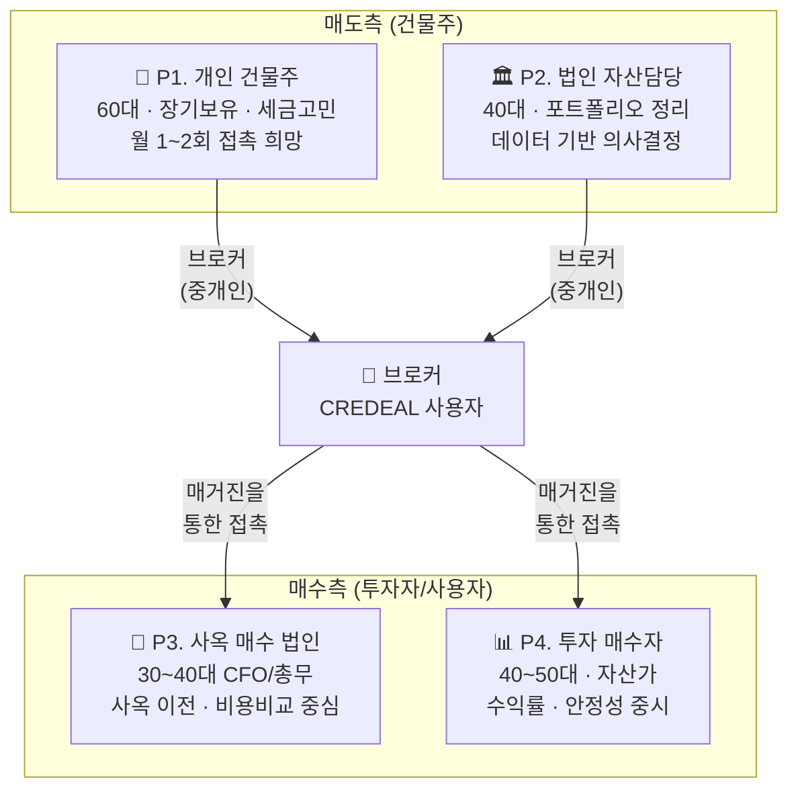
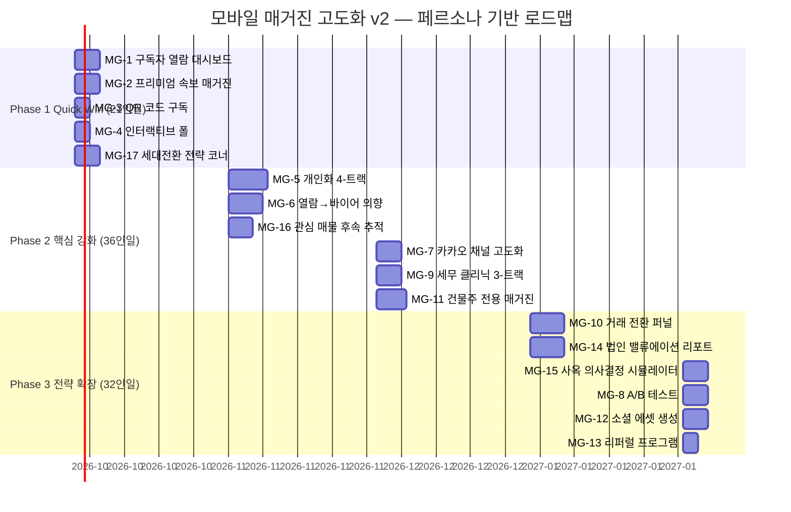

# CREDEAL v3 — 모바일 매거진 고도화 v2

> **작성일**: 2026-09-17 · **버전**: v2 (페르소나 기반 고도화)  
> **핵심 변경**: 건물주/법인담당자 4대 페르소나 분석 → 개선점 13 → **17개로 확장**

---

## 1. 브로커 고객 4대 페르소나 분석

소형 빌딩(50억~300억) CRE 중개인의 **실제 고객**은 크게 4가지 유형으로 분류된다. 코드베이스의 [`buyer-clustering.ts`](file:///c:/Users/User/cre-dealcard/src/domain/prediction/buyer-clustering.ts)에서도 `PURPOSE_MAP: { 사옥: 1, 투자: 2, 증여: 3, 혼합: 4 }` 형태로 매수 목적이 분류되어 있으며, [`buyer_type`](file:///c:/Users/User/cre-dealcard/src/domain/buyer/buyer-intent.ts#L54)은 개인/법인을 구분한다.

---

### P1. 개인 건물주 (매도측 핵심)

| 항목 | 상세 |
|---|---|
| **프로필** | 55~70대, 10년+ 보유, 강남/마포/성동 소형 빌딩 1~3채 |
| **디지털 리터러시** | 낮음. 카카오톡이 유일한 디지털 채널. 이메일 거의 안 봄 |
| **접촉 빈도** | 매각 의사 없을 때도 월 1~2회 안부 접촉 필요 — "관리 안 하면 다른 브로커에게 빼앗김" |
| **의사결정 구조** | 본인 + 배우자/자녀 합의. 세무사·법무사 의견 중시 |

#### 페인포인트 & 니즈

| # | 페인포인트 | 니즈 | 매거진 기회 |
|---|---|---|---|
| PP1 | "내 건물 지금 팔면 세금이 얼마나 나올지 모름" | 양도세 시뮬레이션 | 건물주별 맞춤 세금 시나리오 |
| PP2 | "주변에서 얼마에 거래됐는지 알고 싶지만 찾기 어려움" | 인근 실거래 자동 알림 | 내 건물 주변 실거래 리포트 |
| PP3 | "내 건물 가치가 오르고 있는지 내리고 있는지 감이 없음" | 자산 가치 변동 추적 | 분기별 자산 가치 리포트 |
| PP4 | "브로커가 여러 명 연락하는데, 누가 진짜 잘 하는지 모름" | 신뢰할 수 있는 단일 전문가 | 전문성 증명 콘텐츠 |
| PP5 | "자녀에게 물려줄 때 어떻게 하는 게 유리한지 모름" | 증여/상속 가이드 | 세대 전환 전략 코너 |

---

### P2. 법인 자산 담당자 (매도측)

| 항목 | 상세 |
|---|---|
| **프로필** | 35~50대, 경영기획/재무팀, 법인 보유 부동산 자산 관리 |
| **디지털 리터러시** | 높음. 이메일+슬랙+엑셀이 주 도구. 데이터 선호 |
| **접촉 빈도** | 분기 1회 정기 보고 + 시장 변동 시 수시 |
| **의사결정 구조** | 담당자 검토 → 임원 보고 → 이사회 승인. 보고서(PDF/PPTX) 필수 |

#### 페인포인트 & 니즈

| # | 페인포인트 | 니즈 | 매거진 기회 |
|---|---|---|---|
| PP6 | "경영진에게 보고할 수 있는 깔끔한 시장 리포트가 필요" | 전문가 수준 PDF 보고서 | 매거진 → PDF 추출 기능 |
| PP7 | "보유 자산의 감정 가치 vs 시장 가치 차이를 추적해야 함" | 자산 가치 모니터링 대시보드 | 법인 자산 밸류에이션 리포트 |
| PP8 | "매각 적기 판단을 위한 시장 지표가 흩어져 있음" | 통합 시장 대시보드 | 의사결정용 시장 인텔리전스 |
| PP9 | "관련 세법 변경이 있으면 즉시 알아야 함" | 규제 변경 알림 | 법인세/양도세 정책 속보 |

---

### P3. 사옥 매수 법인 (매수측)

| 항목 | 상세 |
|---|---|
| **프로필** | 30~45대 CFO/총무이사, 성장 IT/바이오/핀테크 법인 |
| **디지털 리터러시** | 매우 높음. 데이터 시트, 비교 분석 선호 |
| **접촉 빈도** | 매수 탐색기에 주 1~2회 적극 접촉 ↔ 비탐색기 월 1회 |
| **의사결정 구조** | CFO → CEO → 이사회. ROI 비교(임대 vs 매입 vs BTS) 필수 |

#### 페인포인트 & 니즈

| # | 페인포인트 | 니즈 | 매거진 기회 |
|---|---|---|---|
| PP10 | "임대 vs 매입 vs BTS(맞춤 건축) 비교를 정량적으로 해야 함" | 총비용(TCO) 비교 시뮬레이터 | 사옥 의사결정 시뮬레이션 |
| PP11 | "직원 통근 편의성, 주변 인프라를 빠르게 파악하고 싶음" | 입지 분석 시각화 | 교통/인프라 인텔리전스 |
| PP12 | "비슷한 규모의 기업이 어디에 사옥을 마련했는지 사례가 필요" | 업종별 사옥 이전 사례 | 사옥 이전 케이스 스터디 |
| PP13 | "매수 과정의 일정과 체크리스트를 한눈에 보고 싶음" | 매수 프로세스 가이드 | 사옥 매수 스텝바이스텝 |

---

### P4. 투자 매수자 (매수측 핵심)

| 항목 | 상세 |
|---|---|
| **프로필** | 40~60대, 고액 자산가 또는 패밀리 오피스, 수익형 투자 |
| **디지털 리터러시** | 중간. 카카오톡 선호, PDF 보고서 신뢰 |
| **접촉 빈도** | 주 1회 시장 동향 + 좋은 물건 즉시 알림 |
| **의사결정 구조** | 본인 결정(빠름) 또는 세무사 자문 후 결정 |

#### 페인포인트 & 니즈

| # | 페인포인트 | 니즈 | 매거진 기회 |
|---|---|---|---|
| PP14 | "수익률 좋은 물건이 나오면 빨리 알고 싶음 — 남보다 먼저" | 속보 알림 + 우선 접근 | 프리미엄 속보 (유료 가치) |
| PP15 | "시장 전체가 올라가는지 내려가는지 체감이 필요" | 시장 온도 + 거래량 트렌드 | 시장 펄스 (이미 구현) |
| PP16 | "과거에 봤던 물건들의 결과(거래 성사/가격)를 추적하고 싶음" | 관심 매물 히스토리 | 관심 매물 후속 알림 |
| PP17 | "세금 최적화가 투자 수익률에 직접 영향" | 절세 전략 가이드 | 투자자 세무 클리닉 |
| PP18 | "같은 투자자끼리 정보 교환하고 싶음" | 투자자 커뮤니티 | 독자 Q&A / 경험 공유 코너 |

---

## 2. 페르소나 ↔ 개선점 매핑

기존 13개에 **4개 신규**(MG-14~17)를 추가하고, 기존 개선점을 페르소나 니즈에 맞춰 **재설계·강화**했다.

### 전체 매핑 테이블

| 개선점 | 주 타깃 페르소나 | 관련 Pain Point | 신규/강화 |
|---|---|---|---|
| MG-1. 구독자 열람 대시보드 | 브로커 (P1~P4 공통) | 모든 고객 관리 | 기존 |
| MG-2. 속보 매거진 | **P4** 투자매수자 + P3 | PP14 "남보다 먼저" | ✅ **강화** |
| MG-3. QR 코드 구독자 등록 | 브로커 → P1, P4 | 현장 접촉 | 기존 |
| MG-4. 인터랙티브 폴 | P4 투자매수자 | PP15 시장 체감 | 기존 |
| MG-5. 개인화 다이나믹 콘텐츠 | **P2~P4** 전체 | PP6, PP10, PP14 | ✅ **강화** |
| MG-6. 열람→바이어 의향 자동 | P3 사옥법인, P4 투자자 | PP13, PP16 | 기존 |
| MG-7. 카카오 채널 고도화 | **P1** 개인건물주, P4 | PP4 디지털 채널 | 기존 |
| MG-8. A/B 테스트 | 브로커 (전체) | 열람율 최적화 | 기존 |
| MG-9. 세무 클리닉 | **P1** 개인건물주, P4 | PP1, PP5, PP17 | ✅ **강화** |
| MG-10. 거래 전환 퍼널 | 브로커 (전체) | ROI 증명 | 기존 |
| MG-11. 건물주 전용 매거진 | **P1** 개인건물주 | PP2, PP3, PP4 | ✅ **강화** |
| MG-12. 소셜 에셋 자동 생성 | 브로커 → P4 | 바이럴 확장 | 기존 |
| MG-13. 리퍼럴 프로그램 | P4 → P4 | 네트워크 효과 | 기존 |
| **MG-14. 법인 자산 밸류에이션 리포트** | **P2** 법인자산담당 | PP6, PP7, PP8 | 🆕 |
| **MG-15. 사옥 의사결정 시뮬레이터** | **P3** 사옥매수법인 | PP10, PP11 | 🆕 |
| **MG-16. 관심 매물 후속 추적 알림** | **P4** 투자매수자 | PP16 | 🆕 |
| **MG-17. 세대 전환 전략 (증여/상속) 코너** | **P1** 개인건물주 | PP1, PP5 | 🆕 |

---

## 3. 신규 개선점 4건 (MG-14 ~ MG-17) 상세

### MG-14. 법인 자산 밸류에이션 리포트 🆕

**타깃 페르소나**: P2 (법인 자산 담당자)

**Pain Point**: "경영진에게 보고할 수 있는 깔끔한 시장 리포트가 필요" (PP6, PP7, PP8)

**현재 상태**: [`owner-report-generator.ts`](file:///c:/Users/User/cre-dealcard/src/domain/magazine/owner-report-generator.ts)에 분기별 건물주 리포트 기본 구조(사례비교, 매각 시그널, 가치 변동률)가 존재. 그러나 **법인 담당자가 경영진에게 보고할 수 있는 PDF/PPTX 수준의 포멧이 아님**.

**개선 방향**:
- 분기별 **법인 자산 밸류에이션 보고서** 자동 생성 (PDF + PPTX 양식)
- 포함 내용:
  - 보유 자산 현황 (주소, 면적, 감정가, 시장 추정가, 괴리율)
  - 인근 실거래 벤치마크 ([`owner-report-generator.ts`의 `ComparableTx`](file:///c:/Users/User/cre-dealcard/src/domain/magazine/owner-report-generator.ts#L20-L26) 확장)
  - 공실률 변동, 임대 시세 트렌드 (매거진 `rentalTrend` 데이터 활용)
  - 매각 시그널 자동 감지 ([`SellSignal`](file:///c:/Users/User/cre-dealcard/src/domain/magazine/owner-report-generator.ts#L28-L32) 확장)
  - 세전/세후 매각 시뮬레이션
- **법인 담당자 전용 매거진 에디션** → [`dispatcher.ts`](file:///c:/Users/User/cre-dealcard/src/domain/magazine/rail/dispatcher.ts#L8)의 `owner_report` 타입 활용

**Impact**: High · **Effort**: 7인일 · **Moat**: Strong · **Revenue**: Direct (프리미엄 서비스)

---

### MG-15. 사옥 의사결정 시뮬레이터 🆕

**타깃 페르소나**: P3 (사옥 매수 법인)

**Pain Point**: "임대 vs 매입 vs BTS 비교를 정량적으로 해야 함" (PP10, PP11)

**현재 상태**: 매거진 컴포넌트에 [`RoiCalculator.tsx`](file:///c:/Users/User/cre-dealcard/src/components/magazine/RoiCalculator.tsx) (9KB)가 존재하나, 사옥 전용 시나리오 비교가 아닌 단순 수익률 계산.

**개선 방향**:
- 매거진 뷰어 내 **인터랙티브 사옥 의사결정 시뮬레이터**
- 3안 비교:
  - **임대 유지**: 현재 임대료 × 잔여 계약 기간 + 예상 인상률
  - **매입**: 매입가 + 취득세 + 리모델링 - 감가상각 절세 - 잔여 보유 가치
  - **BTS(맞춤 건축)**: 토지비 + 공사비 + 기간 비용 - 맞춤 설계 가치
- 입력값: 희망 면적, 예산, 현재 임대료, 직원 수, 희망 권역
- 결과: 5년/10년 TCO 비교 차트 + 추천 전략
- 시뮬레이션 결과를 **브로커에게 자동 전달** → 후속 상담 연결

**Impact**: High · **Effort**: 5인일 · **Moat**: Strong · **Revenue**: Indirect (리드 생성)

---

### MG-16. 관심 매물 후속 추적 알림 🆕

**타깃 페르소나**: P4 (투자 매수자)

**Pain Point**: "과거에 봤던 물건들의 결과를 추적하고 싶다" (PP16)

**현재 상태**: [`use-magazine-analytics.ts`](file:///c:/Users/User/cre-dealcard/src/hooks/use-magazine-analytics.ts)에서 `click` 이벤트로 매물 클릭을 추적하고, [`buyer-temperature.ts`](file:///c:/Users/User/cre-dealcard/src/domain/magazine/buyer-temperature.ts)에서 관심도를 측정하지만, **클릭한 매물의 후속 상태 변화를 알려주지 않음**.

**개선 방향**:
- 구독자가 매거진에서 클릭한 매물의 **상태 변화 자동 추적**
  - "지난주 관심을 보이셨던 강남구 역삼동 빌딩이 가격이 5% 조정되었습니다"
  - "지난달 열람하셨던 성수동 빌딩이 계약 진행 중입니다 — 유사 매물을 확인해보세요"
- 매거진 하단에 **"나의 관심 매물 현황"** 개인화 섹션
- 매물 상태 변화 시 알림톡 자동 발송 (옵트인)
- [`magazine_analytics_events`](file:///c:/Users/User/cre-dealcard/src/hooks/use-magazine-analytics.ts#L63) → `building_ssot_lite.status` 조인으로 구현

**Impact**: High · **Effort**: 5인일 · **Moat**: Strong · **Revenue**: Indirect

---

### MG-17. 세대 전환 전략 (증여/상속) 코너 🆕

**타깃 페르소나**: P1 (개인 건물주)

**Pain Point**: "자녀에게 물려줄 때 어떻게 하는 게 유리한지 모름" (PP1, PP5)

**현재 상태**: 매거진에 세무 관련 콘텐츠 섹션 없음. [`taxClinic`](file:///c:/Users/User/cre-dealcard/src/domain/magazine/email-template.tsx#L20) 필드만 정의.

**개선 방향**:
- 월 1회 **"세대 전환 전략"** 전문 코너 (매거진 확장 섹션)
- 시나리오별 세금 비교:
  - 증여 후 매각 vs 직접 매각 (양도세 vs 증여세 비교)
  - 법인 전환 후 매각 (법인세 구조)
  - 공동 명의 분할 전략
- AI 기반 시뮬레이션 + 전문가(세무사) 감수 마크 표시
- 건물주 세그먼트 구독자에게만 자동 포함
- **"상담 예약하기"** CTA → 브로커 + 제휴 세무사 연결

> [!IMPORTANT]
> 이 코너는 개인 건물주와의 **신뢰 관계 구축**에 핵심적이다. 세금 문제는 건물주가 가장 민감하게 반응하는 영역으로, 유용한 세무 정보를 정기적으로 제공하는 브로커는 독점적 관계를 형성할 수 있다.

**Impact**: High · **Effort**: 5인일 · **Moat**: Strong · **Revenue**: Indirect (독점 계약 유지)

---

## 4. 기존 개선점 강화 4건 상세

### MG-2 강화. 속보 매거진 → 투자자 프리미엄 속보

**P4 니즈 반영**: 투자 매수자는 "남보다 먼저" 정보를 원한다.

**추가 사항**:
- **티어별 속보 접근**: Free 구독자는 12시간 후 열람 / Pro 구독자는 즉시 열람
- 속보에 **예상 수익률 밴드 자동 계산** 포함 (Claim 기반, NLG 마스크 적용)
- "이 매물에 관심이 있으시면 1번을 눌러주세요" → 원클릭 의향 등록
- [`magazine_teaser_cards.ts`](file:///c:/Users/User/cre-dealcard/src/domain/magazine/magazine-teaser-cards.ts) 활용 → 블라인드 티저로 호기심 유발

---

### MG-5 강화. 개인화 다이나믹 콘텐츠 → 페르소나별 트랙

**전 페르소나 니즈 반영**: 각 페르소나가 원하는 콘텐츠가 근본적으로 다르다.

**추가 사항**:
- [`SubscriberSegment`](file:///c:/Users/User/cre-dealcard/src/domain/magazine/subscriber-profile.ts#L8) = `'investor' | 'seller' | 'owner'` → **4트랙 확장**:

| 트랙 | 대상 페르소나 | 핵심 콘텐츠 | 톤 |
|---|---|---|---|
| `investor` | P4 투자매수자 | 수익률 분석, 속보 매물, 경매 픽 | 전문적/공격적 |
| `corporate_buyer` | P3 사옥법인 | 사옥 비교, 교통 분석, 사례 | 분석적/비교 중심 |
| `owner_individual` | P1 개인건물주 | 자산 가치, 세무 팁, 시장 동향 | 친근/안심 제공 |
| `owner_corporate` | P2 법인자산 | 밸류에이션, 규제, 포트폴리오 | 전문적/보고서형 |

- 구독자 등록 시 세그먼트 자동 추론 (interest_tags + buyer_type 기반)
- 매거진 에디션 생성 시 [`EXTRA_SECTIONS`](file:///c:/Users/User/cre-dealcard/src/domain/magazine/types.ts#L145-L176) 5개 중 트랙별 우선 섹션 자동 선택

---

### MG-9 강화. 세무 클리닉 → 페르소나별 분리

**P1/P4 니즈 반영**: 건물주와 투자자의 세무 관심사가 다르다.

**추가 사항**:
- **건물주 트랙**: 양도세 중과, 1세대 1주택 비과세, 증여세, 상속세
- **투자자 트랙**: 취득세 감면, 법인 설립 절세, 부가세 포괄양수도, 임대사업자 혜택
- **법인 트랙**: 법인세 조정, 자산 재평가, 합병/분할 시 세무

---

### MG-11 강화. 건물주 전용 매거진 → P1 맞춤 설계

**P1 특성 반영**: 디지털 리터러시가 낮고, 카카오톡이 유일한 채널.

**추가 사항**:
- **카카오톡 최적화**: 이메일이 아닌 **카카오 알림톡/친구톡**을 주 배포 채널로
- 글자 크기 15% 확대, 차트 대신 이모지+숫자 강조, 스크롤 최소화
- "내 건물 이야기" 인트로 → 인근 실거래, 공실률 변동, 가치 변화를 **1분 안에 파악**
- [`owner-report-generator.ts`](file:///c:/Users/User/cre-dealcard/src/domain/magazine/owner-report-generator.ts)의 `SellSignal` 활용 → "지금이 매각 적기일 수 있습니다" 넛지
- 자녀 공동 열람 링크 → PP5(증여/상속 대비) 자연 연결

---

## 5. 최종 우선순위 매트릭스 (17건)

| # | 개선점 | 주 타깃 | Impact | Effort | Moat | Revenue | 인일 | Phase |
|---|---|---|---|---|---|---|---|---|
| **MG-1** | 구독자 열람 대시보드 | 공통 | High | Medium | Strong | Indirect | 5 | ⭐ P1 |
| **MG-2** | 속보 매거진 (프리미엄) | **P4** | High | Medium | Strong | **Direct** | 5 | ⭐ P1 |
| **MG-3** | QR 코드 구독자 등록 | P1, P4 | High | Small | Moderate | Indirect | 3 | ⭐ P1 |
| **MG-4** | 인터랙티브 폴 | P4 | Medium | Small | Strong | Indirect | 3 | ⭐ P1 |
| **MG-17** | 세대전환 전략 코너 🆕 | **P1** | High | Medium | **Strong** | Indirect | 5 | ⭐ P1 |
| **MG-5** | 개인화 4-트랙 콘텐츠 | P1~P4 | High | Medium | Strong | Indirect | 8 | 🔵 P2 |
| **MG-6** | 열람→바이어 의향 자동 | P3, P4 | High | Medium | **Strong** | Indirect | 7 | 🔵 P2 |
| **MG-7** | 카카오 채널 고도화 | **P1**, P4 | High | Medium | Moderate | Indirect | 5 | 🔵 P2 |
| **MG-9** | 세무 클리닉 (3트랙) | P1, P4 | Medium | Small | Strong | Indirect | 5 | 🔵 P2 |
| **MG-11** | 건물주 전용 매거진 | **P1** | High | Medium | Strong | Indirect | 6 | 🔵 P2 |
| **MG-16** | 관심 매물 후속 추적 🆕 | **P4** | High | Medium | **Strong** | Indirect | 5 | 🔵 P2 |
| **MG-8** | A/B 테스트 | 공통 | Medium | Medium | Moderate | Indirect | 5 | 🟢 P3 |
| **MG-10** | 거래 전환 퍼널 | 공통 | High | Medium | **Strong** | **Direct** | 7 | 🟢 P3 |
| **MG-14** | 법인 밸류에이션 리포트 🆕 | **P2** | High | Medium | Strong | **Direct** | 7 | 🟢 P3 |
| **MG-15** | 사옥 의사결정 시뮬레이터 🆕 | **P3** | High | Medium | **Strong** | Indirect | 5 | 🟢 P3 |
| **MG-12** | 소셜 에셋 자동 생성 | P4 | Medium | Medium | Moderate | Indirect | 5 | 🟢 P3 |
| **MG-13** | 리퍼럴 프로그램 | P4 | Medium | Small | Moderate | Indirect | 3 | 🟢 P3 |

---

## 6. 실행 로드맵 (페르소나별 임팩트 순)

| Phase | 기간 | 핵심 임팩트 | 총 인일 |
|---|---|---|---|
| **Phase 1** | 2026년 10월 | P1 건물주 신뢰 구축 + P4 투자자 유입 | 21인일 |
| **Phase 2** | 2026년 11~12월 | 4-페르소나 개인화 + 바이어 전환 | 36인일 |
| **Phase 3** | 2027년 1~2월 | P2/P3 법인 시장 진입 + 수익화 | 32인일 |

---

## 7. 페르소나별 기대 효과

| 페르소나 | 현재 접촉 품질 | Phase 1 후 | Phase 3 후 | 핵심 KPI |
|---|---|---|---|---|
| **P1 개인 건물주** | 낮음 (일방적 전화) | 중간 (세무+자산 콘텐츠) | 높음 (맞춤 리포트) | 독점 위탁 계약 유지율 |
| **P2 법인 자산담당** | 없음 | 없음 | 높음 (밸류에이션 리포트) | 법인 고객 신규 확보 |
| **P3 사옥 매수법인** | 낮음 | 낮음 | 높음 (TCO 시뮬레이터) | 사옥 딜 전환율 |
| **P4 투자 매수자** | 중간 (주간 매거진) | 높음 (속보+폴+추적) | 매우 높음 (완전 개인화) | 매수 의향 등록 수 |

### 수익화 기여 포인트

| 포인트 | 관련 기능 | 과금 모델 | 예상 MRR 기여 |
|---|---|---|---|
| 프리미엄 속보 우선 접근 | MG-2 | Pro 구독 차별화 | 월 300만원 (30명 × 9.9만원) |
| 법인 밸류에이션 리포트 | MG-14 | Enterprise 전용 또는 건별 | 월 500만원 (20법인 × 25만원) |
| 사옥 시뮬레이터 리드 | MG-15 | 리드당 과금 | 건당 50~100만원 |
| 거래 전환 어트리뷰션 | MG-10 | 성사 수수료 비례 | 거래 건당 중개보수 5~10% |

> [!TIP]
> **가장 큰 전략적 가치**: MG-11(건물주 전용 매거진) + MG-17(세대전환 코너)의 조합은 **60대 건물주와의 장기 신뢰 관계**를 구축한다. 이 관계는 건물주가 "팔고 싶을 때" CREDEAL 브로커를 **가장 먼저** 떠올리게 만드는 핵심 해자이며, 경쟁사가 기술만으로 복제할 수 없는 관계 자산이다.
