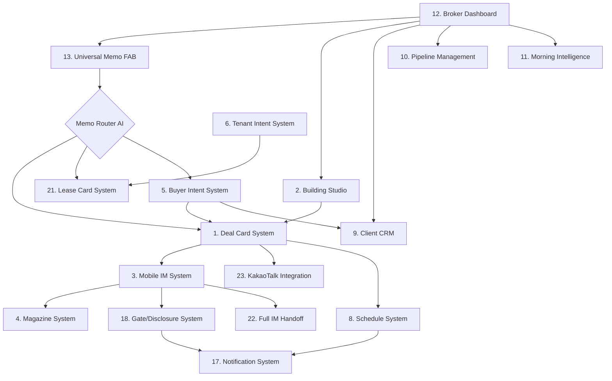
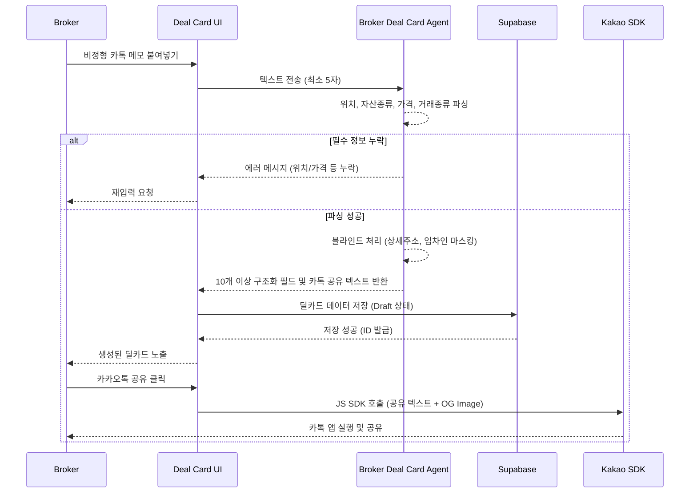
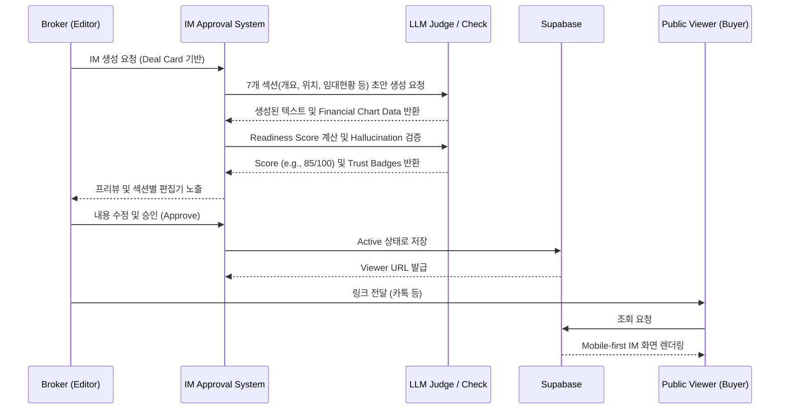

# CRE Deal Card 플랫폼 - 전체 기능 명세서 (Feature Specification Full Audit)

본 문서는 CRE Deal Card 플랫폼의 모든 기능(총 29개)에 대한 상세한 기술 및 비즈니스 명세를 포함합니다. 

---

## 1. 기능 개요 매트릭스 (Feature Overview Matrix)

| 기능명 | 경로 (Route) | 주요 AI 에이전트 | 중요도 | 비고 |
|:---|:---|:---|:---:|:---|
| 1. Deal Card System | `/broker/deal-card/*` | `broker-deal-card` | **High** | 텍스트 메모 → 구조화된 딜카드 |
| 2. Building Studio | `/broker/buildings` | N/A | **High** | 파이프라인 관리 대시보드 |
| 3. Mobile IM System | `/broker/im-approval/*`, `/im-lite/*` | Hallucination Check, LLM Judge | **High** | 모바일 최적화 투자설명서 |
| 4. Magazine System | `/broker/magazine-editor`, `/magazine/*` | AI Assist (Content Gen) | **High** | 고객 배포용 매거진 에디터 |
| 5. Buyer Intent System | `/broker/buyer-intents` | `buyer-memo-writer` | **High** | 매수자 조건 매칭 및 제안서 |
| 6. Tenant Intent System| `/broker/tenant-intents` | `tenant-intent-normalizer`, `tenant-fit-agent` | Med | 임차 조건 매칭 |
| 7. Map Capture Tool | `/broker/map-capture` | N/A | Low | 보안된 주변 지역 캡처 |
| 8. Schedule System | `/broker/schedule` | `schedule-advisor` | Med | 임장 일정 및 알림 관리 |
| 9. Client CRM | `/broker/clients` | N/A | Med | 고객 정보 및 이력 관리 |
| 10. Pipeline Management| `/broker/pipeline` | N/A | **High** | 딜 상태 (Draft ~ Closed) 관리 |
| 11. Morning Intelligence| `/broker` (Dashboard) | AI Curated Insights | Med | 일일 마켓 리포트 |
| 12. Broker Dashboard | `/broker` | 15 Parallel DB Queries | **High** | 메인 컨트롤 센터 |
| 13. Universal Memo FAB | Floating Action Button | `memo-router-agent` | Med | 입력 내용 기반 기능 자동 라우팅 |
| 14. Vibe Card System | `/broker/vibe-card`, `/vibe-card/*`| `vibe-fit-agent` | Med | 자산 분위기 매칭 명함 |
| 15. Owner Readiness | `/owner-readiness` | N/A | Low | 매각 준비도 측정 게이지 |
| 16. Agora Community | `/agora` | N/A | Low | 커뮤니티 및 시장 심리 논의 |
| 17. Notification System| N/A (Background) | N/A | Med | 카카오 알림톡 및 인앱 알림 |
| 18. Gate/Disclosure | N/A (Flow logic) | `DisclosureGuardAgent` | **High** | 단계별 정보 제공 시스템 |
| 19. Deal Prediction | N/A (Engine) | Price Prediction, Conversion | Med | 거래 성공률 및 가격 예측 |
| 20. Campaign System | `/broker/campaign` | `campaign-copy-agent` | Med | 마케팅 카피라이팅 생성 |
| 21. Lease Card System | `/broker/lease-card` | `lease-deal-card` | Med | 임대 전용 딜카드 |
| 22. Full IM Handoff | N/A (Bridge) | N/A | Med | 별도 Full IM 앱으로 데이터 이관 |
| 23. KakaoTalk Integrate| N/A (SDK) | AI KakaoText Prompting | **High** | 요약 텍스트 및 OG Image 생성 |
| 24. Broker Profile | `/broker-profile/*` | N/A | Med | 중개인 퍼블릭 프로필 |
| 25. Analytics | N/A (Event Logger) | AI Curiosity Score | Med | 사용자 행동 분석 및 ROI |
| 26. Weekly/Monthly Rep | `/broker` (Dashboard) | N/A | Low | 주간/월간 실적 요약 카드 |
| 27. Crowdfunding Mod | `/funding` | `funding-project-card` | Low | 크라우드펀딩 프로젝트 |
| 28. IoT Integration | N/A (Data stream) | N/A | Low | 빌딩 센서 데이터 수집 |
| 29. Search & Explore | `/search`, `/explore` | N/A | Med | 빌딩 검색 및 탐색 |

---

## 2. 기능 의존성 다이어그램 (Feature Dependency Diagram)

---

## 3. 주요 데이터 흐름도 (Data Flow Diagrams)

### 3.1 딜카드 생성 데이터 흐름

### 3.2 모바일 IM 승인 및 열람 흐름

---

## 4. AI 에이전트 활용 맵 (AI Agent Utilization Map)

플랫폼 전반에 걸쳐 AI는 데이터 구조화, 매칭, 검증, 콘텐츠 생성의 핵심 역할을 수행합니다.

1. **broker-deal-card**: 자연어 메모를 파싱하여 구조화된 딜 데이터로 변환, 블라인드 정보 마스킹.
2. **LLM-as-Judge**: 생성된 모바일 IM의 퀄리티(Readiness Score) 평가 및 환각 현상(Hallucination) 검증.
3. **buyer-memo-writer**: 매수자 요구사항과 매물 간의 적합성을 평가하고 맞춤형 제안 메시지 초안 생성.
4. **tenant-intent-normalizer & tenant-fit-agent**: 임차인의 복잡한 요구조건을 표준화하고 가용 공간과 매칭 (S, A, B, C 등급 산출).
5. **schedule-advisor**: 중개인, 임대인, 임차인의 일정을 분석하여 최적의 임장 시간대 추천.
6. **memo-router-agent**: 대시보드의 통합 메모 창에서 입력된 텍스트의 의도를 파악하여 적절한 시스템(딜, 매수, 임차)으로 라우팅.
7. **vibe-fit-agent**: 자산의 특성을 7차원 Vibe Vector로 분석하여 32개의 UI 템플릿 중 가장 적합한 명함 템플릿 매칭.
8. **DisclosureGuardAgent**: 잠재 매수자의 정보 요청 시, 단계별(G1~G3) 정보 공개의 안전성 검증 및 승인 권고.
9. **campaign-copy-agent**: 대상 타겟에 맞춘 부동산 마케팅 및 캠페인용 카피라이팅 생성.
10. **funding-project-card**: 크라우드펀딩 프로젝트 생성을 위한 매력적인 문구 및 요약표 자동 완성.

---

## 5. 상세 기능 명세 (Detailed Feature Specs)

### 5.1 Deal Card System (딜카드)
- **개요**: 비정형 카카오톡 메모를 붙여넣으면 AI가 이를 분석하여 구조화된 블라인드 티저 형태의 딜카드로 변환해주는 핵심 시스템.
- **경로**: `/broker/deal-card/new` (생성), `/broker/deal-card/[id]` (결과 및 수정)
- **입력**: 자유 형식의 텍스트 메모 (최소 5자 이상), 선택적 사진 업로드
- **출력**: 제목, 짧은 요약, 주요 투자 포인트(deal points), 주의점(caution points), 숨겨진 정보 알림, 경계선 노트, 카카오톡 공유용 최적화 텍스트
- **비즈니스 규칙**: 
  - **Quality Gate**: 메모 내에 위치(Location), 자산종류(Asset Type), 가격(Price)/면적(Area), 거래종류(Deal Type) 중 하나라도 없으면 명확한 에러 메시지와 함께 처리를 거부.
  - **Blind Processing**: 정확한 지번, 주요 임차인명, 매도자 사유, 1원 단위의 정확한 임대료 등은 자동으로 마스킹(숨김) 처리.
- **AI 활용**: `broker-deal-card` 에이전트가 `area_signal`, `asset_type`, `price_band` 등 10개 이상의 필드를 추출.
- **연동 관계**: 생성된 딜카드는 Mobile IM 생성, 일정 관리(Schedule), 게이트 요청, 매수자 매칭 시스템으로 연결됨.

### 5.2 Building Studio (건물 스튜디오)
- **개요**: 중개인이 보유한 전체 자산 파이프라인을 관리하는 대시보드.
- **경로**: `/broker/buildings`
- **주요 KPI**: 평균 프로모션 점수(AVG Promotion Score), 활성 파이프라인 수(Active Pipeline count)
- **기능**: 용도별 필터링(office/retail), 텍스트 검색, 정렬(promotion score, 생성일순), 상태 뱃지가 포함된 리스트 뷰.
- **액션**: 특정 자산 클릭 시 Deal Card, IM Editor로 이동하거나 삭제 가능.
- **비즈니스 규칙**: AI가 계산한 Promotion Score(딜의 시장성 점수)를 기반으로 우선순위 리스팅.

### 5.3 Mobile IM System (모바일 투자설명서)
- **개요**: 모바일 환경에 최적화된 투자설명서(IM)를 AI 기반으로 자동 생성하고, 대중에게 안전하게 배포하는 시스템.
- **경로**: `/broker/im-approval/[id]` (승인 및 편집), `/im-lite/[buildingId]` (퍼블릭 뷰어)
- **구성 (7 Sections)**: property_overview, location_access, lease_status, income_analysis, risk_check, investment_thesis, next_steps.
- **특화 컴포넌트**: 
  - **Hero Card**: Cap Rate, NOI, 필요 자본금(Equity Required), 레버리지 수익률, DCF NPV 등 핵심 투자 지표 요약.
  - **Financial Charts**: 10년 민감도 분석(DCF Heatmap), 레버리지 차트, 가격 추이 차트.
- **품질 관리 및 AI**: 
  - 8개 데이터 포인트를 기반으로 100점 만점의 **Readiness Score** 산출 (40점 미만 시 배포 불가).
  - LLM-as-Judge를 통한 환각(Hallucination) 검증 로직.
- **데이터 출처**: 내부 SSoT(Single Source of Truth) 데이터 + 중개인 추가 정보 + 7개 공공 API 연동.
- **Provenance Tracking (출처 표기)**: 정보의 신뢰도를 4단계 뱃지로 표시 (✓공부확인, ★전문가검증, 👤중개인입력, ⚙AI추정).
- **Rent Roll 임포트**: 엑셀/CSV 파서가 헤더를 자동 인식하고 면적 단위 변환, 공실 여부를 탐지하여 렌트롤 테이블 구축.

### 5.4 Magazine System (매거진)
- **개요**: 중개인이 잠재 고객들에게 정기적으로 시장 소식과 추천 딜을 배포할 수 있는 콘텐츠 에디터 및 뷰어.
- **경로**: `/broker/magazine-editor` (에디터), `/magazine/[slug]` (퍼블릭 뷰어)
- **에디터 탭 구성 (7 Tabs)**: Cover(표지), Field Note(임장노트), Theme&Deals(테마/매물), News(뉴스), AI Assist, Outreach(발송), Publish(발행).
- **기능**: 시장 온도 선택, 임장 반응(매수/매도자) 기록, 큐레이션 뉴스 연동, 자동 임시저장(30초 주기).
- **연동 관계**: Mobile IM의 Hero Card에서 딜 요약 정보를 자동 추출(Bridge)하여 매거진 내 삽입 가능. 카카오맵 정적 임베드 및 라이트박스 갤러리 지원.

### 5.5 Buyer Intent System (매수 의향서)
- **개요**: 매수자의 요구조건을 등록하면 AI가 적합한 매물을 찾아 제안서 초안을 작성해주는 시스템.
- **경로**: `/broker/buyer-intents`
- **AI 활용**: `buyer-memo-writer` 에이전트가 매수 조건과 빌딩 데이터를 비교 분석.
- **출력물**: 매칭 이유(Fit reasons), 주의점(Caution reasons), 누락된 데이터 질문 리스트, 카카오톡 전송용 피칭 메시지.
- **비즈니스 규칙**: 분석 결과에 따라 S, A, B, C 등급을 부여. 중개인은 AI가 생성한 '누락된 질문' 리스트를 카톡 메시지에 주입하여 고객과 소통 가능.

### 5.6 Tenant Intent System (임차 의향서)
- **개요**: 임차인의 입주 요구조건(면적, 예산, 층수, 업종 등)을 등록하고 가용 공간(Lease Spaces)과 매칭.
- **경로**: `/broker/tenant-intents`
- **AI 활용**: `tenant-intent-normalizer`(비정형 조건 표준화), `tenant-fit-agent`(적합도 분석).
- **데이터 모델**: 매칭 결과는 `lease_match_results` 테이블에 등급과 함께 저장됨.

### 5.7 Map Capture Tool (지도 캡처)
- **개요**: 블라인드 딜의 특성을 유지하면서 주변 인프라를 보여주기 위해, 정확한 핀(Pin)을 숨기고 반경을 표시하는 지도 캡처 도구.
- **경로**: `/broker/map-capture`
- **기능**: 카카오맵/OSM 연동, 두 지점(출발-도착) 표시, 마스킹된 이미지 다운로드.

### 5.8 Schedule System (일정 관리)
- **개요**: 중개인, 매도자, 매수자 간의 임장(Site Visit) 및 미팅 일정을 조율하고 관리하는 시스템.
- **경로**: `/broker/schedule`
- **데이터 모델**: `bookings`, `availability_slots`
- **AI 및 자동화**: `schedule-advisor`가 최적의 슬롯 추천. Cron 작업을 통해 만료된 일정 상태 자동 변경.
- **알림**: 일정 확정 시 Solapi를 통해 카카오 알림톡(Alimtalk) 자동 발송.

### 5.9 Client CRM (고객 관리)
- **개요**: 브로커의 고객 연락처 및 상호작용 이력을 관리하는 기본 CRM.
- **경로**: `/broker/clients`
- **데이터 모델**: `broker_clients` 테이블 사용.

### 5.10 Pipeline Management (파이프라인)
- **개요**: 등록된 딜의 진행 상태를 시각적 보드(Kanban 형태)로 관리.
- **경로**: `/broker/pipeline`
- **상태 (States)**: Draft → Active Match → IM Ready → Negotiating → Closed.
- **기능**: 드래그 앤 드롭 상태 변경, 단계별 전환 분석(Analytics).

### 5.11 Morning Intelligence Hub (모닝 인텔리전스)
- **개요**: 대시보드 내에 위치하며, 매일 아침 시장 브리핑, 주요 뉴스, 부동산 선행 지표를 AI가 큐레이션하여 제공.
- **지표**: 추세 방향(trend_direction), 수요 점수(demand_score), 공급 점수(supply_score), 평균 보유 기간(avg_hold_days), 가격 저항선(price_resistance_band).

### 5.12 Broker Dashboard (중개인 코크핏)
- **개요**: 브로커가 로그인 후 가장 먼저 마주하는 메인 컨트롤 센터.
- **경로**: `/broker`
- **기술적 특징**: 페이지 로드 시 15개의 Supabase 쿼리가 병렬로 실행되어 실시간 지표 렌더링.
- **주요 구성요소**: 인사이트 헤더(GreetingHeader), ROI 카드, MarketBreakthroughMode, 주간/월간 리포트 카드, Morning Intelligence, 브로커 탭, 통합 메모 FAB.

### 5.13 Universal Memo FAB (통합 메모)
- **개요**: 대시보드 화면 하단에 항상 떠 있는 Floating Action Button.
- **기능**: 떠오르는 생각이나 고객 통화 내용을 빠르게 메모하면, `memo-router-agent`가 내용을 분석하여 딜카드 신규 생성, 임대 카드 생성, 매수/임차 의향서 중 적합한 워크플로우로 자동 연결시킴.

### 5.14 Vibe Card System (바이브 명함)
- **개요**: 자산이 가진 고유한 분위기와 타겟 고객에 맞춰 시각적 테마가 적용되는 디지털 명함/티저.
- **경로**: `/broker/vibe-card` (관리), `/vibe-card/[slug]` (퍼블릭)
- **Vibe Vector (7차원)**: warmth, energy, polish, authentic, heritage, futuristic, playful.
- **AI 매칭**: `vibe-fit-agent`가 자산 텍스트를 분석하여 32개의 사전 정의된 템플릿(예: Calm-Care, Bold-Futurist) 중 코사인 유사도가 가장 높은 템플릿 자동 적용.

### 5.15 Owner Readiness (건물주 매각 준비도)
- **개요**: 매도자가 매각을 위해 준비한 서류 및 정보 수준을 게이지 형태로 시각화.
- **경로**: `/owner-readiness`
- **기능**: 등기부등본, 도면, 렌트롤, 건축물대장, 납세증명 등 10개 체크리스트 제공.
- **출력 및 핸드오프**: 점수가 100점 만점에 도달하면 'Full IM Candidate'로 분류되며, 보안 토큰을 발행하여 외부의 Full IM Studio 앱으로 원클릭 핸드오프(이관) 가능.

### 5.16 Agora Community (아고라)
- **개요**: 중개인 간의 시장 심리 공유 및 토론 공간.
- **경로**: `/agora`
- **데이터 모델**: `agora_threads`, `agora_replies`.

### 5.17 Notification System (알림 시스템)
- **개요**: 시스템 내 주요 이벤트를 사용자에게 전달하는 듀얼 채널(Dual Channel) 시스템.
- **채널**: 인앱 알림(Supabase Realtime) + 카카오 알림톡(Solapi 연동).
- **트리거**: 일정 확정, 잠재 고객의 IM 열람(Hot Lead), 정보 게이트 접근 요청 등.

### 5.18 Gate/Disclosure System (정보 게이트)
- **개요**: 블라인드 딜의 특성상 민감한 정보를 점진적으로 공개하는 보안 시스템.
- **레벨**:
  - G1: 기본 연락처 교환
  - G2: 상세 주소 및 기본 재무 정보 공개
  - G3: 전체 렌트롤 및 풀 데이터(Full Disclosure)
- **AI 활용**: `DisclosureGuardAgent`가 요청자의 프로필과 의향서를 분석하여 정보 공개의 리스크를 평가하고 중개인에게 승인/거절 권고.

### 5.19 Deal Prediction (딜 예측)
- **개요**: 누적된 데이터와 현재 시장 지표를 바탕으로 거래 결과를 예측하는 백엔드 AI 엔진.
- **출력**: 예상 체결 가격 범위(Min/Max) 및 신뢰도(Confidence %), 거래 성공 확률(0-100% 게이지).
- **구조**: `knowledge_edges` 테이블에 성공 요인(✅)과 위험 요인(⚠️) 그래프 매핑.

### 5.20 Campaign System (마케팅 캠페인)
- **개요**: 매물을 다수의 잠재 고객에게 홍보하기 위한 캠페인 도구.
- **경로**: `/broker/campaign`
- **AI 활용**: `campaign-copy-agent`가 SMS/이메일용 마케팅 카피라이팅 작성.

### 5.21 Lease Card System (임대 딜카드)
- **개요**: 매매용 딜카드와 별개로 '임대' 계약에 최적화된 필드(보증금, 임대료, 렌트프리, 권리금 등)를 가지는 카드.
- **경로**: `/broker/lease-card`
- **AI 활용**: `lease-deal-card` 에이전트.

### 5.22 Full IM Handoff (Full IM 핸드오프)
- **개요**: 본 MVP 플랫폼에서 생성된 초기 데이터를, 보다 전문적인 심층 분석을 제공하는 별도 어플리케이션(Full IM Studio)으로 안전하게 넘겨주는 브릿지 기능.
- **보안**: 만료 시간이 설정된 Handoff Token 사용.
- **상태 관리**: created → pending_import → imported → revoked.

### 5.23 KakaoTalk Integration (카카오톡 연동)
- **개요**: 한국 부동산 시장의 필수 커뮤니케이션 툴인 카카오톡 딥 연동.
- **공유 방식**: Kakao JS SDK (`window.Kakao.Share.sendDefault`) 사용. SDK 로드 실패 시 클립보드 복사 폴백(Fallback) 제공.
- **AI 최적화**: 모든 텍스트 생성 프롬프트는 모바일 카톡 가독성을 고려하여 3~5줄 요약(kakaoText)을 강제함.
- **OG Image**: `/api/og/deal/[id]`를 통해 딜 정보가 시각화된 Open Graph 이미지 동적 생성.

### 5.24 Broker Profile (브로커 프로필)
- **개요**: 중개인의 전문성을 외부에 어필할 수 있는 공개 페이지.
- **경로**: `/broker-profile/[slug]`
- **정보**: 검증 뱃지(Verified badge), 전문 지역, 활성 매물 수, Vibe 명함 링크.

### 5.25 Analytics (분석)
- **개요**: 사용자의 모든 활동 로그를 기록하고 비즈니스 인사이트 도출.
- **데이터 모델**: `activity_events` 테이블.
- **주요 기능**: ROI 계산기(`calculateBrokerMonthlyRoi`), 시스템 간 이탈률(Cross-system Funnel) 추적, AI 기반의 딜 호기심 점수(Deal Curiosity Score) 측정.

### 5.26 Weekly/Monthly Reports (주간/월간 리포트)
- **개요**: 대시보드 내에서 자동으로 생성되는 실적 요약 카드 (`WeeklyReportCard`, `MonthlyReportCard`).

### 5.27 Crowdfunding Module (크라우드펀딩 모듈)
- **개요**: 향후 확장을 위한 조각투자/펀딩 프로젝트 페이지 구성 요소.
- **경로**: `/funding`
- **데이터 모델**: 마이그레이션 `00023` 적용.

### 5.28 IoT Integration (IoT 연동)
- **개요**: 스마트 빌딩 센서 데이터를 수집하기 위한 스트리밍 엔드포인트.
- **데이터 모델**: `iot_data_stream` 테이블.

### 5.29 Search & Explore (검색 및 탐색)
- **개요**: 시스템 내 공용 빌딩 데이터 및 시장을 탐색하는 기능.
- **경로**: `/search`, `/explore`, `/building-radar`

---
> [!NOTE] 
> 본 명세서는 CRE Deal Card 플랫폼의 비즈니스 로직과 시스템 아키텍처를 기반으로 작성되었으며, 각 AI 에이전트는 프롬프트 템플릿과 토큰 한도에 따라 동작이 미세 조정될 수 있습니다.
