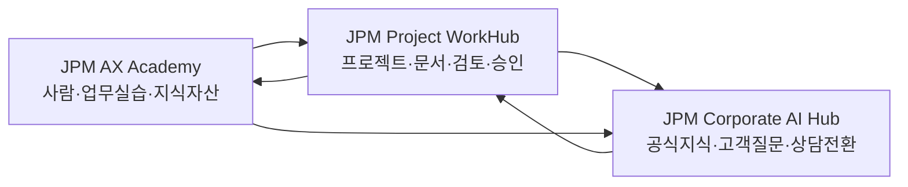
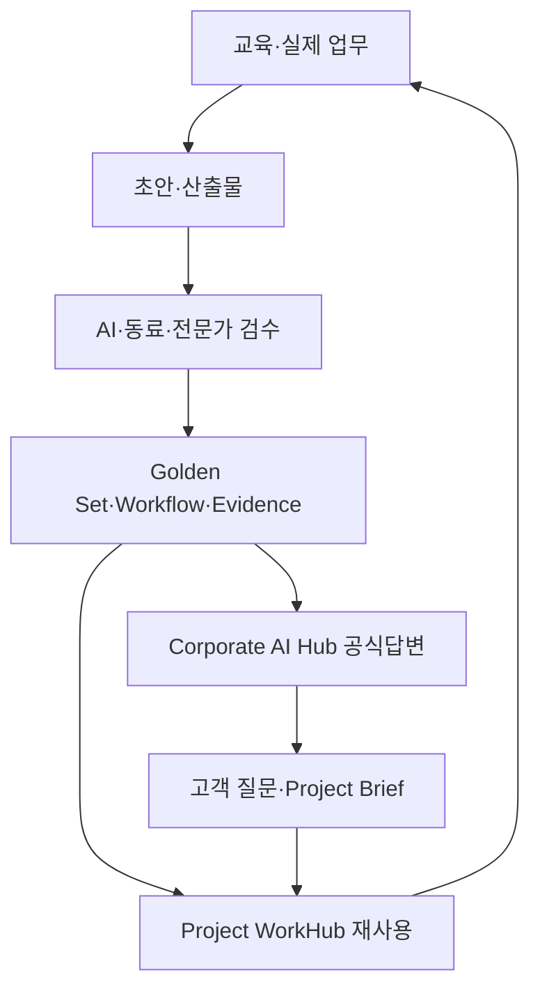

# JPM 소개·AX 전략·AI 신사업 기획서

## 0. 문서 요약

JPM은 제주 지역에서 도시계획, 토목설계, 건설사업관리, 재해영향평가, 건축 등 복합적인 개발·엔지니어링 업무를 수행해 온 전문기업이다. 공식 홈페이지와 공개 기업정보를 종합하면, JPM의 경쟁력은 단일 설계기술보다 **제주의 공간·환경·규제·인허가·프로젝트 수행 맥락을 함께 이해하는 축적된 도메인 역량**에 있다.

JPM의 AX는 범용 AI 도구를 배포하는 사업이 아니다. 목표는 다음의 순환체계를 만드는 것이다.

1. 임직원이 실제 업무에서 AI를 안전하게 활용한다.
2. 우수한 업무결과를 온톨로지·Golden Set·Evidence·Workflow 자산으로 축적한다.
3. 축적된 지식을 내부 Project WorkHub에서 반복 사용한다.
4. 검증된 지식을 Corporate AI Hub를 통해 고객에게 제공한다.
5. 고객 질문과 프로젝트 데이터를 새로운 서비스와 AI 신사업으로 발전시킨다.

이를 위한 1단계 실행모델은 **JPM AX Kick Start 200**이다.

- 기간: 16주
- 구성: AX Academy + Project WorkHub + Corporate AI Hub
- 목표: 사람·지식·업무·고객접점을 하나의 AI 운영체계로 연결
- 후속 단계: Agentic Workflow, 전문 AI 서비스, 제주형 개발·환경 인텔리전스 사업

---

# 1. JPM 기업 개요

## 1.1 기본 프로필

| 항목 | 내용 | 신뢰·확인 상태 |
|---|---|---|
| 회사명 | 주식회사 제이피엠(JPM) | 공개자료 확인 |
| 설립 | 2006년 | 공개자료 확인 |
| 기반 지역 | 제주특별자치도 제주시 | 공개자료 확인 |
| 기업 성격 | 제주 기반 종합 엔지니어링·개발 전문기업 | 공개자료 종합 |
| 공식 사업분야 | 도시계획, 토목설계, 건설사업관리, 재해영향평가, 건축 등 | 공식 홈페이지 확인 |
| 확장 사업영역 | 각종 영향평가, 전기, 부동산 개발·컨설팅, 해양·풍력 관련 분야 | 공개 채용·기업정보 기준 |
| 대표자·정확한 조직·매출 | 최신 법인자료로 최종 확인 필요 | [확인 필요] |

> 공개 채용 플랫폼 사이에 임직원 수가 다르게 표시되므로, 대외 문서에는 최신 공식 인사·회계자료를 사용해야 한다. AX 프로그램의 교육대상 50명은 프로젝트 범위이며, 기업의 공시 인원과 동일하다고 단정하지 않는다.

## 1.2 JPM의 본질적 경쟁자산

JPM이 보유한 핵심 자산은 파일 수나 자격증 수가 아니라 다음 다섯 가지의 결합이다.

### A. 지역 맥락

- 제주 지형·공간·환경의 특수성
- 보전·경관·재해·수자원 관련 검토 맥락
- 지역 행정과 사업 추진 절차에 대한 경험
- 도서지역 프로젝트의 물류·조정·이해관계 구조

### B. 복합 엔지니어링

- 도시계획과 토목설계
- 영향평가와 재해 검토
- 건설사업관리
- 건축·전기·에너지 관련 협업
- 개발 초기검토부터 실행단계까지의 다분야 연결

### C. 인허가·규제 해석 능력

- 법령·조례·지침의 사업 적용
- 대상지별 조건·예외·제약 해석
- 검토자료와 증빙의 구성
- 불확실한 사안을 전문가 판단과 행정협의로 연결

### D. 프로젝트 수행 신뢰

- 고객 요구를 과업과 문서로 전환하는 능력
- 다수 이해관계자와 전문분야의 조정
- 기술 검토·승인·수정 이력
- 납기와 품질을 동시에 관리하는 현장 경험

### E. 축적되었으나 구조화되지 않은 지식

- 제안서·보고서·회의록·검토서
- 프로젝트별 판단근거와 예외사례
- 담당자의 암묵지
- 고객 질문과 상담경험
- 반복되는 업무양식과 검수 기준

JPM AX의 출발점은 새로운 데이터를 무리하게 수집하는 것이 아니라, **이미 존재하는 전문지식과 업무기록을 신뢰 가능한 조직자산으로 바꾸는 것**이다.

---

# 2. 전략적 문제 정의

## 2.1 현재 구조의 한계

### 지식이 사람과 문서에 분산되어 있다

- 같은 질문을 담당자마다 다시 조사한다.
- 과거 프로젝트의 우수한 판단과 문장이 재사용되지 않는다.
- 퇴직·이동·업무과부하가 지식손실로 이어진다.
- 자료는 많지만 최신성·승인상태·근거를 빠르게 확인하기 어렵다.

### 문서 생산과 검토의 반복비용이 크다

- RFP와 과업지시서를 사람이 처음부터 다시 읽는다.
- 제안서·보고서의 기본구조를 매번 새로 만든다.
- 수치·날짜·법령·고유명사 검증이 후반에 몰린다.
- 수정의견과 승인 이력이 조직학습으로 환류되지 않는다.

### 대외 디지털 접점이 기업의 실제 전문성을 충분히 설명하지 못한다

- 일반적인 회사소개와 사업분야 나열에 머물기 쉽다.
- 고객은 자신의 상황을 기준으로 필요한 서비스를 찾기 어렵다.
- AI 검색엔진이 JPM의 공식 답변과 근거를 이해하기 어렵다.
- 문의가 들어와도 구조화된 Project Brief로 연결되지 않는다.

### AI 도입이 개인별 도구 사용에 머물 위험이 있다

- 프롬프트 숙련도 차이로 결과편차가 발생한다.
- 민감정보·환각·출처누락 위험이 있다.
- 검증된 결과가 재사용 가능한 회사자산으로 남지 않는다.
- Agent를 도입해도 업무·권한·평가기준이 없어 운영이 불가능하다.

## 2.2 AX 핵심 질문

> JPM의 전문인력이 축적한 제주 개발·환경·엔지니어링 지식을 어떻게 구조화하고, 내부 업무생산성과 외부 고객가치, 신규 매출로 전환할 것인가?

## 2.3 전략적 전환

| 기존 방식 | AX 목표상태 |
|---|---|
| 개인별 AI 활용 | 조직 승인형 AI 업무체계 |
| 파일 중심 저장 | 객체·관계·근거 중심 지식자산 |
| 결과물 제출로 종료 | 검수 결과를 Golden Set으로 축적 |
| 홈페이지의 일방적 소개 | 고객 질문에 답하는 Corporate AI Hub |
| 수작업 문의 분류 | Project Brief와 사업기회 자동 구조화 |
| Agent 기능부터 도입 | 업무·지식·평가 기반을 먼저 구축 |

---

# 3. JPM AX 비전과 원칙

## 3.1 비전

# 제주형 개발·환경·프로젝트 지식을 가장 신뢰할 수 있게 구조화하고 실행하는 AI-증강 엔지니어링 기업

## 3.2 North Star

> **AI가 대신 판단하는 회사가 아니라, AI와 함께 더 빠르고 일관되며 근거 있게 판단하는 회사**

## 3.3 6대 AX 원칙

### 1. Workflow First

AI 기능이 아니라 업무흐름을 먼저 정의한다.

### 2. Knowledge as Capital

교육과 프로젝트에서 나온 우수 결과를 회사의 지식자본으로 축적한다.

### 3. Evidence First

AI 답변과 문서에는 출처, 기준일, 적용조건, 검토자를 남긴다.

### 4. Human Approval

AI는 추출·요약·초안·비교·추천을 담당하고, 기술·법률·안전·대외발송은 책임자가 승인한다.

### 5. Standard Before Custom

반복 가능한 표준과 템플릿을 먼저 만들고, 예외적 요구만 추가 개발한다.

### 6. Measure Before Scale

도입률·품질·시간·재작업·전환 데이터를 확인한 뒤 확장한다.

## 3.4 SAFE-E 업무 검증 원칙

| 코드 | 원칙 | 실행 질문 |
|---|---|---|
| S | Sensitive Data | 외부 AI에 입력하면 안 되는 정보가 포함되어 있는가? |
| A | Accuracy | 수치·날짜·명칭·조건이 정확한가? |
| F | Fact & Source | 주장과 판단을 뒷받침하는 원문과 출처가 있는가? |
| E | Expert Approval | 기술·법률·안전 관련 내용이 책임자의 승인을 받았는가? |
| E | Evidence Record | 사용한 근거·버전·승인 이력이 기록되어 있는가? |

---

# 4. JPM AX Operating Model

## 4.1 3개 운영축



### JPM AX Academy

임직원이 실제 업무로 AI를 배우고, Prompt·Workflow·Golden Set·Answer Asset을 생산하는 학습·자산화 체계다.

### JPM Project WorkHub

고객·사업기회·대상지·프로젝트·문서·과업·위험·결정·승인을 연결하는 내부 AI-증강 업무환경이다.

### JPM Corporate AI Hub

JPM의 공식 지식을 검색엔진과 생성형 AI, 잠재고객에게 제공하고 고객 질문을 Project Brief와 상담으로 전환하는 대외 접점이다.

## 4.2 지식 플라이휠



## 4.3 핵심 지식객체

초기 온톨로지는 지나치게 복잡하게 시작하지 않는다.

- Customer
- Client Organization
- Contact
- Opportunity
- Site / Parcel
- Project
- Service
- Requirement
- Regulation
- Review Item
- Risk
- Document
- Evidence
- Task
- Decision
- Approval
- Outcome
- Lesson
- Metric

각 객체에는 최소한 다음 메타데이터를 둔다.

- 고유 ID
- 명칭과 정의
- 담당자
- 출처
- 기준일·버전
- 승인상태
- 관련 객체
- 기밀등급
- 재사용 가능범위

---

# 5. 16주 JPM AX Kick Start 실행안

## 5.1 목표

- 임직원 50명의 공통 AI 업무언어 형성
- 핵심 실무자 15~20명의 실제 워크플로 전환
- AI Champion 5명 내외 육성
- JPM 도메인 온톨로지 v0.5
- Golden Set 30~50건 우선 구축
- Answer Asset 30~50건 우선 구축
- 핵심 업무 워크플로 3개 이상 실증
- Corporate AI Hub 공개 베타
- Project WorkHub 핵심 사용자 10~15명 적용

## 5.2 실행 단계

| 단계 | 기간 | 핵심 활동 | 주요 산출물 |
|---|---:|---|---|
| 착수·진단 | 1~2주 | 인터뷰, 문서 인벤토리, 보안·권한, 우선과제 선정 | Project Charter, Workflow Map |
| Academy·자산화 | 3~6주 | TASKFLOW, 문서 OS, AEO, 온톨로지 과정 | Prompt, Golden Set 후보, Answer Asset |
| 시스템 구성 | 5~10주 | WorkHub·AI Hub 정보구조와 운영설정 | 두 시스템 베타 |
| 연결·실증 | 11~13주 | 실제 프로젝트·고객여정 적용, UAT | 사용로그, 오류·개선 Backlog |
| 안정화·인수 | 14~16주 | 수정, 운영자 교육, 성과검토 | 운영가이드, 6개월 로드맵 |

## 5.3 우선 업무 워크플로

### Workflow 1. 고객 문의·사업기회 등록

```text
고객 질문·문의
→ 목적·대상지·조건·기한 추출
→ Project Brief 생성
→ 담당자 확인
→ Opportunity 등록
→ 다음 행동 지정
```

### Workflow 2. RFP·과업지시서 분석

```text
문서 등록
→ 요구사항·제출물·기한 추출
→ 자격·실적·인력 확인
→ 미확인 사항·위험 표시
→ Go/No-Go 검토안
→ 책임자 승인
```

### Workflow 3. 제안서 작성·검토

```text
요구사항
→ 유사 프로젝트·근거 검색
→ 제안 논리·목차
→ 초안
→ 기술검토
→ 수정·승인
→ Golden Set 후보 등록
```

### 선택 Workflow 4. 회의·후속 행동

```text
회의기록
→ 결정사항
→ 과업·담당자·기한
→ 위험·변경
→ 진행상태 추적
```

### 선택 Workflow 5. 기술문서 QA

```text
문서 초안
→ 용어·수치·법령·근거 검사
→ Golden Set 비교
→ 누락·불일치 표시
→ 전문가 수정·승인
```

---

# 6. JPM AX Academy

## 6.1 교육체계

| 과정 | 구성 | 핵심 결과 |
|---|---:|---|
| TASKFLOW 기초 | 8강 | 재현 가능한 AI 작업명세 |
| 문서 작성 OS | 8강 | 조사·작성·검증·승인형 문서 워크플로 |
| AEO 콘텐츠 OS | 8강 | 고객질문·공식답변·근거·전환 자산 |
| Agent Readiness & Ontology | 8강 | 객체·관계·권한·평가기준·Agent Backlog |
| JPM AX Project Lab | 실제 과업 | RFP, 제안서, 회의, Answer Asset 실증 |

## 6.2 역할별 이수

- 전 임직원: 28~36시간 공통과정
- 핵심 실무자: 60~72시간 심화·Project Lab
- AI Champion: 90시간 이상 전 과정·검수·운영
- 경영진: 8~12시간 전략·리스크·성과 Gate

## 6.3 초기 기능

- 역할별 Learning Path
- TASKFLOW Builder
- Document Studio
- AEO Studio
- Ontology Studio
- AI Coach: Explain, Diagnose, Build, Challenge, Verify, Reflect
- 과제·피드백·재제출
- Peer Review·Expert Approval
- SAFE-E 검수
- Asset Registry
- Golden Set 평가
- 관리자 KPI Dashboard

## 6.4 자산상태

```text
Draft
→ Submitted
→ AI Checked
→ Peer Reviewed
→ Expert Approved
→ Published
→ Retired
```

---

# 7. JPM Project WorkHub

## 7.1 목적

Project WorkHub는 전사 ERP를 대체하지 않는다. 초기에는 **수주·제안·프로젝트 문서·검토·승인**처럼 지식집약도가 높고 개선효과를 측정하기 쉬운 영역에 집중한다.

## 7.2 핵심 기능

- 고객·발주처·사업기회 관리
- 대상지·프로젝트 카드
- RFP·제안서·검토서·회의자료 관리
- 승인자료 기반 의미검색과 RAG
- 요약·추출·비교·초안 작성
- 업무단계·담당자·기한·다음 행동
- 검토·승인·수정 이력
- 위험·미확인 사항 관리
- 활동로그와 기본 성과대시보드
- 승인된 Prompt·Workflow 자산 재사용

## 7.3 1단계 제외범위

- 인사·회계·구매 ERP
- 전자결재 전체 대체
- 모든 프로젝트 원가관리
- 자동 인허가 판정
- 무승인 대외발송
- 완전자율 Agent
- 대규모 과거자료 전면 이관

---

# 8. JPM Corporate AI Hub

## 8.1 목적

Corporate AI Hub는 일반 회사소개 홈페이지가 아니라 다음 세 기능을 수행한다.

1. JPM 공식 지식의 대외 정본
2. 검색엔진·생성형 AI가 이해할 수 있는 Answer Infrastructure
3. 고객 질문을 상담·Project Brief·사업기회로 전환하는 디지털 접점

## 8.2 핵심 정보구조

- 회사와 전문성
- 핵심 서비스 5~8개
- 대표 프로젝트 5~10개
- 전문가·조직
- 고객 질문과 Answer Asset
- 검토방식·근거·책임경계
- 상담·Project Brief

## 8.3 고객여정

```text
자연어 질문
→ 상황·목적·조건 확인
→ JPM 공식 답변과 근거
→ 추가 질문
→ Project Brief
→ 관련 서비스·전문가
→ 상담 신청
→ Project WorkHub Opportunity
```

## 8.4 품질원칙

- 답변마다 근거와 기준일 표시
- 불확실한 정보는 [확인 필요]
- 인허가·법률·안전은 참고정보로 제한
- 최종 판단은 담당 전문가와 행정기관 확인
- 고객정보는 최소수집
- 모든 상담전환은 담당자 검토

---

# 9. Agentic AX 확장전략

## 9.1 Kick Start의 의미

1단계에서 Agent를 전면 구현하지 않는 것은 기술역량의 한계가 아니다. Agent가 안전하게 행동하기 위한 기반을 우선 만드는 전략이다.

| Kick Start 산출물 | Agent 단계에서의 역할 |
|---|---|
| Ontology | Agent가 이해할 업무객체와 관계 |
| Golden Set | 성능과 품질의 기준답안 |
| Workflow Asset | Agent가 수행할 절차 |
| Evidence Registry | 판단의 근거와 최신성 |
| 권한·승인정책 | Agent의 행동한계 |
| WorkHub | Agent 실행·기록·감사 환경 |
| AI Hub | 고객 상호작용 채널 |
| AI Champion | 운영·검수·개선 책임자 |

## 9.2 3단계 확장

### Phase 1. Assisted Work

- 검색·요약·추출·초안
- 사람이 실행하고 승인

### Phase 2. Agentic Workflow

- 도구호출
- 상태기반 업무진행
- 조건부 다음 행동
- Human Approval Gate

### Phase 3. Agentic Operating Model

- 다중 Agent 역할분담
- 프로젝트·고객·지식 시스템 연결
- 성능·비용·리스크 모니터링
- 업무별 Agent Portfolio

## 9.3 우선 Agent 후보

1. RFP Analyst Agent
2. Proposal Assembly Agent
3. Meeting Action Agent
4. Technical QA Agent
5. Evidence Update Agent
6. Customer Intake Agent

---

# 10. AI 신사업 포트폴리오

## 10.1 선정기준

AI 신사업은 기술적 화려함보다 다음 기준으로 평가한다.

- JPM 도메인 우위가 있는가
- 고객의 반복적 고통이 큰가
- 신뢰 가능한 데이터를 확보할 수 있는가
- 전문가 검토를 포함해 책임 있게 제공할 수 있는가
- 3~6개월 안에 유료 의사를 검증할 수 있는가
- 기존 엔지니어링 수주와 시너지가 있는가
- 향후 SaaS·데이터·거래 플랫폼으로 확장 가능한가

## 10.2 우선순위 요약

| 우선순위 | 신사업 | 초기 형태 | 난이도 | 수익화 속도 |
|---:|---|---|---:|---:|
| 1 | Project Possibility Check | 전문가 보조형 유료 진단 | 낮음~중간 | 빠름 |
| 2 | 제주 개발·인허가 Copilot | B2B SaaS + 전문가 검토 | 중간 | 중간 |
| 3 | Engineering Proposal OS | B2B SaaS·구축형 | 중간 | 중간 |
| 4 | 환경·재해 Risk Intelligence | 데이터·리포트 서비스 | 중간~높음 | 중간 |
| 5 | Renewable Site Screening | 프로젝트 선별 서비스 | 중간~높음 | 중간 |
| 6 | Smart Building Value-up | 진단·구축·성과형 | 높음 | 느림 |
| 7 | Jeju Development Network | 전문가·프로젝트 매칭 | 높음 | 느림 |
| 8 | Mobility Demand Intelligence | 데이터 최적화 사업 | 높음 | [보유데이터 확인 필요] |

---

# 11. 신사업 1: Project Possibility Check

## 11.1 개념

고객이 주소·대상지·사업아이디어와 기본조건을 입력하면, JPM이 보유한 검토체계와 공개자료를 바탕으로 **사업 가능성을 조기에 구조화해 주는 전문가 보조형 사전진단 서비스**다.

## 11.2 고객

- 제주 개발을 검토하는 토지·건물 소유자
- 외지 시행사·투자자
- 관광·숙박·상업시설 사업자
- 금융·중개·설계 파트너

## 11.3 제공 결과

- 대상지·사업목적 요약
- 확인해야 할 규제·환경·재해 항목
- 필요자료 체크리스트
- 주요 위험과 미확인 사항
- 다음 전문가 검토단계
- 예상 업무범위와 상담 연결

## 11.4 중요 경계

- 개발 가능 여부를 자동 확정하지 않는다.
- 행정기관의 유권해석과 법적 판단을 대체하지 않는다.
- 공개자료·고객자료의 기준일을 명시한다.
- 최종 보고서는 JPM 전문가가 검토한다.

## 11.5 전략적 가치

- 가장 빠른 유료 검증 가능
- Corporate AI Hub의 Project Brief를 활용 가능
- 기존 엔지니어링 수주로 연결
- 축적된 질문이 후속 Copilot의 학습·평가 자산이 됨

---

# 12. 신사업 2: 제주 개발·인허가 Copilot

## 12.1 개념

제주 개발사업의 법령·조례·지침·검토항목·사례를 검색하고, 대상사업에 필요한 확인사항과 자료를 구조화하는 **전문가용 규제·인허가 지원 시스템**이다.

## 12.2 핵심 기능

- 대상지·사업유형 입력
- 관련 규정·지침 검색
- 요구자료·협의사항 체크리스트
- 규정 근거와 기준일 표시
- 변경된 규정 알림
- 전문가 검토메모
- 프로젝트별 Evidence Pack

## 12.3 고객

- 시행사·건축사·엔지니어링사
- 중개·자문·금융기관
- 지역 진출 기업
- 공공·유관기관의 실무자

## 12.4 BM

- 조직 구독
- 프로젝트 단위 사용료
- 전문가 검토 패키지
- 규정·데이터 업데이트 서비스

## 12.5 위험

- 법률·행정판단으로 오인될 가능성
- 규정 최신성 관리비용
- 공간정보와 공공데이터 라이선스
- 오류 발생 시 책임경계

따라서 `Copilot + Expert Review` 형태로 시작하고, 자동 판정 표현을 금지한다.

---

# 13. 신사업 3: Engineering Proposal OS

## 13.1 개념

RFP 분석, 요구사항 매트릭스, 유사실적 검색, 제안구조 설계, 초안, 검수, 승인까지 지원하는 **엔지니어링·전문서비스 기업용 제안업무 OS**다.

## 13.2 차별성

- 일반 문서생성기가 아니라 수주업무 객체와 단계가 존재
- 제안서·실적·인력·자격·제출요건을 함께 관리
- Golden Set과 평가루브릭 기반 QA
- Prompt가 아니라 승인된 Workflow를 판매

## 13.3 초기 시장

- 제주·지역 엔지니어링사
- 환경·건설·도시계획 전문기업
- 공공입찰 비중이 높은 기술서비스 기업

## 13.4 BM

- 조직 SaaS 구독
- 초기 온보딩·지식정비
- 제안 Template Pack
- 고급 검수·코칭

---

# 14. 신사업 4: 환경·재해 Risk Intelligence

## 14.1 개념

환경영향, 재해, 지형, 수자원, 경관 등 개발 초기의 핵심 위험요인을 데이터와 전문가 지식으로 구조화해 제공하는 위험인텔리전스 서비스다.

## 14.2 단계적 접근

### 1단계

- 공개 데이터와 JPM 체크리스트 기반 리포트
- 위험요인과 추가조사 항목 표시

### 2단계

- GIS·공간데이터 시각화
- 프로젝트 사례와 위험유형 연결

### 3단계

- 위성·드론·LiDAR·시계열 데이터 분석
- 기후·재해 시나리오와 비용영향 추정

## 14.3 BM

- 프로젝트 사전검토 보고서
- 조직 구독형 Risk Dashboard
- 금융·보험·시행사 API·데이터 서비스

---

# 15. 신사업 5: Renewable Site Screening

## 15.1 개념

육·해상 풍력, 태양광, 에너지 인프라 후보지를 대상으로 환경·입지·민원·인허가·접속·사업성 관련 초기 위험을 구조화하는 서비스다.

## 15.2 제공가치

- 초기 후보지의 빠른 비교
- 실패 가능성이 큰 대상의 조기 제외
- 필요한 조사·협의·전문가 업무 정의
- 개발·환경·기술팀의 공통 Project Brief 생성

## 15.3 확장

- 후보지 Portfolio Dashboard
- 시나리오별 Risk Score
- 파트너·투자자용 Data Room
- 프로젝트 금융 검토자료 연계

---

# 16. 신사업 6: Smart Building Value-up / AI-BEMS

## 16.1 개념

기축건물의 에너지·설비·운영 데이터를 분석하고, 개선과제와 자동제어를 통해 운영비를 절감하며 자산가치를 높이는 사업이다.

## 16.2 제공모델

- 에너지·설비 진단
- Retrofit 우선순위
- AI 기반 운영 최적화
- 개선 전후 Measurement & Verification
- ESG·탄소·ZEB 대응자료

## 16.3 BM

- 진단·설계비
- 구축·운영비
- 절감성과 연동형 수수료
- 장기 모니터링 구독

## 16.4 판단

잠재가치는 크지만 센서·BMS·제어·시공 파트너가 필요하므로, 초기 Kick Start의 직접 후속보다는 중장기 파트너십 사업으로 관리한다.

---

# 17. 신사업 7: Jeju Development Network

## 17.1 개념

개발을 검토하는 고객과 엔지니어·건축·환경·금융·법률·운영 전문가를 Project Brief 중심으로 연결하는 프로젝트 네트워크다.

## 17.2 선행조건

- 충분한 고객질문과 Project Brief 데이터
- 전문가 자격·평판·업무범위 검증
- 책임·수수료·계약 구조
- 중개업·전문자격 관련 법률검토
- 프로젝트 진행상태와 품질관리

## 17.3 진입순서

1. JPM 내부 담당자 연결
2. 검증 파트너 추천
3. 공동 제안·컨소시엄
4. 제한형 전문가 네트워크
5. 공개 Marketplace 여부 검토

---

# 18. 신사업 포트폴리오 실행순서

## Wave 1: 0~6개월

- Project Possibility Check 유료 실험
- Corporate AI Hub 고객질문 수집
- Proposal OS 내부 검증
- 제주 규제·인허가 Evidence Registry 시작

## Wave 2: 6~12개월

- 인허가 Copilot 전문가 베타
- Proposal OS 파트너사 베타
- 환경·재해 Risk Report 상품화
- 고객군별 가격·구매의사 검증

## Wave 3: 12~24개월

- 조직 구독형 SaaS
- Renewable Site Screening
- Risk Dashboard·데이터 서비스
- 제한형 전문가 네트워크

## Wave 4: 24개월 이후

- Smart Building Value-up
- 멀티 Agent 프로젝트 운영
- 제주 외 지역·도서지역 확장
- 금융·보험·공공기관 데이터 연계

---

# 19. 신사업 검증 Gate

각 신사업은 아래 Gate를 통과할 때만 다음 단계로 투자한다.

## Gate A. Problem Evidence

- 동일 문제가 반복되는가
- 고객이 현재 시간·비용·위험을 지불하고 있는가
- 의사결정권자가 문제를 중요하게 보는가

## Gate B. Data & Trust

- 필요한 데이터의 합법적 확보가 가능한가
- 최신성·정확성·지역 범위를 관리할 수 있는가
- 전문가 검토와 책임경계를 설계할 수 있는가

## Gate C. Paid Intent

- 인터뷰가 아니라 실제 유료의사가 있는가
- 최소 3개 이상의 유료 파일럿 또는 명확한 구매확약이 있는가

## Gate D. Repeatability

- 고객마다 완전히 새로 만들지 않고 표준 Workflow로 반복 가능한가
- 납품시간과 전문가 투입을 줄일 수 있는가

## Gate E. Scale Decision

- SaaS, 데이터, 프로젝트형, 성과형 중 어떤 BM이 적합한가
- JPM 기존 사업과 충돌하지 않고 수주를 확장하는가

---

# 20. 데이터·보안·거버넌스

## 20.1 데이터 등급

| 등급 | 예시 | 처리원칙 |
|---|---|---|
| Public | 공개 법령·회사소개·공개 프로젝트 | 승인 후 외부 Hub 사용 가능 |
| Internal | 내부 템플릿·일반 업무기록 | 사내 시스템에서만 사용 |
| Confidential | 고객자료·제안가격·계약·민감설계 | 제한권한·외부 AI 입력 금지 또는 마스킹 |
| Restricted | 개인정보·핵심 영업비밀·보안정보 | 별도 승인·암호화·최소 접근 |

## 20.2 필수 통제

- 역할기반 접근권한
- AI 입력금지정보 정의
- 출처·기준일·버전관리
- 생성·수정·승인 로그
- 외부 모델 전송정책
- 백업·복구
- 개인정보 최소수집
- 데이터 반출·종료 절차
- 오류·사고 대응체계

## 20.3 IP 원칙

- JPM 원천데이터와 JPM 전용 콘텐츠·온톨로지·Golden Set은 JPM 관리자산으로 정의한다.
- 기존 범용 플랫폼·방법론·코드의 권리는 별도 계약에 따른다.
- 신규 맞춤개발, 공동개발 파생물, 외부 사업화 권리는 계약서에서 구분한다.
- 계약 종료 시 JPM 데이터와 승인 지식자산은 표준형식으로 반출 가능해야 한다.

---

# 21. 추진조직

| 역할 | 책임 |
|---|---|
| Executive Sponsor | 주요 의사결정·부서협조·투자 Gate |
| AX Product Owner | 우선순위·범위·인수 책임 |
| Knowledge Steward | 용어·근거·Golden Set·Answer Asset 관리 |
| WorkHub Owner | 내부 사용자와 Workflow 운영 |
| Corporate AI Hub Owner | 대외 콘텐츠·상담·Project Brief 운영 |
| AI Champion | 부서별 학습·코칭·1차 검수 |
| Expert Reviewer | 기술·법률·안전 최종승인 |
| Data/Security Owner | 권한·보안·로그·데이터정책 |

최소 착수조건은 다음과 같다.

- Executive Sponsor 1명
- AX Product Owner 1명
- Knowledge Steward 1명
- 핵심 사용자 10~15명
- AI Champion 약 5명
- 주간 검수시간 확보

---

# 22. KPI 체계

## 22.1 사람

- 공통과정 참여율
- 핵심실무자 과제완료율
- 사전·사후 역량 변화
- AI Champion 활동률

## 22.2 사용

- 주간 활성사용자
- 반복사용 Workflow 수
- AI Coach 사용률
- Project WorkHub 실제 프로젝트 적용 수

## 22.3 품질

- 전문가 승인율
- 재작업 횟수
- 근거 포함률
- SAFE-E 준수율
- Golden Set 대비 품질점수

## 22.4 생산성

- RFP 분석시간
- 제안서 초안시간
- 회의 후속정리시간
- 검토·승인 리드타임

## 22.5 고객·사업

- Corporate AI Hub 질문 수
- Project Brief 생성 수
- 상담 전환율
- 유료진단 전환
- 신규 프로젝트 파이프라인 기여

## 22.6 자산

- 승인 Prompt·Workflow 수
- Golden Set 수
- Answer Asset 수
- Evidence Record 수
- 자산 재사용률

---

# 23. 핵심 리스크와 대응

| 리스크 | 영향 | 대응 |
|---|---|---|
| 범위 과밀 | 16주 내 품질저하 | Workflow 3개, 핵심자산 30~50건 우선 |
| 전문가 검수 병목 | 자산 승인 지연 | 주간 검수슬롯과 승인 SLA 사전확정 |
| 기존 업무도구와 중복 | 사용자 저항 | 대체가 아니라 고가치 Workflow 보완부터 시작 |
| AI 오류·환각 | 기술·법률 리스크 | Evidence·Golden Set·Human Approval |
| 데이터 최신성 | 잘못된 안내 | 기준일·버전·업데이트 책임자 지정 |
| 개인역량 의존 | 확장성 저하 | SOP·루브릭·Faculty Guide·운영자 육성 |
| 공급자 종속 | 장기 운영위험 | 데이터 반출·API 명세·관리자 교육 |
| 신사업 과대투자 | 현금·조직 부담 | 유료 파일럿 Gate 후 투자 |

---

# 24. 의사결정 요약

## 지금 해야 할 일

1. AX Sponsor·Product Owner·Knowledge Steward 지정
2. 핵심 Workflow 3개 확정
3. 공식자료·우수문서·프로젝트 사례 인벤토리 구성
4. 16주 Academy·WorkHub·AI Hub 통합 실행
5. Project Possibility Check를 첫 유료 신사업 가설로 검증

## 지금 하지 않을 일

- 전사 ERP 재구축
- 자체 대형언어모델 개발
- 모든 문서의 전면 이관
- 자동 인허가 확정판정
- 대규모 Marketplace 선투자
- 완전자율 Agent 운영

## 12개월 후 목표상태

> JPM 임직원이 AI를 안전하게 사용하고, 회사의 전문지식이 근거·승인·버전과 함께 축적되며, 내부 프로젝트와 외부 고객질문이 동일한 지식기반에서 연결되고, 최소 한 개 이상의 AI 신사업이 유료 검증된 상태.

---

# 25. 한 문장 전략

> **JPM AX는 AI 도구를 도입하는 사업이 아니라, 제주의 개발·환경·엔지니어링 지식을 조직자산으로 전환하고 이를 내부 생산성, 고객 신뢰, 신규 매출로 연결하는 사업이다.**

---

# 26. 참고자료와 검증 주석

## 공개자료

1. 주식회사 제이피엠 공식 홈페이지: https://www.jpmeng.co.kr/
   - 공식 사업분야: 도시계획, 토목설계, 건설사업관리, 재해영향평가, 건축 등
2. 사람인 기업정보: https://www.saramin.co.kr/zf_user/company-info/view/csn/NGVxd2VHUVQ4NTh6eEZiVEtZUFZBQT09/company_nm/%28%EC%A3%BC%29%EC%A0%9C%EC%9D%B4%ED%94%BC%EC%97%A0
3. 잡코리아 기업정보: https://m.jobkorea.co.kr/company/45401086

## 내부 검토자료

1. `JPM AI 성숙도 비교 분석`
   - https://docs.google.com/document/d/1OtLKfgV1i-HQVB4J-bKHp3_ePUvNl1AXKJHXUCHZSU4
2. `부동산 AI 도입 벤치마킹 분석`
   - https://docs.google.com/document/d/17wDl1br2lQeLFtzc0adftWkjZSO_4PUdlRpdHpw5AHc
3. `제이피엠 AI 신사업 분석`
   - https://docs.google.com/document/d/1XsYa-Yiozea7kwiFpnMz2TozXeEpZZVlHKeOZHka69o
4. `JPM 신사업 전략 로드맵`
   - https://docs.google.com/document/d/1m1KFx77MsttllJEV_lCgYc_36pOwJhO1lHPTa1YQjSA

## 검증 필요사항

- 최신 법인명·관계사 구조
- 대표자와 조직도
- 최신 임직원 수·매출·주요 실적
- 보유 데이터의 종류·권리·품질
- 퍼스널 모빌리티 등 관계사업의 현재 운영 여부
- AI 신사업별 관련 법률·자격·중개 규제
- 클라우드·모델·공공데이터 사용조건

---

# Appendix A. 초기 백로그

## P0: 반드시 수행

- JPM Ontology v0.5
- Customer / Site / Opportunity / Project / Document / Evidence 구조
- RFP·제안서·문의 Workflow
- SAFE-E
- Golden Set 30~50건
- Answer Asset 30~50건
- Corporate AI Hub 5~8개 서비스
- Project WorkHub 실프로젝트 3건

## P1: 성과 확인 후

- 회의·후속 행동 Workflow
- 기술문서 QA
- 규정 업데이트 알림
- Project Possibility Check 유료 파일럿
- RFP Analyst Agent
- Customer Intake Agent

## P2: 후속 투자

- 제주 인허가 Copilot
- 환경·재해 Risk Dashboard
- Proposal OS 외부 SaaS
- Renewable Site Screening
- 전문가 네트워크

## P3: 중장기

- AI-BEMS·Smart Building Value-up
- 멀티 Agent Project Operations
- 제주 외 지역 확장
- 금융·보험·공공 데이터 연계

