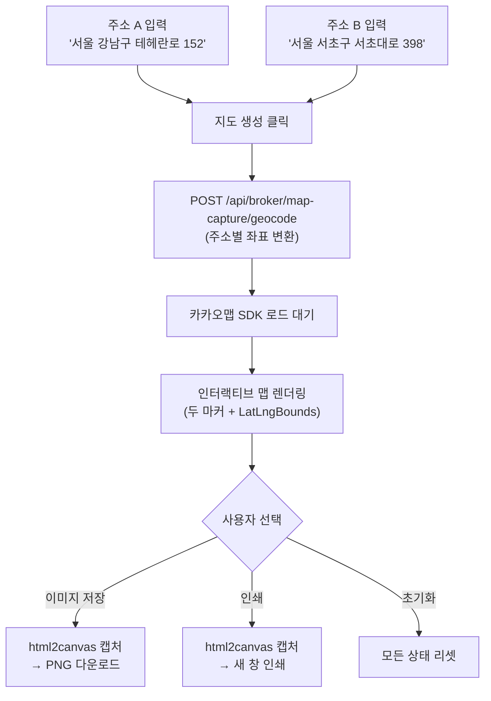
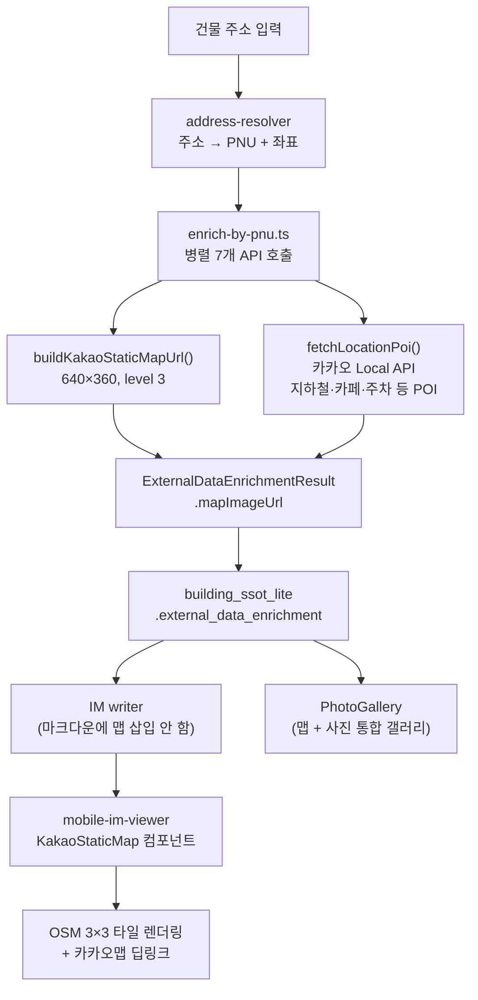
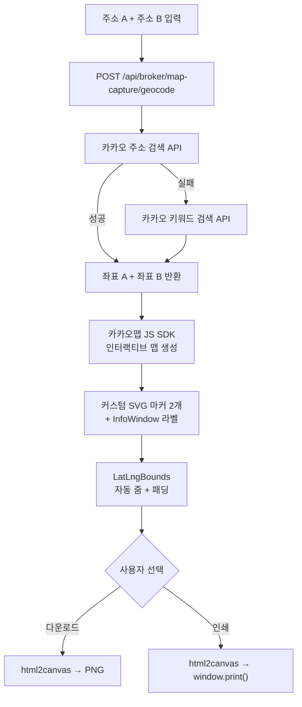

# 맵 이미지 관련 기능 명세 — 카카오맵 연동 · 이미지 갤러리 · 두 지점 지도 캡처

> **문서 버전**: 1.0  
> **작성일**: 2026-07-25  
> **감사 범위**: 카카오맵 Static Map, 카카오 Local API POI, OSM 타일 그리드 맵, 이미지 갤러리(라이트박스), 두 지점 지정 지도 캡처 도구  
> **관련 모듈**: 6개 파일 (lib 2 + viewer 1 + map-capture 2 + enrichment 1)

---

## 목차

1. [시스템 개요](#1-시스템-개요)
2. [카카오 Static Map URL 생성기](#2-카카오-static-map-url-생성기)
3. [카카오 Local API — POI 조회](#3-카카오-local-api--poi-조회)
4. [IM 뷰어 인라인 맵 컴포넌트](#4-im-뷰어-인라인-맵-컴포넌트-kakaostaticmap)
5. [이미지 갤러리 + 라이트박스](#5-이미지-갤러리--라이트박스-photogallery)
6. [두 지점 지정 지도 캡처 도구](#6-두-지점-지정-지도-캡처-도구-map-capture)
7. [Geocode API — 주소→좌표 변환](#7-geocode-api--주소좌표-변환)
8. [데이터 흐름 총괄](#8-데이터-흐름-총괄)
9. [파일 참조 맵](#9-파일-참조-맵)

---

## 1. 시스템 개요

본 프로젝트에서 카카오맵/지도 이미지와 관련된 기능은 **세 개의 독립 계층**으로 구성됩니다:

```
┌──────────────────────────────────────────────────────────────────────┐
│ Layer 1: 서버 사이드 Static Map URL 생성                              │
│  └─ buildKakaoStaticMapUrl() — 건물 데이터 보강 시 자동 생성           │
│     → mapImageUrl 필드로 DB 저장 (building_ssot_lite.external_data)  │
├──────────────────────────────────────────────────────────────────────┤
│ Layer 2: IM 뷰어 클라이언트 사이드 맵 + 갤러리                        │
│  ├─ KakaoStaticMap — OSM 3×3 타일 그리드 + 카카오맵 딥링크            │
│  └─ PhotoGallery — 맵 + 사진 통합 갤러리 (수평 스크롤 + 라이트박스)     │
├──────────────────────────────────────────────────────────────────────┤
│ Layer 3: 브로커 전용 두 지점 지도 캡처 도구                            │
│  ├─ map-capture/page.tsx — 카카오맵 JavaScript SDK 인터랙티브 맵      │
│  └─ geocode API — 카카오 Local API (주소/키워드 검색)                  │
└──────────────────────────────────────────────────────────────────────┘
```

### 1.1 사용된 외부 API

| API | 용도 | 인증 방식 | 환경 변수 |
|-----|------|-----------|-----------|
| 카카오 Static Map API | 서버 사이드 정적 맵 이미지 URL 생성 | REST API Key | `KAKAO_REST_API_KEY` |
| 카카오 Local API (주소 검색) | Geocoding: 주소→좌표 변환 | REST API Key | `KAKAO_REST_API_KEY` |
| 카카오 Local API (카테고리 검색) | POI 조회 (지하철, 카페 등) | REST API Key | `KAKAO_REST_API_KEY` |
| 카카오 Maps JavaScript SDK | 클라이언트 인터랙티브 맵 | App Key | `NEXT_PUBLIC_KAKAO_APP_KEY` |
| OpenStreetMap 타일 서버 | IM 뷰어 정적 맵 타일 (무인증) | 불필요 | — |

---

## 2. 카카오 Static Map URL 생성기

### 2.1 파일

[`kakao-static-map.ts`](file:///c:/Users/User/cre-dealcard/src/lib/external/kakao-static-map.ts) (41줄)

### 2.2 인터페이스

```typescript
interface StaticMapOptions {
  lat: number;       // 위도
  lng: number;       // 경도
  level?: number;    // 줌 레벨 1–14 (기본값 3)
  width?: number;    // 이미지 너비 px (기본값 640)
  height?: number;   // 이미지 높이 px (기본값 400)
  marker?: boolean;  // 중앙 마커 표시 여부 (기본값 true)
}
```

### 2.3 URL 생성 로직

```
Base URL: https://spi.maps.daum.net/mapscms/map/staticmap.png

파라미터:
  apikey  = KAKAO_REST_API_KEY
  center  = {lng},{lat}          ← 카카오 좌표계: 경도,위도 순서
  level   = 3
  w       = 640
  h       = 400
  markers = type:d|size:medium|{lng},{lat}   ← marker=true 시
```

### 2.4 Fail-safe

| 상황 | 처리 |
|------|------|
| `KAKAO_REST_API_KEY` 미설정 | `placehold.co` 플레이스홀더 이미지 URL 반환 |
| 좌표 없음 (`lat`/`lng` null) | 호출 자체 스킵 → `mapImageUrl = null` |

### 2.5 사용처

| 호출 위치 | 파일 | 용도 |
|-----------|------|------|
| 건물 데이터 보강 (신규) | [`enrich-by-pnu.ts`](file:///c:/Users/User/cre-dealcard/src/lib/external/enrich-by-pnu.ts#L109-L117) | PNU 기반 보강 시 `mapImageUrl` 자동 생성 |
| 건물 데이터 보강 (캐시 복원) | [`enrich-by-pnu.ts`](file:///c:/Users/User/cre-dealcard/src/lib/external/enrich-by-pnu.ts#L266-L274) | DB 캐시에서 복원 시 `mapImageUrl` 재생성 |

> **설계 결정**: Static Map URL은 `ExternalDataEnrichmentResult.mapImageUrl`에 저장되어 IM 데이터에 포함되지만, **뷰어에서는 직접 사용하지 않습니다**. 대신 뷰어는 자체 `KakaoStaticMap` OSM 컴포넌트를 렌더링하여 API 키 노출을 방지합니다.

---

## 3. 카카오 Local API — POI 조회

### 3.1 파일

[`kakao-map-api.ts`](file:///c:/Users/User/cre-dealcard/src/lib/external/kakao-map-api.ts) (88줄)

### 3.2 기능

**건물 주변 인프라 자동 조회** — 좌표를 기반으로 주변 시설 카운트를 수집하여 IM의 "입지 분석" 섹션에 활용.

### 3.3 조회 대상

| 카테고리 | 카카오 코드 | 반경 | 용도 |
|----------|------------|------|------|
| 지하철역 | `SW8` | 1,000m | 최근접 역 거리·도보 시간 계산 |
| 버스 정류장 | `BZ2` | 500m | 대중교통 접근성 |
| 카페 | `CE7` | 500m | 상권 활성도 |
| 주차장 | `PK6` | 500m | 주차 인프라 |
| 음식점 | `FD6` | 500m | 상권 밀도 |
| 편의점 | `CS2` | 500m | 생활 인프라 |

### 3.4 출력 타입

```typescript
interface LocationPoiData {
  nearestStation: {
    name: string;        // 역 이름
    distanceM: number;   // 직선 거리 (m)
    walkMinutes: number; // 도보 시간 (거리 ÷ 80m/분)
  } | null;
  poiCounts: {
    subway: number;
    busStop: number;
    cafe: number;
    parking: number;
    restaurant: number;
    convenience: number;
  };
}
```

### 3.5 안티 환각 설계

```
[A4] API 실패 시 하드코딩 지역별 폴백 완전 제거
  기존: 성수/삼성/강남 좌표별로 가짜 POI 데이터 반환 (hallucination 유발)
  변경: null 반환 일관화 → IM narrative-prompt의
       "POI 없으면 교통 정보 창작 금지" 지시와 일치

  → API 호출 실패 시 null 반환
  → IM writer에서 POI 없으면 해당 섹션 자동 축소
```

---

## 4. IM 뷰어 인라인 맵 컴포넌트 (`KakaoStaticMap`)

### 4.1 파일

[`mobile-im-viewer.tsx`](file:///c:/Users/User/cre-dealcard/src/app/(public)/im-lite/[buildingId]/mobile-im-viewer.tsx#L174-L241) (L174~L241)

### 4.2 구현 방식: OSM 3×3 타일 그리드

카카오 Static Map API 대신 **OpenStreetMap 타일**을 직접 렌더링하여 API 키 노출 없이 맵을 표시합니다.

```
┌────────────────────────────────────┐
│  tile(-1,-1)  tile(0,-1)  tile(1,-1)  │
│  tile(-1, 0)  tile(0, 0)  tile(1, 0)  │  ← 중앙 타일이 좌표 위치
│  tile(-1, 1)  tile(0, 1)  tile(1, 1)  │
└────────────────────────────────────┘
         768px × 768px 그리드
     (각 타일 256px, 줌 레벨 15)
```

### 4.3 좌표→타일 변환 알고리즘

```typescript
// 경도 → X 타일 인덱스
const tileX = Math.floor(((lng + 180) / 360) * Math.pow(2, zoom));

// 위도 → Y 타일 인덱스 (Mercator 투영)
const tileY = Math.floor(
  ((1 - Math.log(
    Math.tan((lat * Math.PI) / 180) +
    1 / Math.cos((lat * Math.PI) / 180)
  ) / Math.PI) / 2) * Math.pow(2, zoom)
);

// 타일 URL: https://tile.openstreetmap.org/{zoom}/{x}/{y}.png
```

### 4.4 UI 구성 요소

| 요소 | 위치 | 설명 |
|------|------|------|
| **3×3 타일 그리드** | 전체 영역 | OSM 타일 9장을 grid-cols-3로 배치 |
| **중앙 마커 핀** | 정중앙 | SVG 핀 아이콘 (인디고색 `#6366f1`) |
| **카카오맵 딥링크** | 하단 오버레이 | "카카오맵에서 보기 →" 버튼 (카카오 옐로우 `#FEE500`) |
| **OSM 저작자 표시** | 우상단 | `© OSM` 배지 |

### 4.5 카카오맵 딥링크 URL

```
https://map.kakao.com/link/map/{blindName},{lat},{lng}
```

사용자가 버튼 클릭 시 카카오맵 앱(모바일) 또는 카카오맵 웹(데스크톱)으로 이동합니다.

### 4.6 IM writer와의 연계

[`writer.ts`](file:///c:/Users/User/cre-dealcard/src/domain/building/mobile-im/writer.ts#L501-L502) (L501~502):

```typescript
// 카카오 지도 이미지: 뷰어의 KakaoStaticMap 컴포넌트가 렌더링하므로
// 마크다운에 삽입하지 않음 (API 키 노출 방지 + 편집기 시인성 개선)
```

---

## 5. 이미지 갤러리 + 라이트박스 (`PhotoGallery`)

### 5.1 파일

[`mobile-im-viewer.tsx`](file:///c:/Users/User/cre-dealcard/src/app/(public)/im-lite/[buildingId]/mobile-im-viewer.tsx#L243-L467) (L243~L467, 224줄)

### 5.2 사진 타입 체계

`MobileIMDocument.photos` 배열은 14가지 사진 타입을 지원합니다:

| 타입 | 설명 | 예시 |
|------|------|------|
| `exterior` | 건물 외관 | 정면·측면 촬영 |
| `aerial` | 항공 뷰 | 드론·위성 촬영 |
| `interior` | 실내 | 사무실·상가 내부 |
| `lobby` | 로비 | 건물 1층 로비 |
| `floor_plan` | 평면도 | 층별 도면 |
| `map` | 위치 지도 | 카카오맵 인라인 |
| `rooftop` | 옥상 | 옥상 전경 |
| `parking` | 주차장 | 주차시설 |
| `entrance` | 출입구 | 건물 진입로 |
| `corridor` | 복도 | 공용 복도 |
| `mechanical` | 기계실 | 기계/전기 시설 |
| `signage` | 간판 | 건물 간판·사인 |
| `surroundings` | 주변 환경 | 주변 상권·도로 |
| `tenant_space` | 임차 공간 | 임대 가능 공간 |

### 5.3 갤러리 정렬 규칙

```typescript
const sortedItems = useMemo(() => {
  // 1. 맵 아이템: 좌표 있으면 가상 맵 아이템 자동 추가
  // 2. 정렬: map 유형 → 나머지 (order 속성 기준 오름차순)
  // 3. 최대 12장 + 맵 (총 13개 슬롯)
  const mapItems = raw.filter(i => i.type === 'map');
  const photoItems = raw
    .filter(i => i.type !== 'map')
    .sort((a, b) => (a.order ?? 99) - (b.order ?? 99));
  return [...mapItems, ...photoItems.slice(0, 12)];
}, [photos, coordinates, blindName]);
```

> **맵 우선 원칙**: 지도는 항상 갤러리의 첫 번째 슬라이드에 배치됩니다.

### 5.4 갤러리 UI

#### 수평 스크롤 모드 (기본)

```
┌─────────────────────────────────────────┐
│  [📍 위치 지도]  [🏢 외관]  [✈ 항공뷰]   │ ← snap-x 수평 스크롤
│   ┌─────────────────────────┐           │
│   │                         │           │
│   │    OSM 타일 맵 + 마커    │  85% 너비  │
│   │                         │           │
│   │   ┌──────────────────┐  │           │
│   │   │카카오맵에서 보기 →│  │           │
│   │   └──────────────────┘  │           │
│   └─────────────────────────┘           │
│   [● ○ ○ ○ ○ ○]  ← 도트 인디케이터       │
└─────────────────────────────────────────┘
```

| 요소 | 설명 |
|------|------|
| **카드 너비** | `85%` (모바일) / `75%` (sm 이상) |
| **스냅 스크롤** | `snap-x snap-mandatory snap-center` |
| **유형 배지** | 좌상단 — `item.label` 표시 (예: "위치 지도", "외관") |
| **카운터** | 우상단 — `{i+1} / {total}` |
| **캡션 오버레이** | 하단 그래디언트 — `item.caption` (2줄 제한) |
| **오버플로우 표시** | 마지막 카드 — `+N장 더보기` (12장 초과 시) |
| **도트 인디케이터** | 하단 중앙 — 활성 도트 확장 (1.5→4px) |

#### 풀스크린 라이트박스

갤러리 카드 클릭 시 전체 화면 라이트박스가 열립니다 (맵 카드는 클릭 불가):

```
┌──────────────────────────────────────┐
│  [3 / 8]                        [✕]  │  ← 카운터 + 닫기
│                                      │
│  [‹]        ┌──────────┐        [›]  │  ← 좌우 네비게이션
│             │          │             │
│             │  사진     │             │
│             │  (contain)│             │
│             └──────────┘             │
│                                      │
│     "건물 외관 — 남측면 전경"          │  ← 캡션
└──────────────────────────────────────┘
```

| 기능 | 구현 |
|------|------|
| **열기** | 사진 카드 클릭 (맵 제외) |
| **닫기** | 배경 클릭 / ✕ 버튼 |
| **좌우 이동** | ‹ / › 버튼 |
| **터치 스와이프** | `onTouchStart` / `onTouchEnd` — 50px 이상 스와이프 시 이동 |
| **순환 탐색** | 끝에서 처음으로, 처음에서 끝으로 순환 |
| **맵 확대** | 라이트박스에서도 `KakaoStaticMap` 렌더링 (2/1 비율) |
| **이미지 렌더링** | `object-contain` (비율 유지) |

---

## 6. 두 지점 지정 지도 캡처 도구 (`map-capture`)

### 6.1 파일

[`map-capture/page.tsx`](file:///c:/Users/User/cre-dealcard/src/app/(broker)/broker/map-capture/page.tsx) (458줄)

### 6.2 제품 정의

**브로커 전용 도구** — 두 개의 주소(예: 매물 위치와 주요 랜드마크)를 입력하면 카카오맵에 커스텀 마커를 표시하고, 고해상도 이미지로 캡처하여 IM 자료·프레젠테이션에 활용할 수 있습니다.

### 6.3 접근 경로

```
브로커 대시보드 → /broker/map-capture
(인증 필요: 브로커 계정 로그인)
```

### 6.4 기능 워크플로



### 6.5 마커 커스터마이징

#### 8색 마커 프리셋

| ID | 이름 | HEX | 다크 HEX |
|----|------|-----|----------|
| `red` | 빨강 | `#ef4444` | `#b91c1c` |
| `blue` | 파랑 | `#3b82f6` | `#1d4ed8` |
| `green` | 초록 | `#22c55e` | `#15803d` |
| `orange` | 주황 | `#f97316` | `#c2410c` |
| `purple` | 보라 | `#a855f7` | `#7e22ce` |
| `pink` | 분홍 | `#ec4899` | `#be185d` |
| `cyan` | 청록 | `#06b6d4` | `#0e7490` |
| `black` | 검정 | `#1f2937` | `#111827` |

#### SVG 마커 생성

```typescript
function createMarkerSvg(color: string, label: string): string {
  // 36×48px SVG: 드롭 핀 형태
  // - 외곽: 선택 색상 + 흰색 2px 스트로크
  // - 내부: 흰색 원 + 라벨 텍스트 (A/B)
  return 'data:image/svg+xml;charset=utf-8,' + encodeURIComponent(svg);
}
```

#### InfoWindow (라벨)

각 마커 위에 주소 라벨이 표시됩니다:

```html
<div style="padding:4px 10px; font-size:12px; font-weight:bold;
            white-space:nowrap; background:#fff;
            border:2px solid {마커색상}; border-radius:8px;
            color:{마커다크색상};">
  A. {주소}
</div>
```

### 6.6 이미지 크기 프리셋

| ID | 이름 | 해상도 | DPI | 용도 |
|----|------|--------|-----|------|
| `web` | 웹용 | 800×500 | 1 | 웹 게시물, SNS |
| `web-hd` | 웹 HD | 1200×750 | 1 | 블로그, 프레젠테이션 |
| `print-a4` | 프린트 A4 | 1600×1000 | 2 | A4 출력물 |
| `print-large` | 프린트 대형 | 2400×1500 | 2 | 대형 인쇄물 |

### 6.7 이미지 캡처 엔진

`html2canvas` 라이브러리를 동적 임포트하여 맵 컨테이너 DOM을 PNG로 캡처합니다:

```typescript
const { default: html2canvas } = await import('html2canvas');
const scale = forPrint ? (sizePreset.dpi >= 2 ? 3 : 2) : sizePreset.dpi >= 2 ? 2 : 1.5;

const canvas = await html2canvas(mapContainerRef.current, {
  scale,              // 해상도 스케일
  useCORS: true,      // 카카오맵 타일 크로스 도메인
  allowTaint: true,
  backgroundColor: '#ffffff',
  logging: false,
});
```

| 모드 | 스케일 | 출력 |
|------|--------|------|
| **다운로드** | 1.5x~2x | `map-{preset}-{timestamp}.png` 파일 다운로드 |
| **인쇄** | 2x~3x | 새 창에 landscape 이미지 표시 → `window.print()` 자동 호출 |

### 6.8 카카오맵 SDK 연동 상세

#### SDK 로드

```typescript
// 동적 스크립트 주입
const script = document.createElement('script');
script.src = `https://dapi.kakao.com/v2/maps/sdk.js?appkey=${appKey}&autoload=false`;
script.onload = () => {
  window.kakao.maps.load(() => { sdkLoaded.current = true; });
};
```

#### 맵 생성 및 바운드 설정

```typescript
// 맵 생성 (두 지점의 중심점)
const map = new kakao.maps.Map(mapContainerRef.current, {
  center: new kakao.maps.LatLng(
    (resultA.lat + resultB.lat) / 2,
    (resultA.lng + resultB.lng) / 2
  ),
  level: 5,
});

// LatLngBounds로 두 마커가 모두 보이도록 자동 줌
const bounds = new kakao.maps.LatLngBounds();
bounds.extend(posA);
bounds.extend(posB);
map.setBounds(bounds, 80);  // 80px 패딩
```

### 6.9 UI 레이아웃

```
┌─────────────────────────────────────────┐
│  📍 지도 캡처 도구                        │
│  "2개의 주소를 입력하면 카카오맵에          │
│   마커를 표시하고 이미지로 추출합니다"      │
├─────────────────────────────────────────┤
│  ┌───────────────────────────────────┐  │
│  │ (A) 주소 A                        │  │
│  │ [서울 강남구 테헤란로 152         ] │  │
│  │ 🎨 마커 색상: ●●●●●●●●           │  │
│  │ ✓ 서울특별시 강남구 (37.50, 127.04)│  │
│  └───────────────────────────────────┘  │
│  ┌───────────────────────────────────┐  │
│  │ (B) 주소 B                        │  │
│  │ [서울 서초구 서초대로 398         ] │  │
│  │ 🎨 마커 색상: ●●●●●●●●           │  │
│  │ ✓ 서울특별시 서초구 (37.49, 127.01)│  │
│  └───────────────────────────────────┘  │
│  ┌───────────────────────────────────┐  │
│  │ 이미지 크기                        │  │
│  │ [웹용] [웹HD] [프린트A4] [대형]    │  │
│  └───────────────────────────────────┘  │
├─────────────────────────────────────────┤
│  [🔍 지도 생성] [💾 이미지 저장]         │
│                 [🖨 인쇄] [↺ 초기화]    │
├─────────────────────────────────────────┤
│  ┌───────────────────────────────────┐  │
│  │                                   │  │
│  │     카카오맵 인터랙티브 맵          │  │
│  │     (A 마커 + B 마커 + 라벨)       │  │
│  │                                   │  │
│  └───────────────────────────────────┘  │
│  A: 강남구 테헤란로 → B: 서초구 서초대로  │
│                          웹용 (800×500)  │
└─────────────────────────────────────────┘
```

---

## 7. Geocode API — 주소→좌표 변환

### 7.1 파일

[`geocode/route.ts`](file:///c:/Users/User/cre-dealcard/src/app/api/broker/map-capture/geocode/route.ts) (67줄)

### 7.2 API 명세

| 항목 | 값 |
|------|-----|
| **경로** | `POST /api/broker/map-capture/geocode` |
| **인증** | ✅ 필요 (브로커 로그인) |
| **요청 바디** | `{ address: string }` |
| **응답** | `{ lat, lng, address, roadAddress }` |

### 7.3 2단계 폴백 검색

```
1차: 카카오 주소 검색 API
  POST https://dapi.kakao.com/v2/local/search/address.json?query={address}
  → 지번/도로명 주소 매칭
  → 성공 시 좌표 반환
  
  ↓ 결과 없음
  
2차: 카카오 키워드 검색 API
  POST https://dapi.kakao.com/v2/local/search/keyword.json?query={address}
  → 건물명/장소명 매칭 (예: "강남역", "코엑스")
  → 성공 시 좌표 반환
  
  ↓ 결과 없음
  
  HTTP 404: "'{address}' 주소를 찾을 수 없습니다."
```

### 7.4 타임아웃

카카오 API 호출에 `AbortSignal.timeout(5000)` (5초) 적용.

---

## 8. 데이터 흐름 총괄

### 8.1 IM 생성 시 맵 데이터 흐름



### 8.2 두 지점 캡처 도구 데이터 흐름



### 8.3 세 기능 간 관계

```
                    ┌─────────────────────────────┐
                    │   카카오 REST API Key          │
                    │   (KAKAO_REST_API_KEY)        │
                    └──────┬──────────┬─────────────┘
                           │          │
         ┌─────────────────┤          ├──────────────────┐
         │                 │          │                  │
         ▼                 ▼          ▼                  │
  ┌──────────────┐  ┌───────────┐  ┌──────────────┐     │
  │ Static Map   │  │ Local API │  │ Geocode API  │     │
  │ URL 생성     │  │ POI 조회  │  │ 주소→좌표    │     │
  │ (서버사이드) │  │ (서버사이드)│  │ (서버사이드) │     │
  └──────┬───────┘  └──────┬────┘  └──────┬───────┘     │
         │                 │              │              │
         ▼                 ▼              ▼              │
  ┌──────────────────────────────────────────────┐       │
  │        ExternalDataEnrichmentResult          │       │
  │  .mapImageUrl   .locationPoi                 │       │
  └──────────────────┬───────────────────────────┘       │
                     │                                   │
         ┌───────────┼──────────────┐                    │
         │           │              │                    │
         ▼           ▼              ▼                    ▼
  ┌────────────┐ ┌────────┐ ┌────────────────┐   ┌────────────┐
  │ IM Viewer  │ │ Photo  │ │ IM Writer      │   │ Map Capture│
  │ KakaoStatic│ │ Gallery│ │ (맵 삽입 안 함)│   │ (JS SDK)   │
  │ Map (OSM)  │ │        │ │                │   │            │
  └────────────┘ └────────┘ └────────────────┘   └────────────┘
                                                       │
                                                       ▼
                                           ┌──────────────────┐
                                           │ NEXT_PUBLIC_      │
                                           │ KAKAO_APP_KEY     │
                                           │ (클라이언트 사이드) │
                                           └──────────────────┘
```

---

## 9. 파일 참조 맵

### 라이브러리 모듈

| 파일 | 크기 | 역할 |
|------|------|------|
| [`kakao-static-map.ts`](file:///c:/Users/User/cre-dealcard/src/lib/external/kakao-static-map.ts) | 1.3KB | 카카오 Static Map URL 생성기 |
| [`kakao-map-api.ts`](file:///c:/Users/User/cre-dealcard/src/lib/external/kakao-map-api.ts) | 3.2KB | 카카오 Local API POI 조회 |
| [`enrich-by-pnu.ts`](file:///c:/Users/User/cre-dealcard/src/lib/external/enrich-by-pnu.ts) | 11.5KB | 건물 데이터 보강 (맵 URL 생성 포함) |

### IM 뷰어 컴포넌트

| 파일 | 위치(라인) | 역할 |
|------|-----------|------|
| [`mobile-im-viewer.tsx`](file:///c:/Users/User/cre-dealcard/src/app/(public)/im-lite/[buildingId]/mobile-im-viewer.tsx) → `KakaoStaticMap` | L174–L241 | OSM 타일 기반 인라인 맵 |
| [`mobile-im-viewer.tsx`](file:///c:/Users/User/cre-dealcard/src/app/(public)/im-lite/[buildingId]/mobile-im-viewer.tsx) → `PhotoGallery` | L243–L467 | 맵+사진 통합 갤러리 + 라이트박스 |

### 두 지점 캡처 도구

| 파일 | 크기 | 역할 |
|------|------|------|
| [`map-capture/page.tsx`](file:///c:/Users/User/cre-dealcard/src/app/(broker)/broker/map-capture/page.tsx) | 18.3KB | 브로커 전용 두 지점 지도 캡처 UI |
| [`geocode/route.ts`](file:///c:/Users/User/cre-dealcard/src/app/api/broker/map-capture/geocode/route.ts) | 2.5KB | 주소→좌표 변환 API |

### 도메인 타입

| 파일 | 관련 타입 |
|------|----------|
| [`mobile-im-demo-data.ts`](file:///c:/Users/User/cre-dealcard/src/lib/demo/mobile-im-demo-data.ts#L69-L107) → `MobileIMDocument` | `photos`, `coordinates`, `heroImageUrl` |
| [`types.ts`](file:///c:/Users/User/cre-dealcard/src/domain/building/mobile-im/types.ts#L151-L152) → `ExternalDataSnapshot` | `mapImageUrl` |
| [`external-data-orchestrator.ts`](file:///c:/Users/User/cre-dealcard/src/lib/external/external-data-orchestrator.ts#L25) → `ExternalDataEnrichmentResult` | `mapImageUrl`, `locationPoi` |
