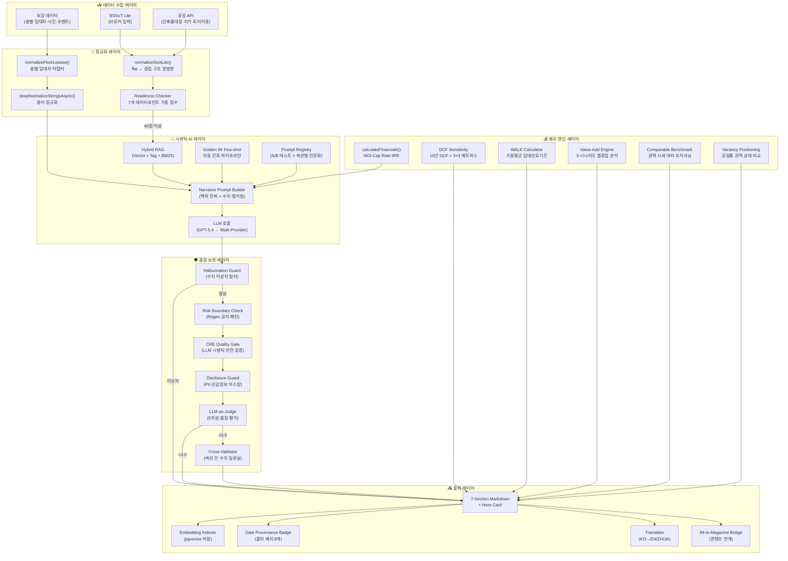
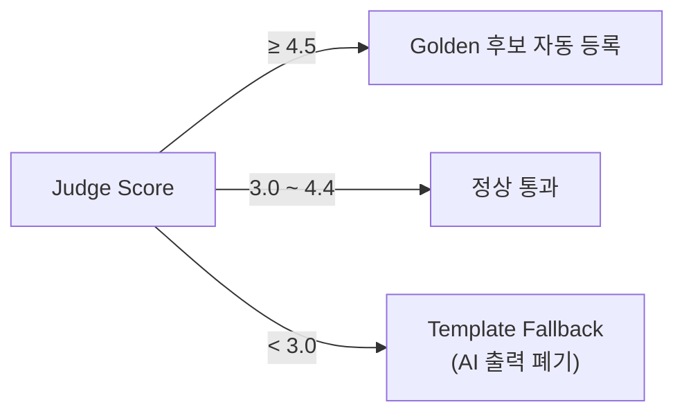
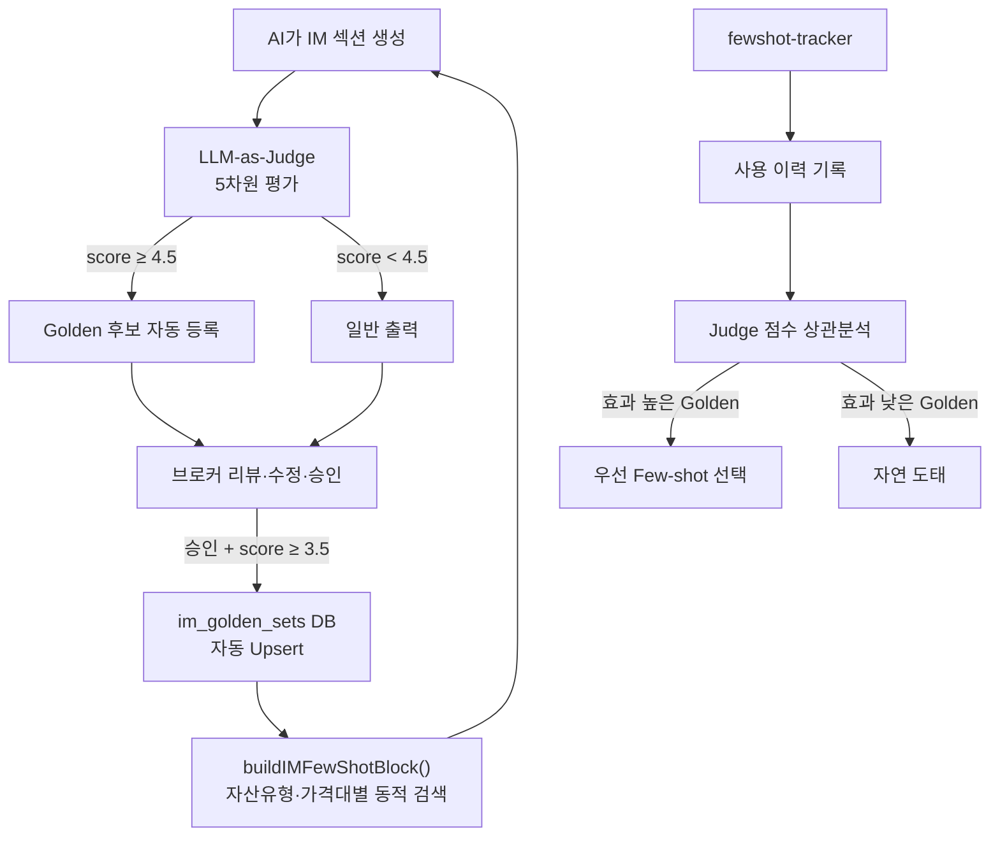

# Mobile IM — AI·시맨틱 기술 정밀 감사 보고서

> **문서 버전**: 1.0  
> **작성일**: 2026-07-23  
> **대상 시스템**: `src/domain/building/mobile-im/` (29개 모듈 + 2개 하위 디렉터리, 총 ~260KB)  
> **감사 범위**: AI 에이전트, 시맨틱 검색, 품질 보증, 재무 분석, 데이터 출처 추적 전 기술 스택

---

## 1. 시스템 아키텍처 총괄

### 1.1 핵심 설계 철학

Mobile IM은 전통적인 부동산 투자 설명서(Information Memorandum)를 **7개 핵심 질문** 구조로 압축하여 모바일 화면에서 투자자의 즉각적 의사결정을 지원하는 AI 네이티브 문서 생성 시스템이다.

```
투자자가 실제로 묻는 7가지 질문:
① 이 건물, 어떤 자산인가? (property_overview)
② 이 입지, 투자할 만한 곳인가? (location_access)
③ 임대 현황과 공실, 실제로 어떤가? (lease_status)
④ 수익률이 진짜로 나오는 딜인가? (income_analysis)
⑤ 숨은 리스크는 없는가? (risk_check)
⑥ 왜 지금 이 매물을 사야 하는가? (investment_thesis)
⑦ 검토 후 다음 단계는? (next_steps)
```

### 1.2 전체 아키텍처 다이어그램



### 1.3 모듈 목록 및 규모

| # | 모듈 파일 | 크기 | 핵심 역할 |
|---|-----------|------|-----------|
| 1 | `writer.ts` | 54.9KB | **메인 오케스트레이션 엔진** — 7섹션 순차 생성 |
| 2 | `cross-validator.ts` | 23.8KB | 섹션 간 수치 일관성 교차 검증 |
| 3 | `narrative-prompt.ts` | 16.9KB | AI 프롬프트 시스템 + 섹션별 미션 정의 |
| 4 | `terminology-normalizer.ts` | 13.4KB | CRE 구어체→표준 투자 용어 자동 치환 |
| 5 | `im-judge.ts` | 12.0KB | LLM-as-Judge 5차원 품질 평가 |
| 6 | `golden-im-manager.ts` | 11.6KB | Golden IM Set 자동 진화 파이프라인 |
| 7 | `financials.ts` | 11.8KB | NOI·Cap Rate·IRR·WACC·DCF 재무 엔진 |
| 8 | `cre-quality-gate.ts` | 10.8KB | LLM 기반 시맨틱 안전 검증 |
| 9 | `guardrails.ts` | 8.2KB | Regex 기반 금지 패턴 검출 + PII 마스킹 |
| 10 | `types.ts` | 8.1KB | 타입 정의 (7섹션·HeroCard·Provenance) |
| 11 | `data-provenance.ts` | 6.8KB | 8개 데이터 포인트 출처 추적 |
| 12 | `fewshot-tracker.ts` | 5.8KB | Few-shot 품질 피드백 루프 |
| 13 | `cre-prompt-registry.ts` | 5.3KB | A/B 테스트 프롬프트 레지스트리 |
| 14 | `im-generation-state-machine.ts` | 5.3KB | Forward-only 생성 상태 머신 |
| 15 | `vacancy-positioning.ts` | 4.5KB | 공실률 권역 상대 포지셔닝 |
| 16 | `value-add-engine.ts` | 4.4KB | 3-시나리오 밸류업 분석 |
| 17 | `lease-adapter.ts` | 4.1KB | 층별 임대차 데이터 어댑터 |
| 18 | `dcf-sensitivity.ts` | 3.9KB | DCF 10년 모델 + 민감도 매트릭스 |
| 19 | `readiness.ts` | 3.9KB | IM 생성 가능 여부 판단 |
| 20 | `cre-rag-service.ts` | 3.3KB | 3-layer Hybrid RAG 검색 |
| 21 | `comparable-benchmark.ts` | 3.2KB | 권역 시세 벤치마킹 |
| 22 | `logistics-im-prompt.ts` | 3.0KB | 물류센터 전용 프롬프트 오버레이 |
| 23 | `photo-url-transformer.ts` | 3.0KB | 사진 URL 변환 + 캡션 매핑 |
| 24 | `golden-lifecycle.ts` | 2.8KB | Golden IM 생명주기 관리 |
| 25 | `data-quality-badge.ts` | 2.5KB | 데이터 품질 등급 배지 |
| 26 | `translator.ts` | 2.5KB | 다국어 자동 번역 (EN/ZH/JA) |
| 27 | `im-to-magazine-bridge.ts` | 2.0KB | IM→주간매거진 콘텐츠 브릿지 |
| 28 | `im-embedding-indexer.ts` | 1.8KB | pgvector 임베딩 인덱싱 |
| 29 | `wale-calculator.ts` | 1.8KB | 가중평균 임대만료기간(WALE) 계산 |
| — | `golden-ingestion/` (3개 파일) | ~20.2KB | 외부 IM 문서 자동 파싱·분류·등록 |
| — | `__tests__/` (5개 파일) | ~13.4KB | 핵심 모듈 단위 테스트 |

**합계**: 29개 모듈 + 8개 하위 파일 = **37개 소스 파일, ~260KB**

---

## 2. AI 기술 정밀 분석

### 2.1 멀티-에이전트 오케스트레이션

#### 핵심 파일: `writer.ts` (1,054 lines)

Mobile IM의 생성 파이프라인은 **단일 오케스트레이터가 7개 AI 호출을 순차적으로 조율**하는 구조이다. 각 섹션은 이전 섹션의 맥락(SectionContext)을 계승받아 수치 일관성을 유지한다.

```typescript
// writer.ts — 핵심 생성 루프 구조 (간략화)
for (let i = 0; i < MOBILE_IM_SECTIONS_7.length; i++) {
  const sectionType = MOBILE_IM_SECTIONS_7[i];
  
  // 1. Few-shot 블록 구성 (Golden IM에서 동적 검색)
  const fewShotBlock = await buildIMFewShotBlock(assetType, priceBand, sectionType);
  
  // 2. RAG 컨텍스트 + 이전 섹션 맥락 + 재무 사전계산 통합
  const userPrompt = buildNarrativeUserPrompt(
    sectionType, normalizedData, externalData, supplemental,
    sectionMarketIndicators,
    i > 0 ? sectionCtx : undefined,  // 섹션 맥락 전파
    ragCtx, fewShotBlock
  );
  
  // 3. AI 생성 (섹션별 토큰 제한)
  const result = await callLLM({ systemPrompt, userPrompt, model: IM_AI_MODEL });
  
  // 4. 4중 가드레일 파이프라인
  detectHallucination(rawText) →
  runRiskBoundaryCheck(markdown) →
  runCREQualityGate(markdown) →
  runDisclosureGuard(markdown);
  
  // 5. LLM-as-Judge 의미론적 평가
  const judgeResult = await judgeIMSection({ ... });
  
  // 6. 맥락 업데이트 (다음 섹션에 전파)
  sectionCtx.keyFacts.push(...extractKeyFacts(markdown));
  updateNumericalAnchors(sectionCtx.numericalAnchors, markdown);
}

// 7. 섹션 간 교차 검증 (post-generation)
runCrossValidation(sections, numericalAnchors);

// 8. 임베딩 인덱싱 (RAG 순환)
await indexIMSections(supabase, buildingId, sections);
```

#### 기술적 차별성

| 특성 | 일반적 AI 문서 생성 | Mobile IM 접근법 |
|------|---------------------|------------------|
| 생성 방식 | 전체 문서 한 번에 생성 | **순차적 7-Stage 파이프라인**, 섹션별 전문화된 프롬프트·토큰 제한 |
| 맥락 관리 | 프롬프트 단일 주입 | **SectionContext 상태 머신**: keyFacts + sectionSummaries + numericalAnchors 전파 |
| 품질 보증 | 후처리 필터 1회 | **4중 계층적 가드레일** (Hallucination→Regex→LLM Gate→Disclosure) |
| 예시 학습 | 고정 Few-shot | **자동 진화하는 Golden IM** Few-shot (브로커 승인 → DB 등록 → 동적 검색) |
| 실패 처리 | 에러 반환 | **Premium Template Fallback**: AI 실패 시 정교한 템플릿 엔진으로 자동 전환 |

### 2.2 프롬프트 엔지니어링 시스템

#### 2.2.1 시스템 프롬프트 (`narrative-prompt.ts`)

한국 CRE 도메인에 특화된 10개 작성 규칙과 톤&스타일 가이드를 포함:

```
핵심 제어 지점:
① 금융 경계 — 투자 유도·수익 보장 표현 절대 금지
② 데이터 경계 — 미보유 데이터 창작 금지 (「실사 단계 확인 필요」로 대체)
③ 출처 표기 — 공공데이터·AI 추정 구분 배지 부착
④ 교차 일관성 — 이전 섹션 수치와 모순 금지
⑤ 어조 — 수동적 표현(「검토할 수 있습니다」) 금지, 확정적·소구적 어조 유지
```

#### 2.2.2 섹션별 전문화 프롬프트 (`cre-prompt-registry.ts`)

| 슬롯 키 | 페르소나 | 특성 |
|---------|---------|------|
| `writer_system_v1` | CRE Brokerage Analyst | 전문적·분석적 (A/B 테스트 활성) |
| `writer_system_v2` | CRE Storyteller | 감성적·비전 소구 (A/B 테스트 활성) |
| `section_income_analysis` | Financial Analyst | 극도로 정밀·데이터 중심 |
| `section_risk_check` | Legal & Compliance Analyst | 보수적·법규 준수 |
| `section_investment_thesis` | Investment Director | 설득적·권위적 |

**A/B 테스트 메커니즘**: `getActivePrompt()`가 동일 슬롯에 등록된 활성 프롬프트 중 무작위로 하나를 선택. 결과 품질은 `fewshot-tracker.ts`에서 Judge 점수와 상관분석.

#### 2.2.3 맥락 전파 메커니즘 (`SectionContext`)

```typescript
// 상태 머신을 통해 섹션 간 전파되는 맥락 구조
interface SectionContext {
  keyFacts: string[];           // 이전 섹션 핵심 사실 누적
  sectionSummaries: Record<string, string>;  // 각 섹션 200자 요약
  numericalAnchors: {
    totalAreaSqm?: number;      // 연면적 앵커
    vacancyPct?: number;        // 공실률 앵커
    monthlyRentKrw?: number;    // 월세 앵커
    capRateBase?: number;       // Cap Rate 앵커
    buildingAge?: number;       // 건물 연식 앵커
  };
}
```

이 메커니즘은 **LLM의 섹션별 독립 생성에서 발생하는 수치 불일치(환각)를 사전 방지**한다. 예를 들어, 섹션 1에서 "연면적 3,300㎡"가 생성되면 이 수치가 앵커로 등록되어 섹션 4의 수익 분석에서도 동일한 면적 기준이 사용된다.

### 2.3 LLM-as-Judge 5차원 평가 시스템

#### 핵심 파일: `im-judge.ts` (306 lines)

AI가 생성한 각 섹션을 **별도의 LLM 호출**로 5가지 차원에서 0~5점 채점:

```
┌────────────────────────────────┬────────┬──────────────────────────────────┐
│ 평가 차원                       │ 가중치 │ 판단 기준                         │
├────────────────────────────────┼────────┼──────────────────────────────────┤
│ ① factual_accuracy            │ 0.25   │ SSoT/공공데이터와 수치 일치 여부   │
│ ② financial_soundness         │ 0.20   │ 재무 계산 체인 논리 일관성         │
│ ③ regulatory_compliance       │ 0.25   │ 금지 언어(투자추천/수익보장) 부재   │
│ ④ investor_value              │ 0.15   │ 투자자에 유용한 정보 밀도          │
│ ⑤ data_grounding              │ 0.15   │ 출처 없는 주장·데이터 창작 여부     │
└────────────────────────────────┴────────┴──────────────────────────────────┘
```

**Judge 결과에 따른 자동화 흐름**:



**확률적 샘플링 (`shouldJudgeByConfidence`)**: 모든 섹션을 Judge로 평가하면 비용이 과다하므로, confidence 수준에 따라 확률적으로 Judge 호출 여부를 결정. `needs_check` 섹션은 100% 평가, `confirmed` 섹션은 낮은 확률로 샘플링.

### 2.4 Multi-Layer 가드레일 시스템

#### Layer 1: Hallucination Guard (규칙 기반)

```typescript
// writer.ts — 가격·면적 이상치 탐지
function detectHallucination(text, purchasePriceKrw, totalAreaSqm) {
  // 가격: 기준값 대비 20배 초과 또는 1/20 미만 → 이상
  // 면적: 기준값 대비 10배 초과 → 이상
  // → anomaly 감지 시 template fallback
}
```

#### Layer 2: Risk Boundary Check (Regex 패턴, `guardrails.ts`)

8개 금지 패턴 범주:

| 심각도 | 범주 | 예시 패턴 | 조치 |
|--------|------|-----------|------|
| **P0** | 투자 추천 | `매수를 추천`, `확실한 투자` | 즉시 차단·치환 |
| **P0** | 수익률 보장 | `수익률이 보장`, `현금흐름을 보장` | 즉시 차단·치환 |
| **P0** | 대출 확정 | `대출이 가능합니다`, `LTV 60% 가능` | 즉시 차단·치환 |
| **P0** | 법적 무결성 | `법적 문제 없음` | 즉시 차단·치환 |
| **High** | 가치평가 확정 | `저평가`, `시장가보다 저렴` | 경고·치환 |
| **High** | 밸류업 확정 | `리모델링하면 임대료 상승` | 경고·치환 |
| **High** | 세무 확정 | `절세 가능` | 경고·치환 |
| **High** | 허가 확정 | `용도변경 가능`, `증축 가능` | 경고·치환 |

#### Layer 3: CRE Quality Gate (LLM 시맨틱, `cre-quality-gate.ts`)

Regex가 포착하지 못하는 **패러프레이징된 금지 표현**을 LLM으로 탐지:

```
5가지 시맨틱 위반 유형:
① investment_guarantee — "놓치면 후회할 수 있습니다" (간접 투자 유도)
② fabricated_data — 출처 없는 구체적 수치 제시
③ legal_assertion — "권리관계가 명확합니다" (법적 확정)
④ misleading_comparison — 검증 불가 시세 비교
⑤ ungrounded_market_claim — 무근거 시장 트렌드 단정
```

**Fail-open 전략**: LLM 실패 시에도 생성 파이프라인은 중단하지 않고 면책 문구(`autoDisclaimerRequired: true`)를 자동 삽입.

#### Layer 4: Disclosure Guard (PII 마스킹)

5개 보호 필드 자동 탐지 및 마스킹:

| 보호 필드 | 탐지 패턴 | 치환 결과 |
|-----------|-----------|-----------|
| 정확한 주소 | `○○구 ○○동 123-45` | `[지역 신호로 대체됨]` |
| 임차인명 | `스타벅스`, `이마트` 등 | `[임차인 업종 정보로 대체됨]` |
| 호별 임대료 | `월세 500만 원` | `[임대수익 존재, 상세 내용 비공개]` |
| 매도자 사정 | `상속 문제로`, `급매` | `[매도자 사정 비공개]` |
| 협상 메모 | `60억까지 가능` | `[내부 협상 메모 비공개]` |

### 2.5 자기 진화하는 Golden IM 시스템

#### 핵심 파일: `golden-im-manager.ts`, `fewshot-tracker.ts`

업계 최초로 **생성 결과 → 브로커 승인 → Golden 등록 → Few-shot 재사용**의 자기 강화 피드백 루프를 구현:



**Golden 등록 기준**:
- Judge 점수 ≥ 3.5
- 콘텐츠 100자 이상
- confidence ≠ `needs_check`
- 브로커가 수정한 최종본 우선 사용

**Few-shot 효과 분석 (`analyzeFewShotEffectiveness`)**:
- 최근 1,000건의 사용 이력에서 각 Golden ID별 평균 Judge 점수 산출
- high/medium/low 3등급 효과 분류
- 효과 낮은 Golden은 자연 도태 (Few-shot 선택에서 밀려남)

---

## 3. 시맨틱 기술 정밀 분석

### 3.1 3-Layer Hybrid RAG

#### 핵심 파일: `cre-rag-service.ts`, `im-embedding-indexer.ts`

```
┌─────────────────────────────────────────────────────────────────┐
│                     Hybrid RAG 파이프라인                         │
│                                                                  │
│  Layer 1: Vector Search (pgvector + text-embedding-3-small)     │
│           → 코사인 유사도 기반 의미적 매칭                         │
│                                                                  │
│  Layer 2: Tag Filter                                             │
│           → asset_type, region 구조화 필터                        │
│                                                                  │
│  Layer 3: BM25 Text Search (websearch_to_tsquery)               │
│           → 키워드 기반 정밀 매칭 보완                             │
│                                                                  │
│  Ensemble → match_im_documents RPC (Supabase)                    │
│             → top-K 결과 반환                                     │
└─────────────────────────────────────────────────────────────────┘
```

**RAG 컨텍스트 생성 흐름**:
1. 자산 유형 + 주소(동 단위 추출) + 건물명으로 검색 쿼리 구성
2. `searchSimilarIMs()`: embedding 생성 → Supabase RPC 호출 → 하이브리드 결합
3. top-2 유사 IM의 콘텐츠를 `[유사사례 1]`, `[유사사례 2]` 형식으로 프롬프트에 주입

**RAG 순환 구조**:
- **인덱싱 (`im-embedding-indexer.ts`)**: 생성된 IM의 전체 섹션 텍스트를 `text-embedding-3-small`로 임베딩하여 `im_documents` 테이블에 upsert → **생성할수록 RAG 지식 베이스가 확장**
- **검색 (`cre-rag-service.ts`)**: 새로운 IM 생성 시 기존 유사 IM을 검색하여 문맥 참고

### 3.2 시맨틱 용어 정규화

#### 핵심 파일: `terminology-normalizer.ts` (271 lines)

CRE 업계 구어체를 표준 투자 용어로 자동 치환하는 **3-tier 정규화 시스템**:

| Tier | 방식 | 예시 |
|------|------|------|
| **Tier 1: 함수형 치환** | 동적 계산이 필요한 패턴 | `450평` → `450평(약 1,487.6㎡)` |
| **Tier 2: DB 동적 로딩** | Supabase `term_normalization_rules` 테이블 | 5분 캐시 + hit_count 추적 |
| **Tier 3: 하드코딩 Fallback** | ~30개 기본 치환 규칙 | `급매` → `시세 대비 할인 매각` |

**함수형 치환 Registry (SOTA)**:

```typescript
// 단순 문자열 치환이 아닌, 계산이 포함된 동적 치환
const FUNCTIONAL_REPLACEMENTS = {
  'fn:pyeongToSqm': (_match, num) => {
    const sqm = Math.round(parseFloat(num) * 3.3058 * 10) / 10;
    return `${num}평(약 ${sqm}㎡)`;  // 국제 표준 병기
  },
  'fn:conjugateLease': (_match, suffix) => {
    // 한국어 활용형 처리: 세놓다/세놓고/세놓은 → 임대하다/임대하고/임대한
    return `임대${conjugationMap[suffix]}`;
  },
};
```

**주요 치환 카테고리** (30+ 규칙):

| 카테고리 | 구어체 | 표준 용어 |
|---------|--------|-----------|
| 면적 | `450평` | `450평(약 1,487.6㎡)` |
| 비용 | `건물 고치는 비용` | `자본적 지출(CAPEX)` |
| 임대 | `통으로 빌려주는` | `마스터리스(Master Lease) 구조` |
| 임대 | `방 빼는 절차` | `명도 프로세스` |
| 거래 | `급매` | `시세 대비 할인 매각` |
| 거래 | `알박기` | `잔존 권리관계` |
| 거래 | `떳다방` | `비정규 중개 채널` |
| 신용 | `돈 잘 내는 임차인` | `우량 임차인(Prime Tenant)` |

### 3.3 섹션 간 교차 검증 시스템

#### 핵심 파일: `cross-validator.ts` (578 lines)

LLM이 섹션별로 독립 생성하면서 수치가 어긋나는 환각 패턴을 포착하는 **포스트-프로세싱 검증 엔진**:

**검증 대상 6개 지표**:

| 지표 | 탐지 패턴 (정규식) | 불일치 임계값 | 심각도 |
|------|---------------------|--------------|--------|
| 공실률 | `공실률 15%`, `공실 약 30%` | ±10%p | **critical** |
| 면적 | `연면적 450.2㎡`, `약 350 ㎡` | ±20% 상대 | **critical** |
| 월세 | `월세 총액 1,200만 원` | ±15% 상대 | warning |
| Cap Rate | `Cap Rate 4.5%`, `환원이율 5.2%` | ±2%p | warning |
| 역 도보 거리 | `도보 5분`, `역까지 약 7분` | ±3분 | warning |
| 건물 연식 | `준공 1998년`, `준공 25년` | ±3년 | warning |

**작동 방식**:
1. 각 섹션의 마크다운에서 한국어 CRE 수치 패턴을 정규식으로 추출 (`extractKeyFacts()`)
2. 수치 앵커(첫 번째 등장 값)를 기준으로 후속 섹션의 동일 지표 비교
3. critical 불일치 발견 시 해당 섹션의 confidence를 `needs_check`로 강등

### 3.4 Golden IM 자동 입수 파이프라인

#### 핵심 파일: `golden-ingestion/` (3개 파일, ~20KB)

외부에서 작성된 기존 IM 문서(PDF/텍스트)를 자동으로 파싱하여 Golden Set에 등록하는 **3-Layer 분류 시스템**:

| Layer | 파일 | 역할 |
|-------|------|------|
| 1. 파서 | `file-parser.ts` | PDF/텍스트 → 구조화된 텍스트 추출 |
| 2. 분할기 | `section-segmenter.ts` | 연속 텍스트 → 섹션 단위 분할 |
| 3. 매핑 | `section-alias-resolver.ts` | 자유 텍스트 섹션명 → 7개 MobileIMSectionType 매핑 |

**섹션 매핑의 3-Layer 전략**:
1. **정확 매칭**: 153개 한국어/영어 별칭 사전 (예: `'캐시플로우'` → `income_analysis`)
2. **유사도 매칭**: 편집 거리(Levenshtein) 기반 퍼지 매칭
3. **LLM 폴백**: 위 방법 실패 시 LLM에 분류 위임

### 3.5 데이터 출처 추적 (Data Provenance)

#### 핵심 파일: `data-provenance.ts` (108 lines)

모든 데이터 포인트에 **출처·신뢰도·검증 시점**을 부착하여 투명성을 보장:

```
4-tier 신뢰도 체계:
✓ public_data (공부 확인)      — 건축물대장·공시지가·토지이용 API
★ expert_verified (전문가 검증) — 감정평가사·법률 전문가 확인
👤 broker_input (중개인 입력)   — 브로커 직접 등록 데이터
⚙ ai_inferred (AI 추정)       — 자동 계산·추론된 데이터
```

**8개 추적 대상 데이터 포인트**:

| # | 데이터 | 1차 소스 | 2차 소스 | 3차 소스 |
|---|--------|---------|---------|---------|
| 1 | 연면적 | 건축물대장 API | SSoT 브로커 입력 | — |
| 2 | 대지면적 | 건축물대장 API | SSoT 브로커 입력 | — |
| 3 | 사용승인일 | 건축물대장 API | SSoT 브로커 입력 | — |
| 4 | 용도지역 | LURIS API | — | — |
| 5 | 개별공시지가 | 국토부 API | — | — |
| 6 | 월임대료 합계 | 브로커 보강 입력 | SSoT 등록 | — |
| 7 | 공실률 | 브로커 보강 입력 | AI 기본값 추론 | — |
| 8 | 예상 수익률 | 브로커 제시 | SSoT 등록 | AI 계산 |

---

## 4. 재무 분석 엔진 상세

### 4.1 핵심 재무 지표 산출 (`financials.ts`)

| 지표 | 산출 방식 | 불확실성 처리 |
|------|-----------|--------------|
| **NOI** | 연 임대료 × (1 − 공실률) − 운영비 | Best/Base/Worst 3-시나리오 |
| **Cap Rate** | NOI ÷ 매매가 × 100 | Best/Base/Worst |
| **IRR (5년)** | Newton-Raphson 반복법 (150 iterations) | 3-시나리오 |
| **Leveraged Yield** | NOI ÷ 자기자본 × 100 | 대출 반영 |
| **WACC** | Ke × E/(D+E) + Kd × D/(D+E) × (1−T) | 자산유형별 가정 |
| **평당가** | 매매가 ÷ 연면적(㎡) × 3.3058 | — |
| **대지가치비중** | (공시지가 × 대지면적) ÷ 매매가 | — |

**자산 유형별 운영비율 자동 산출**:

| 자산 유형 | 운영비율 |
|-----------|---------|
| 오피스 | 15% |
| 물류/창고 | 12% |
| 상가/근린 | 20% |
| 지식산업센터 | 22% |
| 호텔/숙박 | 35% |
| 기본값 | 18% |

### 4.2 DCF 10년 민감도 분석 (`dcf-sensitivity.ts`)

```
3×3 Sensitivity Matrix:
         Exit Cap Rate
         -0.5%p  |  Base  |  +0.5%p
WACC   ─────────┼────────┼─────────
-1%p   | NPV₁₁  | NPV₁₂ | NPV₁₃  
Base   | NPV₂₁  | NPV₂₂ | NPV₂₃  
+1%p   | NPV₃₁  | NPV₃₂ | NPV₃₃  
```

IRR 계산은 Newton-Raphson 수치 해석법을 사용하여 최대 150회 반복으로 수렴.

### 4.3 WALE Calculator (`wale-calculator.ts`)

가중평균 임대차 잔여기간(Weighted Average Lease Expiry)을 산출하여 **임대 안정성 정량화**:

- **WALE(임대료 가중)**: 월 임대료 기준 가중평균 잔여 기간
- **WALE(면적 가중)**: 임대 면적 기준 가중평균 잔여 기간
- **12개월 내 만기 비중**: Rollover Risk 조기 경보

| 만기 비중 | 경고 수준 | 권고 |
|-----------|----------|------|
| > 30% | 🔴 위험 | 임대차 갱신 협상 조기 시작 |
| 15~30% | 🟡 주의 | 계약 현황 확인 권장 |
| < 15% | 🟢 양호 | 단기 만기 위험 낮음 |

### 4.4 Value-Add 시나리오 엔진 (`value-add-engine.ts`)

3가지 밸류업 시나리오를 자동 계산:

| 시나리오 | 입력 | 산출 |
|---------|------|------|
| ① 공실 해소 | 현재 공실률 | NOI 증분 + 개선 Cap Rate |
| ② 임대료 현실화 (+5%) | 현재 월세 | NOI 증분 + 개선 Cap Rate |
| ③ 리모델링 | 연면적 × 30만원/㎡ | 투자비 + 회수기간 + 개선 Cap Rate |

### 4.5 권역 시세 벤치마킹 (`comparable-benchmark.ts`, `vacancy-positioning.ts`)

- **시세 벤치마킹**: 인근 실거래 사례 대비 ㎡당 단가 비교 → Highly Competitive / Market Rate / Overpriced 3등급 판정
- **공실률 벤치마킹**: 한국부동산원 데이터 기준 16개 주요 권역 평균 공실률과 비교 → Below Average / Average / Above Average 포지셔닝

---

## 5. 생성 파이프라인 상태 머신

#### 핵심 파일: `im-generation-state-machine.ts`

**Forward-only 전이** 규칙으로 생성 과정의 엄격한 순서를 보장:

```
data_collection
  → property_overview
    → location_analysis
      → lease_status
        → income_analysis
          → risk_check
            → investment_thesis
              → next_steps
                → cross_validation
                  → quality_gate
                    → pending_approval
```

- **역방향 전이 불가**: 잘못된 전이 시도 시 `false` 반환 + 경고 로그
- **단계별 프롬프트 힌트**: 각 스테이지에 최적화된 가이드라인 자동 주입

---

## 6. 부가 기능

### 6.1 다국어 자동 번역 (`translator.ts`)

| 대상 언어 | 모델 | 특수 규칙 |
|-----------|------|-----------|
| English | GPT-5.4 | 금액(KRW) 원본 유지, 용어 각주 |
| 简体中文 | GPT-5.4 | 부동산 전문 용어 적용 |
| 日本語 | GPT-5.4 | 마크다운 서식 완전 보존 |

### 6.2 Readiness Checker (`readiness.ts`)

7개 데이터 포인트에 가중 점수를 부여하여 **생성 가능 여부를 사전 판정**:

| 데이터 포인트 | 배점 | Tier |
|--------------|------|------|
| 정확한 주소 (지번) | 25점 | Critical |
| 월세 총액 | 20점 | Critical |
| 자산 유형 | 10점 | Basic |
| 가격대 | 10점 | Basic |
| 권역 정보 | 10점 | Basic |
| 공실률 | 10점 | Enhanced |
| 건물 사진 | 10점 | Enhanced |
| 브로커 코멘트 | 5점 | Enhanced |

**임계값**: 40점 이상이면 생성 진행 (최대 100점 + 공공데이터 보너스 10점).

### 6.3 물류센터 전용 확장 (`logistics-im-prompt.ts`)

물류센터 자산에 대해 **16개 전용 필드**를 프롬프트에 오버레이:

```
천장고, 도크 수, 도크 레벨러, 접안 가능 최대 차량(톤),
바닥 하중(톤/㎡), 냉동/냉장 면적, 하역장 면적,
차량 접근 방식(ramp/dock/both), 내화등급, 스프링클러,
기둥 간격, 전기 용량, 사무공간 유무/면적, IC 거리, IC명
```

### 6.4 IM→매거진 브릿지 (`im-to-magazine-bridge.ts`)

생성된 IM 콘텐츠를 주간 매거진 시스템으로 자동 연계:

```typescript
interface IMToMagazineBridge {
  buildingId: string;
  imUrl: string;           // /im-lite/{buildingId}
  heroCard: HeroCardData;  // 핵심 투자 지표
  sections: MobileIMSection[];
}
```

---

## 7. 테스트 커버리지

| 테스트 파일 | 대상 모듈 | 크기 |
|------------|-----------|------|
| `guardrails.test.ts` | 금지 패턴 검출 + PII 마스킹 | 2.5KB |
| `comparable-benchmark.test.ts` | 시세 벤치마킹 계산 | 2.1KB |
| `financials.test.ts` | NOI·Cap Rate·IRR 산출 | 3.5KB |
| `wale-calculator.test.ts` | WALE 계산 정확도 | 2.5KB |
| `semantic-prompt-cache.test.ts` | 시맨틱 프롬프트 캐싱 | 2.7KB |

---

## 8. 방법론적 차별성 종합 분석

### 8.1 업계 비교

| 차별 요소 | 전통 IM | 일반 AI 문서 생성 | **본 시스템 (Mobile IM)** |
|-----------|---------|-------------------|--------------------------|
| **생성 방식** | 수동 작성 (2~4주) | 전체 문서 1-pass 생성 | **7-Stage 순차 파이프라인 + 섹션별 전문화 프롬프트** |
| **품질 보증** | 인간 검토 | 후처리 필터 1회 | **4중 가드레일 + LLM-as-Judge 5차원 평가** |
| **데이터 근거** | 수동 수집 | 프롬프트에 데이터 주입 | **8개 데이터 포인트 출처 추적 + 4-tier 신뢰도 배지** |
| **일관성** | 인간 교차 확인 | 보장 없음 | **SectionContext 맥락 전파 + 교차 검증 엔진** |
| **학습** | 경험적 | 고정 Few-shot | **Golden IM 자기 진화 + Few-shot 효과 분석** |
| **시장 참조** | 수동 조사 | 없음 | **Hybrid RAG (Vector + Tag + BM25)** |
| **용어 표준화** | 에디터 수동 | 없음 | **3-tier 자동 정규화 (함수형 + DB + 하드코딩)** |
| **재무 분석** | 엑셀 수동 | 단순 계산 | **자동 NOI/Cap Rate/IRR/DCF 10년/WALE/밸류업 시나리오** |
| **환각 방지** | — | 약함 | **수치 이상치 탐지 + 교차 검증 + LLM Quality Gate** |
| **다국어** | 외주 번역 | — | **GPT 기반 실시간 EN/ZH/JA 번역** |

### 8.2 8대 핵심 차별 포인트

#### ① 4중 계층 가드레일 파이프라인

부동산 투자 문서는 잘못된 정보가 **법적 책임**으로 직결된다. Hallucination Guard → Regex → LLM Semantic → Disclosure로 이어지는 4중 방어선은 **규제 산업에서의 AI 활용 모범 사례**를 구현한다.

#### ② SectionContext 맥락 전파 + 교차 검증

LLM의 섹션별 독립 생성에서 발생하는 수치 불일치를 **사전(수치 앵커링) + 사후(교차 검증)** 양면으로 방지. 578줄 규모의 정교한 패턴 매칭으로 한국어 CRE 특유의 수치 표현(「약 350㎡」,「공실 약 30%」)을 정밀 추출.

#### ③ 자기 강화 Golden IM 피드백 루프

생성 → 평가 → 승인 → 등록 → 재사용의 순환 구조는 **사용할수록 품질이 향상**되는 시스템을 만든다. Few-shot 효과 분석(`analyzeFewShotEffectiveness`)까지 포함하여 비효과적인 Golden은 자연 도태된다.

#### ④ 도메인 특화 시맨틱 용어 정규화

단순 사전 치환이 아닌, **한국어 활용형 처리(「세놓다→임대하다」)** 와 **단위 변환 함수(「평→㎡ 자동 병기」)**를 포함하는 함수형 치환 레지스트리는 금융 문서의 전문성과 법적 안전성을 동시에 제고한다.

#### ⑤ Fail-safe 설계 일관성

모든 AI 호출 지점에 **fallback 전략**이 설계됨:
- AI 생성 실패 → Premium Template 자동 전환
- Judge 실패 → 정상 통과 (결과에 영향 없음)
- Quality Gate 실패 → fail-open + 면책 문구 자동 삽입
- RAG 실패 → 빈 컨텍스트로 진행 (non-blocking)
- 임베딩 인덱싱 실패 → 경고 로그만 (non-blocking)

#### ⑥ Hybrid RAG → 생성 → 인덱싱 순환 구조

생성된 IM이 자동으로 벡터 DB에 인덱싱되어 **다음 IM 생성의 참조 자료**가 되는 자기 강화 지식 루프. 시스템이 가동될수록 RAG 지식 베이스가 자동 확장.

#### ⑦ 정량적 투자 분석 엔진 내장

Cap Rate, IRR, DCF, WALE, Value-Add 시나리오를 **프로그래밍 방식으로 계산**하여 AI 환각 위험 없이 정밀한 재무 분석을 제공. AI는 이 사전 계산된 값을 "그대로 활용하고 수치를 변경하지 마세요"라는 지시와 함께 받는다.

#### ⑧ 물류센터 등 자산 유형별 확장성

물류센터 전용 16개 필드, 자산 유형별 운영비율 자동 산출 등 **도메인 내 하위 세그먼트별 전문화**가 모듈식으로 확장 가능하도록 설계되어 있다.

---

## 9. 기술 스택 요약

| 영역 | 기술 |
|------|------|
| **LLM** | GPT-5.4 (기본) / Claude Sonnet 4.5 (전환 준비 완료) / Multi-Provider Fallback |
| **Embedding** | OpenAI `text-embedding-3-small` |
| **Vector DB** | Supabase pgvector |
| **Text Search** | PostgreSQL `websearch_to_tsquery` (BM25) |
| **Schema Validation** | Zod v4 |
| **State Machine** | 커스텀 Forward-only FSM |
| **Financial Engine** | 자체 구현 (Newton-Raphson IRR, DCF, WACC) |
| **Testing** | Vitest (5개 테스트 스위트) |

---

## 10. 참조 파일 경로

모든 소스 코드는 `src/domain/building/mobile-im/` 하위에 위치하며, 관련 API 라우트는 다음과 같다:

| API Route | 용도 |
|-----------|------|
| `POST /api/broker/im-lite/generate` | 동기 IM 생성 |
| `POST /api/broker/im-lite/generate-async` | 비동기 IM 생성 (Job 기반) |
| `GET /api/broker/im-lite/job-status` | 비동기 작업 상태 조회 |
| `POST /api/broker/im-lite/[id]/save-sections` | 섹션 편집 저장 |
| `POST /api/broker/im-lite/[id]/approve` | 브로커 승인 → Golden 등록 |
| `GET /api/public/im-lite/[buildingId]` | 공개 IM 조회 |
| `POST /api/public/im-lite/[buildingId]/translate` | 다국어 번역 |
| `GET /api/public/im-lite/[buildingId]/tts` | 음성 변환 (TTS) |
| `POST /api/public/im-lite/[buildingId]/view` | 열람 이벤트 기록 |
| `GET /api/public/im-lite/[buildingId]/export` | HTML 내보내기 |
