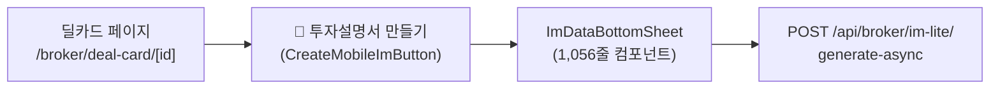
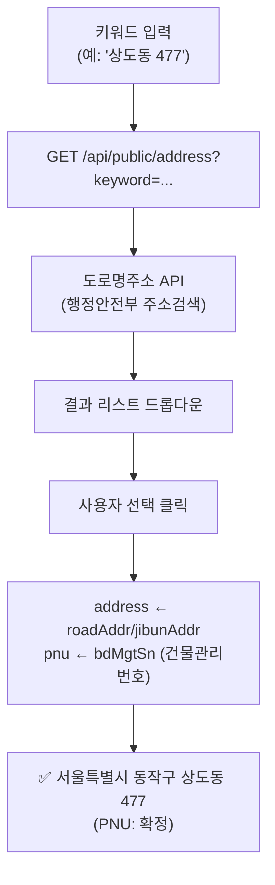
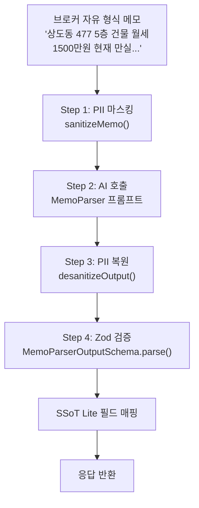
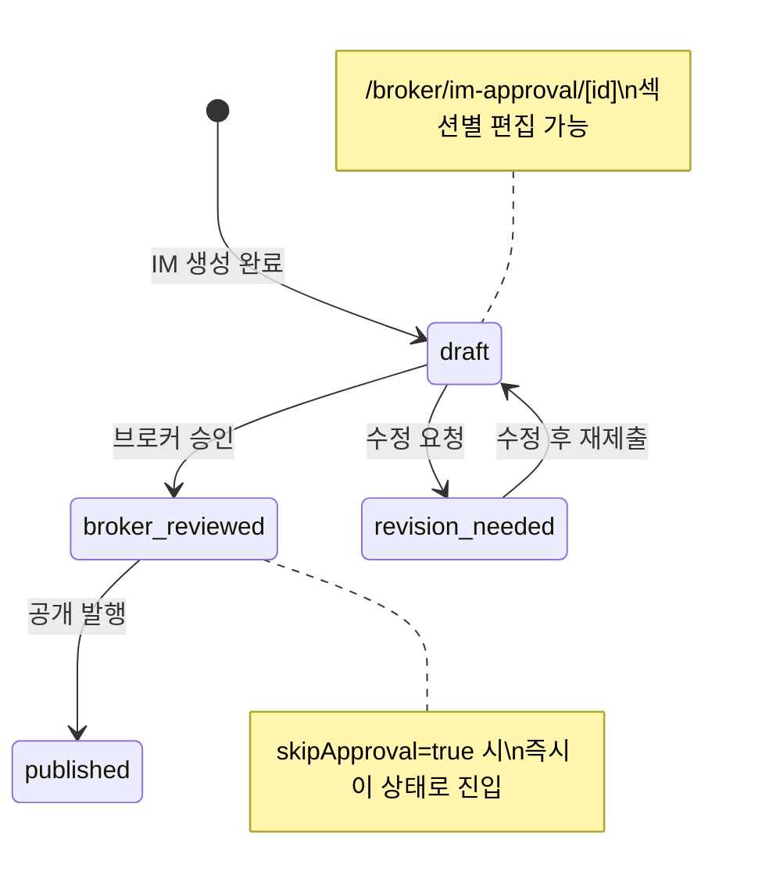
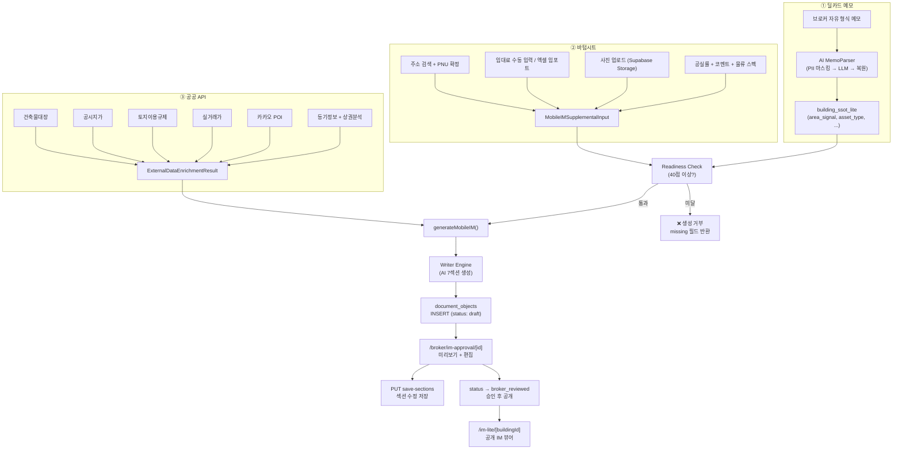
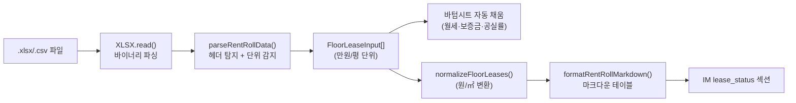

# 모바일 IM 데이터 공급 체계 · 수정 · 확인 · 저장 시스템 정밀 감사 보고서

> **문서 버전**: 1.0  
> **작성일**: 2026-07-25  
> **감사 범위**: 데이터 3대 공급원(메모·바텀시트·공공API), 엑셀 렌트롤 임포터, Readiness 스코어링, AI 생성 엔진, 섹션 편집·승인·저장 파이프라인, 데이터 출처 추적(Provenance)  
> **감사 파일 수**: 22개

---

## 목차

1. [시스템 전체 아키텍처](#1-시스템-전체-아키텍처)
2. [데이터 공급원 ① — 딜카드 메모(SSoT Lite)](#2-데이터-공급원--딜카드-메모ssot-lite)
3. [데이터 공급원 ② — 바텀시트(Supplemental Input)](#3-데이터-공급원--바텀시트supplemental-input)
4. [데이터 공급원 ③ — 공공 데이터 API (External Data)](#4-데이터-공급원--공공-데이터-api-external-data)
5. [엑셀 렌트롤 임포터](#5-엑셀-렌트롤-임포터)
6. [Readiness 스코어링 시스템](#6-readiness-스코어링-시스템)
7. [AI 메모 파서 (Memo → SSoT 자동 추출)](#7-ai-메모-파서-memo--ssot-자동-추출)
8. [IM 생성 파이프라인 (핸들러 → Writer)](#8-im-생성-파이프라인-핸들러--writer)
9. [수정 · 확인 · 승인 워크플로](#9-수정--확인--승인-워크플로)
10. [저장 시스템 (DB 스키마 · API)](#10-저장-시스템-db-스키마--api)
11. [데이터 출처 추적 (Provenance)](#11-데이터-출처-추적-provenance)
12. [단위 변환 및 임대차 어댑터](#12-단위-변환-및-임대차-어댑터)
13. [데이터 흐름 총괄 다이어그램](#13-데이터-흐름-총괄-다이어그램)
14. [파일 참조 맵](#14-파일-참조-맵)

---

## 1. 시스템 전체 아키텍처

모바일 IM의 데이터 공급 및 처리 체계는 **3대 공급원 → Readiness 게이트 → AI 생성 → 편집/승인 → 저장/발행**의 5단계 파이프라인으로 구성됩니다.

```
┌─────────────────────────────────────────────────────────────────────┐
│                    DATA SUPPLY (3대 공급원)                          │
│                                                                     │
│  ① 딜카드 메모 (SSoT Lite)   ② 바텀시트 (Supplemental)   ③ 공공API  │
│  ├─ AI 메모 파서              ├─ 주소 검색                 ├─ 건축물대장│
│  ├─ 건물 신호 추출             ├─ 임대료·보증금              ├─ 공시지가 │
│  └─ raw_input 보존            ├─ 엑셀 렌트롤 임포트          ├─ 토지이용│
│                              ├─ 사진 업로드                ├─ 주변 POI│
│                              ├─ 공실률·브로커 코멘트         ├─ 실거래가│
│                              └─ 물류센터 전용 스펙           ├─ 등기정보│
│                                                            └─ 상권분석│
├─────────────────────────────────────────────────────────────────────┤
│                    READINESS GATE (40점 이상)                        │
│  → computeMobileIMReadiness() — 8개 데이터포인트 가중 점수 합산       │
├─────────────────────────────────────────────────────────────────────┤
│                    AI GENERATION ENGINE                              │
│  → generateMobileIM() — 7섹션 AI 서사 생성 (환각 검증 + 품질 게이트)  │
├─────────────────────────────────────────────────────────────────────┤
│                    REVIEW & APPROVAL                                 │
│  → /broker/im-approval/[id] — 섹션별 편집 + OG 메타 편집 + 승인/반려  │
├─────────────────────────────────────────────────────────────────────┤
│                    STORAGE & PUBLISH                                 │
│  → document_objects 테이블 (Supabase) + im_generation_jobs 테이블    │
│  → /im-lite/[buildingId] 공개 URL                                   │
└─────────────────────────────────────────────────────────────────────┘
```

---

## 2. 데이터 공급원 ① — 딜카드 메모(SSoT Lite)

### 2.1 데이터 흐름

딜카드 생성 시 브로커가 자유 형식 메모를 입력하면, AI 에이전트가 이를 파싱하여 `building_ssot_lite` 테이블에 구조화된 데이터로 저장합니다. 이 데이터가 IM 생성의 **기초 입력(Seed Data)**이 됩니다.

### 2.2 SSoT Lite 주요 컬럼

| 컬럼 | 설명 | IM에서의 역할 |
|------|------|--------------|
| `area_signal` | 권역 정보 (예: "강남구") | IM 제목, 입지 분석 |
| `asset_type` | 자산 유형 (예: "상가·사무실 복합") | IM 제목, 자산 분류 |
| `price_band` | 가격대 (예: "100~150억원") | 투자 분석 |
| `size_signal` | 규모 정보 | 자산 개요 |
| `vacancy_signal` | 공실 현황 간략 입력 | Readiness 점수 반영 |
| `fit_summary` | AI 생성 적합 매수자 요약 | 투자 논거 |
| `caution_summary` | AI 생성 주의사항 요약 | 리스크 체크 |
| `layers` | 중첩 데이터 (location, photos, rent_roll 등) | 좌표, 사진, 임대차 |
| `raw_input` | 원본 메모 텍스트 | 주소 추출 폴백 |
| `hidden_fields` | 블라인드 처리 대상 필드 목록 | Gate 정책 적용 |

### 2.3 SSoT → IM Writer 정규화

[`writer.ts`](file:///c:/Users/User/cre-dealcard/src/domain/building/mobile-im/writer.ts)의 `normalizeSsotLite()` 함수가 DB의 flat 구조와 legacy 중첩 구조를 모두 처리합니다:

```typescript
function normalizeSsotLite(raw: Record<string, unknown>) {
  return {
    assetIdentity: {
      area_signal:  raw.area_signal  ?? raw.asset_identity?.area_signal,
      asset_type:   raw.asset_type   ?? raw.asset_identity?.asset_type,
      price_band:   raw.price_band   ?? raw.asset_identity?.price_band,
    },
    physicalFact: {
      total_area:   raw.total_area   ?? raw.physical_fact?.total_area,
      floors:       raw.floors       ?? raw.physical_fact?.floors,
    },
    marketLocation: { /* ... */ },
    buyerFit:       { /* ... */ },
  };
}
```

### 2.4 핸들러의 SSoT 로드

[`handler.ts`](file:///c:/Users/User/cre-dealcard/src/app/api/broker/im-lite/generate/handler.ts#L46-L60): 생성 시작 시 `building_ssot_lite`에서 10개 필드를 SELECT한 후, `directData`(딜카드 UI에서 전달받은 추가 속성)를 spread 병합합니다.

```typescript
const bssotFlat = {
  area_signal:  ssotRow.area_signal,
  asset_type:   ssotRow.asset_type,
  // ... 8개 필드
  ...(directData ?? {}),  // 딜카드에서 전달받은 추가 속성 병합
};
```

---

## 3. 데이터 공급원 ② — 바텀시트(Supplemental Input)

### 3.1 진입 경로



### 3.2 파일 구조

| 파일 | 크기 | 역할 |
|------|------|------|
| [`create-mobile-im-button.tsx`](file:///c:/Users/User/cre-dealcard/src/app/(broker)/broker/deal-card/[id]/create-mobile-im-button.tsx) | 1.6KB | 바텀시트 트리거 버튼 |
| [`im-data-bottom-sheet.tsx`](file:///c:/Users/User/cre-dealcard/src/app/(broker)/broker/deal-card/[id]/im-data-bottom-sheet.tsx) | 50.8KB | **핵심 데이터 입력 컴포넌트** |

### 3.3 입력 필드 전체 목록

바텀시트가 수집하는 데이터는 `MobileIMSupplementalInput` 타입으로 정의되어 있습니다:

| 카테고리 | 필드명 | UI 요소 | 단위 | Readiness 점수 |
|----------|--------|---------|------|---------------|
| **주소** | `resolved_address` | 검색+선택 드롭다운 | 도로명/지번 | 25점 |
| **주소** | `resolved_pnu` | 자동 (주소 선택 시) | 건물관리번호 25자리 | (주소에 포함) |
| **임대료** | `monthly_rent_total_krw` | 숫자 입력 / 엑셀 임포트 | 만원 → KRW 변환 | 20점 |
| **보증금** | `total_deposit_manwon` | 숫자 입력 / 엑셀 임포트 | 만원 | — |
| **관리비** | `mgmt_fee_total_manwon` | 숫자 입력 / 엑셀 임포트 | 만원 | — |
| **매각가** | `asking_price_manwon` | 숫자 입력 / Cap Rate 역산 | 만원 | — |
| **대출** | `loan_amount_manwon` | 숫자 입력 | 만원 | — |
| **공실률** | `vacancy_pct` | 프리셋 버튼(만실/~10%/~20%) + 직접 입력 | % | 10점 |
| **사진** | `photo_urls` | 파일 업로드(최대 12장, 10MB 제한) | URL | 10점 |
| **캡션** | `photo_captions` | 텍스트 입력 (사진별) | 텍스트 | — |
| **코멘트** | `broker_highlight` | 텍스트 입력 | 텍스트 | 5점 |
| **렌트롤** | `floor_leases[]` | 엑셀 임포트 (RentRollImporter) | FloorLeaseInput[] | — |
| **물류 스펙** | `logistics.*` | 17개 전용 입력 필드 (조건부 표시) | 다양 | — |

### 3.4 물류센터 전용 필드 (조건부 UI)

`assetType`에 "물류" 또는 "logistics"가 포함될 때만 표시되는 17개 필드:

| 그룹 | 필드 | 단위 |
|------|------|------|
| **기본 제원** | 천장고, 기둥 간격, 바닥 하중, 전기 용량 | m, m, ton/㎡, kW |
| **도크/접안** | 도크 수, 레벨러 수, 최대 차량 톤, 하역장 면적 | 개, 개, ton, 평 |
| **설비/보관** | 냉동냉장 면적, 냉장 유형, 차량 접근 방식, 내화 등급 | 평, enum, enum, 등급 |
| **소방/부대** | 스프링클러, 사무공간 유무, 사무공간 면적 | bool, bool, 평 |
| **교통 입지** | IC 명칭, IC까지 거리 | 텍스트, km |

### 3.5 주소 검색 시스템



### 3.6 매각가 Cap Rate 역산

바텀시트에는 **수익률 역산 계산기**가 내장되어 있습니다:

```typescript
// 역산 공식: 매각가 = (월세 × 12 / 수익률%) + 보증금
const estimatedPrice = Math.round(((rent * 12) / (capRate / 100)) + deposit);
```

실시간 Cap Rate 표시:
```
📊 예상 Cap Rate: 4.2% (월세×12 ÷ 매각가)
```

### 3.7 사진 업로드 시스템

| 항목 | 상세 |
|------|------|
| **최대 장수** | 12장 (기존 + 신규 합산) |
| **최대 파일 크기** | 10MB/장 |
| **스토리지** | Supabase Storage `building_photos` 버킷 |
| **파일명 규칙** | `{buildingId}/{timestamp}_{원본파일명}` |
| **업로드 시점** | IM 생성 요청 시 (handleCreate 내부) |
| **실패 처리** | 부분 성공 허용 (N장 실패 알림 + 성공분으로 속행) |

### 3.8 바텀시트 → API 요청 바디

```typescript
const requestBody = {
  building_id:              buildingId,
  vacancy_status:           vacancySignal,
  vacancy_pct:              Number(vacancyPct),
  monthly_rent_total_krw:   Number(monthlyRent) * 10000,  // 만원 → 원 변환
  total_deposit_manwon:     Number(totalDeposit),
  mgmt_fee_total_manwon:    Number(mgmtFeeTotal),
  loan_amount_manwon:       Number(loanAmount),
  asking_price_manwon:      Number(askingPrice),
  resolved_address:         address,
  resolved_pnu:             pnu,
  broker_highlight:         brokerHighlight,
  direct_data:              { area_signal, asset_type, price_band, ... },
  photo_urls:               [...existingUrls, ...uploadedPhotoUrls],
  photo_captions:           photoCaptions,
  floor_leases:             floorLeases,    // 엑셀 파싱 결과
  logistics:                logistics,       // 물류 전용
};
```

---

## 4. 데이터 공급원 ③ — 공공 데이터 API (External Data)

### 4.1 오케스트레이터 구조

| 파일 | 역할 |
|------|------|
| [`external-data-orchestrator.ts`](file:///c:/Users/User/cre-dealcard/src/lib/external/external-data-orchestrator.ts) | 주소 기반 진입점 (캐시 확인 → 주소 해석 → 코어 호출) |
| [`enrich-by-pnu.ts`](file:///c:/Users/User/cre-dealcard/src/lib/external/enrich-by-pnu.ts) | PNU 기반 진입점 + 공통 코어 (`enrichBuildingDataCore`) |

### 4.2 7개 공공 API 병렬 호출

IM 생성 시 `resolved_address` 또는 `resolved_pnu`를 기반으로 **7개 API를 병렬(`Promise.allSettled`)**로 호출합니다:

| # | API명 | 출처 | 수집 데이터 | IM 활용 섹션 |
|---|--------|------|------------|-------------|
| 1 | **건축물대장 API** | 국토교통부 | 연면적, 대지면적, 사용승인일, 주용도, 구조, 층수, 건폐율, 용적률, 승강기, 주차 | `property_overview` |
| 2 | **개별공시지가 API** | 국토교통부 | ㎡당 지가, 기준년도 | `income_analysis` |
| 3 | **토지이용규제 API** | LURIS | 용도지역, 건폐율·용적률 한도, 중복 규제 | `risk_check` |
| 4 | **실거래가 API** | 국토교통부 | 평당 거래가, 거래일, 면적 (비교 거래) | `income_analysis` |
| 5 | **카카오 Local API** | 카카오맵 | 지하철·버스·카페·주차·음식점·편의점 POI | `location_access` |
| 6 | **등기정보 API** | 등기정보광장 | 소유권, 근저당, 압류 등 권리 관계 | `risk_check` |
| 7 | **상권분석 API** | 소상공인시장진흥공단(SEMAS) | 업종 분포, 상권 활성도 | `location_access` |

추가로 **카카오 Static Map URL**과 **주소 좌표(위도·경도)**가 자동 생성됩니다.

### 4.3 캐시 시스템

```
external_data_cache 테이블
├── building_ssot_lite_id (PK)
├── building_register_data    → 건축물대장
├── land_price_data           → 공시지가
├── land_use_plan_data        → 토지이용규제
├── comparable_txns_data      → 실거래가
├── location_poi_data         → POI
├── registry_data             → 등기정보
├── commercial_district_data  → 상권분석
├── resolved_address_data     → 해석된 주소 (좌표 포함)
├── map_image_url             → 카카오 Static Map URL
└── updated_at                → 갱신 시점
    └── TTL: 30일 (CACHE_TTL_DAYS)
```

### 4.4 핸들러의 3단계 주소 폴백

[`handler.ts`](file:///c:/Users/User/cre-dealcard/src/app/api/broker/im-lite/generate/handler.ts#L96-L140)에서 공공데이터 수집 시 **3단계 폴백**을 적용합니다:

```
1차: supplemental.resolved_pnu
  → enrichBuildingDataByPNU(pnu, address, id)

2차: supplemental.resolved_address
  → enrichBuildingData(address, id)

3차: SSoT에서 주소 추출
  → layers.location.address
  → raw_input에서 정규식 매칭
  → area_signal → "서울시 {area_signal}" 조합
  → enrichBuildingData(rawAddress, id)
```

### 4.5 Fault-Tolerant 설계

모든 공공 API 호출은 **개별 try-catch**로 감싸져 있어, 일부 API 실패 시에도 나머지 데이터로 IM 생성이 진행됩니다. 실패한 API는 `errors[]` 배열에 기록됩니다.

---

## 5. 엑셀 렌트롤 임포터

### 5.1 파일

| 파일 | 역할 |
|------|------|
| [`rent-roll-importer.tsx`](file:///c:/Users/User/cre-dealcard/src/components/broker/rent-roll-importer.tsx) | 파서 + 업로드 UI (333줄) |
| [`excel-template/route.ts`](file:///c:/Users/User/cre-dealcard/src/app/api/broker/excel-template/route.ts) | 빈 양식 xlsx 동적 생성 API |
| [`lease-adapter.ts`](file:///c:/Users/User/cre-dealcard/src/domain/building/mobile-im/lease-adapter.ts) | 단위 정규화 어댑터 + 마크다운 변환 |

### 5.2 엑셀 템플릿 구조

`GET /api/broker/excel-template` → `rent-roll-template.xlsx` 다운로드:

| 층 | 호실 | 용도/업종 | 임차인 | 면적(㎡) | 보증금(만원) | 월세(만원) | 관리비(만원) | 계약시작일 | 계약종료일 | 비고 |
|----|------|-----------|--------|----------|------------|----------|------------|----------|----------|------|
| 1층 | 101호 | 카페 | 스타벅스 | 85.5 | 5000 | 350 | 30 | 2024-01-01 | 2026-12-31 | |
| 2층 | 201호 | 공실 | | 92.3 | | | | | | 공실 |

### 5.3 파서 인텔리전스

`parseRentRollData()` 함수는 실무 엑셀 양식의 다양한 형태를 자동으로 처리합니다:

```
┌──────────────────────────────────────────────────────────┐
│  1. 헤더 행 자동 탐지 (최대 10행 스캔)                      │
│     키워드: 층, 호실, 면적, 보증금, 월세, 임대료, rent, deposit│
│     → 매칭 키워드 2개 이상이면 해당 행을 헤더로 인식          │
├──────────────────────────────────────────────────────────┤
│  2. 컬럼 인덱스 자동 매칭                                   │
│     월세 → [월임대료, 월세, 임대료, rent, 월차임]             │
│     보증금 → [보증금, 임대보증금, deposit]                   │
│     관리비 → [관리비, 공용관리비, mgmt, maintenance]         │
│     공실 → [공실, vacant, empty]                           │
│     업종 → [업종, 용도, 임차인, tenant, 입주사]              │
├──────────────────────────────────────────────────────────┤
│  3. 금액 단위 자동 감지                                     │
│     값 ≥ 100,000 → 원 단위 → 만원으로 자동 변환             │
│     값 < 100,000 → 만원 단위 그대로 사용                    │
├──────────────────────────────────────────────────────────┤
│  4. 공실 자동 판정                                          │
│     공실 컬럼: Y/1/공실/true/yes/● → is_vacant = true      │
│     업종 컬럼: 빈칸/-/공실 → is_vacant = true (추정)        │
├──────────────────────────────────────────────────────────┤
│  5. 지원 형식: .xlsx, .xls, .csv (XLSX 라이브러리)           │
└──────────────────────────────────────────────────────────┘
```

### 5.4 파싱 결과 → 바텀시트 자동 채움

```typescript
onImport={(data) => {
  setMonthlyRent(data.monthlyRent.toString());     // 월세 합계
  setTotalDeposit(data.totalDeposit.toString());   // 보증금 합계
  setMgmtFeeTotal(data.mgmtFeeTotal.toString());  // 관리비 합계
  setVacancyPct(data.vacancyPct);                  // 공실률 %
  setFloorLeases(data.floorLeases || []);          // 층별 임대 데이터
}}
```

### 5.5 파싱 피드백

```
✅ 8개 호실 분석 완료 (원→만원 자동변환)
월세 1,450만원 · 보증금 32,000만원 · 공실 1개(12.5%)
```

---

## 6. Readiness 스코어링 시스템

### 6.1 파일

[`readiness.ts`](file:///c:/Users/User/cre-dealcard/src/domain/building/mobile-im/readiness.ts) (98줄)

### 6.2 임계값

**`MOBILE_IM_READINESS_THRESHOLD = 40`** — 40점 이상이면 IM 생성 가능.

### 6.3 가중 점수 테이블

| # | 데이터포인트 | 배점 | 티어 | 점수 획득 조건 |
|---|-------------|------|------|--------------|
| 1 | 정확한 주소 | **25점** | Critical | `resolved_address` 또는 `resolved_pnu` 또는 `externalData.resolvedAddress` |
| 2 | 월세 총액 | **20점** | Critical | `supplemental.monthly_rent_total_krw > 0` |
| 3 | 자산 유형 | **10점** | Basic | `bssotLite.asset_type` 존재 |
| 4 | 가격대 | **10점** | Basic | `bssotLite.price_band` 존재 |
| 5 | 권역 정보 | **10점** | Basic | `bssotLite.area_signal` 존재 |
| 6 | 공실률 | **10점** | Enhanced | `vacancy_pct` 또는 `vacancy_status` 존재 |
| 7 | 건물 사진 | **10점** | Enhanced | `photo_urls.length > 0` |
| 8 | 브로커 코멘트 | **5점** | Enhanced | `broker_highlight` 존재 |
| 🎁 | 공공데이터 보너스 | **+10점** | Bonus | `buildingRegister` 또는 `landUsePlan` 존재 |

**최대 100점** (합산 값이 100을 초과하면 100으로 클리핑)

### 6.4 부분 점수 규칙

| 상황 | 감점 처리 |
|------|---------|
| 지번 미확정 (raw_address만 있음) | 25점 → 10점 |
| 금액 미정 (월세 키워드만 감지) | 20점 → 10점 |
| 사진 없지만 raw_input이 100자 이상 | 10점 → 5점 |

### 6.5 UI 표현 (바텀시트 하단)

```
데이터 충실도                      🟢 75점
[════════════════════════░░░░░░░░]
✅ 투자설명서 작성 가능
```

```
데이터 충실도                      🟠 30점
[═══════░░░░░░░░░░░░░░░░░░░░░░░░]
⚠️ 주소/월세 추가 입력 필요
```

---

## 7. AI 메모 파서 (Memo → SSoT 자동 추출)

### 7.1 파일

[`parse-memo/route.ts`](file:///c:/Users/User/cre-dealcard/src/app/api/broker/im-lite/parse-memo/route.ts) (133줄)

### 7.2 API 명세

| 항목 | 값 |
|------|-----|
| **경로** | `POST /api/broker/im-lite/parse-memo` |
| **인증** | ✅ 브로커 로그인 필요 |
| **요청** | `{ memo_text: string }` (최소 10자) |
| **모델** | `gpt-5.4` (환경변수 오버라이드 가능) |
| **응답** | SSoT Lite 필드 매핑 + 민감정보 리포트 |

### 7.3 처리 파이프라인



### 7.4 PII 보호

```
입력: "서울 강남구 테헤란로 152 강남파이낸스센터 월세 3000만원"
마스킹: "서울 [ADDR_1] [BUILDING_1] 월세 3000만원"
AI 처리 후 복원: 원본 주소·건물명 복원
```

### 7.5 추출 결과 필드

| 추출 필드 | SSoT 매핑 | 예시 |
|-----------|----------|------|
| `assetType` | `asset_type` | "상가·사무실 복합" |
| `region` | `area_signal` | "동작구 상도동" |
| `priceText` | `price_band` | "100~150억원" |
| `sizeText` | `size_signal` | "5층 복합건물" |
| `vacancySignal` | `vacancy_signal` | "만실 운영 중" |
| `currentUse` | `current_use_signal` | "상가·사무실" |
| `leaseSignal` | `lease_signal` | "임대 수익 안정적" |
| `detectedSensitiveFields` | — | ["건물주 이름", "주소"] |
| `ambiguousFields` | — | ["가격대: 추정"] |

---

## 8. IM 생성 파이프라인 (핸들러 → Writer)

### 8.1 API 엔드포인트

| 경로 | 방식 | 역할 |
|------|------|------|
| `POST /api/broker/im-lite/generate-async` | 비동기+동기 하이브리드 | **주 진입점** — 작업 ID 발행 → 동기 실행 → 결과 반환 |
| `GET /api/broker/im-lite/job-status?jobId=` | 폴링 | 작업 진행 상황 조회 (fallback) |
| `POST /api/broker/im-lite/generate` | 동기 | 레거시 직접 생성 |

### 8.2 핸들러 실행 순서

[`handler.ts`](file:///c:/Users/User/cre-dealcard/src/app/api/broker/im-lite/generate/handler.ts):

```
┌──────────────────────────────────────────────────────────┐
│ Step 1: SSoT Lite 로드                                    │
│   → supabase.from("building_ssot_lite").select(...)       │
│   → bssotFlat 구조로 정규화                                │
├──────────────────────────────────────────────────────────┤
│ Step 2: Readiness 체크                                    │
│   → computeMobileIMReadiness(bssotFlat, supplemental)     │
│   → 40점 미만이면 즉시 반환 (ok: false)                    │
├──────────────────────────────────────────────────────────┤
│ Step 3: 공공데이터 수집 (fault-tolerant)                   │
│   → enrichBuildingDataByPNU() 또는 enrichBuildingData()   │
│   → 실패 시 externalData = null (IM 생성은 속행)           │
├──────────────────────────────────────────────────────────┤
│ Step 4: 7섹션 AI 생성                                     │
│   → generateMobileIM({ bssotFlat, supplemental,           │
│                         readiness, externalData })         │
│   → 환각 검증 + LLM-as-Judge + 품질 게이트                 │
│   → 실패 시 프리미엄 템플릿 폴백                           │
├──────────────────────────────────────────────────────────┤
│ Step 5: IM 제목 생성                                      │
│   → "{권역} {자산유형} 매각" (불필요 수식 제거)              │
├──────────────────────────────────────────────────────────┤
│ Step 6: document_objects 저장                             │
│   → status: "draft" (기본) 또는 "broker_reviewed"          │
│   → body: { sections, coordinates, photos, heroCard,      │
│             dcf10Year, financials, ssot_summary, ... }     │
├──────────────────────────────────────────────────────────┤
│ Step 7: 매거진 브릿지 자동 추출 (부가)                      │
│   → extractAndAppendDealSnippet() — heroCard 존재 시      │
├──────────────────────────────────────────────────────────┤
│ Step 8: 결과 반환                                         │
│   → { ok, im_lite_id, url, readiness_score,               │
│        ai_used, sections_count, external_data_loaded }     │
└──────────────────────────────────────────────────────────┘
```

### 8.3 Writer의 3대 데이터 소비 계층

```
generateMobileIM(input) {
  ┌─────────────────────────────────────┐
  │ Layer 1: building_ssot_lite          │
  │   normalizeSsotLite(input.bssotLite) │
  │   → assetIdentity, physicalFact,     │
  │     marketLocation, buyerFit         │
  ├─────────────────────────────────────┤
  │ Layer 2: supplemental               │
  │   deepNormalizeStringsAsync(input    │
  │     .supplemental)                   │
  │   → 부동산 전문 용어 정규화           │
  │   → broker_highlight, floor_leases,  │
  │     asking_price, loan_amount 등     │
  ├─────────────────────────────────────┤
  │ Layer 3: external_data              │
  │   → buildingRegister → 물리적 팩트    │
  │   → landPrice → 수익성 분석           │
  │   → landUsePlan → 리스크 체크          │
  │   → locationPoi → 입지 분석            │
  │   → comparableTransactions → 시세 비교 │
  │   → commercialDistrict → 상권 분석     │
  └─────────────────────────────────────┘
}
```

---

## 9. 수정 · 확인 · 승인 워크플로

### 9.1 워크플로 상태 전이



### 9.2 승인 페이지

| 경로 | 파일 |
|------|------|
| `/broker/im-approval/[id]` | [`page.tsx`](file:///c:/Users/User/cre-dealcard/src/app/(broker)/broker/im-approval/[id]/page.tsx) |
| (클라이언트) | [`im-approval-client.tsx`](file:///c:/Users/User/cre-dealcard/src/app/(broker)/broker/im-approval/[id]/im-approval-client.tsx) |

서버 컴포넌트가 `document_objects`에서 IM 문서를 로드한 후, 클라이언트 컴포넌트(`IMApprovalClient`)에 전달합니다:

```typescript
<IMApprovalClient
  docId={id}
  title={doc.title}
  content={bodyObj}       // IM body (sections, photos, heroCard 등)
  status={doc.status}     // "draft" | "broker_reviewed" | ...
  buildingId={doc.building_id}
  createdAt={doc.created_at}
/>
```

### 9.3 섹션 저장 API

[`save-sections/route.ts`](file:///c:/Users/User/cre-dealcard/src/app/api/broker/im-lite/[id]/save-sections/route.ts):

| 항목 | 값 |
|------|-----|
| **경로** | `PUT /api/broker/im-lite/[id]/save-sections` |
| **인증** | ✅ 브로커 로그인 + 문서 소유자 확인 |
| **인가** | `doc.owner_id` 또는 `doc.broker_id`와 사용자 ID 일치 필수 |

### 9.4 수정 가능 필드

| 필드 | 설명 |
|------|------|
| `sections[]` | 7개 섹션의 마크다운 본문 |
| `title` | IM 제목 |
| `hidden_sections` | 공개 IM에서 숨길 섹션 목록 |
| `photos[]` | 사진 배열 (url, caption, order) |
| `ogTitle` | Open Graph 제목 |
| `ogDescription` | Open Graph 설명 |
| `heroTitle` | Hero 영역 제목 |
| `heroSubtitle` | Hero 영역 서브제목 |
| `keyInvestmentPoint` | Hero Card 핵심 투자 포인트 |

### 9.5 저장 로직 (병합 방식)

```typescript
// 기존 body를 유지하면서 변경된 필드만 업데이트 (spread merge)
const updatedContent = {
  ...content,                              // 기존 body 전체 보존
  sections: sections,                       // 섹션 덮어쓰기
  ...(newTitle ? { title } : {}),           // 선택적 필드 병합
  ...(photos !== undefined ? { photos } : {}),
  ...(keyInvestmentPoint !== undefined 
    ? { heroCard: { ...content.heroCard, keyInvestmentPoint } } 
    : {}),
};
```

---

## 10. 저장 시스템 (DB 스키마 · API)

### 10.1 관련 테이블

| 테이블 | 용도 | 주요 컬럼 |
|--------|------|----------|
| `building_ssot_lite` | 건물 SSoT (원천 데이터) | id, area_signal, asset_type, layers, raw_input |
| `document_objects` | **IM 문서 저장** | id, building_id, owner_id, title, body, status, document_type |
| `im_generation_jobs` | 생성 작업 추적 | id, building_id, user_id, status, input_payload, result |
| `external_data_cache` | 공공데이터 캐시 | building_ssot_lite_id, *_data 컬럼 (7개), TTL 30일 |

### 10.2 document_objects.body 구조

IM 문서의 `body` JSON 필드에 저장되는 주요 키:

```typescript
{
  im_type: "mobile_im_lite",
  sections: MobileIMSection[],         // 7개 섹션
  boundary_note: string,               // 면책 조항
  generated_at: string,                // 생성 시각
  ai_used: boolean,                    // AI 생성 여부
  readiness_score: number,             // 데이터 충실도
  ssot_summary: {                      // SSoT 스냅샷
    area_signal, asset_type, price_band,
    monthly_rent_total_krw, asking_price_manwon, ...
  },
  external_data: {                     // 공공데이터 메타
    enrichedAt, hasPublicData, address, errors,
    fallbackStatus: { buildingRegister, landPrice, ... },
  },
  coordinates: { lat, lng },           // 건물 좌표
  photo_urls: string[],                // 사진 URL
  photos: PhotoItem[],                 // 구조화된 사진 데이터
  heroCard: HeroCardData,              // 핵심 투자 지표
  dcf10Year: DCFOutputs,               // DCF 감응도
  financials: { ... },                 // 자금 구조
}
```

### 10.3 im_generation_jobs 상태 전이

```
processing → completed   (성공)
processing → failed      (실패)
```

---

## 11. 데이터 출처 추적 (Provenance)

### 11.1 파일

[`data-provenance.ts`](file:///c:/Users/User/cre-dealcard/src/domain/building/mobile-im/data-provenance.ts) (108줄)

### 11.2 4단계 신뢰도 계층

```
public_data (✓ 공부 확인)        — 가장 높은 신뢰도
  ↓
expert_verified (★ 전문가 검증)  — 전문가가 수동 확인
  ↓
broker_input (👤 중개인 입력)    — 브로커 직접 제공
  ↓
ai_inferred (⚙ AI 추정)        — AI 계산/추론 (확인 필요)
```

### 11.3 추적 대상 8개 데이터포인트

| # | 필드 | 공공데이터 출처 | 폴백 |
|---|------|---------------|------|
| 1 | `total_area` (연면적) | 국토교통부 건축물대장 | 브로커 SSoT |
| 2 | `plat_area` (대지면적) | 국토교통부 건축물대장 | 브로커 SSoT |
| 3 | `use_approval_date` (사용승인일) | 국토교통부 건축물대장 | 브로커 SSoT |
| 4 | `zoning` (용도지역) | 토지이용규제정보(LURIS) | — |
| 5 | `official_land_price` (공시지가) | 국토교통부 개별공시지가 | — |
| 6 | `monthly_rent_total` (월임대료) | — | 브로커 Supplemental / SSoT |
| 7 | `vacancy_rate` (공실률) | — | 브로커 입력 / AI 추정 |
| 8 | `estimated_yield` (수익률) | — | 브로커 제시 / AI 역산 |

### 11.4 섹션별 출처 매핑

```typescript
const mapping = {
  property_overview:  ["total_area", "plat_area", "use_approval_date"],
  location_access:    [],
  lease_status:       ["monthly_rent_total", "vacancy_rate"],
  income_analysis:    ["official_land_price", "estimated_yield"],
  risk_check:         ["zoning"],
  investment_thesis:  ["estimated_yield"],
  next_steps:         [],
};
```

### 11.5 뷰어 배지 표시

```
✓ 공부 확인    — emerald 색 (공공데이터)
★ 전문가 검증  — blue 색
👤 중개인 입력  — amber 색
⚙ AI 추정     — indigo 색
⚠ 확인 필요    — red 색 (AI 추정 + needs_check)
```

---

## 12. 단위 변환 및 임대차 어댑터

### 12.1 파일

[`lease-adapter.ts`](file:///c:/Users/User/cre-dealcard/src/domain/building/mobile-im/lease-adapter.ts) (109줄)

### 12.2 설계 문제 및 해결

```
문제: types.ts는 만원/평 단위 (deposit_manwon, area_pyeong)
     writer.ts는 원/㎡ 단위 (deposit, area_sqm) 접근
해결: 어댑터 패턴으로 계층 분리
```

### 12.3 변환 규칙

| 입력 (FloorLeaseInput) | 출력 (NormalizedLease) | 변환 |
|------------------------|----------------------|------|
| `area_pyeong` | `areaSqm` | × 3.30578 |
| `deposit_manwon` | `depositKrw` | × 10,000 |
| `rent_manwon` | `monthlyRentKrw` | × 10,000 |
| `mgmt_fee_manwon` | `mgmtFeeKrw` | × 10,000 |

Legacy 필드(`area_sqm`, `deposit`, `monthly_rent`)도 자동 감지하여 폴백 처리합니다.

### 12.4 Rent Roll 마크다운 출력

```markdown
### 층별 임대 현황
| 층수 | 업종 | 전용면적 | 보증금 | 월 임대료 | 관리비 | 임대 만기 |
|------|------|----------|--------|-----------|--------|-----------|
| 1F | 카페 | 26평 | 5,000만 | 350만 | 30만 | 2026-12-31 |
| 2F | 🚫 공실 | 28평 | - | - | - | 미정 |
```

---

## 13. 데이터 흐름 총괄 다이어그램

### 13.1 전체 데이터 흐름



### 13.2 엑셀 렌트롤 데이터 흐름



---

## 14. 파일 참조 맵

### 데이터 공급원

| 파일 | 역할 |
|------|------|
| [`create-mobile-im-button.tsx`](file:///c:/Users/User/cre-dealcard/src/app/(broker)/broker/deal-card/[id]/create-mobile-im-button.tsx) | 바텀시트 트리거 (딜카드 → IM 진입) |
| [`im-data-bottom-sheet.tsx`](file:///c:/Users/User/cre-dealcard/src/app/(broker)/broker/deal-card/[id]/im-data-bottom-sheet.tsx) | **핵심** — 데이터 수집 UI (1,056줄) |
| [`rent-roll-importer.tsx`](file:///c:/Users/User/cre-dealcard/src/components/broker/rent-roll-importer.tsx) | 엑셀 렌트롤 파서 + 업로드 UI |
| [`excel-template/route.ts`](file:///c:/Users/User/cre-dealcard/src/app/api/broker/excel-template/route.ts) | 렌트롤 빈 양식 동적 생성 |
| [`external-data-orchestrator.ts`](file:///c:/Users/User/cre-dealcard/src/lib/external/external-data-orchestrator.ts) | 주소 기반 공공데이터 오케스트레이터 |
| [`enrich-by-pnu.ts`](file:///c:/Users/User/cre-dealcard/src/lib/external/enrich-by-pnu.ts) | PNU 기반 공공데이터 수집 코어 |

### AI 처리

| 파일 | 역할 |
|------|------|
| [`parse-memo/route.ts`](file:///c:/Users/User/cre-dealcard/src/app/api/broker/im-lite/parse-memo/route.ts) | AI 메모 파서 API |
| [`writer.ts`](file:///c:/Users/User/cre-dealcard/src/domain/building/mobile-im/writer.ts) | 7섹션 AI 생성 엔진 |

### 생성 · 저장 · 승인

| 파일 | 역할 |
|------|------|
| [`generate-async/route.ts`](file:///c:/Users/User/cre-dealcard/src/app/api/broker/im-lite/generate-async/route.ts) | 비동기 생성 API (주 진입점) |
| [`generate/handler.ts`](file:///c:/Users/User/cre-dealcard/src/app/api/broker/im-lite/generate/handler.ts) | 생성 핸들러 (순수 비즈니스 로직) |
| [`save-sections/route.ts`](file:///c:/Users/User/cre-dealcard/src/app/api/broker/im-lite/[id]/save-sections/route.ts) | 섹션 편집 저장 API |
| [`im-approval/[id]/page.tsx`](file:///c:/Users/User/cre-dealcard/src/app/(broker)/broker/im-approval/[id]/page.tsx) | 승인 페이지 (서버 컴포넌트) |

### 도메인 타입 · 유틸리티

| 파일 | 역할 |
|------|------|
| [`types.ts`](file:///c:/Users/User/cre-dealcard/src/domain/building/mobile-im/types.ts) | 전체 타입 정의 (MobileIMSupplementalInput, FloorLeaseInput, ExternalDataSnapshot 등) |
| [`readiness.ts`](file:///c:/Users/User/cre-dealcard/src/domain/building/mobile-im/readiness.ts) | Readiness 스코어링 (40점 임계값) |
| [`data-provenance.ts`](file:///c:/Users/User/cre-dealcard/src/domain/building/mobile-im/data-provenance.ts) | 데이터 출처 추적 (8 데이터포인트) |
| [`lease-adapter.ts`](file:///c:/Users/User/cre-dealcard/src/domain/building/mobile-im/lease-adapter.ts) | 단위 정규화 어댑터 (만원/평 ↔ 원/㎡) |
