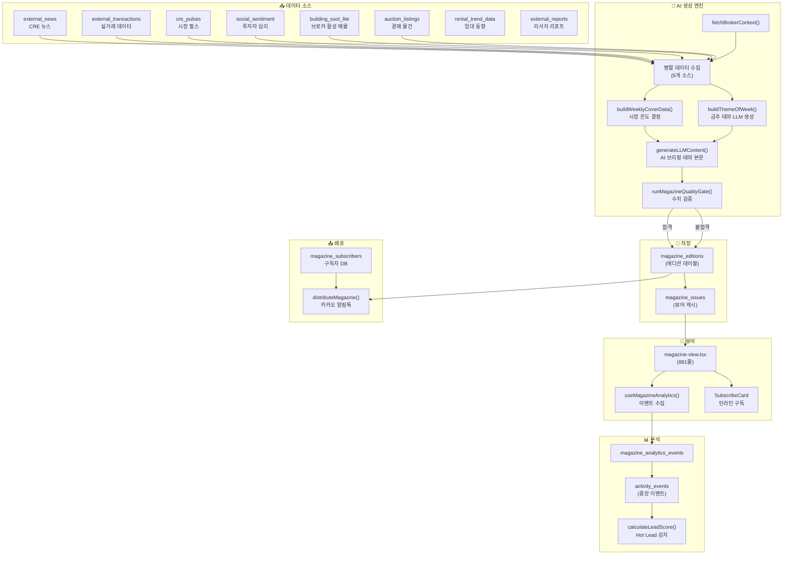
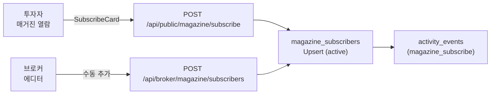
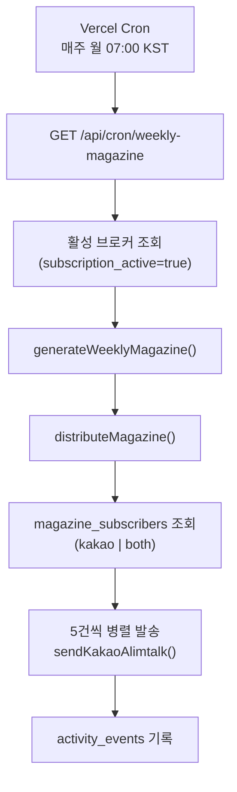

# 모바일 매거진 시스템 — 아키텍처 · 기능 명세 · 사용자 가이드

> **문서 버전**: 1.0  
> **작성일**: 2026-07-25  
> **대상 시스템**: `src/domain/magazine/` (5개 도메인 모듈) + 14개 API Route + 881줄 뷰어 + 1,550줄 에디터  
> **감사 범위**: AI 생성 엔진, 품질 게이트, 구독·배포·분석 파이프라인, 에디터·뷰어 UI, Hot Lead 연동 전체

---

## 목차

1. [시스템 개요](#1-시스템-개요)
2. [아키텍처 총괄](#2-아키텍처-총괄)
3. [도메인 모듈 상세](#3-도메인-모듈-상세)
4. [API 명세](#4-api-명세)
5. [뷰어 UI 명세](#5-뷰어-ui-명세-magazine-view)
6. [에디터 UI 명세](#6-에디터-ui-명세-magazine-editor)
7. [분석 및 리드 스코어링](#7-분석-및-리드-스코어링)
8. [구독·배포 시스템](#8-구독배포-시스템)
9. [데이터 스키마](#9-데이터-스키마)
10. [사용자 가이드 — 브로커](#10-사용자-가이드--브로커)
11. [사용자 가이드 — 투자자(독자)](#11-사용자-가이드--투자자독자)

---

## 1. 시스템 개요

### 1.1 제품 정의

**CRE 위클리 매거진**은 상업용 부동산 전문 중개인(브로커)이 투자자 고객에게 매주 자동 발행하는 **AI 개인화 시장 인텔리전스 뉴스레터**이다.

```
브로커의 핵심 문제:
  "매주 고객에게 보낼 전문적인 시장 리포트를 만들 시간이 없다"

매거진 시스템의 해결 방안:
  ① AI가 시장 데이터·뉴스·매물 정보를 자동 수집
  ② 브로커의 전문 권역·자산유형에 맞게 개인화
  ③ 브로커의 현장 노트 5필드를 추가
  ④ 품질 검증 후 구독자에게 카카오 알림톡 자동 배포
```

### 1.2 핵심 가치 제안

| 대상 | 가치 |
|------|------|
| **브로커** | 매주 5분 투자로 전문 매거진 발행 → 고객 신뢰 구축 + 리드 유입 |
| **투자자** | 브로커의 현장 인사이트 + AI 시장 분석을 한 번에 열람 |
| **플랫폼** | 매거진 열람 → IM 클릭 → 문의 전환 → Hot Lead 자동 감지 |

### 1.3 에디션 유형

| 유형 | 주기 | 현재 상태 |
|------|------|----------|
| `weekly` | 매주 월요일 KST 07:00 | ✅ 기본 활성 |
| `daily` | 매일 (비활성) | 🔲 미활성 |
| `monthly` | 월간 (확장 예정) | 🔲 미활성 |
| `special` | 특별호 (수동) | 🔲 미활성 |

---

## 2. 아키텍처 총괄

### 2.1 전체 데이터 흐름



### 2.2 모듈 구조

| # | 경로 | 크기 | 역할 |
|---|------|------|------|
| 1 | `domain/magazine/weekly-generator.ts` | 19.0KB | **메인 AI 생성 엔진** — 주간 매거진 자동 생성 |
| 2 | `domain/magazine/quality-gate.ts` | 10.3KB | 수치 클레임 추출 + 소스 대비 검증 |
| 3 | `domain/magazine/types.ts` | 8.0KB | 도메인 타입 정의 (에디션·섹션·분석·온도) |
| 4 | `domain/magazine/distribute-magazine.ts` | 3.8KB | 카카오 알림톡 일괄 배포 |
| 5 | `domain/magazine/im-to-magazine-bridge.ts` | 2.0KB | IM→매거진 딜 스니펫 자동 추출 |

| # | UI | 크기 | 역할 |
|---|------|------|------|
| 6 | `(public)/magazine/[brokerId]/[date]/magazine-view.tsx` | 49.5KB | **공개 뷰어** (881줄, 11개 섹션) |
| 7 | `(broker)/broker/magazine-editor/page.tsx` | 65.8KB | **에디터** (1,550줄, 8개 탭) |
| 8 | `components/magazine/SubscribeCard.tsx` | 3.8KB | 인라인 구독 폼 |
| 9 | `hooks/use-magazine-analytics.ts` | 2.8KB | 클라이언트 분석 수집 |
| 10 | `components/dashboard/MagazineInsightCard.tsx` | 2.0KB | 대시보드 성과 카드 |

---

## 3. 도메인 모듈 상세

### 3.1 주간 매거진 생성 엔진 (`weekly-generator.ts`)

#### 생성 파이프라인 8단계

```
Step 1: fetchBrokerContext()
  └─ broker_profiles + profiles + 활성 매물 건수

Step 2: 병렬 데이터 수집
  ├─ fetchWeekPulse()       → cre_pulses (시장 펄스 점수)
  ├─ fetchWeekNews()        → external_news (중요도순 10건)
  ├─ fetchWeekTransactions() → external_transactions (최신 10건)
  ├─ fetchActiveDeals()     → building_ssot_lite (활성 매물 10건)
  └─ fetchSentimentData()   → social_sentiment (최신 5건)

Step 3: buildWeeklyCoverData()
  └─ 펄스 스코어 + 센티먼트 → 시장 온도 결정 + 커버 키워드 3개

Step 4: buildThemeOfWeek()
  └─ LLM: 뉴스 × 매물 교차 분석 → 테마 제목·본문·관련 매물 ID

Step 5: generateLLMContent()
  └─ LLM: 브로커 개인화 AI 브리핑 + 테마 본문

Step 6: contentPayload 조합
  └─ 브로커 프로필 + 뉴스 + 거래 + 심리 + 매물 + 테마

Step 6.5: runMagazineQualityGate()
  └─ 수치 클레임 추출 → 소스 대조 → 합격/불합격

Step 7: magazine_editions Upsert
  └─ onConflict: broker_id + edition_type + edition_label

Step 8: magazine_issues 듀얼 쓰기
  └─ 공개 뷰어 호환 (non-blocking)
```

#### 시장 온도 결정 로직

| 펄스/심리 점수 | 시장 온도 | 이모지 | 색상 |
|---------------|-----------|--------|------|
| ≥ 80 | 적극 매수 | 🔥 | `#ef4444` |
| 65 ~ 79 | 선별 매수 | 📈 | `#f59e0b` |
| 45 ~ 64 | 관망 | ⏸️ | `#6b7280` |
| 25 ~ 44 | 조정 대기 | 📉 | `#3b82f6` |
| < 25 | 위기 경계 | 🚨 | `#dc2626` |

#### LLM 프롬프트 전략

| 목적 | 모델 | 온도 | 출력 형식 |
|------|------|------|-----------|
| 금주 테마 생성 | GPT-5.4 | 0.7 | JSON (`themeTitle`, `themeBodyMd`, `matchedDealIds`) |
| AI 브리핑 본문 | GPT-5.4 | 0.7 | JSON (`ai_briefing`, `theme_title`, `theme_body_md`) |
| 데일리 브리핑 | GPT-5.4 | 0.7 | JSON (`headline`, `briefing`) |

**Fail-safe**: 모든 LLM 호출에 `try/catch`로 래핑되어, 실패 시 뉴스 요약 기반 폴백 텍스트를 자동 생성.

### 3.2 품질 게이트 (`quality-gate.ts`)

AI 생성 매거진 본문의 **수치적 정확성**을 검증하는 자동화된 팩트체크 엔진:

#### 검증 파이프라인

```
본문 마크다운
  │
  ▼
extractNumericClaims()
  │ 정규식: /(\d[\d,.]+)\s*(％|%|억|만원|만|평|㎡|건|호|층|세대|조)/g
  │ → NumericClaim[] (값, 단위, 주변 컨텍스트)
  │
  ▼
flattenSourceNumbers()
  │ 소스 데이터(뉴스, 거래 등) JSONB 재귀 탐색
  │ → Map<string, number>
  │
  ▼
validateAgainstSource()
  │ 각 클레임의 가장 가까운 소스 값 매칭
  │ → 편차 계산 → 단위별 허용 범위 대비 판정
  │
  ▼
runMagazineQualityGate()
  │ 불일치율 > 20% → 불합격 (needs_review)
  │ 점수 = 일치율 × 80 + 20 − 패널티
  └─→ QualityGateResult { passed, score, issues[] }
```

#### 단위별 허용 편차

| 단위 | 허용 편차 | 비교 방식 |
|------|-----------|-----------|
| `%` | ±2 포인트 | 상대 |
| `억`, `만원`, `만`, `조` | ±5% | 상대 |
| `평`, `㎡` | ±3% | 상대 |
| `건`, `호`, `층`, `세대` | 정확 일치 | 절대 |

#### 불합격 처리

```typescript
if (!qgResult.passed) {
  editionRow.status = 'needs_review';  // draft 대신 needs_review
  console.warn(`QG 불합격 (score: ${qgResult.score}):`, qgResult.issues);
}
```

### 3.3 배포 엔진 (`distribute-magazine.ts`)

카카오 알림톡을 통한 구독자 일괄 발송:

```
1. 활성 구독자 조회 (channel: kakao | both)
2. 브로커 이름 조회
3. 5건씩 병렬 발송 (Promise.allSettled)
   └─ sendKakaoAlimtalk({
        templateId: 'TPL_MAGAZINE_NEW_ISSUE',
        variables: { subscriberName, brokerName, magazineTitle, headline, magazineUrl }
      })
4. activity_events에 배포 이력 기록
```

### 3.4 IM→매거진 브릿지 (`im-to-magazine-bridge.ts`)

IM(투자설명서) 생성 시 **매물 스니펫을 자동 추출**하여 매거진의 "주목 매물" 섹션에 연계:

```typescript
interface DealSnippet {
  buildingId: string;
  blindName: string;          // "성수 · 꼬마빌딩" (지역·유형 기반 블라인드)
  investmentPoint: string;    // heroCard.keyInvestmentPoint
  assetType: string;
  priceBand: string;
  photoUrl: string | null;
  imUrl: string;              // /im-lite/{buildingId}
}
```

Supabase RPC `append_magazine_deal_snippet`을 호출하여 브로커의 매거진 콘텐츠 풀에 자동 추가.

---

## 4. API 명세

### 4.1 매거진 생성·조회 API

| Method | 경로 | 인증 | 설명 |
|--------|------|------|------|
| `GET` | `/api/magazine/[brokerId]` | ❌ | 브로커 매거진 실시간 생성 (캐시 우선) |
| `POST` | `/api/magazine/[brokerId]` | ❌ | 매거진 콘텐츠 수동 저장 |

**GET 흐름**: 캐시 확인 → 없으면 브로커 프로필 조회 → 병렬 데이터 수집 → AI 브리핑 → 조합 → `magazine_issues`에 캐싱 → 응답.

### 4.2 에디션 관리 API

| Method | 경로 | 인증 | 설명 |
|--------|------|------|------|
| `GET` | `/api/magazine/editions` | ❌ | 에디션 목록 조회 (broker_id 필수) |
| `POST` | `/api/magazine/editions` | ✅ | 새 에디션 생성 (weekly-generator 호출) |
| `PATCH` | `/api/magazine/editions` | ✅ | 에디션 부분 수정 (제목, 현장 노트, 상태 등) |

**PATCH 허용 필드**: `title`, `field_note`, `theme_title`, `theme_body_md`, `content`, `status`, `market_temp`, `cover_keywords`, `featured_deal_ids`, `cover_image_url`, `theme_color`

> `status`를 `published`로 변경 시 `published_at` 자동 설정.

### 4.3 Cron (자동 생성)

| Method | 경로 | 인증 | 설명 |
|--------|------|------|------|
| `GET` | `/api/cron/weekly-magazine` | Bearer (CRON_SECRET) | 매주 월요일 KST 07:00 자동 실행 |

**Cron 흐름**:
1. `subscription_active = true`인 모든 브로커 조회
2. 각 브로커별 `generateWeeklyMagazine()` 호출
3. 생성 후 `distributeMagazine()` → 구독자 알림톡 발송
4. 결과 요약 JSON 반환 (성공/실패 건수, 소요 시간)

### 4.4 구독 관리 API

| Method | 경로 | 인증 | 설명 |
|--------|------|------|------|
| `POST` | `/api/public/magazine/subscribe` | ❌ | 공개 구독 신청 (전화번호 기반) |
| `GET` | `/api/public/magazine/unsubscribe?token=` | ❌ | 수신 거부 확인 폼 (HTML) |
| `POST` | `/api/public/magazine/unsubscribe` | ❌ | 수신 거부 처리 (HMAC 토큰 검증) |
| `GET` | `/api/broker/magazine/subscribers` | ✅ | 내 구독자 목록 조회 (상태·채널 필터) |
| `POST` | `/api/broker/magazine/subscribers` | ✅ | 구독자 수동 추가 |
| `PATCH` | `/api/broker/magazine/subscribers/[id]` | ✅ | 구독자 상태 변경 (active/paused/unsubscribed) |
| `DELETE` | `/api/broker/magazine/subscribers/[id]` | ✅ | 구독자 하드 삭제 |

**수신 거부 토큰**: `subscriberId.brokerId.HMAC_SHA256(subscriberId+brokerId, SUPABASE_SERVICE_ROLE_KEY)` 형식으로, 무인증 환경에서도 안전한 구독 해지를 보장.

### 4.5 분석 API

| Method | 경로 | 인증 | 설명 |
|--------|------|------|------|
| `POST` | `/api/public/magazine/analytics` | ❌ | 열람 이벤트 수신 (sendBeacon) |
| `GET` | `/api/broker/magazine/analytics` | ✅ | 브로커 대시보드 성과 조회 |

### 4.6 OG 이미지 생성

| Method | 경로 | 인증 | 설명 |
|--------|------|------|------|
| `GET` | `/api/og/magazine?brokerId=&date=` | ❌ | 동적 OG 이미지 (1200×630) |

Next.js `ImageResponse`로 서버 사이드 렌더링되는 그래디언트 디자인의 OG 이미지 생성. 브로커명, 헤드라인, 핵심 지표 3개 포함.

---

## 5. 뷰어 UI 명세 (magazine-view)

### 5.1 섹션 구조

뷰어는 **6개 MVP 코어 섹션 + 5개 확장 섹션** 총 11개 섹션으로 구성:

#### MVP 코어 섹션 (항상 표시)

| # | 섹션 ID | 이름 | 아이콘 | 설명 |
|---|---------|------|--------|------|
| 1 | `cover` | 커버 | 📰 | 브로커 프로필 + 시장 온도 배지 + 커버 키워드 + 날짜 + 브로커 인용 |
| 2 | `ai_briefing` | AI 마켓 에디터 브리핑 | 🤖 | GPT-5.4 생성 주간 시장 분석 (헤드라인 + 본문) |
| 3 | `field_note` | 현장 노트 | 📝 | 브로커 직접 작성 5필드 (시장 요약, 매수/매도 반응, 판단, 한마디) |
| 4 | `theme_of_week` | 금주의 테마 | 🎯 | AI가 뉴스×매물 교차 분석하여 도출한 주간 테마 + 관련 매물 연결 |
| 5 | `featured_deals` | 주목 매물 | 🏢 | 브로커 활성 매물 수평 스크롤 카드 (사진, 자산유형, 가격, IM 링크) |
| 6 | `broker_profile` | 브로커 프로필 | 👤 | VibeCard 연동 프로필 카드 또는 폴백 심플 카드 |

#### 확장 섹션 (접이식, 데이터 존재 시 표시)

| # | 섹션 ID | 이름 | 아이콘 | 설명 |
|---|---------|------|--------|------|
| 7 | `market_data` | 시장 데이터 | 📊 | 최근 실거래 테이블 + 임대 동향 + 상권 분석 |
| 8 | `news_curation` | 뉴스 큐레이션 | 📋 | 주간 CRE 뉴스 6건 (센티먼트 도트 + 출처) |
| 9 | `auction_picks` | 경매 픽 | 🔨 | 주목할 경매 물건 (감정가 대비 할인율 바) |
| 10 | `reports` | 리포트 | 📄 | 기관 리서치 리포트 요약 |
| 11 | `sentiment_index` | CRE 심리 지수 | 🌡️ | 투자자 심리 0~100 게이지 바 |

#### 인라인 CTA

| 섹션 위치 | CTA 유형 | 설명 |
|-----------|---------|------|
| MVP 섹션 사이 | `SubscribeCard` | 카카오톡 구독 폼 (전화번호 + 이름) |
| 하단 고정 바 | 전화 상담 + IM 열람 신청 + 공유 | 항상 표시 |

### 5.2 타겟 세그먼트 기반 섹션 순서

URL에 `?target=buyer|seller` 파라미터를 추가하면 독자 유형에 맞게 **섹션 표시 순서가 자동 변경**:

| 타겟 | 우선 노출 | 후순위 |
|------|-----------|--------|
| `buyer` | AI 브리핑 → 현장 노트 → 주목 매물 → 테마 | 시장 데이터, 뉴스, 경매 |
| `seller` | AI 브리핑 → 현장 노트 → 시장 데이터 → 심리지수 → 매물 | 뉴스, 경매 |
| `all` (기본) | AI 브리핑 → 현장 노트 → 테마 → 매물 | 시장 데이터, 뉴스, 경매, 리포트, 심리 |

### 5.3 데이터 배지 시스템

뷰어 내 각 섹션에 데이터 출처 배지가 표시:

| 배지 | 색상 | 의미 |
|------|------|------|
| 🟣 AI 분석 | 바이올렛 | LLM 생성 콘텐츠 |
| 🔵 공공데이터 | 스카이 | 정부·기관 데이터 기반 |
| 🟢 실시간 | 에메랄드 | 실시간 수집 데이터 |

### 5.4 공유 기능

3단계 폴백 공유 메커니즘:

```
1. 카카오 SDK 공유 (Kakao.Share.sendDefault) — 피드 카드 형태
   ↓ 실패 시
2. Web Share API (navigator.share)
   ↓ 미지원 시
3. 클립보드 복사 (navigator.clipboard.writeText)
```

### 5.5 SEO 최적화

| 항목 | 구현 |
|------|------|
| `<title>` | `[날짜] {브로커명}의 CRE 데일리 매거진 | {전문 권역}` |
| `og:type` | `article` |
| `og:image` | `/api/og/magazine?brokerId=&date=` (동적 생성) |
| `twitter:card` | `summary_large_image` |
| `keywords` | 꼬마빌딩 매거진, CRE 데일리, 부동산 시장 브리핑, 브로커명, 전문 권역 |
| `revalidate` | 1800초 (30분 ISR) |

### 5.6 모션·애니메이션

| 요소 | 효과 | 라이브러리 |
|------|------|-----------|
| 섹션 등장 | `opacity: 0→1, y: 20→0` (IntersectionObserver) | Framer Motion (`motion/react`) |
| 커버 | 스케일 애니메이션 + 글로우 배경 | Motion |
| 심리 게이지 바 | 너비 0→N% 슬라이딩 | Motion |
| 시장 온도 배지 | 스케일 바운스 | Motion |
| 모든 섹션 | staggered delay (0.05 ~ 0.35초) | Motion |

---

## 6. 에디터 UI 명세 (magazine-editor)

### 6.1 8개 편집 탭

| # | 탭 키 | 탭 이름 | 아이콘 | 기능 |
|---|-------|--------|--------|------|
| 1 | `cover` | 커버 | 📰 | 헤드라인, AI 브리핑, 시장 온도 선택, 커버 키워드 3개, 커버 이미지 |
| 2 | `field_note` | 필드노트 | ✍️ | 브로커 현장 5필드 입력 (가이드 툴팁 포함) |
| 3 | `theme_deals` | 테마&매물 | 🎯 | 금주의 테마 제목·본문 편집 + 활성 매물 선택 |
| 4 | `news` | 뉴스 | 📖 | 뉴스 큐레이션 패널 (NewsCurationPanel) |
| 5 | `ai_assist` | AI비서 | 🪄 | AI 어시스턴트 탭 (EditorAiAssistTab) |
| 6 | `outreach` | 아웃리치 | 👥 | 구독자 관리·아웃리치 탭 (EditorOutreachTab) |
| 7 | `publish` | 발행설정 | ⚙️ | 테마 색상, 매거진 제목, 미리보기, 발행/예약 |
| 8 | `analytics` | 성과 | 📊 | 에디션 이력, 열람 통계, 구독자 수, 배포 이력 |

### 6.2 브로커 현장 노트 5필드

| # | 필드 키 | 라벨 | 플레이스홀더 |
|---|---------|------|-------------|
| 1 | `question` | 주간 시장 요약 | "이번 주 시장을 한 문장으로 요약하면?" |
| 2 | `buyerReaction` | 매수자 반응 | "이번 주 매수자들의 반응은?" |
| 3 | `sellerReaction` | 매도자 반응 | "이번 주 매도자들의 반응은?" |
| 4 | `marketJudgment` | 시장 판단 | "본인의 시장 판단은?" |
| 5 | `comment` | 독자에게 한마디 | "독자(투자자)에게 한마디" |

> 각 필드에 가이드 툴팁이 제공되어 브로커가 무엇을 작성할지 명확하게 안내.

### 6.3 에디터 상태 관리

| 상태 | 설명 |
|------|------|
| `draft` | AI 생성 직후 기본 상태 (수정 가능) |
| `editing` | 브로커가 편집 중 |
| `review` | 내부 검토 대기 |
| `needs_review` | 품질 게이트 불합격 → 수동 확인 필요 |
| `scheduled` | 발행 예약됨 |
| `published` | 발행 완료 |
| `archived` | 보관 처리 |

### 6.4 자동 저장

에디터는 콘텐츠 변경 시 자동 저장 타이머(`autoSaveTimerRef`)로 PATCH API를 호출하여 draft를 자동 유지.

### 6.5 실시간 미리보기

에디터 하단에 `<MagazineView>` 컴포넌트를 직접 렌더링하여 편집 내용의 실시간 모바일 프리뷰를 제공.

---

## 7. 분석 및 리드 스코어링

### 7.1 클라이언트 이벤트 수집 (`use-magazine-analytics`)

| 이벤트 타입 | 트리거 | 수집 데이터 |
|------------|--------|------------|
| `page_view` | 페이지 최초 로드 | edition_id, visitor_id |
| `section_view` | 섹션이 뷰포트에 30% 이상 노출 | section_id |
| `click` | 매물·IM 링크 클릭 | target_url, target_param |
| `scroll_depth` | 25% / 50% / 75% / 100% 스크롤 도달 | scroll_pct |
| `dwell` | 페이지 이탈 (`beforeunload`) | dwell_seconds |

**전송 방식**: `navigator.sendBeacon()` — 페이지 이탈 시에도 안정적으로 전송.

**방문자 식별**: `btoa(UA + 화면해상도).slice(0, 32)` — 익명 핑거프린트.

### 7.2 서버 측 분석 파이프라인

```
POST /api/public/magazine/analytics
  │
  ├─ magazine_analytics_events INSERT (1차 로그)
  │
  ├─ 이벤트 매핑:
  │   page_view          → magazine_view (activity_events)
  │   dwell ≥ 30초        → magazine_view
  │   click(im-lite)      → magazine_to_im_click
  │   click(vibe-card)    → magazine_to_vibe_click
  │
  ├─ activity_events INSERT (중앙 이벤트)
  │
  └─ 비동기 Hot Lead 감지:
      calculateLeadScore(brokerId, visitorId)
        → isHotLead === true
          → checkAndSendHotLeadAlert() → 브로커 알림
```

### 7.3 브로커 대시보드 분석 지표

| 지표 | 산출 방식 |
|------|-----------|
| **구독자 수** | `magazine_subscribers` (status: active) |
| **총 열람수** | 최근 30일 `page_view` 이벤트 카운트 |
| **고유 방문자** | `visitor_id` 유니크 집합 크기 |
| **평균 체류 시간** | `dwell_seconds` 평균 |
| **완독률** | `scroll_depth=100` / `page_view` × 100 |
| **최근 배포** | `activity_events` (event_type: magazine_distributed) 최신 1건 |

---

## 8. 구독·배포 시스템

### 8.1 구독 흐름



### 8.2 배포 흐름



### 8.3 수신 거부 흐름

```
알림톡 내 수신거부 링크
  → GET /api/public/magazine/unsubscribe?token=XXX
    → HMAC 토큰 검증
    → 수신거부 확인 HTML 폼 렌더링
      → POST /api/public/magazine/unsubscribe
        → magazine_subscribers.status = 'unsubscribed'
        → activity_events 기록
        → 완료 HTML 응답
```

### 8.4 구독자 관리

| 구독 상태 | 설명 |
|-----------|------|
| `active` | 발송 대상 |
| `paused` | 일시 중지 (재활성 가능) |
| `unsubscribed` | 수신 거부 (재구독 가능) |

| 구독 채널 | 설명 |
|-----------|------|
| `kakao` | 카카오 알림톡만 |
| `email` | 이메일만 |
| `both` | 카카오 + 이메일 |

| 구독 소스 | 설명 |
|-----------|------|
| `magazine` | 매거진 뷰어 내 구독 카드 |
| `vibe_card` | Vibe 명함 페이지에서 구독 |
| `im` | IM(투자설명서) 페이지에서 구독 |
| `manual` | 브로커가 수동 추가 |

---

## 9. 데이터 스키마

### 9.1 magazine_editions

```
magazine_editions
├── id                   UUID (PK)
├── broker_id            TEXT (FK → broker_profiles.slug)
├── edition_type         TEXT ('daily' | 'weekly' | 'monthly' | 'special')
├── edition_label        TEXT ('W28-2026')
├── title                TEXT
├── market_temp          TEXT (시장 온도)
├── cover_keywords       TEXT[]
├── cover_image_url      TEXT
├── field_note           JSONB (5필드)
├── theme_title          TEXT
├── theme_body_md        TEXT
├── theme_asset_types    TEXT[]
├── content              JSONB (전체 매거진 데이터)
├── oiticle_ids          TEXT[]
├── featured_deal_ids    TEXT[]
├── target_segments      TEXT[]
├── status               TEXT (EditionStatus)
├── scheduled_at         TIMESTAMPTZ
├── published_at         TIMESTAMPTZ
├── view_count           INT (default 0)
├── share_count          INT (default 0)
├── theme_color          TEXT (default '#6366f1')
├── version              INT (default 1)
├── created_at           TIMESTAMPTZ
└── updated_at           TIMESTAMPTZ

UNIQUE: (broker_id, edition_type, edition_label)
```

### 9.2 magazine_issues

```
magazine_issues (뷰어 캐시)
├── broker_id            TEXT (PK, part)
├── issue_date           DATE (PK, part)
└── content              JSONB

UNIQUE: (broker_id, issue_date)
```

### 9.3 magazine_subscribers

```
magazine_subscribers
├── id                   UUID (PK)
├── broker_id            UUID (FK → profiles.id)
├── subscriber_phone     TEXT
├── subscriber_name      TEXT
├── subscriber_email     TEXT
├── channel              TEXT ('kakao' | 'email' | 'both')
├── status               TEXT ('active' | 'paused' | 'unsubscribed')
├── source               TEXT ('magazine' | 'vibe_card' | 'im' | 'manual')
├── subscribed_at        TIMESTAMPTZ
└── unsubscribed_at      TIMESTAMPTZ

UNIQUE: (broker_id, subscriber_phone)
```

### 9.4 magazine_analytics_events

```
magazine_analytics_events
├── id                   UUID (PK)
├── edition_id           TEXT
├── visitor_id           TEXT
├── event_type           TEXT ('page_view' | 'section_view' | 'click' | 'scroll_depth' | 'dwell')
├── section_id           TEXT
├── target_url           TEXT
├── target_param         TEXT
├── dwell_seconds        INT
├── scroll_pct           INT
├── metadata             JSONB
└── created_at           TIMESTAMPTZ
```

---

## 10. 사용자 가이드 — 브로커

### 10.1 시작하기

1. **브로커 대시보드** → 좌측 메뉴 "매거진 에디터" 또는 대시보드 "내 매거진 성과" 카드 클릭
2. 첫 접속 시 **AI가 자동으로 이번 주 매거진 초안을 생성**합니다
3. 생성된 초안을 확인하고, 필요한 부분만 수정하세요

### 10.2 매주 발행 워크플로

```
월요일 아침
  ①  에디터 접속 → AI 초안 확인
  ②  "필드노트" 탭에서 5필드 현장 노트 작성 (5분)
  ③  "커버" 탭에서 시장 온도·키워드 확인/수정
  ④  "테마&매물" 탭에서 주목 매물 선택
  ⑤  "발행설정" 탭에서 미리보기 확인 → "발행" 클릭
  → 활성 구독자에게 카카오 알림톡 자동 발송
```

### 10.3 현장 노트 작성 가이드

| 필드 | 작성 팁 | 예시 |
|------|---------|------|
| **주간 시장 요약** | 핵심을 한 문장으로 | "이번 주 강남 꼬마빌딩 시장은 급매 소진 후 관망세로 전환" |
| **매수자 반응** | 구체적 수치 포함 | "문의 12건 중 50억 이하 꼬마빌딩 집중, 3건 현장 방문 진행" |
| **매도자 반응** | 호가 변화 언급 | "호가 5% 내린 매물 2건 새로 등장, 급매 1건 2주 만에 소진" |
| **시장 판단** | 방향성 제시 | "단기 조정 국면이지만 입지 좋은 매물은 빠르게 소화될 전망" |
| **독자에게 한마디** | 소구력 있게 | "지금이 좋은 입지의 급매를 선점할 기회입니다. 문의 주세요!" |

### 10.4 구독자 관리

- **에디터 > 아웃리치 탭**: 구독자 목록 확인, 수동 추가, 상태 변경
- **구독 유입 채널**: 매거진 뷰어 내 구독 카드, Vibe 명함, IM 페이지
- **배포 현황**: "성과" 탭에서 최근 발송 건수, 실패 건수 확인

### 10.5 성과 분석 활용

| 지표 | 활용 방법 |
|------|-----------|
| **열람수** | 낮으면 → 공유 채널 다양화 (SNS, 네이버 카페 등) |
| **완독률** | 낮으면 → 본문 길이 축소 또는 핵심 정보 상단 배치 |
| **체류 시간** | 높으면 → 콘텐츠 품질 양호, 리포트 섹션 확대 검토 |
| **구독자 수** | 매거진 + Vibe 명함 + IM 페이지에서 자연 유입 |

---

## 11. 사용자 가이드 — 투자자(독자)

### 11.1 매거진 열람 방법

1. **카카오 알림톡** 수신 → 링크 클릭
2. 또는 브라우저에서 직접 접속: `credeal.net/magazine/{브로커ID}/{날짜}`
3. 모바일에 최적화된 매거진 페이지가 표시됩니다

### 11.2 매거진 구성 (독자 관점)

```
📱 모바일 화면

┌─────────────────────────┐
│  🔥 선별 매수 | # 키워드  │  ← 시장 온도 + 커버
│  CRE 위클리 매거진        │
│  "브로커의 한마디"         │
├─────────────────────────┤
│  🤖 AI 마켓 에디터 브리핑  │  ← AI 분석
│  (헤드라인 + 본문)        │
├─────────────────────────┤
│  📝 브로커 현장 노트       │  ← 현장 인사이트
│  (시장/매수/매도/판단/한마디)│
├─────────────────────────┤
│  🎯 금주의 테마            │  ← 심층 분석
│  + 테마 관련 매물 링크     │
├─────────────────────────┤
│  🏢 주목 매물 (수평 스크롤) │  ← 매물 하이라이트
│  [투자설명서] [상세 정보]  │
├─────────────────────────┤
│  📰 주간 매거진 구독하기   │  ← 구독 CTA
├─────────────────────────┤
│  👤 브로커 프로필          │  ← Vibe 명함 연동
├─────────────────────────┤
│  📊 시장 데이터 (접이식)   │  ← 실거래 + 임대 동향
│  📋 뉴스 큐레이션 (접이식) │
│  🔨 경매 픽 (접이식)      │
│  📄 리포트 (접이식)       │
│  🌡️ 심리 지수 (접이식)    │
├─────────────────────────┤
│  ☎ 전화상담 | 📄 IM신청 | 공유 │  ← 하단 고정 바
└─────────────────────────┘
```

### 11.3 주요 액션

| 액션 | 방법 |
|------|------|
| **전화 상담** | 하단 바 "전화 상담" 버튼 (원터치 전화 연결) |
| **투자설명서 열람** | 매물 카드 "📄 투자설명서" 버튼 → IM 페이지 이동 |
| **구독 신청** | 매거진 중간 구독 카드에서 전화번호 입력 → 매주 월요일 알림톡 수신 |
| **카카오 공유** | 하단 바 "공유" 버튼 → 카카오 피드 카드 전송 |
| **수신 거부** | 알림톡 내 수신 거부 링크 클릭 → 확인 후 해지 |

### 11.4 구독 혜택

- 매주 월요일 아침 **AI 시장 분석 + 브로커 현장 인사이트** 카카오톡 수신
- 브로커 전문 권역에 맞춘 **개인화된 매물 하이라이트**
- 실거래·공실률·심리지수 등 **데이터 기반 시장 리포트**
- 주목할 **경매 물건** 추천

---

## 부록: 파일 참조 맵

### 도메인 모듈
| 파일 | 경로 |
|------|------|
| 주간 생성기 | [`weekly-generator.ts`](file:///c:/Users/User/cre-dealcard/src/domain/magazine/weekly-generator.ts) |
| 품질 게이트 | [`quality-gate.ts`](file:///c:/Users/User/cre-dealcard/src/domain/magazine/quality-gate.ts) |
| 타입 정의 | [`types.ts`](file:///c:/Users/User/cre-dealcard/src/domain/magazine/types.ts) |
| 배포 엔진 | [`distribute-magazine.ts`](file:///c:/Users/User/cre-dealcard/src/domain/magazine/distribute-magazine.ts) |
| IM 브릿지 | [`im-to-magazine-bridge.ts`](file:///c:/Users/User/cre-dealcard/src/domain/magazine/im-to-magazine-bridge.ts) |

### 뷰어·에디터
| 파일 | 경로 |
|------|------|
| 뷰어 페이지 | [`page.tsx`](file:///c:/Users/User/cre-dealcard/src/app/(public)/magazine/[brokerId]/[date]/page.tsx) |
| 뷰어 컴포넌트 | [`magazine-view.tsx`](file:///c:/Users/User/cre-dealcard/src/app/(public)/magazine/[brokerId]/[date]/magazine-view.tsx) |
| 에디터 | [`page.tsx`](file:///c:/Users/User/cre-dealcard/src/app/(broker)/broker/magazine-editor/page.tsx) |
| 구독 카드 | [`SubscribeCard.tsx`](file:///c:/Users/User/cre-dealcard/src/components/magazine/SubscribeCard.tsx) |
| 분석 훅 | [`use-magazine-analytics.ts`](file:///c:/Users/User/cre-dealcard/src/hooks/use-magazine-analytics.ts) |
| 대시보드 카드 | [`MagazineInsightCard.tsx`](file:///c:/Users/User/cre-dealcard/src/components/dashboard/MagazineInsightCard.tsx) |

### API 라우트
| 경로 | 메서드 |
|------|--------|
| [`/api/magazine/[brokerId]`](file:///c:/Users/User/cre-dealcard/src/app/api/magazine/[brokerId]/route.ts) | GET, POST |
| [`/api/magazine/editions`](file:///c:/Users/User/cre-dealcard/src/app/api/magazine/editions/route.ts) | GET, POST, PATCH |
| [`/api/cron/weekly-magazine`](file:///c:/Users/User/cre-dealcard/src/app/api/cron/weekly-magazine/route.ts) | GET |
| [`/api/broker/magazine/analytics`](file:///c:/Users/User/cre-dealcard/src/app/api/broker/magazine/analytics/route.ts) | GET |
| [`/api/broker/magazine/subscribers`](file:///c:/Users/User/cre-dealcard/src/app/api/broker/magazine/subscribers/route.ts) | GET, POST |
| [`/api/broker/magazine/subscribers/[id]`](file:///c:/Users/User/cre-dealcard/src/app/api/broker/magazine/subscribers/[id]/route.ts) | PATCH, DELETE |
| [`/api/public/magazine/subscribe`](file:///c:/Users/User/cre-dealcard/src/app/api/public/magazine/subscribe/route.ts) | POST |
| [`/api/public/magazine/unsubscribe`](file:///c:/Users/User/cre-dealcard/src/app/api/public/magazine/unsubscribe/route.ts) | GET, POST |
| [`/api/public/magazine/analytics`](file:///c:/Users/User/cre-dealcard/src/app/api/public/magazine/analytics/route.ts) | POST |
| [`/api/og/magazine`](file:///c:/Users/User/cre-dealcard/src/app/api/og/magazine/route.tsx) | GET |
