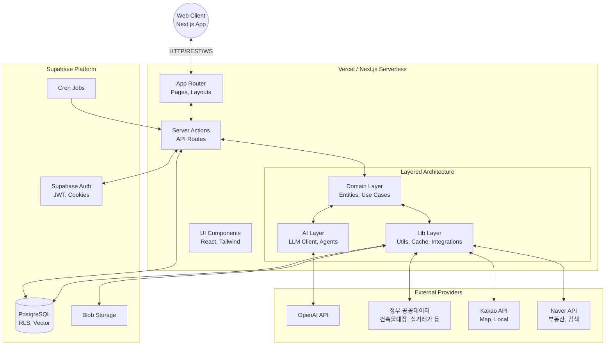
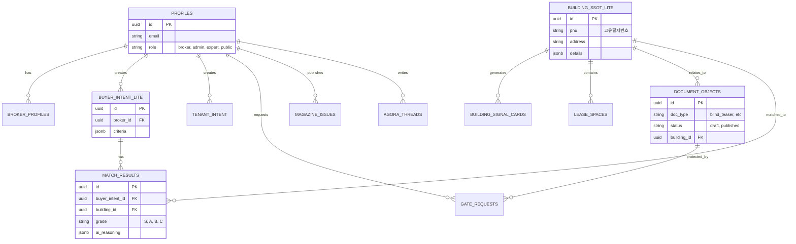

# CRE DealCard (cre-dealcard) 시스템 아키텍처 및 풀 오딧 보고서

> **"이 건물, 딜 될까? | JS Building SSoT"**
> 주소나 매물 메모 하나로 건물 딜카드를 만들어보세요. AI 기반 CRE 딜 어시스턴트.

## 1. 프로젝트 개요 (Executive Summary)

**CRE DealCard**는 한국의 상업용 부동산(CRE) 중개인들을 위해 설계된 AI 기반 딜 어시스턴트 플랫폼입니다. 이 시스템은 중개인이 단편적인 메모나 주소만으로도 전문적인 '딜카드(DealCard)'를 생성하고, 매수 의향서 관리, 매칭, 부동산 시장 분석 및 마케팅 자료(매거진, IM 등) 생성까지 전체 파이프라인을 자동화하고 지원하는 것을 목표로 합니다.

본 문서는 CRE DealCard 플랫폼의 최신 시스템 아키텍처, 기술 스택, 도메인 모델, 데이터베이스 스키마 및 외부 API 통합 등 시스템의 전반적인 기술적 구조를 상세하게 설명하는 종합 감사(Full Audit) 보고서입니다.

---

## 2. 기술 스택 (Technology Stack)

본 시스템은 최신 프론트엔드 프레임워크인 Next.js 16과 React 19를 기반으로 구축되었으며, 백엔드 및 데이터베이스로 Supabase를 채택한 Full-stack TypeScript 애플리케이션입니다.

| 분류 | 기술 및 프레임워크 | 버전/상세 |
|---|---|---|
| **Framework / Core** | Next.js (App Router) | 16.2.6 |
| | React | 19.2.4 |
| | TypeScript | 5.x+ |
| **Styling & UI** | TailwindCSS | v4 (with PostCSS, tailwind-merge) |
| | Motion (Framer Motion) | 12.40.0 |
| | Lucide React | 1.17.0 |
| | next-themes | 0.4.6 |
| **BaaS / Backend** | Supabase | @supabase/supabase-js 2.105.4, @supabase/ssr 0.10.3 |
| **AI / LLM** | Vercel AI SDK | ai 6.0.208, @ai-sdk/openai 3.0.73 |
| | OpenAI | 6.37.0 |
| **Data Viz & Export** | Recharts | 3.8.1 |
| | jspdf / html2canvas | 4.2.1 / 1.4.1 |
| | xlsx / papaparse | 0.18.5 / 5.5.4 |
| | jszip / qrcode | 3.10.1 / 1.5.4 |
| **Validation** | Zod | 4.4.3 |
| **Testing** | Vitest / Playwright | 4.1.5 / 1.60.0 |
| **Design System** | Fonts | Geist, Geist_Mono (Google Fonts) |
| | Theme | Dark mode default (ThemeProvider) |
| **Deployment** | Vercel | Git push 기반 자동 배포 (Pro Plan) |

---

## 3. 시스템 아키텍처 다이어그램 (System Architecture Diagram)



---

## 4. 계층별 분석 (Layer-by-Layer Analysis)

시스템은 강력한 Domain-Driven Design(DDD) 원칙을 따라 설계되었으며, 역할과 책임이 명확히 분리된 계층 구조를 갖습니다.

### 4.1. App Router 계층 (`src/app/`)
Next.js 16의 App Router를 사용하여 라우팅과 렌더링을 처리합니다.

- **`(admin)`**: 시스템 관리자용 대시보드 및 관리 기능
- **`(auth)`**: 로그인, 회원가입, 비밀번호 재설정, 온보딩 등 인증 관련 플로우
- **`(broker)`**: **핵심 비즈니스 영역**. 로그인한 중개인 전용 공간 (총 23개 하위 라우트)
  - `buildings`, `buyer-intents`, `pipeline`, `deal-card`, `matching`, `magazine-editor` 등 중개업무 전반을 커버.
- **`(funding)`**: 크라우드펀딩 모듈
- **`(public)`**: 비로그인 사용자 및 일반 대중에게 노출되는 페이지 (총 23개 하위 라우트)
  - `agora`(커뮤니티), `explore`, `magazine`(공개 뷰어), `marketplace`, `dc`(딜카드 공개 뷰) 등.
- **`api/`**: 23개의 하위 모듈을 가진 API 엔드포인트 (`admin`, `broker`, `public`, `cron`, `og` 등)
- **`actions/`**: 클라이언트에서 직접 호출 가능한 Next.js Server Actions.

### 4.2. Domain 계층 (`src/domain/`)
시스템의 핵심 비즈니스 로직과 엔터티를 정의합니다. 오직 Domain 계층만이 핵심 객체를 생성할 수 있는 권한을 가집니다. 총 32개의 도메인으로 세분화되어 있습니다.

- **핵심 도메인**:
  - `building`: 건물 Single Source of Truth (SSoT) 관리를 위한 도메인 (신호 카드, 모바일 IM, 프롬프트 등 포함)
  - `buyer` / `buyer-intent`: 매수자 데이터 및 매수 의향서 정규화
  - `matching`: AI 기반 매수자-건물 매칭 엔진
  - `pipeline`: 딜 파이프라인 상태 머신
  - `magazine`: 매거진 생성 및 IM-to-magazine 브릿지
  - `vibe`: 7D 바이브 벡터 분석(warmth, energy, polish, authentic, heritage, futuristic, playful)
  - `gate/gates`: 민감 정보 공개를 제어하는 게이트 요청 관리 및 정보 공개 가드

### 4.3. AI 계층 (`src/ai/`)
LLM 연동 및 AI 에이전트를 관리하는 계층입니다. AI의 출력을 안정적으로 다루기 위해 Zod 스키마 검증을 강제합니다.

- **아키텍처**:
  - `llm-client.ts`: 통합 LLM 클라이언트 추상화
  - `run-ai.ts`: 모델 추상화 계층
  - `sanitizer/`: AI 입력 전 PII(개인식별정보) 비식별화 처리
- **에이전트 (총 18개)**:
  - `memo-router-agent`: 입력된 메모를 분석하여 딜/임대/문의 등으로 분류
  - `broker-deal-card`: 메모를 기반으로 블라인드 티저 생성
  - `matching` / `vibe-fit-agent`: 매칭 및 바이브 벡터 분석
  - `visual-classification-agent`: 건물/공간 사진 및 이미지 분류
  - `schedule-advisor`: 일정 최적화 어드바이저 등
- **AI 규칙**:
  - 모든 AI 호출은 타입이 지정된 입력 스키마 사용
  - 모든 AI 출력은 Zod로 검증 후 영속화
  - 프롬프트 버전 및 모델 버전과 함께 모든 AI 실행은 `ai_runs` 테이블에 기록됨
  - AI 생성 문서는 초기 상태가 'draft'로 지정됨
  - **제한사항**: 가격 권장, 투자 조언, 법률/세무/부채에 대한 확정적 결론 생성 금지
  - 공개/블라인드 출력은 반드시 `DisclosureGuardAgent`를 통과해야 함

### 4.4. Lib 계층 (`src/lib/`)
공통 유틸리티, 외부 연동, 캐싱 등을 담당합니다.

- `external/`: 13개의 외부 API 통합 로직 
- `supabase/`: Supabase 클라이언트 (server, service, browser 분리)
- `auth-guard.ts`: 역할(broker, admin, expert, public_user) 기반 인증 및 인가 가드
- `vibe/`: 32개의 사전 정의된 UI 템플릿과 7D 바이브 벡터 로직

### 4.5. Components 계층 (`src/components/`)
재사용 가능한 UI 컴포넌트들의 집합입니다. 31개의 디렉토리로 구성되어 있습니다.
(`admin`, `broker`, `cards`, `dashboard`, `ui`, `magazine-editor`, `pipeline` 등)

---

## 5. 데이터베이스 아키텍처 및 ERD

총 65개의 마이그레이션을 통해 관리되는 Supabase(PostgreSQL) 데이터베이스 구조입니다. 모든 테이블에는 Row Level Security(RLS)가 적용되어 보안을 유지합니다.

### 5.1. 주요 테이블 구조
- `profiles`: 사용자 프로필 및 역할 관리
- `building_ssot_lite`: 건물 메타데이터 및 코어 정보
- `document_objects`: 블라인드 티저, 바이어 메모 등 문서 저장소
- `match_results`: AI 매칭 결과 이력 (S/A/B/C 등급)
- `gate_requests`: 블라인드 정보에 대한 정보 공개 요청 관리
- `magazine_issues`: 매거진 발행 정보

### 5.2. 핵심 엔터티 ER Diagram



---

## 6. 외부 API 통합 맵 (External API Integrations)

정확한 부동산 정보 및 외부 연동을 위해 13개의 외부 모듈과 통합되어 있습니다. `external_data_cache` 테이블을 통해 30일 TTL 기반으로 캐싱하여 비용과 속도를 최적화합니다.

| 분류 | 모듈명 | 데이터 소스 | 목적 및 수집 데이터 |
|---|---|---|---|
| **정부 공공데이터** | `address-resolver` | 행정안전부 | 주소 검색 및 해석, PNU 매핑 |
| | `building-register-api` | 국토교통부 | 건축물대장 (연면적, 층수, 주용도) |
| | `land-price-api` | 국토교통부 | 공시지가 (㎡당 지가) |
| | `land-use-api` | LURIS | 토지이용규제 (용도지역, 건폐율/용적률) |
| | `real-transaction-api` | 국토교통부 | 실거래가 거래 내역 |
| | `registry-api` | 등기정보광장 | 소유권, 근저당 등 권리 분석용 |
| | `semas-commercial-api` | 소상공인시장진흥공단 | 상권 분석 및 주변 인구/매출 통계 |
| **지도 및 지역 정보** | `kakao-map-api` | 카카오 Local | POI, 좌표 변환, 인근 지하철역/버스 |
| | `kakao-static-map` | 카카오 Static Map | 리포트용 정적 지도 이미지 캡처 |
| **포털 연동** | `naver-realestate-api` | 네이버 부동산 | 실시간 호가 및 시세 정보 |
| | `naver-search` | 네이버 검색 | 건물/지역 관련 부동산 뉴스 크롤링 |
| **오케스트레이터** | `enrich-by-pnu` | 내부 로직 | PNU 기반 전체 공공데이터 병렬 수집 |
| | `external-data-orchestrator` | 내부 로직 | 주소 기반 복합 데이터 파이프라인 |

---

## 7. 인증 및 보안 모델 (Authentication & Security)

시스템은 부동산이라는 고가치/민감 정보를 다루므로 다중 계층의 강력한 보안 모델을 채택하고 있습니다.

1. **인증 메커니즘**:
   - Supabase Auth를 이용한 이메일/비밀번호 기반 인증
   - Bearer 토큰 및 HTTP-only 쿠키 기반 인증 병행 (서버 사이드 렌더링 지원)
2. **권한 인가 (RBAC)**:
   - 4단계 Role 부여: `broker`(중개인), `admin`(관리자), `expert`(전문가), `public_user`(일반유저)
   - `auth-guard.ts`를 통한 라우트 보호
3. **데이터베이스 보안**:
   - 모든 엔터티 테이블에 Row-Level Security(RLS) 정책 적용
   - 사용자 본인이 소유한 데이터나 명시적으로 권한을 부여받은 데이터만 조회/수정 가능
4. **AI 및 정보 보호**:
   - **PII 비식별화**: AI에게 프롬프트 전송 전 `sanitizer`를 거쳐 고객의 이름, 연락처 등 민감정보 제거
   - **Gate/Disclosure 시스템**: `gate_requests`를 통해 블라인드 처리된 정보(상세 주소, 임대인 연락처 등)를 요청하고 승인받아야만 열람 가능 (NDA 연계)

---

## 8. 배포 아키텍처 (Deployment Architecture)

Vercel 기반의 Serverless 아키텍처를 사용하여 빠르고 안정적인 배포 파이프라인을 구축했습니다.

- **CI/CD 파이프라인**: 
  - Github `main` 브랜치 푸시 시 Vercel 자동 배포 발동
  - Pre-deploy 단계에서 `npm run build`를 실행하여 TypeScript 타입 에러 및 빌드 무결성 검증
- **플랜 및 인프라**:
  - Vercel Pro Plan 적용
  - 비동기 IM(Investment Memorandum) 문서 생성, PDF 렌더링, 일괄 데이터 수집 등 무거운 AI/문서 작업의 타임아웃을 방지하기 위해 `maxDuration: 300s` 구성
- **SEO 및 최적화**:
  - `robots.ts`, `sitemap.ts` 동적 생성
  - 전역 `globals.css` 및 `schema-org.ts`를 통한 시맨틱 메타데이터 주입

---

## 9. 파일 참조 맵 (File Reference Map)

핵심 동작을 파악하기 위한 주요 파일 매핑 가이드입니다.

```text
src/
├── app/
│   ├── (broker)/broker/pipeline/page.tsx     # 딜 파이프라인 뷰
│   ├── (broker)/broker/matching/page.tsx     # AI 매칭 결과 뷰
│   ├── api/broker/deal-card/route.ts         # 딜카드 생성 엔드포인트
│   └── api/full-im-handoffs/route.ts         # Full IM 비동기 생성 웹훅
├── domain/
│   ├── matching/index.ts                     # 매칭 코어 로직
│   ├── building/signal-card.ts               # 신호 카드 엔터티
│   └── gate/guard.ts                         # 정보 공개 제어
├── ai/
│   ├── llm-client.ts                         # 공통 LLM 인터페이스
│   ├── agents/broker-deal-card.ts            # 티저 생성 AI 에이전트
│   └── sanitizer/index.ts                    # PII 제거 유틸
├── lib/
│   ├── auth-guard.ts                         # 라우팅/권한 가드
│   ├── supabase/server.ts                    # SSR용 DB 클라이언트
│   └── external/external-data-orchestrator.ts# 공공데이터 수집 허브
```

> **오딧 결론**: CRE DealCard 시스템은 Next.js App Router와 Supabase의 모던 스택을 기반으로 강력한 도메인 주도 설계(DDD)가 적용되어 있습니다. 특히 18개의 세분화된 AI 에이전트와 13개의 외부 공공/민간 API가 유기적으로 연동되어 중개인의 업무를 엔드투엔드로 지원하는 매우 견고한 아키텍처를 보유하고 있습니다.
