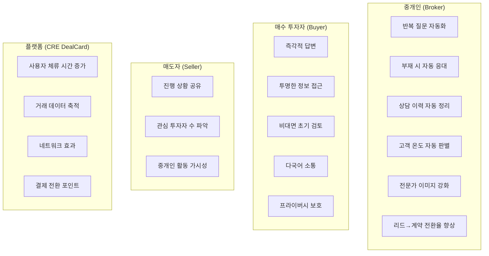
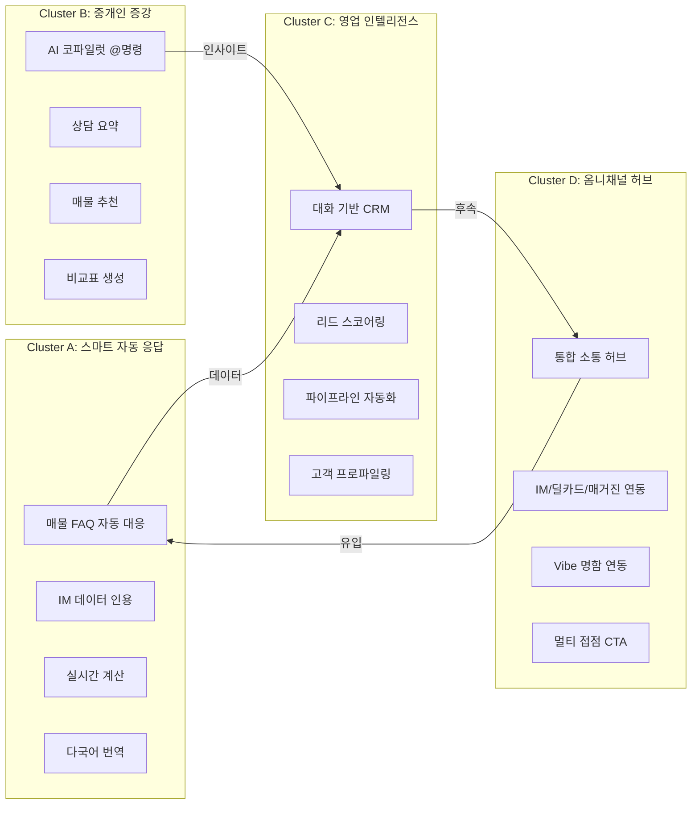
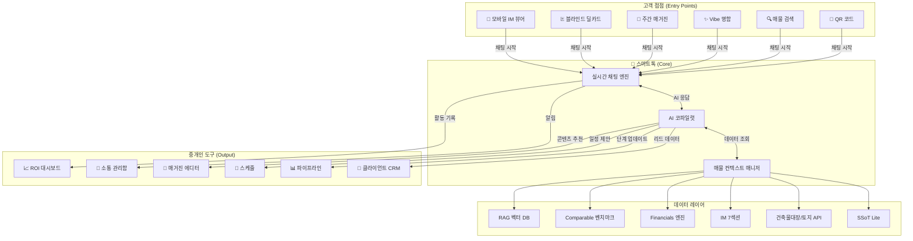
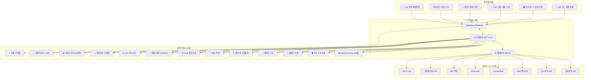

# 💬 크리딜 AI 메신저 — 더블 다이아몬드 기획서

> **프로젝트**: CRE DealCard AI-Powered Broker Messenger
> **방법론**: 더블 다이아몬드 (Discover → Define → Develop → Deliver)
> **버전**: v1.0 (2026.07.13)
> **목표**: 중개인의 고객 상담 증강 + 플랫폼 전체 기능 연동 극대화

---

## 목차

1. [💎 Diamond 1: 문제 발견 (Discover → Define)](#diamond-1-문제-발견)
2. [💎 Diamond 2: 해법 설계 (Develop → Deliver)](#diamond-2-해법-설계)
3. [🏆 골디락스 솔루션 정의](#골디락스-솔루션-정의)
4. [🔗 플랫폼 통합 아키텍처](#플랫폼-통합-아키텍처)
5. [📊 기능-가치 매트릭스](#기능-가치-매트릭스)
6. [🎯 구현 로드맵](#구현-로드맵)

---

## Diamond 1: 문제 발견

### Phase 1: Discover (발산) — 중개인의 고객 소통 현실

#### 1-1. 중개인의 일일 커뮤니케이션 워크플로우

```
06:00  카카오톡 미확인 메시지 30개 확인
07:00  네이버 부동산 문의 답변 5건
08:00  전화 상담 (같은 질문 반복: "수익률이 얼마죠?")
09:00  매물 사진 요청 → 폰 갤러리 뒤지기
10:00  현장 안내 → 이동 중 카카오톡 답변 불가
12:00  점심시간에 밀린 카카오톡 답변
14:00  투자자 A에게 보낸 IM, 열었는지 확인 불가
15:00  매수 의향서 관련 문의 → 수동으로 조건 정리
17:00  같은 물건 3명에게 각각 다른 채널로 설명
20:00  야간 문의 → 답변 못함 → 다음 날 리드 이탈
```

#### 1-2. 핵심 고통점 (Pain Points) 맵핑

| # | 고통점 | 빈도 | 심각도 | 현재 해결 수단 |
|---|--------|------|--------|-------------|
| P1 | **반복 질문 대응** ("수익률?", "위치?", "공실?") | 매일 10회+ | ⭐⭐⭐⭐⭐ | 없음 (수동 답변) |
| P2 | **멀티 채널 분산** (카카오/전화/문자/이메일) | 항상 | ⭐⭐⭐⭐⭐ | 없음 |
| P3 | **부재 시 리드 이탈** (현장/이동/야간) | 매일 | ⭐⭐⭐⭐ | 없음 |
| P4 | **상담 이력 유실** (카카오톡 검색 한계) | 자주 | ⭐⭐⭐⭐ | 없음 |
| P5 | **매물 자료 재전송** (사진/IM/가격표 반복) | 매일 5회+ | ⭐⭐⭐ | 수동 |
| P6 | **고객 온도 파악 불가** (누가 진심인지 모름) | 항상 | ⭐⭐⭐⭐ | 감 |
| P7 | **전문성 증명 어려움** (상담 중 분석 불가) | 자주 | ⭐⭐⭐ | 없음 |
| P8 | **다국어 소통** (외국인 투자자) | 가끔 | ⭐⭐ | 번역기 |

#### 1-3. 기존 CRE 중개 소통 도구 벤치마크

| 도구 | 강점 | 한계 |
|------|------|------|
| 카카오톡 | 보편성, 즉시성 | 비즈니스/개인 혼재, 검색 한계, AI 없음 |
| 네이버 부동산 채팅 | 플랫폼 내 유입 | 주거 중심, CRE 비적합, 데이터 연동 없음 |
| 직방/다방 챗 | 매물 연동 | 상업용 미지원, 중개인 브랜딩 불가 |
| 이메일 | 정중함, 기록성 | 느린 응답, 모바일 불편 |
| 전화 | 즉시성, 신뢰감 | 기록 없음, 부재 시 불가, 확장 불가 |

#### 1-4. 이해관계자별 니즈 발산



---

### Phase 2: Define (수렴) — 핵심 문제 정의

#### HMW (How Might We) 질문 도출

위 발산에서 도출된 고통점과 니즈를 종합하여 핵심 HMW 질문:

> **HMW 1**: 중개인이 **매물 데이터를 기반으로 자동 응답**하면서도 **전문가로서의 신뢰**를 잃지 않는 상담 도구를 어떻게 만들 수 있을까?

> **HMW 2**: 고객과의 모든 소통이 **자동으로 CRM에 축적**되어 중개인의 **영업 인텔리전스**가 되게 하려면?

> **HMW 3**: 현재 크리딜의 **딜카드→IM→매거진→Vibe명함** 파이프라인에 **실시간 대화**가 자연스럽게 녹아들게 하려면?

#### 핵심 문제 정의문 (Problem Statement)

```
상업용 부동산 중개인은
    [반복적 질문 대응 + 멀티채널 분산 + 부재 시 리드 이탈]로 인해
    하루 3~4시간을 비생산적 소통에 소비하고 있으며,
    상담 이력이 체계적으로 축적되지 않아
    고객 온도 판별과 후속 영업이 감에 의존하고 있다.

이로 인해:
    - 리드 → 현장방문 전환율: 약 15% (업계 평균)
    - 야간/부재 시 리드 이탈율: 약 40%
    - 동일 질문 반복 대응 시간: 일 평균 2시간
    
크리딜은 이미 [SSoT + IM + 매거진 + Vibe명함 + 인앱알림 + 열람분석] 
인프라를 보유하고 있어, 
매물 컨텍스트를 인지하는 AI 메신저로 이 문제를 해결할 수 있다.
```

---

## Diamond 2: 해법 설계

### Phase 3: Develop (발산) — 가능한 솔루션 브레인스토밍

#### 3-1. 기능 아이디어 40선 (비판 없이 발산)

**🟢 AI 자동 응답 계열**
1. 매물별 FAQ 자동 응답 (수익률, 위치, 공실률, 면적)
2. IM 데이터 기반 실시간 인용 답변
3. 건축물대장/토지대장 데이터 즉시 제공
4. 주변 시세 비교 자동 제공
5. DCF 시뮬레이션 대화형 제공
6. "이 가격이면 수익률 몇%인가요?" → 즉시 계산
7. 다국어 자동 번역 채팅 (한↔영/중/일)
8. 음성 메시지 → 텍스트 변환 + AI 요약
9. 이미지 전송 시 자동 캡션 생성
10. "비슷한 물건 더 있나요?" → 유사 매물 자동 추천

**🔵 중개인 코파일럿 계열**
11. 상담 중 @매물추천 → 고객 대화 맥락 기반 자동 추천
12. @요약 → 현재까지 상담 요약 자동 생성
13. @비교 → 고객이 관심 보인 물건 3개 비교표 자동 생성
14. @일정 → 현장 방문 일정 자동 제안 + 캘린더 연동
15. @NDA → NDA 서명 요청 자동 전송
16. @IM → 해당 물건 IM 링크 자동 전송
17. @가격협상 → 매도/매수 간 오퍼 시뮬레이션
18. @체크리스트 → 거래 단계별 필요 서류 안내
19. @번역 → 직전 메시지 다국어 번역
20. @보고서 → 주간 상담 활동 보고서 자동 생성

**🟡 CRM 연동 계열**
21. 대화에서 자동 리드 스코어링 (관심도/긴급도/예산)
22. 고객 타임라인에 채팅 이력 자동 연동
23. "지난번에 보셨던 강남 빌딩..." → 이전 대화 맥락 자동 참조
24. 고객 세그먼트별 자동 그룹 채팅방 생성
25. 거래 파이프라인 단계 자동 업데이트 (대화 맥락 기반)
26. 계약 조건 변경 시 관련 고객 자동 알림
27. 고객별 선호 투자 조건 자동 프로파일링

**🟠 마케팅/브랜딩 연동 계열**
28. 매거진 발행 시 관심 고객에게 자동 메시지
29. 새 딜카드 생성 시 매칭 고객에게 자동 알림
30. Vibe 명함 연동 — 채팅방 상단에 중개인 전문성 표시
31. 채팅 내 "이 중개인의 최근 딜카드 3건" 자동 노출
32. 고객이 IM을 60초 이상 열람 시 자동 인사 메시지

**🔴 UX/접점 계열**
33. IM 뷰어 하단에 채팅 위젯 (플로팅 버튼)
34. 블라인드 딜카드 열람자에게 채팅 CTA
35. 매거진 열람자에게 1:1 상담 버튼
36. QR 코드 → 채팅방 직접 연결 (현장 명함용)
37. 카카오톡 알림 → 크리딜 채팅으로 자연스러운 전환
38. 웹 푸시 알림 (새 메시지)
39. PWA 홈 화면 추가 → 앱처럼 사용
40. 채팅방 내 미니 IM 카드 (핵심 지표 인라인 표시)

#### 3-2. 아이디어 클러스터링



---

### Phase 4: Deliver (수렴) — 골디락스 솔루션 선정

#### 4-1. 평가 매트릭스 (Impact × Effort × Integration)

| 클러스터 | 중개인 가치 | 구현 난이도 | 기존 연동성 | 종합 점수 |
|---------|-----------|-----------|-----------|---------|
| **A: 스마트 자동 응답** | ⭐⭐⭐⭐⭐ | ⭐⭐ (쉬움) | ⭐⭐⭐⭐⭐ | **🥇 14** |
| **B: 중개인 코파일럿** | ⭐⭐⭐⭐⭐ | ⭐⭐⭐ (보통) | ⭐⭐⭐⭐ | **🥈 12** |
| **C: 영업 인텔리전스** | ⭐⭐⭐⭐ | ⭐⭐⭐⭐ (높음) | ⭐⭐⭐ | 11 |
| **D: 옴니채널 허브** | ⭐⭐⭐⭐ | ⭐⭐ (쉬움) | ⭐⭐⭐⭐⭐ | **🥉 11** |

#### 4-2. "너무 적지도, 너무 많지도 않은" 골디락스 기준

| 기준 | Too Cold 🥶 | Goldilocks 🏆 | Too Hot 🔥 |
|------|-----------|------------|----------|
| **범위** | 단순 채팅만 | 채팅 + AI + 매물 연동 | 풀 CRM + 계약 관리 + 결제 |
| **AI 수준** | 규칙 기반 봇 | 매물 컨텍스트 인지 AI + 코파일럿 | 완전 자율 에이전트 |
| **접점** | 별도 채팅 앱 | IM/딜카드/매거진 내장 | 카카오톡/전화 통합 |
| **구현** | 1주 | 2~3주 | 3개월+ |

---

## 골디락스 솔루션 정의

### 제품명: **크리딜 스마트톡 (CreDeal SmartTalk)**

> 상업용 부동산 전문 AI 메신저 — 매물을 아는 대화

### 핵심 가치 제안 (Value Proposition)

```
┌─────────────────────────────────────────────────────────┐
│                                                         │
│  "중개인님이 현장에 계실 때도,                            │
│   고객은 AI가 매물 데이터로 정확하게 응대합니다.           │
│   돌아오시면, 상담 요약이 준비되어 있습니다."              │
│                                                         │
│  ┌─────────┐  ┌─────────┐  ┌─────────┐                 │
│  │ 즉시 응답│→ │ 정확한  │→ │ 자동    │                 │
│  │ (24/7)  │  │ 데이터  │  │ 인텔    │                 │
│  └─────────┘  └─────────┘  └─────────┘                 │
│                                                         │
│  리드 이탈 ↓40%  반복 질문 ↓80%  전환율 ↑2.5x           │
│                                                         │
└─────────────────────────────────────────────────────────┘
```

### 핵심 기능 구성 (3-Layer)

#### Layer 1: 매물 인지 채팅 (Foundation)

| 기능 | 설명 | 연동 기능 |
|------|------|---------|
| **1:1 실시간 채팅** | 고객↔중개인 Supabase Realtime 기반 | 인앱 알림 |
| **매물 컨텍스트 자동 로드** | 채팅 시작 시 해당 IM/딜카드 데이터 자동 연결 | SSoT Lite, IM |
| **매물 카드 인라인** | 채팅 내 매물 핵심 지표 카드 표시 | 히어로 카드 |
| **사진/자료 공유** | 매물 사진, IM 링크, PDF 직접 전송 | 사진 갤러리, PDF 내보내기 |
| **Vibe 명함 헤더** | 채팅방 상단에 중개인 Vibe 명함 자동 표시 | Vibe 카드 |

#### Layer 2: AI 코파일럿 (Intelligence)

| 기능 | 설명 | 연동 기능 |
|------|------|---------|
| **FAQ 자동 응답** | "수익률?", "면적?", "위치?" → IM 데이터 기반 즉시 답변 | SSoT, 건축물대장, 공시지가 |
| **@추천** | 대화 맥락 기반 적합 매물 자동 추천 | 매칭 엔진, SSoT |
| **@비교** | 관심 물건 비교표 자동 생성 | Comparable Benchmark |
| **@계산** | "70억에 대출 40억이면 수익률?" → 즉시 계산 | Financials 엔진 |
| **@요약** | 상담 내용 자동 요약 + CRM 저장 | 고객 타임라인 |
| **@IM** | 해당 물건 모바일 IM 링크 자동 전송 | 모바일 IM |
| **@일정** | 현장 방문 일정 제안 | 스케줄 관리 |
| **@NDA** | NDA 서명 요청 자동 전송 | NDA 시스템 |
| **다국어 자동 번역** | 실시간 한↔영/중/일 번역 | 번역 엔진 |
| **부재 자동 응대** | 중개인 오프라인 시 AI가 1차 대응 + 요약 보고 | 인앱 알림 |

#### Layer 3: 영업 인텔리전스 (Insight)

| 기능 | 설명 | 연동 기능 |
|------|------|---------|
| **리드 자동 스코어링** | 대화 패턴 → Hot/Warm/Cold 자동 분류 | 열람 분석 |
| **상담 요약 → CRM** | 대화 종료 시 자동 요약 → 고객 카드에 저장 | 클라이언트 관리 |
| **파이프라인 자동 업데이트** | "현장 방문 하겠습니다" → 파이프라인 단계 자동 이동 | 파이프라인 |
| **고객 투자 프로파일** | 대화 축적 → 선호 권역/자산유형/예산 자동 추출 | 매수자 의향 |
| **주간 상담 보고서** | 이번 주 상담 건수, 전환율, AI 처리율 자동 생성 | 주간 리포트 |

---

## 플랫폼 통합 아키텍처

### 기존 기능과의 연동 맵



### 각 기존 기능과의 구체적 연동

| 기존 기능 | 연동 방식 | 양방향 여부 |
|---------|---------|-----------|
| **딜카드** | 채팅방 생성 시 SSoT 자동 로드 → AI가 매물 데이터 참조 | 🔄 양방향 |
| **모바일 IM** | IM 뷰어에 채팅 위젯 삽입 → 매물 맥락 자동 연결 | 🔄 양방향 |
| **Vibe 명함** | 채팅방 헤더에 명함 표시 → 전문성 어필 | → 단방향 |
| **매거진** | 발행 시 관심 고객에게 자동 공유 메시지 | → 단방향 |
| **소통 관리함** | 새 메시지 알림 통합 → 읽음/미읽음 관리 | 🔄 양방향 |
| **클라이언트 CRM** | 상담 요약 자동 저장 → 고객 타임라인 누적 | 🔄 양방향 |
| **파이프라인** | 대화 맥락 기반 단계 자동 업데이트 | 🔄 양방향 |
| **스케줄** | @일정 → 현장 방문 일정 생성 | → 단방향 |
| **NDA** | @NDA → 서명 요청 링크 전송 | → 단방향 |
| **매칭 엔진** | @추천 → 고객 프로파일 기반 매물 추천 | → 단방향 |
| **열람 분석** | 60초 이상 체류 시 자동 인사 메시지 트리거 | → 단방향 |
| **인앱 알림** | 채팅 메시지를 알림 피드에 통합 | 🔄 양방향 |
| **Gate Disclosure** | 상세 자료 요청을 채팅으로 전환 | 🔄 양방향 |
| **ROI 계산기** | 상담 건수/전환율을 ROI에 반영 | → 단방향 |

---

## 기능-가치 매트릭스

### 5대 핵심 가치 × 기능 매핑

| | 시간 절약 ⏱️ | 리드 전환 📈 | 전문성 강화 🎓 | 고객 경험 💎 | 데이터 축적 📊 |
|---|---|---|---|---|---|
| **FAQ 자동 응답** | ⭐⭐⭐⭐⭐ | ⭐⭐⭐ | ⭐⭐⭐⭐ | ⭐⭐⭐⭐⭐ | ⭐⭐⭐ |
| **부재 자동 응대** | ⭐⭐⭐⭐⭐ | ⭐⭐⭐⭐⭐ | ⭐⭐⭐ | ⭐⭐⭐⭐ | ⭐⭐⭐ |
| **@추천/@비교** | ⭐⭐⭐⭐ | ⭐⭐⭐⭐ | ⭐⭐⭐⭐⭐ | ⭐⭐⭐⭐⭐ | ⭐⭐⭐⭐ |
| **@계산** | ⭐⭐⭐⭐ | ⭐⭐⭐ | ⭐⭐⭐⭐⭐ | ⭐⭐⭐⭐ | ⭐⭐⭐ |
| **상담 요약→CRM** | ⭐⭐⭐⭐⭐ | ⭐⭐⭐ | ⭐⭐⭐ | ⭐⭐⭐ | ⭐⭐⭐⭐⭐ |
| **리드 스코어링** | ⭐⭐⭐ | ⭐⭐⭐⭐⭐ | ⭐⭐⭐ | ⭐⭐ | ⭐⭐⭐⭐⭐ |
| **IM 내 채팅 위젯** | ⭐⭐⭐ | ⭐⭐⭐⭐⭐ | ⭐⭐⭐⭐ | ⭐⭐⭐⭐⭐ | ⭐⭐⭐⭐ |
| **다국어 번역** | ⭐⭐⭐⭐ | ⭐⭐⭐ | ⭐⭐⭐⭐ | ⭐⭐⭐⭐⭐ | ⭐⭐ |

---

## 구현 로드맵

### MVP (2~3주) — "매물을 아는 채팅"

```
Week 1: 채팅 인프라 + 기본 UI
├── chat_rooms / chat_messages 테이블
├── Supabase Realtime 연동
├── 채팅방 UI (모바일 최적화)
├── IM 뷰어 내 채팅 위젯 (플로팅 버튼)
└── 소통 관리함 연동

Week 2: AI 코파일럿 (Layer 2 핵심)
├── FAQ 자동 응답 (SSoT/IM 데이터 기반)
├── @추천, @비교, @계산, @IM 명령어
├── 부재 자동 응대 모드
├── 상담 요약 자동 생성
└── Vibe 명함 헤더 연동

Week 3: 인텔리전스 (Layer 3 핵심)
├── 리드 자동 스코어링
├── 상담 요약 → CRM 자동 저장
├── 파이프라인 자동 업데이트
└── 주간 상담 리포트
```

### 핵심 DB 스키마 (예상)

```sql
-- 채팅방
CREATE TABLE chat_rooms (
  id uuid PRIMARY KEY DEFAULT gen_random_uuid(),
  broker_id uuid REFERENCES auth.users(id),
  guest_name text,           -- 비로그인 고객 이름
  guest_phone text,          -- 비로그인 고객 전화
  building_id uuid,          -- 연결된 매물 (SSoT Lite)
  doc_id uuid,               -- 연결된 IM 문서
  context_type text,         -- 'im_viewer' | 'deal_card' | 'magazine' | 'direct'
  ai_mode text DEFAULT 'copilot', -- 'off' | 'copilot' | 'auto_respond'
  lead_score text,           -- 'hot' | 'warm' | 'cold'
  status text DEFAULT 'active',
  last_message_at timestamptz,
  created_at timestamptz DEFAULT now()
);

-- 채팅 메시지
CREATE TABLE chat_messages (
  id uuid PRIMARY KEY DEFAULT gen_random_uuid(),
  room_id uuid REFERENCES chat_rooms(id),
  sender_type text NOT NULL,  -- 'broker' | 'guest' | 'ai'
  sender_name text,
  content text NOT NULL,
  message_type text DEFAULT 'text', -- 'text' | 'card' | 'image' | 'system'
  metadata jsonb,             -- 매물 카드, @명령 결과 등
  is_read boolean DEFAULT false,
  created_at timestamptz DEFAULT now()
);
```

### 예상 효과

| 지표 | 현재 (추정) | 스마트톡 도입 후 (목표) |
|------|-----------|-------------------|
| 반복 질문 대응 시간 | 일 2시간 | **일 20분** (↓83%) |
| 야간/부재 리드 이탈 | 40% | **10%** (↓75%) |
| 리드→현장방문 전환 | 15% | **35%** (↑133%) |
| 상담 기록 체계화율 | 10% | **90%** (자동) |
| 고객 응답 시간 (중앙값) | 4시간 | **30초** (AI 1차) |

---

## 부록: 경쟁 분석

### vs 카카오 비즈니스 채널
| | 카카오 비즈채널 | 크리딜 스마트톡 |
|---|---|---|
| **매물 인지** | ❌ | ✅ SSoT/IM 자동 연결 |
| **재무 계산** | ❌ | ✅ 실시간 Cap Rate/DCF |
| **공공데이터** | ❌ | ✅ 건축물대장/공시지가 |
| **CRM 연동** | ❌ | ✅ 자동 리드 스코어링 |
| **브로커 브랜딩** | ❌ | ✅ Vibe 명함 연동 |
| **도달성** | ⭐⭐⭐⭐⭐ | ⭐⭐⭐ (웹 기반) |

> **전략**: 카카오톡과 경쟁하지 않음. 카카오톡은 "연락 수단", 스마트톡은 "상담 도구". IM 뷰어에서 관심을 보인 고객이 자연스럽게 스마트톡으로 전환하는 흐름.

---

> **다음 단계**: 구현 승인 시, 상세 구현 계획(Implementation Plan) 수립 → Phase A+B MVP(채팅 + AI 코파일럿) 2주 내 개발 가능

---

## 부록 B: 전체 플랫폼 기능 연동 정밀 맵

### 현재 시스템 규모 (2026.07 기준)

| 카테고리 | 수량 | 핵심 항목 |
|---------|------|---------|
| **브로커 페이지** | 24개 | 대시보드, 딜카드, IM승인, 매거진, Vibe명함, CRM, 파이프라인, 스케줄, 캠페인 등 |
| **공개 페이지** | 18개 | IM뷰어, 딜카드, 매거진, Vibe명함, NDA, 아고라, 건물레이더 등 |
| **API 라우트** | 60+개 | 브로커 27개, 공개 18개, 관리/크론 15+개 |
| **추적 이벤트** | 58종 | 건물→문서→게이트→매칭→거래→열람 전 라이프사이클 |
| **DB 테이블** | 25+개 | SSoT, profiles, intents, matches, events, gate, schedules 등 |
| **크론 잡** | 4개 | 모닝브리핑, 주간매거진, Vibe동기화, Hold만료 |

### 스마트톡 × 기존 기능 27-Point 연동 맵



### @명령어 × API 연동 맵

| @명령어 | 호출 API | 기존 모듈 | 설명 |
|--------|---------|---------|------|
| **@추천** | `/api/broker/match` | `match-engine.ts` | 대화 맥락 → 매수자 의향 자동 생성 → 매칭 실행 |
| **@비교** | `/api/broker/buildings` | `comparable-benchmark.ts` | 관심 물건 2~3개 비교표 자동 생성 |
| **@계산** | 내부 계산 | `financials.ts` | Cap Rate / DCF / LTV 실시간 계산 |
| **@IM** | `/api/broker/im-lite` | `writer.ts` | 해당 물건 IM 링크 전송 또는 즉시 생성 |
| **@요약** | 내부 LLM | `callLLM` | 상담 내용 AI 요약 → CRM 자동 저장 |
| **@일정** | `/api/broker/schedule` | `booking-orchestrator.ts` | 가용 슬롯 조회 → 현장 방문 제안 |
| **@NDA** | `/api/gate-requests` | `gate-request.ts` | NDA 서명 요청 링크 자동 전송 |
| **@캠페인** | `/api/broker/campaign` | 캠페인 AI | 매물 기반 마케팅 카피 자동 생성 |
| **@번역** | 내부 LLM | `callLLM` | 직전 메시지 한↔영/중/일 번역 |
| **@리드** | `/api/broker/clients` | CRM | 대화 상대를 리드로 자동 등록 |
| **@파이프** | `/api/broker/pipeline` | `pipeline FSM` | 현재 딜 상태 조회 / 단계 전환 |
| **@보고** | `/api/broker/weekly-report` | 주간 리포트 | 이번 주 상담 활동 자동 리포트 |

---

## 부록 C: 대화 시나리오 시뮬레이션

### 시나리오 1: IM 열람 → 실시간 상담 → 현장 방문 예약

```
[투자자가 IM 뷰어에서 60초 이상 체류 → Hot Lead 감지]

🤖 AI: 안녕하세요! 성수동 근생빌딩에 관심을 가져주셔서 감사합니다.
        궁금한 점이 있으시면 편하게 물어보세요 😊

👤 투자자: 이 건물 수익률이 정확히 어떻게 되나요?

🤖 AI: 현재 입력된 데이터 기준 예상 Cap Rate는 4.8%입니다.
        📊 월 임대료: 3,200만원 × 12 ÷ 매각호가 80억 = 4.8%
        (실제 공실률, 관리비 반영 시 Net Cap Rate는 달라질 수 있습니다.)
        
        담당 중개인 김OO 팀장이 정확한 현황을 안내드릴 수 있습니다.
        현장 방문을 예약하시겠어요?

👤 투자자: 네, 이번 주 가능한가요?

🤖 AI: 가능한 시간대입니다:
        📅 7/15(화) 14:00~16:00
        📅 7/16(수) 10:00~12:00
        📅 7/18(금) 15:00~17:00
        
        원하시는 시간을 선택해주세요.

👤 투자자: 15일 2시요

🤖 AI: ✅ 7/15(화) 14:00 현장 방문이 예약되었습니다.
        담당 중개인 김OO 팀장에게 알림을 보냈습니다.
        
        [내부: availability_slots Hold → booking 생성 → 브로커에게 인앱 알림]
        [내부: activity_events → booking_hold_created]
        [내부: pipeline_stage → buyer_meeting 단계 자동 이동]
```

### 시나리오 2: 야간 자동 응대 → 다음 날 요약 인계

```
[밤 11시, 중개인 오프라인]

👤 투자자: 강남 물류센터 자료 좀 더 볼 수 있을까요?

🤖 AI: 안녕하세요! 현재 담당 중개인이 업무 시간 외입니다.
        강남 물류센터의 공개 가능한 정보를 안내드릴게요:
        
        📦 자산 유형: 물류센터
        📐 연면적: 12,500㎡ (3,781평)
        💰 매각 호가: 350억원
        📊 예상 Cap Rate: 5.2%
        🏗️ 건축년도: 2019년 (건축물대장 기준)
        
        상세 임대차 현황과 수익 분석은 
        NDA 서명 후 열람 가능합니다.
        서명을 진행하시겠어요?

👤 투자자: 네, 서명할게요. 그리고 대출 40% 받으면 레버리지 수익률은?

🤖 AI: 📝 NDA 서명 링크를 보내드렸습니다: [NDA 서명하기]
        
        레버리지 수익률 계산입니다:
        ├ 자기자본: 210억 (60%)
        ├ 대출: 140억 (40%, 금리 4.0% 가정)
        ├ NOI: 18.2억/년
        ├ 이자비용: 5.6억/년
        └ Equity Cap Rate: (18.2-5.6)/210 = 6.0%
        
        대출 활용 시 수익률이 4.8% → 6.0%로 개선됩니다.

[다음 날 오전 — 중개인 접속]

🔔 소통 관리함:
    📄 강남 물류센터 — 야간 상담 1건
    👤 투자자: 박OO (010-xxxx-xxxx)
    📊 리드 온도: 🔥 HOT (Gate 요청 + 레버리지 계산 + 즉시 NDA)
    📝 요약: 수익률 확인 → NDA 서명 → 레버리지 수익률 질문
    🎯 추천 후속: 전화 상담 → 현장 방문 일정 제안
```

### 시나리오 3: 중개인 코파일럿 — 복수 매물 상담

```
[중개인이 고객과 대화 중]

👤 고객: 성수동 쪽 30~50억대 근생 있으면 좀 보여주세요

🧑‍💼 중개인: @추천 성수동 근생 30-50억

🤖 AI [중개인에게만 표시]:
    매칭 결과 3건 (S~A 등급):
    ┌─────────────────────────────────────────┐
    │ 1. 성수 A빌딩 (S등급, 92점)              │
    │    42억 / Cap 5.1% / 2020년 / 공실 0%    │
    │ 2. 성수 B빌딩 (A등급, 85점)              │
    │    38억 / Cap 4.8% / 2018년 / 공실 5%    │
    │ 3. 뚝섬 C빌딩 (A등급, 81점)              │
    │    48억 / Cap 5.3% / 2022년 / 공실 3%    │
    └─────────────────────────────────────────┘
    [고객에게 전송] [비교표 생성] [IM 링크 첨부]

🧑‍💼 중개인: [비교표 생성] 클릭

🤖 AI → 고객에게 자동 전송:
    📊 성수 권역 30~50억대 근생 비교표
    
    | 항목 | 성수 A | 성수 B | 뚝섬 C |
    |------|-------|-------|-------|
    | 매각가 | 42억 | 38억 | 48억 |
    | Cap Rate | 5.1% | 4.8% | 5.3% |
    | 공실률 | 0% | 5% | 3% |
    | 건축년도 | 2020 | 2018 | 2022 |
    | 주차 | 12대 | 8대 | 15대 |
    
    각 물건의 상세 IM을 확인해보세요:
    [📄 성수 A IM] [📄 성수 B IM] [📄 뚝섬 C IM]
```

### 시나리오 4: 아고라 → 스마트톡 전환

```
[아고라(커뮤니티)에서 질문]

👤 익명 사용자: 성수 2024년 이후 준공 빌딩 수익률 어느 정도인가요?

🤖 AI (공개 답변): 
    성수동 2024년 이후 준공 근생빌딩 평균 Cap Rate는 4.5~5.2% 수준입니다.
    (실거래가 기반, 네이버 부동산 시세 참조)
    
    전문 중개인과 구체적인 매물 상담을 원하시면:
    [💬 성수 전문 중개인과 1:1 상담하기]

👤 사용자: [1:1 상담하기] 클릭
    → 성수 권역 전문 중개인 매칭
    → 스마트톡 채팅방 자동 생성 (아고라 질문 컨텍스트 포함)

🤖 AI: 안녕하세요! 성수 전문 김OO 팀장에 연결되었습니다.
        아까 아고라에서 질문하신 성수 2024년 이후 준공 빌딩 관련,
        현재 매각 진행 중인 물건이 2건 있습니다. 확인해보시겠어요?
```

### 시나리오 5: 이벤트 기반 프로액티브 메시지

```
[58개 이벤트 타입 중 스마트톡이 반응하는 트리거]

🔥 hot_lead_detected (리드 점수 80+)
    → 브로커에게: "🔥 성수 A빌딩 핫리드! 3개 채널 교차 열람, 체류 5분+"
    → 고객에게: "관심 가져주셔서 감사합니다. 추가 자료가 필요하신가요?"

📄 im_lite_generated (IM 생성 완료)
    → 이전 관심 고객들에게: "새로운 IM이 발행되었습니다 [확인하기]"

📊 pipeline_stage_transitioned (LOI 단계 진입)
    → 매도자에게: "매수 의향서가 접수되었습니다. 중개인이 곧 연락드립니다."

📅 slot_hold_expired (방문 예약 Hold 만료)
    → 고객에게: "예약 시간이 만료되었습니다. 다른 시간에 방문하시겠어요?"

📰 magazine_distributed (매거진 발행)
    → 구독자에게: "이번 주 시장 리포트가 발행되었습니다 [읽기]"
```

---

## 부록 D: 기존 AI 앰배서더와의 관계

### 현재: `ai-ambassador.ts` (Stateless)

```
고객 질문 → RAG 검색 → LLM 답변 → 응답 (이력 없음)
```

### 스마트톡: AI 앰배서더 확장 (Stateful)

```
고객 질문 → [채팅 이력 참조] → RAG 검색 → [27개 API 연동] → LLM 답변 
    → [대화 저장] → [리드 스코어 업데이트] → [CRM 반영] → 응답
```

> **핵심**: AI 앰배서더의 `AmbassadorContext` + `searchSimilarIMs()` 패턴을 그대로 확장하되, **대화 이력 영속화 + 이벤트 기반 프로액티브 메시지 + @명령어 코파일럿**을 추가하는 구조.

---

> **결론**: 크리딜 스마트톡은 단순한 채팅 도구가 아닌, **58개 이벤트 × 27개 API × 24개 브로커 페이지**를 관통하는 **대화형 인터페이스 레이어**입니다. 기존의 모든 기능이 대화를 통해 접근 가능해지며, 중개인에게는 "하나의 화면에서 모든 업무를 처리"하는 통합 경험을 제공합니다.
