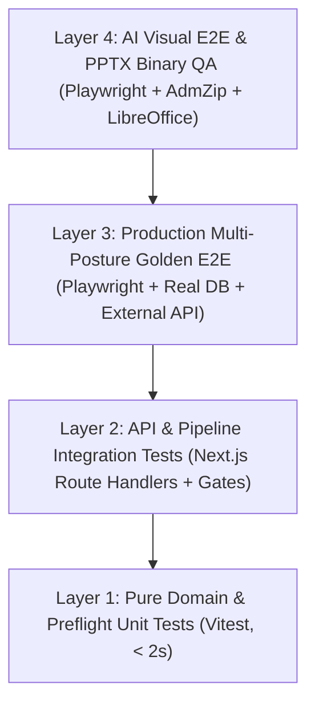

# CRE DealCard: 상용화 수준 Basic IM 테스트 프로토콜 및 품질 보증 지침서
> **문서 버전:** v1.0 (Commercial Grade)  
> **최종 갱신일:** 2026-09-15  
> **적용 대상:** CRE Mobile IM / Basic IM (`credeal_basic` 프리셋) 파이프라인 및 골든 테스트 하네스

---

## 1. 개요 및 목적 (Executive Overview)

본 지침서는 **CRE DealCard의 Basic IM(투자설명서) 생성 파이프라인을 엔터프라이즈 B2B 상용화(Commercial Grade) 수준의 무결점으로 검증**하기 위한 표준 테스트 규격서이자 지식 소스(Knowledge Base)입니다.

단순한 함수 수준의 단위 테스트를 넘어, **실제 브라우저 UI 조작 → 실DB(Supabase) 영속화 → 외부 공공/지도 API 실호출 → LLM 생성 및 서사 폴백 → PPTX 바이너리 파싱 → 150 DPI 고화질 슬라이드 시각 검수**에 이르는 전구간 골든 테스트 체계를 확립하여, 투자자 대면 문서의 100% 신뢰성과 시각적 완성도를 보장합니다.

---

## 2. Basic IM SSOT 표준 규격 (Rule 47 준수)

Basic IM(`credeal_basic` 프리셋)은 Pro IM의 복잡한 고급 금융 분석(DCF, 민감도 분석, 레버리지 시나리오, 세무 등)을 배제하고, 매수인이 3분 이내에 매물의 핵심 가치를 파악할 수 있도록 최적화된 **"표준 9단계 슬라이드 시퀀스"**를 엄격히 준수합니다.

### 2.1 표준 9섹션 시퀀스 매핑

| 순서 | 슬라이드 키 | 아키타입 | 핵심 콘텐츠 및 렌더링 규칙 | 비고 |
|:---:|:---|:---:|:---|:---|
| **01** | `cover` | A01 | 표지 — 미니멀 추상 기하학 배경 (건물 사진 제외), 매물명, 주소, 매각 희망가 | 다크 테마 |
| **02** | `summary` | A02 | 자산 요약 — 6대 핵심 지표(대지/연면적, 준공, 용도, 주차 등) + 3대 투자 포인트 | 라이트 테마 |
| **03** | `building` | A04 | 물건 개요 — 좌측 공부 스펙 및 서사 + 우측 고화질 외관/진입로 사진 | 좌우 비대칭 (7:5) |
| **04** | `location` | A06 | 입지 분석 — 카카오 정적 지도(API 실호출) + 랜드마크 뱃지 + 입지 강점 3개 | 필수 슬라이드 (절삭 불가) |
| **05** | `land` | A04 | 토지/공법 — V-World 지적도(WMS) + 용도지역/건폐율/용적률 공법 분석 | 좌우 비대칭 |
| **06** | `rentRollStacking` | A24 | 렌트롤 & 스태킹 — 층별 테넌트/면적/임대료 표 + 시각적 입체 스태킹 결합 | 공실층 주황 하이라이트 |
| **07** | `yieldFormula` | A23 | 투자수익률 — As-Is 수익률 + 안정화(Stabilized) 시나리오 산식 + `◇ 분석가정` 배지 | 분모(매매가-보증금) 검증 |
| **08** | `gallery` | A14 | 현장 사진 — 6컷 정규 그리드(외관, 로비, 내부, 엘리베이터, 주차장, 옥상) | 지도 사진 침투 차단 |
| **09** | `closing` | A10 | 문의 및 유의사항 — 전속 중개사 명함/연락처 + 법적 면책 조항 (Graduated Response) | 다크 테마 |

### 2.2 엄격한 슬라이드 격리 원칙 (Exclusion Guard)
- **Basic IM 절대 제외 슬라이드**: `capital`, `totalReturn`, `dcf`, `sensitivity`, `loan`, `tax`, `thesis`, `risk`, `checklist`, `process`, `stability`, `profit`.
- `SLIDE_PRIORITY`와 `deck-sequencer.ts`는 `input.preset === 'credeal_basic'` 감지 시 골디락스 절삭 알고리즘(12~20p)을 우회하고 **정확히 상기 9섹션(데이터 가용성에 따라 8~10면)**만을 시퀀싱해야 합니다.

---

## 3. 4-Layer 테스트 피라미드 아키텍처

상용화 수준을 달성하기 위해 4단계의 상호 보완적 테스트 계층을 운용합니다.



### 3.1 Layer 1: 순수 도메인 및 사전 비행 단위 테스트 (Vitest)
- **실행 명령**: `npm run preflight` (`preflight-pipeline-audit`, `copy-cross-compare`, `a22-stacking-plan`)
- **핵심 점검 대상**:
  1. **면적 파싱 전용 헬퍼** (`extractAreaPyeong`, Rule 32): `96평(약 317.4㎡)` 형태에서 `96317.4평` 병합 방지, 3,000평/30,000평 상한 가드.
  2. **마크다운 테이블 인접 분리** (`parseMarkdownTable`, Rule 31, 33): 요약 테이블과 렌트롤 테이블 분리, 임대료 컬럼이 면적으로 역전환되는 결함 차단.
  3. **Protected Keys 일관성** (Rule 44): `deck-sequencer.ts`의 `protectedKeys`와 테스트 코드 간의 100% 동기화.
  4. **Positive/Negative 짝 단언** (Rule 7): 모든 검증 케이스에 정상/비정상 반대 단언 쌍 구성.

### 3.2 Layer 2: API 및 파이프라인 통합 테스트
- **실행 명령**: `npm run test:api`
- **핵심 점검 대상**:
  1. **승인 게이트 엄격 검증** (`runApprovalGate`, Rule 15, 17): 포스처별 필수 지표 검증 (`income`은 `gross_yield` 필수, `owner_occupied`는 가격/면적 필수).
  2. **위변조 방지 해시 바인딩** (`expectedHash`, Rule 20): 최신 revision의 SHA-256 targetHash 일치 여부 확인.
  3. **비동기 타임아웃 패리티** (Rule 18, 21): 세그먼트 타임아웃, 하드 타임아웃(180s), 클라이언트 폴링 상한(300s) 일치.

### 3.3 Layer 3: 프로덕션 E2E 골든 테스트 (Playwright)
- **실행 명령**: `npx playwright test e2e/<spec>.auth.spec.ts --project=authenticated`
- **핵심 점검 대상**:
  1. **프로덕션 골든 테스트 의무** (Rule 41): 실제 브라우저 UI 조작 → 딜카드 생성 → 바텀시트 프리셋 검증 → 비동기 폴링 완료 → 승인 처리 → 다운로드.
  2. **실제 외부 API 호출** (Rule 43, 50): 카카오 Static Map, V-World WMS 지적도 실제 HTTP 호출 및 Referer 헤더 검증.
  3. **실지번(PNU) 레지스트리 의무** (Rule 57): 가상 지번 사용 전면 금지, 국토부 실제 필지 지번 사용.

### 3.4 Layer 4: PPTX 바이너리 파싱 및 AI 시각 E2E (Visual QA)
- **실행 도구**: `golden-test-utils.ts` (`analyzePptxZip`) + `pptx-slide-capturer.ts` (LibreOffice pdftoppm)
- **핵심 점검 대상**:
  1. **OpenXML 결함 토큰 제로** (`assertNoPoisonTokens`): `>NaN<`, `>undefined<`, `>null<`, `[object Object]` 0건.
  2. **모의/더미 데이터 제로** (`assertNoDummyData`, Rule 34): `NH농협캐피탈`, `테헤란로 123` 등 목데이터 누출 차단.
  3. **회피성 문구 제로** (`assertNoEvasivePhrases`, Rule 37): `본문을 참조`, `별도 안내 예정` 등 8종 차단.
  4. **가격 밴드 차단** (`assertPriceBandBlocked`, Rule 52): `50억~80억` 등 밴드 표기 차단, 단일 확정 금액 우선.
  5. **150 DPI 슬라이드 PNG 렌더링**: 카드 텍스트 오버플로, 줄바꿈 붕괴, 라벨 오염 검출.

---

## 4. 5대 포스처별 골든 테스트 매트릭스 (Golden Asset Matrix)

실제 프로덕션 환경에서 검증 완료된 5대 핵심 매물 스펙 및 지번 레지스트리입니다.

| 포스처 | 시나리오 ID | 대상 매물 | 실지번 및 PNU | 매각 희망가 | 특이사항 및 핵심 검증 포인트 | 전용 E2E 스펙 파일 |
|:---:|:---|:---|:---|:---:|:---|:---|
| **수익형 (일반)** | `01-dangsan-income` | 영등포구 호산당빌딩 | 당산동1가 72-1<br>`1156011700100720001` | 115억 원 | 만실(공실률 0%), 메디컬/근생 임차, As-Is Cap Rate 정확 산출, A24 렌트롤+스태킹 | `e2e/basic-im-golden.auth.spec.ts`<br>`e2e/dangsan-full-pipeline.auth.spec.ts` |
| **수익형 (고공실)** | `02-gangnam-vacancy` | 강남구 역삼동 오피스 | 역삼동 832-7<br>`1168010100108320007` | 135억 원 | 공실률 57% (3~6F 공실), A24 공실층 오렌지 하이라이트(`FBEFE8`), Stabilized Cap Rate 가설 | `e2e/gangnam-vacancy-golden.auth.spec.ts` |
| **개발형 (신축부지)** | `03-mapo-dev` | 마포구 대흥동 개발부지 | 대흥동 12-41<br>`1144010800100120041` | 78억 원 | 토지이용계획원 중심, 용적률/건폐율 신축 가용 연면적 분석, gross_yield 검증 제외 | `e2e/mapo-dev-golden.auth.spec.ts` |
| **사옥형 (자가사용)** | `04-seocho-hq` | 서초구 서초동 메디컬사옥 | 서초동 1338-20<br>`1165010800113380020` | 210억 원 | 전층 자가사용, 취득세/감가상각 세무 효과, 사옥 브랜딩 및 주차 수용력 | `e2e/seocho-basic-golden.auth.spec.ts` |
| **매매형 (시세차익)** | `05-sinsa-trading` | 강남구 신사동 도산대로변 | 신사동 652-16<br>`1168010700106520016` | 165억 원 | 도산대로 이면 상권, 주변 실거래가 평당가 비교, 엑시트 시세차익 가치 제안 | `e2e/sinsa-basic-golden.auth.spec.ts` |

---

## 5. 필수 엔지니어링 룰북 요약 (Rules 31 ~ 59)

테스트 및 코드 수정 시 **절대 위반해서는 안 되는 핵심 엔지니어링 불변식**입니다.

1. **Rule 34 (Zero Mock Data)**: 프로덕션 컴포넌트나 PPTX 아키타입에 더미 건물명(NH농협캐피탈 등)이나 하드코딩된 폴백 배열을 삽입하지 않는다. 데이터가 없으면 렌더링을 생략(`return null`)한다.
2. **Rule 37 (Evasive Phrase Ban)**: `본문을 참조`, `별도 안내 예정`, `추후 확인` 등 8종 회피성 문구 발생 시 게이트에서 즉시 거부한다.
3. **Rule 41 (Production Golden Test Mandate)**: `npx tsx`로 PPTX 함수만 직접 호출하는 것은 단위 테스트일 뿐이다. 골든 테스트는 반드시 dev server + Playwright + 실DB + 실UI 전구간을 거쳐야 한다.
4. **Rule 43 (Real External API Call Mandate)**: 카카오 지도, V-World WMS 등을 가짜 placeholder 이미지로 대체하고 성공이라 보고하지 않는다.
5. **Rule 52 (Exact Amount Priority)**: `price_band`("100억대")보다 정확한 매각 희망가("115억 원")를 최우선 표기한다. 가격 밴드 패턴(`\d+억~\d+억`)은 PPTX에서 차단한다.
6. **Rule 57 (Real PNU Mandate)**: E2E 테스트 입력 메모에는 반드시 국토부에 등재된 실제 필지 지번을 사용한다.
7. **Rule 58 (LLM Quota Fallback)**: OpenAI 429 쿼터 소진 시 무한 재시도를 즉시 중단하고 고가용성 서사 폴백으로 전환하며, 이때도 원시 JSON이나 가격 밴드가 PPTX 유입되지 않도록 정제한다.
8. **Rule 59 (Standardized Golden Harness)**: 모든 골든 테스트는 `e2e/helpers/golden-test-utils.ts`를 의무적으로 사용하고 4대 바이너리 단언을 수행한다.

---

## 6. 배포 전 CI/CD 사전 점검 4단계 (Pre-flight Checklist)

커밋 및 원격 배포 전 반드시 순차적으로 통과해야 하는 게이트웨이 파이프라인입니다.

```bash
# [Step 1] 파이프라인 사전 점검 스위트 (102개 테스트)
npm run preflight

# [Step 2] TypeScript 컴파일러 전수 검사 (타입 오류 0건)
npx tsc --noEmit

# [Step 3] Next.js 프로덕션 정적/동적 빌드 검증 (Exit Code 0)
npm run build

# [Step 4] Basic IM E2E 골든 테스트 (Playwright 인증 세션)
npx playwright test e2e/basic-im-golden.auth.spec.ts --project=authenticated
```
모든 단계가 `code 0 (PASS)`으로 통과한 경우에만 `git push origin main`을 통해 Vercel 프로덕션 자동 배포를 트리거합니다.
