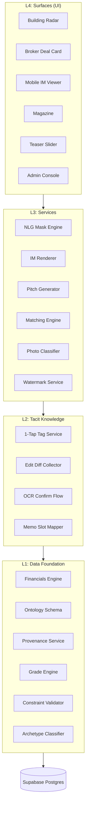
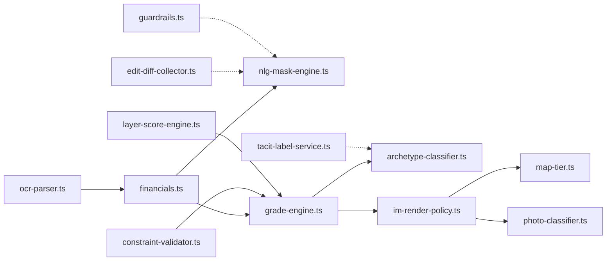

# CREDEAL v3 개발자 온보딩 가이드

> **버전**: v1.0 (2026-07-28)
> **대상**: v3 코드베이스에 새로 합류하는 개발자, AI 에이전트

---

## 1. 시스템 아키텍처

### 4-Layer Architecture



### 디렉토리 구조

```
cre-dealcard/
├── src/
│   ├── app/                    # Next.js App Router 페이지
│   ├── components/             # React UI 컴포넌트
│   ├── domain/
│   │   └── building/           # ⭐ v3 핵심 도메인 모듈 (13개)
│   │       ├── index.ts        # Barrel Export (공개 API 진입점)
│   │       ├── financials.ts   # L1: 재무 중앙 계산
│   │       ├── grade-engine.ts # L1: 데이터 등급
│   │       ├── constraint-validator.ts  # L1: 제약 검증
│   │       ├── archetype-classifier.ts  # L1: 딜 분류
│   │       ├── guardrails.ts   # L1: 법적 가드레일
│   │       ├── ocr-parser.ts   # L2: OCR 파싱
│   │       ├── tacit-label-service.ts   # L2: 암묵지 태깅
│   │       ├── edit-diff-collector.ts   # L2: 편집 Diff
│   │       ├── nlg-mask-engine.ts       # L3: NLG 마스크
│   │       ├── im-render-policy.ts      # L3: IM 정보 노출
│   │       ├── map-tier.ts     # L3: 좌표 프라이버시
│   │       ├── photo-classifier.ts      # L3: 사진 분류
│   │       ├── layer-score-engine.ts    # L1: 문서 완비 점수
│   │       └── mobile-im/      # 레거시 모바일 IM 모듈 (29개, 수정 금지)
│   ├── ai/                     # AI 프롬프트 및 에이전트 로직
│   ├── contracts/              # Zod 스키마 계약
│   ├── hooks/                  # React 커스텀 훅
│   ├── lib/                    # 유틸리티 라이브러리
│   ├── tests/                  # 테스트 스위트
│   │   ├── domain/             # 도메인 유닛 테스트
│   │   ├── ai/                 # AI 관련 테스트
│   │   ├── api/                # API 통합 테스트
│   │   ├── db/                 # 데이터베이스 테스트
│   │   ├── cross-system/       # 교차 시스템 테스트
│   │   └── e2e/                # E2E 테스트
│   └── types/                  # 전역 타입 정의
├── scripts/
│   └── ci/                     # CI 검사 스크립트
├── supabase/
│   └── migrations/             # DB 마이그레이션 (00001~0130+)
└── docs/
    └── credal_v3/              # v3 설계 문서 번들
        ├── SDD.md              # 시스템 설계 문서
        ├── TASKS.md            # 마스터 태스크 인덱스
        ├── ontology/           # 온톨로지 스키마 (SSoT)
        ├── specs/              # 기능 명세서
        ├── legal/              # 법무 카피 팩
        ├── design/             # 와이어프레임
        ├── audit/              # 기술 감사 보고서
        └── strategy/           # 사업 전략 (코드 문맥 제외)
```

---

## 2. 핵심 설계 원칙 (5대 불변 규칙)

### 🔴 Rule #1: 재무 중앙화 (Financial Centralization)

**모든 재무 계산은 반드시 `financials.ts`를 경유해야 합니다.**

```typescript
// ✅ 올바른 사용법
import { calculateNOI, computeFinancialSummary } from '@/domain/building';
const summary = computeFinancialSummary(inputs);

// ❌ 금지 — UI 컴포넌트 내 직접 계산
const noi = income - expenses; // CI 차단됨!
```

- **검증**: `scripts/ci/check-ui-financials.ts`가 `src/components/` 및 `src/app/` 내 재무 패턴을 탐지
- **참조**: SDD §5 S0-T1, S0-T2, S0-T12

### 🔴 Rule #2: 프로비넌스 4-Tier (Provenance Tracking)

**`assets` 테이블의 `attrs` 기록 시 반드시 `provenance` 필드를 동반해야 합니다.**

| Tier | 출처 | 예시 |
|------|------|------|
| T1 | 공공 API 자동 수집 | 건축물대장, 등기 |
| T2 | 사용자 직접 입력 | 카카오 메모, 수동 입력 |
| T3 | OCR 추출 (확인 전) | 등기부 OCR |
| T4 | AI 추론/파생 | LLM 추출, 규칙 기반 계산 |

### 🔴 Rule #3: OCR 확인 필수 (Rule #11)

**OCR 추출 결과는 절대로 자동 저장되지 않습니다.** 반드시 사용자 확인 화면을 거쳐야 합니다.

```typescript
const result = parseDocumentOCR(rawText, 'registry');
// result.requiresConfirmation === true (항상)
// 사용자가 확인한 후에만 confirmOCRResult()로 저장
```

### 🔴 Rule #4: NLG 마스크 (Anti-Hallucination)

**LLM은 결정론적 마스크 템플릿을 통해서만 재무 수치를 출력합니다.**

```typescript
// NLG 마스크가 financials.ts 결과를 안전하게 텍스트로 변환
const hero = renderHeroMask({ askingPrice: 8_000_000_000, capRate: 5.2, ... });
// → "매매가 80억 · Cap Rate 5.2% · NOI 4.16억"
```

### 🔴 Rule #5: K-익명성 재식별 차단

| 권역 | K값 | 의미 |
|------|-----|------|
| 강남/서초/성동 | K=30 | 30개 이상 유사 매물 중 식별 불가 |
| 기타 권역 | K=20 | 20개 이상 유사 매물 중 식별 불가 |

---

## 3. 도메인 모듈 의존 관계



**모듈 Import 규칙**: `src/domain/building/index.ts` barrel export를 통해 임포트합니다.

```typescript
import {
  calculateNOI,
  computeDataGrade,
  validateAssetConstraints,
  classifyDealArchetype,
} from '@/domain/building';
```

---

## 4. CI Check Suite (13종)

```bash
# 전체 CI 검사 실행
npx tsx scripts/ci/run-all-checks.ts
```

| # | 검사 ID | 설명 | 차단 수준 |
|---|---------|------|-----------|
| 1 | `ui-financials` | UI 내 재무 직접 계산 탐지 | 🔴 ERROR |
| 2 | `provenance-guard` | attrs 기록 시 provenance 누락 탐지 | 🔴 ERROR |
| 3 | `rag-hygiene` | RAG 인덱싱 위생 위반 | 🔴 ERROR |
| 4 | `cold-mode-guard` | Cold 모드 가격 의견 차단 | 🔴 ERROR |
| 5 | `event-naming` | 이벤트명 중복 검사 | 🟡 WARN |
| 6 | `nlg-mask-bypass` | NLG 마스크 우회 탐지 | 🔴 ERROR |
| 7 | `disclosure-escape` | 정보 공개 정책 위반 | 🔴 ERROR |
| 8 | `ocr-auto-save` | OCR Rule #11 자동저장 차단 | 🔴 ERROR |
| 9 | `k-anonymity` | K-익명성 임계값 위반 | 🔴 ERROR |
| 10 | `coord-fuzzy` | 좌표 퍼지 오프셋 누락 | 🔴 ERROR |
| 11 | `watermark-check` | 동적 워터마크 누락 | 🟡 WARN |
| 12 | `mobile-im-readonly` | mobile-im/ 디렉토리 수정 차단 | 🔴 ERROR |
| 13 | `ontology-drift` | 온톨로지 YAML과 코드 불일치 | 🟡 WARN |

---

## 5. 테스트 실행 가이드

### 전체 테스트 실행

```bash
npx vitest run                      # 전체 (341개)
npx vitest run --reporter=verbose   # 상세 출력
```

### Stage별 선택 실행

```bash
npx vitest run src/tests/domain/stage0   # Stage 0만
npx vitest run src/tests/domain/stage1   # Stage 1만
npx vitest run src/tests/domain/stage3   # Stage 3만
```

### 특정 모듈 테스트

```bash
npx vitest run financials        # 재무 계산
npx vitest run grade-engine      # 등급 엔진
npx vitest run guardrails        # 가드레일
```

### 테스트 작성 규칙

1. 테스트 파일명: `{module-name}.test.ts`
2. 위치: `src/tests/domain/stage{N}/`
3. 순수 함수 테스트: 외부 의존성(DB, API) 없이 순수 로직만 검증
4. 경계값 테스트: 0, 음수, undefined 등 edge case 필수 포함

---

## 6. DB 마이그레이션 가이드

### 마이그레이션 파일 구조

```
supabase/migrations/
├── 00001_mvp_schema.sql          # MVP 기본 스키마
├── 00002~00066_*.sql             # MVP 점진 확장
├── 0100_assumptions.sql          # Stage 0: assumptions 테이블
├── 0110_ontology_schema.sql      # Stage 1: assets, deals, lease_units 등
├── 0120_tacit_labels.sql         # Stage 2: tacit_labels 테이블
├── 0121_edit_diffs.sql           # Stage 2: edit_diffs 테이블
└── 0130_im_tiering.sql           # Stage 3: im_tiering 정책
```

### 새 마이그레이션 추가 규칙

1. 번호 체계: `{NNNN}_{설명}.sql` (다음 번호 순차 부여)
2. Stage 0~3 범위: `0100~0199`
3. Stage 4+ 범위: `0200~0299`
4. 반드시 `DOWN` (롤백) 쿼리 주석 포함

---

## 7. 문서 우선순위 규칙

문서 간 충돌 시 아래 순서를 따릅니다:

| 순위 | 문서 | 역할 |
|------|------|------|
| 1 | `ontology/credeal-ontology-v0.1.yaml` | 스키마/규칙 SSoT |
| 2 | `TASKS.md` | 태스크 순서/의존 SSoT |
| 3 | `SDD.md` / `SDD-magazine.md` / `SDD-stage4.md` | 구현 명세 |
| 4 | `specs/` 문서들 | 기능 상세/UX |
| 5 | `strategy/` 문서들 | 비전/전략 (코드 문맥 제외) |

---

## 8. 코드 컨벤션

### Import 규칙
```typescript
// 도메인 모듈은 반드시 barrel export에서 임포트
import { calculateNOI } from '@/domain/building';

// 직접 파일 임포트 금지
// import { calculateNOI } from '@/domain/building/financials'; // ❌
```

### 금기 사항 (절대 금지)

| # | 금지 행위 | 이유 |
|---|-----------|------|
| 1 | UI에서 `* - * / * +` 등 재무 연산 | Rule #1 위반, CI 차단 |
| 2 | `mobile-im/` 디렉토리 내 파일 수정 | 레거시 보존 정책 |
| 3 | OCR 결과 자동 DB 저장 | Rule #11 위반 |
| 4 | LLM 프롬프트에 재무 수치 직접 삽입 | Rule #4 위반 |
| 5 | `strategy/` 문서를 코드 구현 근거로 사용 | SSoT 우선순위 위반 |

### Naming Convention

- 파일명: `kebab-case.ts`
- 함수명: `camelCase`
- 인터페이스: `PascalCase`
- 상수: `UPPER_SNAKE_CASE`
- 테스트: `{module-name}.test.ts`

---

## 9. 배포 프로세스

```bash
# 1. 로컬 검증 (필수)
npm run build                     # 빌드 성공 확인
npx vitest run                    # 테스트 통과 확인
npx tsx scripts/ci/run-all-checks.ts  # CI 검사 통과 확인

# 2. 배포
git add -A && git commit -m "feat: description"
git push origin main              # → Vercel 자동 배포 트리거

# 3. 긴급 수동 배포 (대체)
npx vercel --prod
```

---

## 10. 트러블슈팅

| 증상 | 원인 | 해결 |
|------|------|------|
| CI `ui-financials` 실패 | 컴포넌트에서 재무 연산 사용 | `financials.ts` 함수로 위임 |
| `provenance-guard` 실패 | attrs 저장 시 출처 누락 | `provenance` 필드 추가 |
| 타입 에러 대량 발생 | 온톨로지 YAML 변경 후 | `ontology-loader` 재실행 |
| OCR 테스트 실패 | `requiresConfirmation` 누락 | `parseDocumentOCR()` 반환값 확인 |
| 마이그레이션 충돌 | 번호 중복 | 다음 순번으로 재지정 |

---

*Updated: 2026-07-28 · CREDEAL v3 Developer Guide v1.0*
