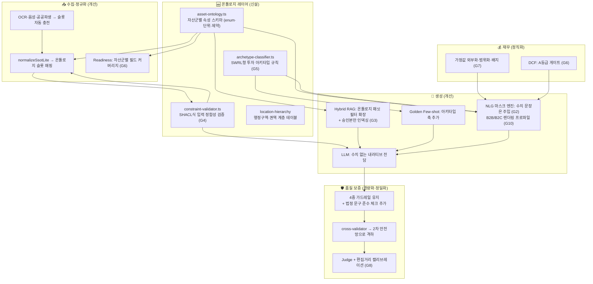

# 📄 모바일 IM 고도화 개선 방안 — 기술 감사 기반 정밀 분석

> **버전**: v1.0 (2026.07.23)
> **입력 문서**: 「Mobile IM — AI·시맨틱 기술 정밀 감사 보고서」(37개 소스 파일, ~260KB 스택)
> **목적**: 현행 기술 스택의 정밀 평가 → 구조적 공백 도출 → 온톨로지·시맨틱 기술을 반영한 모듈 단위 고도화 방안
> **결론 한 줄**: 현 시스템은 **"텍스트를 잘 다루는" 세계 수준의 파이프라인**이다. 다음 단계는 텍스트 아래에 **"개념을 아는" 온톨로지 레이어**를 까는 것 — 그러면 환각 방어가 '탐지'에서 '원천 차단'으로, 품질이 '확률'에서 '구조'로 바뀐다.

---

## 1. 감사 결과 총평

### 1.1 세계 수준으로 평가되는 것 (건드리지 말 것)

| 요소 | 평가 근거 |
|------|-----------|
| **재무의 프로그래밍 방식 사전계산** | NOI·Cap Rate·IRR(Newton-Raphson)·DCF·WALE를 코드로 계산 후 "수치를 변경하지 마세요" 지시와 함께 주입 — AI 환각의 가장 위험한 영역(숫자)을 LLM 밖으로 빼낸 올바른 설계 |
| **SectionContext 앵커링 + 교차 검증** | 사전(수치 앵커 전파) + 사후(578줄 교차 검증) 양면 방어. 섹션별 독립 생성의 고질병을 정면 대응 |
| **4중 가드레일 + LLM-as-Judge** | Hallucination→Regex→LLM Semantic→Disclosure 계층 방어 + 5차원 가중 평가 + 확률적 샘플링(비용 최적화) — 규제 산업 AI의 모범 구현 |
| **Golden IM 자기진화 루프** | 생성→Judge≥4.5 후보 등록→브로커 승인→Few-shot 재사용→효과 분석→자연 도태. 외부 IM 입수 파이프라인(3-Layer 분류)까지 갖춤 |
| **Fail-safe 일관성** | 모든 AI 호출 지점에 fallback (Premium Template, fail-open+면책, non-blocking 인덱싱) |
| **Forward-only 상태 머신** | 생성 순서 강제 — 맥락 전파의 전제 조건을 구조로 보장 |

### 1.2 구조적 공백 — 이 문서의 핵심

현 스택의 정규화·검증·검색은 모두 **문자열 레벨**에서 작동한다:

- `terminology-normalizer`: 구어체 **문자열**을 표준 **문자열**로 치환
- `cross-validator`: 생성된 **텍스트에서** 정규식으로 수치를 **다시 추출**해 비교
- `cre-rag-service`: **텍스트 임베딩** + asset_type/region **2개 태그**로 검색
- `data-provenance`: **8개 포인트만** 추적

즉, 시스템은 "450평"이 "1,487.6㎡"라는 것은 알지만, **"이 건물이 중로각지에 접한 3종일반주거지역의 명도 미완료 자산"이라는 개념 구조는 모른다.** 이 공백이 아래 10개 문제의 공통 원인이다.

---

## 2. 레이어별 정밀 분석

### 2.1 데이터 수집·정규화 레이어

| 항목 | 현재 | 한계 |
|------|------|------|
| Readiness Checker | 7개 데이터포인트 가중 점수, 40점 컷 | 포인트가 얕음(주소·월세·유형·가격대·권역·공실·사진·코멘트). **자산군별로 정말 중요한 필드(렌트롤·명도상태·도로접면·물류스펙)가 점수 체계에 없음** — "생성 가능"과 "설득 가능"의 괴리 |
| normalizeSsotLite | flat↔중첩 양방향 | 스키마가 느슨함(Zod 있으나 CRE 도메인 제약 없음). **입력 데이터 자체의 정합성 검증 부재**: 용적률>법정상한, 보증금+대출>매각가 같은 모순이 그대로 파이프라인 진입 |
| terminology-normalizer | 3-tier(함수형+DB+하드코딩), 활용형 처리 | 단방향(구어→표준)·단일 레지스터. **B2C(개인 자산가) 방향 변환 없음** — "WALE 2.5년"을 "세입자 평균 잔여 계약 2.5년"으로 푸는 역방향 어휘가 없음 |

### 2.2 시맨틱 AI 레이어

| 항목 | 현재 | 한계 |
|------|------|------|
| Hybrid RAG | Vector+Tag+BM25, top-2 주입 | ① 태그가 asset_type/region 2개뿐 — **가격대·Cap 밴드·명도상태·도로접면 등 구조화 필터 없음** → "성수 꼬마빌딩"은 찾지만 "명도 완료된 코너 개발형"은 못 찾음. ② **자기 오염 리스크**: 생성된 모든 IM을 인덱싱 → AI 생성 텍스트가 다음 생성의 '유사사례'로 재주입되는 순환(할루시네이션 세탁 가능성) |
| Golden Few-shot | 자산유형·가격대별 동적 검색 | 검색 축이 2개(자산유형·가격대) — 딜 유형(수익형/개발형/사옥형)별 문체 차이를 반영 못함 |
| Prompt A/B | 슬롯별 무작위 + Judge 상관분석 | Judge가 동일 LLM 계열 — **자기 선호 편향**. 인간 그라운드 트루스(브로커 편집)와의 캘리브레이션 부재 |
| 맥락 전파 | keyFacts+요약+수치 앵커 5종 | 앵커가 5개 필드로 고정 — 물류(층고·도크)·개발부지(명도·허가) 앵커 없음 |

### 2.3 품질 보증 레이어

| 항목 | 현재 | 한계 |
|------|------|------|
| cross-validator | 6개 지표 정규식 추출·비교 | **근본적으로 사후 고고학**: LLM이 자유 생성한 텍스트에서 수치를 정규식으로 캐내는 방식은 표현 변형("삼십억", "3,000백만")에 취약하고 유지비가 큼(578줄). 수치가 애초에 자유 생성되지 않으면 이 모듈의 부담이 급감 |
| guardrails (Regex 8범주) | P0 차단·High 경고 | 공인중개사법·표시광고법 **법정 필수 문구 체크는 없음**(금지 표현만 있음). 단위·반올림 정책 검증 없음 |
| Judge 5차원 | 가중 평가+확률 샘플링 | factual_accuracy를 LLM이 판단 — 구조화 데이터와의 **기계 대조가 아닌 의미 판단**이라 수치 오류를 놓칠 수 있음 |
| Disclosure Guard | 5개 보호 필드 | 임차인명 탐지가 열거 기반(스타벅스·이마트 등)으로 추정 — 롱테일 상호명 누출 가능 |

### 2.4 재무 엔진 레이어

| 항목 | 현재 | 한계 |
|------|------|------|
| 운영비율 | 자산유형별 하드코딩(오피스15%·물류12%·상가20%…) | 합리적 기본값이나 **provenance가 ai_inferred로 명시·표기되는지 불명확**. 실제 OPEX 입력 시 대체 경로 필요 |
| Value-Add 엔진 | 리모델링 30만원/㎡ 고정 단가 | 2026년 공사비 급등 환경에서 고정 단가는 신뢰 리스크 — 범위·연도 표기 필요 |
| DCF 민감도 | 3×3 매트릭스 상시 산출 | **데이터 등급과 무관하게 노출되면 과잉 정밀** — B등급 이하에서 10년 NPV는 근거 대비 과한 확신 신호 |
| 벤치마킹 | 권역 시세·공실 상대 비교 | 비교사례 선정 기준(반경·기간·유사도)의 명시성 부족 — "왜 이 사례와 비교했나"에 답 못하면 설득력 반감 |

### 2.5 종합: 문제의 공통 뿌리

```
[공통 원인] 표준 개념 스키마(온톨로지)의 부재
     │
     ├─ Readiness가 자산군별 핵심 필드를 모름 (2.1)
     ├─ 입력 모순이 검증 없이 파이프라인 진입 (2.1)
     ├─ RAG 필터 축이 2개뿐 (2.2)
     ├─ 수치를 텍스트에서 재추출하는 역설 (2.3)
     ├─ Provenance가 8개 포인트에 멈춤 (2.3)
     └─ B2B/B2C 이중 렌더링 불가 (2.1)
```

---

## 3. 핵심 보완 포인트 10선 (Gap Analysis)

### G1. 문자열 정규화 → 개념 정규화 (온톨로지 레이어 신설) `구조적·최우선`

- **현재**: terminology-normalizer가 문자열을 치환. 시스템은 어휘를 알지만 개념을 모름
- **개선**: 자산군별 **속성 마스터 스키마**를 타입 레이어로 신설 — 꼬마빌딩(도로접면 12분류·주차방식·명도조건·TI/LC…), 물류(유효층고·바닥하중·램프구조·저온비율·수전용량·마스터리스…), 개발부지(지목·형상·토지거래허가·기부채납·점유자유형…)를 enum+단위+제약으로 정의
- **구현**: `asset-ontology.ts` (Zod 스키마 확장) + 행정구역·권역 계층 테이블. 트리플스토어 불필요 — **"온톨로지적으로 사고하고, 관계형으로 구현"**
- **파급**: G2~G6, G10이 모두 이 레이어 위에서 작동

### G2. 수치 '탐지' → 수치 '주입' (NLG 마스크 엔진) `환각 원천 차단`

- **현재**: 재무는 사전계산해 주입하지만, LLM이 산문 속에서 수치를 **자유 서술**하고 cross-validator가 사후에 정규식으로 잡아냄
- **개선**: 수치 포함 문장은 **슬롯 템플릿(NLG 마스크)**으로 생성 — `"본 자산의 세전 Cap Rate는 {capRate}%로 권역 평균 대비 {delta}bp {direction}입니다"` 식으로 검증 필드값을 렌더링. LLM은 수치 없는 내러티브(투자 가설·맥락 연결)만 담당
- **효과**: ① 수치 환각이 구조적으로 불가능 ② cross-validator는 1차 방어에서 **2차 안전망**으로 격하(유지비 급감) ③ 문장 단위 provenance 배지 자동 부착 가능
- **구현**: `nlg-mask-engine.ts` — 마스크 템플릿은 골든셋과 동일한 방식으로 브로커 편집을 통해 진화

### G3. RAG 자기 오염 방지 `데이터 위생`

- **현재**: 생성된 모든 IM을 임베딩 인덱싱 → AI 생성 텍스트가 다음 생성의 '유사사례'로 재주입되는 순환
- **개선**: ① **브로커 승인·발행본만 인덱싱** (초안 제외) ② 인덱스에 provenance 태그(golden/approved/draft) 저장, 검색 랭킹에서 golden > approved 가중 ③ 동일 매물 재생성 시 자기 자신 제외 ④ 유사도 상한(near-duplicate 억제)
- **구현**: `im-embedding-indexer.ts` upsert 조건 수정 + `match_im_documents` RPC 랭킹 보정

### G4. 입력 데이터 정합성 검증 (SHACL식 제약) `사전 방어`

- **현재**: Hallucination Guard는 **출력**을 검사. **입력** 모순(용적률>법정상한, 보증금+대출>매각가, 준공연도>현재)은 그대로 통과
- **개선**: 생성 **전** 제약 검증 단계 신설 — 온톨로지 스키마의 필드 제약(범위·단위·관계식)을 일괄 체크. 위반 시 차단이 아닌 **경고+수정 유도**(브로커 화면에 "확인 필요" 표시)
- **구현**: `constraint-validator.ts` — 상태 머신의 `data_collection → property_overview` 전이 게이트로 삽입

### G5. 추론 규칙 엔진 — 투자 아키타입 자동 분류 `thesis 근거화`

- **현재**: investment_thesis 섹션이 순수 LLM 생성 — "왜 사야 하는가"의 근거가 확률적
- **개선**: SWRL형 규칙으로 딜 아키타입을 **결정론적으로 분류** 후 thesis의 뼈대로 주입:
  - `공실률<3% ∧ WALT≥2.5년 ∧ 역세권≤5분` → **초안정 수익형**
  - `연식≥25년 ∧ 용적률여유≥40%p` → **밸류애드 증축형**
  - `명도완료 ∧ 도로폭≥8m ∧ 비맹지` → **사옥 신축 적합**
  - `마스터리스 ∧ WALT≥5년 ∧ Cap≥5.5%` → **기관 투자 적합 물류**
  - `점유자=소유자 ∧ AsIs` → **명도 고위험** (감점·리스크 섹션 강조)
- **효과**: thesis가 "AI 의견"에서 "규칙 충족 근거"로 격상, 동일 규칙을 매칭 엔진과 공유(설명 가능 매칭), 아키타입별 골든셋·프롬프트 선택 축 추가(G8 연계)
- **구현**: `archetype-classifier.ts` — 규칙 10선으로 시작, 코드/SQL 조건문이면 충분

### G6. Readiness·품질등급의 온톨로지 기반 재정의 `측정 정확화`

- **현재**: 7개 범용 포인트 40점 컷 — 자산군 무관 동일 기준
- **개선**: **자산군별 필드 커버리지**로 재정의 — 물류 IM은 층고·도크 없이 A등급 불가, 개발부지 IM은 명도상태·허가구역 없이 B등급 불가. DCF·민감도 매트릭스는 A등급에서만 노출(과잉 정밀 차단)
- **구현**: `readiness.ts`·`data-quality-badge.ts`를 온톨로지 필드 가중치 테이블 기반으로 교체

### G7. 하드코딩 가정의 출처화·범위화 `정직한 불확실성`

- **현재**: 운영비율(유형별 고정), 리모델링 단가(30만원/㎡), WACC 가정이 코드 상수
- **개선**: ① 모든 가정값에 provenance `ai_inferred` 배지 + "가정" 명시 ② 리모델링 단가는 연도 표기 범위(예: "2026년 기준 ㎡당 약 28~38만원")로 ③ 실측값 입력 시 가정 대체 경로(OPEX 실적, 견적서 업로드) ④ 민감 수치는 Best/Base/Worst 3-시나리오 유지·강화
- **구현**: `financials.ts`·`value-add-engine.ts` 상수를 `assumptions` 테이블로 외부화(분기별 갱신)

### G8. Judge 캘리브레이션 — 브로커 편집을 그라운드 트루스로 `평가 정확화`

- **현재**: LLM-as-Judge 단독(자기 선호 편향 가능), A/B는 Judge 점수와만 상관분석
- **개선**: **브로커 편집 거리(edit distance)를 암묵 라벨**로 활용 — 편집이 적을수록 좋은 생성. Judge 점수 vs 편집 거리 상관을 정기 검증해 Judge 루브릭을 보정. 편집 diff는 골든셋 후보로 자동 수집(기존 fewshot-tracker 확장)
- **구현**: `save-sections` API에서 diff 저장 → `fewshot-tracker.ts`에 edit_distance 컬럼 추가 → 주간 캘리브레이션 리포트

### G9. 의존성 기반 부분 재생성 `비용·일관성 동시 개선`

- **현재**: Forward-only 전체 재생성 — 브로커가 매각가 하나 수정해도 7섹션 전체 재생성(30~60초·비용)
- **개선**: 온톨로지 **필드→섹션 의존성 맵**(매각가→④⑥, 렌트롤→③④, 명도→⑤⑥…)으로 영향 섹션만 선택 재생성, 수치 앵커는 재계산 값으로 갱신·전파
- **구현**: `im-generation-state-machine.ts`에 `regenerate(sections[], invalidatedAnchors)` 전이 추가 — Forward-only 원칙은 재생성 서브플로우 내에서 유지

### G10. B2B/B2C 이중 렌더링 — normalizer의 양방향화 `설득력`

- **현재**: 정규화가 구어→표준 단방향. 모든 독자가 같은 문서를 받음
- **개선**: 온톨로지 속성별 **이중 어휘 사전** — B2B("세전 자본환원율 4.8%, 권역 대비 30bp 우세") / B2C("보증금 빼고 실제 들어가는 돈 대비 연 4.8%가 매달 들어옵니다"). NLG 마스크(G2)의 렌더링 프로파일로 구현, 발행 시 독자 유형 선택 또는 두 링크 동시 생성
- **구현**: `terminology-normalizer.ts`의 DB 규칙 테이블에 `register(B2B|B2C)` 축 추가 + 마스크 템플릿 이중화

---

## 4. TO-BE 아키텍처



**설계 요지**: LLM의 역할을 "문서 전체 생성"에서 **"검증된 구조 위의 내러티브 작성"**으로 좁힌다. 수치·법적 표현·아키타입 판정은 결정론 영역으로 이관하고, 기존 4중 가드레일은 유지하되 부담을 줄인다.

---

## 5. 실행 로드맵

| 순위 | 과제 | 대상 모듈 | 공수 | 효과 |
|------|------|-----------|------|------|
| **P0** | G4 입력 정합성 검증 + 법정 문구 체크 | `constraint-validator.ts`(신설), `guardrails.ts` | 소 | 모순 데이터·법적 리스크 사전 차단 |
| **P0** | G3 RAG 인덱싱 위생 (승인본만·provenance 태그) | `im-embedding-indexer.ts`, RPC | 소 | 자기 오염 순환 차단 — 방치 시 누적 악화 |
| **P0** | G7 가정값 배지·범위화 + G6 DCF A등급 게이트 | `financials.ts`, `value-add-engine.ts`, `data-quality-badge.ts` | 소 | 과잉 정밀 제거 — 신뢰 복원 |
| **P1** | G1 온톨로지 스키마 레이어 | `asset-ontology.ts`(신설), `types.ts`, 계층 테이블 | 중 | 이후 모든 개선의 기반 |
| **P1** | G6 Readiness·등급 재정의 | `readiness.ts`, `data-quality-badge.ts` | 소 | 자산군별 품질 측정 정확화 |
| **P1** | G8 편집거리 수집·Judge 캘리브레이션 | `fewshot-tracker.ts`, save-sections API | 소 | 골든셋 루프 자동화 + 평가 신뢰화 |
| **P2** | G2 NLG 마스크 엔진 (핵심 수치 문장부터 단계 적용) | `nlg-mask-engine.ts`(신설), `narrative-prompt.ts` | 중 | 수치 환각 원천 차단, cross-validator 부담 급감 |
| **P2** | G5 아키타입 규칙 엔진 | `archetype-classifier.ts`(신설) | 소 | thesis 근거화 + 매칭 공유 |
| **P2** | G1 확장: RAG 패싯 필터·Few-shot 아키타입 축 | `cre-rag-service.ts`, `golden-im-manager.ts` | 중 | 검색·예시 정밀도 상승 |
| **P3** | G10 B2B/B2C 이중 렌더링 | `terminology-normalizer.ts`, 마스크 프로파일 | 중 | 독자별 설득 최적화 |
| **P3** | G9 의존성 기반 부분 재생성 | `im-generation-state-machine.ts`, `writer.ts` | 중 | 재생성 비용·시간 70%↓ |

**적용 순서의 논리**: P0는 코드 몇 곳의 수정으로 리스크(오염·과잉정밀·법적)를 즉시 제거한다. P1이 온톨로지 기반을 깔고, P2가 그 위에서 생성 방식을 전환하며, P3는 경험·비용 최적화다. **G2(NLG 마스크)를 전면 전환이 아닌 '핵심 수치 문장부터 단계 적용'하는 이유**: 기존 파이프라인의 품질이 이미 높으므로, 빅뱅 교체보다 히어로 카드·수익 분석 섹션의 수치 문장부터 마스크로 바꾸고 Judge·편집거리로 효과를 검증하며 확대하는 것이 안전하다.

---

## 6. 성공 지표

| 지표 | 현재 (추정) | 목표 | 검증 방법 |
|------|------------|------|-----------|
| cross-validator critical 검출 건수 | 발생 중 | **80%↓** (마스크 적용 섹션) | G2 적용 전후 비교 |
| 입력 모순 통과 건수 | 미측정 | **0건** | G4 게이트 로그 |
| RAG 검색 정밀도 (브로커 평가) | — | 유사사례 채택률 상승 | 프롬프트 주입 사례의 실제 참조율 |
| AI 초안 대비 편집 거리 | — | **하향 추세** | G8 수집 데이터 — 품질의 최종 프록시 |
| DCF 노출 중 A등급 비율 | 무관 노출 | **100%** | G6 게이트 |
| 자산군별 A등급 IM 비율 | ~20% | **50%+** | 온톨로지 커버리지 기준 |
| 섹션 재생성 평균 비용·시간 | 전체 재생성 | **70%↓** | G9 적용 후 |

---

## 7. 하지 말아야 할 것

- ❌ **트리플스토어·OWL 추론엔진 도입** — 현 규모에서 과잉. Zod 스키마 확장 + 계층 테이블 + 규칙 함수로 동일 효용 (그래프 DB는 브로커 수백 명·매물 수만 건에서 재검토)
- ❌ **NLG 마스크 빅뱅 전환** — 기존 생성 품질이 높으므로 수치 문장부터 단계 적용·검증
- ❌ **cross-validator 폐기** — 마스크 미적용 구간과 LLM 내러티브의 안전망으로 존치 (역할만 격하)
- ❌ **모든 생성 IM의 계속 인덱싱** — 승인본만. 자기 오염은 조용히 누적되다 한꺼번에 터진다
- ❌ **Judge 차원 추가 경쟁** — 차원을 늘리기보다 편집거리 캘리브레이션으로 기존 5차원의 정확도를 올리는 것이 먼저
- ❌ **하드코딩 가정의 무배지 노출** — 운영비율·리모델링 단가·WACC는 반드시 "가정" 표시와 범위로

---

## 부록: 감사 문서와의 대응표

| 감사 문서 섹션 | 본 문서의 대응 |
|----------------|----------------|
| §2.1 오케스트레이션 | 유지 + G9(부분 재생성) |
| §2.2 프롬프트 시스템 | 유지 + G2(마스크 결합)·G5(아키타입 힌트) |
| §2.3 LLM-as-Judge | 유지 + G8(편집거리 캘리브레이션) |
| §2.4 4중 가드레일 | 유지 + 법정 문구 체크 추가, G2로 부담 경감 |
| §2.5 Golden 루프 | 유지 + 아키타입 검색 축, G8 diff 수집 통합 |
| §3.1 Hybrid RAG | G3(위생) + 패싯 필터 확장 |
| §3.2 용어 정규화 | G10(양방향·레지스터화) |
| §3.3 교차 검증 | G2로 2차 안전망 격하 |
| §3.5 Provenance | 8개 → 온톨로지 전 필드로 확장, 문장 단위 배지(G2 부산물) |
| §4 재무 엔진 | G6(등급 게이트)·G7(가정 정직화) |
| §5 상태 머신 | G4(검증 게이트 삽입)·G9(재생성 전이) |
| §6.2 Readiness | G6(자산군별 재정의) |

> **최종 결론**: 현 시스템의 다음 도약은 더 좋은 프롬프트나 더 큰 모델이 아니라, **파이프라인 전체가 공유하는 개념 스키마(온톨로지)**다. 그것이 깔리면 — 수치는 주입되고(G2), 입력은 검증되며(G4), 검색은 정밀해지고(G3·G1), 논지는 근거를 갖고(G5), 품질 측정은 정확해진다(G6·G8). 텍스트를 잘 다루는 시스템에서 **딜을 이해하는 시스템**으로.
