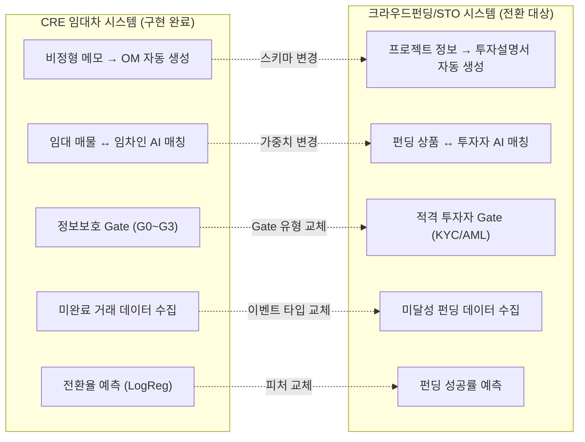
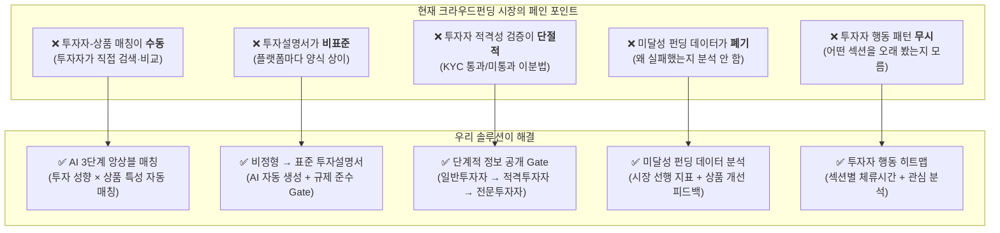
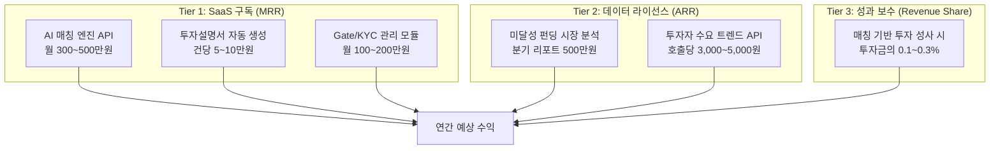
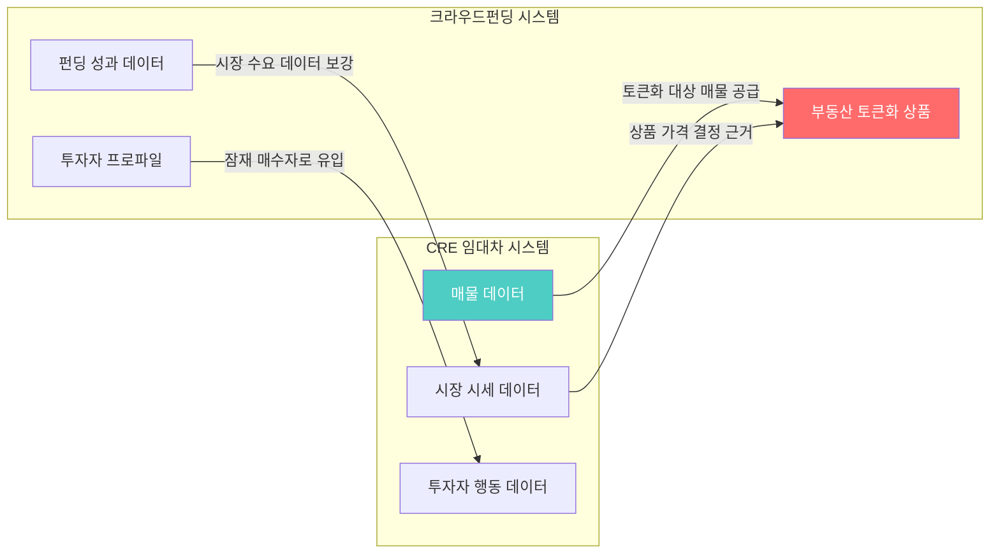
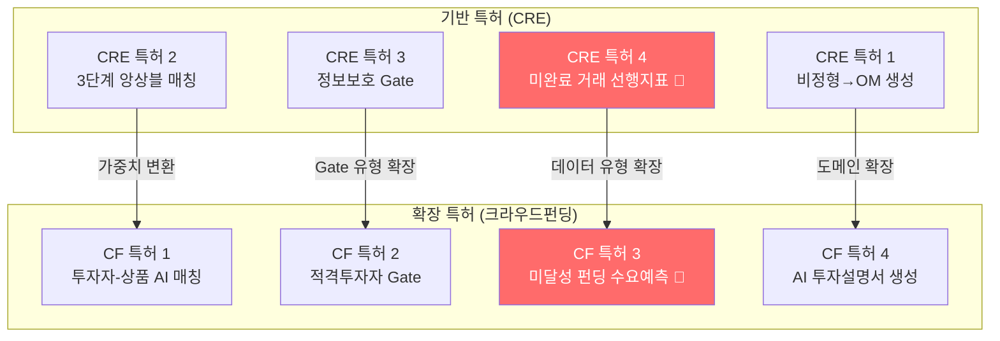

# CRE AI 매칭 → 크라우드펀딩/STO 시장 확장 전략 및 특허 출원안

> **문서 버전**: v1.0 | **작성일**: 2026-05-25  
> **목적**: CRE 임대차 AI 매칭 시스템의 핵심 기술을 크라우드펀딩(Crowdfunding) 및 조각투자(STO) 시장으로 확장하고, 해당 솔루션을 크라우드펀딩 기업에 B2B 라이선스로 제공하기 위한 전략 수립

---

## Part 1: CRE → 크라우드펀딩 구조적 동형 사상(Isomorphism)

### 1-A. 핵심 발견 — 왜 즉시 전환 가능한가?



### 1-B. 핵심 개체(Entity) 1:1 매핑

| CRE 임대차 개체 | 크라우드펀딩/STO 개체 | 구조적 동일성 |
|---------------|-------------------|-------------|
| `lease_spaces` (임대 매물) | `funding_projects` (펀딩 상품) | **투자 대상 자산** |
| `tenant_intent` (임차인 의향서) | `investor_profile` (투자자 프로필) | **수요측 의향** |
| `lease_match_results` (매칭 결과) | `funding_match_results` (투자 매칭) | **매칭 결과 기록** |
| 중개인 (Broker) | 프로젝트 운영자 (Operator) | **공급측 에이전트** |
| 임차인 (Tenant) | 투자자 (Investor) | **수요측 플레이어** |
| 건물주 (Owner) | 발행인/시행사 (Issuer) | **자산 소유자** |
| 월세/보증금 | 투자금/수익률 | **가격 지표** |
| 입주 시기 | 투자 기간/만기 | **시간 제약** |
| 업종 제한 | 투자 유형 선호 | **카테고리 필터** |
| 블라인드 티저 | 투자 티저/요약 | **마케팅 자산** |

### 1-C. AI Agent 전환 매핑

| # | CRE Agent (구현 완료) | 크라우드펀딩 Agent | 변경 범위 |
|---|---------------------|-----------------|----------|
| 1 | `runLeaseBrokerDealCard` (메모→SSoT→티저) | `runFundingProjectCard` (프로젝트→투자설명서→티저) | 스키마 변경 (70% 재사용) |
| 2 | `tenant-intent-normalizer` (임차인 의향 정규화) | `investor-profile-normalizer` (투자자 성향 정규화) | 필드명 변경 (85% 재사용) |
| 3 | `lease-matching-engine` (3단계 매칭) | `funding-matching-engine` (3단계 매칭) | 가중치 프로파일 교체 (80% 재사용) |
| 4 | `deal-conversion-predictor` (전환율 예측) | `funding-success-predictor` (펀딩 성공률 예측) | 피처 교체 (75% 재사용) |
| 5 | `disclosure-guard-agent` (정보보호) | `kyc-aml-guard-agent` (적격 투자자 검증) | Gate 유형 교체 (60% 재사용) |
| 6 | `safe-language-agent` (법적 표현 검증) | `investment-disclosure-agent` (투자 권유 표현 검증) | 금지 표현 교체 (90% 재사용) |

**종합 코드 재사용률: 약 77%**

---

## Part 2: 크라우드펀딩 도메인 특화 설계

### 2-A. 크라우드펀딩/STO 시장의 구조적 문제점



### 2-B. 7대 핵심 모듈 전환 설계

---

#### 모듈 1: AI 투자설명서 자동 생성 엔진

**CRE 원본**: [lease-deal-card.ts](file:///c:/Users/User/cre-dealcard/src/ai/agents/lease-deal-card.ts)

```
CRE 파이프라인:
  브로커 메모 → LLM 파싱 → LeaseMemoParserOutputSchema → SSoT Lite → Blind Teaser

크라우드펀딩 파이프라인:
  프로젝트 개요 → LLM 파싱 → FundingProjectSchema → 투자 요약서 → 투자 티저
```

**FundingProjectSchema 주요 필드**:

| 필드 | 설명 | CRE 대응 |
|------|------|---------|
| `projectName` | 프로젝트명 | `building_name` |
| `assetType` | 자산 유형 (부동산/스타트업/아트/IP) | `space_type` |
| `targetAmount` | 목표 모집금액 | `deposit + monthly_rent * term` |
| `minInvestment` | 최소 투자금 | `budget_deposit_max` |
| `expectedReturn` | 예상 수익률 | 임대 수익률 |
| `investmentPeriod` | 투자 기간 | `lease_term_months` |
| `riskLevel` | 위험 등급 (1~5) | NEW |
| `tokenType` | 토큰 유형 (STO/증권형/수익형) | NEW |
| `regulatoryStatus` | 규제 승인 상태 | NEW |

---

#### 모듈 2: 투자자-상품 3단계 AI 매칭 엔진

**CRE 원본**: [lease-matching-engine.ts](file:///c:/Users/User/cre-dealcard/src/domain/matching/lease-matching-engine.ts)

```
CRE 3-Stage:
  Stage 1: 월세/보증금 상한 × 권역 × 면적 → Hard Filter
  Stage 2: 매물 텍스트 ↔ 의향 텍스트 → Semantic Similarity
  Stage 3: 유사도(40%) + 층수(20%) + 렌트(20%) + 인센티브(20%) → Ensemble

크라우드펀딩 3-Stage:
  Stage 1: 투자금 범위 × 자산 유형 × 위험 등급 × 투자 기간 → Hard Filter
  Stage 2: 상품 설명 ↔ 투자자 선호 키워드 → Semantic Similarity
  Stage 3: 유사도(35%) + 수익률 적합(25%) + 리스크 매칭(25%) + 유동성(15%) → Ensemble
```

**투자자 프로파일 (TenantIntent → InvestorProfile 전환)**:

| CRE 필드 | 크라우드펀딩 필드 | 역할 |
|---------|----------------|------|
| `business_type` | `investmentPreference` | 선호 자산 유형 |
| `preferred_regions` | `preferredSectors` | 선호 업종/섹터 |
| `area_min/max` | `investmentMin/Max` | 투자금 범위 |
| `budget_deposit_max` | `maxRiskTolerance` | 리스크 허용도 |
| `budget_monthly_max` | `expectedReturnMin` | 최소 기대 수익률 |
| `move_in_target` | `investmentHorizon` | 투자 기간 선호 |
| `must_have` | `mustHaveCriteria` | 필수 조건 |
| `nice_to_have` | `niceToHaveCriteria` | 우대 조건 |

---

#### 모듈 3: 적격 투자자 Gate 시스템

**CRE 원본**: 정보보호 Gate (G0~G3)

```
CRE Gate 체계:
  G0: 블라인드 (공개) → 권역/가격대만
  G1: 이메일 인증 → 상세 면적/층수
  G2: NDA 서명 → 정확한 주소/재무
  G3: 브로커 초대 → 건물주 정보

크라우드펀딩 Gate 체계:
  G0: 공개 티저 → 프로젝트명/예상수익률/자산유형
  G1: 회원가입 → 상세 투자설명서 열람
  G2: 일반투자자 인증 (KYC) → 위험고지 확인 + 투자 한도 안내
  G3: 적격투자자 인증 → 우선배정/대량투자 + 상세 재무자료
  G4: 전문투자자 인증 → 무한도 투자 + 원본 데이터 접근
```

> [!IMPORTANT]
> **크라우드펀딩에서의 Gate 시스템은 법적 필수 요건입니다.**  
> 자본시장법 제117조의12(온라인 소액투자중개업)에 따라 투자자 유형별 투자 한도 제한이 법적 의무이므로, 우리의 다단계 Gate 시스템은 **규제 준수의 핵심 인프라**가 됩니다.

---

#### 모듈 4: 미달성 펀딩 데이터 분석 엔진

**CRE 원본**: [deal-conversion-predictor.ts](file:///c:/Users/User/cre-dealcard/src/domain/prediction/deal-conversion-predictor.ts)

```
CRE 미완료 데이터:
  매칭 S등급 → 불전환 → 사유 분석 → 시장 시세 역산

크라우드펀딩 미달성 데이터:
  펀딩 목표 100% → 미달성(예: 67%) → 실패 사유 분석 → 시장 수요 예측
```

**FundingFeatureVector (DealFeatureVector 전환)**:

| CRE 피처 | 크라우드펀딩 피처 | 역할 |
|---------|----------------|------|
| `bestMatchGrade` | `investorFitScore` | 매칭 품질 |
| `currentStageOrd` | `fundingProgressPct` | 진행률 |
| `totalHoldDays` | `daysSinceOpen` | 공모 이후 경과일 |
| `sGradeCount` | `highFitInvestorCount` | 최적 투자자 수 |
| `matchedBuyerCount` | `matchedInvestorCount` | 매칭된 투자자 수 |
| `promotionScore` | `marketingReachScore` | 마케팅 도달률 |
| `curiosityScore` | `teaserEngagement` | 티저 인게이지먼트 |
| `eventCount7d` | `investorActions7d` | 7일간 투자자 활동 |

---

#### 모듈 5: 투자 권유 표현 규제 준수 엔진

**CRE 원본**: safe-language-agent + FORBIDDEN_PHRASES

```
CRE 금지 표현:
  "확정 수익률", "원금 보장", "투자 권유" 등

크라우드펀딩 금지 표현:
  "확정 수익", "원금 보장", "무위험", "보장 수익률",
  "반드시 수익", "손실 없음", "안전 투자",
  "은행 이자보다 높은 확정", "투자 손실 가능성 없음"
  
추가 의무 표기:
  "이 증권의 발행인은 온라인 소액투자중개업자가 아닙니다"
  "투자원금 전액 손실 가능성이 있습니다"
  "투자 한도 초과 여부를 확인하시기 바랍니다"
```

---

#### 모듈 6: 투자자 행동 분석 대시보드

**CRE 원본**: [record-event.ts](file:///c:/Users/User/cre-dealcard/src/domain/analytics/record-event.ts) + activity_events 테이블

```
CRE 이벤트:                      크라우드펀딩 이벤트:
broker_memo_submitted          →  project_submitted
blind_teaser_generated         →  investment_teaser_generated
kakao_copy_clicked             →  share_link_clicked
buyer_intent_created           →  investment_intent_created
gate_request_created           →  kyc_verification_started
owner_readiness_checked        →  funding_readiness_checked
ai_run_completed               →  ai_matching_completed
```

---

#### 모듈 7: 모바일 네이티브 투자설명서

**CRE 원본**: Mobile IM (스와이프 카드형 모바일 투자설명서)

```
CRE 7섹션:                       크라우드펀딩 7섹션:
property_overview             →  project_overview (프로젝트 개요)
location_access               →  market_opportunity (시장 기회)
lease_status                  →  financial_structure (수익 구조)
income_analysis               →  return_analysis (수익률 분석)
risk_check                    →  risk_disclosure (위험 고지)
investment_thesis              →  investment_thesis (투자 논거)
next_steps                    →  how_to_invest (투자 방법)
```

---

## Part 3: 크라우드펀딩 특화 특허 출원안 4건

### CF특허 1: AI 기반 투자자 성향-펀딩 상품 자동 매칭 시스템

**핵심 청구항**:
```
"복수의 투자자 프로파일 데이터와 복수의 크라우드펀딩 상품 데이터를 수신하는 단계;
투자금 범위, 자산 유형, 위험 허용도, 투자 기간에 기반한 하드 필터링을 수행하는 제1 
단계; 상기 하드 필터를 통과한 투자자-상품 쌍에 대해 자연어 임베딩 모델을 이용하여 
투자 성향과 상품 특성 간 시맨틱 유사도를 산출하는 제2 단계; 상기 시맨틱 유사도와 
수익률 적합도, 리스크 프로파일 매칭 점수, 유동성 선호도를 소정의 가중치로 앙상블하여 
종합 매칭 등급(S/A/B/C)을 산출하는 제3 단계를 포함하는, 크라우드펀딩 투자자-상품 
자동 매칭 방법."
```

**차별성**: 기존 크라우드펀딩 플랫폼(와디즈, 핀다, Fundrise)은 **키워드 필터링 + 인기순 정렬**만 제공. 시맨틱 유사도 기반 매칭은 **글로벌 최초**.

---

### CF특허 2: 단계적 투자자 적격성 검증 게이트를 통한 정보 공개 제어 시스템

**핵심 청구항**:
```
"크라우드펀딩 플랫폼에서 투자설명서의 정보 공개 범위를 투자자의 적격성 등급에 따라 
자동으로 제어하는 시스템으로서: 비인증 사용자에게는 블라인드 투자 티저만을 공개하는 
제0 게이트; 회원 인증 사용자에게는 상세 투자설명서를 공개하는 제1 게이트; KYC 인증을 
완료한 일반 투자자에게는 위험 고지 확인 후 투자 참여를 허용하되 법정 한도 내로 제한하는 
제2 게이트; 적격/전문 투자자 인증을 완료한 자에게는 상세 재무자료 및 우선 배정을 
제공하는 제3/제4 게이트를 포함하며, 각 게이트 전환 시 해당 투자설명서의 
은닉 필드(hidden_fields) 배열을 프로그래밍 방식으로 갱신하는 것을 특징으로 하는, 
투자자 적격성 기반 정보 공개 제어 시스템."
```

**차별성**: 현행 크라우드펀딩 플랫폼은 KYC 통과/미통과의 이분법만 적용. **5단계 점진적 공개**는 투자자 경험과 규제 준수를 동시에 최적화하는 신규 접근.

---

### CF특허 3: 미달성 크라우드펀딩 데이터를 활용한 시장 수요 예측 시스템

**핵심 청구항**:
```
"크라우드펀딩 플랫폼에서 목표 금액에 미달한 펀딩 프로젝트의 데이터를 수집하는 단계; 
상기 미달성 데이터에서 (a) 달성률, (b) 투자자 매칭 등급 분포, (c) 투자 이탈 시점,  
(d) 가격/수익률 조정 이력, (e) 마케팅 도달률을 포함하는 소정의 피처 벡터를 추출하는 
단계; 상기 피처 벡터를 통계적 학습 모델에 입력하여 (i) 유사 프로젝트의 펀딩 성공 확률, 
(ii) 최적 목표 금액 밴드, (iii) 투자자 수요가 높은 자산 유형 및 수익률 구간을 예측하는 
단계; 상기 예측 결과를 프로젝트 운영자에게 제공하여 상품 설계를 개선하고, 개선된 상품의 
후속 데이터를 다시 수집하여 학습 모델을 갱신하는 피드백 루프 단계를 포함하는, 
미달성 크라우드펀딩 데이터 기반 시장 수요 예측 방법."
```

> [!CAUTION]
> **이 특허가 크라우드펀딩 시장에서 가장 파괴적입니다.** 현재 크라우드펀딩 업계에서 "미달성 펀딩" 데이터는 단순히 실패로 분류되어 폐기됩니다. 이 데이터를 체계적으로 분석하면 **"왜 투자자들이 투자하지 않았는가"**라는 질문에 답할 수 있고, 이는 **상품 설계 최적화의 핵심 데이터**입니다.

---

### CF특허 4: 비정형 프로젝트 정보 기반 크라우드펀딩 투자설명서 자동 생성 시스템

**핵심 청구항**:
```
"프로젝트 운영자로부터 비정형 텍스트(사업 계획서 요약, 메모, 대화 내용)를 수신하는 단계; 
상기 비정형 텍스트를 대규모 언어 모델에 의해 사전 정의된 크라우드펀딩 투자설명서 
스키마에 맞추어 구조화 데이터로 변환하는 단계; 상기 구조화 데이터에 대해 소정의 규제 
준수 검증 게이트(투자 권유 금지 표현 필터, 위험 고지 의무 표기, 수익률 표기 기준 준수)를 
통과시키는 단계; 검증을 통과한 구조화 데이터를 모바일 네이티브 투자설명서(스와이프 
카드형 UI)로 렌더링하는 단계를 포함하는, 비정형 프로젝트 정보 기반 크라우드펀딩 
투자설명서 자동 생성 방법."
```

---

## Part 4: 크라우드펀딩 기업 대상 B2B 라이선스 모델

### 4-A. 타깃 고객 세그먼트

| 세그먼트 | 대표 기업 (한국) | 해외 기업 | 페인 포인트 | 우리 솔루션 |
|---------|----------------|---------|-----------|-----------|
| **부동산 크라우드펀딩** | 카사, 소유, 루센트블록 | Fundrise, RealtyMogul | 투자자-상품 매칭 비효율 | 3단계 AI 매칭 엔진 |
| **증권형 크라우드펀딩** | 와디즈, 오픈트레이드 | Republic, StartEngine | 투자설명서 비표준/수동 작성 | AI 투자설명서 생성기 |
| **STO 플랫폼** | 펀블, 한국투자증권 | Securitize, tZERO | 적격투자자 검증 복잡성 | Gate 시스템 API |
| **P2P 대출** | 투게더펀딩, 8퍼센트 | LendingClub, Prosper | 차입자-투자자 매칭 | 매칭 엔진 라이선스 |

### 4-B. 수익 모델 설계



### 4-C. 수익 예측 (보수적 시나리오)

| 시기 | 고객 수 | 주 수익원 | 연 매출 예상 |
|------|---------|----------|-------------|
| **6~12개월** | 2~3개사 파일럿 | SaaS 구독 | 1~2억원 |
| **12~24개월** | 5~8개사 | SaaS + 데이터 | 5~8억원 |
| **24~36개월** | 15~20개사 | SaaS + 데이터 + 성과보수 | 15~25억원 |
| **36개월~** | 30개사+ (해외 포함) | 풀 포트폴리오 | 50억원+ |

---

## Part 5: 크라우드펀딩 확장의 전략적 시너지

### 5-A. CRE ↔ 크라우드펀딩 크로스 시너지



### 5-B. 데이터 네트워크 효과 극대화

| 시너지 | CRE → 크라우드펀딩 | 크라우드펀딩 → CRE |
|--------|-----------------|-----------------|
| **매물 공급** | 임대 매물 중 토큰화 적합 건물 자동 식별 → 크라우드펀딩 상품으로 전환 | — |
| **투자자 유입** | — | 크라우드펀딩 투자자가 직접 매수 의향으로 전환 |
| **시세 데이터** | CRE의 미완료 거래 데이터 → 크라우드펀딩 상품의 적정 가격 산정 | 크라우드펀딩 투자 수요 데이터 → CRE 시세 예측 정밀도 향상 |
| **매칭 정밀도** | CRE 매칭 학습 데이터 → 크라우드펀딩 매칭 cold start 해소 | 크라우드펀딩 투자 데이터 → CRE 매칭 모델 보강 |
| **Gate 시스템** | CRE NDA 서명 투자자 → 크라우드펀딩 적격투자자 자동 인증 | 크라우드펀딩 KYC 완료자 → CRE Gate G2 자동 승인 |

---

## Part 6: 구현 로드맵 — 3개월 스프린트

### Sprint 0: 기반 설계 (1주)

| 작업 | 산출물 |
|------|--------|
| FundingProjectSchema Zod 스키마 설계 | `src/ai/schemas/funding-project.ts` |
| InvestorProfileSchema Zod 스키마 설계 | `src/ai/schemas/investor-profile.ts` |
| 크라우드펀딩 Gate 정의 (G0~G4) | `src/domain/gate/funding-gate-types.ts` |
| 금지 표현 목록 (자본시장법 기반) | `src/ai/prompts/funding-forbidden-phrases.ts` |

### Sprint 1: 핵심 엔진 전환 (2주)

| 작업 | CRE 원본 | 크라우드펀딩 전환 |
|------|---------|----------------|
| 투자설명서 생성 체인 | `lease-deal-card.ts` | `funding-project-card.ts` |
| 투자자 프로파일 정규화 | `tenant-intent-normalizer.ts` | `investor-profile-normalizer.ts` |
| 3단계 매칭 엔진 | `lease-matching-engine.ts` | `funding-matching-engine.ts` |
| 펀딩 성공률 예측 | `deal-conversion-predictor.ts` | `funding-success-predictor.ts` |

### Sprint 2: API 및 Gate 구현 (2주)

| 작업 | 설명 |
|------|------|
| `/api/funding/project/from-memo` | 프로젝트 정보 → AI 투자설명서 생성 |
| `/api/funding/investor/profile` | 투자자 성향 프로파일 CRUD |
| `/api/funding/match` | 투자자-상품 AI 매칭 실행 |
| `/api/funding/gate/verify` | 적격투자자 Gate 검증 API |
| `/api/funding/analytics` | 펀딩 성과 + 미달성 데이터 분석 API |

### Sprint 3: UI 및 통합 테스트 (2주)

| 작업 | 설명 |
|------|------|
| 모바일 투자설명서 뷰어 | CRE Mobile IM 전환 (7섹션) |
| 투자자 매칭 대시보드 | 운영자용 매칭 결과 관리 |
| 펀딩 분석 대시보드 | 미달성 원인 분석 + 시장 트렌드 |
| B2B API 문서 + SDK | 외부 플랫폼 연동용 |

### Sprint 4: 파일럿 및 특허 출원 (3주)

| 작업 | 설명 |
|------|------|
| 파일럿 고객 1~2개사 온보딩 | 카사/와디즈 타깃 |
| 4건 특허 명세서 작성 | 변리사 협업 |
| PCT 국제출원 준비 | 한국 → 미국/일본/싱가포르 지정 |

---

## Part 7: 특허 포트폴리오 통합 전략

### CRE + 크라우드펀딩 통합 특허 포트폴리오



### 총 8건 특허의 전략적 가치

| 특허 그룹 | 건수 | 방어 범위 | 예상 라이선스 가치 |
|----------|------|----------|-----------------|
| **비정형→문서 생성** | 2건 (P1 + CF4) | CRE + 금융상품 전체 | 연 1~3억원 |
| **AI 앙상블 매칭** | 2건 (P2 + CF1) | 부동산 + 투자 매칭 전체 | 연 3~5억원 |
| **정보보호 Gate** | 2건 (P3 + CF2) | 거래/투자 정보 공개 제어 | 연 1~2억원 |
| **미완료/미달성 데이터 예측** | 2건 (P4 + CF3) | **독점적 데이터 자산** | **연 5~10억원+** |
| **합계** | **8건** | | **연 10~20억원 잠재** |

> [!TIP]
> **특허 라이선스 수익의 핵심은 P4 + CF3 그룹입니다.**  
> "미완료/미달성 데이터를 수집하고 분석하여 시장을 예측한다"는 개념은 부동산과 크라우드펀딩을 넘어 **모든 고관여 거래 시장**(M&A, 스타트업 투자, 물류, 호텔 등)에 확장 가능한 범용 특허입니다.

---

## 결론: 실행 우선순위

> [!IMPORTANT]
> ### 즉시 실행 3가지
> 
> 1. **특허 출원 (즉시)**: CRE 특허 4건 + 크라우드펀딩 특허 4건 = 총 8건 동시 출원 준비
>    - 특히 **P4(미완료 거래)와 CF3(미달성 펀딩)은 최우선 출원** — 글로벌 선행기술 부재
>    
> 2. **크라우드펀딩 MVP 개발 (Sprint 0~2, 5주)**: 
>    - CRE 코드 77% 재사용 → 5주 만에 MVP 완성 가능
>    - 매칭 엔진 + 투자설명서 생성 + Gate 시스템 = 최소 실행 가능 솔루션
>    
> 3. **파일럿 고객 확보 (Sprint 3~4)**:
>    - 카사/소유(부동산 크라우드펀딩) 또는 와디즈(증권형)에 B2B 라이선스 제안
>    - "AI 매칭으로 펀딩 성공률 20% 향상" → POC 실증
