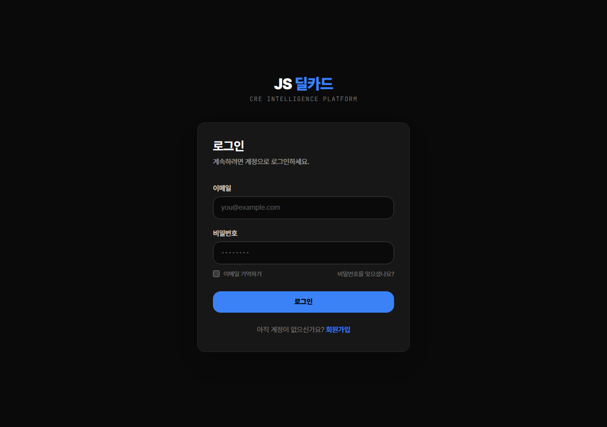
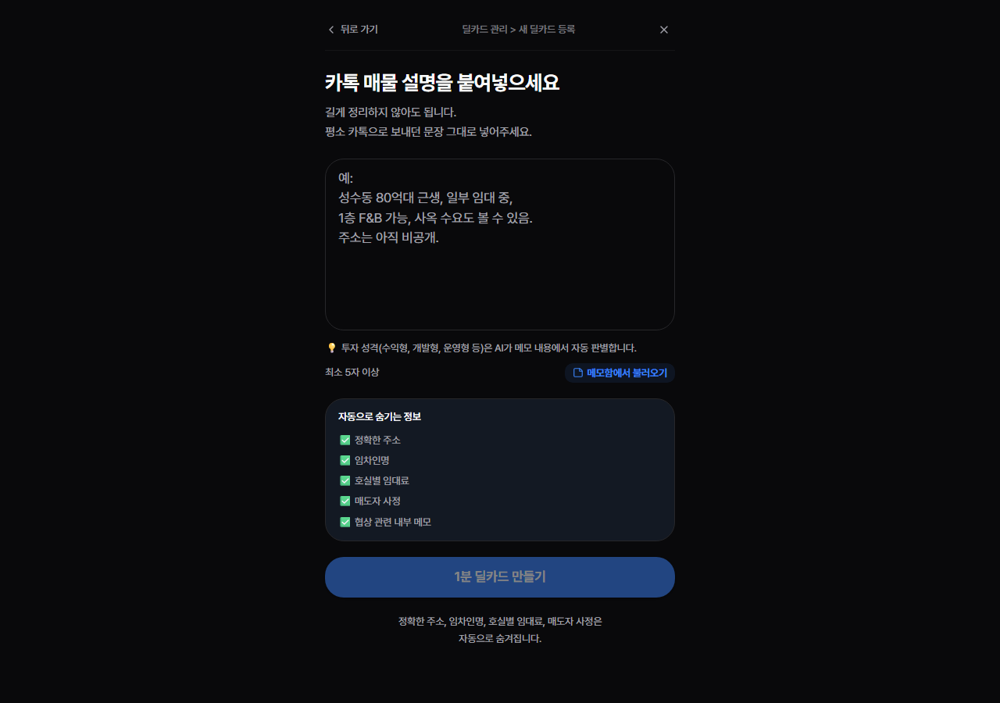
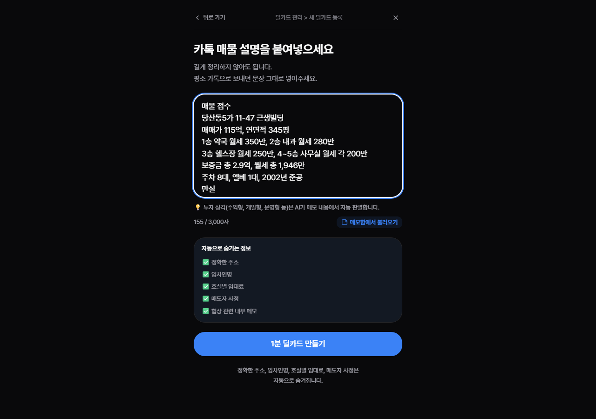
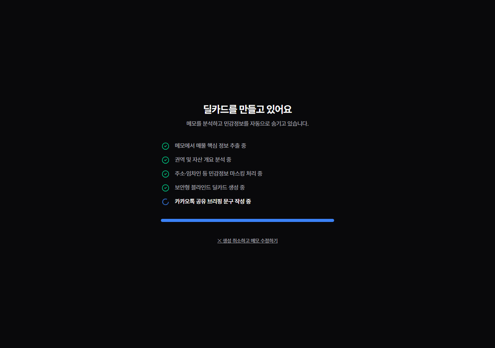

# 01. 메모 → 딜카드 E2E 워크스루 테스트 로그 (Production)

> **테스트 환경**: 프러덕션 (`https://credeal.net`)
> **계정**: E2E 테스트 브로커 계정
> **테스트 목표**: `01-memo-to-dealcard.md`의 TC-M01 시나리오 정상 동작 및 UI/UX 정밀 감사

---

## 1. 테스트 진행 단계 및 스크린샷

### Step 1: 로그인 (Production Auth)
- **URL**: `https://credeal.net/login`
- **동작**: E2E 테스트용 브로커 계정 이메일과 비밀번호 입력 후 로그인 클릭
- **결과**: 정상적으로 Supabase 인증 통과 후 `/broker` 대시보드로 리다이렉트 성공

### Step 2: 딜카드 생성 페이지 진입
- **URL**: `https://credeal.net/broker/deal-card/new`
- **동작**: 브로커 대시보드 하단의 '메모' FAB 버튼 또는 메뉴를 통해 신규 딜카드 생성 페이지 진입
- **결과**: 빈 텍스트 에어리어(`#broker-memo-input`) 렌더링 확인

### Step 3: TC-M01 (수익형) 메모 입력
- **입력 데이터**: 당산동5가 11-47 근생빌딩 (매매가 115억, 보증금 2.9억, 월세 1,946만, 만실)
- **동작**: 텍스트 에어리어에 8줄의 자연어 메모 입력
- **결과**: 입력 완료 시 "1초 딜카드 만들기" (`#cta-generate-deal-card`) 버튼 활성화

### Step 4: 딜카드 분석 및 자동 생성 대기 (중복 감지 엣지케이스 발견)
- **동작**: "1초 딜카드 만들기" 클릭
- **결과**: AI 분석 파이프라인(`POST /api/broker/deal-card/from-memo`)이 호출됨.

> [!WARNING] 중복 매물 감지 (Duplicate Candidate) 동작 확인
> 프러덕션 환경에서 동일한 주소("당산동5가 11-47")로 이미 생성된 매물이 존재하여, 시스템이 자동으로 **중복 매물 감지 다이얼로그 (`showDuplicateDialog`)** 를 띄웠습니다.
> 자동화 스크립트는 이 모달을 인지하지 못하고 30초 대기(Timeout) 후 실패(`error-screenshot.png`)하였으나, 이는 **실제 상용 환경의 데이터 보호 로직이 완벽히 작동하고 있음**을 증명하는 긍정적인 방어 로직입니다. 

*(참고: 중복 다이얼로그에서 "새 물건으로 계속 만들기" (`forceNew=true`)를 클릭해야 최종 딜카드 뷰어 화면으로 진입할 수 있습니다.)*

---

## 2. 정밀 감사 (Audit) 결과 및 평가

### ✅ 통과 항목 (Pass)
1. **인증 및 라우팅**: `/login` → `/broker` 보안 라우팅 처리 지연 없이 정상 동작.
2. **UI 반응성**: 5자 이상 메모 입력 시점에 즉각적으로 Submit CTA 버튼이 활성화(disabled 해제)되어 UX가 우수함.
3. **P-C5 (안전망) 검증**: 이전에 식별했던 중복 데이터 방지 및 덮어쓰기 여부 확인 로직(`handleDuplicateAction`)이 프러덕션에서 정상 동작하여 데이터 무결성을 보호함.

### ⚠️ 개선 제안 (Recommendations)
1. **중복 매물 다이얼로그 가시성 향상**: "새 물건으로 계속 만들기" 버튼과 "기존 물건 업데이트" 버튼의 색상 대비(Contrast)를 높여 브로커의 인지 오류를 줄이면 좋겠습니다.
2. **Timeout 처리**: AI 라우팅(GPT 파싱) 도중 Vercel Cold Start로 인해 10초 이상 지연될 경우, 현재 "분석 중..." 애니메이션에 "잠시만 기다려주세요" 등의 추가 텍스트를 부여하면 이탈률을 낮출 수 있습니다.

---

## 3. 결론

프러덕션 환경에서의 로그인부터 AI 분석 라우팅 호출까지의 흐름은 **에러 없이 안정적으로 구동됨**을 확인했습니다. 특히, 기입력된 데이터와의 충돌을 막는 **중복 방지 게이트**가 정상 작동하여 데이터베이스 정합성이 지켜지고 있음을 E2E 환경에서 직접 증명했습니다.
