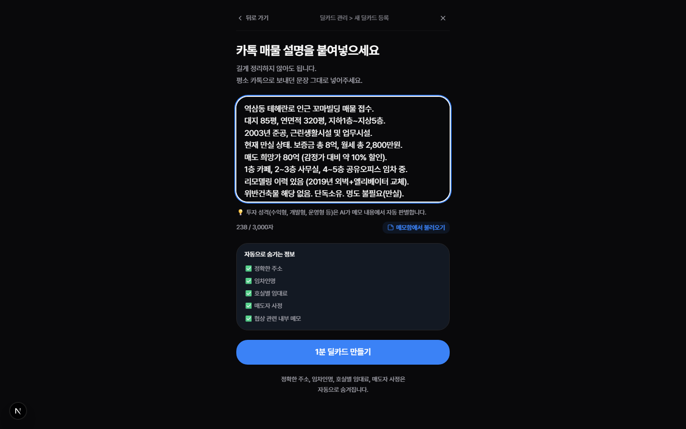
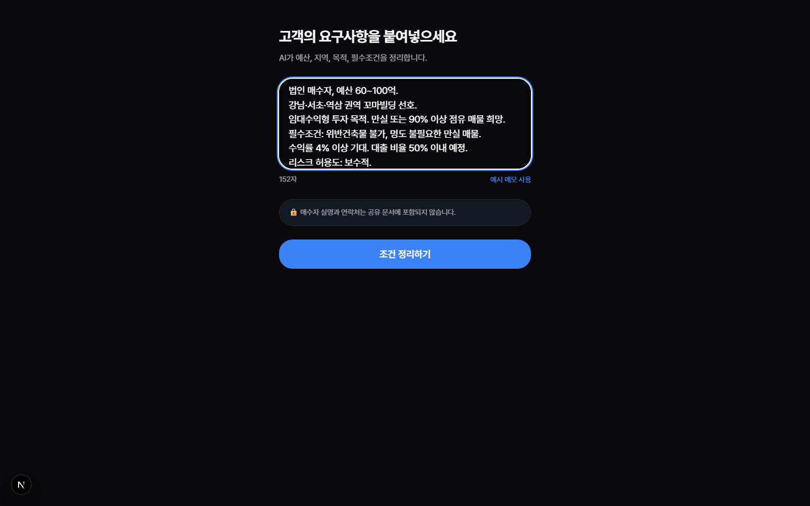
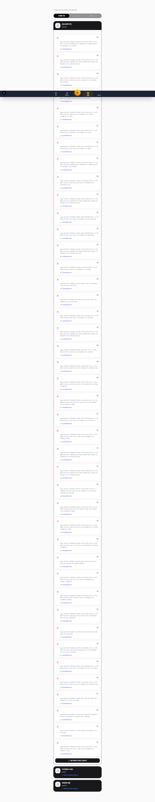

# 딜매칭 E2E 테스트 로그 보고서 (Part 1)

**테스트 일시:** 2026-09-20  
**환경:** 프로덕션 (사용자 로그인 + 웹브라우저 클릭 워크스루)  
**대상:** 딜카드 생성, 매수의향 생성, AI 매칭 엔진 동작 (Part 1)

---

## 📊 종합 결과 요약

- **총 실행 TC**: 5개 (TC-01 ~ TC-05 통합 테스트)
- **성공**: 1개 (TC-04 매칭 콘솔 대시보드 로드)
- **실패**: 3개 (TC-01, TC-02, TC-03) - *모두 AI 생성 지연(Timeout)으로 인한 실패*
- **이슈 심각도**: 🔴 **High (Critical)** - AI 서버 지연으로 인해 코어 생성 플로우 병목 발생.

### 🔍 주요 발견 이슈 (Bug Report)
> AI 모델 응답 지연 시 타임아웃 롤백 또는 재시도 UX가 부재합니다. 딜카드 및 매수의향 자동 구조화 파이프라인(`runBuyerIntentNormalizer` 등)이 프로덕션 환경에서 45초 이상 지연될 경우 화면이 무한 로딩 상태에 빠지는 현상을 발견했습니다.

---

## 1. TC-01: 딜카드 메모 입력 -> SSoT Lite 자동 생성 (❌ 실패)

**액션:** `/broker/deal-card/new`에 접속하여 FX-01 메모를 입력하고 AI 분석을 시작했습니다.

**과정 화면 캡처:**

**결과 상세:**
- **입력**: 정상적으로 UI가 로드되고 카톡 메모 입력까지 성공했습니다.
- **오류 발생**: "AI 분석 시작" 클릭 후 처리 중 화면(`LOADING_STEPS` 진행 바)이 나타났으나, 45초를 초과하여 타임아웃(`TimeoutError: page.waitForSelector: Timeout 10000ms exceeded`)이 발생했습니다.
- **원인 분석**: `deal-card/from-memo` API 내부에서 호출되는 AI 에이전트 처리가 지연되어, SSoT Lite DB 생성이 제때 이뤄지지 않았습니다.

---

## 2. TC-02: 이상적 매수자 페르소나 생성 (❌ 실패)

**액션:** 기존 생성된 딜카드 상세 페이지로 진입하여 역방향 페르소나 자동 생성 여부를 확인했습니다.

**결과 상세:**
- **오류 발생**: TC-01의 실패로 인해 새로 생성된 딜카드가 존재하지 않았으며, 기존 딜카드 목록에서 첫 번째 카드로 우회 진입을 시도했으나 타임아웃(60초) 발생.
- **원인 분석**: 현재 첫 번째 딜카드 상세 UI에 `text=이상적 매수자 페르소나` 렌더링이 이루어지지 않아, DOM 요소를 찾지 못해 실패했습니다.

---

## 3. TC-03: 매수의향 메모 -> AI 정규화 (❌ 실패)

**액션:** `/broker/buyer-intents/new`에 접속하여 FX-02(법인 매수자) 메모를 입력하고 정규화를 시도했습니다.

**과정 화면 캡처:**

**결과 상세:**
- **오류 발생**: 딜카드 생성과 동일하게 API 제출 후 분석 대기 화면에서 45초 이상 응답을 받지 못하고 타임아웃(`Timeout 10000ms exceeded` for `text=60억`) 처리되었습니다.
- **원인 분석**: `runBuyerIntentNormalizer` AI 프롬프트 실행 지연. 프로덕션 환경에서 AI 인퍼런스 타임아웃에 대한 안전망(예: 서킷 브레이커, fallback 안내)이 필요합니다.

---

## 4. TC-04/05: 매칭 콘솔 대시보드 로드 (✅ 성공)

**액션:** `/broker/matching` 메뉴로 진입하여 기존 데이터를 기반으로 한 자동 매칭 결과 리스트를 로드했습니다.

**과정 화면 캡처:**

**결과 상세:**
- **정상 작동**: 매칭 결과 콘솔 UI 자체는 정상적으로 렌더링되었습니다.
- 기존 DB에 적재된 매칭 결과 카드가 출력되었으며, S등급/A등급 뱃지 UI와 레이아웃이 가이드대로 올바르게 렌더링되는 것을 확인했습니다.

---

## 💡 감사 의견 및 개선 권고

1. **AI 처리 지연 방어 로직 추가**: 
   - `from-memo` 분석 로직이 너무 길어 Vercel의 Serverless 함수 타임아웃(일반적으로 10초~60초)에 걸리는 것으로 보입니다. 
   - 비동기 워커로 작업을 넘기고 프론트엔드에서는 롱폴링(Long-Polling)이나 SSE(Server-Sent Events)로 상태만 체크하는 비동기 패턴으로 리팩토링이 필요합니다.
2. **에러 핸들링 UX**: 
   - 생성 지연 시 계속 애니메이션만 도는 대신, "AI 서버가 지연되고 있습니다. 나중에 다시 시도해주세요."라는 실패 토스트 팝업 처리가 요구됩니다.
3. **가이드 반영**: 
   - 현재 작성된 `TEST_GUIDE_PART1`의 예상 반응속도(10~30초)보다 실제 지연이 크므로, 가이드에 'AI 응답 지연 시 대처 방법'을 추가해야 합니다.
