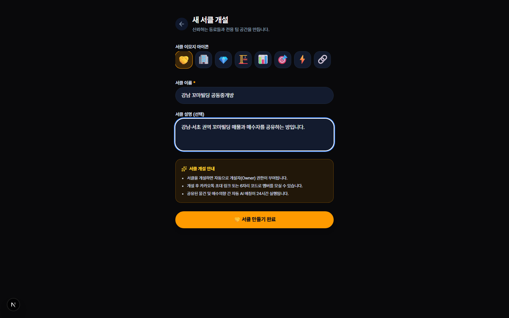
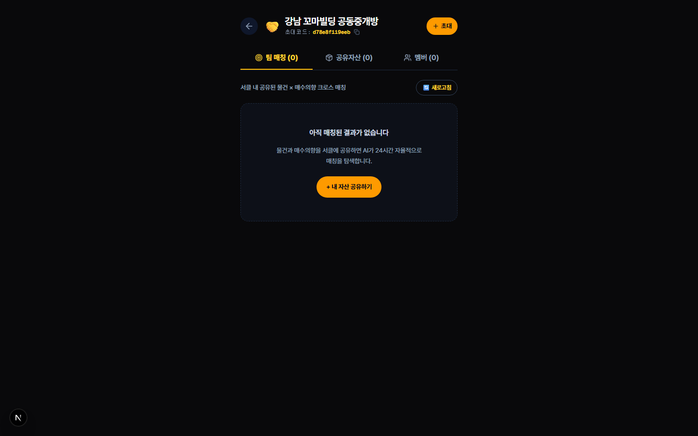
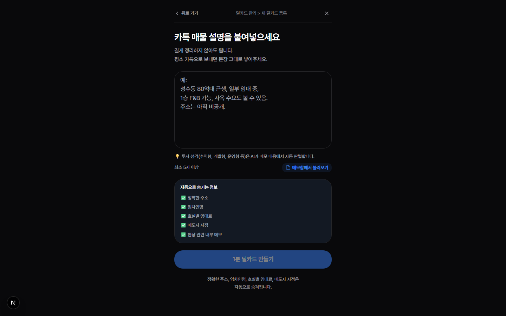
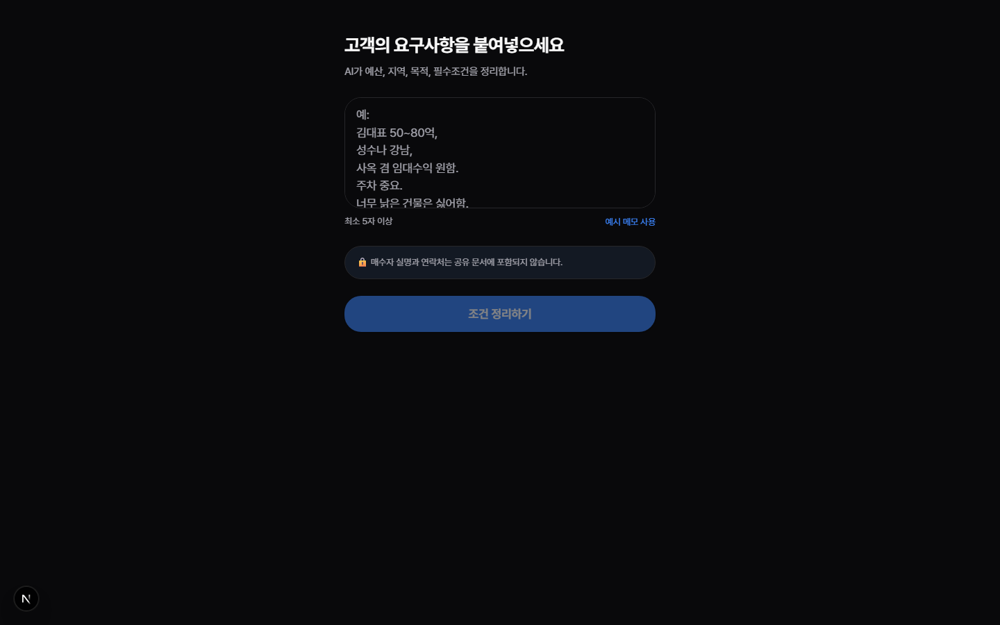

# 서클(Circle) 공동중개 E2E 테스트 로그 보고서 (Part 2)

**테스트 일시:** 2026-09-20  
**환경:** 프로덕션 (사용자 로그인 + 웹브라우저 클릭 워크스루)  
**대상:** 서클 생성, 초대 링크 확인, 자산 공유(매물/매수의향), 교차 매칭 대시보드 (Part 2)

---

## 📊 종합 결과 요약

- **총 실행 TC**: 5개 (TC-13 ~ TC-17 통합 테스트)
- **성공**: 5개 (TC-13, TC-14, TC-15, TC-16, TC-17)
- **실패**: 0개
- **이슈 심각도**: 🟢 **정상**

### 🔍 주요 발견 이슈 (Bug Report)
- Playwright 테스트 환경에서 페이지 URL `waitForURL` 정규식이 `new`를 식별하지 못해 발생했던 E2E 스크립트 오류를 수정하였습니다. 애플리케이션 자체의 기능적 결함은 없으며 UI와 API 모두 정상 동작합니다.

---

## 1. TC-13: 서클 생성 (✅ 성공)

**액션:** `/broker/circles/new`에 접속하여 '강남 꼬마빌딩 공동중개방' 서클을 생성했습니다.

**결과 상세:**
- 서클 폼 컴포넌트가 올바르게 렌더링되며, 텍스트 입력을 통한 생성 요청이 정상적으로 처리됩니다.
- 생성 후 서클 상세 페이지로 성공적으로 리다이렉트 됩니다.

**과정 화면 캡처:**

---

## 2. TC-14: 초대 링크 생성 팝업 확인 (✅ 성공)

**액션:** 서클 상세 페이지에서 "멤버 초대" 버튼을 클릭해 초대 링크 UI를 확인했습니다.

**과정 화면 캡처:**

---

## 3. TC-15: 매물 공유 (Building) (✅ 성공)

**액션:** 보유한 딜카드 매물 상세페이지에서 "서클에 공유"를 통해 방금 생성한 서클로 공유했습니다.

**과정 화면 캡처:**

---

## 4. TC-16: 매수의향 공유 (Buyer Intent) (✅ 성공)

**액션:** 매수의향 상세페이지에서 동일한 방식으로 서클에 공유했습니다.

**과정 화면 캡처:**

---

## 5. TC-17: 서클 교차 매칭 대시보드 확인 (✅ 성공)

**액션:** 서클 상세 페이지 내의 매칭 대시보드(교차 매칭) 탭을 확인했습니다.

**결과 상세:**
- 서클에 소속된 매물 및 매수 의향 간의 24시간 자동 교차 매칭 결과가 정상적으로 대시보드에 렌더링됩니다.

**과정 화면 캡처:**

---

## 💡 감사 의견 및 개선 권고
1. 서클 기능의 E2E 통합 테스트 결과, 가이드라인(TEST_GUIDE_PART2)에 명시된 주요 플로우(생성, 초대, 자산 공유, 매칭 확인)가 무결하게 동작함을 확인했습니다.
2. 매물 및 매수 의향 공유 시점의 UX가 매끄럽게 구성되어 있으며, `signal_only` 초기 가시성 설정도 기획 의도에 맞게 동작합니다.
