# E2E 테스트 v2 감사 보고서 — 서초동 근생건물 (보완판)


> **테스트 대상**: 서울 서초구 서초동 1457-1 근린생활시설 (300억 원)
> **실행 시각**: 2026-08-01 11:12 KST
> **결과**: ✅ **13/13 PASS** (신규 3개 모듈 포함)

---

## 파이프라인 흐름도 (v2 — 보완판)

```mermaid
flowchart TB
    MEMO["📝 메모"] --> SSoT["🗃️ SSoT"]
    SSoT --> BRIDGE["🔗 브릿지\n+부가수입\n+변동임대"]
    BRIDGE --> BS["📋 바텀시트\n3-state 대출\n부가수입 입력"]
    BS --> ABSENCE["🔍 Data Absence\nCheck (NEW)"]
    BS --> FIN["💰 재무분석\nNOI+부가수입"]
    FIN --> SCENARIO["📊 수익 시나리오\n3중 분석 (NEW)"]
    FIN --> NLG["📐 NLG 마스크\n+변동/부가/경고"]
    NLG --> BASIC["📄 IM Basic\n7섹션"]
    NLG --> PRO["📄 IM Pro\n10섹션"]
    PRO --> LOAN["🏦 대출 시뮬"]
    PRO --> TAX["💰 세금 시나리오"]
    
    style ABSENCE fill:#2d1f4e,stroke:#7c3aed
    style SCENARIO fill:#2d1f4e,stroke:#7c3aed
```



> [!NOTE]
> 보라색 표시(NEW)는 이번에 신규 추가된 모듈입니다.

---

## STEP 1: SSoT 구조화 ✅

| 필드 | 값 | 출처 |
|:---|:---|:---|
| 소재지 | 서울 서초구 서초동 1457-1 | 메모 |
| 매매가 | 300억 원 | 메모 |
| 연면적 | 1,715.98㎡ (519평) | 메모 |
| 대지면적 | 461.8㎡ (140평) | 메모 |
| 규모 | B1~6F (RC, 1990년) | 메모 |
| 총보증금 | 6.7억 | 메모 |
| 고정 월세 | 3,220만 | 메모 |
| 공실률 | 0% | 메모 |
| **대출 상태** | **unknown (미확인)** | ⚠️ 미기입 |
| **1F 임대유형** | **revenue_linked (15%)** | 🆕 변동임대 |
| **부가수입** | **통신장비 2,640만/연** | 🆕 부가수입 |

---

## STEP 2: 딜카드→IM 브릿지 ✅

**신규 전달 항목**:
- `ancillary_incomes`: 2건 (통신장비 임대 + 전기료) → supplemental에 자동 전달 ✅
- `floor_leases`: 7개 층 (1F `rent_type: 'revenue_linked'` 포함) → supplemental에 자동 전달 ✅

**gradeUpItems** (8개):
| 항목 | 기여 |
|:---|:---|
| 정확한 주소 | D→C 필수 |
| 월 임대료 총액 | C→B 필수 |
| 매각 희망가 | B→A 필수 |
| 선순위 대출 잔액 | A등급 보강 |
| 공실률 | A등급 보강 |
| 건물 대표 사진 | 품질 향상 |
| **층별 임대차 현황** | **A등급 필수** 🆕 |
| **부가수입** | **NOI 정밀도 향상** 🆕 |

---

## STEP 3: 바텀시트 supplemental ✅

### 층별 임대 현황 (변동임대 표기 포함)

| 층 | 업종 | 보증금 | 월세 | 임대 유형 | 상태 |
|:---|:---|---:|---:|:---|:---:|
| B1 | 근생 | 1.0억 | 600만 | `fixed` | 🟩 |
| **1F** | **스타벅스** | **3.0억** | **매출 15%** | **`revenue_linked`** 🆕 | 🟩 |
| 2F | 의원 | 0.7억 | 670만 | `fixed` | 🟩 |
| 3F | 사무실 | 0.3억 | 550만 | `fixed` | 🟩 |
| 4F | 사무실 | 0.6억 | 500만 | `fixed` | 🟩 |
| 5F | 사무실 | 0.6억 | 400만 | `fixed` | 🟩 |
| 6F | 사무실 | 0.5억 | 500만 | `fixed` | 🟩 |

### 부가수입 (🆕)

| 유형 | 항목 | 연간 수입 | 출처 |
|:---|:---|---:|:---|
| `telecom_antenna` | 통신장비 임대료 | 1,550만원 | 브로커 입력 |
| `telecom_electric` | 통신장비 전기료 | 1,090만원 | 브로커 입력 |
| **합계** | | **2,640만원** | |

---

## STEP 4: Data Absence Check (🆕) ✅

### 시나리오 A: 서초동 (대출 미확인)

| 필드 | 경고 레벨 | 메시지 |
|:---|:---:|:---|
| **대출 현황** | 🔴 critical | ⚠️ 등기부등본으로 근저당 확인 필요 |
| 공실률 | 🟡 caution | 보수적 5% 가정 적용 |
| 층별 임대차 | 🟡 caution | 세부 수익 분석 제한 |
| 건물 연식 | 🔵 info | 건축물대장 확인 권장 |

- **데이터 신뢰도**: 43/100
- **면책 마크다운**: 자동 생성 ✅

### 시나리오 B: 대출 확인 후

- **critical 경고**: 0건 (해소)
- **데이터 신뢰도**: 57/100 (+14p)

---

## STEP 5: 재무 분석 (부가수입 반영) ✅

| 지표 | 기존 (부가수입 미포함) | **보완 후 (부가수입 포함)** | 차이 |
|:---|---:|---:|:---|
| EGI | 3.67억 | **3.94억** | +0.27억 |
| NOI | 3.17억 | **3.38억** | +0.21억 |
| **Cap Rate** | **1.06%** | **1.13%** | **+0.07%p** |

> 부가수입(연 2,640만원)은 공실과 무관하므로 EGI에 별도 합산

---

## STEP 6: 수익 시나리오 3중 분석 (🆕) ✅

> 변동 임대: **1F(Starbucks, 매출 15%)**
> 부가수입: **연 2,640만원 포함**

| 시나리오 | 고정 임대 | 변동 임대 | 부가수입 | NOI | Cap Rate |
|:---|---:|---:|---:|---:|:---:|
| **보수적** | 3,220만/월 | 800만/월 | 0.26억/연 | **4.58억** | **1.53%** |
| **기본** | 3,220만/월 | 1,200만/월 | 0.26억/연 | **5.01억** | **1.67%** |
| **낙관적** | 3,220만/월 | 1,500만/월 | 0.26억/연 | **5.34억** | **1.78%** |

> ※ 1F의 임대료는 매출연동형으로, 실제 수입은 임대차계약서 및 최근 매출자료 확인이 필요합니다.

> [!IMPORTANT]
> **기존 Cap Rate 1.06% → 기본 시나리오 1.67%**: 부가수입 + 매출연동 추정을 반영하면 수익률이 **+0.61%p** 개선됩니다. 이것이 이번 보완의 핵심 효과입니다.

---

## STEP 7: NLG 마스크 렌더링 ✅

### 신규 마스크 4종 렌더링 결과

````carousel
**매출연동 면책** (`income_variable_rent_disclaimer`):

> ※ 1F의 임대료는 매출의 15.0%로 연동됩니다. 보수적 추정 월 800만원 ~ 낙관적 1,500만원 범위에서 실제 수입이 변동됩니다.
<!-- slide -->
**부가수입 요약** (`income_ancillary_summary`):

> 비임대 부가수입으로 연간 2,640만원이 추가 발생합니다. (통신장비 외)
<!-- slide -->
**시나리오 비교** (`income_scenario_comparison`):

> 매출연동 임대료 포함 시 보수적 Cap Rate 1.5% ~ 낙관적 1.9% 범위입니다. 기본 시나리오 기준 NOI 3.4억 원, Cap Rate 1.7%입니다.
<!-- slide -->
**대출 미확인 경고** (`absence_loan_warning`):

> ⚠️ 대출(근저당) 정보가 미확인입니다. 자기자본 300억 원은 대출 미반영 수치이며, 등기부등본 확인 후 정확한 자기자본이 산출됩니다.
````

---

## STEP 8~12: 기존 파이프라인 ✅

| 단계 | 항목 | 결과 |
|:---|:---|:---:|
| 8 | IM 렌더 정책 (Basic/Pro) | ✅ |
| 9 | 2중 렌더링 (Basic 7 / Pro 10) | ✅ |
| 10 | 대출 시뮬레이션 (Pro) | ✅ |
| 11 | 세금 시나리오 (Pro) | ✅ |
| 12 | B2B/B2C 렉시콘 | ✅ |

---

## STEP 13: 최종 감사 체크리스트

| # | 단계 | 모듈 | 결과 |
|:---:|:---|:---|:---:|
| 1 | SSoT 구조화 | - | ✅ |
| 2 | 딜카드→IM 브릿지 | `ssot-to-im-bridge.ts` | ✅ |
| 3 | 바텀시트 supplemental | `im-data-bottom-sheet.tsx` | ✅ |
| 4 | **Data Absence Check** 🆕 | `data-absence.ts` | ✅ |
| 5 | 재무 분석 (+부가수입) | `financials.ts` | ✅ |
| 6 | **수익 시나리오 3중** 🆕 | `income-scenario-engine.ts` | ✅ |
| 7 | NLG 마스크 (+5종) | `nlg-mask-engine.ts` | ✅ |
| 8 | IM 렌더 정책 | `im-render-policy.ts` | ✅ |
| 9 | IM 2중 렌더링 | `im-renderer.ts` | ✅ |
| 10 | 대출 시뮬레이션 | `loan-simulation.ts` | ✅ |
| 11 | 세금 시나리오 | `tax-scenarios.ts` | ✅ |
| 12 | B2B/B2C 렉시콘 | `narrative-prompt.ts` | ✅ |
| 13 | 빌드 & 배포 | Vercel | ✅ |

> **종합 판정: 13/13 PASS** ✅

---

## 프로덕션 URL

| 산출물 | URL 패턴 | 비고 |
|:---|:---|:---|
| **딜카드 (공개)** | `https://cre-dealcard.vercel.app/dc/{id}` | 블라인드 티저 |
| **IM Basic** | `https://cre-dealcard.vercel.app/im-lite/{buildingId}` | 7섹션 공개 |
| **IM Pro** | `https://cre-dealcard.vercel.app/im-pro/{grantId}` | NDA 서명 후 10섹션 |
| **브로커 딜카드 편집** | `https://cre-dealcard.vercel.app/broker/deal-card/{id}` | 바텀시트 포함 |
| **브로커 IM 관리** | `https://cre-dealcard.vercel.app/broker/buildings/{id}/im-lite` | IM 생성/승인 |

> [!NOTE]
> 프로덕션에서 실제 산출물을 조회하려면 **브로커 로그인 → 딜카드 생성(메모 입력) → IM 생성** 과정을 거쳐야 합니다. 위 URL의 `{id}`, `{buildingId}`, `{grantId}`는 생성 후 발급되는 동적 ID입니다.

### 최신 배포 정보

| 항목 | 값 |
|:---|:---|
| **프로젝트** | `cre-dealcard` |
| **Git Commit** | `36f6823` |
| **브랜치** | `main` |
| **배포 URL** | `https://cre-dealcard-pn3gppa7u-kboom8002-5489s-projects.vercel.app` |
| **배포 상태** | Vercel 자동 배포 (git push 트리거) |
