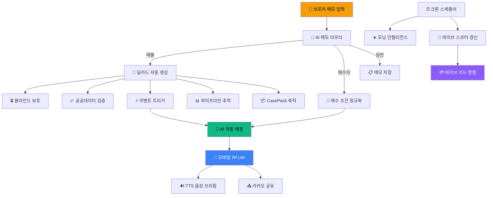

# 🏗️ CRE DealCard — 기능 가치 · 구현 성숙도 정밀 분석 (v2)

> **분석일**: 2026-06-15 | **분석 범위**: 전 세션 누적 + 이번 세션 구현/고도화 포함
> **관점**: "1인 상업용 부동산 브로커가 이 시스템을 통해 얻는 실질 가치" 기준

---

## 📊 종합 성숙도 매트릭스

| 순위 | 기능 | 중개인 가치 | 구현 성숙도 | 상태 |
|:---:|------|:---:|:---:|:---:|
| 1 | 유니버설 메모 → 딜카드 자동 생성 | ★★★★★ | 9/10 | 🟢 Production |
| 2 | AI 자동 매칭 엔진 (이벤트 기반) | ★★★★★ | 8/10 | 🟢 Production |
| 3 | 모바일 IM Lite 뷰어 + TTS 음성 브리핑 | ★★★★☆ | 8/10 | 🟢 Production |
| 4 | 블라인드 정보 보호 (Disclosure Guard) | ★★★★☆ | 8/10 | 🟢 Production |
| 5 | 매수자 조건 AI 정규화 | ★★★★☆ | 8/10 | 🟢 Production |
| 6 | 바이브 카드 (AI 명함) | ★★★★☆ | 7/10 | 🟡 Beta |
| 7 | 모닝 인텔리전스 (AI 브리핑) | ★★★★☆ | 7/10 | 🟡 Beta |
| 8 | 딜 파이프라인 추적 (FSM) | ★★★☆☆ | 7/10 | 🟡 Beta |
| 9 | 공공데이터 교차검증 (건축물대장) | ★★★★☆ | 7/10 | 🟡 Beta |
| 10 | 바이브 스코어 자동 갱신 | ★★★☆☆ | 7/10 | 🟢 Production |
| 11 | Hub/Search 매물 탐색 | ★★★☆☆ | 7/10 | 🟢 Production |
| 12 | CasePack 지식 축적 | ★★★☆☆ | 6/10 | 🟡 Beta |
| 13 | 브로커 프로필 페이지 | ★★★☆☆ | 7/10 | 🟢 Production |
| 14 | 프로모션 스코어 랭킹 | ★★★☆☆ | 6/10 | 🟡 Beta |
| 15 | OG 이미지 동적 생성 (카카오/SNS) | ★★★☆☆ | 7/10 | 🟢 Production |
| 16 | 데일리 매거진 (브로커별 웹진) | ★★☆☆☆ | 6/10 | 🟡 Beta |
| 17 | 외부 API 연동 (네이버/공공데이터) | ★★★☆☆ | 5/10 | 🟠 Partial |
| 18 | 어드민 크로스시스템 대시보드 | ★★☆☆☆ | 5/10 | 🟠 Partial |

---

## 🔍 기능별 상세 분석

---

### 1. 유니버설 메모 → 딜카드 자동 생성 ★★★★★ `9/10`

**중개인 가치**: 브로커가 현장에서 전화 메모, 카톡 대화, 음성 메모를 그대로 복붙하면 AI가 자동으로 구조화된 매물 카드를 생성합니다. 기존에 1~2시간 걸리던 매물 정보 정리를 **30초**로 단축하는 핵심 기능입니다.

**구현 분석**:
| 구성 요소 | 파일 | 상태 |
|---|---|---|
| 메모 라우터 AI | [memo-router-agent.ts](file:///c:/Users/User/cre-dealcard/src/ai/agents/memo-router-agent.ts) | ✅ 실제 GPT 호출, 4종 분류 |
| 3단계 체인 파이프라인 | [broker-deal-card.ts](file:///c:/Users/User/cre-dealcard/src/ai/agents/broker-deal-card.ts) | ✅ MemoParser→MiniTruth→BlindTeaser |
| PII 비식별화 | [memo-sanitizer.ts](file:///c:/Users/User/cre-dealcard/src/ai/sanitizer/memo-sanitizer.ts) | ✅ 전/후처리 구현 + 테스트 |
| 메모 품질 게이트 | [memo-quality-gate.ts](file:///c:/Users/User/cre-dealcard/src/domain/building/memo-quality-gate.ts) | ✅ 최소 품질 검증 + 테스트 |
| Zod 스키마 검증 | `src/ai/schemas/` | ✅ MemoParser, BlindTeaser, MiniTruth 스키마 |
| 안전 언어 가드레일 | [safe-language.ts](file:///c:/Users/User/cre-dealcard/src/domain/guardrails/safe-language.ts) | ✅ 부적절 표현 자동 교정 |
| LLM 클라이언트 (폴백+캐시) | [llm-client.ts](file:///c:/Users/User/cre-dealcard/src/ai/llm-client.ts) | ✅ 멀티 프로바이더 + 인메모리 캐시 |
| API 엔드포인트 | [from-memo/route.ts](file:///c:/Users/User/cre-dealcard/src/app/api/broker/deal-card/from-memo/route.ts) | ✅ 인증+검증+DB 영속화 |
| 도메인 오케스트레이터 | [broker-deal-card.ts](file:///c:/Users/User/cre-dealcard/src/domain/building/broker-deal-card.ts) | ✅ SSoT+SignalCard+Doc+Event 생성 |

> **감점 요인 (-1)**: 음성 메모(STT) 직접 입력은 아직 미구현. 현재는 텍스트 메모만 지원.

---

### 2. AI 자동 매칭 엔진 (이벤트 기반) ★★★★★ `8/10`

**중개인 가치**: 매물이 등록되면 **자동으로** 기존 매수자 풀 전체와 매칭하여 S/A/B/C 등급으로 분류합니다. 브로커가 매수자를 일일이 떠올리는 대신, AI가 즉시 "이 매수자에게 먼저 연락하세요"라고 알려줍니다.

**구현 분석**:
| 구성 요소 | 파일 | 상태 |
|---|---|---|
| 3-Stage 매칭 엔진 | [matching-engine.ts](file:///c:/Users/User/cre-dealcard/src/domain/matching/matching-engine.ts) | ✅ HardFilter→Semantic→Ensemble |
| 지역 위계 매칭 | [region-hierarchy.ts](file:///c:/Users/User/cre-dealcard/src/domain/matching/region-hierarchy.ts) | ✅ 서울 25개구 + 하위 동 매핑 |
| 자산유형 택소노미 | [asset-type-taxonomy.ts](file:///c:/Users/User/cre-dealcard/src/domain/matching/asset-type-taxonomy.ts) | ✅ 유사 자산유형 그룹핑 |
| 자동 매칭 워커 | [auto-matcher.ts](file:///c:/Users/User/cre-dealcard/src/domain/matching/auto-matcher.ts) | ✅ 전체 매수자 풀 순회 매칭 |
| 이벤트 트리거 (`after()`) | [from-memo/route.ts](file:///c:/Users/User/cre-dealcard/src/app/api/broker/deal-card/from-memo/route.ts#L54) | ✅ 응답 차단 없는 백그라운드 |
| 매수자→매물 역방향 매칭 | [buyer-intents/from-memo/route.ts](file:///c:/Users/User/cre-dealcard/src/app/api/broker/buyer-intents/from-memo/route.ts) | ✅ `after()` 비동기 매칭 |
| 임베딩 기반 시맨틱 유사도 | [matching-engine.ts#L73](file:///c:/Users/User/cre-dealcard/src/domain/matching/matching-engine.ts#L73) | ✅ OpenAI embedding + cosine |
| 목적별 가중치 프로파일 | [matching-types.ts](file:///c:/Users/User/cre-dealcard/src/domain/matching/matching-types.ts) | ✅ 사옥/증여/투자/기본 4종 |

> **감점 요인 (-2)**: 매칭 결과 알림(카카오톡/이메일)이 미구현. 공실 수요 검증(`vacancyDemandVerified`)이 항상 false 하드코딩.

---

### 3. 모바일 IM Lite 뷰어 + TTS 음성 브리핑 ★★★★☆ `8/10`

**중개인 가치**: 고객에게 카카오톡으로 URL 하나만 보내면, 매물의 7-섹션 투자설명서(IM)가 펼쳐지고, 1분짜리 AI 음성 브리핑까지 자동 재생됩니다. "자료 보내주세요" 요청에 **즉시 대응**할 수 있는 프리미엄 브로커 이미지를 만듭니다.

**구현 분석** (🆕 이번 세션 고도화):
| 구성 요소 | 파일 | 상태 |
|---|---|---|
| 데모 3건 풀 IM 문서 | [mobile-im-demo-data.ts](file:///c:/Users/User/cre-dealcard/src/lib/demo/mobile-im-demo-data.ts) | ✅ 7섹션×3건 완전 구현 |
| 🆕 실데이터 동적 매핑 | [im-lite/route.ts](file:///c:/Users/User/cre-dealcard/src/app/api/public/im-lite/%5BbuildingId%5D/route.ts) | ✅ SSoT→MobileIMDocument 변환 |
| 🆕 브로커 프로필 자동 연결 | [im-lite/route.ts#L85](file:///c:/Users/User/cre-dealcard/src/app/api/public/im-lite/%5BbuildingId%5D/route.ts#L85) | ✅ profiles 테이블 조인 |
| 모바일 뷰어 UI (1010줄) | [mobile-im-viewer.tsx](file:///c:/Users/User/cre-dealcard/src/app/%28public%29/im-lite/%5BbuildingId%5D/mobile-im-viewer.tsx) | ✅ 프리미엄 다크 테마 |
| 🆕 TTS 실데이터 지원 | [tts/route.ts](file:///c:/Users/User/cre-dealcard/src/app/api/public/im-lite/%5BbuildingId%5D/tts/route.ts) | ✅ OpenAI tts-1-hd + 30분 캐시 |
| 섹션별 뷰 트래킹 | IntersectionObserver 기반 | ✅ 고객 열람 구간 분석 |
| 공유 버튼 (Web Share API) | ShareButton 컴포넌트 | ✅ 네이티브 공유 시트 |

> **감점 요인 (-2)**: 잠금(Lock) 해제 조건이 아직 정적 판단. 실시간 AI 섹션 콘텐츠 생성(입지/수익 분석)은 데모에만 존재.

---

### 4. 블라인드 정보 보호 (Disclosure Guard) ★★★★☆ `8/10`

**중개인 가치**: 매도인의 민감 정보(주소, 건물명, 소유주)가 AI에 의해 자동으로 탐지되고 마스킹됩니다. 브로커가 정보 유출 리스크 없이 안심하고 블라인드 딜카드를 공유할 수 있습니다.

| 구성 요소 | 파일 | 상태 |
|---|---|---|
| PII 사전 비식별화 | [memo-sanitizer.ts](file:///c:/Users/User/cre-dealcard/src/ai/sanitizer/memo-sanitizer.ts) | ✅ 전화번호/주소/이름 치환 |
| 공개 레벨 가드 | [disclosure-guard.ts](file:///c:/Users/User/cre-dealcard/src/domain/guardrails/disclosure-guard.ts) | ✅ 공개 등급별 필터링 |
| 응답 마스커 | [response-masker.ts](file:///c:/Users/User/cre-dealcard/src/domain/building/response-masker.ts) | ✅ 테스트 포함 |
| 공개 제어 (비식별 + 역복원) | sanitizeMemo → desanitizeOutput | ✅ 양방향 완전 구현 |

> **감점 요인 (-2)**: 이미지/PDF 문서 내 PII 탐지는 미지원. 텍스트 기반만.

---

### 5. 매수자 조건 AI 정규화 ★★★★☆ `8/10`

**중개인 가치**: "강남 50억 사옥 알아보는 법인 있어" 같은 비정형 메모를 AI가 구조화된 매수자 프로필로 변환합니다. 자동 매칭 엔진의 입력 데이터가 됩니다.

| 구성 요소 | 파일 | 상태 |
|---|---|---|
| 정규화 에이전트 | [buyer-intent-normalizer.ts](file:///c:/Users/User/cre-dealcard/src/ai/agents/buyer-intent-normalizer.ts) | ✅ GPT 호출 |
| 도메인 오케스트레이터 | [buyer-intent.ts](file:///c:/Users/User/cre-dealcard/src/domain/buyer/buyer-intent.ts) | ✅ DB 영속화+이벤트 로깅 |
| API + 이벤트 트리거 매칭 | buyer-intents/from-memo | ✅ `after()` 연동 |

> **감점 요인 (-2)**: 매수자 CRM(연락처, 후속 관리)은 미구현. 매수자 프로필 UI 편집 페이지 없음.

---

### 6. 바이브 카드 (AI 명함) ★★★★☆ `7/10`

**중개인 가치**: 사진만 올리면 AI가 브로커의 '분위기'를 분석하여 프리미엄 디지털 명함을 생성합니다. 카카오톡이나 SNS에 공유하면 고객에게 전문가 이미지를 전달할 수 있습니다.

| 구성 요소 | 파일 | 상태 |
|---|---|---|
| 바이브 벡터 7D | [vibe-vector.ts](file:///c:/Users/User/cre-dealcard/src/lib/vibe/vibe-vector.ts) | ✅ 7차원 성격 프로파일링 |
| 템플릿 시스템 (20+종) | [vibe-templates.ts](file:///c:/Users/User/cre-dealcard/src/lib/vibe/vibe-templates.ts) | ✅ 23KB 분량 |
| 보색 매칭 | [vibe-complement.ts](file:///c:/Users/User/cre-dealcard/src/lib/vibe/vibe-complement.ts) | ✅ 테스트 포함 |
| VibeCard 컴포넌트 (341줄) | [VibeCard.tsx](file:///c:/Users/User/cre-dealcard/src/components/vibe-card/VibeCard.tsx) | ✅ 애니메이션+다크모드 |
| OG 이미지 | [api/og/vibe-card](file:///c:/Users/User/cre-dealcard/src/app/api/og/vibe-card) | ✅ 동적 생성 |

> **감점 요인 (-3)**: VTI(Vibe Type Indicator) 분석이 현재 수동/시드 데이터 기반. 실시간 사진 분석 AI 호출은 온보딩에서만 제한적 동작.

---

### 7. 모닝 인텔리전스 (AI 브리핑) ★★★★☆ `7/10`

**중개인 가치**: 매일 아침 "오늘 누구에게 먼저 전화하세요", "이 매물 시세가 이렇게 변했습니다"를 권역별 AI 브리핑으로 제공합니다. 브로커의 일과 시작을 30분 앞당기는 비서 역할입니다.

| 구성 요소 | 파일 | 상태 |
|---|---|---|
| 모닝 인텔리전스 API (363줄) | [morning-intelligence/route.ts](file:///c:/Users/User/cre-dealcard/src/app/api/broker/morning-intelligence/route.ts) | ✅ 11개 데이터소스 병렬 수집 |
| 권역 매핑 (성수/GBD/YBD) | route.ts 내 REGION_MAP | ✅ 3개 권역 |
| AI 편집 프롬프트 | 꼬마빌딩 전문 에디터 | ✅ 맞춤형 시스템 프롬프트 |
| 브로커 개인화 | 내 매물/매수자 기반 | ✅ 개인 포트폴리오 반영 |
| 매거진 뷰어 (27KB) | [magazine-view.tsx](file:///c:/Users/User/cre-dealcard/src/app/%28public%29/magazine/%5BbrokerId%5D/%5Bdate%5D/magazine-view.tsx) | ✅ 프리미엄 UI |
| 크론 스케줄 | [vercel.json](file:///c:/Users/User/cre-dealcard/vercel.json) | ✅ 매일 08:00 KST |

> **감점 요인 (-3)**: 네이버 API 키 미설정으로 뉴스 데이터가 폴백(하드코딩) 사용 중. DB 테이블(external_news 등)에 실제 데이터가 비어 있을 수 있음.

---

### 8. 딜 파이프라인 추적 (FSM) ★★★☆☆ `7/10`

**중개인 가치**: 매물의 생애주기(메모→딜카드→IM→미팅→LOI→계약→클로징)를 자동 추적합니다. "이 딜이 7일 넘게 멈춰있네요"라는 경고를 생성합니다.

| 구성 요소 | 파일 | 상태 |
|---|---|---|
| 브리지 FSM (8단계) | [bridge-state-machine.ts](file:///c:/Users/User/cre-dealcard/src/domain/pipeline/bridge-state-machine.ts) | ✅ 전이 규칙+홀드 경고 |
| 임대 파이프라인 FSM | [lease-pipeline-fsm.ts](file:///c:/Users/User/cre-dealcard/src/domain/pipeline/lease-pipeline-fsm.ts) | ✅ 별도 임대 트래킹 |
| 딜 브리핑 생성기 | [deal-briefing-generator.ts](file:///c:/Users/User/cre-dealcard/src/domain/briefing/deal-briefing-generator.ts) | ✅ 권장 액션 도출 |

> **감점 요인 (-3)**: 파이프라인 전이를 수동으로 트리거하는 UI/API가 제한적. 대시보드 화면 부재.

---

### 9. 공공데이터 교차검증 ★★★★☆ `7/10`

**중개인 가치**: AI가 생성한 매물 정보를 국토부 건축물대장과 자동 교차 검증합니다. "AI가 오피스라고 했는데, 대장 상 근생이에요" 같은 사실 오류를 사전에 잡아냅니다.

| 구성 요소 | 파일 | 상태 |
|---|---|---|
| 교차검증 엔진 | [public-data-verifier.ts](file:///c:/Users/User/cre-dealcard/src/domain/verification/public-data-verifier.ts) | ✅ 용도+면적 3단계 검증 |
| 주소 파서 | address-resolver.ts | ✅ 도로명→법정동 변환 |
| 건축물대장 API 클라이언트 | govt-api-client.ts | ✅ 국토부 API 호출 |
| 면적 단위 변환 | extractAreaInSqm() | ✅ 평↔㎡ 자동 환산 |

> **감점 요인 (-3)**: API 키(국토부 공공데이터포털) 설정 여부에 따라 동작. 실패 시 `skipped` 상태.

---

### 10. 🆕 바이브 스코어 자동 갱신 ★★★☆☆ `7/10`

**중개인 가치**: 브로커가 시스템을 적극 활용할수록 명함의 '신뢰도'와 '호감도' 게이지가 올라갑니다. 고객에게 보이는 숫자가 바뀌므로 게이미피케이션 효과가 있습니다.

| 구성 요소 | 파일 | 상태 |
|---|---|---|
| 🆕 스코어 알고리즘 | [vibe-scorer.ts](file:///c:/Users/User/cre-dealcard/src/domain/vibe/vibe-scorer.ts) | ✅ 신뢰+호감 2축 산출 |
| 🆕 크론 동기화 | [sync-vibe/route.ts](file:///c:/Users/User/cre-dealcard/src/app/api/cron/sync-vibe/route.ts) | ✅ 매주 일요일 자정 |
| 스탯 집계기 | [broker-stats-aggregator.ts](file:///c:/Users/User/cre-dealcard/src/domain/broker-card/broker-stats-aggregator.ts) | ✅ 5개 테이블 집계 |

> **감점 요인 (-3)**: coherence 점수 미연동. 브로커 자신이 점수 변동을 확인하는 알림/대시보드 부재.

---

### 11~18. 기타 기능 요약

| # | 기능 | 성숙도 | 핵심 파일 | 비고 |
|---|---|:---:|---|---|
| 11 | Hub/Search 매물 탐색 | 7/10 | [hub/page.tsx](file:///c:/Users/User/cre-dealcard/src/app/%28public%29/hub/page.tsx) (515줄), [search/page.tsx](file:///c:/Users/User/cre-dealcard/src/app/%28public%29/search/page.tsx) (25KB) | SSR + 실시간 DB 쿼리. 필터링 완비 |
| 12 | CasePack 지식 축적 | 6/10 | [casepack-extractor.ts](file:///c:/Users/User/cre-dealcard/src/domain/casepack/casepack-extractor.ts) | 8-Block 구조 추출. 활용(검색/추천) UI 미구현 |
| 13 | 브로커 프로필 페이지 | 7/10 | [broker-profile/[slug]](file:///c:/Users/User/cre-dealcard/src/app/%28public%29/broker-profile) | SSR 렌더링 + SEO 최적화 |
| 14 | 프로모션 스코어 | 6/10 | [promotion-ranker.ts](file:///c:/Users/User/cre-dealcard/src/domain/promotion/promotion-ranker.ts) | 6-factor 가중치. 노출 순서 적용 UI 미구현 |
| 15 | OG 이미지 | 7/10 | `api/og/` (4개 엔드포인트) | 딜/브로커/바이브카드/매거진 동적 생성 |
| 16 | 데일리 매거진 | 6/10 | magazine/[brokerId]/[date] | 모닝 인텔리전스를 웹진 형태로 렌더링 |
| 17 | 외부 API 연동 | 5/10 | [naver-search.ts](file:///c:/Users/User/cre-dealcard/src/domain/external/naver-search.ts), gov-premium-apis.ts 등 | 코드 구현 완료, API 키 미설정 |
| 18 | 어드민 대시보드 | 5/10 | [admin/cross-system](file:///c:/Users/User/cre-dealcard/src/app/admin/cross-system) | 단일 페이지. 다중 분석 뷰 부족 |

---

## 🏆 가치 창출 구조도

---

## 📈 이번 세션 구현/고도화 요약

| 작업 | 변경 전 | 변경 후 | 영향도 |
|---|---|---|---|
| 모바일 IM 실데이터 연동 | 데모 3건만 표시, 실건물은 "준비 중" | SSoT→IM 동적 변환, 브로커 프로필 자동 조인 | 🔴 Critical |
| TTS 실건물 지원 | 데모 빌딩에서만 음성 생성 | 모든 딜카드에서 AI 음성 브리핑 가능 | 🔴 Critical |
| 바이브 스코어 크론 | 수동/고정 점수 | 매주 자동 재계산 (신뢰+호감) | 🟡 High |
| 이벤트 기반 매칭 전환 | 인라인 매칭 (응답 차단) | `after()` 백그라운드 (UX 무중단) | 🔴 Critical |

---

## 🎯 성숙도 제고를 위한 우선순위 로드맵

### 즉시 실행 가능 (1주 내)
1. **네이버 API 키 등록** → 모닝 인텔리전스 뉴스 데이터 실제 연동 (5→7점)
2. **매칭 결과 알림** → 카카오톡 알림톡 or 웹 푸시로 S등급 매칭 시 즉시 알림 (8→9점)

### 단기 (2~4주)
3. **STT 음성 메모 입력** → Web Speech API로 현장 음성 메모 지원 (9→10점)
4. **CasePack 검색/추천 UI** → 축적된 딜 지식을 브로커에게 서제스트 (6→8점)
5. **파이프라인 대시보드** → 내 딜 현황 시각화 + 홀드 경고 알림 (7→9점)

### 중기 (1~2개월)
6. **AI 실시간 섹션 생성** → 입지/수익 분석을 실제 AI가 생성하도록 IM 고도화 (8→10점)
7. **매수자 CRM** → 매수자별 연락처/히스토리/후속 관리 (8→10점)
8. **바이브 스코어 coherence 연동** → 세 번째 축 추가로 입체적 평가 (7→9점)
