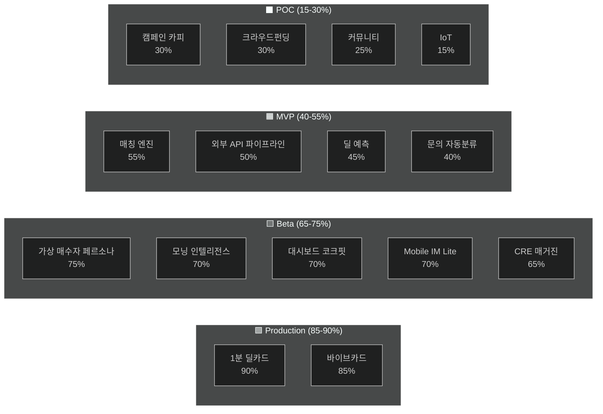

# CRE DealCard — 기능 가치 분석 & 성숙도 평가

> **기준일**: 2026-06-15 · **총 코드베이스**: 37,356 LoC (TS/TSX) · **42개 DB 마이그레이션** · **16개 AI 에이전트**

---

## 이번 세션 구현/고도화 회고

| 커밋 | 변경 내용 | 영향 범위 |
|------|-----------|-----------|
| `22114ec` | 데일리 CRE 매거진 — 공개 페이지 + 데이터 API + 동적 OG + 뷰어 + 대시보드 공유 버튼 | 신규 4파일, 수정 1파일 |
| `2555117` | 카카오 공유 OG 이미지 동적화 — 딜카드별 `/api/og/deal/[id]`, 딜 제목, 브로커 프로필 2버튼 | 수정 2파일 |
| `8b088ca` | VibeShareSheet SDK 업그레이드 — Kakao.Share.sendDefault(), QR코드 실제 렌더링 | 수정 1파일 |
| (문서) | 외부 API 연동 로드맵 — 빅카인즈/네이버/YouTube/경매/KOSIS 체계적 정리 | 아티팩트 |
| (설정) | 카카오 앱 등록 + JS SDK 키 + 도메인 등록 가이드 | 운영 인프라 |

---

## 기능별 가치 순위 & 성숙도

> **성숙도 등급**: ⬛ POC (개념증명) · 🟧 MVP (최소 작동) · 🟨 Beta (실사용 가능) · 🟩 Production (프로덕션 배포)

---

### 🥇 1. 1분 딜카드 (블라인드 티저 생성)

**중개인 가치**: ★★★★★ — *"카톡 메모 한 줄로 전문적인 블라인드 딜카드 완성"*

| 지표 | 수치 |
|------|------|
| 코드 규모 | ~2,800 LoC (에이전트 + 스키마 + 프롬프트 + UI) |
| AI 에이전트 | `broker-deal-card.ts` (파싱 + 블라인드 생성) |
| DB 테이블 | `building_ssot_lite`, `building_signal_cards`, `document_objects` |
| UI | 입력폼 → AI 파싱 → 결과 카드 + 카톡 전송 + IM 생성 CTA |

```
성숙도: 🟩 Production
━━━━━━━━━━━━━━━━━━━━ 90%
```

| 완성 | 미완성 |
|------|--------|
| ✅ 메모 파싱 → 구조화 | ⚠️ 사진 자동 분류 (visual-classification-agent 코드 있으나 UI 미연동) |
| ✅ 블라인드 티저 생성 | ⚠️ 임대차 딜카드 (lease-deal-card) 스키마/프롬프트만 존재 |
| ✅ 카카오 SDK 공유 (이번 세션 완성) | |
| ✅ 딜카드별 동적 OG 이미지 (이번 세션 완성) | |
| ✅ 게이트(비공개 정보 잠금) | |

---

### 🥈 2. 모닝 인텔리전스 (AI 시장 브리핑)

**중개인 가치**: ★★★★★ — *"아침마다 고객에게 보낼 무기가 자동으로 준비됨"*

| 지표 | 수치 |
|------|------|
| 코드 규모 | ~1,560 LoC (대시보드 컴포넌트) + ~770 LoC (API 3개) |
| AI 에이전트 | 모닝 브리핑 전용 LLM 호출 (gpt-5.4) |
| DB 테이블 | `external_news`, `market_sentiment_polls`, `social_sentiment`, `auction_listings`, `external_reports` |
| 권역 | 성수/강남 GBD/여의도 YBD 3개 (이전 세션에서 확정) |

```
성숙도: 🟨 Beta
━━━━━━━━━━━━━━━━━━━━ 70%
```

| 완성 | 미완성 |
|------|--------|
| ✅ 대시보드 프리미엄 UI (리치 텍스트 파서) | 🔴 빅카인즈 API 키 미확보 → 뉴스 빈약 |
| ✅ 권역별 브리핑 탭 전환 | 🔴 네이버 검색 API 미연동 → 실시간 뉴스 없음 |
| ✅ AI 편집 + 감성 분석 | 🟡 Vercel Cron Job 미설정 → 수동 호출만 가능 |
| ✅ 매거진 공유 버튼 (이번 세션 완성) | 🟡 YouTube API 미연동 |
| ✅ 시장 데이터 갱신 버튼 | |

> [!IMPORTANT]
> **가치는 최고이나, 외부 데이터 소스 연동이 없으면 AI가 빈 데이터로 브리핑을 작성합니다.** 네이버 검색 API (5분 발급)가 최우선.

---

### 🥉 3. 데일리 CRE 매거진 (카카오톡 공유)

**중개인 가치**: ★★★★★ — *"고객에게 나만의 부동산 매거진을 보내는 마케팅 무기"*

| 지표 | 수치 |
|------|------|
| 코드 규모 | ~722 LoC (뷰어 + 페이지) + ~270 LoC (API + OG) |
| 페이지 | `/magazine/[brokerId]/[date]` (공개) |
| OG 이미지 | `/api/og/magazine/route.tsx` (1200×630 동적) |
| 섹션 수 | 8개 (히어로 ~ CTA) |

```
성숙도: 🟨 Beta
━━━━━━━━━━━━━━━━━━━━ 65%
```

| 완성 | 미완성 |
|------|--------|
| ✅ 모바일 프리미엄 매거진 UI (이번 세션) | 🟡 Cron 자동 생성 미구현 → 수동 API 호출 |
| ✅ 동적 OG 이미지 (이번 세션) | 🟡 `magazine_issues` 테이블 마이그레이션 필요 |
| ✅ Web Share API + 카카오톡 공유 | 🟡 모닝 인텔리전스와 동일한 데이터 빈약 문제 |
| ✅ 딜카드 하이라이트 가로 스크롤 | |
| ✅ 브로커 바이브카드 CTA 하단 고정 | |

---

### 4. Mobile IM Lite (AI 투자설명서)

**중개인 가치**: ★★★★☆ — *"2분 만에 전문적인 투자설명서 자동 생성, 링크로 공유"*

| 지표 | 수치 |
|------|------|
| 코드 규모 | ~2,770 LoC (도메인) + ~1,025 LoC (공개 뷰어) |
| AI 에이전트 | `BuildingSnapshotAgent.ts` (7섹션 작성) |
| DB 테이블 | `document_objects`, `external_data_cache`, `building_ssot_lite` |
| 섹션 수 | 7개 (물건개요 ~ 다음단계) |

```
성숙도: 🟨 Beta
━━━━━━━━━━━━━━━━━━━━ 70%
```

| 완성 | 미완성 |
|------|--------|
| ✅ 7섹션 마크다운 자동 생성 (writer) | 🟡 실제 빌딩 생성 파이프라인 E2E 미검증 |
| ✅ 공개 모바일 뷰어 (아코디언 + 잠금) | 🟡 음성 브리핑(TTS) 데모 데이터만 |
| ✅ 데모 3건 풀 콘텐츠 | 🟡 공공데이터 외부 연동 fault-tolerant이지만 실환경 미테스트 |
| ✅ 브로커 프로필 + 전화 CTA | |
| ✅ Web Share API 공유 | |

---

### 5. 바이브카드 (AI 브로커 명함)

**중개인 가치**: ★★★★☆ — *"AI가 내 전문성을 분석한 디지털 명함, 고객에게 신뢰감"*

| 지표 | 수치 |
|------|------|
| 코드 규모 | ~2,234 LoC (컴포넌트) + ~468 LoC (공개 페이지) |
| AI 에이전트 | `vibe-fit-agent.ts` (스코어링) |
| DB 테이블 | `broker_profiles`, `profiles`, `broker_vibe_cards` |
| 페이지 | `/vibe-card/[slug]` |

```
성숙도: 🟩 Production
━━━━━━━━━━━━━━━━━━━━ 85%
```

| 완성 | 미완성 |
|------|--------|
| ✅ 프리미엄 명함 UI (템플릿 시스템) | 🟡 바이브 스코어 실시간 갱신 자동화 |
| ✅ OG 이미지 동적 생성 | |
| ✅ 카카오 SDK 공유 팝업 (이번 세션 업그레이드) | |
| ✅ QR 코드 실제 생성 (이번 세션) | |
| ✅ 공유 바텀시트 (URL/카카오/이미지/QR) | |
| ✅ 데모 3명 시딩 | |

---

### 6. AI 매칭 엔진 (매수자↔매물)

**중개인 가치**: ★★★★☆ — *"등록된 매수 의향과 매물을 자동 매칭, 놓치는 딜 없음"*

| 지표 | 수치 |
|------|------|
| 코드 규모 | ~1,657 LoC (매칭 도메인) + ~1,200 LoC (UI) |
| AI 에이전트 | `tenant-fit-agent.ts`, `buyer-intent-normalizer.ts`, `investor-profile-normalizer.ts` |
| DB 테이블 | `match_results`, `buyer_intent_lite`, `match_stages` |
| 알고리즘 | 6축 가중치 스코어링 (`weight-engine.ts`) |

```
성숙도: 🟧 MVP
━━━━━━━━━━━━━━━━━━━━ 55%
```

| 완성 | 미완성 |
|------|--------|
| ✅ 6축 매칭 알고리즘 (구현+테스트) | 🔴 매칭 파이프라인 자동 실행 미구현 |
| ✅ 매칭 결과 UI 페이지 | 🟡 매칭 스테이지 트래킹 스키마만 존재 |
| ✅ 매수자 의향서 입력 폼 | 🟡 알림 시스템 (신규 매칭 시 브로커 알림) |
| ✅ 매칭된 매수자 섹션 (딜카드 내) | |

---

### 7. AI 가상 매수자 페르소나

**중개인 가치**: ★★★★☆ — *"이 매물을 살 사람이 누구인지 AI가 알려줌"*

| 지표 | 수치 |
|------|------|
| 코드 규모 | ~500 LoC (UI) + ~120 LoC (에이전트) + ~60 LoC (스키마) |
| AI 에이전트 | `ideal-buyer-persona.ts` |
| UI | `IdealBuyerPersonaSection.tsx` (딜카드 페이지 내장) |

```
성숙도: 🟨 Beta
━━━━━━━━━━━━━━━━━━━━ 75%
```

| 완성 | 미완성 |
|------|--------|
| ✅ AI 페르소나 3명 생성 + UI 카드 | 🟡 페르소나 → 실제 매칭 DB 연동 |
| ✅ 매칭 적합도 % + 접근 전략 + 행동 플랜 | |
| ✅ LocalStorage 캐싱 | |

---

### 8. 중개인 대시보드 (코크핏)

**중개인 가치**: ★★★☆☆ — *"모든 기능의 허브, 일목요연한 현황 파악"*

| 지표 | 수치 |
|------|------|
| 코드 규모 | ~11,981 LoC (전체 브로커 앱) |
| 위젯 | KPI 카드 4개, ROI 분석, 안티프래질 모드, 주간 리포트, 알림 피드, 모닝 인텔리전스 |
| DB | 12+ 테이블 실시간 조회 |

```
성숙도: 🟨 Beta
━━━━━━━━━━━━━━━━━━━━ 70%
```

---

### 9. 외부 데이터 연동 (공공 API 파이프라인)

**중개인 가치**: ★★★☆☆ — *"건축물대장·실거래가·등기를 자동으로 수집"*

| 지표 | 수치 |
|------|------|
| 코드 규모 | ~722 LoC (9개 파일) |
| API 수 | 6개 (주소변환 + 건축물대장 + 공시지가 + 토지이용 + 실거래 + 카카오POI) |
| 오케스트레이터 | `external-data-orchestrator.ts` (병렬 호출 + fault-tolerant) |

```
성숙도: 🟧 MVP
━━━━━━━━━━━━━━━━━━━━ 50%
```

| 완성 | 미완성 |
|------|--------|
| ✅ 6개 API 코드 구현 | 🔴 API 키 실환경 테스트 미검증 |
| ✅ 캐싱 (Supabase 저장) | 🔴 모닝 브리핑용 뉴스 API 없음 (빅카인즈/네이버) |
| ✅ 오류 격리 (개별 API 실패 허용) | 🟡 경매/공매 API 미구현 |

---

### 10. 딜 예측 & 호기심 스코어

**중개인 가치**: ★★★☆☆ — *"이 딜이 얼마나 관심을 끌지 AI가 예측"*

```
성숙도: 🟧 MVP  ━━━━━━ 45%
```
- ✅ `deal-curiosity-writer.ts` + `DealPredictionSection.tsx` 존재
- 🔴 학습 데이터 부족으로 정확도 미검증

---

### 11. 문의 자동 분류 (Inquiry Qualifier)

**중개인 가치**: ★★★☆☆ — *"고객 문의를 자동 분류하고 카톡 답변 초안 생성"*

```
성숙도: 🟧 MVP  ━━━━━━ 40%
```
- ✅ AI 에이전트 + 프롬프트 + 스키마 완성
- 🔴 UI 미구현 — 백엔드만 존재

---

### 12. 캠페인 카피 생성

**중개인 가치**: ★★☆☆☆ — *"카톡/네이버/SMS 채널별 마케팅 문구 자동 생성"*

```
성숙도: ⬛ POC  ━━━━ 30%
```
- ✅ `campaign-copy-agent.ts` + 프롬프트 존재
- 🔴 UI 없음, API route 없음

---

### 13. 크라우드펀딩 프로젝트 카드

**중개인 가치**: ★★☆☆☆

```
성숙도: ⬛ POC  ━━━━ 30%
```
- ✅ `funding-project-card.ts` AI 에이전트 + 스키마 존재
- 🔴 UI 없음

---

### 14. 커뮤니티 (Agora)

**중개인 가치**: ★★☆☆☆

```
성숙도: ⬛ POC  ━━━━ 25%
```
- ✅ DB 스키마 (`agora_threads_replies`) 존재
- 🔴 UI 없음

---

### 15. IoT / 리빙데이터

**중개인 가치**: ★☆☆☆☆

```
성숙도: ⬛ POC  ━━━ 15%
```
- ✅ DB 스키마만 존재
- 🔴 코드 미구현

---

## 전체 성숙도 시각화



---

## 이번 세션 가치 임팩트 요약

| 작업 | 영향받은 기능 | 가치 변화 |
|------|-------------|-----------|
| 카카오 SDK 연동 + 앱 등록 가이드 | 딜카드·바이브카드·매거진 **공유 인프라 전체** | 공유 불가 → 원클릭 공유 |
| 딜카드 OG 동적화 | 카카오톡 공유 미리보기 | 동일 이미지 → 딜별 차별화 |
| VibeShareSheet 업그레이드 | 바이브카드 공유 | 문구복사 → 네이티브 공유 팝업 |
| QR 코드 실제 생성 | 바이브카드 | placeholder → 작동하는 QR |
| API 로드맵 정리 | 모닝 인텔리전스·매거진 데이터 품질 | 로드맵 없음 → 7개 API 체계화 |

---

## 권장 다음 단계 (가치/노력 비율 순)

| 순위 | 작업 | 소요 | 가치 임팩트 |
|------|------|------|------------|
| 1 | **네이버 검색 API 연동** (키 발급 5분 + 코드 2시간) | 🟢 낮음 | 모닝 브리핑 뉴스 품질 **5배 향상** |
| 2 | **Vercel Cron 설정** (매일 08:00 브리핑 자동 생성) | 🟢 낮음 | 매거진 자동 발행 |
| 3 | **빅카인즈 API 신청 + 연동** (3일 대기 + 3시간 코드) | 🟡 중간 | 프로 수준 뉴스 큐레이션 |
| 4 | **매칭 자동 실행 파이프라인** | 🟡 중간 | 딜 매칭 자동화 |
| 5 | **문의 자동분류 UI** | 🟡 중간 | 카톡 답변 초안 자동 생성 |
