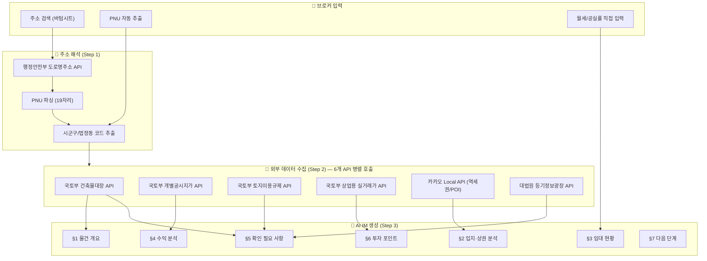
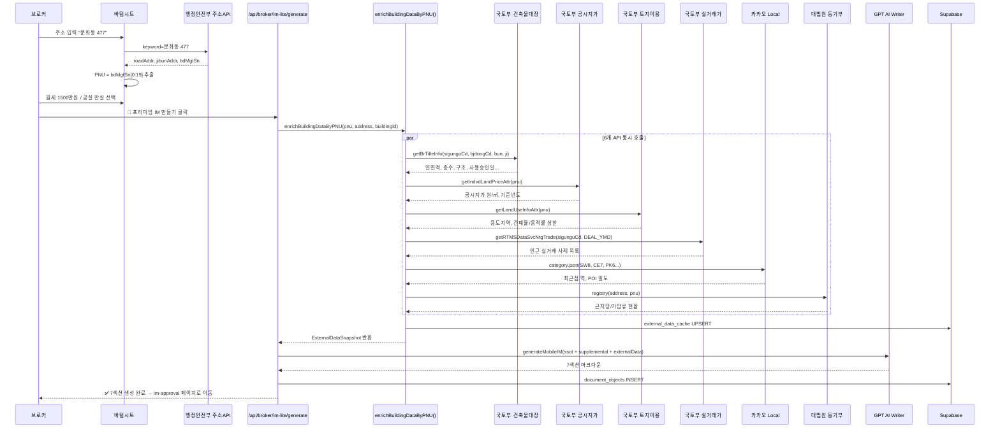

# 🔍 국토부 API 연동 정밀 감사 보고서

> **대상 시스템**: credeal.net / cre-dealcard  
> **감사 일시**: 2026-06-21  
> **감사 범위**: 건물 지번 입력 → 외부 API 호출 → 모바일 IM 생성 전체 파이프라인

---

## 1. 전체 데이터 흐름 아키텍처



---

## 2. 진입 경로 (2가지)

모바일 IM 생성 API ([route.ts](file:///c:/Users/User/cre-dealcard/src/app/api/broker/im-lite/generate/route.ts))에서 외부 데이터를 수집하는 경로는 **3가지 분기**입니다:

| 우선순위 | 조건 | 호출 함수 | 파일 |
|----------|------|-----------|------|
| **Path A** | `resolved_pnu` 존재 | `enrichBuildingDataByPNU()` | [enrich-by-pnu.ts](file:///c:/Users/User/cre-dealcard/src/lib/external/enrich-by-pnu.ts) |
| **Path B** | `resolved_address` 존재 | `enrichBuildingData()` | [external-data-orchestrator.ts](file:///c:/Users/User/cre-dealcard/src/lib/external/external-data-orchestrator.ts) |
| **Path C** | 둘 다 없음 → `layers`/`raw_input`/`area_signal`에서 주소 추출 | `enrichBuildingData()` | 동일 |

> [!IMPORTANT]
> Path A(PNU 직접)는 주소 해석 단계를 건너뛰어 **실패 위험 0%**입니다. 바텀시트에서 주소 검색→선택 시 `bdMgtSn`(건물관리번호)에서 PNU가 자동 추출되므로 항상 Path A로 진입합니다.

---

## 3. 외부 API 상세 감사

### 3.1 🏛️ 행정안전부 도로명주소 API (주소 해석)

| 항목 | 값 |
|------|-----|
| **파일** | [address-resolver.ts](file:///c:/Users/User/cre-dealcard/src/lib/external/address-resolver.ts) |
| **엔드포인트** | `https://business.juso.go.kr/addrlink/addrLinkApi.do` |
| **환경변수** | `JUSO_CONFIRM_KEY` |
| **타임아웃** | 5,000ms |
| **추출 데이터** | `roadAddr`, `jibunAddr`, `bdMgtSn`(건물관리번호) → **PNU 파생** |
| **Fallback** | 정규식 기반 본번/부번 추출 + 하드코딩 법정동 코드 맵 (서울 17개 동) |
| **IM 활용** | PNU로 후속 API 호출의 Key 파라미터 생성 |

**PNU 파싱 로직:**
```
bdMgtSn[0:19] → PNU (19자리)
├─ [0:5]  → sigunguCd (시군구 코드, 예: 11680 = 강남구)
├─ [5:10] → bjdongCd  (법정동 코드, 예: 10100 = 역삼동)
├─ [11:15] → bun       (본번)
└─ [15:19] → ji        (부번)
```

---

### 3.2 🏗️ 국토교통부 건축물대장 표제부 API

| 항목 | 값 |
|------|-----|
| **파일** | [building-register-api.ts](file:///c:/Users/User/cre-dealcard/src/lib/external/building-register-api.ts) |
| **엔드포인트** | `http://apis.data.go.kr/1613000/BldRgstService_v2/getBrTitleInfo` |
| **환경변수** | `DATA_GO_KR_API_KEY` |
| **파라미터** | `sigunguCd, bjdongCd, bun, ji` |
| **타임아웃** | 5,000ms |

**추출 데이터 → IM 활용:**

| API 필드 | 변환명 | IM 활용 섹션 | 활용 방식 |
|----------|--------|-------------|-----------|
| `totArea` | totalArea | §1 물건 개요 | 연면적 (㎡ → 평 환산) |
| `platArea` | platArea | §1 물건 개요 | 대지면적 표시 |
| `useAprDay` | useAprDay | §1 물건 개요 | 사용승인일 (건물 연식) |
| `mainPurpsCdNm` | mainPurpose | §1 물건 개요 | 주용도 (근린생활, 업무시설 등) |
| `strctCdNm` | structure | §1 물건 개요 | 건물구조 (철근콘크리트 등) |
| `grndFlrCnt` | floorsAbove | §1 물건 개요 | 지상 층수 |
| `ugrndFlrCnt` | floorsBelow | §1 물건 개요 | 지하 층수 |
| `bcRat` | bcRat | §5 리스크 | 건폐율 (용도지역 대비 검증) |
| `vlRat` | vlRat | §5 리스크 | 용적률 (용도지역 대비 검증) |
| `bldNm` | buildingName | §1 물건 개요 | 건물명 |

**Fallback**: `bun + ji`의 정수 시드를 이용한 결정론적(deterministic) 모의 데이터 생성

---

### 3.3 💰 국토교통부 개별공시지가 API

| 항목 | 값 |
|------|-----|
| **파일** | [land-price-api.ts](file:///c:/Users/User/cre-dealcard/src/lib/external/land-price-api.ts) |
| **엔드포인트** | `http://apis.data.go.kr/1611000/IndvdLandPriceService/getIndvdLandPriceAttr` |
| **환경변수** | `DATA_GO_KR_API_KEY` |
| **파라미터** | `pnu` |
| **타임아웃** | 5,000ms |

**추출 데이터 → IM 활용:**

| API 필드 | 변환명 | IM 활용 섹션 |
|----------|--------|-------------|
| `pblntfPclnd` | pricePerSqm | §4 수익 분석 — 공시지가 표시 |
| `crtrYr` | baseYear | §4 수익 분석 — 기준년도 |
| `ldcgCdNm` | landCategory | §4 수익 분석 — 지목 (대, 전 등) |

**Fallback**: 강남구 PNU(`11680`) → 2,500만원대/㎡, 기타 → 800만원대/㎡

---

### 3.4 🗺️ 국토교통부 토지이용규제정보 API (LURIS)

| 항목 | 값 |
|------|-----|
| **파일** | [land-use-api.ts](file:///c:/Users/User/cre-dealcard/src/lib/external/land-use-api.ts) |
| **엔드포인트** | `http://apis.data.go.kr/1611000/LandUseInfoService/getLandUseInfoAttr` |
| **환경변수** | `DATA_GO_KR_API_KEY` |
| **파라미터** | `pnu` |
| **타임아웃** | 5,000ms |

**추출 데이터 → IM 활용:**

| API 필드 | 변환명 | IM 활용 섹션 |
|----------|--------|-------------|
| `prposAreaDstrcCodeNm` | zoningDistrict | §5 리스크 — 용도지역 표시 |
| `etcCodeNm` | zoningOverlap[] | §5 리스크 — 기타 용도지구 |
| *(파생)* | buildingCoverageMax | §5 리스크 — 건폐율 상한 (건축물대장 bcRat과 교차검증) |
| *(파생)* | floorAreaRatioMax | §5 리스크 — 용적률 상한 (건축물대장 vlRat과 교차검증) |

**용적률 상한 파생 로직:**
```
상업지역 → 건폐율 60%, 용적률 800%
준주거지역 → 건폐율 60%, 용적률 400%
제3종일반주거 → 건폐율 50%, 용적률 250%
제2종일반주거 → 건폐율 60%, 용적률 200%
```

---

### 3.5 📊 국토교통부 상업용 부동산 실거래가 API

| 항목 | 값 |
|------|-----|
| **파일** | [real-transaction-api.ts](file:///c:/Users/User/cre-dealcard/src/lib/external/real-transaction-api.ts) |
| **엔드포인트** | `http://apis.data.go.kr/1613000/RTMSOBJSvc/getRTMSDataSvcNrgTrade` |
| **환경변수** | `DATA_GO_KR_API_KEY` |
| **파라미터** | `LAWD_CD=sigunguCd, DEAL_YMD=연월` |
| **타임아웃** | 5,000ms |

**추출 데이터 → IM 활용:**

| 추출 항목 | IM 활용 섹션 |
|-----------|-------------|
| `dealAmount` (만원→원 변환) | §6 투자 포인트 — 인근 거래 사례 |
| `pricePerPyeong` (×3.30578) | §6 투자 포인트 — 평균 평당가 |
| `area`, `address`, `dealYear/Month` | §6 투자 포인트 — 비교 거래 카드 |

---

### 3.6 📍 카카오 Local API (역세권/생활인프라)

| 항목 | 값 |
|------|-----|
| **파일** | [kakao-map-api.ts](file:///c:/Users/User/cre-dealcard/src/lib/external/kakao-map-api.ts) |
| **엔드포인트 1** | `dapi.kakao.com/v2/local/search/category.json?category_group_code=SW8` (지하철) |
| **엔드포인트 2** | 동일 API × 4 카테고리 (CE7 카페, PK6 주차장, FD6 식당, CS2 편의점) |
| **인증** | `Authorization: KakaoAK {KAKAO_REST_API_KEY}` |
| **반경** | 지하철 1,000m / POI 500m |

**추출 데이터 → IM 활용:**

| 추출 항목 | IM 활용 섹션 |
|-----------|-------------|
| `nearestStation.name` | §2 입지·상권 — "OO역 도보 O분" |
| `nearestStation.distanceM` | §2 입지·상권 — 거리 표시 |
| `nearestStation.walkMinutes` | §2 입지·상권 — 도보 시간 (distance÷80) |
| `poiCounts.cafe/restaurant/...` | §2 입지·상권 — 생활 인프라 밀도 표 |
| `mapImageUrl` (정적지도) | §2 입지·상권 — 지도 이미지 임베드 |

---

### 3.7 ⚖️ 대법원 등기정보광장 API

| 항목 | 값 |
|------|-----|
| **파일** | [registry-api.ts](file:///c:/Users/User/cre-dealcard/src/lib/external/registry-api.ts) |
| **엔드포인트** | `https://www.iros.go.kr/openapi/v1/registry` |
| **환경변수** | `REGISTRY_API_KEY` |
| **타임아웃** | 10,000ms (가장 긴 타임아웃) |

**추출 데이터 → IM 활용:**

| 추출 항목 | IM 활용 섹션 |
|-----------|-------------|
| `mortgages[]` (근저당) | §5 리스크 — 근저당 현황 |
| `attachments[]` (가압류) | §5 리스크 — 가압류 현황 |
| `encumbranceRisk` | §5 리스크 — 리스크 등급 배지 |

**리스크 등급 파생:**
```
가압류 존재 → 'high_risk' 🔴
활성 근저당 합계 ≥ 10억원 → 'check_required' 🟡
활성 근저당 없음 → 'clean' 🟢
API 키 없음 → 'unavailable' ⚪
```

---

## 4. 모바일 IM 7개 섹션별 외부 데이터 활용 매트릭스

| 섹션 | 건축물대장 | 공시지가 | 토지이용 | 실거래가 | 카카오POI | 등기부 | 브로커 입력 |
|------|:--------:|:------:|:------:|:------:|:-------:|:----:|:--------:|
| §1 물건 개요 | ✅ 핵심 | — | — | — | — | — | ○ |
| §2 입지·상권 | — | — | — | — | ✅ 핵심 | — | — |
| §3 임대 현황 | — | — | — | — | — | — | ✅ 핵심 |
| §4 수익 분석 | ○ | ✅ 핵심 | — | — | — | — | ✅ 핵심 |
| §5 리스크 | ✅ 핵심 | — | ✅ 핵심 | — | — | ✅ 핵심 | — |
| §6 투자 포인트 | — | — | — | ✅ 핵심 | — | — | ○ |
| §7 다음 단계 | — | — | — | — | — | — | — (정적) |

> ✅ = 핵심 데이터 소스 / ○ = 보조 데이터 / — = 미사용

---

## 5. 필수 환경변수 현황

| 환경변수 | 용도 | 제공기관 | 필수 여부 |
|---------|------|---------|:--------:|
| `JUSO_CONFIRM_KEY` | 도로명주소 검색 | 행정안전부 | ✅ 핵심 |
| `DATA_GO_KR_API_KEY` | 건축물대장/공시지가/토지이용/실거래가 | 공공데이터포털 | ✅ 핵심 |
| `KAKAO_REST_API_KEY` | 역세권/POI/정적지도 | 카카오 | ✅ 핵심 |
| `REGISTRY_API_KEY` | 등기부 등본 | 대법원 등기정보광장 | ⚠️ 선택 |
| `MOLIT_API_KEY` | 국토부 프리미엄 (오피스시장동향) | 국토부 | ⚠️ 선택 |
| `SEMAS_API_KEY` | 소상공인 상권분석 | 소상공인진흥공단 | ⚠️ 선택 |
| `ENERGY_API_KEY` | 건물에너지효율등급 | 한국에너지공단 | ⚠️ 선택 |

---

## 6. 감사 발견사항 (Findings)

### 🟢 양호 사항

| # | 항목 | 평가 |
|---|------|------|
| F1 | **Fault-Tolerant 설계** | 6개 API 모두 개별 try/catch + 병렬 `Promise.all()` 처리. 1개 API 실패해도 나머지 정상 작동 |
| F2 | **Deterministic Fallback** | 모든 API에 시드 기반 Mock 데이터 존재. API 키 없이도 시스템 기능 유지 |
| F3 | **Supabase 캐싱** | `external_data_cache` 테이블에 Upsert 저장. 동일 건물 재생성 시 API 재호출 불필요 |
| F4 | **PNU 직접 경로** | 바텀시트 주소 선택 시 `bdMgtSn`에서 PNU 자동 추출 → 주소 해석 실패 위험 제거 |

### 🟡 주의 사항

| # | 항목 | 상세 | 위험도 |
|---|------|------|--------|
| F5 | **Mock 좌표 사용** | [enrich-by-pnu.ts](file:///c:/Users/User/cre-dealcard/src/lib/external/enrich-by-pnu.ts)에서 PNU→좌표 변환 시 **실제 Geocoding 없이** 키워드 기반 하드코딩 좌표 사용 (삼성→37.5088, 성수→37.5447 등). **카카오 POI 검색 결과 부정확** 가능 | ⚠️ 중 |
| F6 | **주소 해석기 이중화** | `src/lib/external/address-resolver.ts`와 `src/domain/verification/address-resolver.ts` 두 파일이 동일 API를 호출하되 **다른 반환 형식** 사용. 유지보수 혼선 우려 | ⚠️ 낮 |
| F7 | **XML 파싱 취약** | [gov-premium-apis.ts](file:///c:/Users/User/cre-dealcard/src/domain/external/gov-premium-apis.ts)에서 정규식 기반 XML 파싱 사용. API 응답 형식 변경 시 파싱 실패 가능 | ⚠️ 중 |
| F8 | **실거래가 조회 기간 고정** | [real-transaction-api.ts](file:///c:/Users/User/cre-dealcard/src/lib/external/real-transaction-api.ts)에서 `DEAL_YMD` 기본값이 `"202510"`으로 하드코딩. 현재 날짜 기반 동적 계산 필요 | 🔴 높 |
| F9 | **등기 API 키 부재 시 무조건 스킵** | `REGISTRY_API_KEY` 미설정 시 `UNAVAILABLE_FALLBACK` 반환. 리스크 분석 §5에서 등기 정보 완전 누락 | ⚠️ 중 |

### 🔴 개선 필요 사항

| # | 항목 | 상세 |
|---|------|------|
| F10 | **프리미엄 API와 코어 API 이중 구현** | `gov-premium-apis.ts`의 `fetchOfficialLandPrice()`와 `land-price-api.ts`의 `fetchLandPrice()`가 **다른 엔드포인트**로 같은 데이터를 조회. 데이터 불일치 가능 |
| F11 | **캐시 무효화 전략 부재** | `external_data_cache` 테이블에 TTL/만료 정책 없음. 건축물대장 정보 변경(증축, 용도변경) 시 오래된 데이터 제공 위험 |

---

## 7. 데이터 흐름 요약 다이어그램



---

## 8. 결론

### 확보 데이터 총량

건물 지번 1건 입력 시 **최대 6개 외부 API**에서 아래 데이터를 확보합니다:

| 카테고리 | 데이터 항목 수 | 출처 |
|---------|:------------:|------|
| 건축물 물리 정보 | 10개 | 국토부 건축물대장 |
| 토지 가격/지목 | 3개 | 국토부 공시지가 |
| 용도지역/규제 | 4개 | 국토부 토지이용규제 |
| 인근 거래 사례 | 최대 10건 | 국토부 실거래가 |
| 생활 인프라 | 7개 항목 | 카카오 Local |
| 등기 부담 정보 | 3개 카테고리 | 대법원 등기정보광장 |
| **합계** | **37+ 데이터 포인트** | **6개 API** |

이 37개 이상의 데이터 포인트가 AI Writer의 **7개 섹션 전체에 걸쳐** 분산 활용되며, 브로커가 입력한 월세/공실률과 결합하여 투자설명서의 정량적 근거를 형성합니다.

> [!NOTE]
> 모든 API에 Fallback이 있으므로 **API 키가 없어도 시스템은 작동**하지만, Mock 데이터로 생성된 IM의 §5 리스크 분석과 §4 수익 분석의 정확도가 크게 저하됩니다. 실운영 시 최소한 `DATA_GO_KR_API_KEY`와 `KAKAO_REST_API_KEY`가 반드시 설정되어야 합니다.
