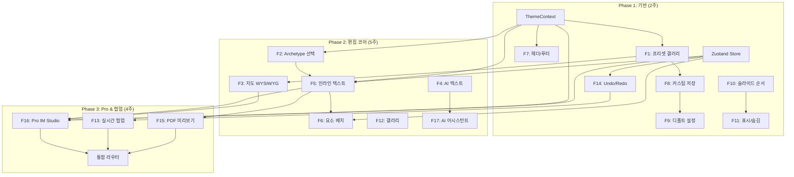

# Phase 3: Pro IM Studio & 협업 & 통합 (4주)

> **의존성**: Phase 1 (ThemeContext, Zustand) + Phase 2 (InlineTextEditor, MapEditor)
> **산출물**: Pro IM Studio, 실시간 협업, PDF 미리보기, 통합 Studio 라우터

---

## 3.1 Pro IM Studio (F16)

### 현재 상태 (코드베이스 감사 결과)

- **Pro IM 뷰어만 존재**: `/im-pro/[grantId]/page.tsx` — NDA 게이트, 워터마크, DCF 테이블 **읽기 전용**
- **Pro 덱 시퀀서**: `pro-deck-sequencer.ts` — 5대 챕터 (30~40면) 자동 생성
  - Front Matter → Ch.1 Executive Summary → Ch.2 Asset → Ch.3 Financial → Ch.4 Market → Ch.5 Legal
- **Pro 재무 모델**: `pro-financial-model.ts`
  - `MultiYearCashFlowInput` → 10년 DCF, IRR(Newton-Raphson), NPV, Sensitivity Matrix 2D
- **Pro 임차인 로스터**: `pro-tenant-roster.ts`
  - `InstitutionalTenantRosterItem` — 층별/호별 상세 임대차 정보 + 10년 갱신권
- **편집 UI**: **없음** — 브로커가 Pro IM 내용을 수정할 방법 없음

### 설계: Pro IM Studio 페이지

```
/broker/pro-im-studio/[dealId]
```

```
┌──────────────────────────────────────────────────────────────────┐
│  Pro IM Studio                                                    │
│                                                                  │
│  ┌────────────┬─────────────────────────────┬──────────────────┐ │
│  │ 챕터 네비   │        편집 패널             │   SVG 미리보기   │ │
│  │            │                             │                  │ │
│  │ 📋 목차    │  ┌─────────────────────┐    │   ┌──────────┐  │ │
│  │ ─────      │  │ Ch.3: 재무 모델링   │    │   │ 10-Year  │  │ │
│  │ Ch.1 요약 │  │                     │    │   │ DCF      │  │ │
│  │  ├ 요약   │  │ 보유 기간            │    │   │ Schedule │  │ │
│  │  ├ 논거   │  │ ┌──────────────┐    │    │   │          │  │ │
│  │  ├ 하이   │  │ │ 10년 ─●──── │    │    │   │  (실시간  │  │ │
│  │  ├ 위치   │  │ └──────────────┘    │    │   │   반영)   │  │ │
│  │  └ 현금   │  │                     │    │   └──────────┘  │ │
│  │ Ch.2 자산 │  │ 할인율 (Discount)    │    │                  │ │
│  │  ├ 스펙   │  │ ┌──────────────┐    │    │                  │ │
│  │  ├ 토지   │  │ │ 8.5% ─●──── │    │    │                  │ │
│  │  ├ 스택   │  │ └──────────────┘    │    │                  │ │
│  │  ├ 임차   │  │                     │    │                  │ │
│  │  └ 갤러   │  │ Exit Cap Rate       │    │                  │ │
│  │ Ch.3 재무←│  │ ┌──────────────┐    │    │                  │ │
│  │  ├ DCF   │  │ │ 5.0% ─●──── │    │    │                  │ │
│  │  ├ OPEX  │  │ └──────────────┘    │    │                  │ │
│  │  ├ Exit  │  │                     │    │                  │ │
│  │  ├ 민감도 │  │ [재계산] [되돌리기]  │    │                  │ │
│  │  └ 스트   │  └─────────────────────┘    │                  │ │
│  │ Ch.4 시장 │                             │                  │ │
│  │ Ch.5 법률 │                             │                  │ │
│  └────────────┴─────────────────────────────┴──────────────────┘ │
│                                                                  │
│  [S60 편집 승인] → [S70 파일 생성] → [NDA 링크 발급]              │
└──────────────────────────────────────────────────────────────────┘
```

### 3.1.1 챕터 네비게이터

```typescript
// [신규] src/app/(broker)/broker/pro-im-studio/[dealId]/components/ChapterNavigator.tsx

interface Chapter {
  id: string;
  title: string;
  icon: string;
  slides: ProSlide[];
}

interface ProSlide {
  id: string;
  slideIndex: number;
  archetype: string;
  dataKey: string;
  label: string;
  chapter: number;        // 1~5
  hidden: boolean;
  slideOverrides: Record<string, any>;
}

const CHAPTER_STRUCTURE: Chapter[] = [
  {
    id: 'ch1', title: 'Executive Summary', icon: '📋',
    slides: [
      { archetype: 'A02', dataKey: 'summary', label: '핵심 요약' },
      { archetype: 'A15', dataKey: 'thesis', label: '투자 논거' },
      { archetype: 'A04', dataKey: 'highlights', label: '하이라이트' },
      { archetype: 'A06', dataKey: 'location', label: '입지 분석' },
      { archetype: 'A23', dataKey: 'cashflow', label: '현금 흐름' },
    ],
  },
  // ... Ch.2 ~ Ch.5
];
```

### 3.1.2 DCF 파라미터 편집기

```typescript
// [신규] src/components/broker/pro-im-studio/DcfEditor.tsx

import { MultiYearCashFlowInput, calculateMultiYearCashFlow } from
  '@/domain/building/im-core/pro-financial-model';

interface DcfEditorProps {
  input: MultiYearCashFlowInput;
  onChange: (input: MultiYearCashFlowInput) => void;
}

export function DcfEditor({ input, onChange }: DcfEditorProps) {
  // 파라미터를 변경하면 즉시 재계산 → SVG 프리뷰 업데이트
  const cashFlow = useMemo(() => calculateMultiYearCashFlow(input), [input]);

  return (
    <div className="space-y-4">
      {/* 슬라이더 + 숫자 입력 하이브리드 */}
      <ParamSlider
        label="보유 기간"
        value={input.holdingPeriodYears}
        min={3} max={15} step={1}
        unit="년"
        onChange={v => onChange({ ...input, holdingPeriodYears: v })}
      />
      <ParamSlider
        label="할인율 (Discount Rate)"
        value={input.discountRatePct}
        min={5} max={15} step={0.25}
        unit="%"
        onChange={v => onChange({ ...input, discountRatePct: v })}
      />
      <ParamSlider
        label="Exit Cap Rate"
        value={input.exitCapRatePct}
        min={3} max={10} step={0.25}
        unit="%"
        onChange={v => onChange({ ...input, exitCapRatePct: v })}
      />
      <ParamSlider
        label="공실률"
        value={input.vacancyRatePct}
        min={0} max={30} step={0.5}
        unit="%"
        onChange={v => onChange({ ...input, vacancyRatePct: v })}
      />
      <ParamSlider
        label="임대료 상승률"
        value={input.rentGrowthRatePct}
        min={0} max={10} step={0.25}
        unit="%/년"
        onChange={v => onChange({ ...input, rentGrowthRatePct: v })}
      />

      {/* 즉시 계산 결과 요약 */}
      <div className="grid grid-cols-3 gap-2 p-3 bg-muted rounded">
        <MetricCard label="Unlevered IRR" value={`${(cashFlow.metrics.unleveredIrr * 100).toFixed(2)}%`} />
        <MetricCard label="NPV" value={`${(cashFlow.metrics.npvKrw / 1e8).toFixed(1)}억`} />
        <MetricCard label="Initial Cap" value={`${(cashFlow.metrics.initialCapRate * 100).toFixed(2)}%`} />
      </div>
    </div>
  );
}
```

### 3.1.3 민감도 분석 2D 그리드 편집기

```typescript
// [신규] src/components/broker/pro-im-studio/SensitivityEditor.tsx

interface SensitivityEditorProps {
  exitCapRange: { min: number; max: number; step: number };
  discountRange: { min: number; max: number; step: number };
  onChange: (config: SensitivityConfig) => void;
}

// 2D 히트맵 미리보기:
// - X축: Exit Cap Rate (3.5% ~ 7.0%)
// - Y축: Discount Rate (7.0% ~ 10.5%)
// - 셀: Unlevered IRR (색상 코딩: 초록 > 8%, 노랑 5~8%, 빨강 < 5%)
// - 드래그로 범위 조절
```

### 3.1.4 임차인 로스터 편집기

```typescript
// [신규] src/components/broker/pro-im-studio/TenantRosterEditor.tsx

import { InstitutionalTenantRosterItem } from '@/domain/building/im-core/pro-tenant-roster';

interface TenantRosterEditorProps {
  tenants: InstitutionalTenantRosterItem[];
  onChange: (tenants: InstitutionalTenantRosterItem[]) => void;
}

// 스프레드시트 스타일 인라인 편집:
// - 행 추가/삭제
// - 셀 클릭 → 인라인 편집
// - 열 정렬 (층, 면적, 임대료)
// - 자동 합산 행 (총 임대면적, 총 월세, 총 보증금)
// - chunkTenantRoster(): 12행 초과 시 Part 1/Part 2 자동 분할 미리보기
```

### 3.1.5 NDA 게이트 설정

```typescript
// [신규] src/components/broker/pro-im-studio/NdaGateEditor.tsx

interface NdaGateConfig {
  requireNda: boolean;
  ndaDocUrl?: string;           // 커스텀 NDA 문서 URL
  grantDurationHours: number;   // 기본 24
  maxDownloads: number;         // 기본 3
  watermarkConfig: {
    showRequesterName: boolean;
    showPhoneLast4: boolean;
    showTimestamp: boolean;
    opacity: number;            // 0.05 ~ 0.15
    angle: number;              // -30 ~ -45 degrees
  };
}
```

---

## 3.2 실시간 협업 (F13)

### 현재 상태

- `useDealcardRealtimeSync.ts`: **이미 구현 완료**
  - Supabase Realtime Broadcast: `CONTENT_MUTATED`, `APPROVAL_CHANGED`, `SLIDE_OVERRIDE_CHANGED`
  - Local in-process bus (테스트용)
- **Presence (동시 편집 표시)**: 미구현
- **Conflict Resolution**: `lockVersion` OCC — HTTP 409 STALE_LOCK_ERROR

### 설계: Presence 레이어 추가

```typescript
// [수정] src/platform/im-pipeline/realtime/use-dealcard-realtime-sync.ts

// Presence 추가 — 현재 어떤 슬라이드를 편집 중인지 공유
export interface PresenceState {
  userId: string;
  userName: string;
  activeSlideId: string | null;
  color: string;              // 사용자별 고유 커서 색상
  lastActiveAt: string;
}

// 훅 확장
export function useDealcardRealtimeSync(
  buildingId: string | undefined,
  callbacks?: {
    onContentMutated?: (payload: ContentMutatedPayload) => void;
    onApprovalChanged?: (payload: ApprovalChangedPayload) => void;
    onSlideOverrideChanged?: (payload: SlideOverrideChangedPayload) => void;
    // ── 신규 ──
    onPresenceJoin?: (state: PresenceState) => void;
    onPresenceLeave?: (key: string) => void;
    onPresenceUpdate?: (state: PresenceState) => void;
  }
) {
  // Supabase channel.track() 사용
  // 입장 시: channel.track({ userId, userName, activeSlideId, color })
  // 슬라이드 전환 시: channel.track({ ...current, activeSlideId: newSlideId })
  // 퇴장 시: 자동 cleanup
}
```

### UI: 협업 인디케이터

```
┌────────────────────────────────────────┐
│ 슬라이드 네비게이터                      │
│ ┌──────────────────────────────┐      │
│ │ 1. 표지                🟢 나  │      │ ← 내가 편집 중
│ │ 2. 요약                🔵 김대리│     │ ← 김대리가 편집 중
│ │ 3. 물건 개요                  │      │
│ └──────────────────────────────┘      │
│                                       │
│ 👥 현재 편집 중: 나, 김대리              │
└────────────────────────────────────────┘
```

### Conflict Resolution 강화

```typescript
// 기존: HTTP 409 → toast 에러
// 신규: 3단계 자동 복구
//
// 1. 409 수신 → 서버에서 최신 project 재조회
// 2. 3-way merge: my_changes + server_state → merged
//    - 같은 slideId의 같은 field → 서버 값 우선 (Last Writer Wins)
//    - 다른 slideId 또는 다른 field → 양측 보존
// 3. 사용자에게 diff 표시 → 자동 적용 또는 수동 선택
```

---

## 3.3 PDF 미리보기 (F15)

### 설계: 클라이언트 사이드 SVG → PDF

```bash
npm install jspdf svg2pdf.js
```

```typescript
// [신규] src/components/broker/im-studio/PdfPreviewButton.tsx

import { jsPDF } from 'jspdf';
import { svg2pdf } from 'svg2pdf.js';

interface PdfPreviewButtonProps {
  slides: PptxSlide[];
  tokens: PptxThemeTokens;
}

export function PdfPreviewButton({ slides, tokens }: PdfPreviewButtonProps) {
  const [generating, setGenerating] = useState(false);

  const generatePdf = async () => {
    setGenerating(true);
    try {
      const doc = new jsPDF({ orientation: 'landscape', unit: 'pt', format: [960, 540] });

      for (let i = 0; i < slides.length; i++) {
        if (i > 0) doc.addPage();

        // 각 슬라이드의 SVG를 렌더링
        const svgElement = renderSlideSvg(slides[i], tokens); // slide-preview-svg 로직 재활용
        await svg2pdf(svgElement, doc, { x: 0, y: 0, width: 960, height: 540 });
      }

      // 미리보기 모달 또는 새 탭에서 열기
      const pdfBlob = doc.output('blob');
      const url = URL.createObjectURL(pdfBlob);
      window.open(url, '_blank');
    } finally {
      setGenerating(false);
    }
  };

  return (
    <button onClick={generatePdf} disabled={generating} className="...">
      {generating ? '🔄 PDF 생성 중...' : '📄 PDF 미리보기'}
    </button>
  );
}
```

---

## 3.4 통합 Studio 라우터

### 현재 상태

- `/broker/basic-im-studio/[buildingId]` — Basic IM 전용 Studio
- `/broker/deal-card/[id]/pptx-editor` — 골디락스/Pro PPTX 에디터
- 두 경로가 **별개의 코드 경로** — 공통 컴포넌트 재사용 없음

### 설계: 통합 진입점

```
/broker/im-studio/[buildingId]?tier=basic   → Basic IM Studio (9면)
/broker/im-studio/[buildingId]?tier=pro     → Pro IM Studio (36면)
/broker/im-studio/[buildingId]              → 자동 감지 (releaseTier 기반)
```

```typescript
// [신규] src/app/(broker)/broker/im-studio/[buildingId]/page.tsx

export default function UnifiedImStudioPage() {
  const { buildingId } = useParams();
  const searchParams = useSearchParams();
  const tier = searchParams.get('tier') ?? 'auto';

  // 자동 감지: releaseTier API 호출
  const { data: building } = useBuildingData(buildingId);
  const effectiveTier = tier === 'auto'
    ? (building?.releaseTier === 'pro' ? 'pro' : 'basic')
    : tier;

  return (
    <ThemeProvider initialPresetId={building?.defaultPresetId ?? 'credeal_basic'}>
      {effectiveTier === 'basic' ? (
        <BasicImStudioLayout buildingId={buildingId} />
      ) : (
        <ProImStudioLayout buildingId={buildingId} />
      )}
    </ThemeProvider>
  );
}
```

### 공통 컴포넌트 계층

```
src/components/broker/im-studio/          ← 공통 (Phase 1-2에서 생성)
├── PresetGallery.tsx                     ← Basic + Pro 모두 사용
├── HeaderFooterEditor.tsx                ← Basic + Pro 모두 사용
├── InlineTextEditor.tsx                  ← Basic + Pro 모두 사용
├── MapEditor.tsx                         ← Basic + Pro 모두 사용
├── AiTextGenerator.tsx                   ← Basic + Pro 모두 사용
├── GalleryCurator.tsx                    ← Basic + Pro 모두 사용
├── PdfPreviewButton.tsx                  ← Basic + Pro 모두 사용
└── ArchetypeSelector.tsx                 ← Basic + Pro 모두 사용

src/components/broker/pro-im-studio/      ← Pro 전용 (Phase 3에서 생성)
├── ChapterNavigator.tsx
├── DcfEditor.tsx
├── SensitivityEditor.tsx
├── TenantRosterEditor.tsx
└── NdaGateEditor.tsx
```

---

## 전체 기능 의존성 그래프



---

## 전체 로드맵 타임라인

```
Week  1  2  3  4  5  6  7  8  9  10  11
      ├──────┤
      Phase 1: 기반
               ├──────────────────┤
               Phase 2: 편집 코어 + 지도/AI
                                    ├──────────────┤
                                    Phase 3: Pro + 협업

기능별 상세:
W1:  ThemeContext + PresetGallery
W2:  HeaderFooter + CustomPreset + SlideManager + Undo/Redo
W3:  ArchetypeSelector + ArchetypeCompatibility
W4:  InlineTextEditor + SVG region 수집
W5:  MapEditor (Kakao SDK 통합)
W6:  AiTextGenerator (SSE API + UI)
W7:  GalleryCurator + 레이아웃 미세 조정
W8:  Pro ChapterNavigator + DcfEditor
W9:  SensitivityEditor + TenantRosterEditor
W10: Realtime Presence + Conflict Resolution
W11: PdfPreview + 통합 라우터 + E2E 테스트
```

---

## Phase 3 파일 변경 요약

| 유형 | 파일 | 변경 |
|:---:|:---|:---|
| 🆕 | `broker/pro-im-studio/[dealId]/page.tsx` | Pro IM Studio 페이지 |
| 🆕 | `ChapterNavigator.tsx` | 5대 챕터 네비게이터 |
| 🆕 | `DcfEditor.tsx` | DCF 파라미터 슬라이더 편집기 |
| 🆕 | `SensitivityEditor.tsx` | 2D 민감도 히트맵 편집기 |
| 🆕 | `TenantRosterEditor.tsx` | 임차인 스프레드시트 편집기 |
| 🆕 | `NdaGateEditor.tsx` | NDA 게이트 설정 UI |
| 🆕 | `PdfPreviewButton.tsx` | jsPDF + svg2pdf PDF 생성 |
| 🆕 | `broker/im-studio/[buildingId]/page.tsx` | 통합 Studio 라우터 |
| 📝 | `use-dealcard-realtime-sync.ts` | Presence 레이어 추가 |
| 📝 | `pro-deck-sequencer.ts` | slideOverrides 지원 |
| 📝 | `pro-financial-model.ts` | 파라미터 오버라이드 인터페이스 |
| 📦 | `package.json` | `jspdf`, `svg2pdf.js` 추가 |

---

## 전체 Phase 검증 계획

| Phase | 검증 항목 | 방법 |
|:---:|:---|:---|
| 1 | 프리셋 즉시 전환 | 5개 프리셋 순회 → SVG 색상 100ms 이내 반영 |
| 1 | 헤더/푸터 PPTX 반영 | 로고 업로드 → PPTX 다운로드 → 슬라이드에서 위치 확인 |
| 1 | Undo/Redo 50단계 | 50회 편집 → Ctrl+Z 50회 → 원래 상태 복원 |
| 2 | Archetype 전환 | A04→A08 → PPTX에서 듀얼 테이블 레이아웃 확인 |
| 2 | 인라인 텍스트 | SVG 위 클릭 → 수정 → PPTX 반영 → 이전 텍스트 미포함 |
| 2 | 지도 POI 편집 | POI 숨김 → PPTX 다운로드 → Sharp 합성에서 제외 확인 |
| 2 | AI 텍스트 | 투자 포인트 재생성 → Rule 34 위반 없음 확인 |
| 3 | Pro DCF 편집 | 할인율 변경 → IRR/NPV 즉시 재계산 → PPTX 반영 |
| 3 | 실시간 협업 | 2개 브라우저 → Presence 표시 → 동시 편집 → 409 → 자동 머지 |
| 3 | PDF 미리보기 | 9면 Basic → PDF 다운로드 → 인쇄 미리보기 확인 |
| 3 | 통합 라우터 | `/im-studio/xxx?tier=basic` → Basic, `?tier=pro` → Pro 전환 |

> [!IMPORTANT]
> **즉시 구현 권장**: Phase 1 (2주)만 완료해도 프리셋 전환 + 헤더/푸터 + Undo/Redo가 작동합니다.
> Phase 2의 F3(지도 WYSIWYG)과 F4(AI 텍스트)는 **독립적**이므로 병렬 개발 가능합니다.
> Phase 3의 F16(Pro Studio)은 Phase 1-2 컴포넌트를 **재조합**하는 구성이므로 새로운 코어 로직은 적습니다.

## 승인 대기 항목

1. **Phase 1부터 순차 구현**할지, 특정 기능을 우선할지
2. **Pro IM Studio (F16)** 범위: DCF 편집만 or 챕터 전체 편집
3. **AI 텍스트 (F4/F17)**: OpenAI API 키 비용 확인 (gpt-4o-mini 사용)
4. **실시간 협업 (F13)**: 현재 단독 사용이면 제외 가능
5. **통합 라우터**: 기존 URL `/broker/basic-im-studio/` 리다이렉트 필요 여부
