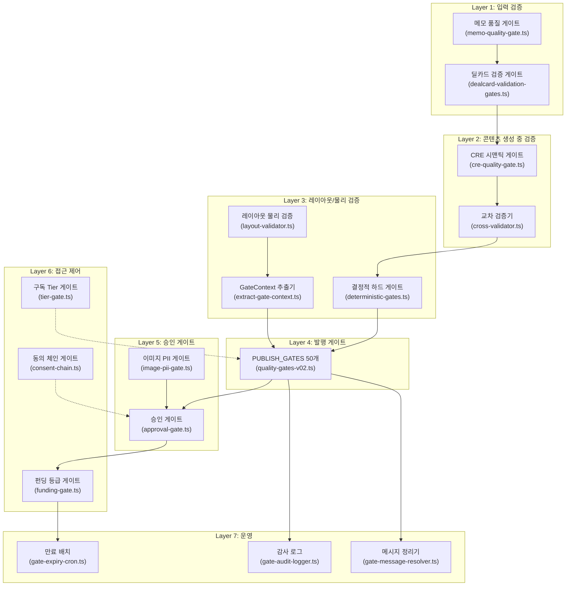

# IM 파이프라인 게이트 시스템 정밀 감사 보고서

> **감사일**: 2026-08-31  
> **감사 범위**: IM(Investment Memorandum) 작성 파이프라인의 전체 게이트 레이어  
> **총 게이트 검사점**: ~91개 (PUBLISH_GATES 50 + 교차검증 11 + 결정적 7 + 딜카드 5 + CRE시맨틱 6 + 승인 5 + 이미지PII 1 + 메모 1 + 기타 5)

---

## 1. 게이트 아키텍처 개요

IM 파이프라인은 **7개 게이트 레이어**로 구성되며, 브로커 메모 입력부터 최종 PPTX 발행까지 다단계 품질 제어를 수행합니다.



---

## 2. Layer 1 — 입력 검증 게이트

### 2.1 메모 품질 게이트 (`memo-quality-gate.ts`)

| 항목 | 내용 |
|------|------|
| **목적** | 브로커 입력 메모의 최소 품질 확보 |
| **입력** | 브로커가 입력한 자유 형식 메모 문자열 |
| **검사 항목** | `location` (주소), `asset_type` (자산유형), `numeric` (숫자 정보), `deal_type` (거래유형) — 4대 필드 정규식 매칭 |
| **출력** | `pass: boolean`, `score: 0~4`, `missingFields: string[]`, `suggestion: string` |
| **통과 기준** | 4개 필드 중 1개 이상 매칭 |
| **실패 시 조치** | 메모 파싱 불가 안내 + 보완 제안 반환 |

### 2.2 딜카드 검증 게이트 (`dealcard-validation-gates.ts`)

| 게이트 ID | 검사 내용 | 심각도 | 통과 기준 |
|-----------|----------|--------|----------|
| **X01** | 주소 존재 여부 | `block` | `!!address` |
| **X02** | PNU(필지번호) 유효성 | `block` | PNU 포맷 검증 |
| **X03** | 3축 분류 확정 (용도·구조·거래유형) | `warn` | 3축 모두 확정 |
| **X04** | 등기·대장 데이터 수신 여부 | `warn` | 문서 연동 확인 |
| **X05** | 필지 합계 일치 | `block` | 등기 vs 입력 필지 합계 오차 ≤ 0.01㎡ |

---

## 3. Layer 2 — 콘텐츠 생성 중 검증

### 3.1 CRE 시맨틱 품질 게이트 (`cre-quality-gate.ts`)

**목적**: LLM 생성 텍스트의 법적·윤리적 위험 표현 탐지

| 위험 유형 | 설명 | 예시 |
|-----------|------|------|
| `investment_guarantee` | 투자 추천·수익 보장 단정 | "반드시 수익이 발생합니다" |
| `fabricated_data` | 출처 없는 데이터 창작 | 근거 없는 통계 인용 |
| `legal_assertion` | 법적 효력 확정 단정 | "법적 하자가 없습니다" |
| `misleading_comparison` | 검증 불가 비교 시세 | "주변보다 30% 저렴" (무근거) |
| `ungrounded_market_claim` | 무근거 시장 주장 | "향후 가격 상승 확실" |
| `price_opinion_prohibition` | 주관적 가격 평가 단정 | "적정가는 XX억입니다" |

| 출력 필드 | 설명 |
|-----------|------|
| `passed` | `riskLevel === 'low'`일 때 `true` |
| `riskLevel` | `low` / `medium` / `high` |
| `issues` | 탐지된 위험 항목 배열 |
| `autoDisclaimerRequired` | 면책 조항 자동 삽입 필요 여부 |

> **D30 BL-6 Fail-Closed 원칙**: LLM 호출 실패 시 `SAFE_DEFAULT_RESULT` (`passed: false`, `riskLevel: 'high'`) 반환. 시스템 장애를 안전 통과로 처리하지 않음.

### 3.2 교차 검증기 (`cross-validator.ts`)

**목적**: LLM이 섹션별 독립 생성한 수치의 일관성 검증 (할루시네이션 방지)  
**D41 S2 원칙**: 주요 지표 오차 허용값 = **0 (Zero Tolerance)**

| 검증 항목 | 대상 섹션 | 임계값 | 심각도 |
|-----------|----------|--------|--------|
| 공실률 (`vacancy_pct`) | `lease_status` ↔ `income_analysis` ↔ `investment_thesis` | 절대차 0%p | `critical` |
| 면적 (`total_area_sqm`) | `property_overview` ↔ `income_analysis` | 상대차 0% | `critical` |
| 건물 연식 (`building_age`) | `risk_check` vs 앵커 | 절대차 0년 | `warning` |
| 역 도보 거리 (`station_distance`) | `location_access` ↔ `investment_thesis` | 절대차 0분 | `warning` |
| Cap Rate | 전 섹션 | 절대차 0%p | `warning` |
| 월세 (`monthly_rent_krw`) | 전 섹션 | 상대차 0% | `warning` |
| 총사업비 (Development) | 토지비 + 공사비 vs 총사업비 | 상대차 ≤ 15% | `critical` |
| RevPAR (Operating) | ADR × OCC vs RevPAR | 상대차 ≤ 5% | `critical` |
| 평당가 (Trading) | 매매호가 / 평수 vs 평당가 | 상대차 ≤ 10% | `warning` |
| 만실↔공실 모순 (G41) | 텍스트 서술어 vs 앵커 공실률 | 만실 서술 & 공실 > 5%, 또는 공실 서술 & 공실 == 0% | `critical` |
| 서술 vs 재무 계산 | `income_analysis` 마크다운 vs `financials.ts` 계산 | Cap Rate 차이 0, NOI 차이 0 | `critical` |

---

## 4. Layer 3 — 레이아웃/물리 검증

### 4.1 결정적 하드 게이트 (`deterministic-gates.ts`)

PPTX 렌더링 후 물리적 무결성을 검사하는 7대 하드 게이트:

| 게이트 ID | 검사 내용 | 통과 기준 | 심각도 |
|-----------|----------|----------|--------|
| **QG19** | 표지/요약표 합계 = 렌트롤 원장 금액 | 오차 0원 (정확 일치) | `block` |
| **C19** | 대장 연면적 vs 호실 임대면적 합계 | ±2% 이내 | `block` |
| **QG21** | 첨부 공부/문서 소재지 일치 및 URL 검증 | 불일치 0건 | `block` |
| **QG18** | 갱신요구권 잔여 연수 단정 표기 | 최초계약일 부재 시 차단 | `block` |
| **C-BASIS** | 수익률 basis 무결성 | gross 계열 '순수익률' 라벨 오남용 0건 | `block` |
| **QG15** | 텍스트 예산 한도(Text Budget) | 슬라이드별 문자수 초과 0건 | `block` |
| **QG16** | 슬라이드 인쇄 안전 좌표 | 12.713 × 6.75 범위 이탈 0건 | `block` |

### 4.2 레이아웃 물리 검증기 (`layout-validator.ts`)

PPTX 슬라이드의 물리적 속성을 검증:

| 검사 | 관련 게이트 | 임계값 |
|------|-----------|--------|
| 사진 크로핑률 | G31 | < 45% |
| 실효 DPI | G32 | ≥ 150 |
| 텍스트 오버플로 | G33 | 0건 |
| 요소 겹침 | G34 | ≤ 0.015in |
| 지면 이탈 | G35 | 0건 |
| 종횡비 왜곡 | G36 | ≤ 5% |

### 4.3 GateContext 추출기 (`extract-gate-context.ts`)

| 항목 | 내용 |
|------|------|
| **목적** | PPTX 파싱 결과를 `GateContext` 인터페이스로 변환 |
| **입력** | PPTX 파싱 결과 (슬라이드 좌표, 크로핑률, DPI, 텍스트 오버플로 등) |
| **출력** | Layer 4 `PUBLISH_GATES`에 전달되는 완성된 `GateContext` 객체 |
| **추가 기능** | `PptxAuditReport` 생성 (G31~G36, G41~G44, G52 자가 감사) |

---

## 5. Layer 4 — PUBLISH_GATES (50개 발행 게이트)

### 5.1 실행기 (`runPublishGates`)

```
PUBLISH_GATES[50] → 순차 실행 → M-9 3종 분류 → GateReport
```

| 분류 | 조건 | 조치 |
|------|------|------|
| `gate_block` | `severity === 'block'` 게이트 실패 | **발행 즉시 차단** |
| `quality_warn` | `severity === 'warn'` 게이트 실패 | 경고 표시, 발행 허용 |
| `system_error` | check 함수 실행 중 예외 발생 | **발행 차단** (Fail-Closed) |

**출력**: `{ allPassed, blocked, results, failedBlocks, failedWarns, classifiedFailures }`

### 5.2 Block 게이트 (36개) — 실패 시 발행 차단

| ID | 게이트명 | 검사 로직 |
|----|---------|----------|
| G01 | 매각가 존재 | `salePrice > 0` |
| G02 | 면적 존재 | `area > 0 || effectiveLandArea > 0` |
| G03 | 주소 존재 | `!!address` |
| G04 | 등급 D 아님 | `dataGrade !== 'D'` |
| G05 | 숫자 교차검증 통과 | `crossValidationPassed === true` |
| G06 | 할루시네이션 없음 | `hasHallucination === false` |
| G07 | PII 제거 완료 | `piiRemoved === true` |
| G08 | 위험 표현 없음 | `hasRiskExpression !== true` |
| G10 | 3축 분류 확정 | `threeAxisConfirmed === true` |
| G17 | 실효 DPI ≥ 72 | `imageDpi >= 72` |
| G18 | EXIF 좌표 일치 | `exifMatch !== false` |
| G20 | 이미지 PII 승인 | `imagePiiConfirmed === true` |
| G21 | 필수 섹션 완성 | `requiredSectionsComplete !== false` |
| G22 | 면적 지표명 정확 | `areaLabelAccurate !== false` |
| G23 | 렌트롤 전량 표기 | `true` (BL-2에서 보장) |
| G24 | 면 간 수치 일치 | `crossValidationPassed === true` |
| G25 | LLM 안전 판정 통과 | `llmSafetyPassed !== false` |
| G26 | 최소 사진 3매 | `photoCount >= 3` |
| G27 | 임차인 마스킹 완료 | `tenantMasked !== false` |
| G28 | 면적 totalGross vs effectiveGross 분리 | `areaMetricSeparated !== false` |
| G29 | 브랜드 환각 방지 | `brandHallucinationBlocked !== false` |
| G30 | 가정값 ◇ 표기 확인 | `assumptionMarked !== false` |
| G31 | 사진 크로핑률 < 45% | `maxCropRatio < 0.45` |
| G32 | 실효 DPI ≥ 150 | `minEffectiveDpi >= 150` |
| G33 | 텍스트 상자 넘침 0 | `textOverflowCount === 0` |
| G35 | 지면 이탈 0 | `bleedCount === 0` |
| G36 | 종횡비 왜곡 ≤ 5% | `aspectDistortionMaxPct <= 5` |
| G37 | 타 물건 사진 혼입 차단 | `foreignPhotoCount === 0` |
| G38 | yieldBasis 라벨-계산 정합 | `yieldBasisConsistent !== false` |
| G40 | 역레버리지 ROE 경고 | `negativeLeverageWarned !== false` |
| G41 | 서술어↔수치 모순 없음 | `vacancyNarrativeContradiction !== true` |
| G42 | 폴백 중복 0 | `fallbackDuplicateCount === 0` |
| G48 | 미해결 Conflict 0건 | `unresolvedConflictCount === 0` |
| G49 | 증거 없는 Claim 0건 | `unevidencedClaimCount === 0` |
| G51 | 계산식 재현 가능 | `calculationNotReproducible !== true` |
| G52 | 면수 상한 초과 없음 | `pageCountExceeded !== true` |

### 5.3 Warn 게이트 (14개) — 실패 시 경고만

| ID | 게이트명 | 검사 로직 |
|----|---------|----------|
| G34 | 요소 겹침 ≤ 0.015in | `overlapMaxInches <= 0.015` |
| G39 | 슬라이드 라벨-내용 정합 | `labelContentMismatchCount === 0` |
| G43 | highlights↔제원 중복 없음 | `highlightSpecDuplicate !== true` |
| G44 | 열린 괄호로 끝나는 문장 0 | `unclosedBracketCount === 0` |
| G45 | 정적 문구 CRE QG 통과 | `staticTextQGPassed !== false` |
| G50 | 기준일 asOf 전수 표시 | `asOfMissingCount === 0` |
| G53 | 토지거래허가 표시 | `permitZoneNotDisplayed !== true` |
| QG09 | IM Judge ≥ 3.0 | `imJudgeScore >= 3.0` |
| QG11 | DCF 등급 게이트 | `dcfGradeGatePassed === true` |
| QG12 | Cap Rate basis 명기 | `capRateResults.every(r => !!r.basis)` |
| QG13 | 임대차 법령 확정 | `leaseActConfirmed === true` |
| QG14 | 갱신요구권 확인 | `renewalRightConfirmed === true` |
| QG15 | 혼합 용도 법령 확정 | `mixedUseConfirmed === true` |
| QG16 | 위반건축물 확인 | `illegalArchitectureConfirmed === true` |

### 5.4 T2-GATE 불변 검증 (테스트 계층)

| 불변식 | 설명 | 테스트 파일 |
|--------|------|-----------|
| T2-GATE-01 | 선언된 50개 게이트 중 100%가 활성 실행 경로에 연결 (dead-code 0건) | `l2-gate-judgments.test.ts:253` |
| T2-GATE-02 | `severity: 'block'` 게이트 실패 시 반드시 `blocked = true` 설정 | `l2-gate-judgments.test.ts:281` |
| T2-GATE-03 | 하나의 게이트 코드는 정확히 하나의 심각도를 가짐 | `IM_V6_CONSOLIDATED_ORDER.md:131` |

---

## 6. Layer 5 — 승인 게이트

### 6.1 승인 게이트 (`approval-gate.ts`)

**목적**: ClaimRegistry + ReleaseTier 기반 최종 발행 승인 판정

**ReleaseTier 5종**:

| Tier | 설명 | 외부 발행 |
|------|------|----------|
| `internal_only` | 내부 전용 | ❌ 차단 |
| `fact_om` | 사실 기반 OM | ✅ 허용 |
| `analysis_im` | 분석 IM | ✅ 허용 |
| `decision_im` | 의사결정 IM | ✅ 허용 |
| `expert_required` | 전문가 검토 필요 | ❌ 차단 |

**Blocker 검사 5종**:

| Blocker ID | 검사 | 심각도 | 입력 |
|------------|------|--------|------|
| `approval.conflict` | ClaimRegistry 내 Conflict > 0건 | `block` | `registry.findConflicted()` |
| `approval.required_na.{subject}` | 필수 항목 모두 `not_available` | `block` | `asking_price`, `total_area`, `gross_yield` |
| `approval.tier_insufficient` | `tier === 'internal_only'` | `block` | `ReleaseTier` |
| `approval.hallucination` | `hasHallucination === true` | `warn` | `options` |
| `approval.publish_gate` | `publishBlocked === true` | `block` | `runPublishGates` 결과 |

**출력**:
```typescript
{
  level: 'draft' | 'bg_release';   // hasBlocker ? 'draft' : 'bg_release'
  passed: boolean;                   // !hasBlocker (프로퍼티명: passed, NOT approved)
  blockers: ApprovalBlocker[];
  fullAdvisoryNote: string;
}
```

**API 통합** (`POST /api/broker/im-lite/[id]/approve`):
1. 브로커 인증 + 소유권 검증 (403)
2. `runApprovalGate()` 호출
3. `passed === false` → **422 응답** + `blockers` 배열 반환
4. `passed === true` → `status: 'published'` + Golden IM 자동 등록

### 6.2 이미지 PII 게이트 (`image-pii-gate.ts`)

| 항목 | 내용 |
|------|------|
| **목적** | 사진 내 물건명·임차인명 등 개인정보 미노출 확인 |
| **입력** | 이미지 SHA256 해시, `ImageApprovalRecord` DB 레코드 |
| **통과 기준** | 모든 이미지가 마스킹 승인 레코드에 등록 + 파이프라인 버전(`v1`) 일치 |
| **심각도** | `block` — 사람 수동 승인 없는 이미지 발행 차단 |

---

## 7. Layer 6 — 접근 제어 게이트

### 7.1 펀딩 등급 게이트 (`funding-gate.ts`)

| 등급 | 설명 | 열람 범위 |
|------|------|----------|
| G0 | 비로그인 | 공개 요약만 |
| G1 | 가입 회원 | 기본 정보 |
| G2 | 일반 KYC 완료 | 상세 재무 |
| G3 | 소득 적격 확인 | 투자 조건 |
| G4 | 전문투자자 인증 | 전체 열람 |

**실패 시 조치**: 인가 수준 미달 필드를 `🔐 안내 문구`로 마스킹하여 반환

### 7.2 구독 Tier 게이트 (`tier-gate.ts`)

| 항목 | 내용 |
|------|------|
| **목적** | 브로커 구독 등급별 기능 접근 제어 |
| **입력** | `supabase`, `userId`, `featureName` |
| **Tier 구분** | `free` → `pro` → `premium` |
| **제어 대상** | `deal_card_creation`, `im_generation` 등 기능별 한도 |
| **출력** | `TierGateResult` (접근 가능 여부 + ROI/절감액 계산) |

### 7.3 동의 체인 게이트 (`consent-chain.ts`)

| 항목 | 내용 |
|------|------|
| **목적** | 4단계 동의 수준별 IM 열람 접근 제어 |
| **4단계** | `anonymous` → `identified` → `nda_signed` → `pro_verified` |
| **실패 시** | 필요한 업그레이드 액션 반환 (`request_email` / `sign_nda` / `request_verification`) |

---

## 8. Layer 7 — 운영 지원

| 모듈 | 파일 | 역할 |
|------|------|------|
| 게이트 메시지 정리기 | `gate-message-resolver.ts` | 해소된 `<!-- gate:{id} -->` / `> ⚠️ [{id}]` 경고문 자동 제거 |
| 감사 로그 기록기 | `gate-audit-logger.ts` | 게이트 실행 결과를 DB에 영구 기록 |
| 만료 배치 | `gate-expiry-cron.ts` | 펀딩 게이트 열람 권한 유효기간 만료 처리 |
| 레거시 맵 | `legacy-gate-map.ts` | 구버전 G-code → 현행 QG-code 매핑 + `migrateGateCode()` |
| 게이트 요청 관리 | `gate-request.ts` | 투자자 열람 권한 요청 상태 머신 |
| NDA 워터마크 | `nda-watermark.ts` | 기밀 문서 배포 시 워터마크 시드 생성 |
| 게이트 스키마 | `gate-schema.ts` | 게이트 요청/검증 스키마 정의 |

---

## 9. 파이프라인 통합 지점 (Integration Points)

### 9.1 PPTX 렌더러 (`pptx-renderer.ts`)

| 라인 | 게이트 | 동작 |
|------|--------|------|
| L657-671 | G31~G36 | `validateLayout(pres)` → 위반 시 `throw Error('[LAYOUT_GATE]')` |
| L674-677 | G38 | `validateYield(yieldObj)` → 위반 시 `throw Error('[G38]')` |
| L686-713 | 자가 감사 | `extractGateContext()` + `generateAuditReport()` → 경고 수집 |

### 9.2 Deck Sequencer (`deck-sequencer.ts`)

| 라인 | 게이트 | 동작 |
|------|--------|------|
| L86 | G04/G30 | D등급 하드 블록 → `throw Error('[G30]')` |
| L115 | 데이터 가용성 | `hasRentRoll` false → 렌트롤 슬라이드 제외 |
| L187-207 | ReleaseTier | `fact_om` → 재무 슬라이드(DCF/감도/수익) 숨김 |
| L213-230 | 부록 가용성 | `hasBuildingRegister`, `hasRegistryData` 등 조건부 추가 |
| L246-283 | G52 | 본문 > 16면 → 비보호 슬라이드 절삭 → 초과 시 throw |

### 9.3 IM Writer (`writer.ts`)

| 라인 | 게이트 | 동작 |
|------|--------|------|
| L55 | CRE QG | 섹션 생성 후 `runCREQualityGate()` 호출 |
| L188 | 교차 검증 | 전 섹션 생성 완료 후 `runCrossValidation()` |
| L280 | PUBLISH_GATES | 최종 `runPublishGates(ctx)` → `gateReport` 첨부 |

### 9.4 Claim-Registry 연동 (`im-core/`)

| 모듈 | 관련 게이트 | 연동 |
|------|-----------|------|
| `claim.ts` | G48, G49, G50 | `validateClaim()` — Claim 불변식 강제 |
| `claim-registry.ts` | G48, G49 | `findConflicted()`, `findUnevidenced()` |
| `calculation.ts` | G51 | 계산식 재현 가능성 검증 |
| `data-availability.ts` | G48 | Conflict 객체 관리 |

---

## 10. 게이트 파일 인벤토리 (16개 파일)

| # | 파일 경로 | 레이어 | 게이트 수 |
|---|----------|--------|----------|
| 1 | `src/domain/building/memo-quality-gate.ts` | L1 입력 | 1 (4필드) |
| 2 | `src/domain/building/gates/dealcard-validation-gates.ts` | L1 입력 | 5 (X01~X05) |
| 3 | `src/domain/building/mobile-im/cre-quality-gate.ts` | L2 생성 | 6종 위험 |
| 4 | `src/domain/building/mobile-im/cross-validator.ts` | L2 생성 | 11 검증 |
| 5 | `src/domain/building/gates/deterministic-gates.ts` | L3 레이아웃 | 7 하드 |
| 6 | `src/domain/building/mobile-im/pptx/layout-validator.ts` | L3 물리 | 6 물리 |
| 7 | `src/domain/building/mobile-im/pptx/extract-gate-context.ts` | L3 변환 | — |
| 8 | `src/domain/building/mobile-im/quality-gates-v02.ts` | L4 발행 | **50** |
| 9 | `src/domain/building/im-core/approval-gate.ts` | L5 승인 | 5 Blocker |
| 10 | `src/domain/building/gates/image-pii-gate.ts` | L5 승인 | 1 |
| 11 | `src/domain/gate/funding-gate.ts` | L6 접근 | 5등급 |
| 12 | `src/domain/subscription/tier-gate.ts` | L6 구독 | Tier별 |
| 13 | `src/domain/building/consent-chain.ts` | L6 동의 | 4단계 |
| 14 | `src/domain/building/mobile-im/gate-message-resolver.ts` | L7 운영 | — |
| 15 | `src/domain/gate/gate-audit-logger.ts` | L7 운영 | — |
| 16 | `src/domain/gate/gate-expiry-cron.ts` | L7 운영 | — |

---

## 11. 테스트 커버리지

| # | 테스트 파일 | 범위 |
|---|-----------|------|
| 1 | `__tests__/l2-gate-judgments.test.ts` | PUBLISH_GATES 전수 + T2-GATE-01/02 |
| 2 | `__tests__/gates/deterministic-gates.test.ts` | 결정적 하드 게이트 7종 |
| 3 | `__tests__/v05-gates-suite.test.ts` | Legacy QG10~QG14 회귀 |
| 4 | `memo-quality-gate.test.ts` | 메모 품질 게이트 |
| 5 | `gate-audit-logger.test.ts` | 감사 로그 |
| 6 | `gate-request.test.ts` | 접근 요청 상태 머신 |
| 7 | `tests/unit/audit-gates.test.ts` | 실물건 감사 게이트 (당산·양평) |
| 8 | `tests/e2e/l5-gate-coverage.test.ts` | PUBLISH_GATES positive/negative 짝 |
| 9 | `tests/e2e/p0-tier-grade-gate.test.ts` | 등급×Tier 게이팅 E2E |
| 10 | `tests/e2e/p1-gate-logic.test.ts` | 게이트 오케스트레이션 E2E |
| 11 | `tests/e2e/real-cases-gates.test.ts` | 다건 실물건 게이트 검증 |

---

## 12. GateContext 인터페이스 전체 필드

```typescript
export interface GateContext {
  // ── Core (G01~G10) ──
  salePrice?: number;
  area?: number;
  address?: string;
  dataGrade?: string;
  crossValidationPassed?: boolean;
  hasHallucination?: boolean;
  piiRemoved?: boolean;
  hasRiskExpression?: boolean;
  imJudgeScore?: number;
  threeAxisConfirmed?: boolean;

  // ── 법률/임대 (QG11~QG16) ──
  dcfGradeGatePassed?: boolean;
  leaseActConfirmed?: boolean;
  renewalRightConfirmed?: boolean;
  mixedUseConfirmed?: boolean;
  illegalArchitectureConfirmed?: boolean;

  // ── 이미지 (G17~G20, G26, G31~G32, G36~G37) ──
  imagePiiConfirmed?: boolean;
  maxCropRatio?: number;
  minEffectiveDpi?: number;
  foreignPhotoCount?: number;
  aspectDistortionMaxPct?: number;

  // ── 레이아웃 (G33~G35) ──
  textOverflowCount?: number;
  overlapMaxInches?: number;
  bleedCount?: number;

  // ── 수익률/재무 (G38~G40) ──
  yieldBasisConsistent?: boolean;
  negativeLeverageWarned?: boolean;

  // ── 서술 품질 (G41~G45) ──
  vacancyNarrativeContradiction?: boolean;
  fallbackDuplicateCount?: number;
  highlightSpecDuplicate?: boolean;
  unclosedBracketCount?: number;
  staticTextQGPassed?: boolean;

  // ── D37 신설 (G48~G53) ──
  unresolvedConflictCount?: number;
  unevidencedClaimCount?: number;
  asOfMissingCount?: number;
  calculationNotReproducible?: boolean;
  pageCountExceeded?: boolean;
  permitZoneNotDisplayed?: boolean;

  // ── Legacy (QG10~QG14) ──
  capRateResults: Array<{ basis: string }>;
  totalReturnScenarios: Array<{ label: string; totalReturnPct: number }>;
  parcels: Array<{ exclusions: Array<{ area: number; affectsFAR: boolean }>; area: number }>;
  leaseUnits: Array<{ convertedDeposit: number; opposingPower: boolean; opposingPowerEvidence?: string }>;
  disclosureDcf: string;
  disclosureIrr: string;
  termExplanationExists: boolean;
  effectiveLandArea: number;
  effectiveFAR: number;
  calculatedEffectiveFAR: number;
}
```
