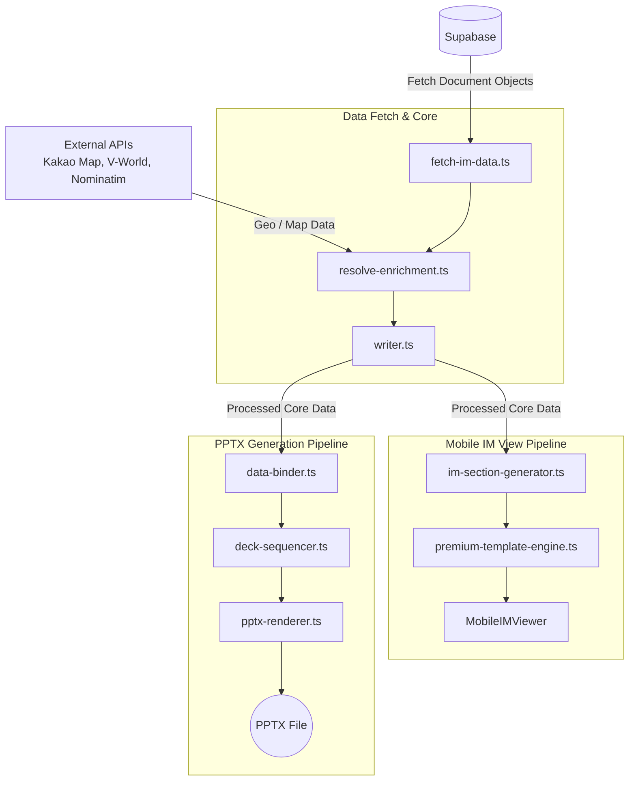

# CRE IM 파이프라인 — 아키텍처 문서

## 1. 시스템 개요
CRE DealCard 플랫폼 전체 맥락에서 IM(Investment Memorandum, 투자설명서) 파이프라인은 복잡한 상업용 부동산(CRE) 데이터와 금융 모델링 결과를 투자자와 이해관계자에게 명확하게 전달하기 위한 핵심 엔진입니다. 이 파이프라인은 데이터베이스에 저장된 원시 데이터를 가공하여, 모바일 친화적인 웹 뷰와 전통적인 기관투자자용 PPTX 문서를 동시에 일관된 데이터로 생성합니다.

시스템은 철저한 클린 아키텍처 원칙에 따라 다음 3개의 핵심 계층으로 분리되어 있습니다:
- **im-core (도메인 계층)**: 비즈니스 로직, 금융 모델링, 데이터 온톨로지를 담당
- **모바일 IM (뷰 계층)**: 웹 기반의 인터랙티브 사용자 경험(UX) 제공
- **PPTX Basic IM (문서 생성 계층)**: 레이아웃 물리 엔진을 포함한 오프라인 문서 자동 생성기

## 2. 계층 아키텍처 (Layered Architecture)

### 2.1 도메인 계층 (im-core)
- **위치**: [`src/domain/building/im-core/`](file:///c:/Users/User/cre-dealcard/src/domain/building/im-core/)
- **핵심 모듈**:
  - `financial-calculator.ts` (1,002줄): 기초 금융 수식 및 수익률 계산 로직
  - `pro-financial-model.ts` (1,058줄): 기관급(Pro) 정밀 재무 모델링
  - `claim-registry.ts`: 권리 및 채권 관계 레지스트리
  - `resolve-enrichment.ts`: 외부 데이터 병합 및 데이터 농축
  - `release-tier.ts`: 열람 권한 및 티어(Basic/Pro/Premium) 등급 판별
  - `permit-zone.ts`: 용도지역 및 인허가 제한 검증
  - `lease-calc.ts`: 임대료 및 NOC(전용면적당 임대료) 산정
  - `korean-legal.ts`: 한국 법률 및 규제 기준 유효성 검사
  - `calculation.ts`: 공통 연산 유틸리티
- **온톨로지**:
  - `src/domain/ontology/slots.ts` (474줄, SlotCatalog): 데이터 슬롯 및 속성 정의
  - `provenance.ts` (314줄): 6계층 출처 신뢰도(Provenance) 시스템
  - `src/types/ontology.ts` (161줄): 온톨로지 타입 정의
- **SSoT YAML 파일들** (위치: [`credeal/ssot/`](file:///c:/Users/User/cre-dealcard/credeal/ssot/)): 단일 진실 공급원
  - `im.area.yaml` (102줄): 면적 체계 정의
  - `im.lexicon.yaml` (450줄): 기본 용어 사전
  - `im.d56-lexicon.yaml` (4,133줄): 기관투자자 및 실무자용 방대한 전문 용어 사전
  - `im.ontology.yaml` (310줄): 객체 간 관계 정의
  - `im.assumptions.yaml` (198줄): 재무 모델링 가정 변수
  - `im.bindings.yaml` (277줄): UI/PPTX 데이터 바인딩 규칙
  - `im.gating.yaml` (917줄): 데이터 보안 및 등급별 노출 규칙
  - `im.invariants.yaml` (277줄): 데이터 불변성 규칙
  - `im.pages.yaml` (208줄): 페이지 구조 정의
  - `im.parcel.yaml` (226줄): 지적 및 필지 정보
  - `im.tokens.yaml` (228줄): 디자인 토큰
  - `im.budget.yaml` (62줄): 예산 항목
  - `im.format.yaml` (119줄): 데이터 포맷 규칙
  - `im.masking.yaml` (87줄): 민감 정보 마스킹 규칙
  - `im.errors.yaml` (558줄): 에러 코드 및 메시지
  - `im.image.yaml` (200줄): 이미지 처리 규칙
- **핵심 원칙 (Rule 12)**: 클린 아키텍처 — **도메인은 뷰를 절대 참조하지 않음**. 도메인은 오로지 비즈니스 규칙에만 집중하며, 외부 라이브러리 의존성을 최소화합니다.
- **아키텍처 방어**: `architecture-boundaries.test.ts` (351줄)에 구현된 TypeScript AST 기반 스캐너가 CI/CD 과정에서 불법적인 역참조를 자동 탐지하고 방어합니다.

### 2.2 뷰 계층 (모바일 IM)
- **위치**: [`src/app/(public)/im-lite/[buildingId]/`](file:///c:/Users/User/cre-dealcard/src/app/(public)/im-lite/[buildingId]/) 및 [`src/domain/building/mobile-im/`](file:///c:/Users/User/cre-dealcard/src/domain/building/mobile-im/)
- **핵심 모듈**:
  - `mobile-im-viewer.tsx`: 뷰어 클라이언트 루트 컴포넌트
  - `fetch-im-data.ts`: 서버 사이드 IM 데이터 페칭 로직
  - `premium-template-engine.ts`: 템플릿 기반 데이터 조립
  - `section-catalog.ts` (119줄): 화면 섹션 카탈로그 정의
  - `im-section-generator.ts` (779줄): 각 섹션에 맞는 컴포넌트 데이터 생성
- **서브 컴포넌트**: `hero-card.tsx`, `dcf-heatmap.tsx`, `leverage-chart.tsx`, `stacking-plan-view.tsx`, `SectionCard`, `PhotoGallery`, `FloatingActionBar`, `ShareButton`, `IMInquiryBottomSheet`
- **상태 관리**: React `useState`를 활용한 상태 관리 (openSections, activeSection, approvalStage 등)
- **사용자 추적**: `IntersectionObserver`를 사용하여 사용자가 조회한 섹션을 추적하고, `navigator.sendBeacon`을 통해 체류 시간(dwell time) 데이터를 백엔드로 전송합니다.
- **데이터 흐름**: Supabase (`document_objects` 테이블) → `fetchIMData` → `resolveEnrichment` → `MobileIMViewer`

### 2.3 문서 생성 계층 (PPTX Basic IM)
- **위치**: [`src/domain/building/mobile-im/pptx/`](file:///c:/Users/User/cre-dealcard/src/domain/building/mobile-im/pptx/)
- **핵심 모듈**:
  - `deck-sequencer.ts` (24KB): 전체 슬라이드 순서 및 구성 시퀀싱
  - `imlib.ts` (71KB): 테마, 컬러, 기본 도형 등 레이아웃 프리미티브 제공
  - `pptx-renderer.ts` (57KB): 최종 슬라이드 렌더링 엔진
  - `layout-physics.ts`: 텍스트 넘침 방지 및 자동 크기 조절 물리 엔진
  - `data-binder.ts` (80KB): im-core 데이터와 PPTX 템플릿 슬롯 바인딩
- **바인더 서브디렉토리**: 
  - `binder/archetype-builders.ts` (66KB): 아키타입 조립
  - `binder/posture-builders.ts` (49KB): 레이아웃 포스처 조립
  - `binder/core-binders.ts` (38KB): 핵심 바인딩 로직
- **아키타입 (25개)**: `archetypes/a01-cover.ts` 부터 `archetypes/a24-rentroll-stacking.ts`까지 사전 정의된 25개의 슬라이드 템플릿 유형
- **텍스트 물리 엔진**: 
  - `fitTextToBox()`: 주어진 영역에 텍스트를 맞추기 위한 이진 탐색 알고리즘
  - `fitTableCell()`: 테이블 셀 크기 최적화
  - `simulateTextWrap()`: CJK(한중일) 및 Latin 문자 메트릭 기반의 정밀한 줄바꿈 시뮬레이션
- **오버플로우 감지**: `scripts/detect_pptx_overflow.py`를 활용한 파이썬 기반 바이너리 검증으로, 렌더링 후 텍스트가 박스를 벗어나는지 확인합니다.

## 3. 데이터 흐름도

## 4. 의존성 방향 규칙
시스템의 안정성과 클린 아키텍처를 유지하기 위해 다음의 의존성(Dependency) 방향 규칙을 엄격하게 적용합니다.
- ✅ `im-core` → 외부 라이브러리 (허용)
- ✅ `모바일 IM 뷰` → `im-core` (허용)
- ✅ `PPTX 파이프라인` → `im-core` (허용)
- ❌ `im-core` → `모바일 IM 뷰` (**금지** - Rule 12 위반)
- ❌ `im-core` → `PPTX 파이프라인` (**금지** - Rule 12 위반)
> **중요**: CI 환경의 AST 스캐너(`architecture-boundaries.test.ts`)가 직접 참조뿐만 아니라 간접(Transitive) 역참조까지 모두 탐지하여 빌드를 실패시킵니다.

## 5. SSoT (Single Source of Truth) 체계
파이프라인 내의 하드코딩을 방지하고 비즈니스 룰을 일관되게 관리하기 위해 **YAML 기반 SSoT 체계**를 운영합니다.
- **면적 체계 (`im.area.yaml`)**: GFA(연면적) → NLA(전용면적) → GLA(임대가능면적) 등 국제 상업용 부동산 면적 계층 구조 정의
- **용어 사전 (`im.lexicon.yaml` + `im.d56-lexicon.yaml`)**: 브로커들이 사용하는 B2C 은어와 기관투자자용 표준어를 매핑 및 번역
- **게이팅 규칙 (`im.gating.yaml`)**: 데이터 등급(Basic, Pro, Premium)에 따른 발행(노출) 차단 및 허용 기준을 선언적으로 관리

## 6. 보안 및 접근 제어
CRE 데이터의 민감성을 고려하여 다단계 보호 장치를 구현했습니다.
- **Release Tier 시스템**: 데이터의 정밀도와 보안 요구사항에 따라 `basic`, `pro`, `premium` 3단계 티어로 관리
- **서버단 데이터 필터링**: `locked` 상태인 티어의 경우, 서버(`fetch-im-data.ts`)에서 마크다운 콘텐츠 및 민감 정보를 완전히 제거한 후 클라이언트로 전송(Payload 최소화 및 보안 확보)
- **클라이언트단 차트 가드**: 컴포넌트 렌더링 시 `!section.locked` 조건일 때만 상세 차트와 재무 모델링 표출
- **보호 필드 제거**: Basic 등급에서는 '상세 지번', '정확한 건물명', '소유주명' 등을 자동으로 마스킹하거나 제거

## 7. 외부 서비스 연동
- **Kakao Local API**: 주소 텍스트를 위경도 좌표로 변환 (`geocodeAddress`)
- **Kakao Static Map API**: PPTX 및 모바일에 삽입할 정적 위치 지도 이미지 생성
- **Nominatim (OpenStreetMap)**: 카카오 API 한도 초과 또는 장애 시 Fallback(대체) 백업으로 사용
- **V-World**: 한국 국토교통부 지적도 이미지 및 공간 정보 연동
- **Supabase**: PostgreSQL 기반의 원본 데이터 저장, 실시간 데이터 구독(Realtime), RLS(Row Level Security)를 통한 인증 및 인가 처리

## 8. 테스트 인프라 (4-Layer Testing Pyramid)

파이프라인의 무결성을 보장하기 위해 **341개 테스트 파일**을 4계층 피라미드 구조로 운영합니다.

| 계층 | 파일 수 | 프레임워크 | 핵심 커버리지 |
|:---|:---:|:---|:---|
| Unit (`src/tests/unit/`) | 75 | Vitest | PPTX 레이아웃 물리, 테이블 스타일링, 수학 계산 |
| E2E (`src/tests/e2e/`) | 66 | Vitest | 전체 IM 생성→PPTX 바이너리 파이프라인 |
| Domain (`src/tests/domain/`) | 20 | Vitest | 포스처별 데이터 정합성, 재무 모델 무결성 |
| Adversarial (`src/tests/adversarial/`) | 20 | Vitest | 은어 탐지, 포이즌 토큰, 페르소나 누출, 멱등성 |
| API (`src/tests/api/`) | 18 | Vitest | Next.js 라우트 핸들러, 상태 코드 검증 |
| Governance (`src/tests/governance/`) | 3 | Vitest | AST 역참조 방어(Rule 12), DAG 검증 |
| Playwright E2E (`e2e/`) | 35 | Playwright | 브라우저 인증 플로우, 골든 포스처 파이프라인 |
| 도메인 내 공존 테스트 (`src/domain/`) | 79 | Vitest | mobile-im, 매칭, 분석, 게이트 로직 |
| 기타 (Assurance/Stress/Platform) | 25 | Vitest | 바이너리 관찰, 부하 테스트, 멀티테넌트 |
| **합계** | **341** | | |

### 핵심 테스트 스위트 상세
- **`architecture-boundaries.test.ts`** (7/7): TypeScript AST 컴파일러를 직접 구동하여 `im-core` → 뷰/프레임워크 역참조를 기계적으로 탐지
- **`mobile-im-data-fidelity.test.ts`** (13/13): 5가지 투자 포스처별 원본↔생성 데이터 교차 검증 (수치 정합성, 포이즌 토큰 0건, 페르소나 누출 0건)
- **`m4-challenger-lexicon-robustness.test.ts`** (13/13): D56 용어 사전 연동 검증, 정규화기 멱등성 증명
- **`preflight-pipeline-audit.test.ts`** (108/108): 배포 전 전면 프리플라이트 게이트

## 9. 거버넌스 규칙 체계 (Agent Rules)

[`.agents/rules/`](file:///c:/Users/User/cre-dealcard/.agents/rules/) 디렉토리에 **10개 모듈, 70개 번호 규칙**으로 구성된 거버넌스 시스템을 운영합니다.

| 모듈 | 규칙 번호 | 핵심 원칙 |
|:---|:---|:---|
| [01-cre-lexicon.md](file:///c:/Users/User/cre-dealcard/.agents/rules/01-cre-lexicon.md) | 1~5 | CRE 전문 용어 의무, 페르소나 격리, 비중복 렌더링 |
| [02-pipeline-engineering.md](file:///c:/Users/User/cre-dealcard/.agents/rules/02-pipeline-engineering.md) | 5~11 | 게이트 레지스트리, 네거티브 페어 의무, 16p 하드리밋 |
| [03-im-core-domain.md](file:///c:/Users/User/cre-dealcard/.agents/rules/03-im-core-domain.md) | 11~16 | **Rule 12 (클린 아키텍처)**, ReleaseTier 5단계, 프론트↔도메인 감사 |
| [04-production-web.md](file:///c:/Users/User/cre-dealcard/.agents/rules/04-production-web.md) | 17~26 | 타임아웃 패리티, 해시 바운드 승인, PPTX 30s 렌더 한도 |
| [05-posture-isolation.md](file:///c:/Users/User/cre-dealcard/.agents/rules/05-posture-isolation.md) | 26~30 | 하드코딩 금지, CalloutKind 열거, 포스처 가드 |
| [06-preflight-audit.md](file:///c:/Users/User/cre-dealcard/.agents/rules/06-preflight-audit.md) | 31~46 | 면적 파서, 가짜 데이터 금지, 회피 문구 금지, Sharp 파이프라인 |
| [07-basic-im-ssot.md](file:///c:/Users/User/cre-dealcard/.agents/rules/07-basic-im-ssot.md) | 45~47, 61~70 | Basic IM 9슬라이드 표준, 지적도+토지 통합, 렌트롤 10열 |
| [08-e2e-golden-test.md](file:///c:/Users/User/cre-dealcard/.agents/rules/08-e2e-golden-test.md) | 41~60 | 골든 테스트 의무, 실제 API 호출, 4겹 PPTX 단언 |
| [09-subagent-hygiene.md](file:///c:/Users/User/cre-dealcard/.agents/rules/09-subagent-hygiene.md) | 41~42 | 덤프 파일 금지, 10MB 커밋 차단 |
| [10-powershell-git.md](file:///c:/Users/User/cre-dealcard/.agents/rules/10-powershell-git.md) | 43~45 | PowerShell Git 푸시 검증, 인코딩 규칙 |

