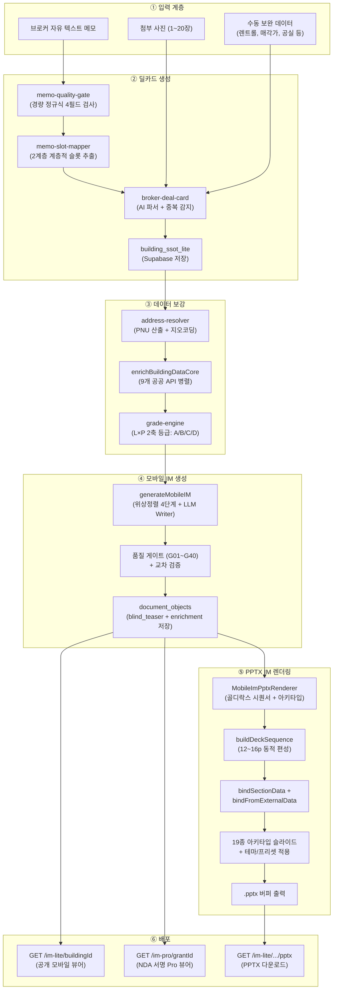

# 풀 파이프라인 아키텍처 — 메모 → 딜카드 → 모바일 IM → PPTX IM

> **문서 버전**: v5.0 (D33 골디락스 개선)
> **최종 갱신**: 2026-08-27
> **대상 커밋**: `1858bee`

---

## 1. 파이프라인 총괄 아키텍처



---

## 2. 각 계층 상세

### 2.1 ① 입력 계층

| 입력 유형 | 설명 | 처리 모듈 |
|---|---|---|
| 자유 텍스트 메모 | 브로커가 작성한 매물 정보 자유문 | `memo-quality-gate.ts`, `memo-slot-mapper.ts` |
| 첨부 사진 | 외관/내부/항공/옥상 등 1~20장 | `photo-classifier.ts` (17종 분류) |
| 수동 데이터 | 렌트롤, 매각가, 보증금, 대출금 등 | `supplemental` 필드로 주입 |

### 2.2 ② 딜카드 생성

#### 메모 품질 게이트 (`memo-quality-gate.ts`)

```typescript
interface MemoQualityResult {
  pass: boolean;        // 1개 이상 필드 탐지 시 통과
  score: number;        // 0~4 (탐지 필드 수)
  detectedFields: string[];  // ['location', 'asset_type', 'numeric', 'deal_type']
  missingFields: string[];
  suggestion: string;
}
```

AI 호출 없이 정규식(`FIELD_DETECTORS`)으로 4개 필드 경량 검사.

#### 메모 슬롯 매퍼 (`memo-slot-mapper.ts`)

**2계층 계층적 추출**:
1. **Layer 1 (총괄 지표)**: `[수익분석]`, `보증금 총액`, `월 임대수입 총액` 등 → Confidence 0.95
2. **Layer 2 (개별 폴백)**: 총괄 미발견 키만 호실 패턴 매칭
3. **Layer 3 (일반 패턴)**: 연면적/대지면적/준공연도/층수/용적률 등

포스처 제안: `extractPostureProposal()` — 5대 포스처별 키워드 빈도 + 점수 격차 분석.

#### 딜카드 오케스트레이터 (`broker-deal-card.ts`)

```
중복 감지 → AI 메모 파서 → SSOT Lite 생성/저장 → 정본 자산 링크
```

### 2.3 ③ 데이터 보강

#### 주소 해석기 (`address-resolver.ts`)

```typescript
interface ResolvedAddress {
  pnu: string;               // 19자리 필지고유번호
  sigunguCd: string;         // 시군구 5자리
  bjdongCd: string;          // 법정동 5자리
  bun: string; ji: string;   // 본번/부번 4자리
  roadAddress: string;       // 도로명주소
  lat: number | null;        // 위도
  lng: number | null;        // 경도
  buildingMgtNo: string;     // 건물관리번호
  _mergedParcelWarning?: boolean;  // 합필 의심
}
```

#### 9개 공공 API 병렬 수집 (`enrichBuildingDataCore`)

| # | API 클라이언트 | 소스 | 반환 타입 |
|:---:|---|---|---|
| 1 | `fetchBuildingRegister` | 건축물대장 표제부 (국토부) | `BuildingRegisterData` |
| 2 | `fetchLandPrice` | 개별공시지가 (V-World) | `LandPriceData` |
| 3 | `fetchLandUsePlan` | 토지이용계획 (V-World/LURIS) | `LandUsePlanData` |
| 4 | `fetchComparableTransactions` | 상업업무용 실거래가 (국토부 RTMS) | `ComparableTransaction[]` |
| 5 | `fetchLocationPoi` | 카카오 로컬 POI (역세권/편의시설) | `LocationPoiData` |
| 6 | `fetchRegistryData` | 등기정보광장 (대법원) | `RegistryData` |
| 7 | `fetchBuildingRecap` | 총괄표제부 (승강기/주차) | `BuildingRecapData` |
| 8 | `fetchCommercialDistrictFull` | 소상공인 상권정보 (SEMAS) | `CommercialDistrictAnalysis` |
| 9 | `fetchCadastralMapImage` | V-World WMS 지적도 | `CadastralMapResult` |

#### 통합 결과 인터페이스

```typescript
interface ExternalDataEnrichmentResult {
  resolvedAddress: ResolvedAddress;
  buildingRegister: BuildingRegisterData | null;
  landPrice: LandPriceData | null;
  landUsePlan: LandUsePlanData | null;
  comparableTransactions: ComparableTransaction[];
  locationPoi: LocationPoiData | null;
  mapImageUrl: string | null;
  registryData: RegistryData | null;
  commercialDistrict: CommercialDistrictAnalysis | null;
  cadastralMapImage: CadastralMapResult | null;
  enrichedAt: string;
  errors: { api: string; message: string }[];
}
```

#### 데이터 등급 판정 (L×P 2축 모델)

| 등급 | 점수 | 특성 | PPTX 재무 |
|:---:|:---:|---|---|
| **A** | ≥80% | 필수 슬롯 100%, DCF 활성 | 6종 (capital, dcf, sensitivity, totalReturn, loan, tax) |
| **B** | ≥60% | 대부분 충족, DCF 비활성 | 2종 (capital, totalReturn) |
| **C** | ≥40% | 최소 충족, Cap Rate 마스킹 | 없음 |
| **D** | <40% | 발행 차단 `[G04]` | `[G30]` 에러 |

### 2.4 ④ 모바일 IM 생성 → 별도 문서 (`02_MOBILE_IM_SPEC.md`)
### 2.5 ⑤ PPTX IM 렌더링 → 별도 문서 (`03_PPTX_IM_SPEC.md`)

### 2.6 ⑥ 배포 (API 라우트)

| 엔드포인트 | 역할 |
|---|---|
| `GET /api/public/im-lite/[buildingId]` | 공개 모바일 IM JSON (뷰어용) |
| `GET /api/public/im-pro/[grantId]` | NDA 서명 기반 Pro IM (비차폐, 워터마크) |
| `GET /api/public/im-lite/[buildingId]/pptx` | PPTX 파일 다운로드 |
| `POST /api/broker/im-lite/generate` | 모바일 IM 생성 트리거 (handler.ts) |

---

## 3. 온톨로지 (3축 자산 분류)

### 3.1 축 정의

$$\text{AssetIdentity} = \text{BuildingUse}(29\text{종}) \times \text{AssetType}(17\text{종}) \times \text{InvestmentPosture}(5\text{종})$$

### 3.2 투자 포스처 (5종)

| 코드 | 명칭 | 핵심 지표 | 아키타입 수 |
|---|---|---|:---:|
| `income` | 임대수익형 | Cap Rate, NOI, WALE | 9종 (R-INC-01~09) |
| `owner_occupied` | 자가사용형 | 평당가, 통근시간, vs임차비용 | 4종 (R-OWN-01~04) |
| `development` | 개발형 | 개발이익률, 용적률, 인허가 | 4종 (R-DEV-01~04) |
| `operating` | 운영형 | GOP, RevPAR, 객실 가동률 | 4종 (R-OPR-01~04) |
| `trading` | 단기매매형 | 평당가, 시세차익, 거래회전율 | 4종 (R-TRD-01~04) |

### 3.3 자산 유형 (17종)

`nbhd_building`, `office_building`, `mixed_shop_house`, `multi_household`, `multi_family`, `officetel`, `knowledge_center`, `retail_strip`, `hotel`, `serviced_residence`, `logistics`, `factory_building`, `medical_facility`, `education_facility`, `bare_land`, `raw_land`, `special_use`

---

## 4. 품질 게이트 체계 (40종)

### 4.1 발행 차단 게이트 (block)

| ID | 검증 항목 |
|---|---|
| G01 | 매각가 존재 |
| G02 | 면적 존재 |
| G03 | 주소 존재 |
| G04 | 등급 D 아님 |
| G05/G24 | 숫자 교차검증 통과 |
| G06 | 할루시네이션 없음 |
| G07 | PII 제거 완료 |
| G08 | 위험 표현 없음 |
| G10 | 3축 분류 확정 |
| G20 | 이미지 PII 승인 |
| G21 | 필수 섹션 완성 |
| G26 | 최소 사진 3매 |
| G27 | 임차인 마스킹 |
| G30 | D등급 PPTX 발행 차단 |
| G31~G35 | 지면 물리 (크롭률, DPI, 텍스트넘침, 겹침, 이탈) |
| G36~G40 | 종횡비, 타물건사진, 수익률 정합, 라벨 정합, 역레버리지 |

### 4.2 결정적 하드 게이트 (5대)

| ID | 규칙 |
|---|---|
| QG19 | 표지 합계 = 임대차 원장 합산 (0원 오차) |
| C19 | 대장 연면적 vs 호실 면적 합 (±2%) |
| QG21 | 첨부 문서 소재지 일치 |
| QG18 | 최초계약일 부재 시 갱신요구권 단정 차단 |
| C-BASIS | 수익률 basis 명시 + 오표기 방지 |

---

## 5. SSOT 데이터 모델

```typescript
interface BuildingSSoTLite {
  // Core Identity
  id: string;
  pnu?: string;
  address?: string;
  building_name?: string;
  asset_type?: string;

  // Area & Zoning
  land_area_pyung?: number;
  total_floor_area_pyung?: number;
  far_pct?: number;
  zoning_region?: string;

  // Financial
  asking_price_krw?: number;
  gross_annual_income_krw?: number;

  // Signals
  area_signal?: string;
  price_band?: string;
  size_signal?: string;
  vacancy_signal?: string;

  // Summaries
  fit_summary?: string;
  caution_summary?: string;
  lease_summary?: Record<string, unknown>;
  floor_leases?: unknown[];
  layers?: Record<string, unknown>;

  // Metadata
  owner_id?: string;
  created_at?: string;
  updated_at?: string;
}
```

---

## 6. 디렉토리 구조

```
src/domain/building/
├── memo-quality-gate.ts          # 메모 품질 경량 검사
├── memo-slot-mapper.ts           # 2계층 슬롯 추출
├── broker-deal-card.ts           # 딜카드 AI 파서
├── building-ssot-lite.types.ts   # SSOT 데이터 모델
├── financials.ts                 # 재무/수익률 산출
├── guardrails.ts                 # 가드레일 (PII/면책)
├── gates/                        # 5대 하드 게이트
│   └── deterministic-gates.ts
└── mobile-im/
    ├── writer.ts                 # IM 생성 오케스트레이터
    ├── section-catalog.ts        # 포스처별 섹션 카탈로그
    ├── stage-plans.ts            # 위상 정렬 4단계
    ├── im-section-generator.ts   # LLM 단일 섹션 생성기
    ├── quality-gates-v02.ts      # G01~G40 발행 게이트
    ├── cross-validator.ts        # 섹션 간 교차 검증
    ├── checklist-renderer.ts     # 확인사항 렌더러
    ├── data-quality-badge.ts     # A/B/C/D 등급 배지
    ├── section-renderers/        # 결정론적 렌더러
    │   ├── title-rights-renderer.ts
    │   ├── land-detail-renderer.ts
    │   └── comparables-renderer.ts
    └── pptx/
        ├── pptx-renderer.ts      # PPTX 렌더러 코어
        ├── deck-sequencer.ts     # 골디락스 시퀀서
        ├── data-binder.ts        # 데이터 바인더
        ├── pptx-theme.ts         # 테마/프리셋
        ├── imlib.ts              # 렌더링 인프라
        └── archetypes/           # 19종 아키타입

src/lib/external/
├── enrich-by-pnu.ts              # 9개 API 병렬 수집
├── external-data-orchestrator.ts # 캐시 + 오케스트레이션
├── address-resolver.ts           # PNU/좌표 해석
├── building-register-api.ts      # 건축물대장
├── land-price-api.ts             # 공시지가
├── land-use-api.ts               # 토지이용계획
├── real-transaction-api.ts       # 실거래가
├── kakao-map-api.ts              # 카카오 POI
├── registry-api.ts               # 등기정보
├── semas-commercial-api.ts       # 상권정보
└── vworld-wms-cadastral.ts       # V-World 지적도
```
