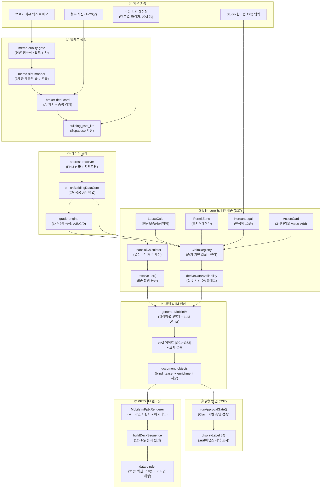

# 풀 파이프라인 아키텍처 — 메모 → 딜카드 → 모바일 IM → PPTX IM

> **문서 버전**: v6.0 (D37 Claim/Tier/Gate 고도화)
> **최종 갱신**: 2026-08-28
> **대상 커밋**: `6607d14`
> **선행**: D30~D36, D37 P0+P1+P2 전량 완료

---

## 1. 파이프라인 총괄 아키텍처



---

## 2. ① 입력 계층

### 2.1 메모 저장
- **파일**: `src/app/api/broker/memo/save/route.ts` (177행)
- POST: `memo_text`, `routing_type`, `routing_summary` → `broker_memos` 테이블
- GET: 검색(`q`), 유형(`type`), 고정(`pinned`), 상태(`status`) 쿼리

### 2.2 Studio 입력 (D37 신규)
- **한국법 12종**: `/broker/buildings/[id]/studio/legal`
  - `KoreanLegalFields` → `registerKoreanLegalClaims()` → ClaimRegistry
- **기존 5탭**: briefing, lease, files, disclosure, **legal(D37)**

---

## 3. ② 딜카드 생성

### 3.1 메모 → 딜카드 변환
- **파일**: `src/app/api/broker/deal-card/from-memo/route.ts` (161행)
- **파이프라인**:
  1. `validateMemoQuality()` — 정규식 4필드 검사 (location, asset_type, numeric, deal_type)
  2. `sanitizeComplianceText()` — 컴플라이언스 정제
  3. `extractSlotsFromMemo()` — 3계층 우선순위 슬롯 추출 (86 Core + 8 Pack)
  4. `checkDuplicateBeforeCreation()` — 중복 감지
  5. `brokerDealCardFromMemo()` — AI 오케스트레이션
  6. `classifyDealArchetype()` + `validateAssetConstraints()` — 아키타입 분류

### 3.2 3축 자산 분류 모델
- **BuildingUse** 29종 × **AssetType** 17종 × **InvestmentPosture** 5종
- `validateCombination()` — 17×5 조합 유효성 매트릭스

---

## 4. ③ 데이터 보강

### 4.1 9개 공공 API 병렬 수집
| # | API | 함수 | 출처 |
|:---:|---|---|---|
| 1 | 건축물대장 표제부 | `fetchBuildingRegister()` | data.go.kr |
| 2 | 개별공시지가 | `fetchLandPrice()` | V-World |
| 3 | 토지이용계획 | `fetchLandUsePlan()` | LURIS |
| 4 | 상업용 실거래가 | `fetchComparableTransactions()` | 국토부 |
| 5 | POI/교통 | `fetchLocationPoi()` | 카카오 로컬 |
| 6 | 등기정보 | `fetchRegistryData()` | 대법원 |
| 7 | 총괄표제부 | `fetchBuildingRecap()` | data.go.kr |
| 8 | 상권분석 | `fetchCommercialDistrictFull()` | SEMAS |
| 9 | 연속지적도 | `fetchCadastralMapImage()` | V-World WMS |

### 4.2 등급 엔진
- **L축** (데이터 풍부도) × **P축** (출처 신뢰도) = A/B/C/D
- 컷오프: A≥85, B≥65, C≥40, D<40

---

## 5. ③-b im-core 도메인 계층 (D37 핵심)

### 5.1 모듈 목록 (13파일)
| 모듈 | 핵심 export | 역할 |
|---|---|---|
| `claim-registry.ts` | `ClaimRegistry` | 증거 기반 Claim 등록/조회 |
| `claim.ts` | `Claim`, `EvidenceRef` | 데이터 단위 스키마 |
| `calculation.ts` | `Calculation`, `YieldBasis` | 계산 결과 구조 |
| `financial-calculator.ts` | `FinancialCalculator` | NOI/Cap Rate/IRR 결정론 계산 |
| `release-tier.ts` | `resolveTier()`, `ReleaseTier` | 5종 발행 등급 판정 |
| `data-availability.ts` | `deriveDataAvailability()` | 실데이터 기반 DA 플래그 |
| `display-label.ts` | `DISPLAY_LABEL_MAP` (8종) | 프로베넌스 책임 표시 |
| `approval-gate.ts` | `runApprovalGate()` | Claim 기반 승인 검증 |
| `korean-legal.ts` | `KoreanLegalFields` (12종) | 한국법 필수 항목 |
| `action-card.ts` | `ActionCard`, `Scenario` | Value-Add 3시나리오 |
| `lease-calc.ts` | `calculateConvertedDeposit()` | 환산보증금/상임법 |
| `permit-zone.ts` | `parsePermitZoneResponse()` | 토지거래허가구역 |
| `index.ts` | 전체 re-export | 진입점 |

### 5.2 ReleaseTier 5종
| Tier | 라벨 | 최소 등급 | 재무 허용 |
|---|---|:---:|:---:|
| `internal_only` | 내부검토용 | D | ❌ |
| `fact_om` | 사실기반 OM | C | ❌ |
| `analysis_im` | 분석형 IM | B | ✅ 기본 |
| `decision_im` | 의사결정 IM | A | ✅ 전체 |
| `expert_required` | 전문가 필요 | A+ | ✅ 전체 |

### 5.3 displayLabel 8종
| ProvenanceKind | 표시 | 기호 |
|---|---|:---:|
| `registry` | 공부확인 | ✓ |
| `public_api` | 공부확인 | ✓ |
| `ledger` | 계약서확인 | ✓ |
| `seller` | 매도인고지 | ▲ |
| `broker` | 중개인현장확인 | ● |
| `derived` | 계산값 | = |
| `assumed` | 분석가정 | ◇ |
| `not_available` | 미확인 | ? |

---

## 6. ④ 모바일 IM 생성

### 6.1 Writer 파이프라인 (`writer.ts`)
1. `StageTimer` 초기화 (soft 90s / hard 105s / kill 120s)
2. `buildIMContext()` — 3축 식별자 + 재무 + 섹션 플랜
3. `NumericalAnchors` — 전 섹션 수치 불변성
4. `ClaimRegistry` + `FinancialCalculator.calculate()` — 결정론 1회
5. `deriveDataAvailability()` — 실값 기반 DA 플래그
6. **4-Stage 위상정렬 섹션 생성** (Stage 1 병렬 → Stage 2~4 순차)
7. `runPublishGates(gateCtx)` — G01~G53 품질 게이트
8. `runCrossValidation()` — 교차 검증
9. HeroCard + 사진 변환

### 6.2 MobileIMSectionType (25종)
**기본 7종**: property_overview, location_access, lease_status, income_analysis, risk_check, investment_thesis, next_steps

**비수익형 8종**: occupancy_fit, cost_comparison, site_analysis, development_feasibility, operation_overview, gop_analysis, market_position, comparable_analysis

**확장 10종** (D37): title_rights, land_detail, comparables, decision_snapshot, market_rent_gap, value_add_plan, stabilized_scenario, evidence_status, checklist, closing

### 6.3 5대 포스처별 Stage 계획
| 포스처 | 강조 섹션 | 필수 섹션 |
|---|---|---|
| income | lease_status, income_analysis | +decision_snapshot, checklist |
| development | site_analysis, development_feasibility | +checklist |
| operating | operation_overview, gop_analysis | +risk_check, checklist |
| owner_occupied | occupancy_fit, cost_comparison | +checklist |
| trading | market_position, comparable_analysis | +risk_check, checklist |

---

## 7. ⑤ PPTX IM 렌더링

### 7.1 렌더러 흐름 (`pptx-renderer.ts`)
1. D등급 차단 (G30)
2. PptxGenJS 초기화 (`LAYOUT_WIDE`)
3. 테마 격리 (`withThemeIsolation`)
4. 갤러리 플래닝
5. **`buildDeckSequence()`** — 12~16p + 부록
6. **`bindSectionData()` + `bindFromExternalData()`** — 21종 데이터 키 매핑
7. 아키타입별 슬라이드 빌드 (18종)
8. 지면 물리 검증

### 7.2 18종 슬라이드 아키타입
| ID | 빌더 | 용도 |
|:---:|---|---|
| A01 | `buildA01Cover` | 표지 |
| A02 | `buildA02StatGrid` | 핵심 지표 그리드 |
| A03 | `buildA03LargeTable` | 렌트롤/비교사례 |
| A04 | `buildA04Asymmetric75` | 7:5 비대칭 카드 |
| A05 | `buildA05Asymmetric74` | 7:4 차트/통계 |
| A06 | `buildA06Diagram` | 지도/다이어그램 |
| A07 | `buildA07ThreeBlock` | 3대 리스크 블록 |
| A08 | `buildA08DualTable` | 이원 테이블 |
| A09 | `buildA09Process` | 진행 절차 |
| A10 | `buildA10Closing` | 면책/마감 |
| A11 | `buildA11RoomSpec` | 객실 스펙 |
| A12 | `buildA12Ownership` | 권리관계/체크리스트 |
| A13 | `buildA13Operating` | 운영 KPI |
| A14 | `buildA14Gallery` | 사진 갤러리 |
| A15 | `buildA15Thesis` | 4대 투자 논거 |
| A16 | `buildA16InvestmentStructure` | 자본 구조 |
| A17 | `buildA17PreCompletionMarketing` | 사전 마케팅 |
| A18 | `buildA18Checklist` | 체크리스트 |

### 7.3 SECTION_TYPE → DATA_KEY → ARCHETYPE 매핑
```
property_overview → building → A04
location_access   → location → A06
lease_status      → rentRoll → A03
income_analysis   → profit   → A05
risk_check        → risk     → A07
investment_thesis → thesis   → A15
next_steps        → process  → A09
decision_snapshot → summary  → A02    (D37)
market_rent_gap   → rentGap  → A05    (D37)
value_add_plan    → valueAdd → A05    (D37)
stabilized_scenario → stability → A04 (D37)
evidence_status   → checklist → A12   (D37)
```

---

## 8. ⑥ 품질 게이트 (G01~G53, 49종)

### 8.1 게이트 분류
| 범위 | ID | 심각도 | 건수 |
|---|---|:---:|:---:|
| 발행 차단 (Block) | G01~G45, G48~G52 | block | 38 |
| 품질 경고 (Warn) | G34, G39, G43~G45, G50, G53, QG09~QG16 | warn | 11 |

### 8.2 D37 신설 게이트 (6종)
| ID | 라벨 | 심각도 |
|---|---|:---:|
| G48 | 미해결 Conflict 0건 | block |
| G49 | 증거 없는 Claim 0건 | block |
| G50 | 기준일(asOf) 전수 표시 | warn |
| G51 | 계산식 재현 가능 | block |
| G52 | 면수 상한 초과 없음 | block |
| G53 | 토지거래허가 표시 | warn |

---

## 9. ⑦ 발행/승인 (D37 신규)

### 9.1 ApprovalGate
- `runApprovalGate(registry, tier, options)` → `ApprovalGateResult`
- `passed === false` → 422 응답 + `blockers[]`

### 9.2 Claim 검증 (save-sections)
- 저장 시 SSoT 가격/면적 vs 마크다운 불일치 경고
- Non-blocking `warnings[]` 응답

---

## 10. 프론트엔드 연동 (D37 감사 결과)

### 10.1 연결 매트릭스 (v6.0)
| im-core 모듈 | writer | handler | DB | viewer | editor | approve | PPTX |
|---|:---:|:---:|:---:|:---:|:---:|:---:|:---:|
| ClaimRegistry | ✅ | ✅ | ✅ | ⚠️ | — | ✅ | — |
| FinancialCalculator | ✅ | ✅ | ✅ | ✅ | — | — | — |
| ReleaseTier 5종 | ✅ | ✅ | ✅ | ✅ | ✅ | ✅ | ✅ |
| displayLabel 8종 | ✅ | — | — | ✅ | — | — | — |
| ApprovalGate | ✅ | — | — | — | — | ✅ | — |
| LeaseCalc | ✅ | ✅ | ✅ | ✅ | — | — | — |
| PermitZone | ✅ | ✅ | ✅ | ✅ | — | — | — |
| ActionCard | ✅ | ✅ | ✅ | ✅ | — | — | — |
| KoreanLegal 12종 | ✅ | — | ✅ | — | ✅ | — | — |

### 10.2 신규 UI 컴포넌트 (D37)
| 컴포넌트 | 파일 | 역할 |
|---|---|---|
| ActionCardView | `components/im/action-card-view.tsx` | 3시나리오 카드 |
| GateReportView | `components/im/gate-report-view.tsx` | 39종 게이트 아코디언 |
| Studio Legal | `studio/legal/page.tsx` | 한국법 12종 입력 |
| SVG Preview 12종 | `slide-preview-svg.tsx` | 아키타입 미리보기 |

---

## 11. 테스트 계층
| 계층 | 파일 | 건수 | 단언 대상 |
|---|---|:---:|---|
| L1 | `l1-calculations.test.ts` | 14 | 순수 계산 함수 |
| L2 | `l2-gate-judgments.test.ts` | 25+ | 게이트 판정 |
| L3 | `l3-composition.test.ts` | 33 | 면 편성·시퀀스 |
| L4 | `l4-output-assertions-d34.test.ts` | 15+ | 산출물 게이트 |
| L5 | `l5-pipeline-e2e.test.ts` | 25 | 풀 파이프라인 |

---

## 12. SSOT YAML 정본 (14파일)
| 파일 | 역할 |
|---|---|
| `im.pages.yaml` | 포스처별 슬라이드 시퀀스 |
| `im.gating.yaml` | 49필드/51블록 게이팅 규칙 |
| `im.invariants.yaml` | 21대 불변조건 |
| `im.budget.yaml` | 면수 버짓 (기본 12, 최대 16) |
| `im.format.yaml` | 금액/면적/비율 표기 규격 |
| `im.lexicon.yaml` | CRE 어휘 치환 사전 |
| `im.masking.yaml` | 공개/NDA/Pro 마스킹 규칙 |
| `im.assumptions.yaml` | 재무 가정 레지스트리 |
| `im.bindings.yaml` | 필드↔블록↔페이지 바인딩 |
| `im.image.yaml` | 이미지 DPI/크기 규격 |
| `im.errors.yaml` | 에러 코드 네임스페이스 |
| `im.ontology.yaml` | 온톨로지 보완 요구서 |
| `im.parcel.yaml` | 다필지 제척 규격 |
| `im.tokens.yaml` | 60개 디자인 토큰 |
